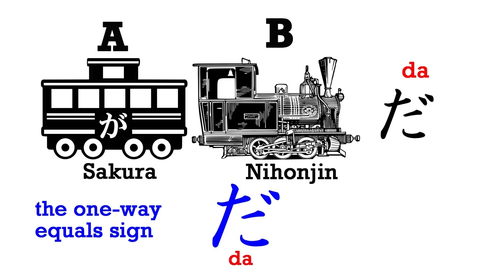
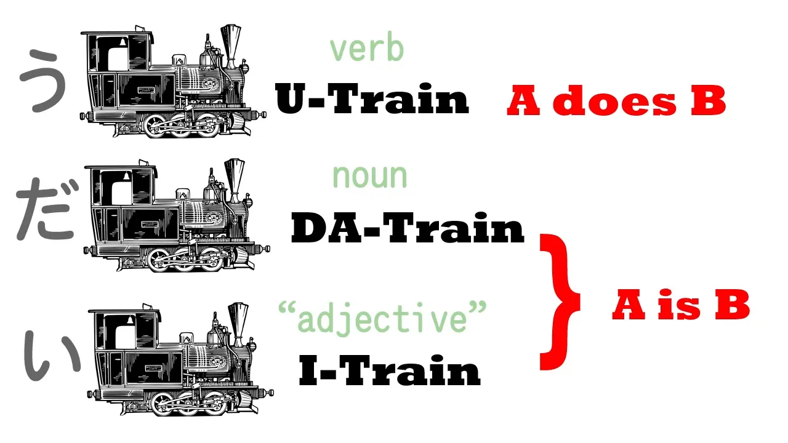

# **1. Jenis-Jenis Kalimat Dasar**

[**Pelajaran 1: Bahasa Jepang yang Mudah! Hal yang tak pernah diajarkan di sekolah. Kalimat inti dalam bahasa Jepang - bahasa Jepang yang alami**](https://www.youtube.com/watch?v=pSvH9vH60Ig&amp;list;=PLg9uYxuZf8x_A-vcqqyOFZu06WlhnypWj&amp;ab;_channel=OrganicJapanesewithCureDolly)

Hal paling mendasar tentang bahasa Jepang adalah kalimat inti bahasa Jepang. Setiap kalimat bahasa Jepang pada dasarnya memiliki inti yang sama. Seperti apa bentuknya? Begini bentuknya.

Kita akan membayangkannya sebagai sebuah Kereta kalimat. Setiap kalimat bahasa Jepang memiliki dua elemen ini: **gerbong utama, A** dan **lokomotif, B**. **Engine adalah yang membuat kalimat bergerak, yang membuatnya berfungsi.** **Gerbong harus ada karena tanpa gerbong-gerbong, tidak ada yang bisa digerakkan oleh engine**. Kedua hal tersebut adalah inti dari setiap kalimat bahasa Jepang.

Kita bisa menjelaskan lebih lanjut tentang A; kita bisa menjelaskan lebih lanjut tentang B; kita bisa menggabungkan kalimat-kalimat logis untuk membentuk kalimat kompleks. **Namun, setiap kalimat dalam bahasa Jepang mengikuti tipe dasar ini.**

Jadi, apa itu A dan B? Mari kita mulai dengan mengingat kembali bahwa dalam bahasa apa pun hanya ada dua jenis kalimat: <code>A is B</code> kalimat dan <code>A does B</code> kalimat. Contoh dari <code>A does B</code> kalimat adalah <code>Sakura walks</code>. Contoh dari <code>A is B</code> kalimat adalah <code>Sakura is Japanese</code>.

Dan kita bisa mengubahnya menjadi bentuk lampau; kita bisa mengubahnya menjadi bentuk negatif; kita bisa mengubahnya menjadi pertanyaan; kita bisa menjelaskan lebih lanjut tentang A; kita bisa menjelaskan lebih lanjut tentang B. Namun, **pada akhirnya, setiap kalimat bermuara pada salah satu dari ini: sebuah <code>A is B</code> atau <code>A does B</code> kalimat.**

Jadi, mari kita lihat bagaimana kita melakukannya dalam bahasa Jepang.

## Kalimat kata kerja

Dalam bahasa Jepang, jika kita ingin mengatakan <code>Sakura walks</code> (A melakukan B: Sakura berjalan), maka A adalah Sakura, gerbong utama, dan B adalah berjalan, hal yang dilakukannya, engine dari kalimat tersebut.

Berjalan dalam bahasa Jepang adalah <code>あるく</code>. Kita membutuhkan satu hal lagi untuk membentuk kalimat inti dalam bahasa Jepang, dan **itulah kunci dari setiap kalimat, が** (ga). 

**&quot;が&quot; adalah pusat tata bahasa Jepang. Setiap kalimat Jepang berputar di sekitar が. Dalam beberapa kalimat, kita mungkin tidak dapat melihat &quot;が&quot;, tetapi ia selalu ada, dan selalu melakukan tugas yang sama. Ia menghubungkan A dan B dan mengubahnya menjadi sebuah kalimat.** Jadi, inti <code>A does B</code> adalah <code>**さくらが**あるく</code> = <code>**Sakura** walks</code>.

## Kalimat kopula

Sekarang mari kita ambil kalimat &quot;A adalah B&quot;: <code>Sakura is Japanese</code>, atau, seperti yang kita katakan, <code>Sakura is a Japanese person</code>. Jadi, A lagi adalah Sakura, B adalah にほんじん / 日本人, yang berarti orang Jepang, dan **sekali lagi kita membutuhkが untuk menghubungkannya. Jadi kita akan membayangkan mobil A, gerbong utama, dengan が di atasnya, karena gerbong utama, subjek kalimat, selalu membawa が, untuk menghubungkannya dengan Engine.**

Jadi, さくらが日本人 – dan kita butuh satu hal lagi. Ada satu hal lain yang ingin saya ajarkan kepada Anda, yaitu だ (da). <code>さくらが日本人だ</code> = <code>Sakura is a Japanese person</code>.

Sekarang, mungkin Anda pernah menjumpai だ dalam bentuknya yang lebih rumit, です, tetapi ada alasan yang sangat baik untuk mempelajari bentuk yang sederhana dan lugas terlebih dahulu. Jadi, kita akan mempelajari だ. Sekarang, jika Anda melihat だ, bentuknya mirip tanda sama dengan yang dibatasi kotak di sebelah kiri. Dan ini adalah mnemonik yang sempurna untuk menjelaskan fungsinya, karena **だ memberi tahu kita bahwa A adalah B.**

Mengapa dibatasi kotak di sebelah kiri? Karena aturan ini hanya berlaku satu arah. Pikirkan secara logis: さくらが日本人だ berarti <code>Sakura = Japanese person.</code> Tapi tidak berlaku sebaliknya: Orang Jepang adalah Sakura – mereka tidak semuanya Sakura. Sakura adalah orang Jepang, tetapi orang Jepang belum tentu Sakura.

## Kalimat kata sifat

Jadi sekarang kita memiliki sebuah <code>A is B</code> kalimat dan <code>A does B</code> kalimat. Ada satu bentuk lagi dari kalimat inti dalam bahasa Jepang, karena kalimat ini memiliki tiga bentuk. Bentuk ketiga adalah ketika kita memiliki kata sifat.

**Dalam bahasa Jepang, kata sifat berakhir dengan い** (i), sama seperti dalam bahasa Inggris: happy, sunny, cloudy, silly. Dalam bahasa Jepang pun sama: happy – うれしい / 嬉しい; sad – かなしい / 悲しい; blue – あおい / 青い.

Sekarang, kita tidak perlu mempelajari semua ini, tetapi kita perlu mengetahui tentang kata sifat dalam bahasa Jepang yang berakhiran い karena kata-kata tersebut membentuk jenis kalimat ketiga. Jadi, mari kita ambil contoh yang mudah: ペン (itu adalah kata yang mudah karena artinya pena) – <code>ペンが赤い/あかい</code> = <code>pen is red</code>.

Sekarang, perhatikan bahwa kita tidak memiliki だ pada kalimat ini. Mengapa demikian? **Karena kata sifat い あかい / 赤い (merah) – itu tidak berarti merah, melainkan berarti &quot;berwarna merah&quot;. Fungsi だ, fungsi sama dengan, sudah terintegrasi dalam kata sifat い tersebut.**

Jadi, itulah tiga bentuk kalimat dalam bahasa Jepang. **Semua dimulai dengan subjek kalimat, semuanya dihubungkan dengan が**, dan dapat diakhiri dengan tiga cara: dengan kata kerja, yang akan diakhiri dengan う, dengan kopula だ, atau dengan い karena kata terakhir adalah kata sifat. Dan sekarang Anda sudah mengetahui dasar-dasar bahasa Jepang.

