# **10. Kata kerja bantu &amp; kata kerja bantu potensial**

[**Pelajaran 10: <code>Japanese conjugation</code> mitos terbantahkan! Juga, rahasia bentuk kata kerja potensial terungkap**](https://www.youtube.com/watch?v=qcOhHmU0znI&amp;list;=PLg9uYxuZf8x_A-vcqqyOFZu06WlhnypWj&amp;index;=12)

こんにちは。

Hari ini kita akan membahas kata kerja bantu utama dan bentuk potensial. **Ketika saya mengatakan <code>the main helper-verbs</code>, saya mengacu pada apa yang disebut dalam deskripsi tata bahasa Jepang Barat standar sebagai <code>conjugation</code>.** Dan saya hanya menyebutkan kata ini karena saya tidak ingin Anda bingung jika melihat <code>conjugation</code> disebutkan di tempat lain. 

Ketika mereka membicarakan <code>conjugation</code>, inilah yang mereka maksud. **Namun sebenarnya tidak ada yang namanya konjugasi dalam bahasa Jepang.** **Yang kita lakukan hanyalah menambahkan kata bantu ke empat akar kata kerja.** Dan ada banyak kata bantu, dan sebagian besar di antaranya hanyalah soal kosakata tambahan selama Anda tidak menganggapnya sebagai konjugasi. 

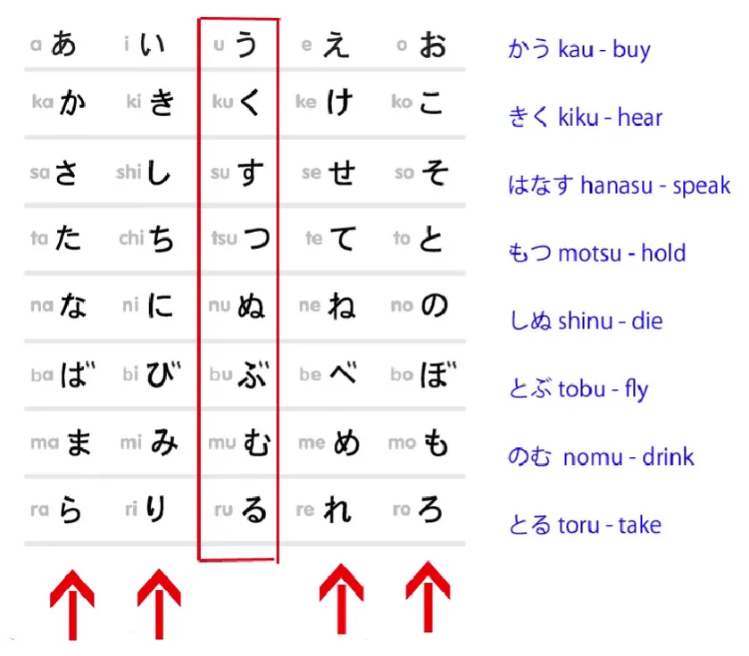

Dalam beberapa kasus, kata-kata tersebut disebut <code>conjugation</code>, dalam kasus lain tidak, dan prosesnya selalu sama setiap kali. Satu-satunya perbedaan adalah bahwa beberapa di antaranya kebetulan, dan hanya secara samar-samar, menyerupai konjugasi Eropa, sedangkan yang lain tidak. Berbagai kebingungan muncul karena mengacaukan kata bantu dan kata sifat bantu dalam bahasa Jepang dengan konjugasi, tetapi karena kita tidak akan menggunakannya, kita tidak perlu khawatir tentang hal itu di sini. Baiklah.

## Kata kerja bantu potensial

Jadi, kata kerja bantu utama pertama yang akan kita bahas adalah kata kerja potensial. Nah, kita sudah membahas, bukan, tentang kata-kata bantu. Kita telah membahas kata sifat bantu <code>ない</code>, yang membentuk kalimat negatif, dan <code>たい</code>, yang digunakan untuk menunjukkan keinginan akan suatu tindakan.

Kita juga telah membahas kata kerja bantu <code>がる</code>, yang melekat pada kata sifat. **Sekarang kita akan membahas kata kerja bantu potensial, yang melekat pada A-stem &quot;え&quot;.** 

**Tidak banyak hal yang kita lakukan dengan akar kata &quot;え&quot;** dibandingkan dengan akar kata &quot;あ&quot; dan &quot;い&quot;, tetapi ada beberapa. Dan hanya satu di antaranya yang merupakan kata kerja, jadi tidak ada ruang untuk kebingungan di sini. **Kata bantu potensial memiliki dua bentuk, yaitu <code>-る</code> dan <code>-られる</code>.**

Orang-orang mungkin sedikit bingung dengan **bentuk godan dari kata kerja bantu** karena bentuknya **hanya satu karakter, yaitu る (ru).** Namun, hal itu tidak perlu membuat Anda khawatir sama sekali, dan karena kata kerja bantu ini hanya ditambahkan pada akar kata え, tidak dapat digunakan sendiri, sehingga sangat mudah dikenali. 

**<code>-られる</code> adalah bentuk kata bantu potensial yang melekat pada kata kerja ichidan** – dan kita sudah membahas kata kerja godan dan ichidan sebelumnya, bukan? Jadi, <code>かう</code> (beli) menjadi <code>かえる</code> (dapat dibeli); <code>きく</code> (mendengar) menjadi <code>きける</code> (dapat didengar); <code>はなす</code> (berbicara) menjadi <code>はなせる</code> (dapat berbicara); <code>もつ</code> (memegang) menjadi <code>もてる</code> (dapat-dipegang) dan seterusnya.

::: info
ubah menjadi akar kata &quot;え&quot; dan kemudian bentuk potensial godan &quot;る&quot;. Perhatikan juga ini…  

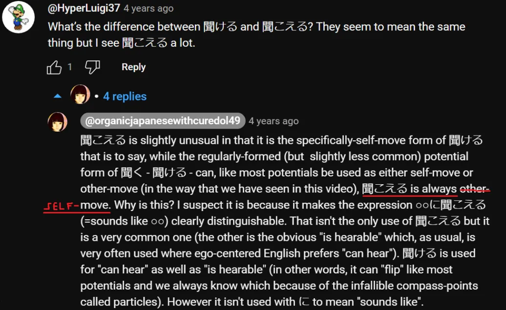

**Ada beberapa perbedaan dalam implikasinya, Dolly menjelaskannya lebih lanjut di LESSON 54.  
Dolly SEPAKAT membuat kesalahan di sini dengan menyebut &quot;聞こえる&quot; sebagai &quot;other-move&quot;, tetapi seharusnya &quot;self-move&quot; seperti yang ia implikasikan di awal komentar (+dibandingkan dengan sumber lain seperti Imabi).**
:::

**Dan dengan <code>たべる</code>, yang merupakan kata kerja ichidan**, kita melakukan apa yang selalu kita lakukan, **cukup lepaskan akhiran -る, dan tambahkan apa pun yang akan kita tambahkan.** Jadi <code>たべる</code> (makan) menjadi <code>たべられる</code> (dapat dimakan). Jadi ini sangat sederhana, bukan?

**Hanya ada dua pengecualian untuk pembentukan bentuk potensial ini, yaitu dua kata kerja tidak beraturan dalam bahasa Jepang, <code>くる</code> dan <code>する</code>.** <code>くる</code> menjadi <code>**こ**られる</code>, tetapi <code>する</code> secara mengejutkan menjadi <code>**できる**</code>. **できる adalah bentuk potensial dari <code>する</code>.**

Dan **ini adalah kata yang menarik karena juga berarti <code>come out</code>** – secara harfiah kata ini terdiri dari kanji <code>out</code> dan <code>come</code> – <code>出来る/できる</code>, 出る (keluar) 来る (datang)

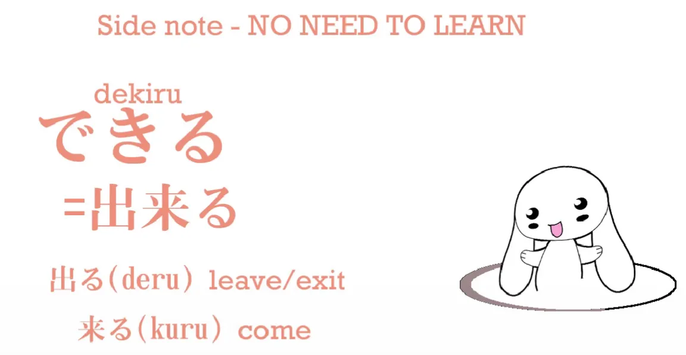

Dan jika kita mengatakan <code>にほんごが**できる**</code>, kita tidak mengatakan <code>I can do Japanese</code>, kita mengatakan <code>Japanese **is possible**</code> / ***<code>does</code> mungkin***

Dan jika kita mengatakan atau menyiratkan <code>わたしはにほんごが**できる**</code>, kita mengatakan, <code>To me, Japanese **is possible**</code>. 

:::info
*(Dolly memberikan <code>does possible</code> untuk menyiratkan bahwa A melakukan B; bukan A adalah B)* 
:::

Dan menarik jika Anda melihat seorang anak kecil mungkin mencoba membuat sesuatu dari kertas, dia mungkin berkata, <code>I&#x27;m trying very hard, but it won&#x27;t come out right</code> – dan inilah cara penggunaan &quot;できる&quot; dalam bahasa Jepang, bukan? Ada beberapa cara menarik di mana &quot;できる&quot; digunakan yang menunjukkan bagaimana gagasan tentang sesuatu yang mungkin dan sesuatu yang terwujud saling terkait erat dalam bahasa Jepang. Namun, kita tidak akan membahasnya sekarang – itu sedikit lebih lanjut.

Hanya ada satu area yang perlu diwaspadai dalam bentuk potensi, dan hal ini sangat mirip dengan topik yang kita bahas minggu lalu[[9]](./9-the-subject-of-the-japanese-sentence-expressing-desire- ほしい - たい - たがる.md). Jadi, jika Anda sudah melihat pelajaran tersebut, pelajaran ini seharusnya sangat mudah bagi Anda. Mari kita lihat kalimat tipikal: <code>ほんがよめる.</code>

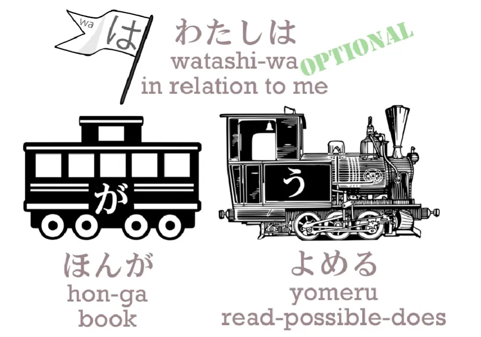

Sekarang, teks-teks standar biasanya menerjemahkan ini sebagai <code>I can read the book</code>. **Tapi itu bukan artinya**, seperti yang bisa Anda pahami dengan jelas jika Anda mengikuti pelajaran kami sebelumnya. Perhatikan di mana letak が. Apa yang ditandai oleh が? **Itu menandai buku!** Jadi, siapa penggerak kalimat ini? **Itu adalah buku.**

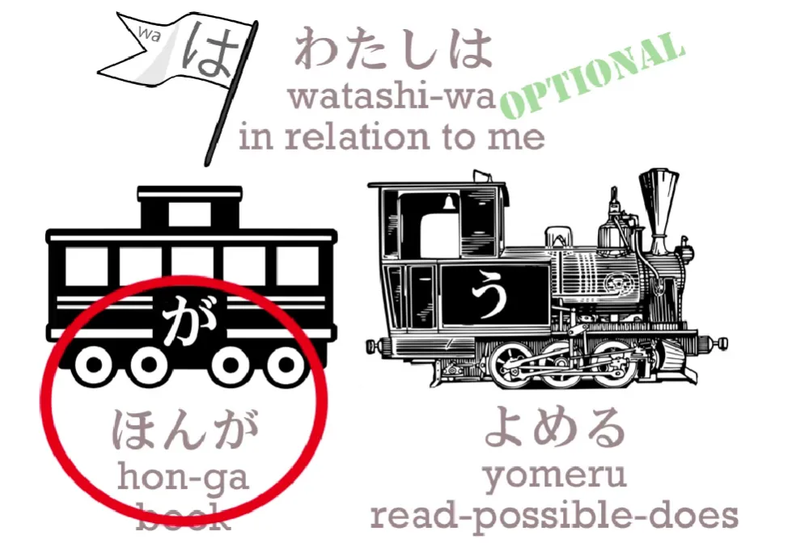

Kita sedang mengatakan sesuatu tentang buku tersebut. **Jadi buku adalah mobil utamanya dan <code>よめる</code> Engine.** Kita mengatakan **buku itu dapat dibaca, buku itu bisa dibaca.**

---

Jika kita menambahkan <code>わたしは</code>, kita mengatakan buku itu bisa dibaca <code>to me</code>. Yang secara harfiah kita katakan adalah, <code>In relation to me, the book is readable</code>. **Tapi ini tidak dan tidak bisa berarti, <code>I can read the book</code>.** Jika kita ingin mengatakan <code>I can read the book</code>, buku itu harus ditandai dengan を, bukan? Dan saya harus ditandai dengan が. Dan sebenarnya hal ini bisa dilakukan, **tapi bukan itu yang biasanya dilakukan.**

Tetapi ingat juga bahwa jika kita ingin menekankan ego, seperti yang diinginkan bahasa Inggris, maka kita harus mengubah partikelnya. Jika kita secara harfiah ingin mengatakan, <code>**I** can read the book</code> – <code>**わたしが**ほんをよめる</code>. 

---

Banyak orang menganggap ini bahasa Jepang yang buruk.

::: info
Saya kira ini bukan cara orang Jepang biasanya berbicara. Ini bisa disebut <code>Englishised</code> Bahasa Jepang karena menekankan ego terlebih dahulu, sebagai subjek, yang bukan cara berpikir orang Jepang pada umumnya.
:::

Bukan urusan kita untuk menentukan apakah itu bahasa Jepang yang buruk atau tidak. Intinya adalah bahwa sebagian besar waktu Anda akan melihat <code>**ほんがよめる**</code>, dan **<code>(わたしは)ほんがよめる</code> tidak bisa secara harfiah berarti <code>I can read the book</code>.** **Artinya <code>The book is readable</code>.**

::: info
Bisa dikatakan &quot;わたしは&quot; untuk menyiratkan bahwa buku itu bisa dibaca BAGI SAYA - sebuah topik, tapi biasanya tidak disebutkan
:::

Jadi itu cukup sederhana, dan asalkan kita ingat itu, kita tidak akan membuat semua partikel tersebut menjadi tidak masuk akal.

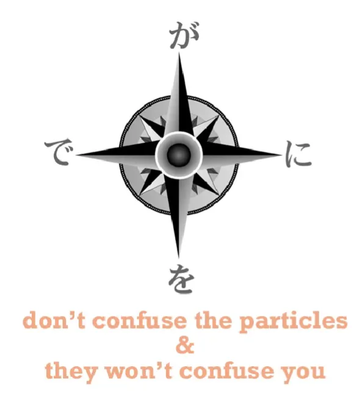

Jadi sebenarnya ini sangat mirip dengan pertanyaan yang kita bahas minggu lalu tentang - たい dan kata sifat keinginan. **Jika kita terus mengingat が dengan jelas di benak kita, semuanya akan jatuh pada tempatnya.** Dan sama seperti dengan bentuk たい - jika kita mengatakan, <code>(わたしは)ケーキがたべたい</code>, 

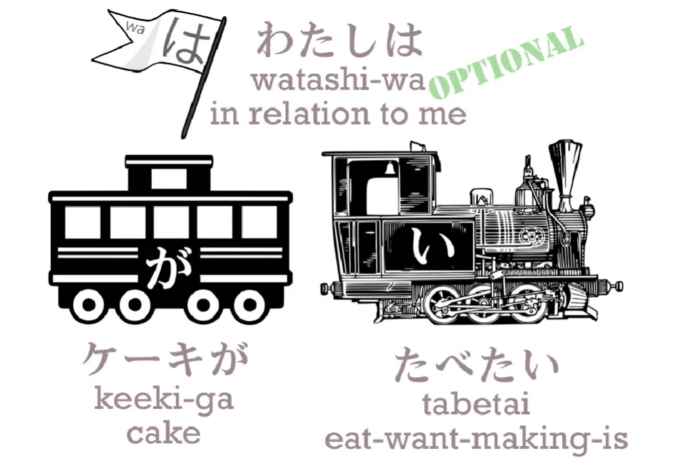

**kue itulah yang memicu keinginan** *(bagi saya secara pribadi - topik)*, tetapi jika kita hanya mengatakan <code>(わたしは)(zeroが)たべたい</code> yang kita maksud adalah <code>(In relation to me) (I) want to eat</code> / *ingin-makan-sedang*,

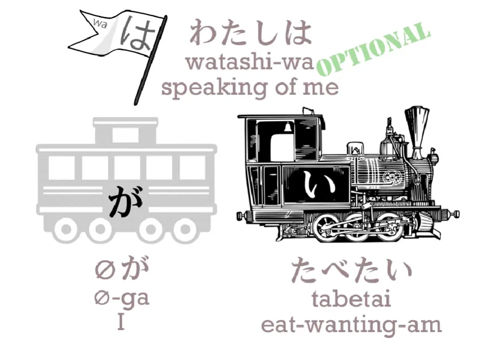

**karena ketika tidak ada makanan tertentu di sana yang menjadi objek keinginan, maka saya lah yang melakukan keinginan.** 

::: info

Saya adalah subjek yang hanya ingin makan sesuatu karena saya lapar; di sini saya juga merupakan topik

Namun, perhatikan bahwa tidak ada makanan di sana, jadi secara default menjadi <code>me</code>. Nol が (dan juga nol は) bergantung pada konteks situasi/kalimat, kata Dolly...

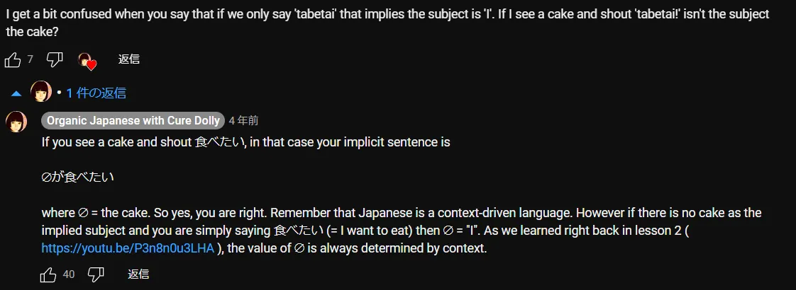
:::

Hal yang sama berlaku untuk bentuk potensial. Jadi kita mengatakan, <code>(わたしは)ほんがよめる</code> – <code>(to me) the book is read-able</code>,

tetapi jika kita hanya ingin mengatakan <code>I can read</code> – bukan &quot;Saya bisa membaca buku atau saya bisa membaca koran atau saya bisa membaca buku harian rahasia Sakura&quot;, tetapi <code>I can read</code> – maka kita mengatakan <code>わたしがよめる</code> atau hanya <code>よめる</code>, yang berarti <code>(zeroが)よめる</code>.

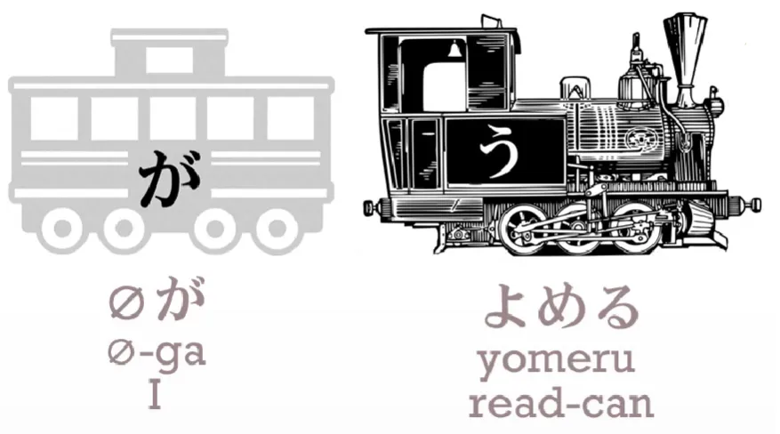

**Dan kita benar-benar telah menjadi subjek kalimat.** Dan saya yakin ada orang yang merasa ini membingungkan, tetapi jika Anda mengikuti pelajaran sebelumnya, ini seharusnya sudah sangat jelas. 

Dan ingatlah bahwa bahasa Jepang selalu saling menyatu seperti Lego,

jadi kata bantu potensial, bahkan ketika hanya berupa satu kana る(ru), hanyalah kata kerja ichidan biasa seperti kebanyakan kata bantu, dan kita bisa melakukan hal yang sama persis dengannya seperti yang bisa kita lakukan dengan kata bantu lainnya.

::: info
Saya kira Dolly bermaksud bahwa kata bantu potensi berfungsi seperti kata kerja ichidan, jadi jika menambahkan apa pun ke bentuk potensi, hilangkan akhiran る seperti pada kata kerja ichidan lainnya dan tambahkan ke akar kata え. Balasan Dolly di bawah satu [**komentar**](https://www.youtube.com/watch?v=qcOhHmU0znI&amp;lc;=UgxYARujuNXKheHlgNJ4AaABAg)

Verba <code>potential form</code> dari kata kerja godan adalah ichidan karena kata bantu &quot;る&quot; adalah ichidan… Godan hanyalah pengalih perhatian di sini. Segera setelah kita menambahkan kata bantu ichidan ke kata kerja godan, kita berurusan dengan entitas ichidan dan apa pun yang kita lakukan setelah itu mengikuti pola ichidan… Jadi tidak ada pertanyaan tentang kata kerja godan yang menjadi ichidan. Yang terjadi adalah kata kerja godan menambahkan kata bantu ichidan.
:::

**Kita akan selalu mengenali hal ini, karena ini adalah satu-satunya yang melekat pada akar kata &quot;え&quot;, dan kita dapat melakukan segala hal dengannya seperti yang kita lakukan pada kata kerja ichidan lainnya.**

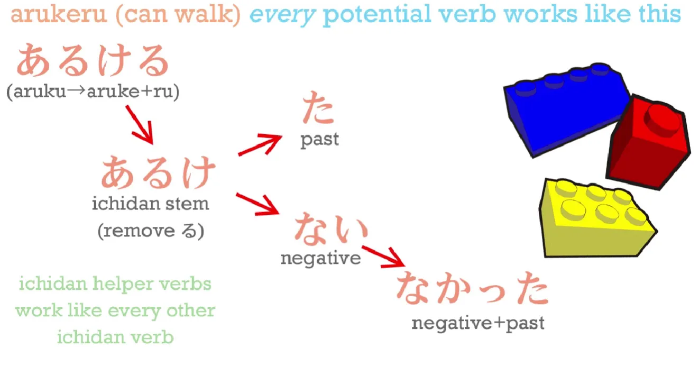

Jadi: <code>あるける</code> – bisa berjalan; <code>あるけない</code> – tidak bisa berjalan; <code>あるけた</code> – bisa berjalan; <code>あるけなかった</code> – tidak bisa berjalan. **Dan keteraturan ini sama bahkan dengan kata kerja tidak beraturan.** Jadi: できる – mungkin; <code>できない</code> – tidak mungkin; <code>できた</code> – pernah mungkin; <code>できなかった</code> – tidak mungkin.

Dan sesederhana itu.

::: info
Saya agak bingung, karena saya mencari 出来る / できる di Jisho dan ternyata menunjukkan bahwa kata tersebut memiliki bentuk potensial <code>できられる</code> yang menarik karena できる seharusnya sudah menyiratkan bentuk potensial. Saya mencari di beberapa [**forum Jepang**](https://ja.hinative.com/questions/6326424) (dan lainnya) dan sepertinya bahkan orang Jepang?? menganggap できられる aneh. Atau mungkin itu bentuk hormat?… Koreksi saya jika salah…  
Misalnya, 分かる juga tidak memiliki bentuk potensial, karena sudah menyiratkannya. [**Dolly menjelaskan**](https://japanese.stackexchange.com/questions/5988/why-doesnt-%e5%88%86%e3%81%8b%e3%82%8b-have-a-potential-form/48809#48809) <code>分かれる</code> adalah kata lain
:::

---

::: info
Saya juga akan menambahkan beberapa contoh kata kerja ichidan reguler.

<code>たべられる</code> - bisa makan; <code>たべられない</code> - tidak bisa makan;  
<code>たべられた</code> - bisa makan; <code>たべられなかった</code> - tidak bisa makan.
:::
