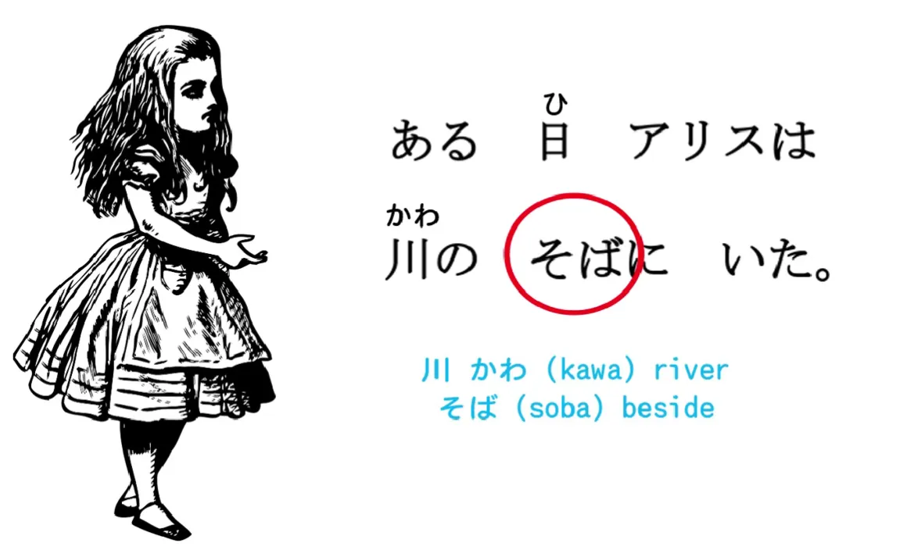
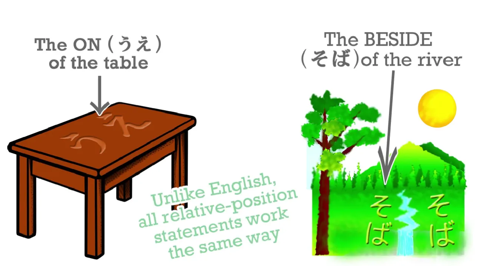
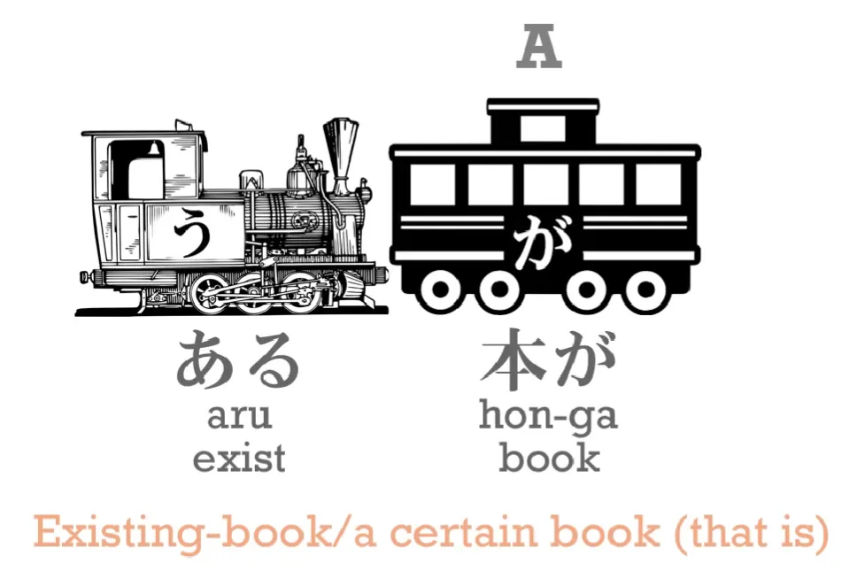
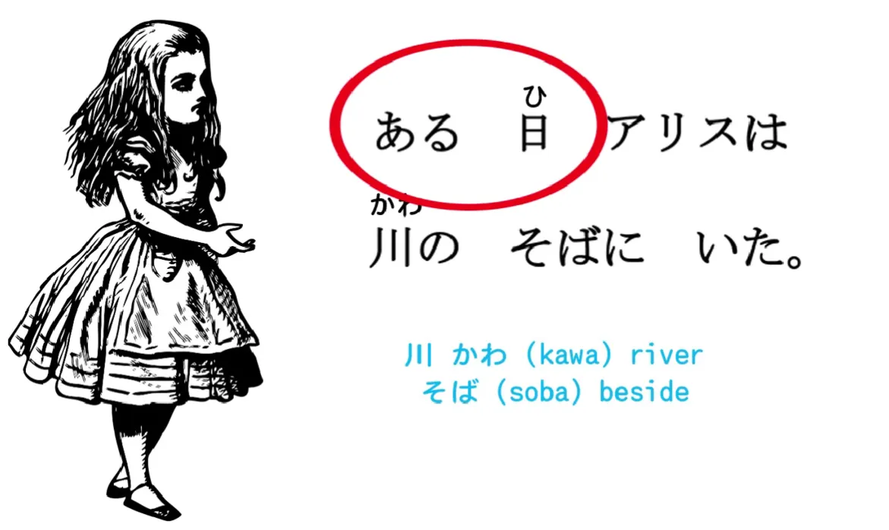
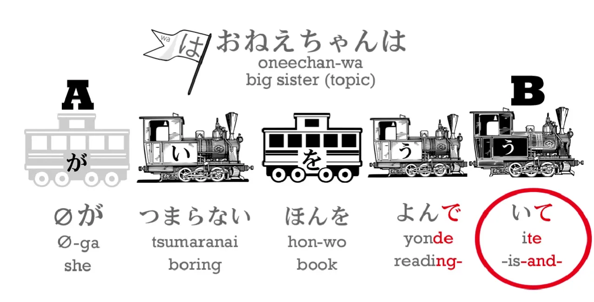
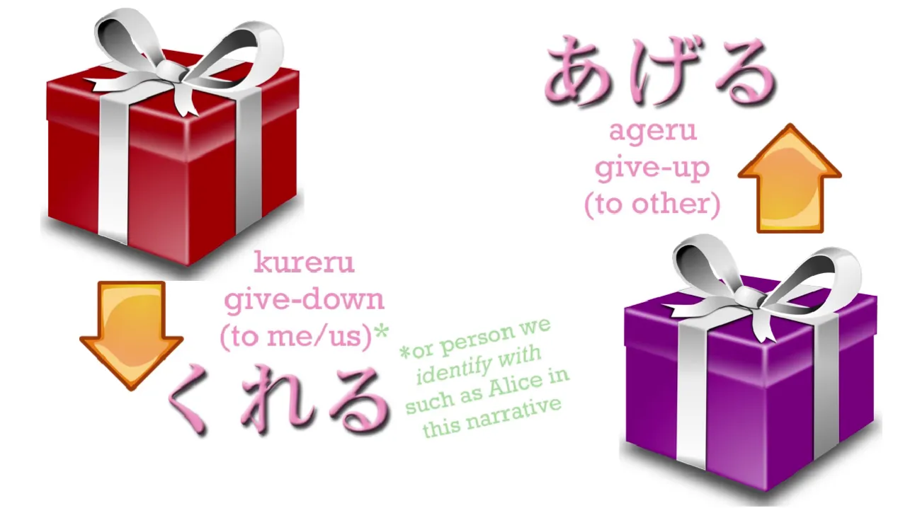
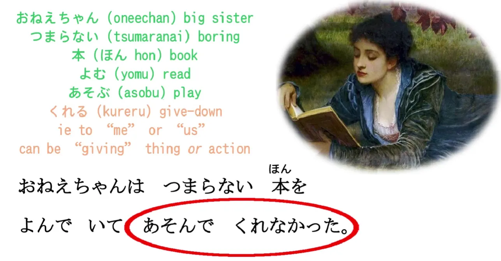
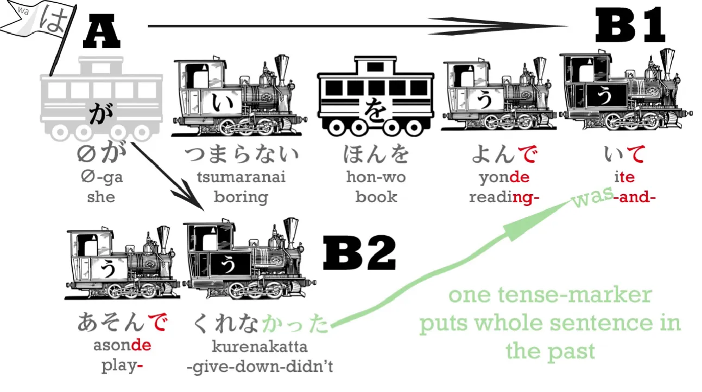

# **11. Kalimat Majemuk, くれる, あげる, dan Penggunaan Lain dari Bentuk-te**

[**Pelajaran 11: Kalimat majemuk, kureru, ageru, serta penggunaan lain dari Bentuk-te**](https://www.youtube.com/watch?v=3X2ZCWazrDw&list=PLg9uYxuZf8x_A-vcqqyOFZu06WlhnypWj&index=13)

こんにちは。

Kita telah berhasil menyelesaikan sepuluh pelajaran dasar, dan kini saatnya untuk sedikit mengubah suasana. Berbekal ilmu yang sudah kita kumpulkan, kita sekarang sudah cukup mumpuni untuk mulai membedah teks narasi (cerita) yang sesungguhnya. Awalnya kalimat yang kita bedah memang sedikit disederhanakan, tetapi kita akan menggunakannya sebagai sarana untuk merangkai dan mengintegrasikan semua logika yang telah kita pelajari sejauh ini. 

Tentu saja, kita juga akan terus mempelajari elemen struktural baru, karena bahkan di dalam cerita paling sederhana sekalipun, selalu ada hal baru yang bisa kita gali. Membedah cerita seperti ini akan membuat proses belajar jadi jauh lebih menarik.

Mari kita langsung bedah sebuah cerita klasik yang saya yakin kita semua sudah familier (Alice in Wonderland).

## Membedah Kalimat 1: Lokasi dan Kata Sifat "ある"

> `ある日アリスは川のそばにいた。` (Aru hi Arisu wa kawa no soba ni ita).

Nah, ini adalah contoh kalimat yang sangat sederhana. Kata `川 / かわ` berarti `sungai`. **Dan kata `そば` berarti `samping / di dekat`, dan secara tata bahasa kata ini berstatus sebagai kata benda.** 

Jadi, `川のそば` (kawa no soba) secara harfiah berarti `samping milik sungai` atau `tepi sungai`. Sama halnya ketika kita meletakkan sesuatu 'di atas' meja atau 'di bawah' meja, **kita selalu menandai kata benda penunjuk posisi tersebut dengan partikel `に` (ni)**. Begitu pula di sini, 'tepi sungai' adalah lokasi *keberadaan* tempat Alice berada, sehingga ia ditandai dengan `に`.

Lalu, apa maksud dari kata `ある日` (Aru hi) di awal kalimat? `ある` berarti `suatu`, jadi `ある日` artinya `suatu hari` atau `pada hari tertentu`. Perhatikan baik-baik: fenomena yang terjadi di sini sebenarnya adalah aplikasi dari trik yang sudah pernah kita bahas di pelajaran tentang kata sifat.[[6]](./6-adjectives.md)

**`ある` (aru) aslinya adalah sebuah kata kerja yang berarti `ada` atau `eksis`.**
**Kita tahu bahwa kita BISA menyulap *engine* apa pun menjadi sebuah kata sifat.** 

Jika `ある` dibiarkan beroperasi sebagai *engine* utama di akhir kalimat, contohnya `本がある`, maka artinya adalah kalimat tindakan normal: `Sebuah buku ada / eksis`.

**Namun, jika kita memindahkan *engine* `ある` ke posisi depan di sebelah kiri kata 'buku', kita menyulapnya menjadi *engine* putih (sebagai pemodifikasi/kata sifat).** Sehingga frasa `ある本` maknanya berubah menjadi `sebuah buku yang eksis / sebuah buku tertentu / suatu buku`. 

Logika yang sama persis berlaku di sini: `ある日` = `suatu hari`.

Jadi, makna utuh kalimat pertama adalah:
`ある日アリスは川のそばにいた` -> **Suatu hari, Alice berada di tepi sungai.**

Sekarang, kalimat berikutnya akan sedikit lebih rumit, tapi jangan panik. Semuanya akan terasa mudah jika kamu punya sebuah *android* fungsional untuk membantumu membedahnya. (Yah, meskipun tubuh *android* saya aslinya belum berfungsi sepenuhnya, tapi khusus untuk mengajarimu bahasa Jepang, anggap saja saya sudah berfungsi penuh!)

## Membedah Kalimat 2: Kalimat Majemuk dan Kureru/Ageru

> `おねえちゃんはつまらない本をよんでいてあそんでくれなかった。` (Onee-chan wa tsumaranai hon o yonde ite asonde kurenakatta).

Ini adalah kalimat yang cukup panjang dan kompleks. Mari kita mutilasi satu per satu. 

- `おねえちゃん` berarti `kakak perempuan`: `ねえ` adalah `kakak`; akhiran `-ちゃん` adalah panggilan sayang/akrab; dan awalan `お-` adalah penanda hormat. 
- `つまらない` berarti `membosankan` atau `tidak menarik`. 
- `本`, seperti yang kita tahu, adalah `buku`. 
- `よむ` berarti `membaca`. Jika kita ubah ke bentuk-te dan ditambah `いる` menjadi `よんでいる`, artinya menjadi *continuous* (`sedang membaca`). Lalu, *engine* `いる` itu sendiri kita seret lagi ke dalam bentuk-te menjadi **`よんでいて`**.

Lalu buat apa kita repot-repot melakukan dua kali perubahan bentuk-te itu? Mari kita lihat alasannya. 

`おねえちゃんはつまらない本をよんでいて` – `Kakak perempuan sedang membaca buku yang membosankan [dan...]`.
**Bentuk-te (`て`) itu sangat sakti dan memiliki banyak sekali kegunaan.** **Dalam kasus ini, bentuk-te bertugas untuk menempelkan dan menjembatani antar-klausa.** 

Kalimat `Kakak perempuan sedang membaca buku yang membosankan` itu sebenarnya sudah bisa berdiri sendiri sebagai satu klausa lengkap, bukan? 

**Tetapi, dengan menyulap *engine* di akhir klausa tersebut menjadi bentuk-te (`て`), kita sedang memberikan "lampu sein" kepada pendengar bahwa MASIH ADA kelanjutan cerita yang akan mengikuti klausa ini.** **Ini adalah trik bahasa Jepang untuk merakit sebuah kalimat majemuk (kalimat yang terdiri dari dua klausa atau lebih).** 

Jadi, ini persis seperti meletakkan kata sambung **"dan..."**. "Kakak perempuan sedang membaca buku yang membosankan **dan...**" 
Sesuatu yang lain akan terjadi: `"あそんでくれなかった"`. 

`あそぶ` berarti `bermain`, dan di sini ia juga ditampar ke dalam bentuk-te menjadi `あそんで`. 
(Jika kamu mulai lupa bagaimana merakit wujud-te ini, silakan tonton ulang pelajaran tentang Bentuk-te untuk menyegarkan ingatanmu.[[5]](./5-verb-groups-and-the-te-form.md))

Lalu, apa maksud dari `あそんでくれなかった`? 

Ini adalah fungsi super penting lainnya dari bentuk-te. `あそぶ` = bermain. Lalu apa itu `くれる`?
`くれる` (Kureru) berarti `memberi`. **Namun secara spesifik, kata ini mengandung filosofi arah: `memberi ke BAWAH`.** 

Kenapa bahasa Jepang memakai konsep "memberi ke bawah"? Karena budaya Jepang menuntut kita untuk selalu merendahkan diri dan bersikap sopan kepada orang lain. **Jadi, secara hierarki tata bahasa, kita selalu memosisikan diri kita (pembicara) berada 'di bawah', dan memosisikan orang lain 'di atas' kita.** 

**Aturan mutlaknya: Jika saya menggunakan kata `くれる` (memberi), saya SELALU bermaksud bahwa ada orang lain yang sedang memberikan sesuatu KEPADA SAYA (atau kepada anggota kelompok internal saya).** 

Lalu kembali ke cerita tadi: apa sih benda yang diberikan—atau lebih tepatnya *tidak* diberikan—oleh sang kakak kepada Alice?

Ternyata itu bukan buku. Faktanya, sang kakak sama sekali tidak memberikan wujud benda fisik apa pun. **Sang kakak sedang memberikan sebuah TINDAKAN melalui bantuan bentuk-te.** Ia memberikan—atau dalam cerita ini, gagal memberikan—'tindakan bermain' kepada Alice.

Apa maksud konsep "memberikan tindakan" ini? 
**Di bahasa Jepang, kita tidak hanya memakai `くれる` untuk memberikan barang (buku, kado, permen), tetapi kita juga sangat sering memakainya untuk 'memberikan sebuah tindakan' atau 'melakukan kebaikan demi kepentingan seseorang'.** Konsep "memberi tindakan/jasa" ini SANGAT SERING digunakan dalam bahasa Jepang, jadi kamu wajib menguasai logikanya. 

- Jika ada seseorang melakukan suatu kebaikan demi kepentingan kita (atau kelompok kita), kita ubah tindakan tersebut ke dalam bentuk-te lalu kita tempelkan `くれる` (kureru). 
- Sebaliknya, jika KITA yang melakukan kebaikan demi kepentingan orang lain, kita ubah tindakan tersebut ke bentuk-te lalu kita tempelkan **`あげる` (ageru)**. `あげる` bermakna `memberikan ke ATAS` (karena kita memosisikan diri kita di bawah dan menyanjung penerimanya di atas).

Singkatnya:
- `くれる` (kureru) = Orang lain memberikan/melakukan sesuatu **KE BAWAH** kepada saya (atau kelompok saya).
- `あげる` (ageru) = Saya memberikan/melakukan sesuatu **KE ATAS** kepada kamu (atau kelompok luar).

Kembali ke ekor kalimat cerita kita: `あそんでくれなかった`. 
Artinya: "Sang kakak tidak bermain demi kepentingan Alice / tidak memberikan bantuan untuk menemani Alice bermain."

Konsep "memberikan tindakan" ini mungkin terdengar agak asing buat penutur bahasa Inggris atau Indonesia, karena kita biasanya cuma bilang "Kakaknya nggak mau nemenin main". Tetapi konsep ini sangat kaya makna dan ekspresif. 

Jadi, mari kita lihat kalimat utuhnya secara lengkap: 
`おねえちゃんはつまらない本をよんでいてあそんでくれなかった` 
**-> Kakak perempuan sedang membaca buku yang membosankan dan tidak (mau) bermain [dengan Alice].** 

Perhatikan baik-baik bahwa **ada dua klausa yang berdiri di sini**: 
*Klausa 1:* Kakak perempuan membaca buku yang membosankan (`おねえちゃんはつまらない本をよんだ`)
*Klausa 2:* Kakak perempuan tidak bermain demi Alice (`おねえちゃんはあそんでくれなかった`)

**Dan kita telah sukses menjahit kedua klausa tersebut menggunakan benang bentuk-te (`て`).**

---

## Aturan Penanda Waktu (*Tense*) pada Kalimat Majemuk

**Satu fakta pamungkas yang wajib kamu perhatikan di sini adalah: klausa gantung `おねえちゃんはつまらない本をよんでいて` SAMA SEKALI TIDAK memberi tahu kita zona waktunya (*tense*).** 

Saat kita baru mendengar separuh kalimat itu, kita tidak tahu apakah sang kakak sedang membaca buku saat ini (sekarang), di masa depan, atau di masa lalu. Kita baru akan tahu zona waktunya saat kita mendengarkan kata terakhir di ujung kalimat. 

Dalam bahasa Inggris atau Indonesia, kita biasanya memasang penanda waktu pada kedua sisi kalimat majemuk. (Contoh: Kakak *TADI* sedang membaca buku dan dia *TADI* tidak mau bermain). 

**Namun dalam bahasa Jepang, kita cukup meletakkan satu penanda waktu (-た untuk lampau, atau -なかった untuk lampau negatif) di PALING AKHIR kalimat saja. Satu penanda waktu di ujung kalimat itu sudah cukup untuk menyeret seluruh klausa di depannya masuk ke zona waktu yang sama.**

Frasa gantung `よんでいて` (sedang membaca) tidak punya waktu. **Tetapi karena ekor kalimatnya ditutup dengan `あそんでくれなかった` (tidak bermain *di masa lalu*), maka secara otomatis kita tahu bahwa keseluruhan kejadian membaca itu juga terjadi di masa lalu.**

Nah, kita memang belum membahas terlalu jauh soal detail petualangan Alice hari ini. Tetapi seiring berjalannya waktu, kita akan melaju jauh lebih cepat karena kamu sudah mulai terbiasa merakit teks asli dan mengupas tuntas struktur naratif dasar bahasa Jepang!
