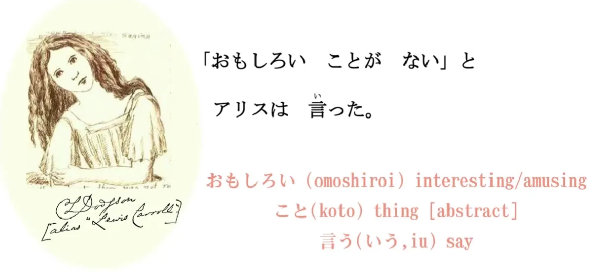
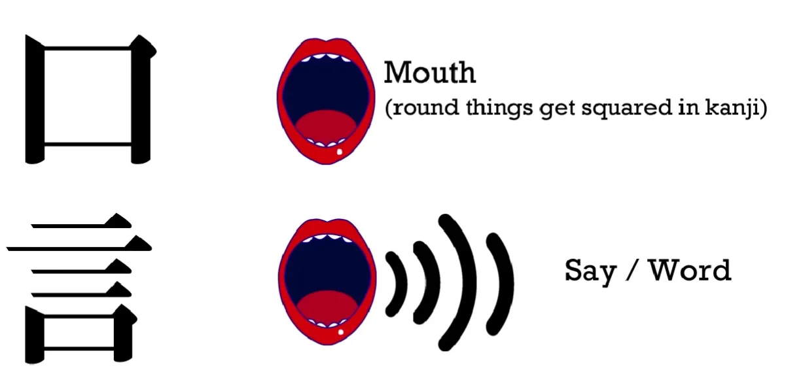
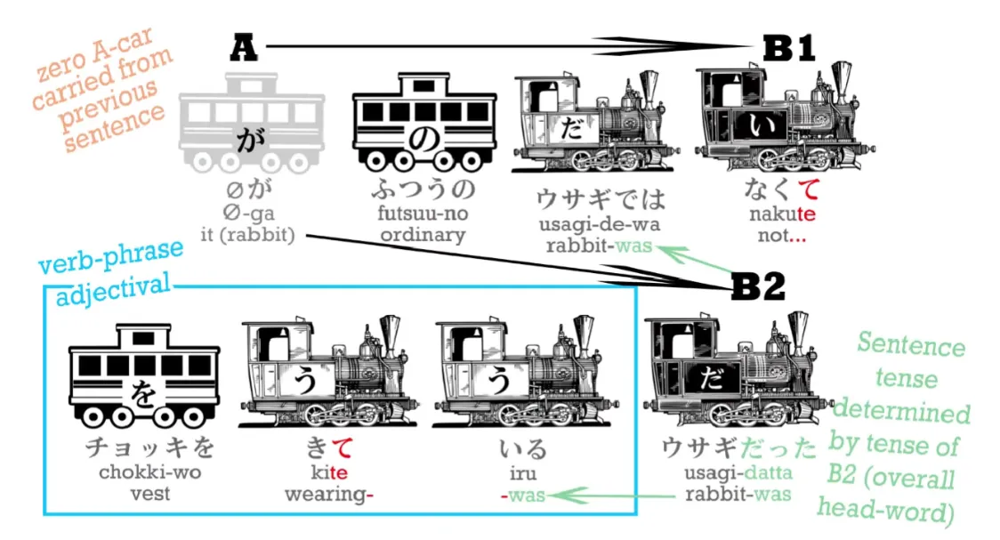
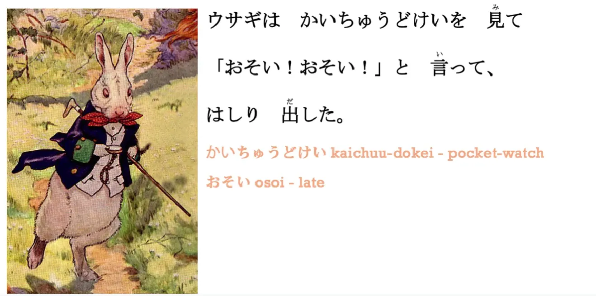
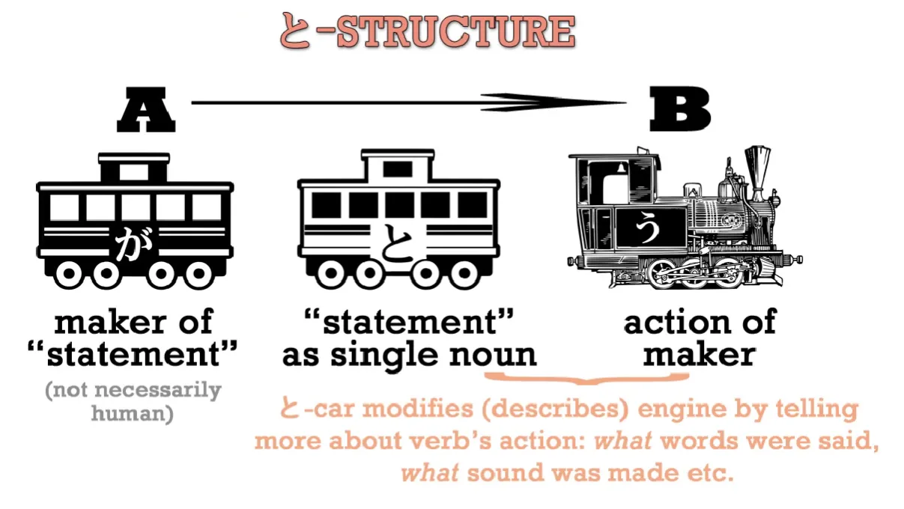
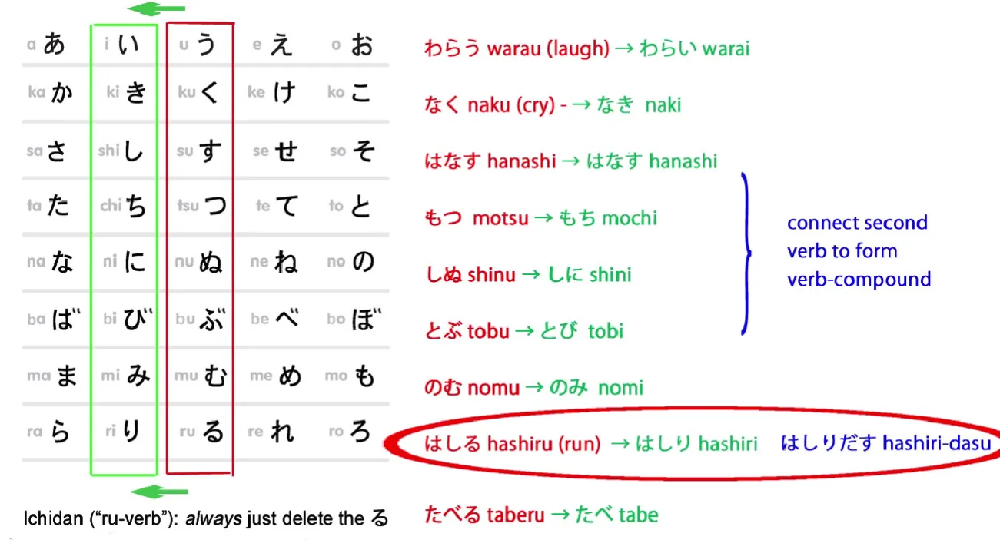
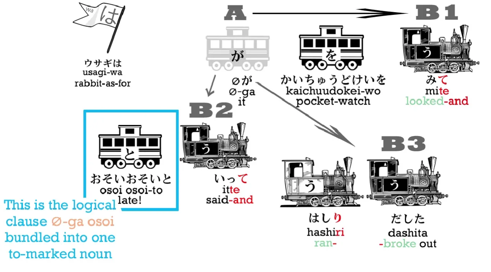
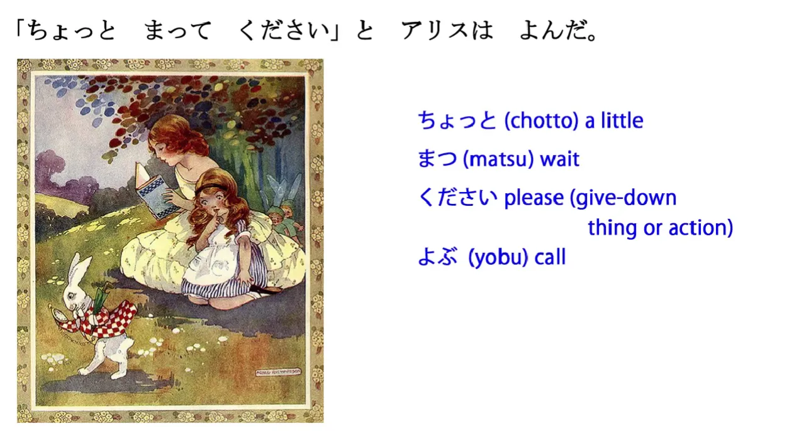
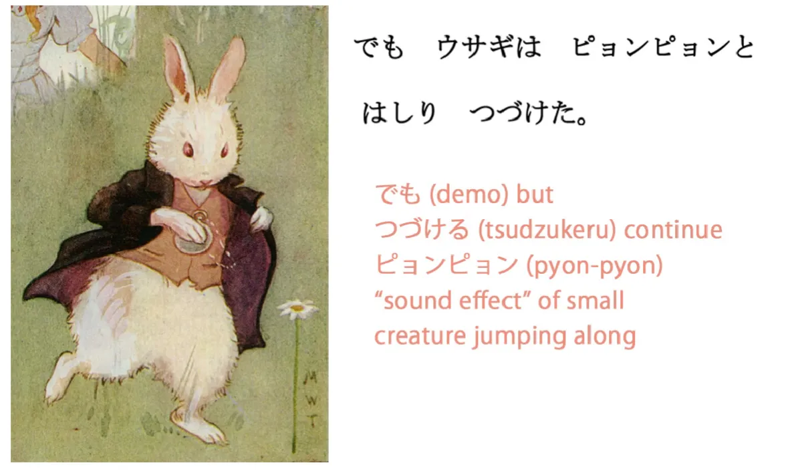

# **12. Partikel kutipan &quot;と

&quot;, kata kerja majemuk &amp; kata benda majemuk** 

[**Pelajaran 12: Rahasia partikel kutipan &quot;と

&quot; - ditambah kata kerja majemuk, kata benda majemuk - dan Lebih Banyak Alice!**](https://www.youtube.com/watch?v=7dYT6Xf1BkA&amp;list;=PLg9uYxuZf8x_A-vcqqyOFZu06WlhnypWj&amp;index;=14)

こんにちは。

Hari ini kita akan melanjutkan pelajaran naratif yang kita mulai minggu lalu. Dan kali ini kita bisa melanjutkannya sedikit lebih cepat. Jadi, mari kita segarkan kembali ingatan kita tentang cerita yang telah kita baca sejauh ini.

&gt;ある日アリスは川のそばにいた。

(Suatu hari Alice berada di tepi sungai.)

&gt;お姉ちゃんはつまらない本をよんでいてあそんでくれなかった。

(Kakak perempuannya sedang membaca buku yang membosankan dan tidak bermain dengan Alice.)

&gt;「おもしろいことがない

」とアリスは言った。

「おもしろい

」 berarti `menarik atau lucu`; 「こと

」 berarti `sesuatu`. Dan dalam bahasa Jepang, ada dua kata umum untuk `sesuatu`, yaituもの

danこと

.

Sekarang, **sebuahもの

adalah benda dalam arti yang paling umum: benda fisik – topi, buku, sepasang kacamata, Gunung Fuji.** **こと

adalah jenis `benda` yang lebih abstrak: suatu urusan, suatu hal, suatu keadaan.** Jadi, ketika kita berkata, `Is there anything in that box?` (Apakah ada sesuatu di dalam kotak itu?), yang kita maksud adalahもの

. Dan ketika kita berkata, `The thing is...` (Masalahnya adalah...), yang biasanya kita maksud adalahこと

. 

Jadi, 「おもしろいことがない

」berarti `Tidak ada hal menarik yang terjadi di sini, tidak ada keadaan yang menarik.`

言った

－言う

berarti `say` dan Anda bisa melihatnya seperti mulut dengan gelombang suara yang keluar darinya. 

**Namun, hal penting yang perlu diperhatikan di sini adalah partikel kecilと

.**

**Sebenarnya ada dua partikelと

:** satu berarti `dan` dan sangat sederhana; **yang lainnya adalah apa yang kita sebut `partikel kutipan`**, dan itulah yang akan kita bahas di sini. **Ketika kita mengutip seseorang yang mengatakan sesuatu atau bahkan yang memikirkan sesuatu, kita menggunakan partikel iniと

. Ini seperti tanda kutip yang bisa didengar.** 

Seperti yang Anda lihat, kita menggunakan tanda kutip persegi dalam bahasa Jepang, yang setara dengan tanda kutip dalam bahasa Inggris, **tetapi kita juga menggunakanと

.** Jadi, kita tidak hanya mengatakan, ` &#x27;Nothing interesting is happening,&#x27; Alice said`. Kita mengatakan, ` &#x27;Nothing interesting is happening,&#x27; **と

** Alice said`. Sekarang,と

adalah partikel yang sangat menarik secara struktural dan kita akan membahasnya lebih dalam beberapa menit lagi.

&gt;そのとき、白いウサギがとおりすぎた。

「そのとき

」:その

berarti `itu` danとき

berarti `waktu`, jadi kita secara harfiah mengatakan `waktu itu`, ` tetapi ini lebih mirip dengan mengatakan ` saat itu / pada saat itu / pada waktu itu. **Jadi kita menggunakannya sama seperti kita menggunakan ungkapan waktu relatif lainnya: kita tidak perlu menambahkan &quot;に

&quot; atau apa pun, kita cukup menyebutkan waktunya dan kemudian melanjutkan dengan apa yang terjadi pada saat itu.**

Dalam kalimat ini, inti dari 「そのとき

」 adalah bahwa tepat pada saat itu ketika Alice mengatakan bahwa tidak ada hal menarik yang terjadi, tepat pada saat itu, hal ini terjadi.

そのとき、白いウサギがとおりすぎた。

白い

berarti `putih`; ini adalah kata sifat yang berasal dari kata benda (い

).ウサギ

berarti `kelinci`. Dan 「とおりすぎた

」terdiri dari dua kata, dan ini melakukan sesuatu yang akan kita temui berulang kali dalam bahasa Jepang. **Ini menggunakan akar kata `い

` dari satu kata kerja untuk menggabungkan kata kerja lain guna memberikan makna tambahan.** Jadi `とおる

` berarti `melewati` dan `すぎる

` berarti `melampaui atau melebihi`. Jadi `とおりすぎる

` menghubungkan kedua kata tersebut: `とおる

` (melewati); `すぎる

` (melampaui) dan artinya `melewati`. Seekor kelinci putih melintas. 

そのとき、白いウサギ

(kelinci putih)とおりすぎた

(melewati)。

---

&gt;ふつうのウサギではなくて、チョッキをきているウサギだった。

&gt;ふつうのウサギではなくて

…

Sekarang,ふつう

berarti `biasa`, dan sisanya sudah kamu ketahui. **ではない

berarti `bukan / tidak` dan kita memasukkannya ke dalam bentuk -て

karena ini adalah bagian dari kalimat majemuk** – dan kita sudah membahas kalimat majemuk minggu lalu, bukan? 

*(Pelajaran 11, Dolly memberi nilai 7, tetapi mungkin ada kesalahan karena bentuk `て

` tidak ada di sana… tetapi periksa juga nomor 5)*

Jadi, 「ふつうのウサギではなくて

」= `It was not an ordinary rabbit.`

&gt; …チョッキをきているウサギだった。

チョッキ

berarti rompi;きる

berarti `memakai`, jadi 「きている

」 berarti `sedang memakai / sedang dalam proses memakai`. **Dan `だった

`, tentu saja, adalah bentuk lampau dari kata hubung.** 

Jadi ini artinya: `Itu bukan kelinci biasa, itu adalah kelinci yang mengenakan rompi / itu adalah kelinci yang sedang mengenakan rompi.`

&gt;ウサギはかいちゅうどけいを見て

&quot;おそい！おそい！

&quot;と言って、はしり出した。

&gt;ウサギはかいちゅうどけいを見て

… &quot;

かいちゅうどけい

&quot; bukanlah kata yang akan sering kita temui karena tidak banyak digunakan saat ini, tetapi ini adalah contoh dari sesuatu yang akan sering kita lihat, yaitu bahwa dalam bahasa Jepang, seperti yang Anda ketahui, **kita dapat memodifikasi satu kata benda dengan kata benda lain dengan menandai yang pertama dengの

** (atauな

, yang merupakan bentuk dariだ

) **tetapi kita juga bisa, ketika kita tidak hanya memodifikasi satu kata benda dengan kata benda lain tetapi membentuk kata benda baru, kita bisa langsung menggabungkannya.** 

**Kita tidak perlu memodifikasinya dengan cara apa pun, seperti yang kita lakukan pada kata kerja** (kita mengubahnya menjadi bentuk kata dasarい

), **tetapi hal itu tidak bisa dilakukan pada kata benda, karena kata benda tidak memiliki bentuk dasar, dan tidak mengalami modifikasi apa pun – jadi, saat Anda menggabungkan dua kata benda untuk membentuk kata benda baru, Anda cukup menyatukannya. Ini sama seperti yang kita lakukan dalam bahasa Inggris, dengan kata-kata seperti seaweed atau bookshelf. Kita hanya menggabungkan dua kata benda untuk membentuk kata benda baru.**

---

Jadi, bagian-bagian dari kata benda ini, 「かいちゅうどけい

」:かいちゅう

/懐中

adalah kata benda yang agak tidak biasa – artinya `di dalam saku atau bagian dalam saku` danとけい

/時計

adalah kata yang sangat umum – artinya `jam` (kita menggunakan kata yang sama untuk jam dalam bahasa Jepang, baik itu jam kecil maupun besar), jadiかいちゅうどけい

/懐中時計

adalah jam saku.

Dan alasan kita mengatakan 「**ど

**けい

」 alih-alih 「とけい

」 adalah apa yang Alice dalam &quot;Alice in Kanji Land&quot; sebut sebagai &quot;ten-ten hooking&quot;, **dan ini berarti ketika Anda menggabungkan dua kata benda, seperti yang kita lakukan di sini, dan kata kedua dimulai dengan bunyi tajam seperti `t` atau `k`, kita mengubahnya menjadi bunyi tumpul yang setara seperti `d` atau `b`.** *(=Rendaku - pengucapan berurutan)*

::: info
Hal ini BIASANYA terjadi ketika kata benda kedua dalam kata majemuk memiliki bunyi Kun’yomi tajam yang memiliki bunyi tumpul setara - h -&gt; b, t -&gt; d, k -&gt; g, tsu/s -&gt; z, sh -&gt; j, dll. Kata majemuk On’yomi BIASANYA tidak mengalami perubahan ini, TERKADANG, jika `n` berada di depan, hal itu juga dapat memicunya.
:::

Dan tentu saja dalam bahasa Jepang, hal ini dilakukan dengan menambahkan dua tanda kecil ゛*(だくてん

)* pada kana, sehinggaと

menjadiど

,た

menjadiだ

,く

menjadiぐ

,さ

menjadiざ

, dan seterusnya. 

Jadi, misalnya,あお

adalah biru, seperti yang Anda tahu,そら

adalah `langit`, dan ketika Anda menggabungkannya, Anda tidak mendapatkanあおそら

tetapiあお

**ぞ

**ら

. Kita menempatkan ten-ten pada kata tajam itu, dan Alice menyebutnya `ten-ten hooking`. *(ten-ten, secara harfiah `titik-titik`, tampaknya merupakan nama sehari-hari untuk dakuten* ゛*)*

Seolah-olah dua titik kecil itu, dua cakar kecil itu, mengaitkan kata di depannya untuk mengubahnya menjadi satu kata. **Ini adalah hal yang akan sering Anda temui.** 

Dan sama seperti dalam bahasa Inggris, Anda tidak bisa melakukan ini dengan sembarang dua kata benda, tetapi ada banyak kata benda yang terdiri dari dua kata benda, dan selama salah satu kata benda tersebut bukan kata yang agak tidak biasa seperti &quot;かいちゅう

&quot;, mereka sangat mudah dipahami, sama seperti dalam bahasa Inggris.

Kemudian kita memiliki: 

『…「おそい！おそい！

」と言って

…』

## Partikel kutipan &quot;と

&quot;

Sekarang, kita akan melihat apa yang sebenarnya dilakukan oleh &quot;と

&quot; ini, dan seiring kita memasuki kalimat yang lebih kompleks, seperti kalimat majemuk tiga tingkat seperti ini, kita mulai melihat betapa berguna partikel ini.

**Secara struktural, fungsi sebenarnya dariと

adalah mengambil apa pun yang ditandainya** – baik itu dua kata seperti ini atau bahkan satu paragraf utuh dengan berbagai struktur tata bahasa di dalamnya – **ia mengambil apa pun yang ditandainya sebagai kutipan dan mengubahnya secara efektif menjadi satu kata benda.**

---

Jadi, sebuah gerbong putih (と

) adalah kata benda &quot;gerbong putih&quot; yang ditandai denganと

. Dan kita akan menemukan seiring berjalannya pelajaran ini bahwa **ini tidak hanya digunakan untuk menandai hal-hal yang orang katakan dan pikirkan, tetapi juga berbagai hal lainnya.** Dan kita akan memiliki contohnya nanti dalam pelajaran ini. **Namun, strukturと

ini pada dasarnya mengubah apa pun yang ditandai denganと

menjadi semacam kata benda, danと

kemudian membuatnya berfungsi sebagai kata sifat bagi kata kerja yang mengikuti.**

Jika itu adalah kutipan sederhana seperti itu, kata kerjanya akan menjadi &quot;言う

&quot; (mengatakan), tetapi bisa juga &quot;考える

&quot; (berpikir) atau &quot;思う

&quot; (berpikir atau merasa), namun bisa juga banyak hal lain, seperti yang akan Anda lihat sebentar lagi. **Jadi, inilah struktur kalimat yang diawali dengan tanda kutip ganda (と

) untuk pernyataan apa pun.**

『「おそい！おそい！

」と言って、はしり出した。

』

おそい

berarti `late`. **Dan untuk menjadikannya kalimat, jelas kita harus menggunakan subjek tak terlihat di sini.** Jadi, kelinci itu sedang mengatakan `It&#x27;s late!` atau `I&#x27;m late!`

***ウサギは

(が

nol)かいちゅうどけいを見て

「おそい！おそい！

」と言って、はしり出した。

***

***Kelinci itu melihat jam saku (nya) dan berkata `sudah terlambat! sudah terlambat!` lalu berlari keluar.***

Dalam versi Disney, tentu saja, kalimatnya adalah `I&#x27;m late!`

「おそい！おそい

!」( `I&#x27;m late! I&#x27;m late!`)

**Kita tidak perlu mengatakan `と

` dengan `ウサギは言って

` kali ini karena kita sudah memiliki `ウサギは

` di awal kalimat dan ini adalah kalimat majemuk.** Jadi bagian kedua dari kalimat majemuk ini memiliki struktur utama yang sama, subjek yang sama dengan bagian pertama.

『「おそい！おそい！

」と言って

…』

( `Kelinci itu berkata, **I**m late! Aku terlambat!&#x27;`)

Dan kalimat &#x27;言って

&#x27; adalah kalimat majemuk lainnya言って

, jadi kali ini kita memiliki kalimat majemuk bertingkat tiga.

::: info
Kotak biru - kata-kata kelinci yang dikutip tampaknya juga memiliki subjek nolが

karena artinya (I) terlambat.
:::

Kelinci itu melihat arlojinya, dia berkata 「おそい！おそい！

」, dan kemudian... dia melakukan hal lain:

&gt;はしり出した。

はしる

berarti `lari` dan出す

secara harfiah berarti `mengeluarkan`, tetapi ini adalah kombinasi yang akan sering kita temui dalam bahasa Jepang. Sekali lagi, kita menggunakan akar kataい

, yang merupakan akar penghubung utama, untuk menghubungkanはしる

dengan出す

. Dan apa artinya di sini?

Nah, **出す

ketika dihubungkan dengan kata kerja berarti bahwa tindakan kata kerja `erupted`.** Jadi kita bisa mengatakan bahwa seseorang泣き出した

:泣く

/なく

adalah `cry`, dan kita menghubungkan akar kataい

dari泣く

ke出す

, dan泣き出す

berarti `burst out crying`. Kita bisa mengatakan笑い出す

:笑う

adalah `laugh` dan jika kita menghubungkan akar kataい

dari笑う

ke出す

, kita mengatakan `burst out laughing`. Dan dalam kasus ini apa yang terjadi? Kelinci itu tiba-tiba berlari kencang – ia mulai berlari.

ウサギはかいちゅうどけいを見て

「おそい！おそい！

」と言って、はしり出した。

(Kelinci itu melihat jam saku miliknya, ia berteriak **&quot;Aku** terlambat! Aku terlambat!&quot; dan ia mulai berlari.)

&gt;「ちょっとまってください

」とアリスはよんだ。

「ちょっとまってください

」adalah frasa yang akan sering Anda dengar dalam bahasa Jepang. Terkadang kata ganti orang pertama tunggal (ください

) dihilangkan. Apa artinya? 

ちょっと

berarti `sedikit`;まって

adalah bentukて

dari `待つ

/まつ

`, yang berarti `menunggu`; danください

berarti `tolong`. Sebenarnya ini terkait denganくれる

, yang kita bahas terakhir kali *(pelajaran 11)*; yang juga merujuk pada memberikan ke bawah – artinya `tolong berikan ke saya / tolong turunkan ke level saya`, jadi itu adalah cara sopan untuk mengatakan `tolong berikan`. Namun, ini bukan hanya soal memberikan benda, sama seperti denganくれる

danあげる

, ini bukan hanya soal memberikan benda, **ini juga bisa, jika dihubungkan dengan bentukて

dari sebuah kata kerja, memberikan tindakan dari kata kerja tersebut.** Jadi, Anda bisa melihat bahwa ini sangat terkait denganくれる

danあげる

yang kita pelajari minggu lalu.

&gt;ちょっとまってください

Sekarang, karena ini sangat umum, seringkali ketika kita mengubah kata kerja ke bentukて

dan mengarahkannya kepada seseorang, itu seperti singkatan dariてください

. 「ちょっとまってください

」berarti `Tolong tunggu sebentar`. Jadi dia meminta kelinci itu untuk berhenti; dia ingin bertemu dengan kelinci itu.

「ちょっとまってください

」とアリスはよんだ。

Jadi, kita kembali menemukan partikel &quot;と

&quot;, partikel kutipan, yang kita butuhkan saat mengutip sesuatu, dan kemudian &quot;よんだ

&quot;. &quot;よんだ

&quot;: apa artinya? Nah, kita sudah pernah menemui &quot;よんだ

&quot; sebelumnya, bukan? Dan artinya `membaca`, `membaca` di masa lalu. Itu adalah bentuk lampau (た

) —bentuk lampau (だ

) dalam hal ini—dari kata kerja &quot;membaca&quot; (読む

). **Tapi dalam hal ini berbeda. Ini adalah bentuk lampau (だ

) dari kata kerja &quot;membaca&quot; (呼ぶ

).**

Jika Anda ingat dari pelajaran bentuk kata kerjaて

dan た[[5]](./5-verb-groups-and-the- て -form.md)

, kelompok kata kerja New Boom,ぬ

,ぶ

, danむ

, semuanya membentuk bentukて

denganんで

dan bentukた

denganんだ

. **Jadi, baik読む

maupun呼ぶ

memiliki bentuk lampauよんだ

.** Untungnya, kita tidak sering salah mengartikan antara membaca dan memanggil, bukan? Kata呼ぶ

ini berarti `memanggil`, `berteriak`. Kata ini bisa berarti `memanggil` dalam arti apa pun yang digunakan kata `call` dalam bahasa Inggris. Anda bisa memanggil seseorang dengan sebutan tertentu, Anda bisa menyebut apel sebagai lemon (tapi Anda salah), atau Anda bisa berteriak.

「ちょっとまってください

」とアリスはよんだ。

(&#x27;Tolong tunggu sebentar!&#x27; seru Alice.)

でもウサギはピョンピョンとはしりつづけた。

::: tip
Jika Anda ingin mengetik続ける

/つづける

, Anda harus mengetik tsuDUkeru. Dzu menghasilkan `ｄず

`.
::: &quot;

でも

&quot; berarti `tetapi`. &quot;はしる

&quot; berarti `lari`. Dan kita akan mengesampingkan &quot;ピョンピョン

&quot; sejenak di sini. &quot;つづける

&quot; berarti `melanjutkan`. Jadi sekali lagi, kita menggunakan bentuk ini dengan mengambil akar kata kerja &quot;い

&quot;, &quot;はしる

&quot; menjadi &quot;はしり

&quot;, lalu menambahkan kata kerja &quot;つづける

&quot; (untuk melanjutkan). Jadi 「ウサギははしりつづけた

」berarti `Kelinci itu terus berlari`. 

---

**Kata-kata sepertiピョンピョン

adalah sesuatu yang akan sering kita temui dalam bahasa Jepang, yaitu kata yang diulang dua kali sebagai efek suara.** Ada banyak sekali kata-kata seperti ini dalam bahasa Jepang, \[misalnya\] 「シクシク

」, yang merupakan efek suara untuk menangis. Beberapa di antaranya adalah suara literal, sementara yang lain menggambarkan berbagai keadaan. Jadi, kita akan sering menemui kata-kata seperti ini nanti. 

ピョンピョン

hampir merupakan efek suara literal. Itu adalah suara benda kecil yang melompat-lompat, dan kamu akan sering mendengarnya. Setidaknya aku sering mendengarnya, tapi memang banyak temanku yang berupa benda kecil yang melompat-lompat. Jadi,ピョンピョン

adalah suaranya, atau bukan benar-benar suara, itu... jika ini anime, kamu mungkin akan mendengar suaranya, kan,ピョンピョンピョンピョン

… – tapi dalam hal ini, ini bukan suara yang kamu dengar, melainkan perasaan, perasaan seperti suara dari sesuatu yang kecil, seekor hewan kecil, melompat, melompat, lompatan-lompatan kecil. 

Jadi, karena ini seekor kelinci, ia tidak berlari seperti cara kamu berlari, melainkan berlari dengan cara melompat-lompat kecil, bergoyang-goyang seperti yang dilakukan kelinci. Dan hal yang perlu diperhatikan di sini adalah kita mengatakan &quot;ピョンピョンと

&quot;. **Jadi sekali lagi kita menggunakan partikel kutipan itu. Dalam hal ini kita menggunakannya untuk menunjukkan bagaimana kelinci itu berlari, dan karena ini secara teknis merupakan efek suara, kita `mengutip` suara yang dibuat kelinci tersebut untuk menjelaskan cara kelinci itu berlari. Ia berlari dengan cara melompat-lompat kecil.**

Baiklah. Jadi minggu depan kita akan tahu apa yang terjadi. Menurutmu, apa yang mungkin dilakukan Alice?

::: info
Yang ini cukup panjang dan agak merepotkan untuk diedit, heh, tapi aku berhasil, yee (•̀o•́)ง
:::