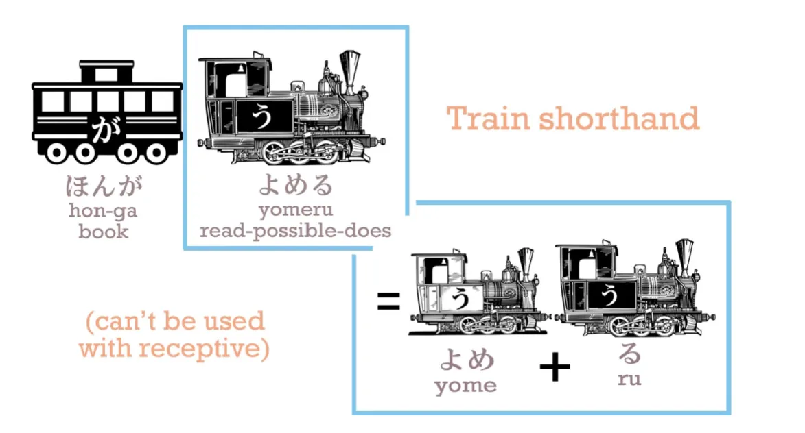
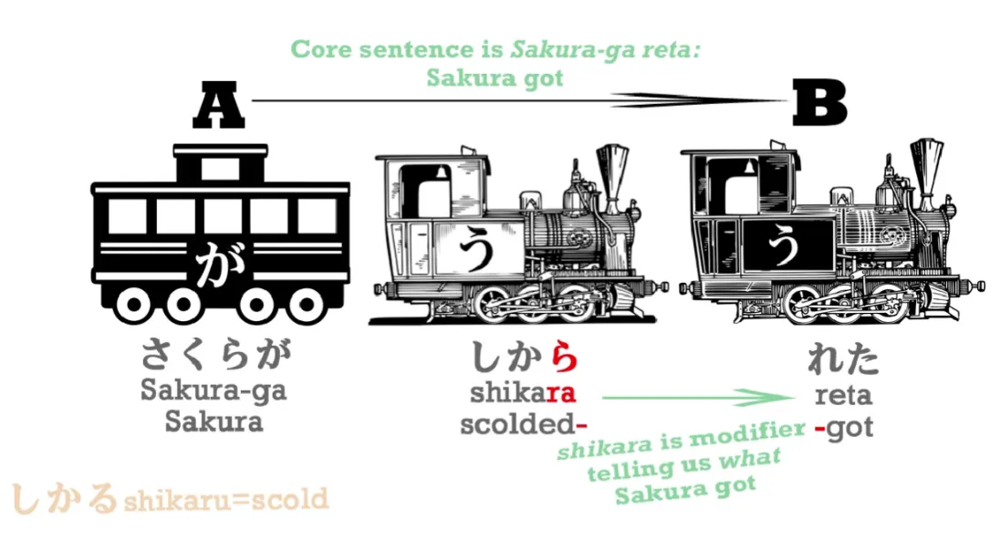
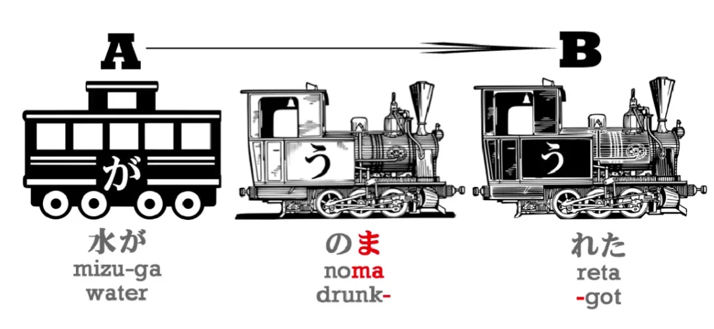
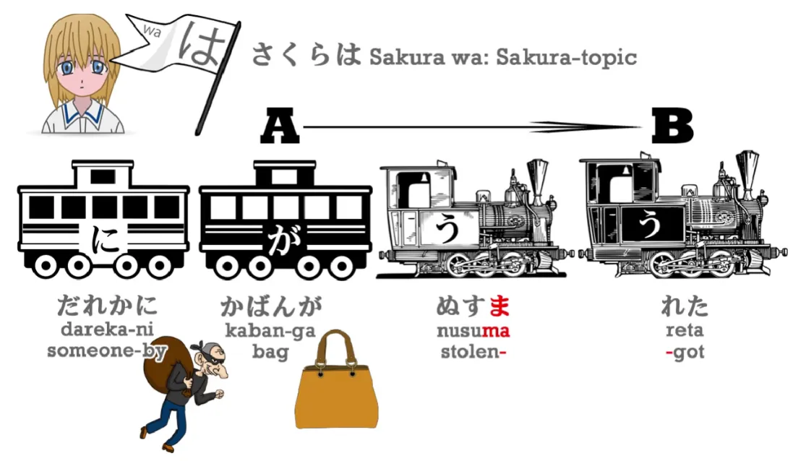
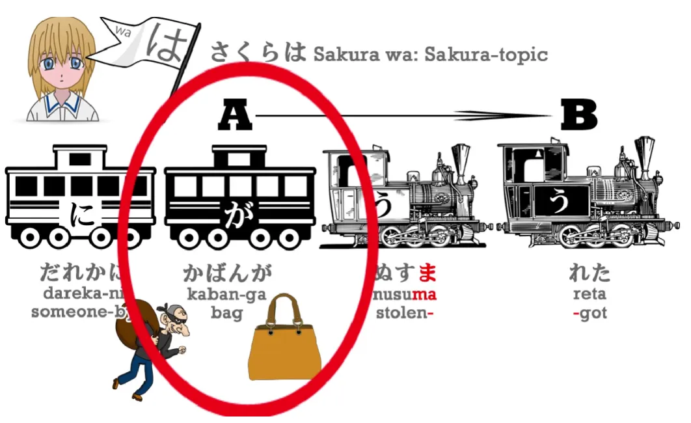
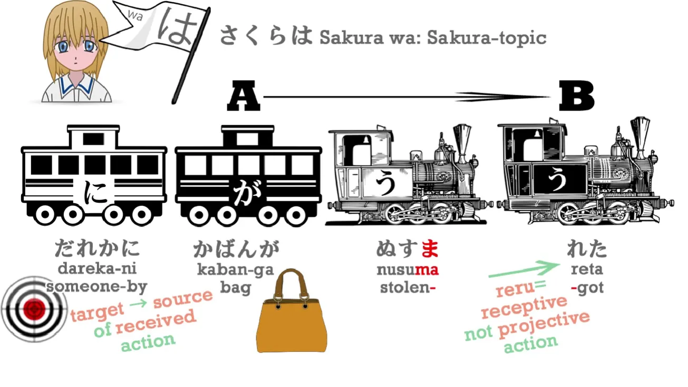
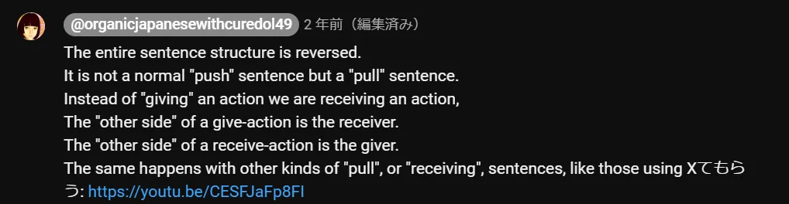
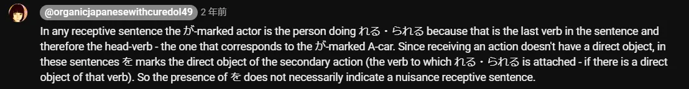

# **13. Konjugasi Pasif / Kata Kerja Bantu Penerima** 

[**Pelajaran 13: <code>Passive Conjugation</code> terbongkar: BUKAN pasif. BUKAN konjugasi. SANGAT mudah.**](https://www.youtube.com/watch?v=cvV6d-RETs8&amp;list;=PLg9uYxuZf8x_A-vcqqyOFZu06WlhnypWj&amp;index;=15)

こんにちは。

Hari ini kita akan membahas kata kerja bantu reseptif. Di tempat lain, Anda mungkin mendengar istilah ini disebut sebagai <code>passive conjugation</code>. Sekarang, seperti yang telah kita pelajari, tidak ada konjugasi dalam bahasa Jepang, jadi ini tidak bisa menjadi konjugasi. 

::: info
Sekali lagi, Dolly mengatakan ini agar lebih mudah dipahami, tetapi jika kita mendalami linguistik, hal ini bisa diperdebatkan. Saya mengatakan ini untuk menunjukkan bahwa ada BANYAK nuansa saat kita mendalami suatu bahasa dan hal-hal jarang sesederhana dan sesimpel yang terlihat setelah melewati dasar-dasarnya, jadi sebaiknya kita ingat hal ini. Jika Anda benar-benar suka membaca, di bawah video ini, ada [**diskusi yang sangat menarik**](https://www.youtube.com/watch?v=cvV6d-RETs8&amp;lc;=UgzXdC7vyB-XKN543tt4AaABAg) tentang hal ini.
:::

*Namun secara keseluruhan, tidak ada yang murni <code>right</code> atau <code>wrong</code> benar-benar, hanya <code>more helpful</code> atau <code>less helpful</code> untuk seorang individu.*

**Selain itu, ini bukan bentuk pasif.** Jadi, skor buku teks adalah nol dari dua. Dan ini penting karena jika kita menganggap kata bantu reseptif sebagai konjugasi pasif, hal itu sepenuhnya mengacaukan pemahaman kita tentang struktur dan, sekali lagi, membuat partikel-partikel malang itu berantakan di mana-mana. Dan seperti yang kita tahu, partikel-partikel itu adalah kunci utama, engsel di mana bahasa Jepang berputar. Jadi jika kita mengacaukan partikel-partikel itu, kita dalam masalah besar. Dan inilah mengapa begitu banyak orang merasa bahasa Jepang sulit dipahami.

::: detail Hanya salah satu catatan acak saya tentang teknis terminologi

Tidak ada yang salah dengan menyebutnya pasif, Anda hanya perlu ingat bahwa ini berbeda dari bentuk pasif dalam bahasa Inggris; Dolly menggunakan istilah <code>receptive</code>, jadi ini adalah terminologi yang dia gunakan untuk menghindari kebingungan dalam modelnya. Dalam bahasa Jepang, hal ini disebut &quot;受身形&quot; (bentuk pasif), meskipun Dolly menggunakan kanji pertama yang bisa berarti &quot;menerima&quot;, jadi saya mengerti alasannya dan ini juga istilah yang bagus jika ada.

Secara sederhana, dapat dikatakan bahwa bentuk pasif itu sendiri mencakup fungsi reseptif karena umumnya digunakan untuk menempatkan fungsi Subjek pada Objek (penerima) dari tindakan kata kerja dasar (melalui &quot;れる&quot;) alih-alih pada Pelaku (pelaku tindakan kata kerja dasar), sementara Pelaku biasanya ditandai oleh &quot;に&quot; dalam bentuk Pasif, meskipun ada detail lain yang akan dibahas, jadi pendekatan Dolly juga sepenuhnya valid, tetapi istilah &quot;Pasif&quot; juga berfungsi menurut saya, meskipun memerlukan dasar linguistik yang lebih kuat.

Perhatikan bahwa saya sedang membicarakan perbedaan antara Sintaksis (Subjek) dan Semantik (Objek/Pelaku).

Dalam tata bahasa, hal-hal jarang <code>black n’ white</code>, jadi jika ini cocok untuk Anda, tidak masalah, hanya saja ingatlah untuk tidak menganggap bahasa Jepang seolah-olah sama dengan bahasa Inggris! Bahasa Jepang hanya menggunakan kata-kata yang berbeda untuk mengekspresikan ide dasar yang sama, jadi tidak masalah jika pendekatan Dolly cukup efektif untuk pemahaman dasar tata bahasa yang dapat sepenuhnya dipahami / diperbaiki melalui banyak masukan.

:::

## Kalimat Resptif / Pasif

Jadi, sekarang saya telah menyebutkan <code>passive conjugation</code> hanya agar Anda tahu apa yang kita bicarakan jika menemukannya dalam konteks lain, mari kita buang kata-kata itu sepenuhnya dan sebut saja apa adanya: **kata kerja bantu reseptif.** 

Jadi, apa itu kata kerja bantu reseptif? **Ini adalah kata kerja yang melekat pada akar kata &quot;あ&quot; dari kata kerja lain, dan akar kata &quot;あ&quot;, yang sama dengan akar kata yang kita gunakan untuk melekatkan kata sifat bantu negatif &quot;ない&quot;, bukan? **Kata kerja bantu reseptif adalah 「れる・られる」: yaitu れる untuk kata kerja godan, dan られる untuk kata kerja ichidan.**

Sekarang, **banyak orang panik ketika melihat bahwa bentuk pasif (られる) dari kata bantu reseptif ichidan sama dengan bentuk potensial (られる) dari kata bantu potensial ichidan. Namun, tidak perlu panik.** Itu benar-benar tidak masalah. Dalam bahasa Inggris, kita juga memiliki hal-hal seperti ini. Misalnya, kita memiliki kata-kata `to`, `two`, dan `too`. Ketiganya diucapkan sama dan merupakan kata-kata yang sangat umum yang digunakan ratusan kali setiap hari. Dan seberapa seringkah kata-kata tersebut tertukar? Sangat jarang. 

Dan **hal yang sama berlaku untuk kata kerja bantu potensi dan reseptif. Keduanya digunakan dalam situasi yang sangat berbeda dan sangat kecil kemungkinannya untuk membingungkannya dalam penggunaan nyata.** **Dan penggunaan nyatalah yang penting.** 

---

Jadi, **apa arti kata kerja bantu reseptif? Artinya `receive` atau `get`.** **Menerima apa? Menerima tindakan dari kata kerja yang menyertainya.**

Sekarang, **sebagian besar waktu saya akan menggunakan kata `get` karena ini mengungkapkan dengan sangat jelas apa yang dilakukan kata kerja bantu tersebut.**

::: info
Untuk lebih jelasnya, seperti yang dikatakan Dolly [**di kolom komentar**](https://www.youtube.com/watch?v=cvV6d-RETs8&amp;lc;=Ugz9HsXgTvy6JpFnPfR4AaABAg.8s4VanZoq638s4aJUNzU_p): 

*Jadi <code>got</code> terjemahan hanya berfungsi jika bahasa Inggris <code>got</code> berarti <code>receive (an action)</code>, bukan ketika artinya <code>become (a state)</code>. Atau untuk menyederhanakan masalah ini - Anda dapat menggunakan <code>got</code> untuk menerjemahkan れる / られる tetapi Anda tidak selalu bisa menggunakan れる / られる untuk menerjemahkan <code>got</code>.*
:::

Guru bahasa Inggris Anda dulu mungkin mengatakan itu bukan cara terbaik untuk mengekspresikan sesuatu, tetapi itu adalah cara yang sangat baik untuk mengekspresikan sesuatu dalam bahasa Inggris dan dalam bahasa Jepang itulah tepatnya cara kami mengekspresikannya. Baik?

Jadi, mari kita ambil contoh sederhana: 「さくらがしかられた。」 

**&quot;叱る&quot; / &quot;しかる&quot; berarti &quot;memarahi&quot; atau &quot;menegur&quot;, dan akar kata &quot;あ&quot; adalah &quot;叱ら&quot;, jadi ketika kita menambahkan &quot;れる&quot; dan mengubahnya ke bentuk lampau, kita mendapatkan &quot;しかれた&quot; / &quot;叱られた&quot;.** **&quot;叱る&quot; adalah &quot;memarahi&quot;, &quot;叱られる&quot; adalah &quot;dimarahi&quot;, &quot;叱られた&quot; adalah &quot;telah dimarahi&quot;, jadi, &quot;Sakura telah dimarahi&quot;.**

---

**Sekarang, ada hal penting yang perlu diingat di sini, yaitu bahwa terkadang, dengan kata bantu yang melekat pada kata kerja, kita dapat, sebagai semacam singkatan, menggabungkan kedua bagian tersebut menjadi satu kata kerja.** 

Jadi kita bisa mengatakan 「ほんがよめる」 dan meskipun よめる, yang merupakan bentuk potensial dari よむ, secara teknis adalah よめ ditambah る, kita bisa menggabungkannya dan memperlakukan よめる sebagai satu kesatuan. **Namun, kita tidak boleh, dan tidak pernah boleh, melakukan hal itu dengan kata bantu reseptif. Mengapa tidak? Karena ketika kata bantu reseptif melekat pada kata kerja lain, tindakan kata kerja pertama selalu dilakukan oleh orang yang berbeda dari tindakan kata kerja kedua れる・られる.**

**Jadi, dalam kalimat reseptif, kita selalu memiliki tindakan yang dilakukan oleh orang lain—yang mungkin kita kenal atau tidak—ditambah tindakan sebenarnya dari kalimat tersebut, yaitu れる・られる, yaitu penerimaan—penerimaan—dari tindakan tersebut.** Dan inilah poin fundamental yang harus diingat. Hal ini disebabkan karena buku-buku teks tidak mengingat hal ini dan tidak memisahkan kedua engine tersebut, sehingga timbul semua kebingungan dan kesulitan mengenai apa yang disebut <code>passive conjugation</code> . **Kata kerja utama dari kalimat reseptifれる

・られる

selaluれる

atauられる

, bukan kata kerja yang melekat padanya.**

---

Sekarang, **perhatikan juga bahwa A-car, penggerak kalimat, tidak selalu harus berupa orang.** Jadi, jika kita mengatakan, 「**水

**がのまれた

」 (のむ

/飲む

＝minum;のま

＝あ

akar kata minum;れた

＝ mendapat), kita berarti mengatakan `**Air** itu diminum`. **Dan penggerak kalimat tersebut adalah air.** 

Sekarang, meskipun kita menambahkan pelaku tindakan: 「水がいぬにのまれた

」, 

**penggerak kalimat tersebut tetaplah air, bukan anjing, karena airlah yang diminum, airlah yang melakukan tindakan &quot;diminum&quot;. Anjinglah yang melakukan tindakan &quot;minum&quot;, tetapi airlah yang melakukan tindakan &quot;diminum&quot;.** **Dan anjing yang meminum air hanyalah bagian putih yang memodifikasi kata kerja utama terakhir, `get`.** `Air itu diminum oleh anjing.`

Sekarang, mengapa saya menandai anjing denganに

? Saya akan menjelaskannya sebentar lagi. 

Mari kita lihat kalimat yang lebih lengkap agar kita dapat melihat semua partikel bekerja sama dalam kalimat reseptif: 

&gt;さくらはだれかにかばんがぬすまれた。

(盗む

/ぬすむ

＝ mencuri;盗ま

＝あ

akar kata dari mencuri;盗まれる

＝ dicuri;盗まれた

＝ dicuri). **誰か

/だれか

berarti `seseorang`** (誰

＝ siapa,か

＝ pertanyaan). Siapa itu? Kita tidak tahu, bukan orang tertentu, tapi seseorang. **誰か

＝Seseorang**.

---

Jadi, apa yang terjadi di sini? Siapa penerima tindakan tersebut? Bukan Sakura, yang ditandai denganは

. Bukan seseorang, yang ditandai denganに

. **Itu adalah `person` yang ditandai denganが

, dan itu adalah tas. Taslah yang menerima pencurian itu, jadi tas adalah subjek kalimat. Taslah yang melakukanれる

, yang melakukan `got`.**

Danに

... apa yang dilakukannya di sini? Nah, ingatlah bahwaに

menandai sasaran akhir dari suatu tindakan (だれか

). Jadi, 「(zeroが

)**さくらに

**ボールをなげた。

」 penggerak yang ditandai olehが

adalah saya, objek dari tindakan tersebut adalahボール

, **dan sasaran dari tindakan tersebut adalah Sakura**. *(Penggunaan &#x27;に

&#x27; yang tidak bersifat reseptif)*

**Sekarang, jenis &#x27;に

&#x27; ini hanya dapat digunakan ketika kita memproyeksikan sesuatu, baik itu melempar bola, mengirim surat, memberikan hadiah, atau meminjamkan buku. Kita harus melemparkan sesuatu ke arah sasaran.**

---

Nah, **kata kerjaれる

bukanlah kata kerja melempar. Ini adalah kata kerja menerima. Ini bukan kata kerja dorong, melainkan kata kerja tarik.** 

**Oleh karena itu, sasaran dari kata kerja tersebut bukanlah sesuatu yang Anda proyeksikan; melainkan hal yang Anda terima.** **Jadi,に

menjalankan fungsi yang sama dalam kaitannya dengan kata kerja tarik seperti yang dilakukannya dalam kaitannya dengan kata kerja dorong, yaitu, sasaran akhir dari dorongan, sumber akhir dari tarikan.** 

::: info
Ini mungkin berguna. Dari komentar seperti [**ini**](https://www.youtube.com/watch?v=cvV6d-RETs8&amp;lc;=UgycETdw-fOaAqbnzlp4AaABAg) di bawah video.  
Pemahaman saya tentang hal ini akan terlalu panjang lagi, jadi saya tidak akan menyertakannya di sini, karena menurut saya Dolly sudah menjelaskannya dengan cukup jelas dan saya tidak ingin menambahkan lebih banyak judul di sini...*

:::

Jadi, Anda lihat, semua partikel melakukan persis seperti yang selalu mereka lakukan. Tidak ada yang berubah di sini.

::: info
Nah, seperti yang ditunjukkan di atas, dalam mode Pasif/Reseptif, hal ini sedikit berubah karena mereka membalik polaritasnya. Itulah mengapa &quot;に

&quot; bukanlah <code>to</code> - penerima/<code>target</code> seperti pada mode Aktif, melainkan kini <code>by</code> - pelaku, dan &quot;が&quot; justru menjadi penerima dari tindakan dasar (ぬすむ) melalui &quot;れる&quot;. Hal ini terutama dapat dijelaskan melalui Peran Semantik/Tematik.*
:::

Jika Anda memikirkannya sebagai <code>passive conjugation</code>, semua partikel melakukan tarian aneh dan seolah-olah melakukan hal yang berbeda dari biasanya, tetapi jika Anda memahaminya sebagaimana adanya - kata kerja bantu reseptif - tidak ada masalah. Dan semuanya masuk akal, sama seperti bahasa Jepang selalu begitu jika Anda tahu apa yang sebenarnya dilakukannya.

## <code>Nuisance Receptive/Passive</code>/ 迷惑受け身

Sekarang, ada satu area lain di mana kata kerja bantu reseptif terkadang membingungkan orang, yaitu dalam apa yang disebut <code>suffering passive</code> atau <code>adversity passive</code>, yang sebenarnya disebut dalam bahasa Jepang sebagai 迷惑受け身 /*めいわくうけみ*, yang berarti `receptive yang merepotkan`. Dan itulah yang sebenarnya. Itu adalah receptive yang merepotkan.

---

「さくらはだれかに**かばんが**ぬすまれた。」berarti `**tas** Sakura dicuri oleh seseorang` atau, secara harfiah, `Berkaitan dengan Sakura, **tas** dicuri oleh seseorang`. 
::: info
Receptive normal.
:::

::: peringatan
Perhatikan penggunaan が sebelum kata kerja yang ditandai sebagai reseptif, bukan objek langsung を. Saya merekomendasikan membaca [**RANGKAIAN INI**](https://www.youtube.com/watch?v=cvV6d-RETs8&amp;lc;=UgwSvcxzsfJfg2FlFaB4AaABAg) mengenai mengapa digunakan &quot;が&quot; alih-alih &quot;を&quot; jika Anda ragu. Istilah &quot;Penggerak&quot; seharusnya berarti &quot;Subject&quot; bagi Dolly, tetapi itu hanyalah tebakan saya berdasarkan kapan dia menggunakannya, karena dia tampaknya tidak menjelaskan apa yang sebenarnya dia maksudkan dengan istilah itu, [**dalam satu rantai komentar di bawah video ini**](https://www.youtube.com/watch?v=cvV6d-RETs8&amp;lc;=UgyjLIrKQJJ0zfRCXId4AaABAg.8wnXb0KQGCY8wtxK5KucCT&amp;ab;_channel=OrganicJapanesewithCureDolly) dia bahkan menyebut &quot;Receptive&quot; (に) sebagai <code>secondary actor</code> (yang lebih mirip dengan Penggerak linguistik sebenarnya… atau Makroperan Agen di sana) yang tidak membantu.
:::

::: detail SANGAT opsional <code>Explanation</code> Catatan &amp; contoh omong kosong kronis saya (atau apa pun itu, hehe)
  
***Ini hanyalah salah satu omong kosong linguistik saya yang biasa, yang sebenarnya tidak terlalu penting dalam skema besar &amp; ada di sini terutama untuk minat linguistik saya sendiri (atau bagi mereka yang ingin mendalami lebih jauh)  
Saya hanya sedang menguji/melatih pemahaman saya tentang hal ini dalam konteks linguistik secara umum.***

***PENGETAHUAN SAYA SANGAT TERBATAS, SEHINGGA INI HANYA SAYA YANG BEREXPERIMEN DENGAN SEBUAH HIPOTESIS.  
SAYA SANGAT SADAR BAHWA APA YANG SAYA KATAKAN MUNGKIN SALAH BESAR!***

***Dolly jelas tidak menggunakan istilah-istilah ini seketat yang akan saya lakukan di sini, karena ini hanya tata bahasa dasar sehingga jelas tidak perlu ada di sini, tetapi demi kesenangan, saya akan bersenang-senang dengan linguistik:)***

***Tata bahasa itu rumit, jadi saya masih harus belajar banyak hal dan sebagainya, jadi saya juga akan menggunakan ini untuk riset.***

*Jika masih belum jelas, menurut pemahaman saya, hal ini dapat dijelaskan melalui peran semantik/hubungan tematik.*

Perlu diingat bahwa Sintaksis / Sintaksis dan Semantik / Semantik adalah dua bidang yang berbeda, dan satu fungsi sintaksis (Subjek, dll.) dapat memiliki beberapa peran semantik, terutama dalam hal Aktif vs Pasif/Reseptif.  
Hal ini karena ini adalah bentuk Pasif/Reseptif, &quot;かばん&quot; memiliki fungsi Sintaksis sebagai SUBJEK (oleh karena itu ditandai sebagai &quot;が&quot;), TETAPI memiliki fungsi Semantik yang sama sebagai PATIEN - ia menerima tindakan dari kata kerja &quot;stealing&quot; atau &quot;being stolen by someone&quot;. Dalam kalimat Aktif, &quot;かばん&quot; memiliki fungsi SINTATIS sebagai OBJEK LANGSUNG tetapi tetap memiliki fungsi SEMANTIS sebagai OBJEK PASIF.

Jadi, jika kita ingin menandai &quot;かばん&quot; dengan &quot;を&quot; (Objek Langsung - fungsi sintaksis), kalimat tersebut harus dalam bentuk kalimat aktif (karena dalam kalimat pasif, kita cenderung menempatkan Objek Langsung sebagai Subjek) ATAU, seperti yang akan ditunjukkan di bawah ini, kalimat tersebut harus dalam bentuk <code>Nuisance Receptive</code> sebagai Objek Sekunder yang terhubung dengan Kata Kerja Sekunder yang menambahkan <code>description</code> informasi tentang bagian utama.  
**Istilah Penggerak** yang digunakan Dolly SEHARUSNYA memiliki arti yang sama dengan Agen seperti yang disebutkan [****di sini****](https://linguistics.stackexchange.com/questions/20451/apa-perbedaan-antara-penggerak-dan-subjek-dalam-gramatika-fungsional-sistemik) dan [****di sini****](https://english.stackexchange.com/a/569830) dari apa yang saya temukan, tetapi Dolly tampaknya menggunakannya di sini untuk Subject, dalam arti bahwa penggerak seharusnya mengacu pada subjek yang melakukan tindakan kata kerja utama, jadi saya bingung apa yang dimaksud Dolly dengan &quot;penggerak&quot; di sini, tetapi mungkin saja… dalam hal itu, saya mengerti maksud Dolly, meskipun dia mungkin di sini menggabungkan fungsi Sintaksis dan Semantik, jika tidak, saya salah memahami apa yang dia maksudkan dengan &quot;Penggerak&quot; di sini, karena dia sepertinya mengarahkannya ke Subjek yang merupakan properti Sintaksis, sementara &quot;Penggerak&quot; (atau lebih tepatnya &quot;Agent&quot;) adalah properti Semantik, dan dalam kalimat ini, dalam komentarnya dia menyebut &quot;かばん&quot; <code>actor</code>, &quot;かばん&quot; seharusnya adalah &quot;Patient&quot;, bukan <code>actor</code> karena ia menerima tindakan, bukan melakukan tindakan dari kata kerja utama. Artinya, jika &quot;Actor&quot; memang sama dengan &quot;Agent&quot;.

*Sejujurnya, istilah &quot;Actor&quot; jarang saya temui dan seharusnya merujuk pada fungsi semantik, TETAPI dapat digunakan untuk merujuk pada <code>Semantic Macrorole</code> Subjek dalam kalimat Aktif dan frasa pelengkap dalam kalimat Pasif (sedangkan Patient adalah Objek Langsung dalam kalimat Aktif dan Subjek dalam kalimat Pasif, yang Makroperannya disebut <code>Undergoer</code>), sebagaimana dijelaskan [**di sini**](https://rrg.caset.buffalo.edu/rrg/vanvalin_papers/SemMRsRRG.pdf) dalam makalah oleh ahli bahasa Robert Van Valin…*[1] (halaman 1 &amp; 3) dan hal ini menunjuk pada hubungan antara Semantik dan Sintaksis. Biasanya Agent (atau sub-istilahnya) yang digunakan, sehingga hal ini sangat membingungkan saya, tetapi dari pelajaran lain, **Dolly tampaknya merujuk pada Subjek sebagai Penggerak terkadang dan menggunakannya secara bergantian bahkan dalam kalimat Pasif/Reseptif, jadi ingatlah bahwa ketika dia menyebut Penggerak, dia maksudkan Subjek** meskipun seharusnya merujuk pada hal yang berbeda dalam kalimat Pasif berdasarkan apa yang saya teliti secara pribadi…  
Selain itu, hal ini tampaknya juga berlaku dalam bahasa Jepang, sebagaimana yang sepertinya dikatakan oleh [**IMABI**](https://imabi.org/the-passive/) dalam pelajaran Pasif, meskipun hanya menggunakan istilah &quot;Agent&quot;, di mana dalam bentuk Pasif ditandai oleh に / によって.  
Dalam kalimat AKTIF, kedua fungsi SEMANTIS ini umumnya diekspresikan secara SINTASIS melalui Subjek (Agent) dan Objek Langsung (Patient), tetapi keduanya merujuk pada bidang yang berbeda.  
Dalam kalimat Pasif/Receptif, Patient justru sebagian besar ditempatkan dalam peran SINTASIS sebagai Subjek.  
Peran SEMANTIK mereka tidak berubah—Penerima dan Pelaku tetap kata yang sama, tetapi fungsi SINTAKTIK mereka berubah, di mana Penerima kini menjadi Subjek dan Pelaku ditempatkan dalam frasa penghubung, dalam hal ini frasa yang ditandai dengan &quot;に&quot;. Dalam bentuk Pasif/Reseptif terdapat 2 kata kerja—ぬすむ dan れる, ぬすむ menggambarkan れる di sini, れる berfungsi sebagai Predikat? (tidak terlalu yakin di sini, tetapi れる ditandai sebagai mobil hitam seperti が dan ぬすむ hanya sebagai putih) untuk かばん yang kini menjadi Subjek.  
Hal ini tampaknya secara mengejutkan cocok antara bahasa Inggris dan Jepang dalam kata kerja transitif dasar / kata kerja pergerakan lain, meskipun kita tidak boleh membandingkannya, TETAPI keduanya tidak identik; bahasa Jepang jauh lebih bebas, luas, dan logis / jelas dalam hal ini daripada bahasa Inggris, sehingga bahasa Jepang dapat menggunakan bentuk Pasif / Resptif untuk hal-hal yang tidak dapat dilakukan oleh bahasa Inggris.

*Maaf jika ini agak rumit, tetapi jika Anda memeriksa apa yang dimaksud dengan istilah-istilah tersebut dan membacanya kembali, seharusnya akan jelas.  
Namun, ada kasus khusus Passive/Receptive dalam bahasa Jepang yang dapat menandai &quot;かばん&quot; sebagai &quot;を&quot; sambil tetap memiliki kalimat Passive/Receptive; Anda dapat melihatnya tepat di bawah sini - &quot;Nuisance Receptive&quot;*

***Jika Anda menemukan informasi yang salah di sini, tolong beri tahu saya! Namun, tetaplah menganggapnya sebagai referensi saja.***

:::

### Contoh Kalimat Pasif yang Menyakitkan / Penerima yang Mengganggu

**Namun, kita juga bisa mengatakan** 「**さくらが**だれかにかばんをぬすまれた。」 **Ini adalah penerima yang mengganggu**.

Jadi, apa yang terjadi di sini? **Penggerak yang ditandai dengan が sekarang adalah Sakura, bukan? Dialah yang menerima.**

::: info

:::

Jadi, apa arti kalimat ini dalam bahasa Inggris? Sangat sederhana: `**Sakura** tasnya dicuri`. Itulah yang kita katakan dalam bahasa Inggris; guru bahasa Inggris kita dulu mungkin tidak menyukainya, tapi kita mengatakannya dalam bahasa Inggris, masuk akal dalam bahasa Inggris, dan persis seperti yang kita katakan dalam bahasa Jepang. `Sakura tasnya dicuri oleh seseorang.`

Jadi, Anda bisa melihat bahwa sebenarnya tidak ada masalah, tidak ada kesulitan, tidak ada kebingungan mengenai kata kerja bantu reseptif, selama Anda tahu bahwa itu adalah kata kerja bantu reseptif dan bukan hal lain.

::: info
Sekali lagi, ini mungkin akan SANGAT sulit untuk dipahami sepenuhnya, jadi saya sarankan untuk juga membaca komentar di bawah [**video**](https://www.youtube.com/watch?v=cvV6d-RETs8&amp;list;=PLg9uYxuZf8x_A-vcqqyOFZu06WlhnypWj&amp;index;=15). Ada cukup banyak jawaban menarik lainnya dari Dolly.  
Jangan khawatir jika saat ini terlalu sulit untuk dipahami sepenuhnya, Anda akan memahami Passive/Receptive sepenuhnya ketika Anda banyak memasukkan dan membenamkan diri dalam bahasa Jepang, semuanya akan menjadi jelas dengan sendirinya seiring dengan semakin banyaknya yang Anda konsumsi. Ini hanya untuk memberikan gambaran dasar tentang hal tersebut melalui penjelasan dasar dari Dolly.*
:::