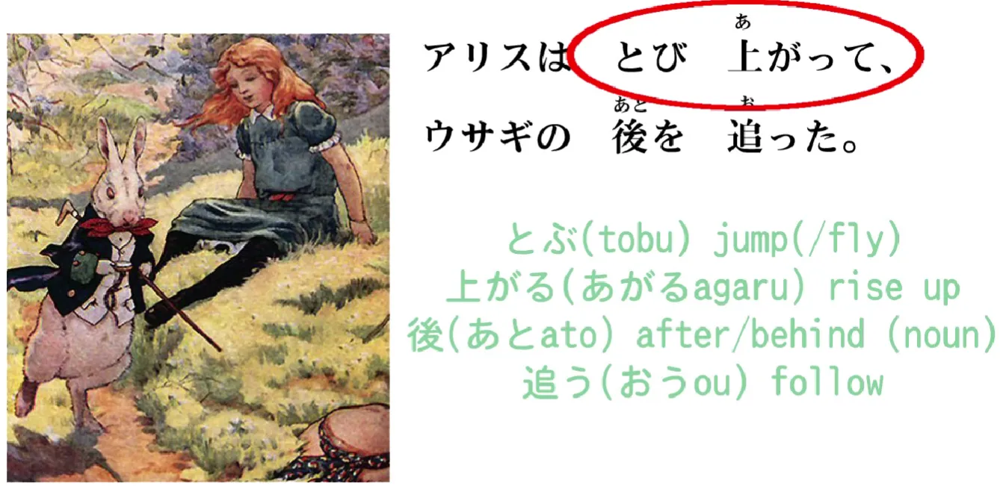
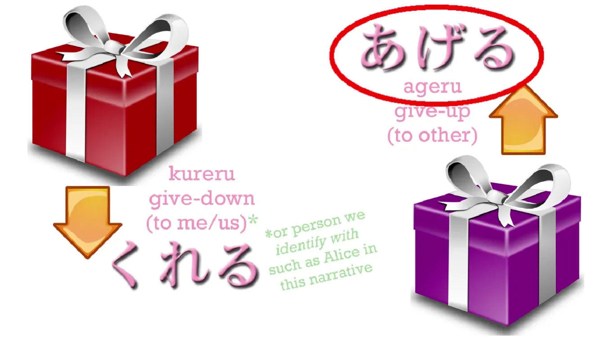
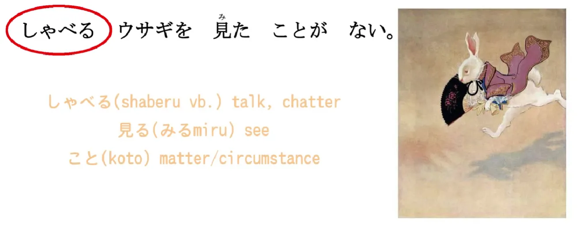
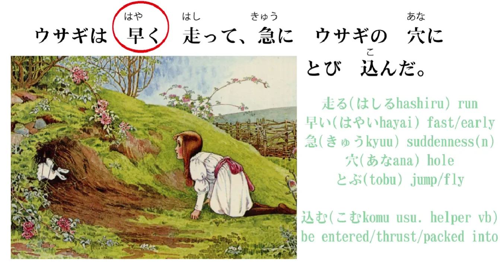
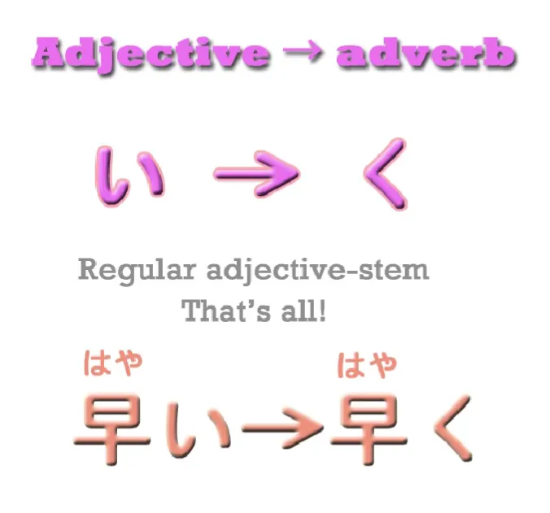
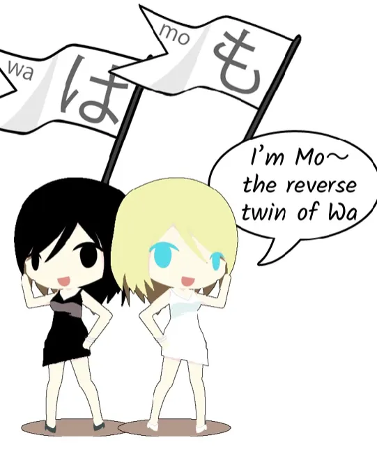
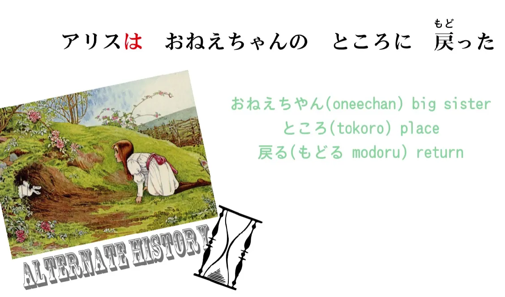
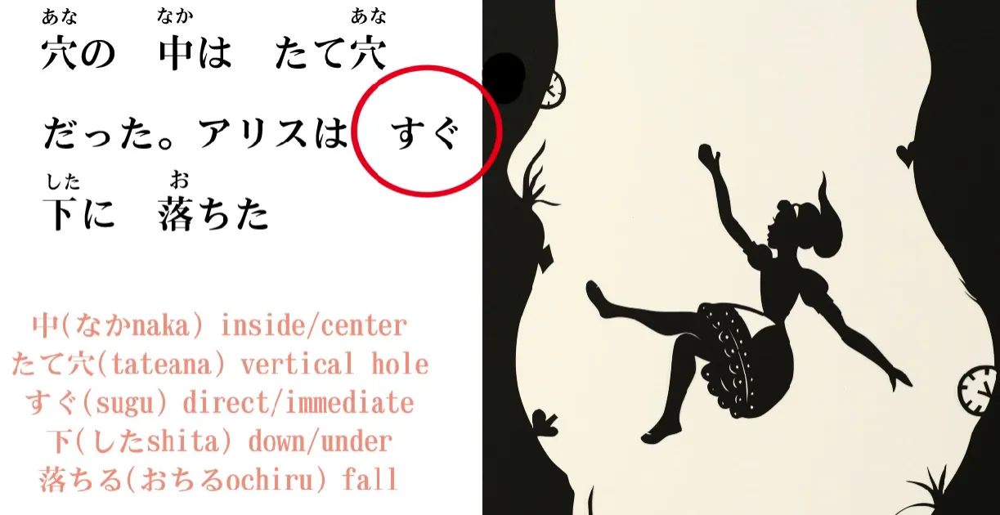
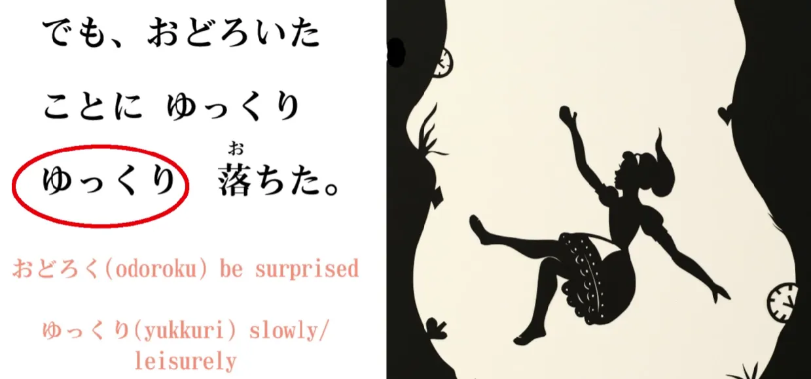

# **14. Kata Keterangan dan Partikel "も"** 

[**Pelajaran 14: Seluk-Beluk Kata Keterangan: Rahasia Partikel "Mo"; dan lebih banyak lagi tentang Alice!**](https://www.youtube.com/watch?v=9DR9ifftMvs&list=PLg9uYxuZf8x_A-vcqqyOFZu06WlhnypWj&index=16)

こんにちは。

Hari ini kita akan kembali menyelami petualangan Alice. Jika kamu ingat di pelajaran lalu, Alice melihat seekor kelinci putih melintas. Kelinci putih itu melihat jam sakunya dan berteriak "Aku terlambat! Terlambat!", lalu lari terbirit-birit. Alice berseru memintanya berhenti, tapi kelinci itu malah terus melompat menjauh.

> `アリスはとび上がって、ウサギの後を追った。` (Arisu wa tobiagatte, usagi no ato o otta).

Kata kerja `とび上がる` (tobi-agaru) adalah salah satu contoh dari "kata kerja majemuk" (*I-stem*) yang baru kita bahas minggu lalu. 

Akar kata kerja pertamanya adalah `とぶ / 飛ぶ`, yang berarti `melompat` atau `terbang`. Dalam konteks Alice, maknanya jelas `melompat` (kecuali kalau Alice ternyata bisa terbang). Dan kata kerja kedua adalah `上がる`, yang berarti `naik / ke atas`. Jadi, jika digabungkan, `飛び上がる` bermakna `melompat ke atas / meloncat berdiri`. 

Kamu mungkin memperhatikan bahwa huruf kanji untuk `上がる` (naik ke atas) menggunakan kanji yang sama dengan `上` (atas). Dan ini masih berhubungan erat dengan kata kerja `上げる` (ageru/memberikan ke atas) yang baru-baru ini kita bahas[[11]](./11-compound-sentences-kureru-ageru-and-other-uses-of-the-te-form.md). `上げる` berarti memberikan *benda lain* atau mengangkat *orang lain* ke atas. 

**Namun, `上がる` bermakna suatu benda/orang `mengangkat DIRINYA SENDIRI / bangkit dari posisinya semula`.** Jadi, kita bisa melihat bahwa keduanya sangat berkaitan erat. 

---

> `ウサギの後を追った` (Usagi no ato o otta)

`後` (ato) berarti `belakang` atau `setelah`, dan `追う` (ou) berarti `mengikuti / mengejar`. Frasa `後を追う` (ato o ou) adalah ungkapan umum dalam bahasa Jepang yang berarti `mengikuti di belakang / mengejar dari belakang`. 

**Namun, ingatlah kembali pelajaran posisi letak: kosakata penunjuk arah/posisi dalam bahasa Jepang SELALU berstatus sebagai KATA BENDA.**

Kita berbicara tentang 'area atas' meja, 'area bawah' meja, dan 'area samping' sungai. Begitu pula di sini, kita sedang membicarakan 'area belakang' si kelinci. Jadi, secara literal Alice mengikuti `rabbit's after` atau `area belakang kelinci`. Begitulah cara pandang logis bahasa Jepang.

Jadi terjemahannya:
`アリスは飛び上がって、ウサギの後を追った。` -> *Adapun mengenai Alice, ia melompat bangkit dan mengikuti area belakang kelinci (mengejar kelinci itu).*

---

> `しゃべるウサギを見たことがない。` (Shaberu usagi o mita koto ga nai).

`しゃべる / 喋る` (shaberu) berarti `berbicara` atau `mengobrol`. Ini mirip seperti kata *jabber* (nyerocos) dalam bahasa Inggris, bukan? 
Frasa `しゃべるウサギ` dengan jelas memperlihatkan **kemampuan kata kerja yang disulap untuk menjadi pemodifikasi (kata sifat) yang menerangkan kata benda.** 

Jadi, `しゃべるウサギ` secara harfiah berarti `Kelinci yang berbicara` atau `Kelinci bisa ngomong`. 

Lalu bagaimana dengan frasa `見たことがない` (Mita koto ga nai)? Kamu akan SANGAT SERING bertemu dengan pola `～ことがない` atau `～ことがある`. Apa makna strukturalnya? 

## Membedah Frasa "koto ga aru/nai"

Kita tahu bahwa `こと` (koto) berarti sebuah `hal/benda` dalam wujud abstrak: yaitu suatu kondisi, keadaan, atau pengalaman. Ia bukan benda fisik yang bisa dipegang. 

Jadi, dalam frasa `見たこと` (Mita koto) : kata kerja `見た` (telah melihat) beroperasi sebagai *engine putih* yang memodifikasi kata benda abstrak `こと`, bukan? 

Ia bertugas memberi tahu kita `こと` jenis apa yang sedang dibicarakan. Dalam hal ini, `見る` berarti `melihat`, lalu `見た` adalah bentuk lampaunya (`telah melihat`). **Jadi, `こと` di sini bertindak sebagai 'pembungkus' yang mengubah wujud kejadian 'telah melihat' tersebut menjadi sebuah kata benda abstrak (yaitu "Pengalaman").**

**Jadi, `見たこと` bermakna `Sebuah fakta/pengalaman bahwa ia telah melihat`.** 
**Lalu, `見たことが ない` bermakna `Fakta/pengalaman bahwa ia telah melihat ITU TIDAK ADA.`** 

Jadi maksud harfiah dari kalimat `しゃべるウサギを見たことがない` adalah: `Fakta (pengalaman) bahwa ia pernah melihat kelinci yang bisa bicara itu tidak ada.` -> Alice belum pernah melihat kelinci yang bisa bicara.

Dan tentu saja, di kepala orang Indonesia atau Inggris, kita selalu ngotot ingin menjadikan Alice sebagai aktor (subjek) pengerak kalimat ini. Tetapi, **secara tata bahasa Jepang yang suci, subjek mutlak penggerak kalimat ini (Gerbong A / penahan partikel `が`) BUKANLAH ALICE. Subjek kalimat ini adalah `こと` (Pengalaman).**

Bahkan seandainya kita memaksakan nama Alice masuk ke dalam kalimat menjadi `アリスは喋るウサギを見たことがない`... Alice tetap BUKAN penggerak kalimat tersebut! **Alice hanyalah sebuah 'Topik/Bingkai Pembicaraan'.** 
Arti harfiahnya: `Berbicara soal Alice, fakta/pengalaman bahwa dia pernah melihat kelinci bicara ITU TIDAK EKSIS.`

---

> `ウサギは早く走って、急にウサギの穴にとび込んだ。` (Usagi wa hayaku hashitte, kyū ni usagi no ana ni tobikonda).

Ini adalah kalimat yang cukup panjang dan padat. Saya akan memberikan makna utuhnya terlebih dahulu: `Kelinci itu berlari cepat dan tiba-tiba melompat terjun ke dalam lubang kelinci`. 
Sekarang mari kita bedah mekanismenya.

> `ウサギは早く走って…` (Kelinci berlari cepat [dan]...)

Seperti yang kita tahu, `走る / はしる` (hashiru) adalah kata kerja `berlari`. `早い / はやい` (hayai) adalah kata sifat yang berarti `cepat` atau `awal`. Dalam konteks ini jelas artinya `cepat`. 

Jika kita ingin mengatakan `Kelinci itu (sifatnya) cepat`, kita cukup mengatakan `ウサギが早い`.

## Menciptakan Kata Keterangan (Adverbs)

**Tetapi, jika kita ingin menyatakan bahwa 'pergerakannya' yang cepat, atau 'tindakannya' yang cepat, maka KITA BUTUH KATA KETERANGAN (*Adverb*). Kata keterangan adalah kata sifat yang JANGAN ditempelkan pada kata benda (objek), MELAINKAN HARUS DITEMPELKAN PADA KATA KERJA (aksi).**

---

**Dan ajaibnya, kita bisa menyulap kata sifat apa pun di bahasa Jepang menjadi sebuah Kata Keterangan dengan sangat, sangat mudah.** 
**Yang perlu kita lakukan hanyalah mencopot akhiran `い` (i) dari kata sifat tersebut, dan menggantinya dengan `く` (ku).** 

**Jadi, "早い" (Cepat - Kata Sifat) berubah wujud menjadi "早く" (Dengan cepat - Kata Keterangan).** 
"早い" bertugas mendeskripsikan suatu benda; "早く" bertugas mendeskripsikan sebuah aksi (tindakan). 

Jadi:
`ウサギは早く走って...`
(Kelinci itu berlari **dengan cepat** *dan*...) 

> `...急にウサギの穴にとび込んだ。` (...tiba-tiba melompat terjun ke dalam lubang kelinci).

Sekarang, mari bedah `ウサギの穴` (Usagi no ana). `穴` berarti `lubang`, jadi ini berarti `Lubang milik kelinci`. 

Lalu `とび込む` (Tobikomu) adalah contoh kata kerja majemuk lainnya. `とぶ / 飛ぶ`, seperti yang kita ketahui, berarti `melompat`, dan `込む` berarti `masuk ke dalam`. 
Kata `込む` ini tidak murni berarti sekadar 'masuk'; ia memancarkan makna `memasukkan diri ke dalam`, `memaksa masuk menerobos`, atau `melakukan suatu aksi ke dalam sesuatu`. 

Faktanya, ada buanyak sekali kata kerja majemuk yang dibentuk dengan menempelkan **'込む' (yang bermakna: melakukan aksi terjang ke dalam) ini di ekornya.** 
Jadi, "とび込む" secara natural berarti "jump into" (melompat terjun ke dalam). Kelinci itu "melompat terjun ke dalam" lubang kelinci.

---

Tapi apa arti kata "急に" (Kyū ni) di depannya? 

Nah, `急` (kyū) aslinya adalah kata benda (khususnya *Kata Sifat-Na*) yang bermakna "kondisi mendadak/tiba-tiba". **Dan ketika kita MENEMPELKAN partikel "に" (ni) di akhir kata benda semacam itu, kita otomatis MENYULAPNYA MENJADI KATA KETERANGAN JUGA.** 

Jadi, dalam paragraf ini kita disajikan dua trik membuat kata keterangan: 
1. **Kita menyulap Kata Sifat murni (`い`) menjadi kata keterangan dengan mengganti buntutnya menjadi "く".** 
2. **Kita menyulap Kata Benda khusus (atau *Kata Sifat-Na*) menjadi kata keterangan dengan menempelkan "に" di buntutnya.** 

Hukum ini berlaku pada beberapa kata benda biasa dan berlaku untuk NYARIS SEMUA kata benda yang berfungsi sebagai kata sifat (*Kata Sifat-Na*). 
Jadi, "急" = "Kondisi tiba-tiba"; **"急に" = "Secara tiba-tiba"**. "Kelinci itu *secara tiba-tiba* melompat masuk ke dalam lubang kelinci." 

Jadi, kalimat lengkapnya:
`ウサギは早く走って、急にウサギの穴にとび込んだ`
(Kelinci itu berlari dengan cepat, lalu secara tiba-tiba melompat terjun ke dalam lubang kelinci.)

> `アリスもウサギの穴にとび込んだ` (Arisu mo usagi no ana ni tobikonda)
(Alice juga ikut melompat masuk ke dalam lubang kelinci.)

## Rahasia Partikel `も` (Mo)

Di sinilah kita bertemu dengan anggota keluarga partikel baru yang belum pernah kita sentuh: yaitu si bendera `も`. **Ya, `も` adalah sebuah BENDERA PENANDA TOPIK, wujudnya setara dengan bendera `は` (Wa).** Kenapa disebut bendera?

Kita sudah belajar mati-matian bahwa `は`[[3]](./3-the-wa-particle.md) adalah Partikel Penanda Topik (non-logis). **Ternyata, `も` adalah satu-satunya partikel lain di dunia ini yang menduduki jabatan yang sama sebagai penanda topik non-logis.** 
Jadi, **`も` juga bertugas menancapkan tonggak topik kalimat sama seperti yang dilakukan `は`.** Lalu apa dong perbedaannya? 

Kita tahu bahwa "は" bertugas mendeklarasikan (membuka) topik utama kalimat. "は" juga berfungsi keras untuk 'menggeser/mengganti' sebuah topik. **Jika sebelumnya kita sedang membicarakan suatu hal, lalu kita menancapkan bendera "は" pada kata baru, itu berarti kita sedang menghentikan topik lama dan beralih membahas topik baru.**

---

Nah, **"も" ini unik. Ia juga bertugas mengganti topik kalimat, TETAPI ia HANYA BISA digunakan jika sudah ada topik lain yang dibahas panjang lebar sebelumnya di dalam obrolan tersebut.** 

Contoh: Topik pembicaraan kita sedari tadi adalah pergerakan si kelinci: "Si kelinci melompat ke dalam lubang." **Dan sekarang, kita mau menggeser kamera (topik) ke arah Alice.** 

> `アリス**も**ウサギの穴に飛び込んだ` 

**Ketika kita menggeser topik dan menancapkan bendera "も", kita sedang menyiarkan sinyal kepada pendengar bahwa: "Halo, komentar atau tindakan yang terjadi pada topik baru ini (Alice), itu IDENTIK / SAMA PERSIS dengan kejadian pada topik lama yang baru saja kita bicarakan tadi (Kelinci)."** 

---

**Sebaliknya, ketika kita mengganti topik menggunakan `は`, kita sedang menyiarkan sinyal sebaliknya: kita sedang membuat jurang PERBEDAAN antara topik saat ini dan topik lama.** 

Coba kita simulasikan. Jika kita mengatakan: 
`アリス**は**お姉ちゃんのところに戻った` (Arisu wa onēchan no tokoro ni modotta)
*(`ところ` = tempat; `戻る` = kembali. Artinya: Alice kembali ke tempat kakaknya).*

**Jika kita menggunakan bendera `は` di kalimat ini, maka `は` sedang bekerja keras menegaskan jurang perbedaan (kontras) antara nasib Alice dan nasib Kelinci.** 
Sinyal yang ditangkap oleh pendengar adalah: `Si Kelinci sih melompat ke dalam lubang. TAPI SEDANGKAN ALICE, dia justru memilih pulang ke tempat kakaknya.` Bendera `は` ini menegaskan bahwa langkah yang diambil Alice jelas-jelas berseberangan dengan kelinci. Inilah kekuatan mutlak dari `は`.

---

Jika kita tidak pakai bendera topik sama sekali dan murni pakai `が`: `**アリスが**お姉ちゃんのところに戻った`, kita murni cuma sedang menceritakan dua fakta datar secara berurutan: `Kelinci itu melompat ke dalam lubang, dan Alice pulang ke rumah.`

::: info
Alice = sebagai subjek mutlak pelaksana tindakan, ditandai dengan `が`.
:::

Namun dengan bendera `は`, kita memberikan penekanan 'kontras' tersebut. 

---

**Dan sekarang inti rahasianya: Jika kita mencabut `は` lalu menggantinya dengan bendera `も`, maka kita menyiarkan pesan sebaliknya. Kita mendeklarasikan bahwa kejadian pada topik (Alice) ini SAMA PERSIS dengan topik sebelumnya (Kelinci).** 

`Kelinci melompat ke dalam lubang. Dan Alice **JUGA (mo)** ikut melompat ke dalam lubang.` 

Jadi, akan ada fungsi lanjutan dari `も` yang akan kita bedah di masa depan. Tapi fungsi inilah cetak biru utamanya: **Ia adalah partikel penanda topik yang bertugas mengumumkan bahwa tindakan/komentar pada topik baru ini SAMA dengan tindakan pada topik lama.** 

---

> `穴の中は**たて穴**だった。アリスはすぐ下に落ちた。` (Ana no naka wa tate-ana datta. Arisu wa sugu shita ni ochita).

`中` (naka) berarti `bagian dalam / ruang tengah`, jadi `穴の中` adalah `ruang di dalam lubang`. 
`たて穴 / 縦穴` (tate-ana): kata `たて / 縦` berarti `vertikal / tegak lurus`. (Kata ini berkerabat dengan kata `立つ / tatsu` - berdiri). 

Jadi, `穴の中は竪穴だった` -> `Bagian dalam dari lubang tersebut adalah lubang vertikal (seperti sumur) / lubang itu terjal menjulur lurus ke bawah`. 

> `アリスは**すぐ**下に落ちた。`

`下` (shita), seperti yang kita ketahui, berarti `bawah`. 
**Kata `すぐ` (sugu) berarti `langsung`. Kata ini bisa dimaknai `segera`** (dalam artian waktu tempuh: *will happen soon/directly*), **atau bisa dimaknai `lurus terus / langsung menembus`** (dalam artian arah posisi). 
Jadi dalam konteks ini, **`すぐ下` bermakna `langsung terjun lurus ke dasar bawah / jatuh ke bawah dengan mulus tanpa hambatan`.**

---

> `でも驚いたことにゆっくりゆっくり落ちた` (Demo odoroita koto ni yukkuri yukkuri ochita).

Ini berarti `Tapi yang mengejutkan, dia jatuh secara sangat sangat perlahan`. 
`驚く` (odoroku) berarti `terkejut/kaget`. Dan struktur `驚いたこと` adalah trik yang sangat menarik. Secara harfiah (*broken grammar*), frasa ini seolah-olah bermakna `sebuah hal ('koto') yang sedang terkejut`. 

---

**Namun, ingatlah logika mutlak yang kita bahas tentang kata sifat yang memuat unsur emosi dan hasrat (seperti *-tai* dan *hoshii*). Dalam bahasa Jepang, kata-kata deskriptif tentang emosi bisa dengan gampang berubah sudut pandangnya—dari 'Sosok yang mengalami emosi' menjadi 'Sosok yang MENYEBABKAN emosi'.**

Jadi, **`驚いたこと` di sini TIDAK BUKAN bermakna `hal yang lagi kaget`, MELAINKAN `sebuah hal yang bikin kaget / hal yang mengejutkan`.**

---

Dan tambahan `に` (pada `ことに`), **sekali lagi ini adalah teknik magis `に` yang kita bahas tadi.** Ia bertugas menempel **pada ujung kata benda** (`koto / hal`) **untuk menyulap kata benda tersebut menjadi sebuah KATA KETERANGAN.** 

Jadi, `驚いたことに落ちた` (Odoroita koto ni ochita). (Kita abaikan `yukkuri` sebentar). 
Artinya secara struktural adalah: `[Ia] Jatuh DENGAN CARA YANG MENGEJUTKAN`. 

Lalu seperti apa wujud 'cara yang mengejutkan' itu? Ternyata dia jatuh dengan `**ゆっくりゆっくり**`.

## Kata Keterangan *Yukkuri*

`ゆっくり` (Yukkuri) adalah kosakata mutlak yang akan kamu dengar di mana-mana. **Ini adalah perwakilan dari jenis 'Kata Keterangan' ketiga yang unik.** 

Dua jenis kata keterangan pertama, seperti yang baru kita bahas di awal, adalah hasil modifikasi (perubahan ujung kata sifat menjadi `く`, atau penempelan `に` pada ujung kata benda). 
**`ゆっくり` masuk ke dalam ras yang unik karena secara genetika ia adalah sebuah 'kata benda' yang tercipta khusus untuk beroperasi mandiri sebagai kata keterangan. Ia sudah terlahir *built-in* begitu. Ia kebal, ia TIDAK PERLU ditambahi `に`. Ia bisa langsung berdiri sendiri sebagai keterangan.**

---

`ゆっくりゆっくり落ちた` 
**`ゆっくり` berarti `secara perlahan-lahan / pelan-pelan / dengan tempo yang tenang`.** 

Jadi kalimat penutup ceritanya adalah: `驚いたことにゆっくりゆっくり落ちた` – `Tapi yang mengejutkan, dia jatuh dengan sangat, sangat perlahan`.

Dan selesai! Sekali lagi kita telah mengebut cerita ini lebih cepat daripada sesi pertama, dan kita menyerap porsi ilmu yang luar biasa besar hari ini.

::: info
(Catatan Editor: Di sesi inilah Cure Dolly mulai merilis kekuatan penuh dengan menggunakan huruf KANJI tanpa ampun di dalam materinya. Banyak penonton awal yang memprotes karena kesulitan membacanya, tetapi percayalah: **Begitu kamu meraba logika bahasa Jepang, teks bahasa Jepang tanpa Kanji itu sama sekali MUSTAHIL dibaca karena kamu tidak akan tahu di mana batas ujung antar-kata!**)
Tolong, jangan takut apalagi memusuhi Kanji. Kanji adalah alat bantu utamamu untuk memahami blok tata bahasa Jepang, percayalah.

Jika kamu *blank* cara membacanya, instal ekstensi *browser* seperti **[Yomitan](https://chromewebstore.google.com/detail/yomitan/pnlcmofcnaoeikmmhaegielhkenhdppp)** (pengganti Yomichan) atau **[10ten Japanese Reader](https://chromewebstore.google.com/detail/10ten-japanese-reader-rik/pnmaklegiibbioifkmfkgpfnmdehdfan)**. Begitu kamu menyorot Kanjinya di web, mereka akan langsung membacakan dan menerjemahkannya. Jadi, KANJI seharusnya tidak lagi menjadi halangan untuk menyerap ilmu ini!
:::
