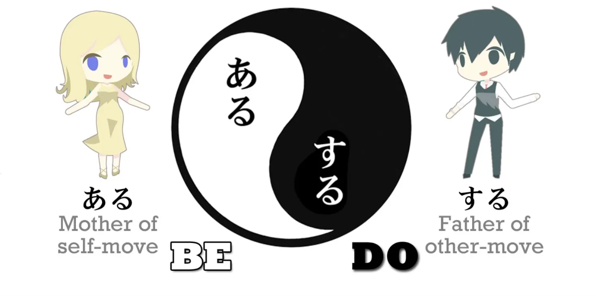
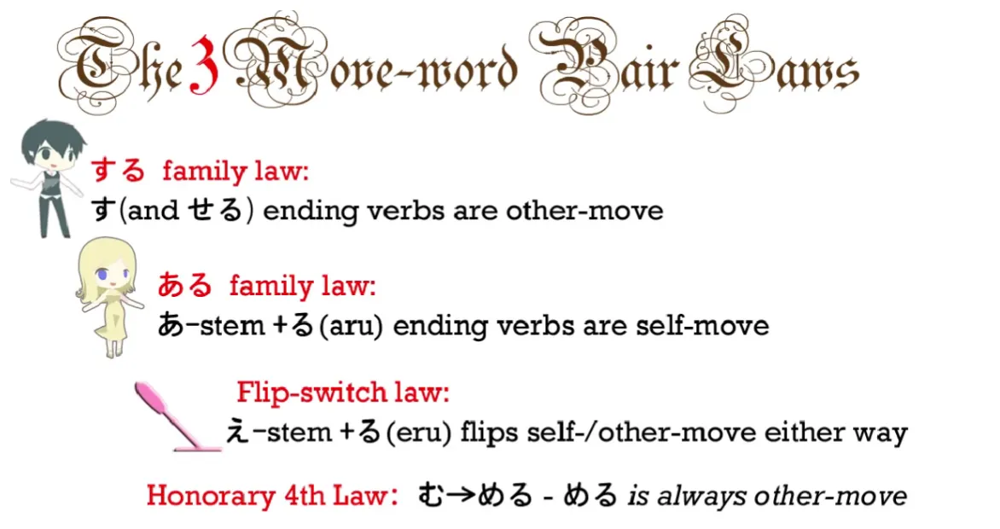
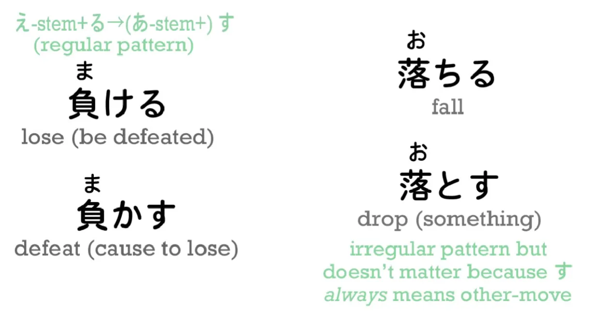
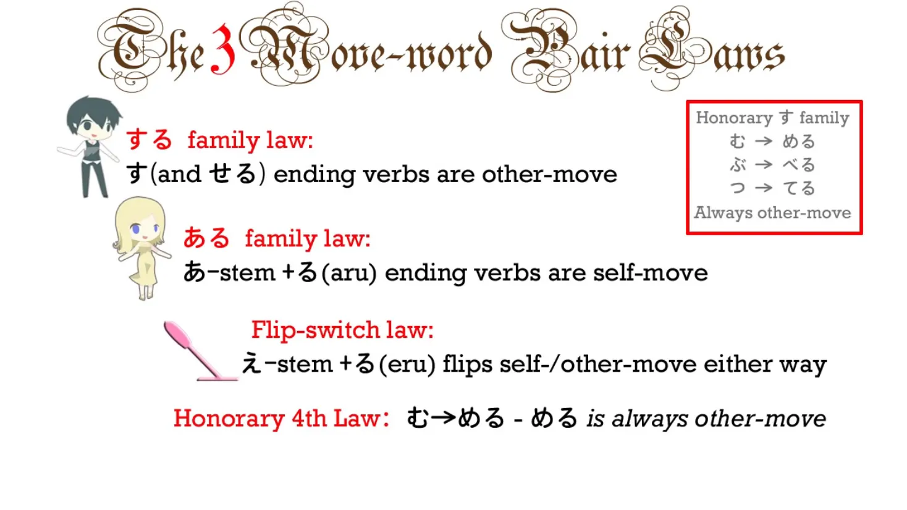
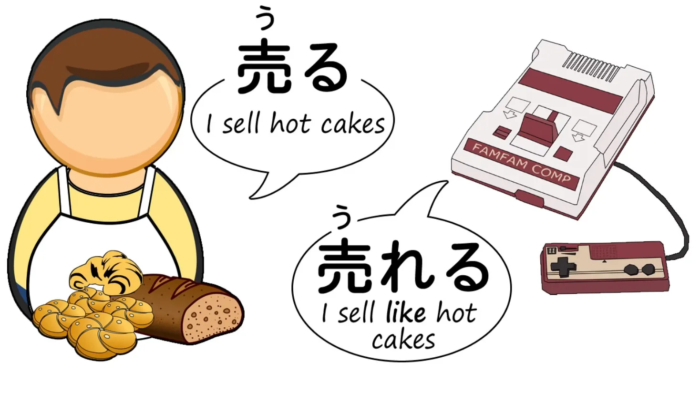
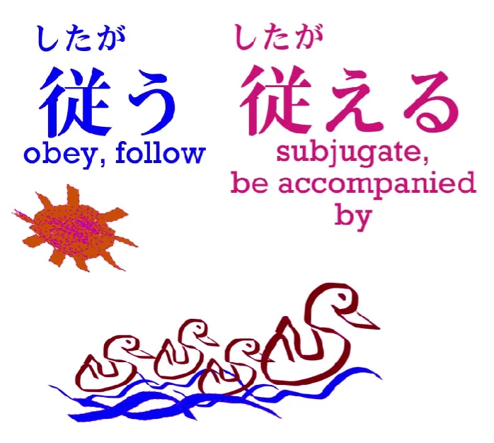

# **15. Kata Kerja Transitif dan Intransitif**

[**Pelajaran 15: Transitivitas—3 hal yang memudahkan. Mengungkap rahasia kata kerja transitif dan intransitif**](https://www.youtube.com/watch?v=ELk1dqaEmyk&amp;list;=PLg9uYxuZf8x_A-vcqqyOFZu06WlhnypWj&amp;index;=17)

こんにちは。

Hari ini kita akan membahas kata-kata yang menunjukkan gerakan diri sendiri dan gerakan orang lain. Jika Anda melihat buku teks atau kamus bahasa Jepang standar, biasanya Anda akan menemukan definisi berikut <code>transitive</code> dan <code>intransitive</code> kata kerja. Sekarang, ini tidak terlalu jauh berbeda dengan beberapa hal yang Anda temukan dalam buku-buku ini, seperti konjugasi, yang tidak ada dalam bahasa Jepang; pasif (tidak ada bentuk pasif dalam bahasa Jepang). **Transitivitas dan intransitivitas memang ada dalam bahasa Jepang dan sebagian besar waktu terdapat tumpang tindih yang besar antara hal tersebut dengan kata kerja gerak diri dan gerak orang lain.** Namun, hal ini tidak selalu berlaku dan bukanlah arti sebenarnya dari gerak diri dan gerak orang lain dalam bahasa Jepang.

Jadi, jika Anda sudah familiar dan nyaman dengan istilah-istilah Barat <code>transitive</code> dan <code>intransitive</code>, tidak ada salahnya menggunakan istilah-istilah tersebut, setidaknya tidak selalu. Namun, jika Anda tidak familiar dengan istilah-istilah tersebut, jangan mencoba mempelajarinya hanya demi bahasa Jepang, karena istilah-istilah tersebut tidak benar-benar akurat.  

::: info
Menurut saya, terkait dengan bahasa Inggris, karena banyak kata kerja yang transitif dalam bahasa Inggris tidak demikian dalam bahasa Jepang, pada dasarnya lebih baik menganggap keduanya sebagai entitas tersendiri untuk menghindari kebingungan.
:::

---

Jadi, apa itu kata kerja gerak diri dan kata kerja gerak orang lain? **Dalam bahasa Jepang, kata kerja gerak, <code> 動詞 (doushi)</code>adalah kata kerja, kata yang menunjukkan suatu tindakan atau gerakan.** 

---

**Jadi, kata gerak diri adalah kata kerja apa pun yang menggerakkan dirinya sendiri. Jadi, jika saya berdiri, itu adalah tindakan gerak diri. Saya tidak memindahkan sesuatu yang lain, saya memindahkan diri saya sendiri.** **Jika saya melempar bola, itu adalah tindakan gerakan orang lain. Saya tidak melempar diri saya sendiri, saya melempar bola.** Dan sebenarnya sesederhana itu.

---

**Sekarang, bahasa Jepang memiliki banyak pasangan kata – jadi bisa dikatakan bahwa kata-kata tersebut adalah dua bentuk dari kata yang sama atau dua kata yang sangat terkait – di mana kita memiliki versi gerakan diri dan gerakan lain.** Jadi, salah satu contoh yang sangat bagus adalah <code>出る(でる)</code> dan <code>出す(だす)</code>. 

Keduanya menggunakan kanji yang sama yang berarti <code>come out</code>. **Bentuk dasarnya adalah <code>出る(でる)</code> dan itu berarti secara sederhana <code>come out</code> atau <code>emerge</code>, dan itulah versi gerakan sendiri.** **Versi gerakan orang lain adalah <code>出す(だす)</code> dan itu berarti <code>take out</code> atau <code>bring out</code>: menyebabkan sesuatu keluar. */ Mengeluarkan sesuatu, dll…*** 

::: info
Jangan bingung dengan terjemahan <code>cause something to</code> sebagai bentuk kausatif[[19]](./19-causative-causative-receptive.md),  
出す memiliki <code>causative</code> sendiri - 出させる(ださせる) yang menandakan **[bentuk kausatifnya](https://www.weblio.jp/content/%E5%87%BA%E3%81%95%E3%81%9B%E3%82%8B).  
*Di sini, Anda melakukan tindakan memindahkan sesuatu. Anda tidak membuat orang lain melakukannya.*
:::

Jadi, dalam kasus pertama, apa pun itu bergerak sendiri; ia keluar; ia muncul. **Dalam kasus kedua, penggerak kalimat, penggerak kata kerja, sedang mengeluarkan sesuatu atau mengambil sesuatu.** 

::: info
jadi, sama seperti kata kerja transitif, kata kerja yang menggerakkan objek lain SEPAKAT seolah-olah menyiratkan sesuatu kepada objek tata bahasa, sedangkan kata kerja intransitif/yang menggerakkan diri sendiri tidak memiliki objek langsung, karena ia menggambarkan/<code>moves</code> hanya dirinya sendiri.
:::

Nah, ini seringkali sangat berguna, karena dalam banyak kasus hal ini memberi kita dua kata yang berbeda yang mudah dipahami karena keduanya sangat terkait. 

---

Misalnya, <code>負ける (まける)</code> berarti <code>lose</code> – ini tidak berarti kehilangan benda atau kehilangan uang, tetapi kalah dalam kontes, kalah dalam perang, kalah dalam pertempuran, kalah dalam permainan – dengan kata lain, dikalahkan. Sekarang, <code>**負かす(まかす)**</code>, yang merupakan versi &quot;other-move&quot; dari <code>**負ける (まける)**</code>, berarti <code>defeat</code> – dengan kata lain, menyebabkan orang lain kalah / *mengalahkan seseorang*. Jadi, di mana kita memiliki dua kata dalam bahasa Inggris, <code>lose</code> dan <code>defeat</code>, dalam bahasa Jepang kita memiliki kata yang pada dasarnya sama dalam versi gerakan diri dan gerakan orang lain.

---

Jadi itu sangat berguna – tetapi tidak begitu berguna jika Anda tidak memahami cara membentuk versi gerakan diri dan gerakan orang lain dari sebuah kata. Jika Anda melihat buku teks standar, kebanyakan akan mengatakan bahwa Anda hanya perlu mempelajari semua kata gerak diri dan semua kata gerak orang lain secara terpisah. Terkadang mereka memberikan daftar pasangan gerak diri dan gerak orang lain – pasangan transitif, seperti yang mereka sebut. Tapi ini tidak benar dan tidak perlu. 

Sebagian besar waktu, kita bisa membedakan mana kata gerak diri dan mana kata gerak orang lain. Ada beberapa aturan sangat sederhana yang mencakup sebagian besar pasangan kata gerak. Dan aturan-aturan itu bahkan lebih mudah jika Anda memahami logika di baliknya. Dan itulah yang akan kita pelajari sekarang.

## ある ＆ する

Hal pertama yang perlu diketahui adalah bahwa ada, seolah-olah, Adam dan Hawa dari kata-kata &quot;self-move&quot; dan &quot;other-move&quot;, ibu dan ayah dari semuanya. Dan kata-kata tersebut adalah <code>ある</code> dan <code>する</code>. 

**<code>ある</code> adalah ibu dari semua kata gerak diri. Artinya hanya <code>be</code>. Jadi, ini adalah kata kerja yang sepenuhnya berorientasi ke dalam. Anda tidak bisa menjadi atau ada sebagai sesuatu yang lain; Anda hanya bisa menjadi dan ada dalam diri Anda sendiri. Ini secara mendasar dan mutlak berorientasi ke dalam, berorientasi pada diri sendiri.**

---

**<code>する</code>, di sisi lain, berarti <code>do</code>. Jadi keduanya berarti <code>be</code> dan <code>do</code>. Dan <code>する</code> dalam dirinya sendiri, sekadar melakukan, tidak pernah bisa ada dengan sendirinya, kamu harus sedang melakukan sesuatu. Jadi ini adalah induk dari semua kata kerja yang bergerak ke luar.**

## Aturan Keluarga &quot;する&quot;

Lalu mengapa kita perlu tahu itu, mengapa penting untuk mengetahuinya? Karena ketika kita tahu itu, hal itu membuka sebagian besar pasangan kata gerak yang akan kita temui. Bagaimana caranya? Nah, ada yang saya sebut 3 hukum pasangan kata gerak. **Dan hukum pertama dari ketiganya adalah jika salah satu dari pasangan tersebut berakhiran -す, maka kata tersebut akan menjadi kata gerak lainnya, selalu. Mengapa? Karena akhiran -す itu terkait dengan <code>する</code>.** 

Jadi, dalam contoh yang kami berikan sebelumnya, <code>出る (でる) / 出す (だす)</code>, <code>出る(でる)</code> berarti <code>come out</code> dan <code>出す（だす)</code>, **yang berakhiran -す, adalah kata kerja pergerakan lain** – itulah yang berarti <code>take **(something else)** out</code>. *- kata kerja ini memerlukan Objek gramatikal.*

Dalam <code>負ける(まける) / 負かす(まかす)</code>, **kita tahu bahwa kata kerja perpindahan**, kata kerja yang berarti <code>make (someone else) lose</code> adalah <code>負か**す**(まかす)</code> **karena berakhiran -す.** Dan banyak sekali pasangan -す tersebut yang benar-benar mengalami transformasi khusus itu, -える menjadi -す. **Tapi tidak selalu.**

Dalam beberapa kasus... kita memiliki, misalnya, <code> 落ちる (おちる)</code>, yang berarti <code>fall</code>, dan <code>落とす (おとす)</code>, yang berarti <code>drop</code>. Keduanya memiliki kanji yang sama; keduanya merupakan pasangan, tidak memiliki akhiran reguler - える menjadi - す, tetapi <code>落とす (おとす)</code> tetap memiliki -す di akhir, jadi kita tetap tahu bahwa itu adalah pasangan &quot;pergerakan lain&quot; dari pasangan tersebut. 

## Aturan Keluarga ある

Sekarang, **aturan kedua adalah bahwa jika salah satu dari pasangan berakhir dengan salah satu dari あ -I-stem + - る**, sehingga berakhir dengan bunyi - ある, **maka itu akan menjadi pasangan pergerakan mandiri dari pasangan tersebut**. Mengapa? Karena - ある terkait dengan <code>ある</code>, induk dari semua kata kerja gerak mandiri.

Pola umumnya di sini adalah -える menjadi -ある. Kita sudah membahasnya di pelajaran sebelumnya, di mana kita memiliki <code>上がる (あがる)</code>, yang berarti <code>rise up/get up</code>, dan <code>上げる (あげる)</code>, yang berarti <code>raise (something) up</code>. Kata ini sangat sering digunakan untuk berarti <code>give (something) upward (to another person)</code>. Jadi kita memiliki <code>上がる (あがる)</code> dan<code>上げる(あげる)</code>, dan kita tahu bahwa pasangan self-move dari pasangan tersebut adalah <code>上がる (あがる)</code> karena berakhiran -ある. Bentuk umumnya di sini adalah -える hingga -ある, **tetapi sekali lagi tidak harus demikian.**

Ada kasus lain, seperti <code>包む(くるむ)</code>, yang berarti <code>wrap</code>, dan <code>包まる(くるまる)</code>, yang berarti <code>be wrapped</code>, tetapi sekali lagi hal ini tidak menjadi masalah karena kita tahu bahwa **yang berakhiran - ある akan selalu menjadi pasangan self-move dari pasangan tersebut.**

## Aturan Pertukaran

Sekarang, **hukum ketiga adalah bahwa jika kita mengambil kata kerja reguler apa pun yang berakhiran - う** (seperti yang semuanya lakukan) **dan mengubahnya ke baris &quot;え&quot; serta menambahkan &quot;る&quot;, yang berarti berakhiran &quot;える&quot;, hal itu akan mengubah kata &quot;self-move&quot; menjadi &quot;other-move&quot; atau sebaliknya.** **Masalahnya adalah kita tidak selalu tahu dari strukturnya ke arah mana kata tersebut akan dibalik.** 

Namun, ini tidak sesulit kelihatannya, karena pertama-tama jumlah kata kerjanya tidak banyak – mayoritas sudah tercakup oleh dua aturan pertama – **dan dari kelompok pembalikan -う menjadi -える ini, mayoritas adalah -む menjadi -める**. Dan **- める adalah – saya akan menyebut ini sebagai anggota kehormatan dari keluarga す.** **Atau Anda bisa mengatakan bahwa - む menjadi - める adalah hukum keempat kehormatan.** Bagaimanapun Anda mengatakannya, **dalam - む hingga - める, - める selalu menjadi pasangan pergerakan orang lain dalam pasangan tersebut.** Dan memang, seiring Anda semakin mahir dalam bahasa Jepang, Anda akan merasakan bahwa **kata kerja yang berakhiran める memiliki nuansa pergerakan orang lain seperti する.** 

---

Dan ini benar-benar semua yang perlu Anda ketahui jika Anda baru memulai dengan kata kerja gerakan diri/gerakan lain, karena ini mencakup sebagian besar pasangan kata kerja yang akan Anda temui. Jadi, jangan merasa bahwa Anda harus mempelajari sisa pelajaran ini. Anda bisa kembali ke sini nanti kapan pun Anda mau. Namun, saya akan menyelesaikannya, sebagian agar Anda memiliki semua informasi yang mungkin Anda butuhkan di masa depan dan sebagian karena hal ini akan memberi kita wawasan lebih dalam tentang bagaimana gerak diri dan gerak orang lain sebenarnya bekerja.

## Aturan Kehormatan

Hal berikutnya yang perlu diketahui adalah bahwa selain -む/-める, yang merupakan aturan utama, ada juga anggota kehormatan lain dalam keluarga &quot;す&quot;, yaitu: -ぶ hingga -べる – **-べる selalu merupakan versi &quot;other-move&quot;** (dan -ぶ serta -む sangat mirip dalam bahasa Jepang; Anda mungkin tahu <code>さびしい/さみしい</code> dan kata-kata lain seperti itu, di mana Anda bisa menggunakan ぶ atau む dalam kata yang sama, **jadi - める dan - べる secara alami keduanya adalah anggota kehormatan dari keluarga す**). Dan juga - つ /- てる – **- てる selalu merupakan pasangan yang bergerak ke arah lain.** 

Jadi pada akhirnya, kita benar-benar memiliki sangat sedikit kartu liar dalam paket ini.

**Satu-satunya yang benar-benar tidak bisa kita tentukan arahnya adalah - く dan - ぐ, ke - ける dan - げる, - う ke - える, serta kata kerja yang berakhiran る yang tidak sesuai dengan dua hukum pertama.** Jadi, ini sebenarnya satu-satunya pengecualian di mana Anda benar-benar tidak bisa mengetahui secara struktural ke arah mana mereka bergerak.

Jadi, adakah yang bisa kita lakukan mengenai minoritas kecil ini yang mengalami perubahan antara gerakan sendiri dan gerakan orang lain? Jawabannya adalah ya. Namun, hal ini sedikit lebih rumit dan akan menjadi lebih mudah seiring dengan meningkatnya kemampuan Anda dalam bahasa Jepang. Jadi, Anda tidak perlu khawatir tentang hal ini jika Anda masih berada di tahap awal. Aturan yang telah saya berikan mencakup sebagian besar kasus. **Namun, ketika kita menghadapi kata kerja yang secara struktural tidak bisa kita tentukan arah pembalikannya, seringkali kita bisa mengetahuinya secara semantik** – artinya, **ketika saya mengatakan bahwa kombinasi &quot;え&quot; ditambah &quot;る&quot; membalikkan transitivitas, itulah tepatnya yang saya maksud.** **Versi -える adalah versi yang terbalik; versi -う adalah versi aslinya, yang terdapat dalam bentuk dasar kata kerja tersebut.** 

Jadi, sebagai contoh, <code>売る(うる)</code> berarti <code>sell</code>; ini adalah kata yang sangat umum.

Ada versi yang kurang umum dari kata tersebut, yaitu <code>売れる(うれる)</code>, dan **itulah versi terbaliknya.** Sekarang, <code>selling</code> jelas merupakan kata kerja perpindahan objek – saya menjual **sesuatu**. Anda tidak bisa hanya menjual secara abstrak. Saya menjual sesuatu dan dengan demikian saya memindahkan benda lain itu – secara harfiah. Namun <code>売れる(うれる)</code> berarti <code>sell</code> dalam arti lain, seperti dalam <code>that game is selling like hot cakes</code>. Jadi **dalam kasus ini, mereka membicarakan penjualan buku atau permainan, sehingga hal yang melakukan penjualan di sini juga merupakan hal yang berpindah, jadi ini adalah versi perpindahan diri**, bukan? **Jadi jelas bahwa <code>売る(うる)</code> pada dasarnya adalah kata kerja perpindahan orang lain, tetapi ketika dibalik, ia memiliki versi perpindahan diri.**

---

Sekarang, jika kita ambil contoh yang berlawanan, <code>従う(したがう)</code> berarti <code>obey</code> atau <code>follow</code>, dan memiliki versi terbalik, <code>従える(したがえる)</code>, yang berarti <code>be followed by</code> atau <code>be obeyed by</code>.

Sekarang, jelas di sini bahwa **ide dasarnya adalah mematuhi atau mengikuti, dan ide yang diperluas adalah sedang dipatuhi atau sedang diikuti.** Jadi **di sini jelas bahwa versi &quot;gerakan lain&quot; akan menjadi versi &quot;える&quot;, karena itu adalah versi terbalik dari konsep dasar, yaitu mematuhi atau mengikuti.**

---

Dan kita juga dapat mencatat di sini bagi kalian yang bertanya-tanya, <code>Why does she say that transitive and intransitive aren&#x27;t correct?</code> – ini adalah contohnya. Kamus Jepang-Inggris memberi tahu kita bahwa <code>従う(したがう)</code> adalah versi intransitif, tetapi jika dipikirkan <code>従う(したがう)</code> berarti <code>obey</code> atau <code>follow</code>. Ini bukan kata tak berobjek. Anda tidak bisa hanya patuh atau mengikuti secara abstrak. Anda patuh pada seseorang atau mengikuti seseorang. Ini adalah kata kerja berobjek.

::: info
Dolly menulis [**ini**](https://www.youtube.com/watch?v=ELk1dqaEmyk&amp;lc;=UgxUPDAQZ2p43DA_Z294AaABAg.8pKE8ZA_tQh8pKQIhLE8L6) dan [**ini**](https://www.youtube.com/watch?v=ELk1dqaEmyk&amp;lc;=Ugw4tQMZRgx1xrAmnOh4AaABAg.9CQONWHmDUq9CQeZrqyaG2), ada juga [**artikel Jepang ini**](https://ameblo.jp/stravaganza-no2/entry-12013152846.html) tentang beberapa kata kerja yang bergerak sendiri/intransitif? yang menggunakan &quot;を&quot;, yang biasanya… tidak gramatikal?, saya tidak sepenuhnya yakin dalam menjelaskannya karena kemampuan bahasa Jepang saya masih cukup terbatas, jadi jika ada yang ingin ditanyakan, silakan hubungi saya,  
:::

Saya kira akan lebih baik jika tidak memandangnya semata-mata sebagai transitif = selalu menggerakkan orang lain, dll.  
Jadi, saya sarankan Anda melakukan riset sendiri mengenai masalah ini dan memutuskan bagaimana mengatasinya.*

Lalu mengapa kamus menyebutnya intransitif? **Karena mereka telah berkomitmen untuk menerjemahkan &quot;gerakan diri&quot; sebagai intransitif, namun meskipun itu adalah kata kerja transitif – Anda menuruti seseorang, Anda mengikuti seseorang – itu juga merupakan kata kerja &quot;gerakan diri&quot;.**

---

**Dalam mematuhi atau mengikuti seseorang, Anda tidak menggerakkan orang lain tersebut.** **Anda menggerakkan diri Anda sendiri.** **Dalam dipatuhi atau diikuti, Anda tidak menggerakkan diri Anda sendiri, melainkan menggerakkan orang lain tersebut.** Jadi ini adalah salah satu kasus di mana &quot;self-move&quot; dan &quot;other-move&quot; tidak sesuai dengan transitif dan intransitif.

---

**Kasus-kasus seperti itu tidak terlalu banyak, jadi tidak masalah jika Anda ingin menggunakan kata kerja transitif dan intransitif, tetapi sadarilah bahwa maknanya tidak persis sama dalam setiap kasus, dan dalam beberapa kasus sama sekali tidak cocok.** 

Sekarang, seperti yang saya katakan, jika Anda hanya ingin mengingat tiga aturan ini dan tidak yang lain, hal itu akan memudahkan pemahaman Anda tentang kata kerja gerakan diri dan gerakan orang lain. Dalam kebanyakan kasus, Anda dapat memahaminya hanya dengan itu. Jadi, sisa dari apa yang telah saya jelaskan sangat berguna saat Anda semakin mahir dalam bahasa Jepang, tetapi jika Anda hanya mengingat konsep gerakan sendiri dan gerakan orang lain serta tiga aturan dasar: **bentuk -ある selalu merupakan kata kerja gerak diri,** **bentuk -す, dan -せる selalu merupakan kata kerja gerak orang lain**, dan jika Anda juga mengingat bahwa **bentuk -める selalu merupakan kata kerja gerak orang lain**, hal itu layak untuk diingat karena mencakup banyak hal. Dan dengan itu, Anda benar-benar sudah menguasai sebagian besar masalah kata kerja self-move dan other-move.