# **16. Partikel "てみる", "や", "から", eksklusif `and`**

[**Pelajaran 16: Te-miru, `try doing`, partikel ya, partikel kara, eksklusif-`and` + lebih banyak Alice**](https://www.youtube.com/watch?v=H_jePzcPFAQ&list=PLg9uYxuZf8x_A-vcqqyOFZu06WlhnypWj&index=18)

こんにちは。

Hari ini kita akan kembali melanjutkan bedah cerita petualangan Alice. Kali ini kita akan melihat teks aslinya dalam format yang lebih panjang, karena saya ingin kamu benar-benar terbiasa membedah kerangka struktur kalimat-kalimat ini. 
Jika kamu ingat dari episode sebelumnya, Alice baru saja melompat masuk ke lubang kelinci. Dan di luar dugaan, ia mendapati dirinya jatuh melayang dengan sangat perlahan ke dalam sumur vertikal yang dalam.

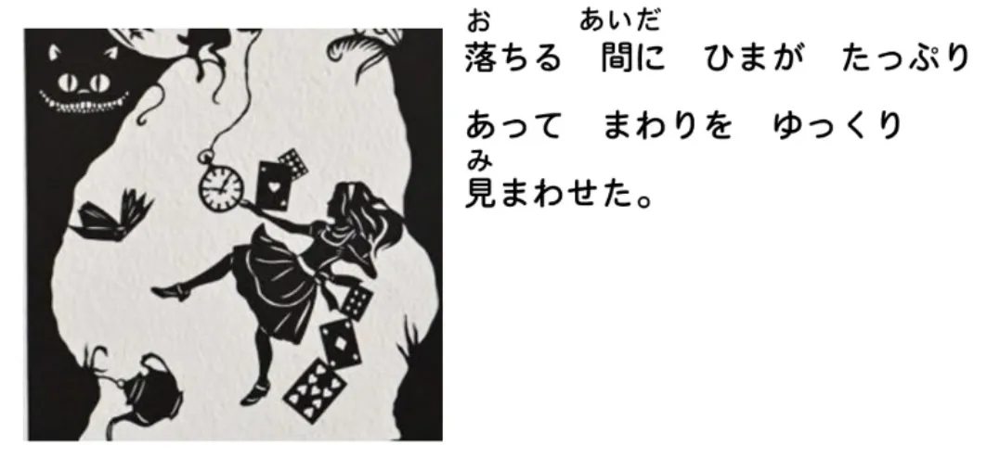

> `落ちる間にひまがたっぷりあってまわりをゆっくり見まわせた。` (Ochiru aida ni hima ga tappuri atte mawari o yukkuri mimawaseta).

Saya akan memberikan terjemahan utuhnya terlebih dahulu, lalu kita akan memutilasi strukturnya satu per satu.
Terjemahannya: `Selama ia melayang jatuh, ada banyak waktu luang sehingga ia bisa memandang perlahan ke sekeliling.`

Mari kita bedah:
**`落ちる間に` (Ochiru aida ni):**
`落ちる` seperti yang kita ketahui adalah `jatuh`. `間` (Aida) berarti periode waktu, **dan juga berarti ruang jeda di antara dua hal.** Tentu saja, "periode waktu" pada dasarnya adalah metafora—karena waktu hanyalah 'ruang jeda' di antara dua titik peristiwa (punya titik awal dan titik akhir). 
Jadi, `落ちる間に` berarti `**selama/sepanjang jeda waktu** (ia) sedang jatuh`.

---

**`ひま` (Hima):**
`ひま` berarti `waktu luang / waktu senggang`. Ini adalah kosakata yang mutlak akan sering kamu temui. **Kata ini bisa bernuansa positif maupun negatif**. Bisa berarti 'waktu bebas untuk bersantai', atau bisa berarti 'waktu nganggur / tidak ada kerjaan / bosan'. 
Di konteks cerita ini, `ひま` murni merujuk pada "banyaknya waktu kosong" untuk melihat-lihat. Karena dia sedang melayang jatuh, dia jelas tidak bisa melakukan aktivitas lain, apalagi dia jatuhnya sangat lambat.

---

**`たっぷり` (Tappuri):**
`たっぷり` berarti `dalam jumlah berlimpah / melimpah ruah`. **Ini adalah contoh dari jenis kata keterangan (*Adverb*) khusus berakhiran "り" (Ri) yang kebal hukum dan TIDAK MEMBUTUHKAN tambahan partikel `に`.** 
Istilah ini memancarkan nuansa seperti air yang membeludak keluar dari keran: `たっぷり` = `berlimpah ruah`. **Dan dalam kalimat ini, ia beroperasi sebagai kata keterangan yang mendeskripsikan melimpahnya wujud `ひま` (waktu luang) tersebut.**

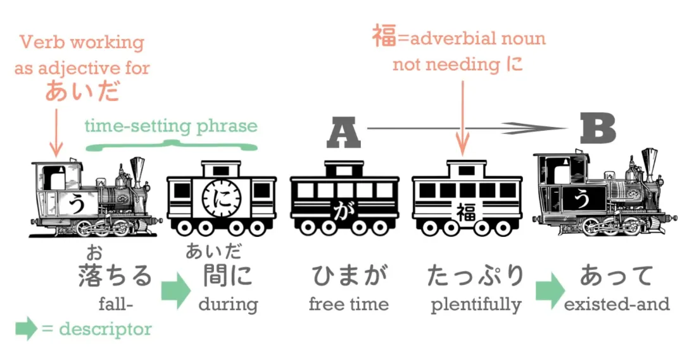

Jadi, kita telah mengupas klausa logis paruh pertamanya: `落ちる間に…` (**Ini murni cuma menetapkan latar waktu/durasi aksinya. Karena ini adalah 'titik waktu absolut', ia butuh ditandai partikel `に`**) `...ひまがたっぷりあって` (`...terdapat banyak sekali waktu luang, sehingga...` [*Bentuk-te `あって` dipakai sebagai penyambung klausa*]).

---

Sekarang, kita masuk ke klausa paruh kedua: **`まわりをゆっくり見まわせた`**. Ini sangat seru karena di sini kita menemukan contoh nyata dari praktik 'Gerak Diri / Gerak Orang Lain' (Transitif/Intransitif) yang baru kita kuasai minggu lalu.

Perhatikan akar dasarnya: `回る` (Mawaru) berarti `berkeliling / berputar / bergerak memutari`. (Sebagai *intermezzo*, sebutan akrab kekanak-kanakan untuk polisi patroli di Jepang adalah `おまわりさん` / O-mawari-san, yang secara harfiah berarti `Pak Tukang Berkeliling`).

---

Lalu, apa pasangannya? `回す` (Mawasu) berarti `**membuat (sesuatu)** berputar / **mengirim (sesuatu)** berkeliling`. Tentu saja, berdasarkan Aturan Emas Pelajaran 15, kita otomatis bisa menebak dengan gampang: mana yang bertindak sebagai kata 'Gerak Diri' (berputar sendiri), dan mana yang bertindak sebagai **'Gerak Orang Lain'** (memutar objek lain)? Wujud yang bermakna "memutar objek lain" **pasti yang memiliki ekor `-す` (Mawasu)**.

---

Sekarang, yang tertulis di teks kita sebenarnya bukanlah `回る` atau `回す`. Yang tertulis adalah wujud **`まわり`**. 
Seperti yang pernah saya singgung sepintas, **ketika kita menyulap kata kerja ke dalam wujud *I-stem* (Akar baris 'い'), lalu kita biarkan ia berdiri sendiri sebagai entitas utuh, maka wujud itu biasanya OTOMATIS BERUBAH MENJADI KATA BENDA.** 

Jadi, apa arti dari `まわり` (mawari)? Pada dasarnya, kata benda ini memiliki dua makna: 
1. **Bisa menjadi wujud kata benda murni dari kegiatan `回る`**. Artinya adalah 'tindakan berkeliling / berpatroli'. Ini persis seperti yang kita temukan di julukan `おまわりさん` tadi. `まわり` di sana berarti tindakan melakukan patroli.
2. **Atau, maknanya bisa merujuk pada `area sekeliling / lingkungan sekitar`.** (Dalam hal ini, bahasa Jepang biasanya menggunakan wujud kanji yang berbeda untuk menegaskan bahwa maknanya sedikit berbeda). 

::: info
Bentuk Kanji untuk 'lingkungan sekitar' adalah 周り (mawari).
:::
**Jadi di konteks cerita ini, kata tersebut murni merujuk pada area sekitar, bukan tindakan berkeliling.**

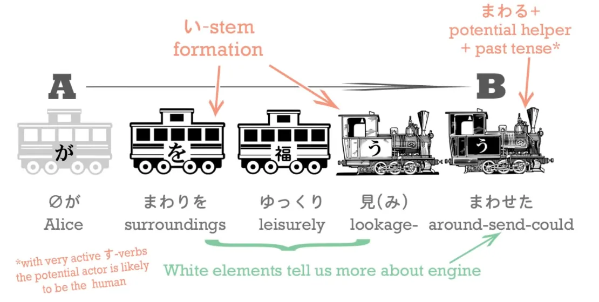

::: info
(Catatan Editor: Hati-hati, **tulisan kanji oranye di pojok kanan atas gambar tersebut (まわる) seharusnya adalah まわす.** Dolly *Sensei* sudah mengakui *typo* penulisan tersebut [**di kolom komentarnya**](https://www.youtube.com/watch?v=H_jePzcPFAQ&lc=UgzlHz19j_bcvzKlnGl4AaABAg.9CT4jGElSLJ9CTDDRs1sOu)).

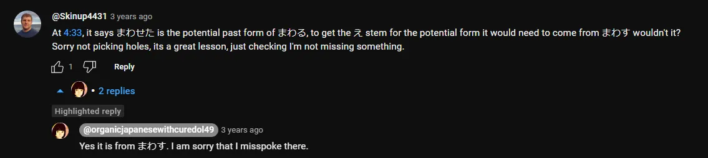
:::

Sekarang mari kita satukan: `(zeroが) まわりをゆっくり見まわせた` berarti `(ia) dengan santai bisa...`
(Mengingatkan kembali: `ゆっくり` adalah kata keterangan mandiri yang berarti 'dengan perlahan/santai', yang kita pelajari minggu lalu[[14]](./14-adverbs-and-the-mo-particle.md)).

...dia dengan santai bisa melakukan `見まわす` (mi-mawasu).

Apa sih arti `見まわす`? Kita sudah tahu apa arti `まわす`—artinya `membuat (sesuatu) berkeliling`. 
Lalu **`見まわす` murni hanyalah proses menempelkan kata `まわす` ke ekor *I-stem* dari kata kerja `見る` (melihat/pandangan).** 
*(Sekadar catatan teknis: kita memang tidak bisa melihat dengan jelas wujud perubahannya karena `見る` adalah kelompok Ichidan, dan semua akar Ichidan terlihat seperti wujud dasarnya. Tapi kita tahu pasti bahwa itu adalah wujud "Akar-い" (atau bahasa akademisnya 連用形 / Ren'youkei), karena aturan mutlaknya: kita harus memakai Akar-い untuk menyambung satu kata kerja dengan kata kerja lain).*

---

Jadi, **`見まわす` (mimawasu) secara harfiah merangkai logika: "Kirimkan pandanganmu berkeliling / Sapukan sinar matamu memutari area tersebut".** 
Sehingga `まわりを見まわす` bermakna `memandang ke sekeliling tempat tersebut / menyapu pandangan ke area sekitar`. 

Lalu kenapa ujung kalimat ceritanya berubah menjadi `**見まわせる**` (mimawaseru)? Karena, seperti yang sudah kita pelajari, itu adalah WUJUD POTENSIAL dari `見まわす`! (Artinya: "BISA menyapu pandangan").

---

Jadi, struktur mutlak dari klausa ini adalah: `because a lot of time existed she was able to leisurely send her looking around the surroundings` (Karena banyak sekali waktu luang, ia BISA dengan santai menyapukan pandangannya memutari lingkungan sekelilingnya).

**`落ちる間にひまがたっぷりあってまわりをゆっくり見まわせた`**

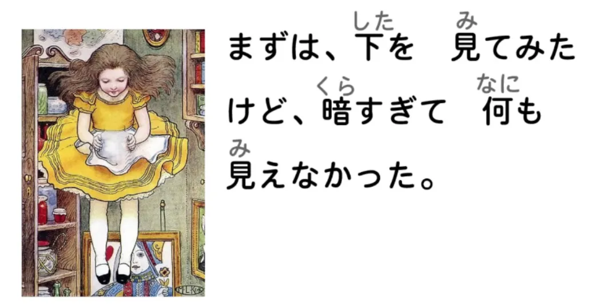

> `まずは、下を見てみたけど、暗すぎて何も見えなかった。` (Mazu wa, shita o mite mita kedo, kurasugite nani mo mienakatta).

Terjemahannya: `Pertama-tama, ia mencoba menengok ke bawah, tapi karena terlalu gelap, tidak ada satu pun hal yang bisa terlihat.`

`まずは` (mazu wa) berarti `pertama-tama / sebagai permulaan`. Kata dasar `まず` aslinya berarti `dari awal mula`.

Mari kita bedah separuh awalnya: `まずは、下を 見てみた` (Mazu wa, shita o mite mita).

Kita sudah tahu bahwa `下を見る` (Shita o miru) bermakna `Melihat [ke] bawah`. **(Ingat bahwa konsep arah letak seperti 'bawah' / `下` selalu berstatus sebagai KATA BENDA dalam tata bahasa Jepang).** Jadi secara harfiah kamu sedang 'memandang area bawah' (`下を見る`). 

**TETAPI yang tertulis di teks bukanlah `見る` (miru); melainkan `見てみた` (mite mita).** Nah, ini adalah salah satu struktur pamungkas bahasa Jepang yang akan kamu dengar seumur hidupmu.

## Rumus Mencoba: -てみる (Te-miru)

**Setiap kali kita menyambungkan kata `みる` (miru) di belakang Wujud-te (`-て`) dari kata kerja lain, kita secara tata bahasa sedang mengatakan "MENCOBA MELAKUKAN SESUATU".** 
Makna literal dari rumus Te-Miru ini adalah: `Lakukan aksi itu, dan lihatlah (apa hasilnya)`. 

Contoh: `食べてみる` (tabete miru) berarti `try to eat it / makanlah dan lihat (apakah rasanya enak) / cicipilah`. 

Simulasi obrolan nyata:
***A:*** `Kamu suka makanan ini?` 
***B:*** `Entahlah, aku belum pernah makan.` 
***A:*** `食べてみてください` (Tabete mite kudasai). -> `Tolong cobalah! / Makanlah dan lihat sendiri (bagaimana rasanya).`

Orang Jepang juga sangat sering mengucap `やってみる` (yatte miru). Artinya: `Aku akan mencobanya! / Biar kulakukan dan lihat apa yang akan terjadi`. 
**(`やる` / yaru adalah wujud kasar/kasual dari `する` / suru).** Kamu memang bisa bilang `してみる` (shite miru) di dalam situasi yang kaku dan formal, **tetapi dalam obrolan sehari-hari orang jauh lebih suka ngomong `やってみる`**: `Ayo coba! / Hajar dan lihat hasilnya!`.

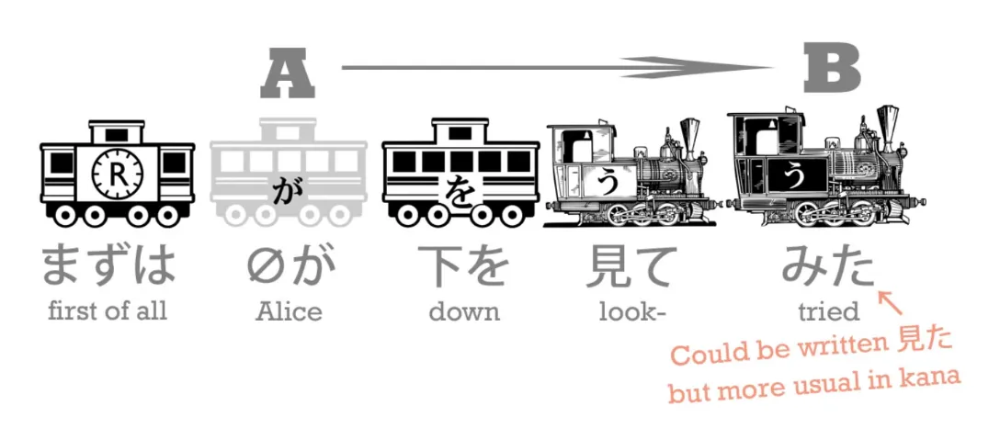

**Jadi di teks cerita Alice ini, kita secara harfiah sedang menyandingkan `見る` (melihat) dengan `みる` (mencoba). Frasa aslinya menjadi: `見てみる`** (Mite miru).
Artinya: `Mencoba untuk melihat / menengok dan mencoba melihat [ada apa di bawah sana]`.

Lalu, kita masuk ke klausa kedua: `下を見てみたけど、暗すぎて`. (`...mencoba melihat ke bawah, tapi [itu] terlampau gelap...`).
`暗い` (kurai) berarti `gelap` dan `すぎる` (sugiru), seperti yang pernah kita bedah, memiliki makna dasar `melampaui/kebablasan/berlebihan`. **Jadi, ketika disambung menjadi `暗すぎて` (kurasugite), maknanya memadat menjadi `terlalu (gelap) / berlebihan (gelapnya).`**

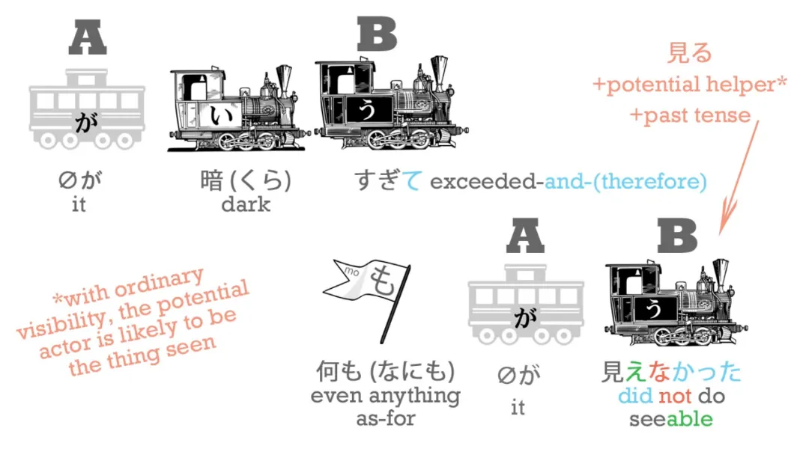

Lanjut ke ekor kalimat: `暗すぎて何も見えなかった`. 
`何も` (nani mo) berarti `sama sekali tidak (sesuatu apa pun)`. (Dolly sudah membuat [**satu video eksklusif**](https://www.youtube.com/watch?v=00nKUtmnzvI) untuk membahas tuntas pola penyangkalan "Mo" ini kalau kamu ingin mendalami triknya). 

Lalu ada `何も見えなかった` (Nani mo mienakatta). 
Perhatikan baik-baik: `見る` (miru) adalah tindakan aktif *melihat*. **Sedangkan `見える` (mieru) bermakna `to be visible / bisa terlihat / memancarkan pantulan yang bisa dilihat`.**

::: info
(Catatan Editor soal miskonsepsi `Mieru` vs `Mirareru`):

Untuk menghindari otakmu tersesat, mari kita klarifikasi masalah ini. Banyak pemula yang pusing dan protes di kolom komentar [**video aslinya**](https://www.youtube.com/watch?v=H_jePzcPFAQ&list=PLg9uYxuZf8x_A-vcqqyOFZu06WlhnypWj&index=22) saat pertama kali mendengarkan penjelasan Dolly di menit ini. 

Dalam rekaman video aslinya, Dolly-*sensei* sempat terpeleset lidah (dan ia sudah meralatnya [**di kolom komentar ini**](https://www.youtube.com/watch?v=H_jePzcPFAQ&lc=UgxS1dUK8UsQQcHxLKd4AaABAg.9KdTNWq3xuG9Kdu0Oxpim9)). Di video, Dolly tidak sengaja bilang bahwa arti `見える` adalah *"be able to see"* (mampu/bisa melihat). Ucapan spontan itu tentu saja akan membuat pemula bingung dan menyamakannya dengan wujud potensial `見られる` (bisa melihat).

---

FAKTANYA: Yang sedang Dolly maksud di sini adalah, `見える` (mieru) merupakan pasangan 'Gerak Diri' (Intransitif) mutlak dari kata kerja 'Melihat' (`見る`). Sehingga makna asli dari `見える` murni adalah `"Bisa terlihat / Menampakkan visibilitas fisiknya"`. 

Ini adalah perbedaan sudut pandang yang luar biasa tipis jika dibandingkan dengan wujud potensial murni `見られる` (mirareru).  
Seperti yang diklarifikasi oleh Dolly [**di komentarnya**](https://www.youtube.com/watch?v=H_jePzcPFAQ&lc=Ugz_8te5VO3ktLe0ZVR4AaABAg.96aHgVhcdAL96aMdVNs3c-): Kata `見える` ini BISA berfungsi merangkap sebagai bentuk potensial (bisa dilihat) sekaligus berfungsi sebagai versi Gerak Diri dari "見る". 
`見える` ini jelas merupakan kosakata yang berbeda genetik dari `見られる`. Kasus ini persis sama seperti anomali kata potensial mutlak `できる` (Dekiru) yang kita pelajari di Pelajaran 10. **(Dolly akan membongkar tuntas akar filosofis masalah *Mieru* ini di Pelajaran 54).**

Intinya: Meskipun keduanya (`Mieru` dan `Mirareru`) terjemahannya sama-sama menyiratkan unsur "potensi / bisa", tetap ada perbedaan mendasar. 
- Jika kamu memuji orang buta yang sembuh: "Wah, kamu *sudah mampu* melihat lagi!" -> Gunakan Potensial Murni: `見られる` (Mirareru).
- Jika kamu memicingkan mata melihat tulisan semut di kejauhan: "Wah, tulisannya *nggak kelihatan*!" -> Gunakan Potensial Fisik: `見えない` (Mienai).
:::

Jika kita membedah anatomi kalimat ini, **kita WAJIB meletakkan sebuah subjek imajiner yang memegang `が` di awal klausa kedua ini.** 
`何も **(zero-ga)** 見えなかった`.

Lalu siapa sosok *zero-ga* dalam kasus gelap ini? Jika kita ngotot pakai sudut pandang bahasa Indonesia/Inggris, otak kita pasti langsung menebak itu adalah Alice: `Alice (ga) tidak bisa melihat apa pun`. 
**SALAH BESAR. Dalam tata bahasa Jepang, pemegang `が`-nya mutlak adalah si `何` (Hal/Sesuatu apa pun itu).** 
Makna literal Jepangnya adalah: **`Nothing was able to be seen / Tidak ada satu PUN BENDA yang fisiknya mampu terlihat`!**

---

Kenapa harus si benda yang memegang subjek? Karena aturan mutlak bahasa Jepang mengatakan: untuk ungkapan potensial bawaan seperti **`見える / 見えない`** (terlihat/tidak terlihat) dan **`聞こえる / 聞こえない`** (terdengar/tidak terdengar) — **kita TIDAK BISA menggunakan kata-kata itu untuk 'Manusia yang memiliki kemampuan melihat', MELAINKAN kita menggunakannya untuk 'Benda fisik yang keberadaannya sanggup dilihat'.** 
(Kita kan sudah membahas logika pemindahan subjek ini panjang lebar di kelas Wujud Potensial).[[10]](./10-helper-verbs-the-potential-helper-verb.md)

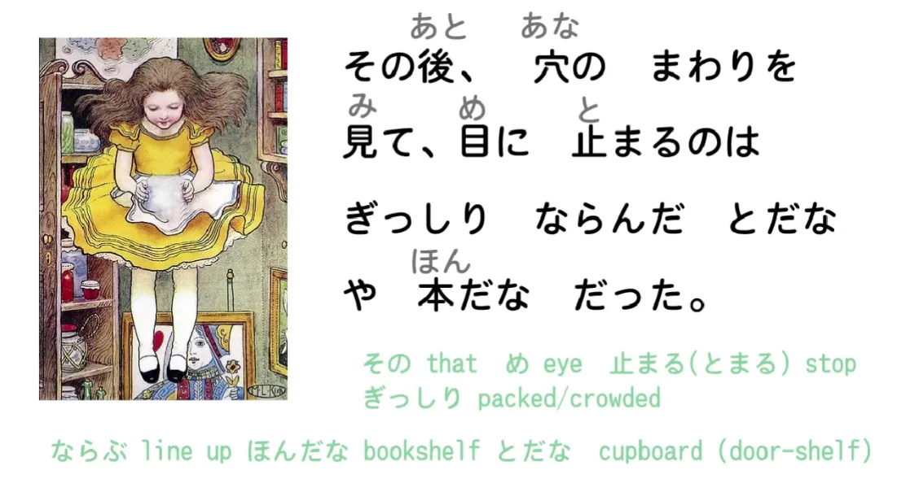

> `その後、穴のまわりを見て` (Sono ato, ana no mawari o mite).

Kita bedah `その後` (sono ato). `後` (ato), seperti yang kita ketahui, berarti `setelah / belakang` (kita baru saja memakainya di konteks Alice mengejar bagian belakang kelinci). **Tetapi dalam konteks ini, ia bertindak sebagai penunjuk waktu (*after that / setelah itu*).** 
`その` (sono) berarti `itu`; **`その後` (sono ato) berarti `setelah itu`.** 
Jadi, ini murni hanyalah keterangan waktu untuk menyusun kronologi narasi cerita. **Dan ingat, karena ini adalah patokan waktu 'relatif' (`setelah kejadian tertentu`), ia kebal hukum dan TIDAK PERLU ditambahkan partikel `に`.**

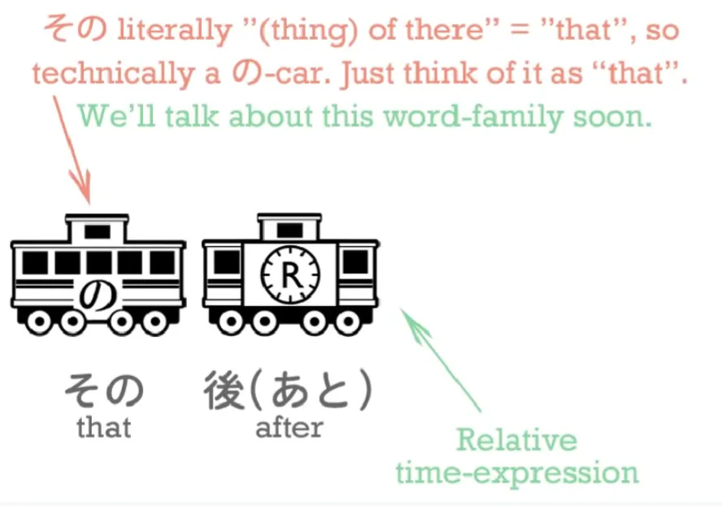

`その後、穴のまわりを見て` 
(Jadi sekarang dia tidak lagi menunduk melihat kegelapan bawah). Frasa ini berarti: `Setelah itu, ia melihat ke area sekeliling (まわり / 周り) dinding lubang tersebut...`

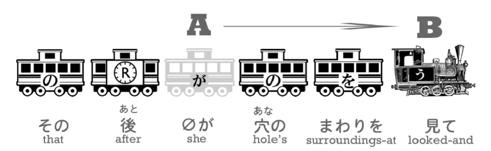

---

> `目に止まるのはぎっしりならんだとだなや本だなだった` (Me ni tomaru no wa gisshiri naranda todana ya hondana datta).

Baiklah, yang satu ini tingkat kerumitannya lumayan tinggi. 
`目に止まるのは` (Me ni tomaru no wa) secara harfiah merangkai logika: `hal ('No'/'Koto') yang berhenti mendarat di matanya adalah...`

Bisa dibilang, ungkapan sastra ini adalah padanan langsung dari idiom bahasa Inggris `the thing that caught her eye` (hal yang menangkap/menarik perhatiannya). Karena dalam kondisi jatuh bebas, berbagai macam barang melesat melintasi pandangannya, lalu tiba-tiba ada satu objek yang 'menancap / berhenti' (tomaru) diam di retinanya. 

Namun, perhatikan juga trik kelas dewa dari penggunaan partikel "の" (No) di sini. Seperti yang kita pelajari, "の" identik dengan tanda kutip 'S (*apostrophe-s*) di bahasa Inggris untuk menyatakan kepemilikan. `さくらのドレス` = `Sakura's dress / Gaun milik Sakura`.

Nah, bayangkan simulasi ini. Misal Sakura dan Mary sama-sama mengenakan gaun, lalu kamu ditanya, `Gaun siapa yang paling kamu suka?` 
Di bahasa Indonesia, kamu bisa menjawab lengkap: `Saya suka gaun Sakura`. ATAU kamu bisa menyingkatnya praktis jadi: `Saya suka milik Sakura`. 
Dalam bahasa Inggris, kamu bisa bilang `Sakura's dress` ATAU cukup dipangkas jadi `Sakura's`. 
**Dan hukum efisiensi yang sama persis BERLAKU DI BAHASA JEPANG.** **Kamu bisa menyingkatnya dengan membuang objeknya, menyisakan `さくらの` (Milik Sakura / Kepunyaan Sakura).** 

Sistem pangkas memangkas *No* ini sering banget diperluas penggunaannya dalam bahasa Jepang. (Dolly sudah membuat [**video eksklusif**](https://www.youtube.com/watch?v=Bq3GO63D9bw) yang mengupas tuntas trik khusus "の" ini kalau kamu ingin membongkar seluruh rahasianya).

---

Namun di konteks cerita ini, `の` dikembangkan fungsinya untuk merepresentasikan `benda/hal` secara universal. 
`目に止まるの` -> `benda / sesuatu yang berhenti di matanya`. 

Jadi, klausa awal `穴のまわりを見て、目に止まるのは` berarti: *"Saat melihat ke area sekeliling lubang itu, benda yang menangkap perhatian matanya adalah..."*

Lalu, apa sosok bendanya?

`*(zero-ga)* ぎっしりならんだとだなや本だなだった`. 

Mari kita bedah kosakata `ぎっしり` (gisshiri). **Ini adalah satu lagi anggota keluarga 'Kata keterangan berakhiran り (Ri)' yang kebal hukum dan TIDAK BUTUH partikel "に".** 
`ぎっしり` berarti `dikemas secara padat/rapat/sesak`. 

Lalu `ならんだ` (naranda) adalah bentuk lampau dari `ならぶ` (berjejer / berbaris lurus). 
Jadi kombinasi maut `**ぎっしり ならんだ**` bermakna `**berjejer-jejer sangat padat** / **tersusun rapat**`. 

Lanjut ke objeknya: `とだなや本だなだった` (Todana ya hondana datta).
Kata asal untuk 'rak' dalam bahasa Jepang adalah `たな` (tana). Dan setiap kali kita menempelkan awalan di depan `tana` untuk menspesifikasikan jenis rak apa itu, kita membangkitkan hukum *Ten-ten hooking* (Pengaitan *Ten-ten*) `〃` yang kita pelajari di Pelajaran 12.  
Jadi huruf `た` berubah tumpul menjadi `だ`. 

`とだな` (Todana): `と` (to) berarti `pintu`. Secara harfiah `とだな` adalah `rak-berpintu`. Ini adalah istilah resmi bahasa Jepang untuk **Lemari**. Menurut saya, ini istilah yang jauh lebih nyambung dan efisien ketimbang ejaan bahasa Inggris (cupboard). Lemari memang rak yang dikasih pintu, kan? 
Lalu `本だな` (Hondana) jauh lebih mudah ditebak: secara harfiah itu adalah Rak Buku.

## Partikel "や" + "Dan" Eksklusif (`と`)

Sekarang, kita harus membongkar fungsi partikel sakti `や` (ya) ini. 
Ketika kamu ingin mengatakan `DAN` (menggabungkan benda A `dan` benda B)—bagaimana kamu mengatakannya dalam tata bahasa Jepang? 

Kita tahu bahwa untuk menyambung DUA KLAUSA AKTIVITAS, kita memakai 'Wujud-te', atau `でも` (tapi/dan juga). 
Dalam bahasa Indonesia/Inggris, kita cukup malas dan selalu menggunakan satu kata sakti `dan/and` di segala situasi (Cth: `Roti DAN mentega`, `Buku DAN pensil`, atau `Aku pergi ke toko DAN beli roti`). 
**Namun di tata bahasa Jepang, kita TIDAK BISA malas pakai satu rumus yang sama untuk menyambung klausa dan menyambung deretan benda.** 

Untuk tugas menderetkan dua atau lebih BENDA FISIK, bahasa Jepang punya DUA partikel khusus. 
Yang pertama adalah partikel "と" (to). Kita sudah kenal reputasi "と" sebagai partikel kutipan, **tetapi pekerjaan paruh waktunya adalah bertindak sebagai partikel "dan" untuk benda.** Jadi, `pensil dan buku` menjadi `ペンと本`. 
Lalu yang kedua adalah partikel "や" (ya). Kita bisa menderetkan banyak objek memakai `や`. 

Lalu apa dong fungsi bedanya `と` dan `や`?

---

Ternyata, perbedaan filosofisnya SANGAT masif dan fungsional (bahkan bahasa Indonesia dan Inggris harusnya punya kata berbeda untuk memisahkan ini). 

**`と` adalah partikel `DAN` yang bersifat EKSKLUSIF (Mutlak/Tertutup).** 
Jika saya bertanya kepadamu, `Apa isi di dalam kotak itu?` dan kamu menjawab `ペンとえんぴつ` (Pensil `と` pulpen). 
**Kamu secara harfiah sedang menyiarkan fakta hukum bahwa isi kotak itu HANYA ADA pensil dan pulpen, dan BENAR-BENAR TIDAK ADA BENDA LAIN LAGI di dalam kotak itu.**

**Sebaliknya, `や` adalah partikel `DAN` yang bersifat INKLUSIF (Terbuka/Di antaranya).**
Jika kamu menjawab `ペンやえんぴつ` (Pensil `や` pulpen), kamu sedang memberitahu saya bahwa di dalam sana ada pulpen dan pensil **DAN BESAR KEMUNGKINAN masih ada benda-benda lain berserakan di sana**. **Biasanya kamu memakai ini untuk menyebutkan beberapa 'contoh utama' saja dan membiarkan benda lainnya tidak disebut.** 

Jadi, saat Alice melayang jatuh, apa yang "tertangkap matanya"? Fakta bahwa Dinding lubang kelinci itu dijejali oleh Lemari dan Rak Buku **(Dan mungkin masih banyak tempelan perabotan aneh lainnya yang berjejer rapat di sepanjang dinding)**.

---

::: info
*(Catatan Editor:* Tulisan furigana "取り下ろした" (Tori-oroshita) dalam visual video aslinya salah cetak; mereka kelebihan menaruh huruf "ろ" (ro) melayang di atas "下". Abaikan visual cacat itu dan baca saja sebagai `とりおろした`.  
Saya sudah membersihkannya di transkrip teks ini. Aksi menurunkan benda bisa ditulis menggunakan dua sistem ejaan: 下す (orosu) atau 下ろす (orosu). Kedua ejaan resmi ini sah. Ejaan 下す adalah versi penulisan *okurigana* tak beraturan (tradisional) dari 下ろす).
:::

## Pemakaian Fundamental Partikel `から` (Dari)

> `たなの一つからびんを取り下した` (Tana no hitotsu kara bin o torioroshita).

`たなの一つ` (Tana no hitotsu): `一つ` (Hitotsu) berarti `satu / salah satu`. 
**`から` (Kara) adalah partikel penunjuk arah awal yang berarti `DARI`.** 
Di kalimat ini, ia mencabut kata `たな` (tana / rak-rak) dan membiarkannya berdiri sendiri secara independen (sehingga ia tetap dibaca *Tana*, bukan *Dana* yang terkena *ten-ten hooking* seperti dalam *Hondana*). 

Jadi, kalimat `たなの一つから` (tana no hitotsu kara) murni bermakna `**Dari** salah satu rak tersebut`. Kamu bisa melihat bahwa susunan struktur bahasanya identik 100% dengan frasa Inggris `**from** one of the shelves`.

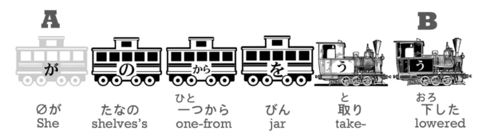

`*(zero-ga)* たなの一つからびんを取り下ろした.`

Sekarang, `取る` (toru) berarti `mengambil`, dan `下す` (orosu) — kalau kamu melirik kanjinya, itu adalah kanji yang sama untuk `bawah` (下). Dan ini membuktikan satu rahasia besar: **kedua kata ini sebenarnya juga adalah pasangan evolusi 'Gerak Diri' / 'Gerak Orang Lain'**, persis seperti teori yang kita telan bulat-bulat di pelajaran sebelumnya.  

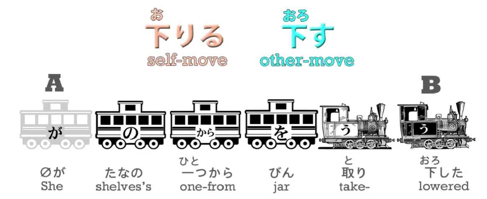

::: info
*(Catatan furigana:* Di video aslinya, ada lagi kesalahan ketik pada kata `下りる` (oriru / turun). Di videonya cuma ditulis satu huruf 'o' melayang. Sudah saya bereskan. Sebagai tambahan, JANGAN pernah salah melafalkan *oriru* ini menjadi *kudaru/sagaru*. Karena jika ejaannya dibaca 'kudaru / sagaru', itu biasanya merujuk pada versi pembacaan *okurigana* *irregular* lainnya dari huruf 'bawah/下' tersebut. Tergantung konteks kalimatnya!).
:::

Sebagian besar kursus konvensional di luar sana akan menyimpan materi "Gerak Diri dan Gerak Orang Lain" (Transitif) ini sebagai materi super rahasia untuk kelas tingkat menengah (*Intermediate*). Tetapi saya membongkarnya sejak awal, karena pemahaman akar genetik inilah yang justru akan membuatmu mengenali langsung cara kerja semua kosakata Jepang! 

Coba lihat buktinya:
- `下りる` (Oriru) berarti `turun / melangkah turun` (bergerak turun dari tangga / keluar bus). Ini jelas versi *Gerak Diri*!
- `下す / 下ろす` (Orosu) berarti `membawa (benda lain) turun / menurunkan`. Ini jelas versi *Gerak Orang Lain*! Dan seperti insting tajammu, **kita otomatis tahu mana yang bertugas menggerakkan/menurunkan objek lain karena ekornya mutlak berbunyi `-す` (`下す`)**. 

Jadi kata kerja majemuk `取り下ろす` (tori-orosu) bermakna `take and bring down` (mengambil lalu menurunkan).

Mari tutup dengan terjemahan akhir kalimatnya:
`*(zero-ga)* たなの一つからびんを取り下ろした.` -> `Dari salah satu rak tersebut, *(ia)* **mengambil dan menurunkan**...`

Sebuah `びん` (bin). Biasanya diterjemahkan sebagai `botol`; tapi dalam wujud fisiknya, ia lebih mirip `toples kaca/selai`. 

Lalu apa isi toples misterius itu? Nah, kamu harus bersabar menunggu kelanjutannya di bab berikutnya...

::: info
Sekali lagi, bab ini SANGAT padat secara materi. Saya merekomendasikanmu untuk meluangkan waktu membaca kolom komentar di bawah [**video orisinalnya**](https://www.youtube.com/watch?v=H_jePzcPFAQ&list=PLg9uYxuZf8x_A-vcqqyOFZu06WlhnypWj&index=18). Di sana ada banyak penjelasan tambahan dari Dolly yang bisa sangat membantumu mencerna materi yang cukup `intense` ini. (；￣Д￣)
:::
