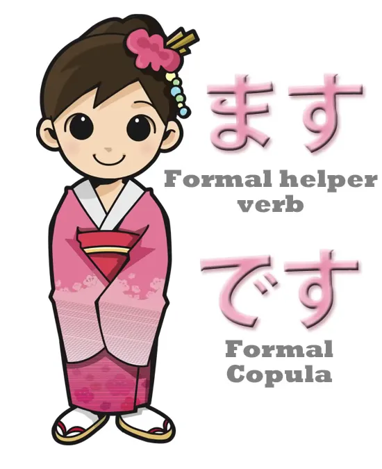
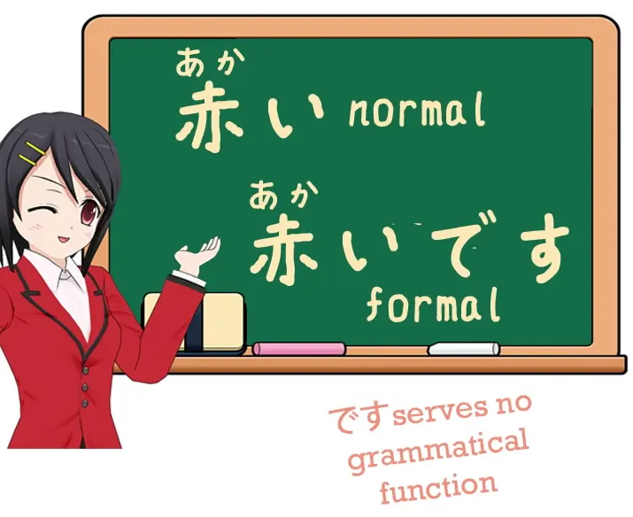
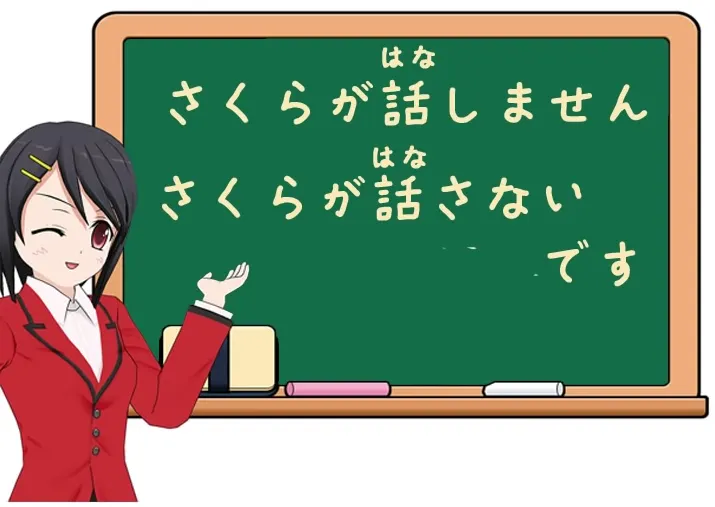
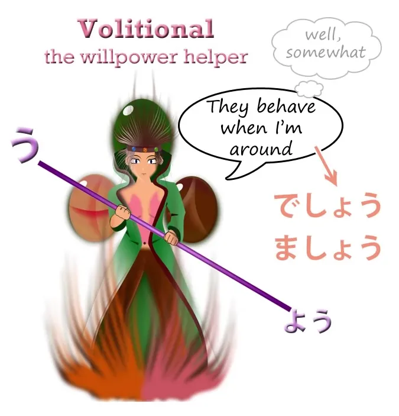
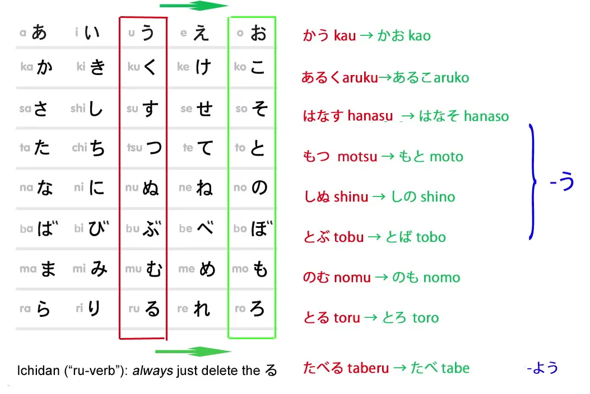
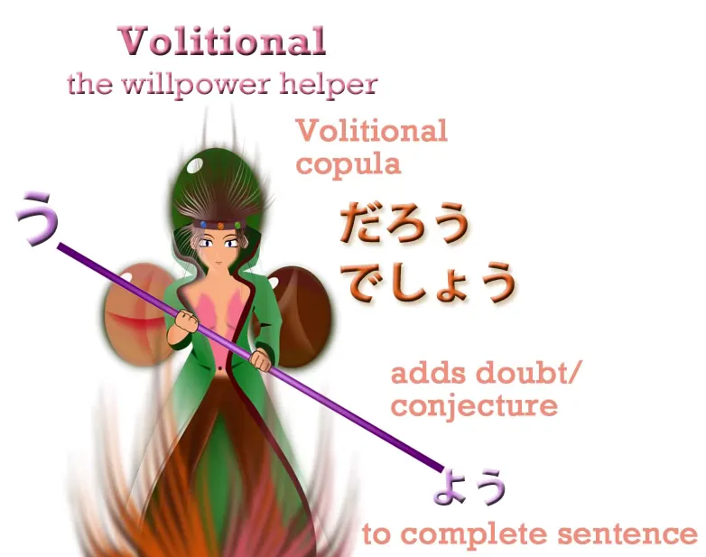

# **17. Bahasa Jepang yang Sopan dan Bentuk Volisional**

[**Pelajaran 17: Bagaimana desu/masu MERUSAK Bahasa Jepang Anda! + Cara menggunakannya dengan benar. Ditambah bentuk volitional**](https://www.youtube.com/watch?v=ymJWb31qWI8&amp;list;=PLg9uYxuZf8x_A-vcqqyOFZu06WlhnypWj&amp;index;=19)

こんにちは。

Hari ini kita akan membahas bahasa Jepang **formal** *(sopan)*: です / ます.

::: info
Setiap kali Dolly menggunakan istilah <code>formal</code> untuk です atau ます, seharusnya menggunakan POLITE, karena ada perbedaan antara kedua istilah tersebut dalam bahasa Jepang. Saya tidak yakin mengapa dia tidak menyinggung hal ini, tetapi sangat penting untuk membedakannya. Jika Anda melihat definisinya, kamus menandainya sebagai bahasa sopan.**
:::

***Keduanya merupakan bagian dari bahasa sopan (丁寧語). Jadi, lebih tepat jika menyebutnya sebagai bentuk sopan.***

Beberapa orang mungkin terkejut bahwa kita telah melewati enam belas pelajaran tanpa menggunakan istilah ini sama sekali, padahal kebanyakan kursus menggunakannya sejak pelajaran pertama.

Sekarang, ada alasan bagus mengapa kami belum melakukannya. **Salah satu alasannya adalah bentuk です / ます sebenarnya cukup unik**. **Bentuk ini melakukan berbagai hal yang tidak dilakukan oleh sebagian besar bahasa Jepang lainnya.** Jadi, jika kita mempelajarinya sebagai cara standar berbicara, kita akan mendapatkan berbagai gagasan aneh tentang cara kerja bahasa Jepang. Kita sebenarnya bisa mulai mempelajarinya sedikit lebih awal, tetapi jujur saja ada prioritas yang lebih penting, dan sebaiknya kita menguasai bahasa Jepang standar dengan kokoh di benak kita sebelum memasuki area yang agak rumit seperti です / ます. Hal ini tidak sulit setelah struktur bahasa Jepang standar tertanam dengan kokoh di benak Anda, dan kita sudah melakukannya sekarang. **Jika Anda belum melakukannya, jika Anda belum mengikuti kursus ini, silakan kembali ke pelajaran pertama sekarang juga.** Silakan. Baiklah.

## ます

Sekarang bagi yang lain, mari kita mulai dengan <code>ます</code>. **<code>ます</code> adalah sebuah kata kerja.** **Ini bukan bagian dari kata kerja, melainkan kata kerja itu sendiri.** Ini adalah kata kerja bantu seperti banyak kata kerja bantu lain yang telah kita pelajari hingga saat ini. **Kata ini melekat pada akar kata &quot;い&quot; yang sudah kita kenal, dan tidak mengubah arti kata yang dilekati sama sekali.**

**Kata ini hanya membuatnya menjadi formal.** Jadi <code>歩く</code> menjadi <code>歩きます</code>; <code>話す</code> menjadi <code>話します</code>, dan seterusnya. Dan **kata-kata tersebut hanyalah cara formal untuk mengatakan <code>speak</code>, <code>walk</code>, dll.**

---

Nah, alasan lain mengapa saya tidak mengajarkan ini sebelumnya adalah karena orang-orang mengatakan hanya ada dua kata kerja tidak beraturan dalam bahasa Jepang – saya sendiri pernah mengatakan hal ini – **tetapi kenyataannya ada satu lagi,** **yaitu <code>ます</code>.** **Dan <code>ます</code> tidak tidak beraturan seperti <code>くる</code> dan <code>する</code> tidak beraturan. Ini jauh lebih buruk.** Kata kerja ini melakukan sesuatu yang tidak dilakukan di tempat lain dalam bahasa Jepang modern. Sekarang **kabar baiknya adalah bentuk lampau kata kerja ini sepenuhnya beraturan dan normal.** Cara kerjanya sama seperti kata kerja berujung -す: bentuknya <code>ました</code>. Namun bentuk negatifnya bukanlah <code>まさない</code>; **melainkan <code>ません</code>.**

### ません

Dan kata macam apa <code>ません</code>? **Sebenarnya, kata ini sama sekali tidak ada dalam bahasa Jepang modern.** Buku teks mengatakan bahwa ini adalah bentuk negatif dari kata kerja, tetapi kemudian mereka menjelaskan bahwa kata kerja adalah apa pun <code>ます</code> yang melekat padanya, dan mereka juga mengatakan bahwa <code>ない</code> adalah bentuk negatif dari kata kerja, padahal sebenarnya bukan. Itu adalah kata sifat pembantu. *(lihat Pelajaran 7)* Kita tidak perlu membahas apa <code>ません</code> sebenarnya secara struktural, karena hal ini tidak terjadi di tempat lain dalam bahasa Jepang modern, jadi kita hanya mempelajarinya sebagai fakta. **Bentuk negatif dari <code>ます</code> adalah <code>ません</code>.** 
::: info
Bentuk non-lampau.
:::
Dan itulah alasan lain mengapa saya tidak mengajarkannya sebelumnya, karena hal seperti ini jarang ditemukan dalam bahasa Jepang: hal-hal yang hanya perlu dipelajari <code>as a fact</code>. Jika Anda mengetahui prinsip di balik sesuatu, secara umum Anda dapat memahami cara kerja semuanya tanpa harus menghafal banyak. **Jadi, saat Anda mulai belajar, Anda hanya perlu mengetahui bahwa bentuk negatif dari <code>ます-verbs</code>, sebagaimana disebut – dengan kata lain, kata kerja bantu &quot;ます&quot; – adalah <code>ません</code>, Anda memulai dengan anggapan bahwa bahasa Jepang hanya melakukan berbagai hal acak seperti bahasa Eropa.**

::: info
Ini adalah pola pikir yang merugikan untuk dipegang tentang bahasa Jepang, seperti yang kita tahu, meskipun beberapa hal memang cukup mirip dalam beberapa hal, tetap saja yang terbaik adalah melihat bahasa Jepang apa adanya, tidak mencoba memaksakan bahasa lain ke dalamnya kecuali mungkin untuk menjelaskan beberapa istilah (karena kita menggunakan bahasa Inggris di sini) yang digunakan jika memang boleh dilakukan.
:::

###ませんでした

Sekarang, bentuk lampau negatif menjadi lebih aneh lagi. **Tidak ada bentuk lampau dari -せん

, seperti halnya -ない

menjadi -なかった

,** jadi apa yang harus kita lakukan? **Kita cukup menambahkan bentuk lampau dari <code>です</code> di akhir <code>ません</code> dan mengatakan <code>ませんでした</code>.** <code> *(zeroが)*  あるきませんでした</code> – <code>(I) **didn&#x27;t** walk</code>. Banyak orang Jepang yang mempelajari tata bahasa Jepang sangat tidak menyukai hal ini, dan saya tidak bisa menyalahkan mereka. Namun, baik atau buruk, hal ini telah menjadi tata bahasa Jepang standar, jadi kita hanya perlu mengingatnya. Sebenarnya hanya ada beberapa ketidakteraturan dan tidak terlalu sulit untuk diingat selama kita tidak mempelajarinya di awal, yang dapat membingungkan seluruh pemahaman kita tentang bahasa Jepang.

---

Jika kita mempelajari <code>ます</code> sebagai yang disebut <code>conjugation</code> dan kita percaya bahwa itu adalah bentuk dasar kata kerja, maka untuk membuat bentuk kata kerja lainnya, kita akan menghapus akhiran -ます, lalu mengganti akar kata &quot;い&quot; dengan akar kata yang berbeda untuk melakukan hal lain. Hal ini sudah cukup rumit jika kita memahami tentang akar kata, tetapi buku teks pun tidak menjelaskan hal itu, sehingga kita hanya memiliki banyak aturan dan regulasi bergaya Eropa yang sepenuhnya acak dan sama sekali tidak masuk akal.

## です

Jadi, mari kita lanjutkan ke <code>です</code>. **<code>です</code>, seperti yang Anda ketahui, adalah bentuk formal dari <code>だ</code>**. **Ini adalah kopula. Fungsinya persis seperti <code>だ</code>, jadi jika Anda tahu <code>だ</code>, Anda sudah <code>です</code> sudah.**

Kecuali bahwa ini juga memiliki keanehan, yaitu jika kita mengambil kata sifat seperti <code>赤い</code> arti <code>is red</code>, kita menambahkan <code>です</code> di bagian akhir kata tersebut dalam bahasa formal.

**Ini tidak mengubah apa pun; hanya memperindah kalimat dan membuatnya terdengar formal.** Sekali lagi, ini adalah sesuatu yang harus kamu pelajari dan tidak terlalu sulit untuk dipelajari, tetapi jika kamu mempelajarinya di awal, kamu akan mendapat kesan bahwa kamu memerlukan kata penghubung (copula) dengan kata sifat seperti <code>赤い</code> sama seperti Anda membutuhkan kata penghubung dengan kata benda yang berfungsi sebagai kata sifat seperti <code>綺麗/きれい</code>.

Dan tentu saja fakta bahwa mereka menyebut kata benda adjektival <code>な-adjectives</code>[[6]](./6-adjectives.md) hanya membuatnya semakin membingungkan. Anda berpikir bahwa kata sifat menggunakan kopula, padahal tidak. Kata sifat sejati, kata sifat yang berasal dari kata sifat (い), tidak menggunakan kopula kecuali dalam bentuk yang agak aneh seperti &quot;です&quot; atau &quot;ます&quot;, di mana kita menambahkan <code>です</code> di akhir hanya sebagai hiasan. Kata benda yang berfungsi sebagai kata sifat, di sisi lain, tentu saja menggunakan kata hubung karena mereka adalah kata benda – dan semua kata benda menggunakan kata hubung. Jadi kita mengatakan <code>あかい</code> – <code>is red</code> / <code>綺麗だ</code> – <code>is pretty</code>; <code>赤いです</code> – <code>is red</code> **dengan hiasan**; <code>綺麗です</code> – <code>is pretty</code> **dengan kopula yang tepat yang dibutuhkannya dalam bentuk formal.**

Jadi seperti yang Anda lihat, bahasa Jepang formal sebenarnya tidak terlalu sulit. Kita harus mempelajari beberapa fakta yang agak aneh, dan hal ini tidak seperti sebagian besar bahasa Jepang lainnya yang sangat mirip Lego dan logis. Bahasa Jepang memiliki beberapa bagian yang unik, tetapi tidak banyak, dan selama Anda telah menguasai bahasa Jepang yang sebenarnya dengan baik, menambahkan bentuk &quot;です&quot; atau &quot;ます&quot; tidaklah terlalu sulit.

Beberapa hal lain yang perlu diketahui: salah satunya adalah bahwa selain mengatakan <code>ません</code>, **kita juga bisa mengatakan <code>ないです</code>.**

Jadi kita bisa mengatakan <code>さくらが話しません</code> – <code>Sakura doesn&#x27;t talk</code>, atau kita bisa mengatakan <code>さくらが話さないです</code>. Dan tentu saja hal itu sangat logis dan masuk akal, jika memang demikian, **karena karena kita menempatkan <code>です</code> di akhir kata sifat dalam bahasa formal,** **kita juga bisa menempatkannya di akhir kata sifat bantu &quot;ない&quot;,** **yang pada dasarnya hanyalah kata sifat lain.** **Kita tidak banyak mengubah <code>ます</code> karena kata itu benar-benar penutup kalimat; kita menempatkannya tepat di akhir apa pun yang sedang kita lakukan untuk menambah kesan formal pada kalimat.**

---

**Namun, kita bisa menggunakan keduanya <code>です</code> dan <code>ます</code> bersama kata kerja bantu volisional.**

Dan sekali lagi <code>ます</code> berperilaku aneh, karena akar kata &quot;お&quot; -nya bukanlah, seperti yang Anda harapkan, <code>まそ</code> **tetapi <code>ましょう</code>.** **Jadi bentuk volisionalnya adalah <code>ましょう</code>.** Untungnya, hal ini hanya sedikit aneh dan tidak sulit untuk ditangani. Dan untungnya juga, **<code>です</code> membentuk pasangan yang cocok dengan <code>ます</code> dalam bentuk volisional dan menjadi <code>でしょう</code>.** Dan karena kita sedang membahas bentuk volisional, mari kita bahas itu juga.

## Bentuk volisional

Pembentukannya sangat sederhana, dan **ini adalah salah satu dari sedikit hal yang kita lakukan dengan akar kata kerja お -A-stem**.

**Penolong bentuk kehendak godan,** seperti penolong bentuk kemungkinan – penolong bentuk kemungkinan hanyalah satu kana, る(-ru), dan **penolong bentuk kehendak hanyalah satu kana う**(-u), **dan kita menempatkannya di akhir A-stem お dan hal ini memperpanjang bunyi お.** Jadi, <code>話す</code> menjadi <code>話そう</code>, <code>歩く</code> menjadi <code>歩こう</code> dan seterusnya.

---

Apa artinya? **Nah, namanya sebenarnya sudah menjelaskan artinya. <code>Volition</code> berarti <code>will</code>, jadi bentuk volisional mengekspresikan atau memanggil kehendak.** **Penggunaan yang paling umum adalah untuk mengarahkan kehendak sekelompok orang ke arah tertentu.** Jadi kita mengatakan, <code>行きましょう</code> *(seperti yang disebutkan, &#x27;ましょう&#x27; adalah bentuk volitional dari &#x27;ます&#x27;)*, <code>**Let&#x27;s** go</code>. Dan beberapa orang menyebut kata sifat pembantu -たい juga sebagai volitional, **yang membingungkan karena keduanya bukanlah hal yang sama.**

---

**Dan hal yang perlu diingat di sini adalah bahwa -たい mengekspresikan keinginan, hasrat, atau niat untuk melakukan sesuatu.** **Bentuk volitional mengekspresikan kehendak. Dan kehendak serta keinginan bukanlah hal yang sama.** Misalnya, **Anda mungkin memiliki kehendak untuk mengerjakan PR Anda. Itu tidak berarti Anda ingin mengerjakan PR Anda.** Yang sebenarnya Anda inginkan adalah bermain <code>Captain Toad</code>, tetapi kamu mengarahkan kemauanmu untuk mengerjakan PR. Dan ketika kita mengatakan hal-hal seperti <code>行こう</code>, <code>**let&#x27;s** go</code>, untuk hal-hal yang mungkin ingin kita lakukan, <code>let&#x27;s all have a picnic</code>, <code>let&#x27;s have a party</code>, **tetapi juga** <code>let&#x27;s tidy the room</code>, <code>let&#x27;s do our homework.</code> **Itu mengekspresikan kehendak, bukan keinginan.**

---

Anda akan sering melihat di papan tanda Jepang kalimat seperti, <code>ゴミを持ち帰りましょう</code> – <code>**let&#x27;s** pick up our trash and take it home</code> – yang menurut saya selalu terdengar seperti ajakan yang cukup baik, sangat berbeda dari papan tanda Barat yang mengatakan, &quot;Ambil sampahmu atau kami akan menyita mobilmu dan mewarnai anak-anakmu ungu&quot;.

---

Sekarang, **ada beberapa penggunaan bentuk volisional bersama partikel seperti -か, dan -と**, tetapi kita tidak akan membahasnya di sini, karena menurut saya menghafal daftar penggunaan bukanlah cara yang baik untuk belajar. Kita akan membahasnya saat kita menemukannya, mungkin dalam petualangan Alice. Namun, satu penggunaan bentuk ini yang perlu diketahui karena Anda akan sering menemukannya adalah bahwa **kita menggunakan bentuk volisional dari kopula, <code>だ</code> atau <code>です</code> – <code>だ</code>, yang sebenarnya bukan kata kerja dalam arti biasa, bentuk volisionalnya adalah <code>だろう</code> – dan jika kita menambahkan itu ke kalimat lain, maknanya menjadi <code>probably</code>.**

::: info
Untuk &quot;です&quot;, bentuknya adalah &quot;でしょう&quot;. Terkadang, Anda mungkin melihat &quot;だろう&quot; disebut sebagai bentuk volisional dari &quot;である&quot; alih-alih &quot;だ&quot;. Berdasarkan penelitian saya, sepertinya &quot;である&quot; hanyalah bentuk yang lebih sastra/kuno dari &quot;だ&quot;.  
Perhatikan juga implikasi keraguan/spekulasi yang diberikan oleh &quot;だろう&quot; / &quot;でしょう&quot; pada sebuah kalimat.
:::

<code>それは赤いでしょう */ だろう</code> – <code>That&#x27;s **probably** red / **I think** it&#x27;s red</code>; <code>さくらがくるでしょう */ だろう</code> – <code>**I think** Sakura&#x27;s coming / Sakura&#x27;s **probably** coming</code>.

::: info
Meskipun だろう merupakan bentuk volisional dari kopula だ, tampaknya bentuk ini dapat digunakan dengan kata sifat secara normal, sedangkan kopula biasa だ tidak bisa. Hal ini mungkin karena bentuk tersebut mengekspresikan <code>probably/think/guess</code> dan bukan <code>is</code> yang merupakan bagian dari - い; atau karena berasal dari である?

*Ada juga だろ / でしょ, yang merupakan versi yang kurang formal. だろ tampaknya hanya digunakan oleh pria.*

Jadi sekarang kita tahu cara menggunakan bentuk volisional dan cara menggunakan bahasa Jepang formal.

:::