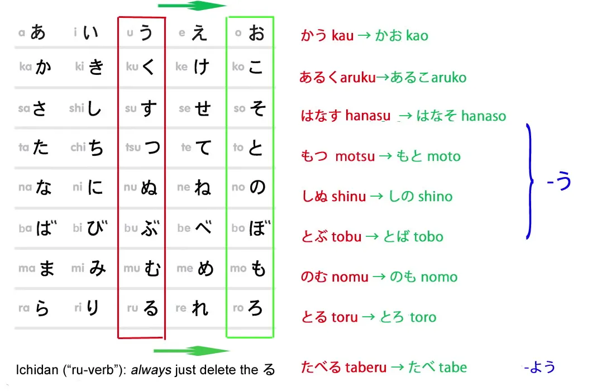
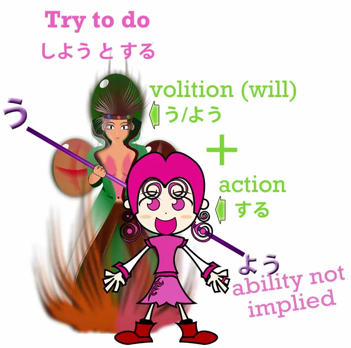
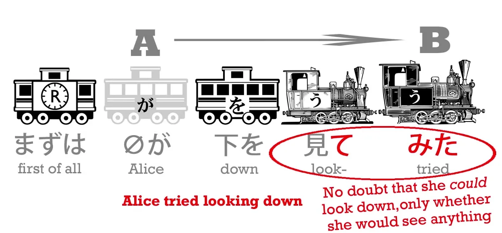
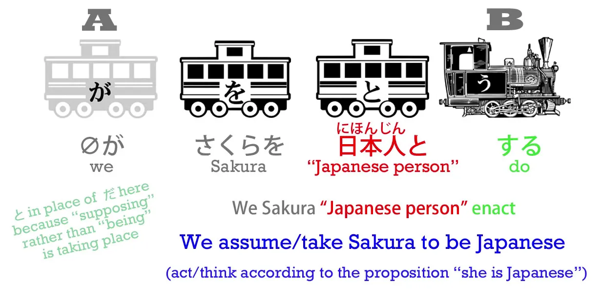
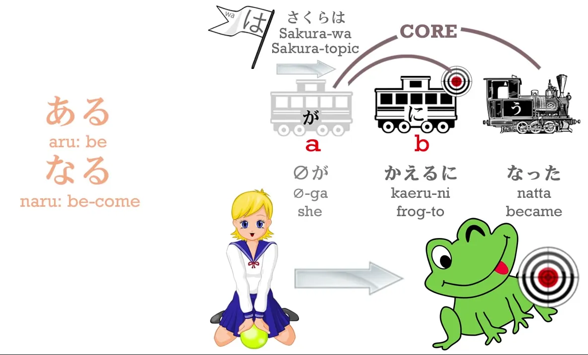
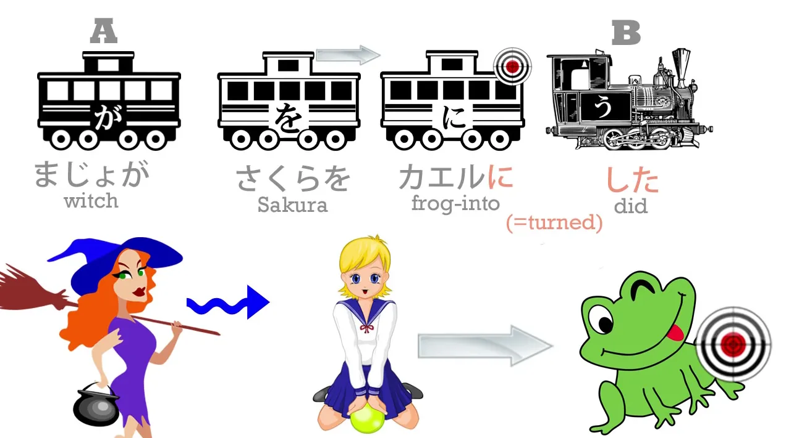
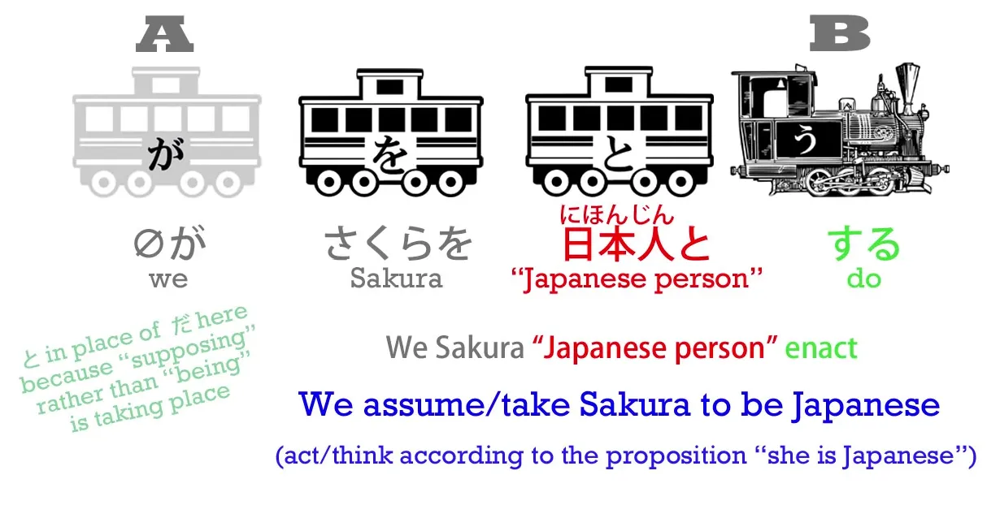
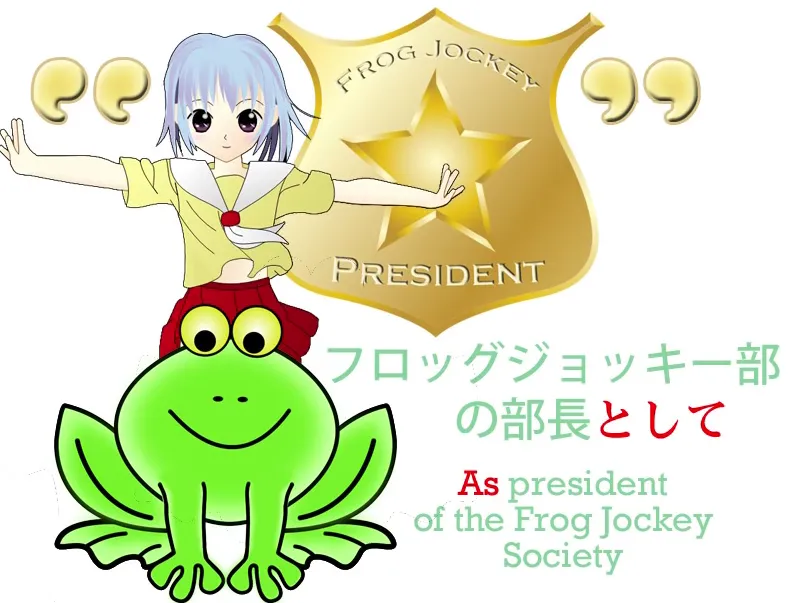
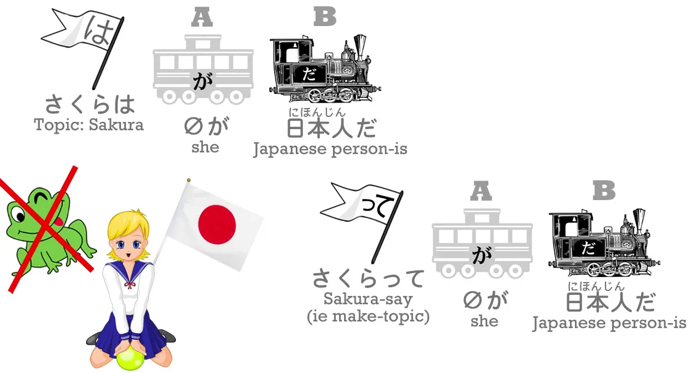

# **18. って = は?? Rahasia terungkap! - おうとする, とする, として, という, っていう**

[**Pelajaran 18: って tte = は wa?? Rahasia terungkap! Toshite, toiu, to suru, ou to suru, tteiu**](https://www.youtube.com/watch?v=40avkmkQR8M&amp;list;=PLg9uYxuZf8x_A-vcqqyOFZu06WlhnypWj&amp;index;=20)

こんにちは。

Hari ini kita akan membahas <code>trying to do something</code> dan dari sana kita akan memperluas pembahasan ke makna yang lebih luas dari <code>と</code> partikel kutipan karena ini adalah bagian yang sangat penting dalam bahasa Jepang yang digunakan setiap saat. Jadi, kita perlu memiliki pemahaman yang kuat tentang apa itu dan bagaimana cara kerjanya. Nah, minggu lalu[[17]](./17-polite-japanese-and-the-volitional.md) kita telah mempelajari partikel volisional う dan よう yang membuat akhiran kata berbunyi <code>おう</code> atau <code>よう</code> dan mengekspresikan kehendak.

**Jika kita <code>trying</code> melakukan sesuatu, kita menggunakan partikel volisional ini.** Jadi, jika kita mengatakan, <code>山にのぼろうとする</code>, ini berarti <code>**try to climb** mountain</code>. Mengapa artinya demikian? Apa sebenarnya fungsi konstruksi ini?

Nah, <code>のぼろう</code> **mengungkapkan keinginan untuk memanjat.**

Jika kita mengatakan <code>山にのぼろう</code>, kita berarti <code>**Let&#x27;s** climb the mountain</code>. Secara harfiah, **mengarahkan niat kita untuk mendaki gunung.**

##おうとする

/とする

<code>のぼろうとする</code> **berarti melakukan tindakan yang tersirat dari mengarahkan niat kita untuk mendaki gunung.** Jika kita hanya ingin mengatakan <code>climb the mountain</code>, kita cukup mengatakan, <code>山にのぼる</code>. Tapi kita tidak mengatakan <code>climb the mountain</code>, kita mengatakan <code>**try to** climb the mountain</code>. **Oleh karena itu, lakukan tindakan yang tersirat dalam menetapkan niat kita / wujudkan niat kita untuk mendaki gunung,** **baik kita berhasil mendakinya atau tidak.**

Beberapa orang menemukan perbedaan antara <code>try climbing</code> dan <code>try to climb</code> membingungkan. Dan itu sebenarnya hanya karena cara penyampaiannya dalam bahasa Inggris.

**Dalam bahasa Jepang**, seperti yang baru-baru ini kita pelajari[[16]](./16- てみる - や -particle- から -particle-exclusive-and.md), **jika kita ingin mengatakan,** <code>**try** climbing the mountain</code>, kita mengatakan, <code>山にのぼってみる</code>. **Perbedaannya adalah bahwa <code>try climbing / try eating / try swimming</code> tidak menyiratkan keraguan apa pun tentang fakta bahwa kita sebenarnya bisa melakukannya.** **Hal itu menyiratkan keraguan tentang apa yang akan menjadi hasilnya ketika kita telah melakukannya.**

---

**<code>Try eating</code> - kita tahu kita bisa makan, tapi tidak tahu apakah kita akan menyukainya.** <code>Try eating</code> - <code>食べてみる</code> - artinya <code>eat and see</code>. Cobalah makan dan lihat hasilnya, lihat apakah kamu menyukainya, lihat apakah kamu tidak menyukainya.

---

<code>山にのぼってみる</code> berarti <code>climb the mountain and see</code>. Lihat apakah itu sulit, lihat seperti apa pemandangannya dari atas.

---

<code>ケーキを食べようとする</code> - <code>**try to eat** the cake</code> - menyiratkan bahwa kita tidak tahu apakah kamu benar-benar bisa makan kue itu atau tidak, tapi coba saja. Mungkin kuenya sangat besar dan akan sangat sulit untuk memakannya habis. Jadi <code>してみる</code> - <code>do and see</code> - **menunjukkan bahwa tidak ada keraguan bahwa kita bisa melakukannya, tetapi ada keraguan tentang apa hasil yang akan kita dapatkan setelah melakukannya.** Apakah kita akan menyukainya? Apakah bangunan itu akan runtuh? Kita tidak tahu apa yang akan terjadi setelah kita melakukannya, tetapi kita tahu kita bisa melakukannya. **<code>しようとする</code> menunjukkan bahwa kita tidak tahu apakah kita bisa melakukannya atau tidak,** **tetapi kita akan mencoba melakukannya.**

---

Jadi, hal penting di sini adalah melihat apa yang dilakukan partikel &quot;と&quot;. **- &quot;と&quot; merangkum kalimat yang ada di depannya:** <code>山にのぼろう</code> - niat untuk mendaki gunung. **Ini bukan mengutipnya.** Ini bukan sesuatu yang telah kita katakan; ini bukan sesuatu yang telah kita pikirkan, tepatnya. **Intinya adalah bahwa ini mengambil esensi, makna, dan arti penting dari <code>山にのぼろう</code> dan menerapkannya.** Dan kita akan menemukannya dalam kasus-kasus lain.

Misalnya, kita mungkin membaca bahwa seseorang <code>ホッとした</code> . Nah, apa artinya itu? <code>ホッ</code> sebenarnya adalah efek suara. Itu adalah efek suara dari menghela napas lega: <code>ホッ</code>. **Tapi <code>ホッとする</code> sebenarnya tidak berarti <code>breathe a sigh of relief</code>.** Yang dimaksud adalah, **<code>feel relief / be relieved</code>**.

---

**Jadi yang kita lakukan di sini adalah menggambarkan ide, perasaan, yang diekspresikan dalam <code>ホッ</code>, desahan lega.** **Sama seperti dalam <code>山にのぼろうとする</code> kita mewujudkan perasaan,** **makna dari mengarahkan tekad kita untuk mendaki gunung, yaitu, mencoba mendakinya.**

### とする &amp; にする

Sekarang, serupa dengan itu, jika kita mengatakan <code>さくらを日本人とする</code>, itu berarti **menganggap Sakura sebagai orang Jepang.**

Sekarang, kita mungkin juga mengatakan, <code>さくらを日本人にする</code>, tetapi itu berarti sesuatu yang sangat berbeda. Artinya <code>**turn Sakura into a Japanese person**</code>. **に adalah objek dari suatu tindakan.**

---

Beberapa waktu lalu kita telah membahas pelajaran[[8]](./8-the- に -and- へ -particles.md) di mana kita membicarakan <code>さくらがかえるになる</code> - <code>Sakura **becomes a frog**</code>.

Sekarang, kita juga telah membahas[[15]](./15-transitive-intransitive-verbs.md) cara kerja <code>ある</code> dan <code>する</code> adalah Hawa dan Adam dari kata kerja Jepang,

<code>ある</code> sebagai kata kerja pergerakan diri utama dan <code>する</code> kata kerja pergerakan orang lain utama. **<code>なる</code> sangat erat kaitannya dengan <code>ある</code> - <code>ある</code> adalah <code>be</code>, <code>なる</code> adalah <code>become</code>.** Dan **jadi jika kita mengatakan <code>になる</code> itu berarti menjadi sesuatu.** **Jika kita mengatakan <code>にする</code> itu adalah versi pergerakan lain dari <code>になる</code>.** Itu berarti <code>turn something into something</code>. Jadi jika kita mengatakan, <code>まじょがさくらをカエルにした</code> - <code>the witch **turned** Sakura **into a frog**</code>.

::: info
カエルhanyalah cara lain untuk menulis kata &quot;katak&quot;, melalui katakana. Hewan biasanya ditulis seperti itu.  
:::

<code>さくらを日本人にする</code> - **mengubah** Sakura **menjadi orang Jepang**; tetapi <code>さくらを日本人とする</code> - **menganggap** Sakura **sebagai orang Jepang** / **memandang** Sakura **sebagai orang Jepang.**

<code>かばんをまくらとする.</code>

<code>かばん</code> adalah <code>bag</code>, <code>まくら</code> adalah <code>pillow</code> dan ini berarti <code>using your bag as a pillow</code>. **Kamu tidak mengubah tasmu menjadi bantal, tas itu tidak berubah menjadi bantal,** **tetapi kamu menganggapnya sebagai bantal dan menggunakannya sebagai bantal.** Jadi di sini kita memiliki beberapa penggunaan <code>-とする</code>. **Secara umum, ini berkaitan dengan cara kita memandang sesuatu.**

## として

Sekarang, **jika kita mengatakan <code>-として</code>, ini bukanlah sekadar tindakan memandang sesuatu sebagai sesuatu,** **melainkan melihat sesuatu dalam konteks sebagai sesuatu.** Jadi, dalam bahasa Inggris biasanya diterjemahkan secara sederhana sebagai <code>as</code> atau <code>for</code>. Atau <code>being in the role of</code>

Jadi, <code>こじんとして の いけん</code> berarti <code>my opinion **as** a private person</code>, berbeda dengan, katakanlah, <code>my opinion **as** president of the Frog Jockey Society.</code> *- hanyalah contoh kalimat lain (perbedaan dalam kata-kata <code>private person</code> &amp; <code>president</code>), bukan perbedaan dalam fungsi として. Penggunaan kata-kata tersebut mungkin menyesatkan sehingga seolah-olah Dolly bermaksud mengatakan bahwa として-lah yang memiliki peran berlawanan di sana.*

Atau kita bisa mengatakan, <code>アメリカ人として小さい</code> - &quot;Dia kecil **untuk** ukuran orang Amerika / **Sebagai** orang Amerika, dia kecil. Jadi kita bisa melihat bahwa **fungsi kutipan dari -と

tidak hanya digunakan untuk mengutip ide dan pemikiran, tetapi juga untuk menangkap perasaan dari sesuatu, mengemasnya, dan kemudian mengomentari hal tersebut.**

::: info
sekadar informasi, komentar ini mungkin membantu beberapa orang terkaitとする

&amp;として

.

:::

##という

/と言う

Tentu saja, **hal paling dasar yang dapat mengikuti -と

adalah <code>いう</code>,** **dalam hal ini merupakan kutipan harfiah,** **- という / と言う** (biasanya diucapkan tidak terlalu <code>-という</code> tetapi sebagai <code>-とゆ</code>). Dan **ini lagi-lagi dapat digunakan tidak hanya dalam kutipan harfiah tetapi juga untuk menjelaskan bagaimana sesuatu diucapkan atau apa namanya.** Jadi, <code>ふしぎの国のアリスという本</code>, berarti <code>book **called** ふしぎの国のアリス</code>

###っていう

/って言う

**Dan -と

di <code>-という</code> dapat disingkat menjadi - って.** Jadi kita bisa mengatakan <code>-っていう</code> - <code>ふしぎの国のアリスっていう本</code>, **atau dapat disederhanakan menjadi hanya - って.**

<code>ふしぎの国のアリスって本</code> masih berarti <code>The book **called** Alice in Wonderland</code>. Jadi, orang-orang terkadang sedikit bingung ketika mereka hanya melihat ini - って. **Artinya - と atau - という**, tetapi hal yang terkadang benar-benar membingungkan orang adalah bahwa **ini juga dapat digunakan sebagai pengganti partikel は.**

### Penggunaan &quot;って&quot; sebagai pengganti &quot;は&quot;

Hal ini mungkin tampak aneh, sampai Anda menyadari fungsinya yang sebenarnya. Jika kita mengingat apa itu partikel &quot;は&quot;, maka partikel &quot;は&quot; adalah partikel penanda topik. Jadi, ketika kita mengatakan <code>さくらは *(zeroが)* 日本人だ</code>, kita bisa menerjemahkannya ke dalam bahasa Inggris sebagai <code>**Speaking of** Sakura, (she) is Japanese person</code>. Nah, apakah hal ini mulai membuat segalanya sedikit lebih jelas?

<code>さくらって(zeroが)日本人だ</code> - <code>Sakura -say</code>, (dia) orang Jepang<code> - </code>Sakura -berbicara tentang<code>, (she) Japanese-person is</code> - <code>Sakura **(topic)**, (she) Japanese-person is</code>. Sekarang, **kita tidak bisa mengatakan - と atau - という sebagai pengganti partikel は.** **Ini adalah penggunaan yang sangat santai.** **Kita hanya menggunakan -って.** Namun, Anda bisa melihat bahwa meskipun sangat kasual, ini bukanlah hal yang sembarangan dan tak dapat dijelaskan. **Ini menetapkan Sakura sebagai topik pembicaraan kita, sama seperti &quot;は&quot;.**

Sekarang, ada penggunaan lain dari - と. Kita akan membahasnya saat kita menemukannya.