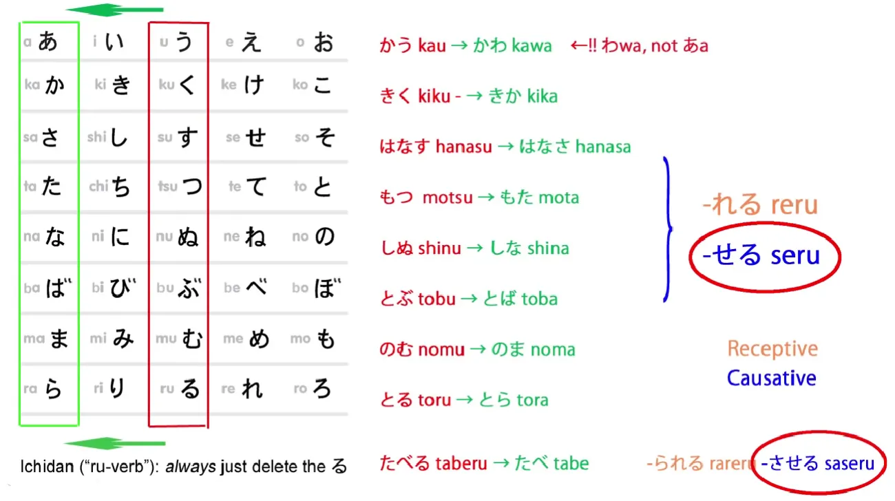
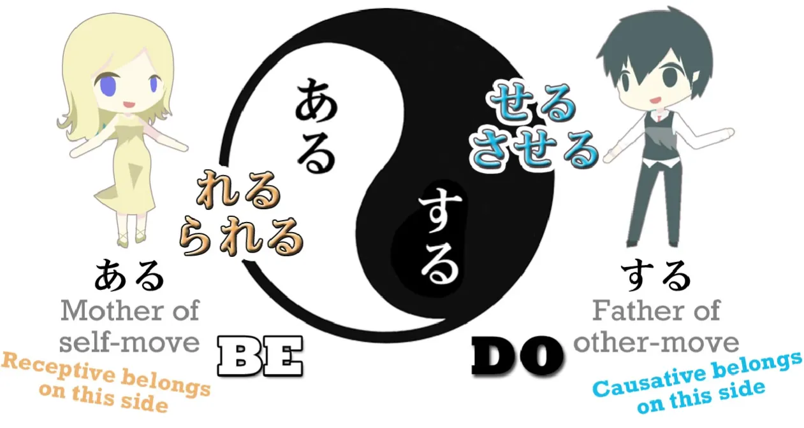
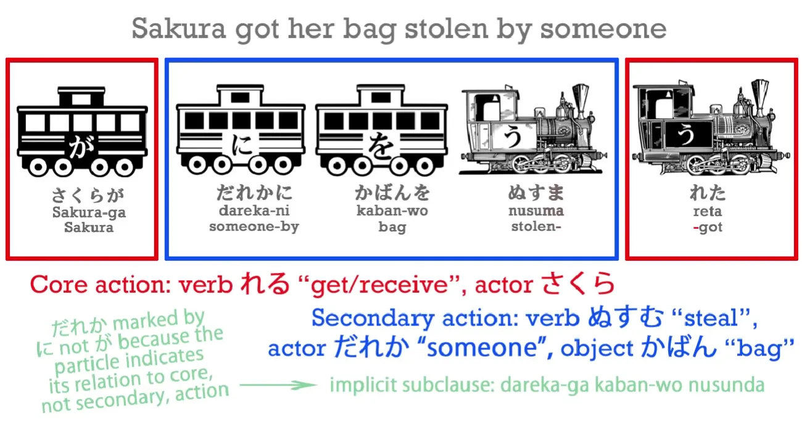
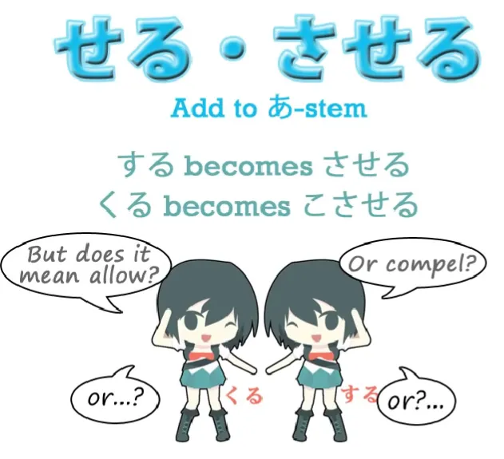
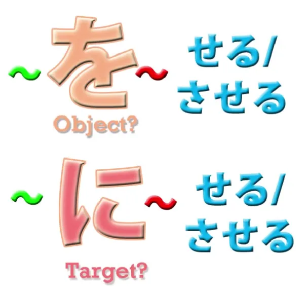
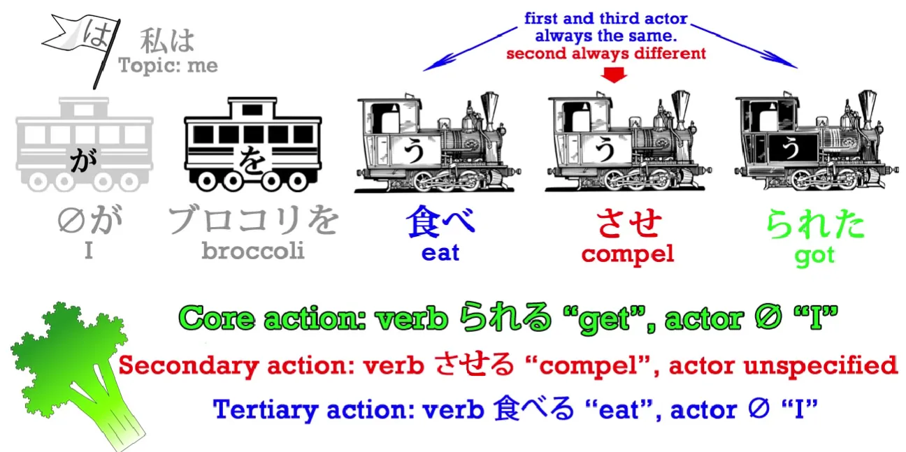

# **19. Kalimat Causative + Causative Receptive**

[**Pelajaran 19: Causative + <code>causative passive</code>: hal yang TIDAK PERNAH mereka ceritakan kepada Anda! Ini logis dan sangat mudah**](https://www.youtube.com/watch?v=LCvGHWbhDKw&amp;list;=PLg9uYxuZf8x_A-vcqqyOFZu06WlhnypWj&amp;index;=38)

こんにちは。  
Hari ini kita akan membahas kata kerja bantu kausatif. Dalam buku tata bahasa standar, ini disebut <code>causative</code> dan itu adalah nama yang sangat tepat karena **hal ini menunjukkan bahwa kita menyebabkan seseorang melakukan kata kerja yang terikat padanya.** Dalam buku tata bahasa standar, **hal ini sering diajarkan bersama dengan bentuk pasif** (yang mereka suka sebut sebagai <code>passive</code>) dan ada alasan yang sangat sangat bagus untuk melakukan ini meskipun alasan sebenarnya tidak pernah dijelaskan dalam buku teks biasa. Jadi, saya akan memberitahu Anda sebentar lagi. Tapi pertama-tama mari kita lihat apa itu kata kerja bantu kausatif.

Ini adalah kata kerja bantu yang, seperti kata kerja bantu reseptif, diletakkan di akhir A-stem kata kerja (あ) dari kata kerja lain, dan sementara kata kerja bantu reseptif <code>れる/られる</code>, **kata kerja bantu kausatif adalah <code>せる/させる</code>.**

Jika keduanya terdengar cukup mirip, ada alasan yang kuat untuk itu. Seperti yang telah kita catat sebelumnya, &quot;Hawa dan Adam&quot; dari kata kerja Jepang adalah <code>ある</code> dan <code>する</code> – <code>be</code> dan <code>do</code>. <code>ある</code> adalah ibu dari semua kata kerja bergerak sendiri; <code>する</code> adalah bapak dari semua kata kerja pergerakan orang lain. Sekarang, **kata kerja reseptif <code>れる/られる</code> berkaitan erat dengan <code>ある</code>;** **kata kerja kausatif <code>せる/させる</code> berkaitan erat dengan <code>する</code>.**

Dan meskipun tidak tepat untuk mengatakan bahwa keduanya adalah versi gerakan diri dan gerakan orang lain satu sama lain, kita dapat melihat bahwa keduanya sangat erat kaitannya secara konseptual dengan hal tersebut.

---

**<code>れる/られる</code> menunjukkan penerimaan tindakan yang terkait dengannya.** **<code>せる/させる</code> berarti menyebabkan tindakan tersebut dilakukan oleh orang lain.** Dan hal ini mengarah pada kesamaan paling mendasar antara kedua pasangan kata kerja bantu tersebut – kesamaan yang tidak pernah dijelaskan oleh buku teks dan yang paling mendasar untuk memahami cara kerjanya. Mengapa buku teks tidak menjelaskannya? Nah, alasan mendasar adalah karena mereka menyebut kata kerja bantu kausatif dan reseptif <code>conjugations</code>. Dan struktur sebenarnya dari cara kerjanya benar-benar hancur dan tersamarkan dengan menyebutnya <code>conjugations</code>. **Kata kerja yang dikonjugasikan secara definisi adalah satu kata kerja.** **Tetapi kata kerja ditambah kata kerja bantu reseptif atau kausatif tidak pernah menjadi satu kata kerja.** **Itu adalah dua kata kerja.**

**Bukan hanya dua kata kerja, tetapi kedua kata kerja tersebut selalu memiliki dua subjek yang terpisah.** Jadi, dalam kalimat seperti <code>**水が**犬に飲まれた</code> – <code>**the water** **got** drunk by the dog</code> – kita memiliki **dua kata kerja, dua tindakan, dan dua penggerak berbeda yang melakukan dua kata kerja yang berbeda.**

**Kata kerja utama kalimat tersebut, kata kerja inti, adalah <code>れる</code> – <code>get</code>** – dan **itu dilakukan oleh air: air sedang** diminum oleh anjing. **Kata kerja sekunder adalah <code>drink</code> dan itu dilakukan oleh anjing.** Hal ini menjadi lebih jelas dalam kalimat yang sedikit lebih panjang: <code>**さくらが**だれかにかばんをぬすまれた</code> – <code>**Sakura** **got** her bag stolen by someone</code>.

Sekali lagi, **ada dua tindakan yang terjadi, dan dalam kalimat reseptif, tindakan utama, tindakan inti kalimat, selalu adalah <code>れる</code> – <code>receive</code>: <code>Sakura received</code>.**

---

Namun, ada tindakan bersarang di dalamnya yang dilakukan oleh kata kerja sekunder, <code>ぬすむ</code> – <code>steal</code>. Dan itu dilakukan oleh <code>someone</code>. Sekarang, hal ini persis sama dengan kalimat kausatif. **Kita selalu memiliki dua penggerak yang melakukan dua kata kerja yang berbeda.** Jadi jika kita mengatakan, <code> *(zeroが)* 犬を食べさせた</code>, yang berarti <code>**I caused** the dog to eat</code>, ada **dua tindakan yang sedang berlangsung.**

Ada tindakan makan, yang dilakukan oleh anjing, **dan kemudian ada tindakan utama, inti kalimat, yaitu tindakan menyebabkan, yang dilakukan oleh saya.** Jadi seperti yang Anda lihat, kita tidak mungkin membicarakan kata kerja yang dikonjugasi dalam kasus kata bantu reseptif maupun kausatif. **Dalam setiap kasus, ada dua kata kerja yang terpisah.** **Meskipun keduanya digabungkan, keduanya tidak hanya tetap terpisah dalam fungsinya tetapi juga merujuk pada dua penggerak yang berbeda.**

Sekarang mari kita luangkan waktu sejenak untuk memahami apa <code>せる/させる</code> artinya sebenarnya.

Kita diberitahu bahwa dalam bahasa Inggris, kata tersebut dapat berarti <code>make</code> seseorang melakukan sesuatu atau <code>allow</code> seseorang untuk melakukan sesuatu. Dan itu benar: kata tersebut dapat memiliki salah satu dari kedua makna tersebut. **Namun, hal penting yang perlu dipahami adalah bahwa kata tersebut dapat memiliki salah satu dari kedua makna tersebut, tetapi juga dapat tidak memiliki keduanya.** **Cara terbaik untuk menerjemahkannya adalah dengan menggunakan frasa yang terdengar sangat tidak seperti bahasa Inggris <code>cause</code> seseorang untuk melakukan sesuatu.** Mengapa? Karena kita bisa bermaksud memaksa mereka untuk melakukan sesuatu, kita bisa bermaksud mengizinkan mereka untuk melakukan sesuatu, tetapi kita juga bisa bermaksud sesuatu yang tidak tercakup oleh kedua terjemahan bahasa Inggris tersebut. Contohnya? Nah, Anda sudah mendapatkannya: <code> *(zeroが)* 犬を食べさせた</code>

Itu tidak berarti <code>I forced the dog to eat</code>, bukan? Tapi itu juga tidak berarti <code>I allowed the dog to eat</code>. **Itu tidak berarti bahwa saya memberi izin pada anjing itu untuk makan atau saya melepaskan rantai agar ia bisa menjangkau makanan.** Bukan itu artinya. **Artinya, saya menciptakan kondisi di mana ia bisa makan; saya memberinya makanan; saya membuatnya makan.**

---

**Jadi <code>せる/させる</code> berarti <code>cause</code> seseorang atau sesuatu untuk melakukan suatu tindakan dengan cara apa pun, baik itu dengan mengizinkan, memaksa, atau menyiapkan kondisi agar hal itu terjadi.**

Sekarang, satu-satunya hal yang mungkin tampak sedikit membingungkan tentang bentuk causative adalah bahwa **kadang-kadang orang atau benda yang kita buat melakukan sesuatu dapat ditandai dengan partikel &quot;を&quot; dan kadang-kadang dengan &quot;に&quot;.** Sekarang, saya telah memberitahu Anda sebelumnya bahwa partikel-partikel dalam bahasa Jepang tidak mengubah fungsinya secara acak, seperti yang sangat disiratkan oleh buku-buku teks dan terkadang secara terbuka dinyatakan – dan seperti yang harus kita percayai jika kita berpikir bahwa <code>コーヒーが好きだ</code> *(Coffee pleasing is)* secara harfiah berarti <code>I like coffee</code>. Dan jika Anda tidak tahu apa yang saya bicarakan di sini, silakan tonton video yang relevan[[9]](./9-the-subject-of-the-japanese-sentence-expressing-desire- ほしい - たい - たがる.md), karena ini sangat penting untuk memahami bahasa Jepang dengan benar. Lalu, bagaimana mungkin dua partikel logis yang berbeda dapat diterapkan pada benda atau orang yang kita suruh melakukan sesuatu?

Artinya, kata benda yang terkait dengan <code>せる/させる</code>. **Pertama-tama, kita harus memahami bahwa benda ini dapat dipandang sebagai objek atau sasaran dari tindakan (<code>せる/させる</code>) dari orang atau benda yang menyebabkan tindakan tersebut.** Jika kita menganggap objek atau sasaran tersebut sebagai manusia, hal ini menjadi sedikit lebih jelas. **Jika kita memperlakukan orang tersebut sebagai objek, kita mengasumsikan bahwa mereka tidak memiliki kehendak pribadi dalam hal ini; kita memperlakukan mereka secara harfiah sebagai objek.** Jadi ini lebih tepat ketika kita memaksa seseorang untuk melakukan sesuatu; **jika kita memperlakukan mereka sebagai sasaran, implikasinya lebih timbal balik, kita memperlakukan mereka lebih sebagai sesama yang setara dan ini lebih wajar dilakukan dengan mengizinkan daripada memaksa.** Dan saya telah membahas tingkat-tingkat kesalingan antara partikel を, に, dan と saat berurusan dengan orang [**dalam sebuah video yang mungkin ingin Anda tonton.**](https://www.youtube.com/watch?v=gVqs4TzqySw)

Namun, pilihan antara に dan を bukanlah indikator utama, atau yang tepat, apakah kita bermaksud mengizinkan atau memaksa saat menggunakan <code>せる/させる</code>. Mengapa tidak? Ada dua alasan untuk hal ini. Yang pertama, seperti yang telah kami sebutkan, adalah bahwa mengatakan bahwa <code>せる/させる</code> keduanya berarti <code>compel</code> atau <code>allow</code> adalah memutarbalikkan makna causative dengan mencoba mencari analogi bahasa Inggris yang tepat, dan tidak ada analogi bahasa Inggris yang tepat. Dalam banyak kesempatan, seperti yang saya tunjukkan, hal itu mungkin tidak berarti baik <code>compel</code> maupun <code>allow</code>. Ini adalah skala yang bergeser di antara keduanya; lebih halus dan bertahap daripada itu.

---

Kedua, ketika tindakan yang dipaksa itu sendiri memiliki objek yang ditandai dengan &quot;を&quot; – misalnya, <code> *(zeroが)* 犬に肉を食べさせた</code> – <code>(I) caused the dog to eat meat</code>.

Anda dapat melihat kalimat bawahan yang tersirat di sini adalah <code>犬が肉を食べた</code>. Daging adalah objek dari tindakan anjing, dan **anjing adalah hal yang saya paksakan untuk melakukan tindakan tersebut.** Sekarang, **dalam kalimat-kalimat semacam ini**, bahasa Jepang tidak mengizinkan kita menggunakan partikel を dua kali. Karena partikel &quot;を&quot; sudah melekat pada daging yang dimakan oleh anjing – dengan kata lain, **itulah objek dari kalimat bawahan di dalamnya** – **kita tidak bisa juga menggunakannya pada anjing itu sendiri yang merupakan objek atau sasaran dari tindakan tersebut.** Mengapa demikian? Sebenarnya, hal ini sebagian bersifat gaya, tetapi sebagian besar merupakan strategi pragmatis dalam tata bahasa Jepang. Tidak hanya terdengar canggung jika ada dua kata &quot;を&quot; dalam kalimat, tetapi dalam beberapa kalimat, hal itu bisa menjadi ambigu. Kita mungkin akan ragu mengenai kata &quot;を&quot; mana yang menandai objek yang terkait dengan <code>食べる</code> (atau apa pun kata kerjanya) dan mana を yang terkait dengan <code>せる/させる</code>, penyebab tindakan tersebut. Faktanya, kita selalu tahu bahwa **dalam sebuah <code>せる/させる</code> kalimat**, kalimat kausatif, yang juga memiliki objek dari tindakan itu sendiri, **objek tersebut akan selalu ditandai dengan を,** **dan target atau objek dari kausasi**, yaitu hal yang dibuat untuk melakukan sesuatu atau diizinkan melakukan sesuatu atau difasilitasi dalam melakukan sesuatu, **akan ditandai dengan に.**

Nah, menurut saya itulah aspek paling rumit dari semuanya, dan sebenarnya tidak terlalu sulit, bukan? Sekarang, hal lain yang memang dirasa sangat sulit oleh orang-orang adalah kalimat kausatif reseptif (yang disebut <code>causative passive</code> dan, ketika diajarkan dengan model tata bahasa standar, menyebabkan orang-orang menjadi sangat bingung)

## Causative receptive / causative passive

Sebenarnya, begitu kita memahami apa itu causative dan receptive serta fungsinya, saya rasa tidak ada yang istimewa dari causative receptive sama sekali. Kita tahu bahwa kata kerja bantu hanyalah kata kerja. Mereka melekat pada kata kerja lain, tetapi mereka adalah kata kerja yang berdiri sendiri. Jika kita tidak memahami ini, segalanya menjadi sangat sulit. Selain itu, kata kerja bantu struktural utama, seperti causative, potential, dan receptive, adalah kata kerja ichidan. Jadi, jika kita perlu menambahkan sesuatu ke dalamnya, kita cukup melakukan apa yang kita lakukan pada setiap kata kerja ichidan lainnya – kita menghilangkan akhiran -る, lalu menambahkan apa pun yang akan kita tambahkan. Jadi, **jika kita ingin menambahkan kata kerja reseptif ke kata kerja kausatif, kita cukup menghilangkan akhiran -る dari kata kerja kausatif, <code>せる</code> atau <code>させる</code>, dan menambahkan <code>られる</code>**, yang merupakan bentuk bantu ichidan dari bentuk reseptif.

Dan sesederhana itu. Tidak ada yang rumit sama sekali. Namun, seseorang mungkin akan berkata, dengan benar, <code>But don&#x27;t we have three verbs in the sentence now?</code> dan itu benar sekali. **Kita memiliki tiga kata kerja dalam kalimat kausatif reseptif.** Misalnya, <code>私はブロコリを食べさせられた</code> – <code>I **got made to eat** broccoli</code>. Jadi, kita memiliki tiga kata kerja: <code>食べる</code> – <code>eat</code>; <code>させる</code> – <code>compel</code> (dalam hal ini akan menjadi <code>compel</code>); <code>られる</code> – <code>receive</code>: <code>I received being compelled to eat broccoli</code>. Jadi, jika kita memiliki tiga kata kerja, apakah kita memiliki tiga subjek? Tidak, **kita memiliki dua subjek.**

::: info
Dalam video, teks merah <code>Secondary action: verb</code> memiliki kesalahan ketik <code>さらる</code>. Jisho, Yomichan dengan 27 kamus… maupun yang lainnya… bahkan tidak tahu hal itu <code>さらる</code>. Saya sudah memperbaikinya.
:::

**Dan apakah sulit untuk memahami siapa kedua subjeknya? Tidak, tidak sulit, karena orang yang menerima dan orang yang makan selalu akan sama.** <code>I received being made to eat...</code> – **Saya adalah orang yang menerima perintah untuk makan,** **dan oleh karena itu, saya pasti juga orang yang makan.**

---

Jadi **kata kerja pertama dalam kalimat, kata kerja yang dihubungkan dengan dua kata kerja lainnya,** **selalu dilakukan oleh orang yang sama dengan kata kerja terakhir, yaitu menerima.** **Dan paksaan terhadap seseorang untuk melakukan sesuatu selalu dilakukan oleh orang lain.**

---

Jadi **kita memiliki tiga kata kerja**, **dua** di antaranya **terkait dengan orang yang menerima paksaan dan yang melakukan tindakan karena dia menerima paksaan tersebut.** **Dan kata kerja di tengah milik orang yang melakukan paksaan.**

::: info
Jika ada, silakan lihat [**komentar**](https://www.youtube.com/watch?v=LCvGHWbhDKw&amp;list;=PLg9uYxuZf8x_A-vcqqyOFZu06WlhnypWj&amp;index;=38), seperti biasa.
:::