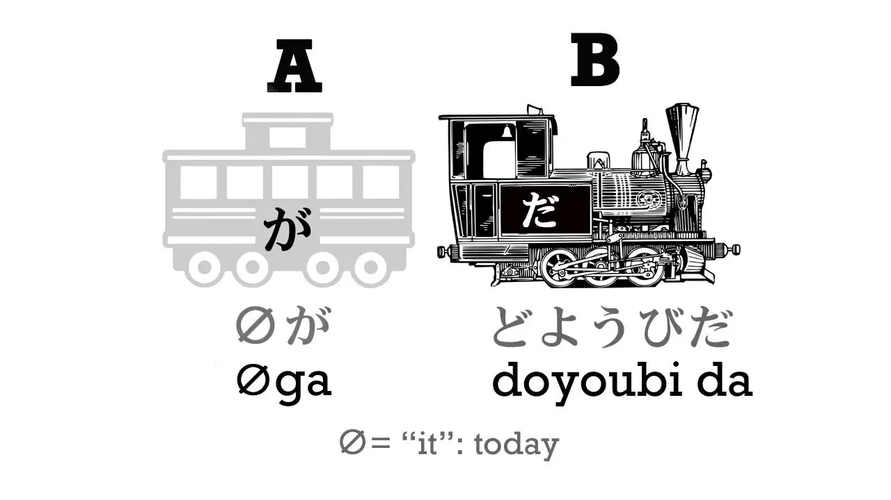
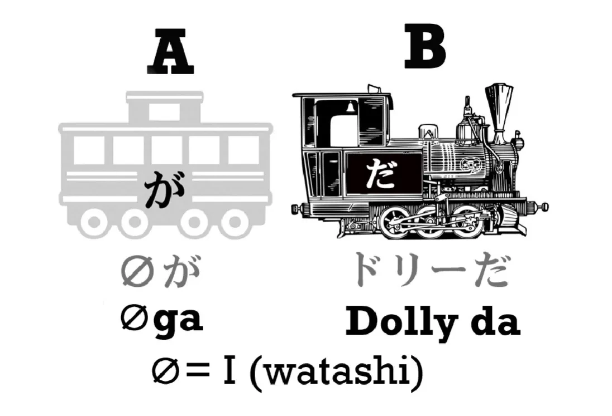
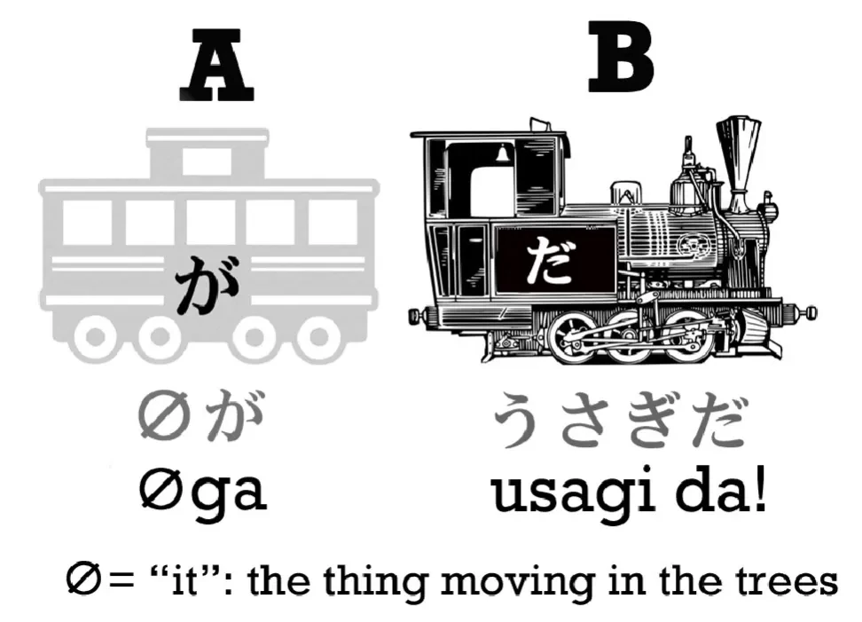
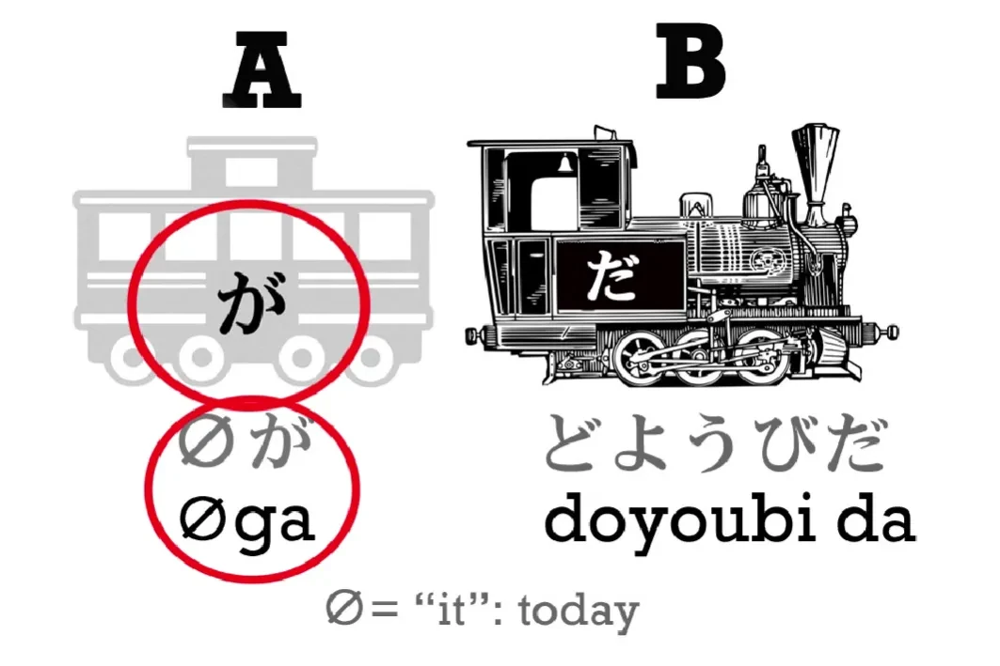
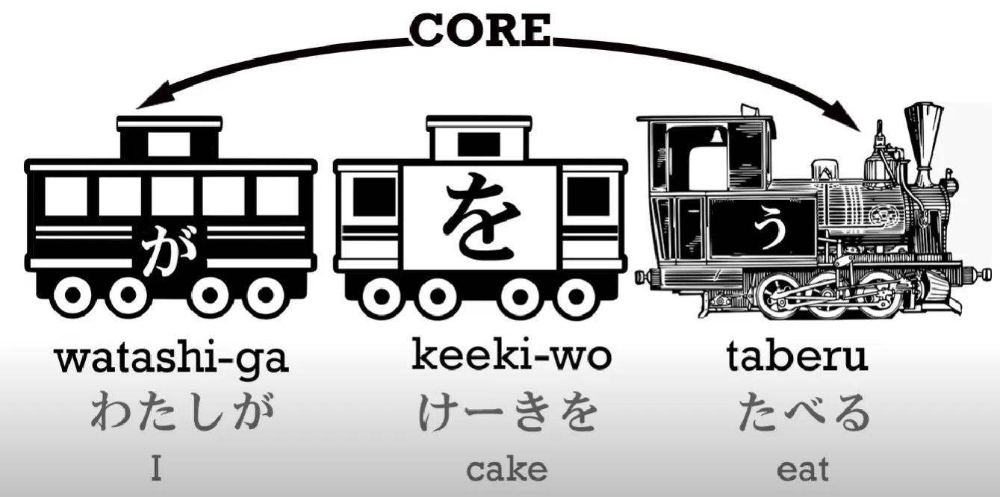
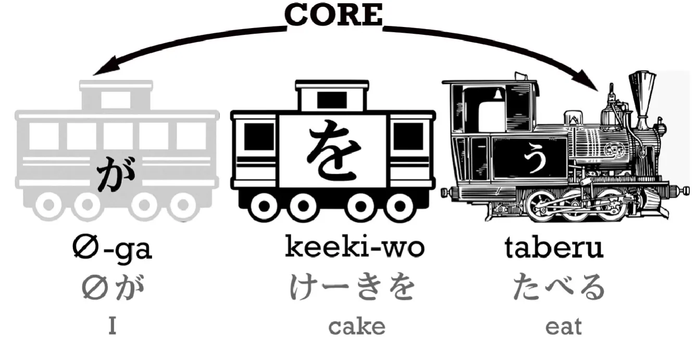

# **2. Gerbong Tak Terlihat dan Partikel "を"**

[**Pelajaran 2: Rahasia Utama. Belajar Bahasa Jepang dengan Mudah - Mengungkap `code`. Belajar Bahasa Jepang dari Nol**](https://www.youtube.com/watch?v=P3n8n0u3LHA&list=PLg9uYxuZf8x_A-vcqqyOFZu06WlhnypWj&index=2&ab_channel=OrganicJapanesewithCureDolly)

## Gerbong Tak Terlihat

Pada pelajaran sebelumnya, kita sudah belajar bahwa setiap kalimat dalam bahasa Jepang memiliki inti logika yang sama: gerbong utama dan *engine* (atau biasa disebut A dan B). Singkatnya, subjek yang sedang kita bicarakan (A) dan apa yang kita katakan tentang subjek tersebut (B). Saya juga sudah menjelaskan bahwa kita bisa menambahkan lebih banyak gerbong seiring dengan makin kompleksnya sebuah kalimat, tetapi intinya akan selalu sama.

Sekarang, kita akan melihat beberapa gerbong tambahan tersebut. Sebelumnya, saya sempat menyinggung bahwa meskipun setiap kalimat selalu punya dua elemen inti, kamu tidak akan selalu melihat keduanya secara langsung. Kamu pasti selalu bisa melihat *engine*-nya, tapi terkadang gerbong utamanya tidak terlihat. 

Kenapa bisa begitu? **Ketika kamu tidak bisa melihat gerbong utamanya, itu berarti posisi gerbong tersebut sedang diisi oleh gerbong tak terlihat (*invisible carriage*).**

Lalu, apa sebenarnya gerbong tak terlihat ini? Dalam tata bahasa Inggris, padanan terdekatnya adalah penggunaan kata ganti `it`.

Mari kita mulai dengan memahami bagaimana fungsi `it` dalam bahasa Inggris lewat contoh berikut:

> Bola itu menggelinding menuruni bukit.
> 
> Ketika bola itu sampai di bawah, bola itu menabrak batu tajam.
> 
> Bola itu bocor dan semua udaranya keluar.

Apakah ada orang yang berbicara mengulang-ulang subjek "bola itu" seperti di atas? Tentu saja tidak. Begitu kita sudah menetapkan konteks apa yang sedang dibicarakan, kalimat selanjutnya akan kita ganti menggunakan kata ganti:

> Bola itu menggelinding menuruni bukit.
> 
> Ketika sampai di bawah, **it** (benda tersebut) menabrak batu tajam.
> 
> **It** bocor dan semua udaranya keluar.

Kata `it` sebenarnya tidak memiliki makna spesifik karena ia bisa mewakili apa saja. Saat saya bilang `it`, saya mungkin sedang membicarakan bunga, langit, pohon, jari saya, Menara Eiffel, atau bahkan galaksi Andromeda. `It` tidak punya makna bawaan: **kamu hanya bisa tahu apa arti `it` itu dari konteks pembicaraannya.**

Sekarang, bayangkan ada seorang anak kecil (yang belum lancar tata bahasa) bercerita seperti ini:

> Bola berguling menuruni bukit,
> 
> sampai di bawah, nabrak batu tajam,
> 
> bocor, semua udaranya keluar.

Apakah ceritanya sulit dipahami? Sama sekali tidak, kan? Secara logis, kita sebenarnya tidak perlu repot-repot menyisipkan kata `it` berulang-ulang hanya untuk bisa saling paham. Walaupun tata bahasa formal Inggris *mewajibkan* penggunaannya, tapi secara fungsi komunikasi murni, kehadiran kata `it` itu tidak terlalu dibutuhkan.

Nah, bahasa Jepang beroperasi persis seperti itu: bahasa ini tidak memiliki kata `it` (kata ganti benda kosongan).

Contoh lain: bayangkan ada orang yang pergi ke dapur tengah malam, lalu kepergok oleh orang lain. Orang itu mungkin hanya akan bilang, `Got really hungry. Came for something to eat.` (Lagi lapar banget. Ke sini mau cari makan).

Sama sekali tidak membingungkan, kan? Padahal maksud struktur kalimat utuhnya adalah, `I got really hungry. I came down for something to eat.`

**Dalam tata bahasa formal bahasa Inggris, menghilangkan subjek seperti itu dianggap salah. Tapi di dalam bahasa Jepang, ini adalah struktur yang 100% benar. Semua kata ganti kecil seperti `it`, `she`, `he`, `I`, dan `they` dalam bahasa Jepang bisa digantikan secara utuh oleh gerbong tak terlihat. Namun, fakta terpenting yang wajib kamu ingat adalah: secara struktural, subjek tersebut tetap ada di sana.**

Mari kita lihat penerapannya di dalam bahasa Jepang. Saya mungkin berkata, `ドリーだ`, yang berarti `I am Dolly`. Sekilas, kalimat ini terlihat seolah hanya punya *engine* tanpa ada gerbong utama sama sekali. Padahal, gerbong utamanya tetap ada, hanya saja posisinya sedang diisi oleh gerbong tak terlihat. Kalau ditulis secara struktural utuh, kalimat aslinya berbunyi: `(zeroが)ドリーだ`.

Bisa dibilang bahwa `I` (Saya) adalah *setting default* dari subjek tak terlihat (Zero が) ini. Tapi, konteks di lapangan bisa mengubah maknanya menjadi apa saja. 

Misalnya, kita sedang berada di hutan, lalu tiba-tiba terdengar suara gemerisik di semak-semak. Saat menoleh, saya spontan berteriak, `ウサギだ!`. Di situasi ini, kalimat struktural lengkapnya adalah `(zeroが)ウサギだ!` alias `It is a rabbit!`. Kata `it` (*zero が*) tersebut merujuk langsung pada konteks fisik benda yang baru saja kita lihat muncul dari semak-semak, yaitu seekor kelinci.

Contoh lain, jika saya berkata, `土曜日だ` (土曜日 / どようび berarti Sabtu), saya pada dasarnya sedang mengatakan `(It) is Saturday`. Apa arti `it` di kalimat ini? Tentu saja konteksnya adalah "Hari ini". Semua contoh di atas adalah kalimat bahasa Jepang yang utuh dan sempurna, lengkap dengan kehadiran gerbong utama (subjek bertanda が) dan sebuah *engine*.

## Partikel を

Sekarang, saya akan memperkenalkan satu jenis gerbong baru, yaitu gerbong を. Gerbong ini berisi kata benda yang ditempelkan dengan partikel を (dibaca `o`). Kalau kamu sudah familiar dengan istilah *object* dalam tata bahasa (yaitu benda yang dikenai suatu tindakan/pekerjaan), maka ini adalah cara paling gampang untuk mengingatnya: anggap saja `o` adalah singkatan dari `object`.

Wujud visual gerbong "を" bisa kamu lihat pada gambar di bawah. Perhatikan bahwa warnanya putih. Warnanya dibedakan menjadi putih karena gerbong ini *bukan* bagian dari kereta inti. **Kereta inti akan selalu, dan hanya, terdiri dari dua bagian: gerbong utama dan *engine*.** Jadi, saat kita melihat ada gerbong putih masuk ke dalam rangkaian, kita langsung tahu bahwa tugas gerbong itu murni hanya untuk memberikan informasi tambahan seputar si *engine* atau si gerbong utama.

Mari kita bedah kalimat ini: `わたしがケーキを食べる` (I eat cake / Saya makan kue).

Di sini kalimat inti yang sebenarnya hanyalah `I eat` (わたしが 食べる). Itu adalah dua gerbong hitam penyusun kereta inti. Lalu, masuklah gerbong putih `ケーキを` untuk memberikan detail lebih lanjut seputar si *engine* (tindakan). Kalimat intinya bilang 'Saya makan', dan `ケーキを` (kue) melengkapinya dengan memberi tahu *apa* objek yang saya makan.

Nah, bagian paling menariknya adalah, dalam percakapan sehari-hari bahasa Jepang, kalimat ini justru lebih sering diucapkan menjadi: `ケーキをたべる`. Dengan ilmu yang baru kamu pelajari di atas, kamu pasti sudah tahu apa yang sedang terjadi di sini, kan? Yap, ini adalah kasus di mana gerbong A (gerbong utama/subjek) berubah wujud menjadi gerbong tak terlihat.

**Ingat aturan emasnya: Kita tidak bisa membuat kalimat bahasa Jepang tanpa subjek (が). Sama halnya seperti kita tidak bisa membicarakan sebuah tindakan tanpa ada si pelaku tindakan.** Jadi, saat seseorang bilang `ケーキをたべる`, yang sebenarnya secara struktural ia katakan adalah `(zeroが)ケーキをたべる`. 

Karena *setting default* dari `zero` (gerbong tak terlihat) adalah `わたし` (saya), kalimat ini otomatis berarti `I eat cake`. Namun, kalau konteks percakapan di momen tersebut ternyata sedang membicarakan orang lain, maka `zero` tersebut akan mewakili orang lain sebagai si pemakan kue.

::: info
Sebagai pengingat logis: seperti yang bisa kamu lihat secara visual pada gambar-gambar gerbong di atas, setiap partikel itu menempel kuat pada kata SEBELUMNYA (kata yang ada di belakangnya), bukan kata sesudahnya.
:::
