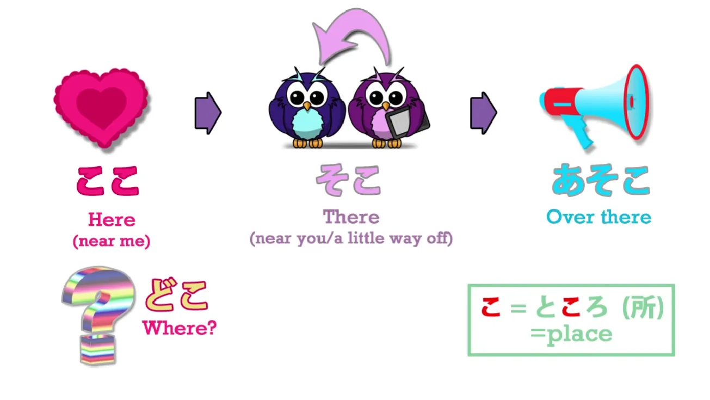
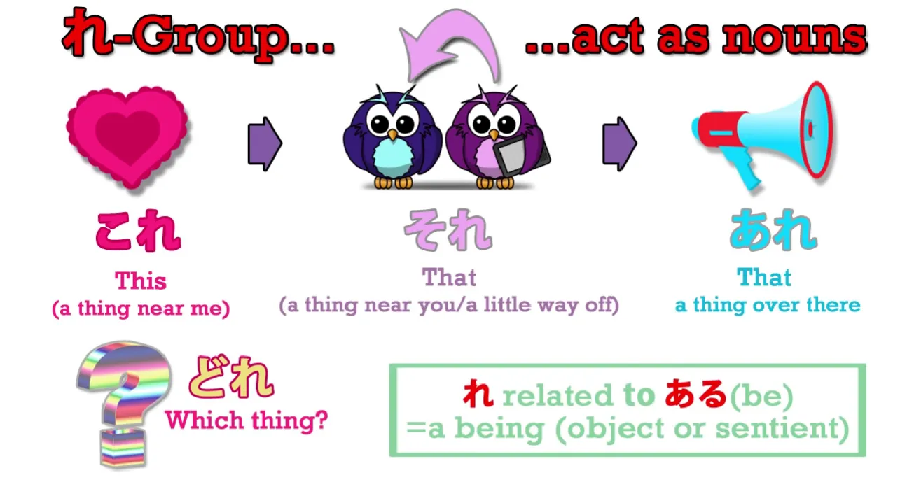
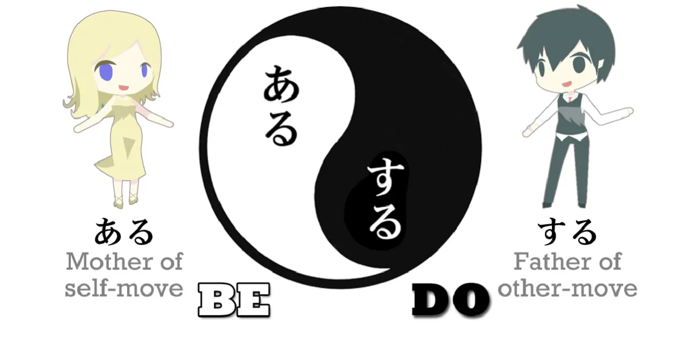
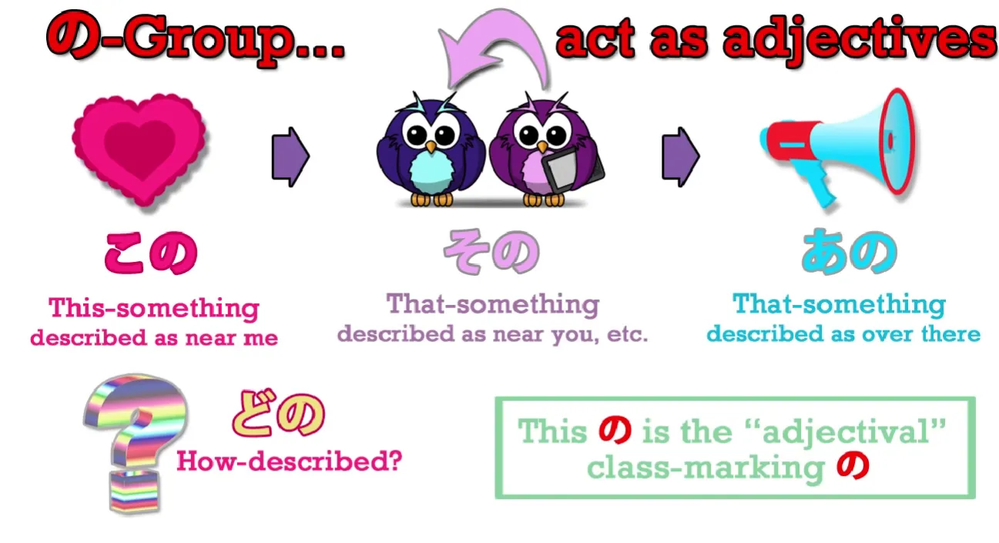
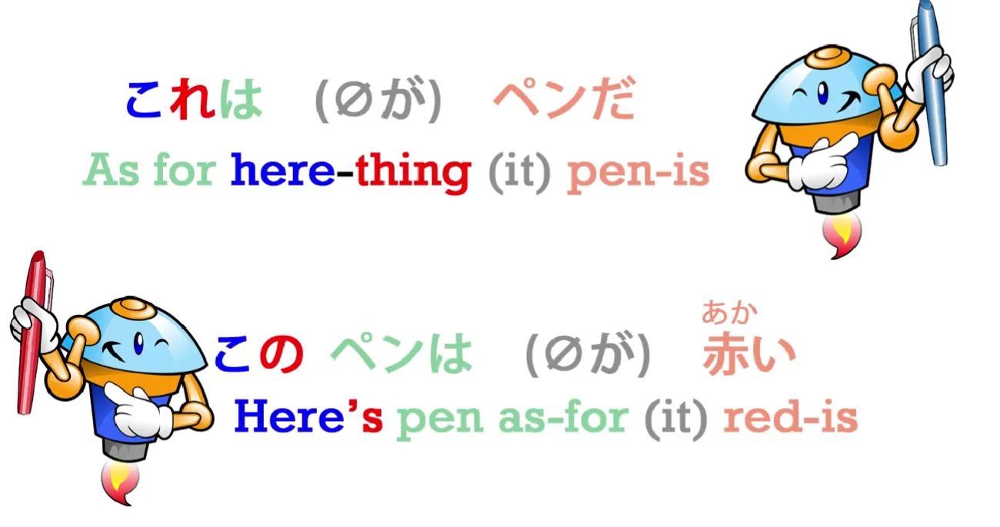
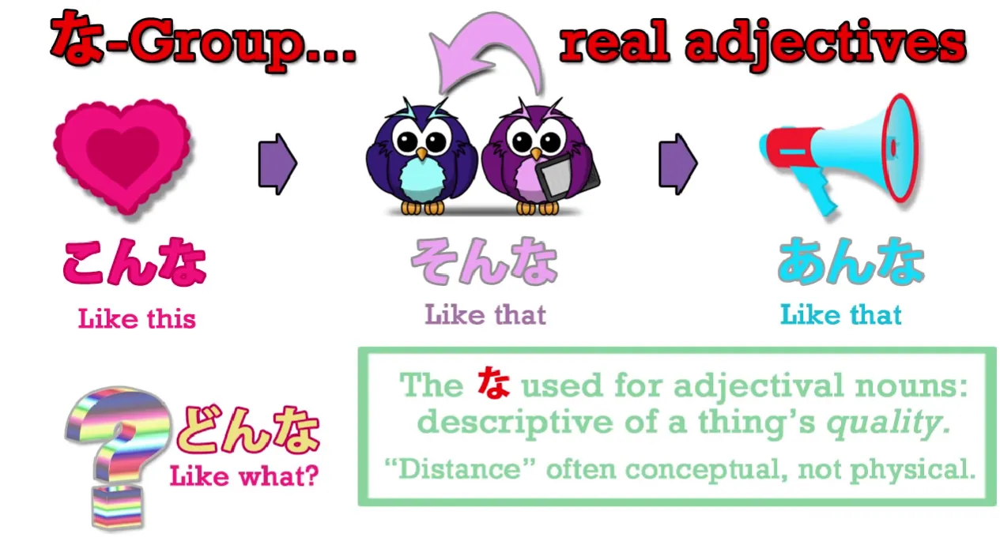
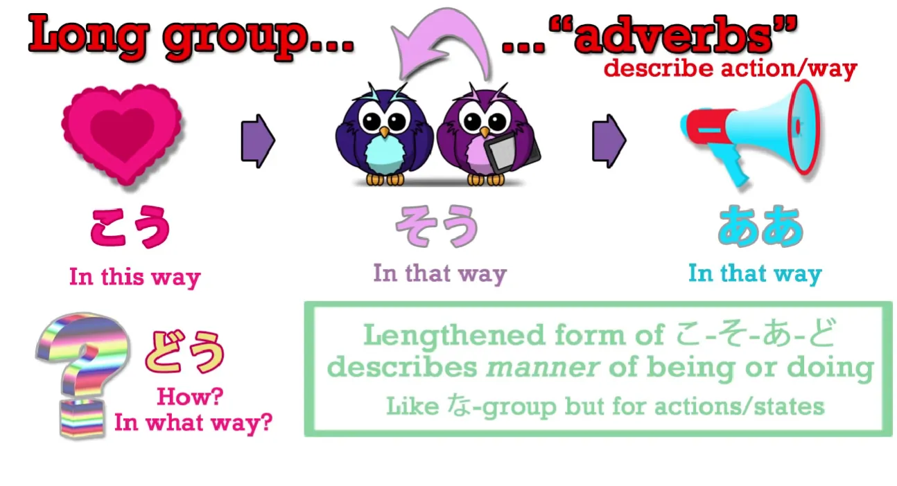
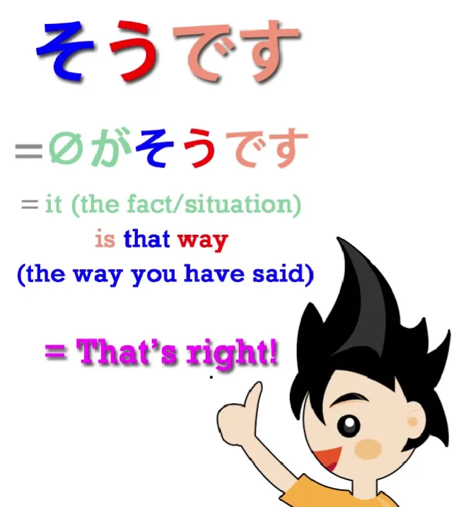

# **20. Kata-kata Penunjuk Arah: それ・その・そんな・そう, dll.**

[**Pelajaran 20: `Sore/Sono/Sonna/Sou` dll. bagaimana kata-kata arah BENAR-BENAR bekerja!**](https://www.youtube.com/watch?v=xLkY6whr7T4&list=PLg9uYxuZf8x_A-vcqqyOFZu06WlhnypWj&index=31)

こんにちは。

Hari ini kita akan mengupas tuntas sistem kata penunjuk arah di tata bahasa Jepang, yang dibangun menggunakan tulang punggung: `こ` (Ko), `そ` (So), `あ` (A), dan `ど` (Do).

Di kalangan akademis, sistem ini dikenal dengan julukan sistem *Ko-So-A-Do*. Pada awalnya, sistem ini murni diciptakan untuk menandai lokasi fisik secara harfiah. Tetapi seiring berjalannya waktu, penggunaannya berkembang ke ranah yang lebih halus dan metaforis (untuk menunjuk ide atau konsep). 

Evolusi seperti ini sangat lumrah terjadi. Semua bahasa di dunia pasti menggunakan metafora arah fisik untuk mengekspresikan konsep abstrak (seperti "pikiran yang melayang *jauh*", "masalah yang *dekat* dengan hati", dll). Dan untungnya, cara bahasa Jepang memetakan dunia fisik ke dunia konsep abstrak ini sangat logis dan bisa diprediksi. 

Jadi, mari kita mulai dari wujud dan makna paling primitif dari *Ko-So-A-Do*, yaitu menunjuk lokasi fisik harfiah.

## ここ, そこ, あそこ, どこ (Koko, Soko, Asoko, Doko)

**Penggunaan lokasi fisik yang paling dasar adalah dengan menempelkan `こ`: `ここ`, `そこ`, `あそこ`, `どこ`.**

- **`ここ` (Koko)** berarti `Di sini`. Jika kamu tahu kosakata bahasa Jepang untuk hati/perasaan, yaitu `こころ / 心` (Kokoro)—ingat saja bahwa "Kokoro itu terletak di *koko*", persis di dalam dada saya, tempat saya berpijak. Itu bukan asal-usul sejarah linguistiknya, tapi itu adalah trik hafalan (*mnemonic*) yang sangat ampuh. 
- **`そこ` (Soko)** berarti `Di situ`. Aturan umumnya: **`ここ` merujuk pada area si pembicara, dan `そこ` merujuk pada area si lawan bicara (pendengar).** 
- **`あそこ` (Asoko)** berarti `Di sana/Seberang sana`. Kata ini merujuk pada suatu tempat yang letaknya jauh dari si pembicara maupun si pendengar. Karena letaknya cukup jauh, bayangkan saja kamu harus berteriak "Aaaaa!" agar suaramu sampai ke sana. Itulah asal usul awalan "A" pada *Asoko*.
- **`どこ` (Doko)** berarti `Di mana?`. Awalan `ど` selalu berfungsi untuk membentuk *Kata Tanya*. 

Jadi kesimpulannya: **awalan `こ` berarti merujuk ke 'sini' (dekat dengan saya)**; **awalan `そ` berarti merujuk ke 'situ' (dekat dengan kamu)**; **awalan `あ` berarti merujuk ke 'sana' (jauh dari kita berdua)**; dan **awalan `ど` bertugas menanyakan lokasi.** 

Dalam anime atau dorama, kamu pasti sering melihat adegan klise di mana sang karakter pingsan, lalu saat bangun ia bergumam: `ここはどこ?` (Koko wa doko?).
Terjemahan literalnya: `**Berbicara mengenai tempat ini (Koko wa), di mana (Doko)?**`. 

Dan ini adalah bukti perbedaan cara pikir: Ketika orang Inggris/Indonesia tersesat, mereka akan bertanya pada eksistensi diri mereka sendiri: `"Di mana SAYA?"` (Where am I?). **Tetapi cara pikir orang Jepang berfokus pada ruang:** `"Di mana TEMPAT INI?"` (`ここはどこ?`). 

Sejauh ini, aturannya sangat simpel. Sekarang kita akan membedah salah satu hal yang paling sering bikin pemula pusing tujuh keliling. Yaitu membedakan fungsi antara kelompok akhiran `れ` (-re) dan kelompok akhiran `の` (-no). Di bahasa Indonesia atau Inggris, kedua kelompok ini biasanya cuma diterjemahkan pakai satu kata yang sama (Ini/Itu). Padahal, di bahasa Jepang tugas mereka berbeda total. Mari kita bedah.

## これ, それ, あれ, どれ (Kore, Sore, Are, Dore)

**Kelompok berakhiran `れ` adalah: `これ`, `それ`, `あれ`, `どれ`.** 
**Rahasia inti dari akhiran `-れ` adalah: ia bermakna `Sebuah Benda/Makhluk`.** 
Jika kelompok `-こ` tadi berbicara soal 'Tempat' (dan bisa ditulis pakai kanji `所` / tempat), maka kelompok **`-れ` ini adalah kerabat dekat dari `ある` (Aru / Eksis).**

Ingat Pelajaran 15? `ある` adalah ibu dari segala benda mati, yang berarti `Eksis / Ada`. **Jadi akhiran `-れ` ini merujuk pada `Suatu wujud yang eksis` (Sebuah benda/makhluk).** 
Saat kita mengatakan *wujud yang eksis* di dalam bahasa Inggris, itu biasanya merujuk pada makhluk hidup. **Tetapi di bahasa Jepang, ini mencakup benda mati maupun hidup; pokoknya entitas fisik yang eksis.** 

Jadi, 
- `これ` (Kore) berarti `Benda ini`.
- `それ` (Sore) berarti `Benda itu (di dekatmu)`.
- `あれ` (Are) berarti `Benda di sana (jauh)`.
- `どれ` (Dore) berarti `Benda yang mana?`.

## この, その, あの, どの (Kono, Sono, Ano, Dono)

Sekarang, pemula sering mencampuradukkan kelompok `-re` tadi dengan **kelompok `の`: `この`, `その`, `あの`, `どの`.**

Jika akhiran `-れ` bertugas menggantikan status sebagai "Objek/Benda" secara utuh, **akhiran `の`, seperti yang sudah kita tahu di pelajaran sebelumnya, bertugas MEMODIFIKASI / MEMBERI KETERANGAN pada kata benda.** 

Contoh dasar: Jika kita bilang `さくらのドレス`, artinya adalah `Gaun milik Sakura / Gaun yang dikategorikan punya Sakura`. Jika kita bilang `伝説の戦士 / でんせつのせんし`, artinya `Ksatria Legendaris / Ksatria yang masuk dalam kategori legenda`.

---

Nah, **huruf `の` yang merakit `この / その / あの / どの` ini adalah `の` yang SAMA PERSIS dengan `の` yang kita bahas barusan!** 

Mari kita pakai kalimat buku teks jadul untuk membandingkannya. 
Jika kita menggunakan `これ`: `これは (zero-ga) ペンだ`. Makna literalnya: `Adapun mengenai BENDA INI, (ia) adalah pulpen.` *(Kore berdiri sendiri sebagai benda).*

TETAPI jika kita menggunakan `この`: `**このペン**は (zero-ga) 赤い` - `**Pulpen INI**, (ia) berwarna merah`. 
Perhatikan struktur `このペン`. Secara harfiah ia bermakna: `"Sebuah pulpen, yang masuk ke dalam kategori/kriteria benda-benda yang letaknya DI SINI."`

- `それは (zero-ga) ペンだ` -> `BENDA ITU / Benda yang sedang kamu pegang itu, (ia) adalah pulpen.` 
- `そのペンは (zero-ga) 赤い` -> `Pulpen ITU / Pulpen yang masuk ke dalam kategori letak di situ (di dekatmu), (ia) berwarna merah.` 

Dalam bahasa Indonesia dan Inggris, kita malas dan cuma pakai kata yang sama persis: `Ini (This)` pulpenku, dan `Pulpen ini (This pen)` berwarna merah. Padahal fungsi aslinya berbeda (yang satu berdiri sendiri sebagai Kata Ganti Benda, yang satu menempel sebagai Kata Sifat Penunjuk). Begitu kamu paham logika kategori `の` ini, hal ini akan terasa sangat, sangat mudah dipahami.

## こんな, そんな, あんな, どんな (Konna, Sonna, Anna, Donna)

Lanjut, **kelompok berikutnya adalah `こんな`, `そんな`, `あんな`, `どんな`.**

Sekarang, coba tebak: **ada apa dengan akhiran `-な` (Na)?** 
Akhiran `-な`, seperti yang sudah kita kuliti habis-habisan di Pelajaran 6, adalah wujud *mutan* dari kopula `だ` (Da). **Tugas utama `-な` adalah mengubah sebuah Kata Benda menjadi Kata Sifat (Pemodifikasi) yang bisa diletakkan persis di depan kata benda lainnya.**[[6]](./6-adjectives.md) 

Dan keajaiban logika yang sama persis terjadi di kelompok ini! 
- `**こんな**` (Konna) berarti `**(Sesuatu) yang TIPE/MACAMNYA seperti ini**`
- `**そんな**` (Sonna) berarti `**(Sesuatu) yang MACAMNYA seperti itu**` 
- `**あんな**` (Anna) berarti `**(Sesuatu) yang MACAMNYA seperti yang jauh di sana**`. 

Saya tidak akan menggali ini terlalu teknis, **tetapi keputusan untuk memilih menggunakan `そんな` atau `あんな` biasanya sangat bergantung pada JARAK PSIKOLOGIS.** Tidak sekadar mengacu pada posisi benda secara harfiah, tetapi lebih sering mengacu pada **seberapa "jauh" / seberapa "asing" ide, situasi, atau topik yang sedang kita obrolkan tersebut di dalam pikiran kita.**

---

Contoh kalimat kasual: `**こんな**食べ物が好きです` -> `Saya suka **makanan yang SEPERTI INI**`.

`**そんな**ことがひどい` -> `**Hal (Tindakan) SEPERTI ITU** sangatlah jahat/kejam`.

Bahkan, jika kamu sering menonton anime atau dorama, kamu pasti sering mendapati karakter berteriak: `"Sonna!"` (`そんな！`). 
**Ketika diteriakkan dengan nada kaget, tidak percaya, atau menuduh seperti itu, kata ini murni merupakan wujud singkatan dari `"Hal MACAM ITU (tidak mungkin terjadi)!"`.** 

Arti tersiratnya adalah: `Kejadian macam itu jahat banget! / Hal macam itu adalah hal yang sangat tidak aku sukai!`. 
**Atau secara harfiah: `Tega-teganya kamu mengatakan hal SEPERTI ITU!` (`そんな！`).**

---

Kesimpulan mutlaknya: **kelompok `そんな` sejatinya adalah Kata Sifat Perbandingan.**

Kita sedang mendeskripsikan sifat dari suatu benda/kejadian, dengan cara **MEMBANDINGKANNYA** dengan 'acuan' yang kita tunjuk: membandingkannya dengan hal yang ada di sini (Konna), di sana (Sonna), atau hal yang sangat asing/jauh (Anna)—baik secara fisik maupun secara pemikiran (konseptual).

---

Lalu apa tugas **`どんな` (Donna)? Ini bertugas bertanya: `SEPERTI APA tipenya?`.** 
Secara harfiah, *"Benda macam apa yang akan kita pakai sebagai acuan perbandingan?"*

## こう, そう, ああ, どう (Kou, Sou, Aa, Dou)

Sistem *Ko-So-A-Do* yang terakhir adalah ketika huruf-huruf ini dicopot dan diperpanjang vokalnya menggunakan huruf `-う` (Atau khusus untuk 'A', diperpanjang dengan `-あ`). 

**Maka lahirlah: `こう` (Kō), `そう` (Sō), `ああ` (Ā), `どう` (Dō).** 
**Kelompok ini secara eksklusif bertugas membicarakan BAGAIMANA CARA/KONDISI terjadinya suatu hal.** 

Jadi ketika orang Jepang mengucapkan frasa sakti `(zero-ga) そうですね?` (Sou desu ne?), secara tata bahasa mereka sedang merakit: `(It)That's right, isn't it? / Memang begitu adanya ya?`

Jadi makna harfiah yang keluar dari mulut mereka adalah: `(zero-ga) **そう**だ / **そう**です` -> `(Hal tersebut) wujudnya **MEMANG SEPERTI ITU / DENGAN CARA BEGITU**.` 

- Jika kita mengatakan `**そう**する` (Sou suru), kita bermaksud `Lakukan **DENGAN CARA ITU**`.
- Jika kita mengatakan `**こう**する` (Kou suru), kita bermaksud `Lakukan **DENGAN CARA INI**`.
- Jika kita mengatakan `**どう**する` (Dou suru?), kita sedang bertanya `Melakukannya **DENGAN CARA APA (Bagaimana)?**`. 

Dan dari *Dou suru* ini lahir idiom yang pasti pernah kamu dengar: `**どう**すればいい?` (Dou sureba ii?).

**Sebagai catatan, `すれば` (sureba) adalah bentuk Pengandaian (Kondisional) dari `する` (Melakukan).** 
Jadi, ketika mereka panik dan berteriak `どうすればいい?`, makna literal logikanya adalah: `**JIKA** aku bertindak **BAGAIMANA (DENGAN CARA APA)**, hal itu akan berujung bagus (いい)?` -> *(Apa yang harus aku lakukan? / Enaknya gimana ya?)*

Lebih canggihnya lagi, kamu akan sangat sering menemukan kelompok *Kou-Sou-Aa-Dou* ini **dijahit dengan kata `いう / 言う` (Iu / Berkata).** Ini adalah salah satu bukti brilian dari fleksibilitas "konsep kutipan/penamaan" (To Iu) bahasa Jepang yang kita bahas di Pelajaran 18 lalu. 
**Dan jahitan ini NYARIS SELALU digunakan untuk membahas hal-hal abstrak atau situasi non-fisik**—dengan kata lain, **hal-hal yang jatuh di bawah kategori `こと` (Koto)**, bukan benda fisik `もの` (Mono).

Jadi kamu akan dibombardir oleh frasa sakti semacam ini setiap hari: 
- `そういうこと` (Sou iu koto)
- `こういうこと` (Kou iu koto)
- `どういうこと` (Dou iu koto) 
*(Tentu saja ada juga `ああいうこと / Aa iu koto`. Frekuensi penggunaannya memang tidak setinggi tiga saudaranya, tapi tetap eksis).*

Mari kita bedah sampai ke DNA-nya. Apa sebenarnya makna struktural dari frasa ini? 
- `そういうこと` bermakna `Hal/Keadaan YANG DISEBUT *seperti itu*`
- `こういうこと` bermakna `Hal/Keadaan YANG DISEBUT *seperti ini*`
- `どういうこと` bermakna `Hal/Keadaan YANG DISEBUT *seperti apa*?` 

Kenapa bahasa Jepang memakai rute panjang lebar *"Keadaan yang disebut seperti apa?"*? Kenapa tidak ngomong langsung saja? 
Karena inilah cara pikir mereka. Makna literal `どういうこと` adalah: `**how-said circumstance / how-said condition**` **(Sebuah kondisi/situasi yang dijelaskan dengan cara apa?)** 
Atau dengan kata lain: **"Dengan kata-kata/deskripsi macam apa kita harus menggambarkan kondisi yang sedang terjadi ini?"** 

Dan karena maknanya adalah mencari kejelasan akan suatu situasi, frasa ini berevolusi menjadi kalimat seruan/pertanyaan ekstrem dalam anime atau dorama: `どういうこと!?` (Dou iu koto!?).
Maknanya bisa setara dengan: `Apa yang sebenarnya sedang terjadi di sini!? / Ini situasi macam apa!?`
Dan ini juga sering dipakai untuk mengonfrontasi ucapan aneh seseorang: `Maksud omonganmu apa!? / Apa yang sedang berusaha kamu katakan!?` 

Satu hal terakhir yang krusial untuk dicerna: **Kata `いう` (Berkata) di dalam idiom ini TIDAK MERUJUK pada fakta bahwa orang tersebut sedang 'berbicara' menggunakan mulutnya saat itu juga.** 
Ketika kamu berteriak `どういうこと`, kamu BUKAN sedang bertanya bagaimana cara melafalkan suaranya. **Kata `いう` di sini berfungsi murni untuk "MEMBERIKAN DESKRIPSI/JULUKAN" pada si benda/situasi tersebut.** 

Jadi, kalimat utuh dari seruan `どういうこと` tersebut sebetulnya adalah singkatan (pemotongan) dari kalimat utuh ini:
`どういうことを **いう**?` -> `(Kamu sedang) **menyebut** hal (Koto) ini sebagai situasi yang seperti apa?` -> `(Maksud kamu apa?)`.

Itulah dia rahasianya! Sekarang kamu bisa melihat dengan jernih bahwa sistem *Ko-So-A-Do* ini bukan cuma beroperasi untuk menunjuk lokasi tempat di dunia fisik, melainkan sistem ini bekerja tanpa cela untuk menunjuk "lokasi" di dalam ruang metafora pikiran dan situasi.
