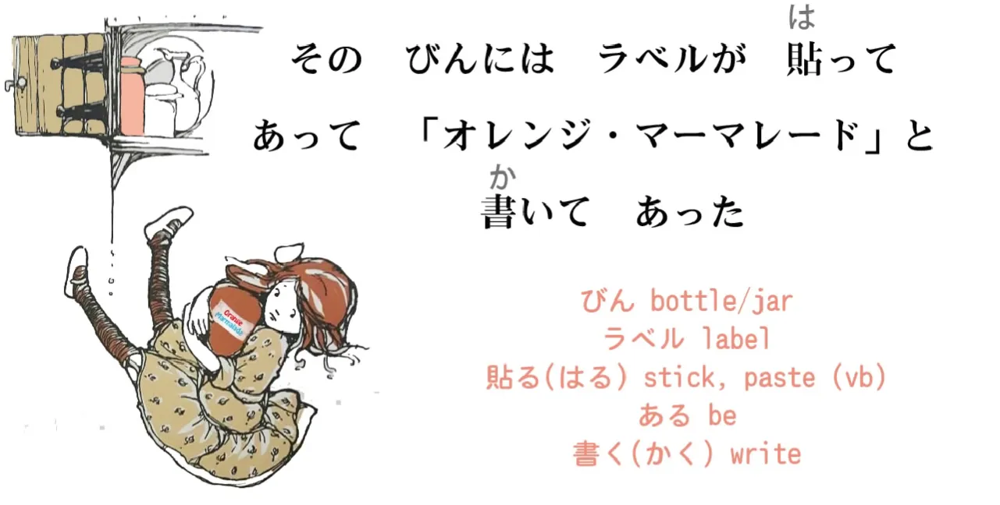
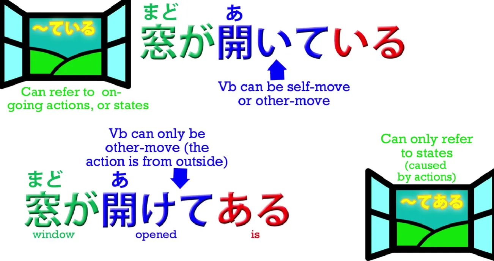
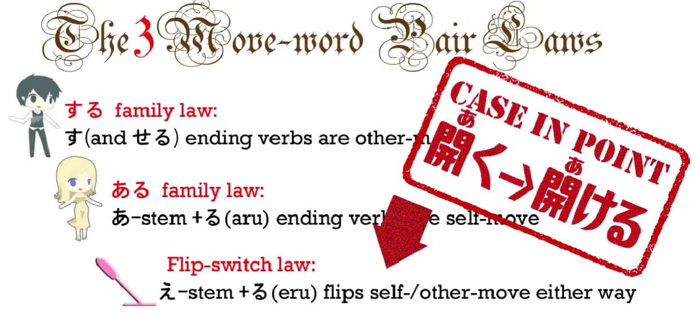
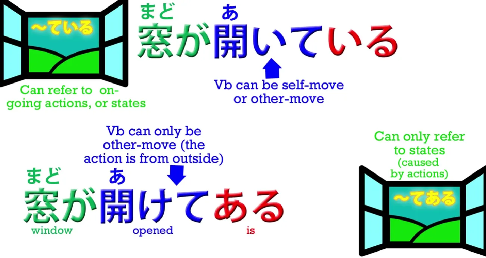
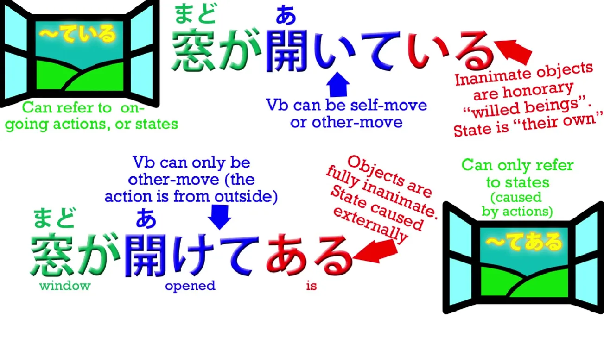
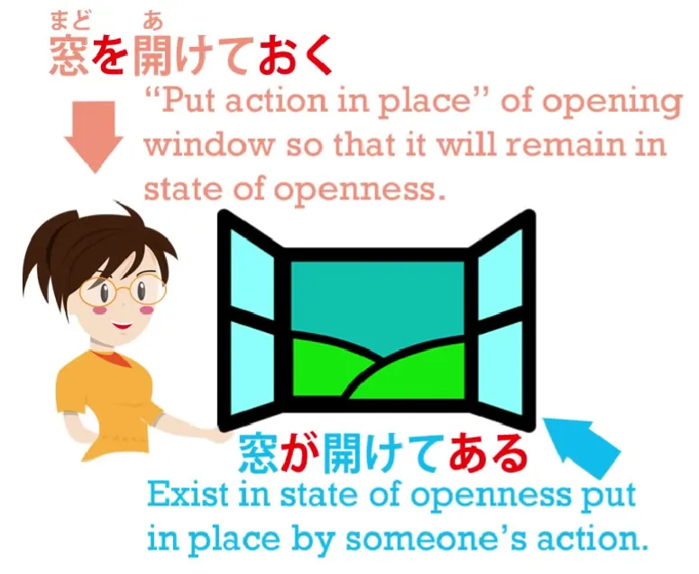
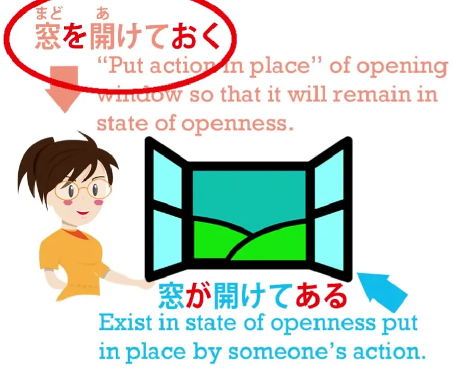

# **21. てある / ている & ておく**

[**Pelajaran 21: Te oku/te aru: cara BENAR-BENAR memahaminya. Hal yang tak pernah diajarkan!**](https://www.youtube.com/watch?v=cYrqFjPvwSI&list=PLg9uYxuZf8x_A-vcqqyOFZu06WlhnypWj&index=27)

こんにちは。

Hari ini, kita akan kembali membedah teks petualangan Alice, dan kita akan memanfaatkannya sebagai wahana untuk membongkar misteri penggunaan bentuk-te (`て`) tingkat *advanced*. 
Materi ini sebenarnya dibahas di buku teks standar atau *website* belajar bahasa Jepang, tetapi seperti biasa, mereka cuma menyodorkan hapalan tanpa mau menjelaskan "Logika Kenapa" di baliknya. Dan parahnya lagi, karena materi ini TIDAK PUNYA padanan kata dalam bahasa Inggris/Indonesia, mereka sering kali cuma menjejali otakmu dengan terjemahan yang dipaksakan. Hasilnya? Kamu cuma bisa nebak-nebak buah manggis.

Jadi, mari kita ingat kembali ceritanya: Alice sedang melayang jatuh dengan sangat pelan ke dalam sumur kelinci, dan ia mencomot sebuah toples dari salah satu rak saat ia sedang melayang turun.

> `そのびんにはラベルが貼ってあって「オレンジ・マーマレード」と書いてあった`

Coba perhatikan baik-baik: ada TIGA mesin kata kerja wujud-te (て) di dalam kalimat ini. Mari kita bedah tugas mereka satu per satu.

> `そのびんにはラベルが貼**ってあって**...` (Sono bin ni wa raberu ga **hatte-atte**...)

`びん / 瓶` (Bin) adalah kosakata untuk `toples/stoples kaca` di sini. (Kata ini memang sering dipakai juga untuk menyebut `botol`, tetapi di konteks ini wujudnya adalah toples). 
`ラベル` (Raberu) jelas merupakan kata serapan untuk `Label`. 
`貼る` (Haru) berarti `menempelkan/merekatkan` sesuatu ke benda lain. Jadi secara keseluruhan ini menceritakan bahwa ada sebuah label yang menempel pada toples tersebut.

Secara harfiah, **ia sedang membicarakan toples tersebut (`には` / *ni wa*) sebagai 'sasaran lokasi' tempat menempelnya si label.** 
Namun coba perhatikan wujud kata kerjanya: **`貼ってある` (Hatte-aru)**. 
Kita belum pernah membongkar rahasia mesin ini sebelumnya. Di pelajaran awal, kita sudah menguasai bentuk-te yang ditambah `いる` (*Te-iru*). Kita tahu bahwa `いる` berarti `Ada/Eksis (Untuk Makhluk Hidup)`, sehingga rumus *Te-iru* bermakna "sedang melakukan tindakan" (*continuous*) atau "sedang berada dalam kondisi (akibat tindakan masa lalu)".

## Misteri "てある" (Te-aru)

Lalu bagaimana dengan wujud `〜てある` (Te-aru)?
Kata `ある` juga berarti `Ada/Eksis (Untuk Benda Mati)`. **Sehingga, fungsi dasarnya sebenarnya sangat mirip: ia juga menyatakan bahwa sebuah benda "berada dalam kondisi/status hasil dari tindakan tersebut".** 

Lalu apa dong beda mutlaknya dengan *Te-iru*? Saya akan membongkar perbedaannya lewat contoh maut ini. Bandingkan kalimat `窓が開い**ている**` (Mado ga ai-**te iru**) dengan kalimat `窓が開け**てある**` (Mado ga ake-**te aru**).

Ajaibnya, jika kamu melempar kedua kalimat ini ke *Google Translate*, keduanya akan diterjemahkan dengan arti yang SAMA PERSIS: `The window is open` (Jendelanya sedang terbuka). 

Kalimat pertama, `開い**ている**`, murni cuma melaporkan fakta bahwa jendelanya terbuka. Dan ini bisa diterjemahkan mentah-mentah tanpa masalah.
**TETAPI, kalimat kedua `窓が開け**てある**` TIDAK PUNYA padanan terjemahan yang akurat di bahasa Inggris/Indonesia.** **Karena meskipun hasil akhirnya sama (jendela terbuka), kalimat ini menyiratkan SEBUAH RAHASIA GELAP.**

Coba perhatikan baik-baik pilihan kata asalnya. 
Kalimat pertama, `窓が**開いている**`, menggunakan kata **`開く` (aku)**, yang notabene adalah **versi 'Gerak Diri' (Intransitif).** Jadi kalimat ini cuma menyatakan wujud fisik murninya: **jendela itu terbuka dengan sendirinya, jendela itu berada dalam status/kondisi terbuka.** 

Sedangkan kalimat kedua, menggunakan kata **`開ける` (akeru)**, yang merupakan **versi 'Gerak Orang Lain' (Transitif).** Kata `開ける` ini adalah hasil mutasi wujud *-eru* yang tunduk pada Hukum Ketiga Gerak Orang Lain yang sudah kita pelajari habis-habisan di Pelajaran 15.[[15]](./15-transitive-and-intransitive-verbs.md)

**Jadi, `開く` (atas) murni berarti "terbuka sendiri", entah itu kotak yang terbuka atau mulut yang terbuka;** **Sedangkan `開ける` (bawah) berarti "Membuka [sesuatu]": tindakan membuka kotak, membuka pintu, dsb (Ada pelaku di baliknya).**

Jadi, apa pesan rahasia yang dibawa oleh kalimat **`窓が開けてある`** (Mado ga ake-te aru)? 
Kalimat itu menyatakan bahwa jendelanya memang terbuka, **TETAPI ia terbuka KARENA ADA ORANG LAIN (SENGAJA) MEMBUKANYA dan meninggalkannya dalam posisi itu.** 
**Bahasa Jepang memberikan dua bukti tak terbantahkan untuk menyiarkan pesan ini: Pertama, dengan sengaja memilih kata kerja 'Gerak Orang Lain' (Membuka), dan Kedua, dengan sengaja menutupnya menggunakan `ある` (Ada-Benda) alih-alih `いる` (Ada-Makhluk).**

Lalu, apa filosofi linguistik di balik penggunaan "Iru" dan "Aru" ini? 
Dengarkan baik-baik. Ketika kita ngomong `窓が開い**ている**` (Jendela terbuka), **MESKIPUN jendela itu adalah benda mati tak bernyawa, KITA SENGAJA MENGGUNAKAN MESIN `いる` (Iru) YANG SEHARUSNYA JATAH EKSKLUSIF UNTUK MAKHLUK HIDUP.** 

Loh, kenapa bahasa Jepang menabrak aturan sakralnya sendiri demi sebuah jendela? 
Karena di dalam pernyataan ini, kita MURNI cuma bilang jendelanya terbuka—**kita TIDAK MAU menyenggol/menyiratkan adanya campur tangan manusia di baliknya.** Jadi, untuk membantah keterlibatan manusia, **bahasa Jepang menyulap si jendela menjadi "Makhluk Hidup Kehormatan".** **Seolah-olah si Jendela itu hidup dan memiliki kehendaknya sendiri untuk terbuka (mesin *Gerak Diri*).** Kita menceritakan seolah-olah ia berinisiatif membuka dirinya sendiri. Oleh karena itu, kita memakaikan mahkota `いる` kepadanya:
`窓が開いている` (Jendela-san sedang terbuka).

---

TETAPI, beda ceritanya jika kita mengucapkan `窓が開け**てある**`. 
**Dalam skenario ini, kita secara sadar sedang menceritakan bahwa ADA SESEORANG yang campur tangan "membuka" si jendela dan membiarkannya begitu.** 
**Akibatnya, si Jendela kehilangan mahkota dan takhtanya sebagai Makhluk Hidup Kehormatan.** **Ia dilucuti dan dikembalikan statusnya sebagai seonggok OBJEK BENDA MATI yang cuma bisa menerima perlakuan dari manusia luar.** Oleh karena itu, kita kembali menggunakan mesin jatah benda mati, yaitu `ある`: `開け**てある**`.

---

Dan fakta struktural yang wajib kamu patri di kepalamu adalah ini: **Meskipun jendela tersebut telah dicabut nyawanya dan disiksa memakai kata kerja aksi orang lain (Akeru),** **PENGGERAK UTAMA (Subjek) yang memegang kemudi partikel `が` di kalimat ini TETAPLAH SI JENDELA:**
`**窓が**開けてある`.

**Jendelalah aktor utama yang mengeksekusi mesin `ある` (Eksis/Ada): si jendela BEREKSISTENSI dalam status/kondisi 'telah dibuka oleh pihak luar'.**

---

Dan keajaiban logika yang sama persis sedang terjadi pada cerita toples Alice tadi.
`そのびんには**ラベルが貼ってあって**` (Sono bin ni wa, **raberu ga hatte-atte**...)
Makna struktural harfiahnya: `Adapun pada toples itu, **LABEL-NYA BEREKSISTENSI dalam status** telah ditempelkan (oleh seseorang di masa lalu) *dan...*`

Tentu saja kamu bisa melihat bahwa menerjemahkan kalimat ini ke dalam tata bahasa Indonesia/Inggris murni adalah tindakan bunuh diri struktural. Tidak ada padanannya. Kita cuma bisa memahaminya dengan melepaskan kacamata Barat dan melihat struktur asli mesin bahasa Jepang bekerja. 
Inilah misi utama kursus Cure Dolly. Saya tidak tertarik menyodorkan terjemahan asal nyambung lalu bilang: `"Udahlah, pokoknya artinya begini"`. Saya merusak tata bahasa terjemahan di bawah layar sengaja agar kamu bisa merasakan *flow* murni bahasa Jepang di otakmu.

Lanjut, apa fungsi wujud-te yang kedua (`あって` / Atte)?
Wujud-te `あって` di sini jelas murni beroperasi sebagai **Penyambung Klausa (Konjungsi). Ia merantai klausa "Toples berlabel" ini dengan kejadian di klausa kedua.**

Dan klausa logis keduanya berbunyi:
`「オレンジ・マーマレード」と書い**てあった**` ('Orenji mamaredo' to kaite atta).
Dan BAM! Kita kembali disuguhi mesin `〜てある` (Te-aru) dalam wujud masa lampaunya (`〜てあった` / Te-atta). 

Setiap kali kita menceritakan bahwa "Ada tulisan tercetak di atas suatu benda", orang Jepang nyaris selalu merakitnya memakai wujud *Te-aru* ini. 
Kita tidak ngomong: `"Label itu BERKATA 'Orange Marmalade'"`, layaknya label itu benda hidup yang bisa ngomong sendiri. Kita merakitnya menjadi:
`「オレンジ・マーマレード」と**書いてあった**` (To **kaite atta**).
- `と` (To) adalah partikel kutipan yang membungkus/mengutip isi tulisannya.
- Lalu `**書いてある**` (Telah tertulis) menegaskan bahwa **si label BEREKSISTENSI dalam status 'telah ditulisi kata-kata tersebut oleh orang lain/pabrik di masa lalu'.**

Sekarang, saya minta maaf karena saya akan sedikit melanggar urutan cerita dan melompat maju (men-*skip* beberapa kalimat ceritanya). Saya harus melakukan ini karena di paragraf selanjutnya tersimpan sebuah mesin tata bahasa langka yang merupakan pelengkap sempurna dari "Keluarga *Te*" yang sedang kita bedah hari ini. (Cerita yang saya *skip* akan kita bahas di episode khusus).

## Mengupas Tuntas "ておく" (Te-oku)

Di adegan selanjutnya, kita diperkenalkan pada rumus sakti: **`〜ておく` (Te-oku). Secara garis keturunan, wujud ini harusnya disandingkan bersama `〜ている` (Te-iru) dan `〜てある` (Te-aru) sebagai trinitas mesin penunjuk status.**

Sayangnya, hubungan darah ketiga mesin ini TIDAK PERNAH dijelaskan oleh buku teks. Akibatnya, fungsi `〜ておく` (Te-oku) sering melayang-layang tidak jelas di kepala para pelajar. Bahkan murid level *Advanced* sekalipun sering gelagapan kalau ditanya kenapa `〜ておく` dipakai di suatu kalimat alih-alih `〜てある`. 

Jadi hari ini kita akan membongkar rahasia keluarganya. Saya akan memberikan ringkasan cerita yang saya *skip* tadi biar kamu paham konteksnya: 
Alice menyadari bahwa toples selai Marmalade yang dia comot itu ternyata kosong. Apa yang harus dia lakukan? Dia tidak mau membuang botol itu ke bawah karena toples kaca yang jatuh bebas dari ketinggian itu berpotensi membunuh monster/penduduk Wonderland yang ada di dasar sumur. 

> `うまくとだなの一つへ通りすがりに**置いておいた**` (Umaku todana no hitotsu e toorisugari ni **oite oita**).

- `うまく` (Umaku) adalah kata keterangan yang berarti `dengan terampil / dengan mulus`. 
- `とだなの一つへ` (Todana no hitotsu e) = `Ke salah satu lemari itu`. (Di sini dia memakai partikel arah `へ` / *e*). 
- `通りすがりに` (Toorisugari ni) = `Sambil melintas terbang`. 

Jadi, dengan gerakan mulus saat melintas jatuh, Alice menyodokkan toples kosong itu masuk ke salah satu rak lemari. 

Tapi coba lihat mesin penutup kalimatnya: **`置いておいた`** (Oite oita). 
Apa-apaan wujud `**置いておいた**` ini? 
Coba perhatikan baik-baik: **Kedua kata tersebut dibangun menggunakan akar yang sama, yaitu `置く` (Oku) yang berarti `MELETAKKAN / MENARUH`.** 

Kata `Oku` yang PERTAMA (`置いて` / Oite) sangat logis: Alice secara fisik `meletakkan` toples itu ke dalam lemari. 
TAPI kenapa kita membuntuntinya lagi dengan kata `おく` (oku) yang KEDUA di ujung kalimat—`置いて**おいた**` (Meletakkan + diletakkan)? 

Nah, inilah penampakan dari mesin sakti Wujud-Te `〜ておく` (Te-oku) yang sangat krusial namun gagal dipahami oleh para penerjemah Inggris. Kenapa gagal? Karena bahasa Inggris (dan Indonesia) TIDAK PUNYA struktur pola pikir seperti ini. Tapi tenang saja, karena kita sudah menguasai DNA bahasa Jepang, mesin ini sejatinya adalah **'Sisi Koin Sebaliknya' dari wujud `〜てある` (Te-aru).**

**Makna sejati dari `〜ておく` (Te-oku) adalah: "MELETAKKAN SEBUAH TINDAKAN/EFEK AGAR TETAP BERADA DI TEMPATNYA".** 

Di adegan Alice ini, fungsi wujud *Te-oku* secara harfiah sangat kentara karena Alice BENAR-BENAR "meletakkan" (meninggalkan) botol itu di rak, sekaligus "meletakkan tindakan (buang botolnya)" tersebut agar selesai di tempat.

Apa yang biasanya diklaim oleh buku teks? Mereka biasanya mengajarkan hafalan buta bahwa *Te-oku* berarti *"Melakukan sesuatu di awal (In advance) sebagai persiapan untuk masa depan"*. 
Dan tebakan itu memang benar dalam banyak kasus. Terjemahan *"Melakukan persiapan"* itu adalah padanan yang paling pas jika dipaksa diubah ke bahasa Inggris. 
**TETAPI, makna jiwa aslinya MURNI HANYALAH "Meletakkan sebuah efek tindakan".** 

Biar otakmu tidak konslet, mari kita kembali ke eksperimen "Jendela Terbuka" kita tadi:
`窓が開けてある` (Mado ga ake-te aru) – `Jendelanya BEREKSISTENSI terbuka, (hasil dari) karena ada seseorang yang sengaja membukanya di masa lalu.`

---

Sekarang, coba putar kameranya. Mari kita bicarakan kejadian itu BUKAN dari sudut pandang si Jendela yang jadi korban, MELAINKAN DARI SUDUT PANDANG SI MANUSIA PELAKU YANG MEMBUKANYA. 
**Jika si Pelaku yang memegang kendali kalimat, maka mesin yang dipakai adalah `開けておく` (Ake-te oku).**

**Sang manusia PELAKU (Sengaja) meletakkan (Oku) tindakan 'Membuka' tersebut PADA si Jendela, sehingga untuk seterusnya si jendela itu akan 'TETAP DITINGGALKAN' (Dibiarkan) dalam keadaan terbuka.** 

Jadi kamu bisa melihat dengan jelas bahwa mereka hanyalah dua sisi dari keping koin kejadian yang sama!
- `**窓が**開け**てある**` (Mado ga ake-te aru) – (Sudut Pandang Benda): **Jendela itu EKSIS dalam status tetap terbuka karena seseorang meninggalkannya seperti itu.**
- `**窓を**開け**ておく**` (Mado o ake-te oku) – (Sudut Pandang Pelaku): **[Saya] sengaja MEMBUKA (jendela) dan MELETAKKAN EFEK TERBUKA ITU (membiarkannya begitu) ke masa depan.** Si pelaku melakukan aksi 'membuka' dan membiarkan efek terbukanya berlanjut. Dan inilah makna sejati dari kata `おく` (oku) — `Meletakkan/Menaruh`.

---

**Jadi, kamu `Meletakkan` sebuah efek/hasil tindakan; kamu mengeksekusinya, kamu men-*setting* agar efeknya terus bergulir.** 
**Dan ITULAH ALASAN UTAMA kenapa wujud ini sering (tapi tidak selalu) diterjemahkan sebagai `Melakukan persiapan di awal / Do in advance`. Karena kamu mengkondisikan (*setting*) sebuah aksi, dan kamu ingin agar efek dari aksi itu `TETAP DIAM DI TEMPATNYA` untuk menyambut tujuan/kebutuhan di masa depan.**

---

Tetapi mari kita bedah kasus cerita Alice ini: Alice sebenarnya TIDAK PUNYA tujuan masa depan apa-apa dengan toples itu. Ia tidak sedang melakukan "Persiapan (In advance)" untuk apapun! 
**Fakta ini membuktikan bahwa jangkauan makna `〜ておく` (Te-oku) jauh lebih kaya dan liar daripada sekadar kurungan terjemahan `Persiapan (do in advance)` yang diajarkan oleh buku teks murah.**

---

**Dalam kasus Alice, ia murni cuma berusaha mencari solusi untuk menyingkirkan toples kosong agar tidak membunuh orang.** Begitu berhasil menjejalkannya ke rak, ia "MELETAKKAN TINDAKAN ITU" (membiarkannya selesai/berlalu dan efeknya beres) di sana. 

Bahkan, ada banyak skenario lain di mana penggunaan *Te-oku* ini benar-benar melenceng jauh dari definisi *"Persiapan awal"* bahasa Inggris. 
Misalnya, orang biasa mengatakan: `"Sangat kejam mengurung (*lock up*) seorang anak kecil di dalam kamarnya."` 
Untuk membicarakan aksi "mengurung/membiarkan terkurung" ini, kita merakitnya:
`閉じ込め**ておく**` (Tojikome-**te oku**).
`閉じ込める` (Tojikomeru) berarti `Mengurung seseorang di dalam ruang tertutup`. **Dan tempelan mesin `〜ておく` (Te-oku) di ekornya sama sekali TIDAK BERMAKNA "melakukan persiapan pengurungan" atau "mengurung untuk tujuan di masa depan".** **Di sini, ia murni menyiratkan: Mengeksekusi tindakan pengurungan, LALU MEMBIARKAN EFEK TERKURUNGNYA TETAP BERLAKU/DITINGGALKAN BEGITU SAJA.** 

Skenario lain, jika para orang tua berkata: `"Tidak masalah kok membiarkan/meninggalkan bayi menangis sendirian sesekali."` -> `泣かせ**ておく**` (Nakase-**te oku**).
`泣く` (naku) = `Menangis`; `泣かせる` (nakaseru) adalah mesin *Kausatif* (Pelajaran 19) yang berarti `Membiarkan (seseorang) menangis`. 
Dan tempelan **`〜ておく`** di ekornya tidak berarti ia merencanakan jadwal tangisan. Itu **murni menyiratkan: Mengambil tindakan 'membiarkan menangis', lalu MELETAKKAN (Membiarkan) STATUS tangisannya itu berlanjut/berjalan.**

::: info
(Catatan Editor: Bab ini memang sangat brutal dan tingkat putar-balik logikanya cukup menguras energi. Sangat disarankan untuk meresapi materi ini pelan-pelan dan membaca kolom diskusi [Komentar Video Aslinya](https://www.youtube.com/watch?v=cYrqFjPvwSI&list=PLg9uYxuZf8x_A-vcqqyOFZu06WlhnypWj&index=27), seperti biasa. Banyak kebingungan pemula yang dijawab tuntas oleh Dolly di sana).
:::
