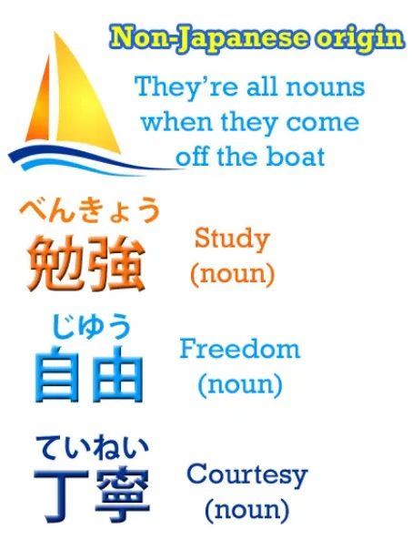
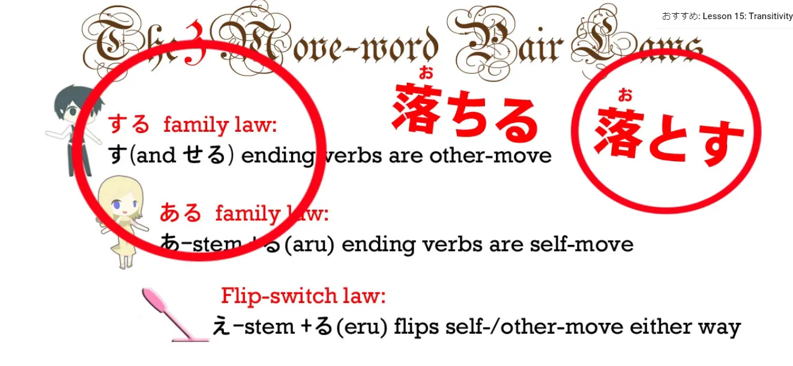
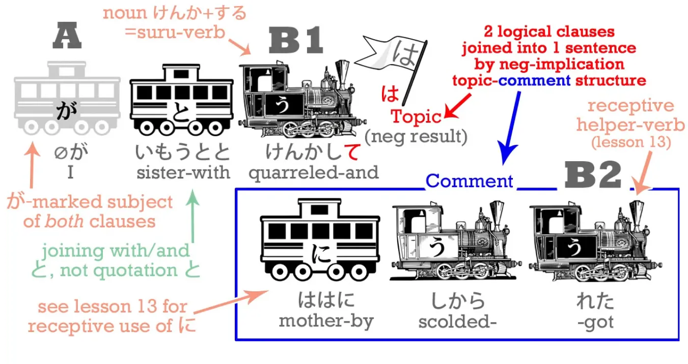
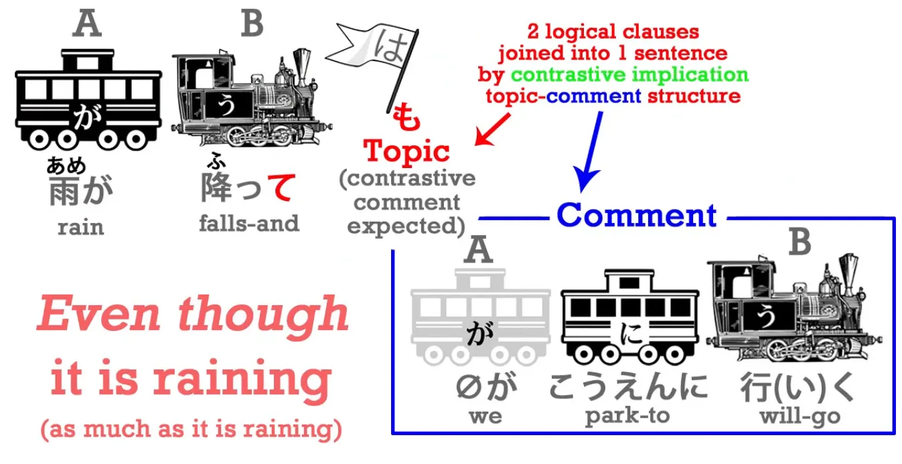

# **22. ては & ても**

[**Pelajaran 22: Te-wa, te-mo - keajaiban topik/komentar! Bagaimana 〜ては dan 〜ても BENAR-BENAR berfungsi**](https://www.youtube.com/watch?v=qV-TZbsH1kI&list=PLg9uYxuZf8x_A-vcqqyOFZu06WlhnypWj&index=34)

こんにちは。

Hari ini, kita akan melompat sedikit ke belakang untuk membedah potongan kecil dari cerita Alice yang kita lewati minggu lalu. Potongan ini akan menjadi wahana emas bagi kita untuk memahami fungsi ajaib dari mesin Wujud-te yang ditambah "は" (`〜ては / Te wa`), Wujud-te yang ditambah "も" (`〜ても / Te mo`), dan beberapa trik krusial lainnya.

Mari kita *rewind* kembali ke momen ketika Alice baru saja mencomot toples selai dari rak dinding sumur.

> `でも, びんは空っぽだった` (Demo, bin wa karappo datta) 
Terjemahan: `Namun, toples tersebut kosong.`

`空 / から` (kara) berarti `kosong`. Jika kamu perhatikan huruf Kanjinya (空), itu adalah kanji yang sama untuk kata `langit` (Sora)—yang menurut saya adalah wujud ruang kosong terbesar di dunia ini. Kata `空 (kara)` yang bermakna 'kosong' ini adalah kata yang sama yang menyusun kata `Karate` (空手), yang berarti seni bela diri dengan "tangan kosong" tanpa senjata. 

**Kata `空っぽ` (karappo) yang ada di kalimat kita adalah versi *upgrade/penguatan* dari `kara`. Kata ini menegaskan bahwa tidak ada apa-apa di dalam toples itu, BENAR-BENAR KOSONG MELOMPONG.** 

**Secara tata bahasa, `空っぽ` berstatus sebagai KATA BENDA.** 
Sebagai *rule of thumb* (aturan umum) yang bisa kamu pegang: Jika kamu menemukan sebuah kosakata asing di bahasa Jepang dan kamu sama sekali tidak tahu ia berjenis kata apa, tebakan paling aman dan paling sering benar adalah bahwa kata itu adalah Kata Benda.

Bahasa Jepang adalah bahasa yang sangat bergantung (berpusat) pada kata benda. Karena nyaris semua kosakata serapan yang masuk dari luar—seperti ribuan kosakata dari bahasa Mandarin (Kanji) maupun bahasa Inggris modern—semuanya masuk ke dalam sistem bahasa Jepang dengan status murni sebagai Kata Benda. 

**Jika orang Jepang butuh memakainya sebagai kata kerja, mereka cukup menempelkan mesin *transitif* `する` (suru) di belakangnya.** 
**Jika mereka butuh memakainya sebagai kata sifat (pemodifikasi), mereka cukup menempelkan `の` (no) atau wujud mutan kopula `-な` (na) di belakangnya.**

**Tetapi pada wujud asalnya, kosakata tersebut adalah kata benda mutlak.** 
Jadi, jika kamu buta soal jenis suatu kata, asumsikan saja ia adalah Kata Benda. `空っぽ` (kosong melompong) adalah kata benda.

`でも, びんは**空っぽ**だった` – `Namun, toples tersebut **kosong melompong**.`

Lalu, Alice berpikir:
> `アリスは空っぽのびんでも下へ落としては悪いと思った.` 
(Arisu wa karappo no bin demo shita e otoshite wa warui to omotta).

Di kalimat panjang inilah kita akan menyaksikan sihir penggunaan tingkat dewa dari Wujud-te.

## Membongkar Demo/Temo (でも / ても)

Mari kita bedah frasa pertamanya:
`アリスは空っぽのびん**でも**` (Arisu wa karappo no bin **demo**)

**Kata `で` (De) di frasa ini sebetulnya murni adalah Wujud-te dari kopula `だ/です` (Da/Desu).** 
Dan partikel `も` (Mo), seperti yang sudah kita pelajari mati-matian, adalah Partikel Penanda Topik (non-logis) yang bersaudara dengan `は`. Tetapi bedanya, `も` adalah partikel yang bersifat "Tambahan / Inklusif" (*Juga / Bahkan*). 

Jadi, frasa `空っぽのびん**でも**` terjalin secara harfiah.

`で` (Wujud-te dari kopula) bermakna: `[Meskipun itu] **adalah** (toples kosong)`. 
Lalu `**でも**` (De + mo) memadat maknanya menjadi: `**MESKIPUN** itu adalah (toples kosong) / **BAHKAN JIKA** itu adalah (toples kosong)`. 

**Ingat, karena fungsi asli partikel `も` adalah "Menambahkan / Melampaui batas (Bahkan / Sebanyak)",** kamu akan sering melihat kalimat seperti: `一万円もかかった` (Ichi man-en mo kakatta) -> `[Itu] memakan biaya **SEBANYAK / SAMPAI-SAMPAI** 10.000 yen!`. 

Jadi penggabungan kopula `でも` bermakna: `**Bahkan/Sebanyak apapun faktanya** ia adalah toples kosong...`. 
*(Dolly sudah membuat [**satu video khusus**](https://www.youtube.com/watch?v=00nKUtmnzvI) untuk membedah tuntas trik partikel `も` ini).*

Dan kamu pasti sadar bahwa kita sebenarnya sangat sering menggunakan rumus `〜ても` (Temo / Demo) ini saat kita meminta izin ke orang lain!
Contoh: `ケーキを食べてもいい?` (Keki o tabetemo ii?) – `Apakah tidak masalah JIKA AKU MEMAKAN kue ini? / Bolehkan aku makan kue ini?` 
Secara harfiah kamu sedang bertanya: `Bahkan JIKA SAYA SAMPAI MELAMPAUI BATAS ('Mo') dengan memakan kue ini, apakah statusnya akan tetap baik-baik saja (Ii)?`

---

Kita masuk ke frasa tengah: `下へ落としては悪いと思った` (Shita e otoshite wa warui to omotta).

`落とす` (Otosu) berarti `menjatuhkan`. Kata ini adalah perwakilan dari "Kata Kerja Gerak Orang Lain" (Transitif). 
Pasangan 'Gerak Diri'-nya adalah `落ちる` (Ochiru) yang berarti `jatuh` (Suatu benda jatuh dengan sendirinya). 
Sedangkan `落とす`, yang dengan gagah berakhiran `-す` (su), mematuhi Aturan Emas Pertama kita untuk Gerak Orang Lain: yang berarti `menjatuhkan` (Kita tidak menjatuhkan tubuh kita sendiri, kita memindahkan/menjatuhkan benda lain).

Lalu ada partikel arah: `下へ` (Shita e). Ingat, partikel penunjuk arah `-へ` (e) ini bersaudara dengan partikel sasaran `に` (ni). **TETAPI, perbedaan filosofisnya adalah: `-へ` LEBIH BERFOKUS PADA 'ARAH PERGERAKAN' daripada titik lokasi sasaran yang pasti.** 

Jadi dalam kasus toples kosong ini, menggunakan `下に落とす` (Menjatuhkan ke sasaran bawah) **adalah pilihan kata yang tidak tepat**. Karena Alice sama sekali tidak mengincar titik sasaran pasti (seperti menjatuhkan ke `テーブルの下` / sasaran bawah meja).

Alice murni cuma membuang/menjatuhkan botol itu ke *arah* dasar sumur. Ia bahkan tidak tahu apa yang ada di ujung kegelapan sana. Karena ia menjatuhkan secara membabi buta ke *arah* bawah, maka kalimat yang dipakai adalah: `下へ落とす` (Shita e otosu). 

Sekarang, coba perhatikan Wujud-Te yang muncul: `下へ落として**は**悪い`. 
Lihat betapa cantiknya bahasa Jepang menyusun simetri. Tadi di awal kita menjumpai wujud-te ditambah `も` (`ても`); dan sekarang kita disuguhkan wujud-te ditambah `は` (`ては`). 

Kita semua sudah khatam bahwa `も` (Mo) dan `は` (Wa) adalah partikel penanda topik yang sifatnya BERKONTOLAK BELAKANG (Musuh bebuyutan). 
**Jika `も` adalah partikel PENAMBAHAN (Inklusif / Melampaui batas / Sebanyak apa pun), maka `は` adalah partikel PENGURANGAN (Eksklusif / Membatasi batas / Sekecil apa pun).** 
**Oleh karena itu, sementara `〜ても` bermakna `sebanyak apa pun itu`, maka `〜ては` bermakna `bahkan sekecil apa pun itu`.**

## Rahasia Larangan "ては" (Te wa)

Nah, perpaduan makna matematis inilah yang melahirkan hukum alam berikutnya:
**Kita cenderung selalu menggunakan `〜ても` di dalam skenario kalimat POSITIF/IZIN** – `Bahkan JIKA SAYA SAMPAI melakukan ini, apakah boleh?` 
**Sebaliknya, kita SELALU menggunakan `〜ては` di dalam skenario NEGATIF atau LARANGAN KERAS** – `JANGAN PERNAH melakukan hal itu (bahkan dalam jumlah yang paling kecil sekalipun)!` 

Jadi di anime, kamu akan sangat sering mendengar teriakan: `〜**ては**だめ` (Te wa dame) – `**Melakukan hal itu adalah** tidak baik / terlarang!` *(Jika hal itu sampai dilakukan, akibatnya buruk).* 

Dan logika yang sama terjadi di kalimat Alice: `落とし**ては**悪い` (Otoshite wa warui) – `**Bahkan tindakan sekecil** menjatuhkannya, itu akan berakibat buruk (warui)`. 

Fokus kalimat ini BUKAN berdebat apakah menjatuhkan toples itu dosa besar, atau memakan kue itu dosa kecil. **Fokus logikanya adalah: Tidak masalah sejauh apa pun ("mo") Alice membiarkan toples kosong itu, TAPI jangan sampai ("wa") ia terbersit niat sekecil apa pun untuk MENJATUHKANNYA!**
`落としては悪い` – Aksi itu mutlak dilarang/berakibat buruk. 

**Di bahasa obrolan kasual sehari-hari, wujud larangan `〜ては` (Te wa) ini selalu dikunyah dan disingkat pelefalannya menjadi `〜ちゃ` (Cha).**
Jadi `笑ってはだめ` (Tertawa sangat dilarang!) berubah menjadi `笑っ**ちゃ**だめ！` (Waraccha dame!) -> Jangan ketawa! / *Bahkan senyum sekecil apa pun sangat dilarang.* 

Pola pembatasan mutlak dari partikel "Wa" inilah yang mengendalikan fungsi ajaib `〜ては` selanjutnya.

## "ては" sebagai Jembatan Antara Dua Klausa

**Kita dapat menggunakan wujud `〜ては` (Te wa) sebagai jembatan yang menyambung dua klausa, dan KEHADIRANNYA OTOMATIS MENYIRATKAN BAHWA HASIL DARI KLAUSA KEDUA ITU BERSIFAT NEGATIF/TIDAK DIINGINKAN.**

Mari kita simulasikan: `雨が降っ**ては**公園に行けない` (Ame ga futte wa kōen ni ikenai) – `Karena hujan turun, kita tidak bisa pergi ke taman.`

Kita sudah tahu dari pelajaran sebelumnya bahwa Wujud-te murni (`て`) bisa menyambung dua kalimat biasa. Jika kamu cuma bilang: `雨が降って、公園に行けない` (Hujan turun, dan kita tidak bisa ke taman). 
**Kalimat Wujud-te murni ini murni cuma menyampaikan sebab-akibat yang datar (Kita nggak bisa ke taman karena hujan). Tapi ia SAMA SEKALI TIDAK menyiarkan "emosi" apakah kamu sedih atau senang dengan batalnya ke taman itu.** 

TETAPI, begitu kamu mengubah sambungannya menjadi: `雨が降っ**ては**公園にいけない`. 
**Partikel `は` langsung MENGINJEKSIKAN nuansa bahwa hasil pembatalan ini SANGAT MENYEBALKAN atau TIDAK DIINGINKAN.** 

Biar kamu mengerti kenapa emosi negatif ini bisa muncul, ingat kembali 'sifat egois/pembatas' mutlak dari partikel `は`. Dalam bahasa Inggris, `は` bisa diartikan sebagai `Just because` (Hanya gara-gara). 

::: info
Mari kita buktikan sifat egois (eksklusif) dari partikel `は` lewat contoh roti:
:::

- Jika kamu bilang murni pakai objek langsung `を`: `パンを食べた` (Pan o tabeta). Artinya datar: `Saya memakan roti`. 
- TETAPI jika kamu mengganti partikel objek itu memakai bendera topik `は`: `パンは食べた` (Pan wa tabeta). **Kalimat ini langsung memancarkan nuansa sombong/egois: `Kalau ROTI SIH, aku makan (Tapi makanan yang lain nggak aku sentuh!)`** 

::: info
Secara harfiah: Berbicara soal roti (sebagai topik pembicaraan eksklusif), SAYA memakannya.
:::

Skenario negatif: 
- `パンを食べなかった` -> `Saya tidak makan roti`. 
- `パンは食べなかった` -> `Kalau ROTI SIH aku nggak makan (Tapi makanan yang lain aku sikat habis!)`

Kembali ke kalimat hujan:
`雨が降っ**ては**公園に行けない`. Kalimat aslinya yang datar mungkin murni berarti `Hanya gara-gara hujan, kita jadi tidak bisa ke taman.` Tetapi dengan masuknya `ては`, nuansanya langsung memburuk menjadi: `**Sialan (Sayangnya), gara-gara** hujan, kita jadi batal ke taman.`

Contoh lain: `*(zero-ga)* 妹とけんかし**ては**母にしかられた` (Imouto to kenkashite wa, haha ni shikarareta). `**Sialnya, gara-gara** (saya) bertengkar dengan adik perempuan, saya KENA MARAH (shikarareta) oleh ibu...`

Sekali lagi, **partikel `は` yang menempel di ujung Wujud-te bertugas sebagai alarm bahwa hasil yang mengikutinya adalah sebuah petaka/nasib buruk.** Ini semua mengakar pada filosofi 'Eksklusif/Pembatas' bawaan si partikel `は`.

## "ても" / "でも" sebagai Jembatan Antara Dua Klausa

**Berkebalikan 180 derajat, ketika mesin `〜ても` (Te mo) digunakan sebagai penyambung dua kalimat,** **ia SAMA SEKALI TIDAK MENYIRATKAN emosi negatif atau positif.** **Ia murni bertugas menyatakan bahwa hasil dari klausa kedua BERSEBERANGAN / DI LUAR DUGAAN klausa pertama.** 

Jadi jika kita merakit: `雨が降っ**ても**公園に行く` (Ame ga futtemo kōen ni iku).
Arti harfiahnya: `**Bahkan jika** / **Meskipun** sedang turun hujan, kita TETAP pergi ke taman.`

**Dan rahasia puncaknya: fungsi perlawanan dari `〜ても` (Temo) inilah yang menjadi asal-usul genetik dari konjungsi bahasa Jepang `でも` (Demo)!** Yang di bahasa Indonesia biasa diterjemahkan dengan tepat sebagai `TETAPI`.

**Kata sambung `でも` (Demo) sejatinya tercipta dengan cara mengurung apapun kalimat yang ada di depannya ke dalam wujud `で` (Wujud-te dari kopula `だ` / Adalah).** 
**Lalu, partikel `も` ditempelkan di belakangnya untuk menyuntikkan efek perlawanan `tetapi / meskipun / sebanyak apapun hal itu terjadi`.** 

Jadi secara tata bahasa, kamu sangat sah untuk mengucapkan: `雨が降る**でも**公園に行く` (Ame ga furu demo kōen ni iku). Maknanya identik 100% dengan `雨が降っても公園に行く`. 
Beda teknisnya hanyalah: Pada struktur `降っても`, partikel `ても` cuma memodifikasi/menempel pada kata kerja `降る` (turun). Sedangkan pada struktur `降るでも`, kata sambung `でも` menelan MENTAH-MENTAH seluruh kalimat di depannya. Dalam percakapan nyata, efek maknanya benar-benar sama persis.

---

Mari kita rangkai kembali pecahan cerita Alice dan melihat betapa megahnya arsitektur kalimat ini jika dipandang utuh.

Kalimat ini kelihatannya memang *njelimet*, tapi sekarang semuanya jadi masuk akal, bukan? Dan jika kamu sukses membedah anatomi kalimat level ini, kamu telah mengamankan Kunci Master untuk membongkar kalimat level-Dewa (*advanced*) yang pasti akan menyiksamu di masa depan. 

Kunci rahasia bedah kalimat: **Inti utama kalimat bahasa Jepang itu SELALU BERSEMBUNYI di Kepala dan Ekor kalimat. Seluruh organ di bagian perut kalimat MURNI hanyalah ornamen yang mendeskripsikan 'Apa yang dipikirkan Alice'.** 

Jadi tulang punggung (inti) mutlak kalimat ini hanyalah: `**アリスは (zero-ga) 思った**` (Adapun Alice, [ia] memikirkan sesuatu).

Sedangkan 'organ perut' di dalam kalimat tersebut ternyata tersusun dari DUA buah sistem Topik-Komentar yang bersarang. 
- Topik Pertama: `Meskipun benda itu adalah toples kosong` (Topik).
`(zero-ga)` 空っぽのびん**でも**
- Komentar atas topik tersebut (Yang lucunya ternyata merupakan struktur Topik-Komentar baru di dalam dirinya sendiri!): `Mengenai tindakan menjatuhkannya (Topik), hal itu buruk (Komentar).`
下へ落として**は** わるい

---

**Dan pamungkasnya: Seluruh gumpalan struktur Topik-Komentar ganda tersebut DIBUNGKUS/DIKURUNG RAPAT oleh partikel Kutipan `と` (To). Ingat teori Pelajaran 18, `と` menyulap seluruh gumpalan tersebut menjadi sebuah wujud kata benda utuh.** **Barulah bungkusan itu diserahkan kepada Alice sebagai 'hal yang sedang ia pikirkan' (`思った` / omotta).** 

Tentu saja, di dunia nyata saat kamu membaca manga atau menonton dorama, otakmu mustahil punya waktu untuk menerjemahkan `"As for (Mengenai topik ini)"` atau `"Speaking of"` setiap kali matamu menangkap partikel `は` (Wa). Kenapa? Karena kata `"Mengenai"` di bahasa Indonesia/Inggris itu terlalu berat dan kaku, sangat berlawanan dengan partikel "は" dan "も" Jepang yang melayang lincah dan luwes. 

Jadi, apa solusi akhirnya? **Sekali lagi, seperti hukum emas yang selalu saya ajarkan: JANGAN PERNAH MENERJEMAHKANNYA KE DALAM BAHASA IBU-MU, KECUALI jika kamu benar-benar terdesak untuk membedah fungsinya.** **Kita harus menelan bulat-bulat tata bahasa Jepang sebagaimana mereka bekerja di alam liarnya.** Dan itulah satu-satunya cara menjadi *Master* bahasa Jepang, bukan sekadar menjadi mesin penerjemah kaku.
