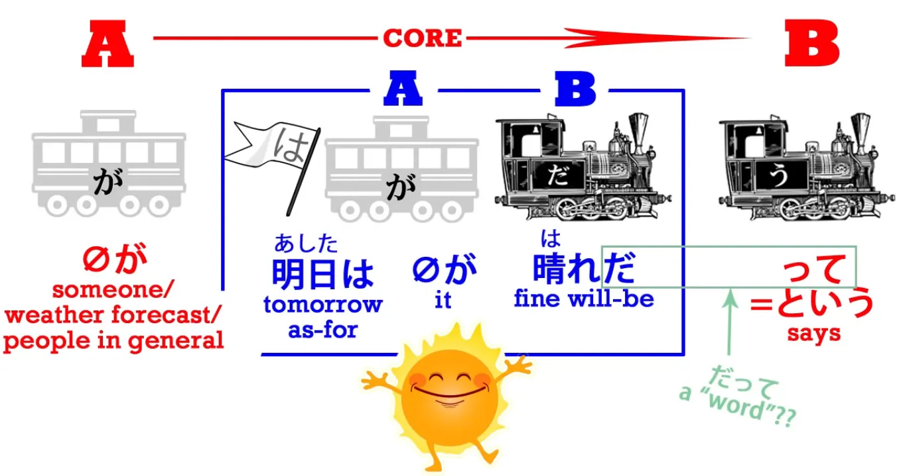
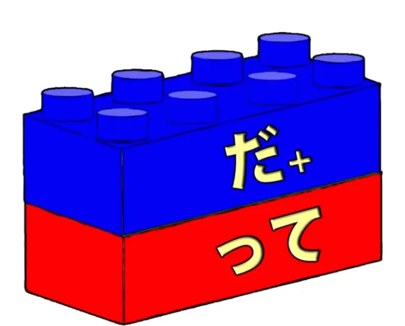
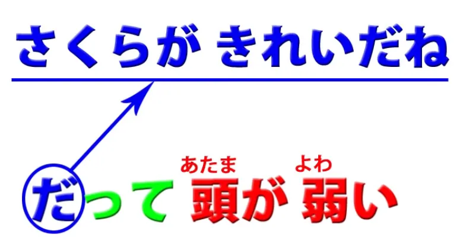
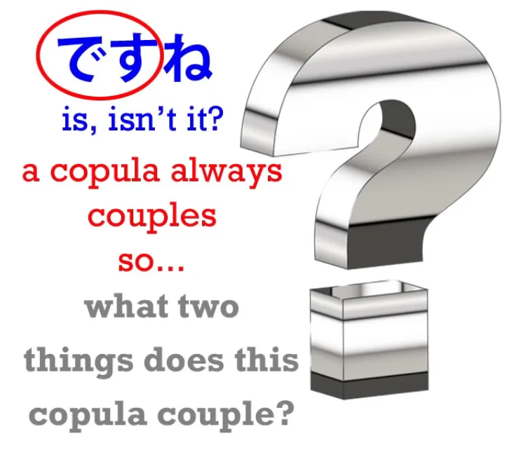
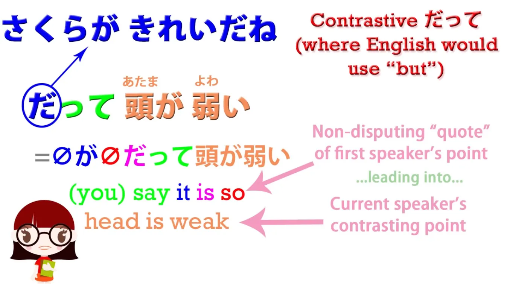

# **23. だって + だから &amp; それから**

[**Pelajaran 23: だって Datte: arti sebenarnya (petunjuk: ini bukan kata) + dakara, sore kara**](https://www.youtube.com/watch?v=kO89HzRQygQ&amp;list;=PLg9uYxuZf8x_A-vcqqyOFZu06WlhnypWj&amp;index;=25&amp;ab;_channel=OrganicJapanesewithCureDolly)

こんにちは。

Hari ini kita akan membahas <code>だって</code> dan beberapa masalah yang muncul terkait penggunaan <code>だ</code> dan <code>です</code>. Salah satu komentator saya mengatakan bahwa dia bingung dengan <code>word</code> <code>だって</code> dan saya tidak heran, karena jika Anda melihat kamus Jepang-Inggris, mereka mengatakan bahwa <code>だって</code> berarti <code>because</code> dan <code>but</code> dan <code>even</code> dan juga <code>somebody said</code>, yang merupakan kumpulan arti yang cukup membingungkan untuk satu kata yang disebut-sebut. **Dan saya katakan <code>so-called</code> kata karena <code>だって</code> bahkan bukan kata yang sebenarnya.** Dan hal yang sepertinya tidak pernah dijelaskan di kamus atau di tempat lain adalah apa sebenarnya kata itu, apa arti sebenarnya, dan oleh karena itu mengapa kata itu memiliki rentang makna seperti itu. Jadi, mari kita mulai dengan makna paling dasar, yaitu yang terakhir dalam daftar, <code>somebody said</code>.

## &quot;だって&quot; sebenarnya <code>somebody said</code>

**<code>だって</code> sebenarnya hanya terdiri dari kata penghubung <code>だ</code> ditambah &quot;って&quot;,** **yang bukan bentuk &quot;て&quot; dari apa pun, melainkan &quot;って&quot; yang merupakan kontraksi**, seperti yang telah kita bahas sebelumnya[[18]](./18- って - は -mysteries-explained- おうとする - とする - として - という - っていう.md), **dari partikel kutipan - と ditambah <code>いう</code>.**

---

**Jadi って berarti <code>-という</code>, dengan kata lain, <code>says</code> sesuatu yang spesifik.** Partikel **- と mengemas sesuatu menjadi sebuah kutipan dan <code>いう</code> menunjukkan bahwa seseorang mengatakannya.** Jadi sesederhana itu.
<code> *(zeroが)* 明日は晴れ**だって**</code> hanyalah <code> *(zeroが)* 明日が晴れ**...**</code>

<code>晴れ</code> berarti <code>sunny</code> atau <code>clear skies</code> – dan seperti kebanyakan kata yang jenisnya diragukan, biasanya kata tersebut ternyata adalah kata benda, **<code>晴れ</code> adalah kata benda.** Jadi, <code>明日は晴れだ</code> hanya berarti <code>Tomorrow will be sunny</code>. Dan ketika kita menambahkan &quot;って&quot;, kita sedang mengatakan, <code>**It&#x27;s said that** tomorrow will be fine</code>. **Kita mungkin mengatakan bahwa seseorang secara khusus mengatakannya atau kita mungkin hanya mengatakan <code>it&#x27;s said</code> secara umum** – <code>I hear tomorrow will be fine</code>, kita mungkin mengatakan dalam bahasa Inggris. <code>They say tomorrow will be fine.</code> Jadi itu sangat sederhana, dan **itulah <code>だって</code> itu:** **itu <code>だ</code> ditambah って, <code>-という</code> kontraksi.**

Dan itulah yang terjadi di semua kasus lainnya juga, jadi mari kita lihat bagaimana cara kerjanya. Bagaimana hal itu bisa berarti <code>but</code>?

## だって sebagai <code>but</code>

Nah, pertama-tama mari kita pahami bahwa **ketika digunakan sendiri** – dan **artinya <code>but</code> ketika digunakan sendiri, bukan sebagai akhir kalimat** seperti pada contoh yang baru saja kita lihat – **kata ini memiliki nuansa yang sedikit kekanak-kanakan dan biasanya agak negatif atau argumentatif.** Jadi, jika seseorang berkata, <code>さくらがきれいだね</code> – <code>Sakura&#x27;s pretty, isn&#x27;t it?</code> Dan kamu berkata <code>**だって**頭が弱い</code>. Sekarang <code>頭が弱い</code> secara harfiah berarti <code>head is weak</code> – <code>She is not very smart</code>. Jadi, itu seperti mengatakan, <code>**But** she&#x27;s not very smart</code>. **Tapi yang sebenarnya kamu lakukan di sini adalah mengambil pernyataan yang diucapkan orang sebelumnya dan** **menambahkan kata hubung <code>だ</code> ke dalamnya.**

Dan untuk memahami hal itu, mari kita lihat sejenak hal lain.

### ですね

Seringkali, ketika kita setuju dengan sesuatu yang dikatakan seseorang, kita mungkin berkata <code>ですね</code>. Dan secara harfiah itu hanya berarti <code>is, isn&#x27;t it?</code> Dan bagaimana bisa artinya begitu, karena sebenarnya <code>だ</code> atau <code>です</code> **sendiri tidak berarti apa-apa.** Kata itu harus menghubungkan dua hal lain, dan keduanya tidak disebutkan di sini.

**Tapi apa <code>です</code> yang secara implisit terkait adalah hal yang baru saja dikatakan orang tersebut.** Dan **apa yang digabungkannya adalah**, secara implisit, **sesuatu seperti <code>本当</code> atau <code>そう</code>** – <code>**そう**ですね</code>.

Jadi, sebenarnya kita mengatakan <code>**That&#x27;s true**, isn&#x27;t it?</code> atau <code>**That&#x27;s the case**, isn&#x27;t it?</code> atau <code>**That&#x27;s how it is**, isn&#x27;t it?</code>

## それから &amp; だから / ですから

Kita juga melakukan ini saat mengatakan <code>**だから**</code> atau <code>**ですから**</code>, yang sebenarnya berarti <code>**because**</code>.

Sekarang, kita tahu bahwa <code>から</code> berarti <code>because</code>; artinya secara harfiah <code>from</code> dan oleh karena itu juga berarti <code>because</code>. **Dari A, B. Dari Fakta A kita dapat menyimpulkan Fakta B. Dari Fakta A, Fakta B muncul.** **Jadi, <code>から</code> – <code>because</code>.** Terkadang kita mungkin tergoda untuk mengatakan <code>それから</code>, yang merupakan terjemahan harfiah dari bahasa Inggris <code>because of that</code>. **Namun pada kenyataannya <code>それから</code> tidak digunakan untuk berarti <code>because of that</code>.** <code>それ</code> berarti <code>that</code> dan <code>から</code> dapat berarti &#x27;karena&#x27;, **tetapi <code>それから</code> biasanya berarti <code>after that</code>** – <code>から</code> dalam arti yang lebih harfiah, **<code>から</code> berarti <code>from</code>, dan dalam hal ini <code>from</code> dalam hal waktu daripada ruang.**
<code>From that forward / from that forward in time / after that</code>; <code>それから</code> – <code>after that</code>.

---

Untuk mengatakan <code>**because of that**</code>, kita mengatakan <code>**ですから**</code> atau <code>**だから**</code>, dan ini sebenarnya singkatan dari <code>**それはそうですから**</code> atau <code>**それは本当ですから**</code>.👇 Kita mengatakan <code>**because that is the case**</code>, dan jika dipikir-pikir, ini lebih logis daripada apa yang kita katakan dalam bahasa Inggris. Kita mengatakan <code>because that is the case</code>. <code>Because of that</code> benar-benar berarti secara harfiah dalam bahasa Inggris <code>because that is the case</code> tapi kita memendekkannya menjadi <code>because of that</code>, 👇 dan **dalam bahasa Jepang kami hanya menyederhanakannya menjadi <code>ですから</code>.**

## Kembali ke &quot;だって&quot; sebagai <code>but</code>

Sekarang, setelah kita memahami ini, kita bisa memahami <code>だって</code> dalam arti makna <code>but</code>.

**<code>だ</code> merujuk kembali ke apa pun yang dikatakan orang sebelumnya, dan って hanya menyatakan bahwa mereka mengatakannya.** Jadi, jika seseorang berkata, <code>さくらがきれいだね</code> – &quot;Sakura cantik, bukan? Bukankah begitu?&quot; Dan kamu menjawab, <code>**だって**頭が弱い</code>. Sekarang, **yang <code>but</code> di sini adalah kamu yang mengatakan <code>You said that...</code>.** **Dan <code>だって</code> adalah cara yang terdengar agak kekanak-kanakan dan seperti sedang berdebat untuk mengatakannya, jadi implikasinya adalah bahwa apa yang akan datang selanjutnya akan menyangkal apa yang telah dikatakan.**

---

Dan ini berfungsi dengan cara yang sama seperti dalam bahasa Inggris <code>but</code>. Jika kamu memikirkannya, **<code>but</code> tidak mengatakan bahwa apa yang ada sebelumnya itu tidak benar.** **Sebenarnya, ini menerima bahwa apa yang ada sebelumnya itu benar, tetapi kemudian menambahkan beberapa informasi yang bertentangan dengan kesan yang diberikan oleh pernyataan tersebut.**

---

Jadi <code>さくらがきれいだね</code> – <code>Sakura is pretty</code> – <code>**だって**...</code>– <code>**You said that and I&#x27;m not disputing that that is the case, BUT** – she&#x27;s not very smart</code>.

## &quot;だって&quot; sebagai <code>because</code>

Jadi, bagaimana hal itu bisa berarti <code>because</code>, yang dalam beberapa hal tampaknya hampir bertentangan dengan <code>but</code>, hampir berlawanan dalam arti? Nah, perhatikan bahwa **satu hal yang <code>but</code> dan <code>because</code> memiliki kesamaan adalah bahwa keduanya menerima pernyataan pertama.** <code>But</code> kemudian mengatakan sesuatu yang bertolak belakang dengan pernyataan tersebut, namun tetap menerimanya. **<code>Because</code> mengatakan sesuatu yang kemudian menjelaskan pernyataan tersebut.** Dan **ini bisa menjadi penjelasan yang selaras yang sekadar memberi kita informasi lebih lanjut tentangnya, tetapi juga bisa menjadi penjelasan yang bertentangan.** Jadi, misalnya, jika seseorang berkata, <code>You haven&#x27;t done much of your homework</code> dan Anda menjawab, <code>Because you keep talking to me!</code> **Hal ini dapat diungkapkan <code>だって</code> dalam bahasa Jepang.** Sekali lagi, yang sebenarnya dimaksud adalah &quot;Kamu mengatakan itu dan aku tidak membantahnya, **tetapi inilah sesuatu** **yang dapat kita tambahkan untuk melemahkan narasi yang kamu coba sampaikan.&quot;**

---

Jadi, kamu lihat, ini tidak secara harfiah berarti <code>but</code> atau <code>because</code>. **Artinya adalah,** **<code>I accept your statement and now I&#x27;m going to add something a bit argumentative</code>.** Dalam bahasa Inggris, ini bisa diterjemahkan sebagai <code>but</code> atau <code>because</code> tergantung pada situasinya.

## &quot;だって&quot; sebagai <code>even</code>

Jadi, bagaimana bisa kata ini memiliki arti <code>even</code>? Baiklah, mari kita pahami bahwa ini adalah penggunaan yang sedikit berbeda. **Ketika kita menggunakannya untuk berarti <code>even</code>, kita tidak menggunakan <code>だ</code> seperti saat kita menggunakannya ketika mengatakan <code>だから</code> atau <code>だって</code> dalam arti yang baru saja kita bahas.** Dengan kata lain, **kita tidak sekadar menggunakannya untuk merujuk kembali ke pernyataan sebelumnya.**

---

**Kita biasanya mengaitkannya dengan sesuatu yang spesifik dalam pernyataan yang sedang kita sampaikan.** Jadi, jika Anda berkata, <code>さくらはできる</code> – <code>Sakura can do that</code> dan saya mengatakan <code>**私だって**できる</code>, yang umumnya diterjemahkan sebagai <code>**Even I** can do that</code>, yang sebenarnya kita maksudkan adalah <code>**Say it&#x27;s me**</code>, yang berarti baik dalam bahasa Jepang maupun Inggris <code>**Take the hypothesis that it&#x27;s me**</code> atau <code>**Take the case of me in this circumstance**</code> dan yang kita katakan <code>私だってできる</code> <code>Say it&#x27;s me, I can do that</code>.

Sekarang, ini memiliki implikasi yang berbeda dari <code>私**も**できる</code>, **yang hanya berarti netral** <code>I can do that **too**</code>. <code>私**だって**</code>, **karena sangat kasual dan karena terkait dengan implikasi yang sedikit** **negatif atau kontradiktif**, artinya <code>**Even** I can do that</code>.

---

**Dan tidak harus negatif dalam arti bertentangan dengan apa pun.** Di luar konteks Sakura, kita mungkin hanya akan mengatakan, <code>私だってホットケーキが**作れる**</code> – <code>Even I can make hotcakes</code>.

::: info
Dolly- 先生 salah mengucapkan &quot;作られる&quot;, tetapi sebagai bentuk potensial Godan, seharusnya &quot;作れる&quot;. &quot;作られる&quot; adalah bentuk pasif dari &quot;作る&quot; - kita menghilangkan &quot;う&quot;, menambahkan akar kata &quot;あ&quot; + &quot;れる&quot;. Bentuk potensialnya adalah &quot;え&quot; + &quot;る&quot;.
:::

Dan dalam hal ini, **kami tidak bermaksud negatif,** **tetapi bahwa <code>私だって</code> tetap memiliki konotasi <code>even me</code>.** Hal itu masih memiliki nada yang sedikit merendahkan atau negatif, karena yang Anda katakan di sini <code>**Even someone like me, even me, who can&#x27;t usually make very much**, can make hotcakes</code>.

Jadi saya harap ini membuatnya <code>だって</code> lebih jelas dan juga cara-cara di mana <code>だ/です</code> dapat digunakan untuk menerima dan menegaskan pernyataan sebelumnya yang dibuat oleh diri sendiri atau orang lain serta menambahkan sesuatu padanya.
