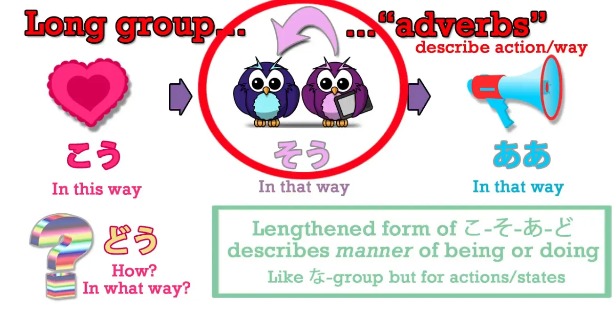
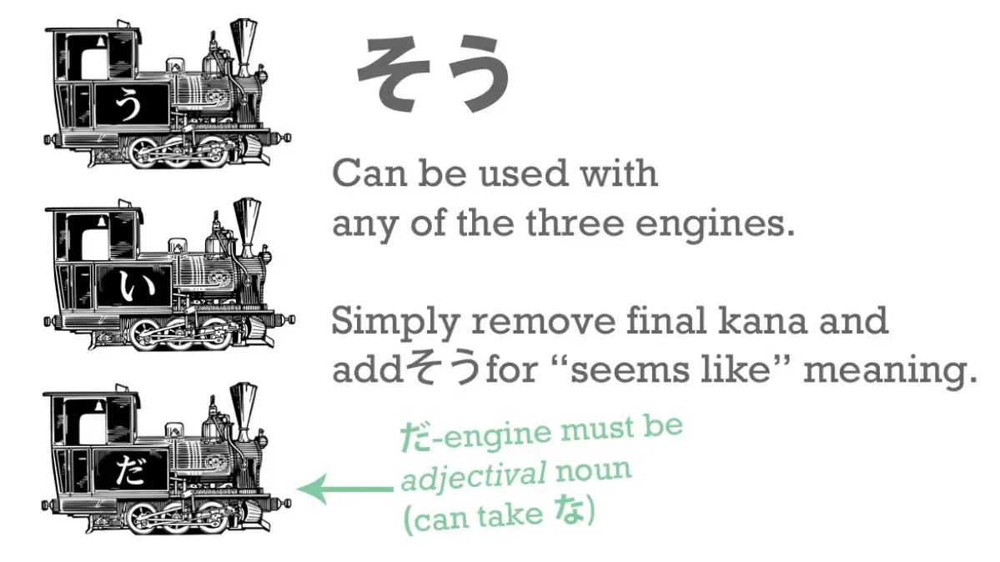
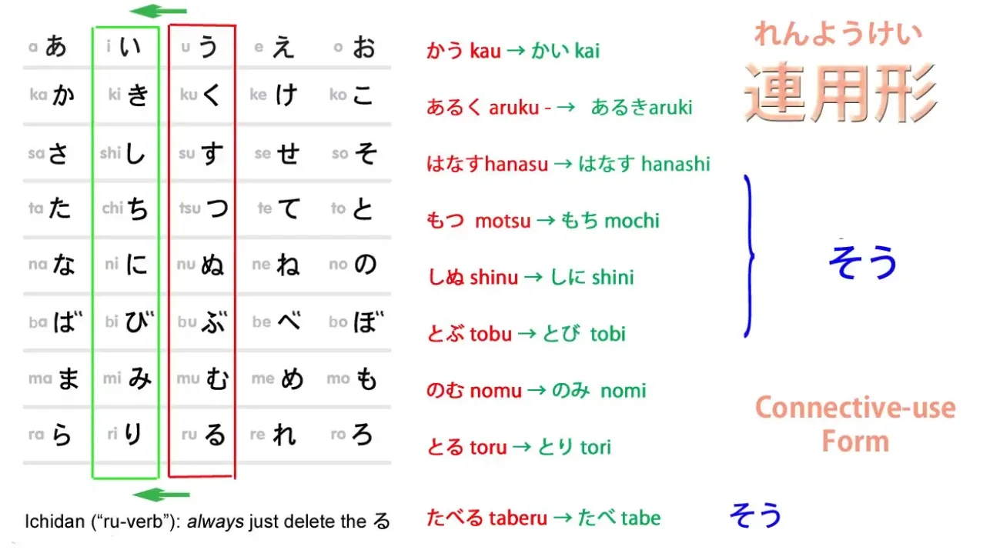
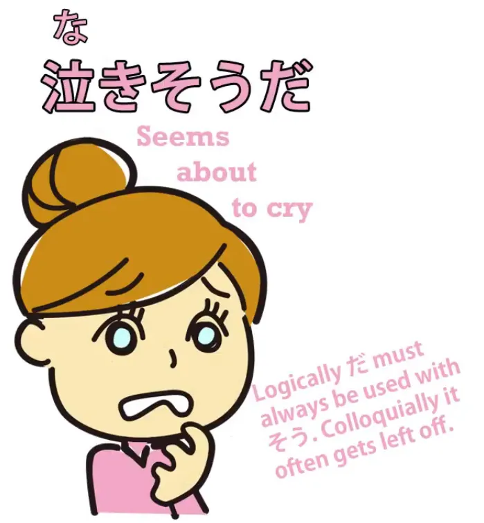
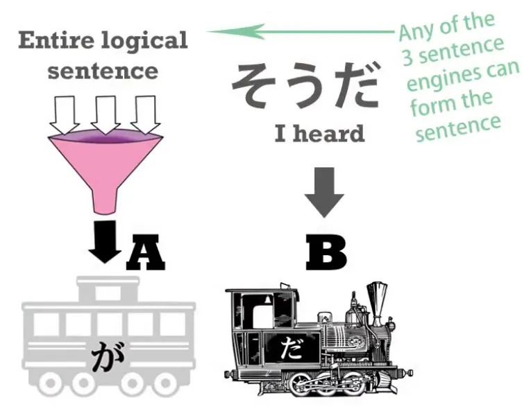
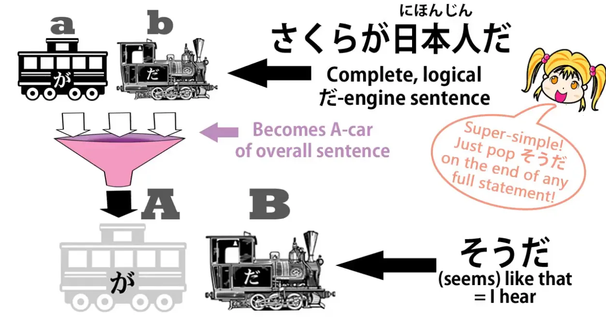

# **24. Kabar angin &amp; tebakan - そう・そうだ・そうです**

[**Pelajaran 24: Kabar angin dan tebakan! 〜sou da, 〜sou desu - bagaimana sebenarnya cara kerjanya.**](https://www.youtube.com/watch?v=uSJukXcyccw&amp;list;=PLg9uYxuZf8x_A-vcqqyOFZu06WlhnypWj&amp;index;=26&amp;ab;_channel=OrganicJapanesewithCureDolly)

こんにちは。

Hari ini kita akan membahas kata benda pembantu <code>そう</code>, yang bisa berarti kesamaan atau kabar angin, **baik bahwa sesuatu tampak seperti sesuatu** atau bahwa kita **menyatakan bukan pandangan atau pendapat kita sendiri, melainkan sesuatu yang kita dengar.** Membedakan keduanya bisa terasa sulit, terutama ketika buku teks memberikan daftar hubungan dengan kata benda dan kata kerja serta berbagai hal lainnya. Hal ini jauh lebih sederhana jika Anda memahami prinsip dasarnya, apa yang sebenarnya terjadi <code>そう</code>. Jadi, Anda tidak perlu menghafal banyak hal yang berbeda. Jadi, pertama-tama, apa itu <code>そう</code>? **Itu adalah hal yang sama <code>そう</code> yang baru-baru ini kita pelajari yang muncul dalam <code>こう-そう-ああ-どう</code>.**[[20]](./20-directionals- それ - その - そんな - そう -etc.md)

**Jadi <code>そう</code> berarti <code>like that</code>**, yang tentu saja menjadikannya kandidat yang sangat baik untuk **mendeskripsikan sesuatu yang tampak seperti sesuatu.**

## そう sebagai <code>seeming like something</code>**Ketika digunakan dengan cara itu, kita menggunakannya dengan menempelkannya ke salah satu dari ketiga engine tersebut.**

Dan ingat, seperti yang telah kita pelajari sebelumnya, bahwa masing-masing dari ketiga engine tersebut dapat dipindahkan ke belakang kata lain untuk mengubahnya menjadi kata sifat.[[6]](./6-adjectives.md)

**Sekarang, setelah -そう

ditambahkan ke sebuah engine** **engine tersebut menjadi kata benda sifat baru.** Bagaimana cara menempelkannya? Kita melakukan hal yang sama dalam setiap kasus. **Kita mengambil kana terakhir dari engine.** Itulah kana yang membuatnya menjadi apa adanya, bagian aktifnya.

---

**Jadi kita mengambil <code>だ</code> dari kata dasar -だ - engine - <code>だ</code> atau <code>な</code> dari だ / な -engine.** **Kita mengambil <code>い</code> dari kata い -engine.** **Dan dari kata kerja engine, kita ambil kana baris terakhir う.** **Dan kita cukup menambahkan - そう ke keduanya**, jadi ini adalah hubungan yang sangat sederhana.

### Dengan kata benda sifat

Dan **hal penting yang perlu diingat di sini adalah dalam kasus kata benda** **kita tidak bisa melakukannya dengan kata benda biasa yang reguler.** **Kita hanya bisa melakukannya dengan kata benda sifat.**

---

Dengan kata lain, **jika kata benda sifat sudah merupakan kata benda sifat sejak awal,** **kita dapat mengubahnya menjadi kata benda sifat yang berbeda dengan -そう.** **Jika sejak awal bukan kata benda sifat, maka tidak dapat diubah menjadi kata benda sifat.** Jadi, jika kita mengambil kata benda sifat seperti <code>元気</code> (<code>lively</code> atau <code>healthy</code>) dan <code>静か</code> (yang merupakan <code>quiet</code>) - jika kita mengatakan <code>静かだ</code> yang kita maksud <code>is quiet</code> - jika kita mengatakan <code>元気だ</code> yang kita maksud <code>is lively or healthy</code>. Jika kita mengatakan <code>元気**な**学生</code>, kita bermaksud <code>a lively or healthy-***is*** student</code>. Sekarang **jika kami** melepas <code>だ</code> atau <code>な</code> dan **memakai - そう** - dan kami mengatakan <code>元気**そうな**学生</code>, kita berarti <code>a lively **looking**-***is*** student/ a lively **seeming**-***is*** student</code>. Demikian pula, jika kita mengatakan <code>静かな女の子</code>, kita mengatakan <code>a quiet-***is*** girl</code>. **Jika kita** melepas itu - な atau だ dan **memakai - そう** dan mengatakan <code>静か**そうな**女の子</code>, kita mengatakan <code>a quiet-**seeming**-***is*** girl/ a quiet-**looking**-***is*** girl</code>. Jadi itu sebenarnya sangat sederhana, bukan?

::: info
Seperti yang ditunjukkan di atas, kita melepas だ / な dari kata benda sifat OG, tetapi ketika kita menyambungkan - そう setelahnya, kita tetap menggunakan だ / な, namun kali ini berasal dari bagian そう. Hal ini mungkin terdengar sedikit membingungkan, mengingat contoh yang diberikan Dolly masih mengandung だ / な.
:::

*Jadi, untuk berjaga-jaga, agar tidak terjadi kebingungan… Karena tampaknya [**そう adalah kata benda yang berfungsi sebagai kata sifat**](https://jisho.org/word/%E3%81%9D%E3%81%86) itu sendiri, sehingga だ / な kemungkinan besar melekat pada そう. Di sini, 静か adalah kata benda adjektival yang dihubungkan dengan そう, kata benda adjektival lain, yang tampaknya berfungsi sebagai sufiks yang dihubungkan dengan な untuk menghubungkannya dengan 女. Jadi 静かそうな adalah satu kesatuan. Hal ini sejalan dengan komentar oranye Dolly di bawah ini tentang penggunaan kopula dengan そう.*

*Ini hanyalah pemahaman saya yang terbatas, jadi anggap saja sebagai referensi. Hubungi saya jika saya salah.*

### Dengan kata sifat

**Untuk kata sifat yang berakhiran <code>い</code>, kita cukup menghilangkan -い dan menggantinya dengan -そう.**

::: info
Perhatikan baik-baik komentar berwarna oranye di atas pada gambar yang menunjukkan そう + だ. 
:::

Jadi, jika kita ambil <code>面白い</code> (<code>interesting-*is*</code> atau <code>amusing-*is*</code>), <code>おいしい</code> (<code>delicious-*is*</code>), **kita cukup menghapus - い dan menambahkan - そう.** Jadi, <code>面白い</code> berarti <code>interesting-***is***</code> atau <code>amusing-***is***</code>, <code>面白**そう**</code> berarti <code>**seems** interesting / **seems** amusing</code>. <code>おいしい</code> berarti <code>delicious / tasty-*is*</code>, <code>おいし**そう**</code> berarti itu <code>**looks** delicious</code>, itu <code>**looks** tasty</code>. Dan ini adalah hal penting yang perlu diingat karena, seperti yang telah kami sebutkan sebelumnya, **bahasa Jepang jauh lebih ketat daripada bahasa Inggris dalam membatasi kita untuk hanya mengatakan** **hal-hal yang benar-benar dapat kita ketahui sendiri.**

---

**Jadi, kecuali Anda sudah mencicipi sesuatu, Anda tidak boleh mengatakan bahwa itu <code>おいしい</code>.** **Kecuali Anda telah melakukan sesuatu, Anda tidak bisa mengatakan bahwa hal itu <code>面白い</code> - menarik atau lucu.** Secara logis, mungkin seharusnya begitu dalam bahasa Inggris, tetapi bahasa Jepang jauh lebih ketat dalam hal ini. Jadi, penting untuk mengetahui hal-hal seperti <code>面白**そう**</code>, <code>おいし**そう**</code> **apakah kita benar-benar sudah mencicipi makanan tersebut, melakukan aktivitas tersebut, atau apa pun itu.**

### Dengan kata kerja

Sekarang, **dengan kata kerja, kita memotong baris kana &quot;う&quot;.** Jelas, seperti biasa, dalam kasus kata kerja ichidan, itulah yang kita lakukan. Dan **untuk kata kerja godan, kita menggunakan akar kata い.**

Dan akar kata い adalah apa yang mungkin Anda sebut sebagai akar murni dari sebuah kata kerja. Dalam bahasa Jepang, ini disebut **<code>れんようけい/連用形</code>, yang berarti <code>connective-use form</code>.** Dan itu mungkin terdengar aneh karena kita tahu bahwa keempat akar kata tersebut sebenarnya menghubungkan hal-hal, tetapi sementara tiga lainnya memiliki penggunaan khusus, ** <code>れんようけい/連用形</code>, akar kata い, selain kegunaannya yang spesifik,** **dapat digunakan untuk menghubungkan hampir segala hal.** **Ia dapat menghubungkan kata kerja dengan kata benda untuk membentuk kata benda baru;** **ia dapat menghubungkan kata kerja dengan kata kerja untuk membentuk kata kerja baru; dan seterusnya.**

---

Jadi, **kita menghubungkan -そう ke <code>連用形</code>, akar kata -い**, akar penghubung serbaguna untuk kata kerja. Apa artinya? Nah, **secara umum, artinya sesuatu tampaknya akan segera terjadi.**

::: info
Sekali lagi, peringatan bahwa だ digunakan setelah そう.
:::

Jadi, <code>雨が降り**そうだ**</code> berarti <code>it **looks as if** it&#x27;s about to rain</code>. <code>子どもが泣き**そう*(だ)***</code> berarti <code>The child **looks as if** she&#x27;s about to cry / **seems as if** she&#x27;s about to cry.</code> Dan jika Anda perhatikan, hal ini cukup mirip dengan apa yang mungkin kita katakan dalam bahasa Inggris: <code>It **looks like** rain / it **seems as if** it&#x27;s about to rain.</code> Jadi penggunaan-penggunaan ini sebenarnya cukup sederhana.

## &quot;そう&quot; sebagai kabar angin

Lalu apa yang kita lakukan saat menggunakan <code>そう</code> untuk berarti kabar angin, untuk berarti <code>I heard something - I&#x27;m not reporting my own observation or feeling, I&#x27;m reporting what I got at second-hand from somebody else</code>? Beberapa orang mungkin mengatakan bahwa ini juga merupakan sufiks dan kita harus mengikuti aturan yang berbeda untuk menggunakannya, **tetapi kenyataannya itu bukanlah sufiks.**

---

**Suffiks -そう yang baru saja kita bahas adalah sebuah sufiks.** **Kita menggabungkannya dengan kata lain untuk membentuk kata baru.** Apa pun kata asalnya, **begitu -そう ditambahkan, kata tersebut menjadi kata benda yang berfungsi sebagai kata sifat.**

::: info
Sepertinya mengarah ke gagasan saya sebelumnya di atas…
:::

*---*

**Ini bukanlah yang terjadi ketika kita berbicara tentang kabar angin.** Ketika kita berbicara tentang kabar angin, kita menggunakan <code>**そうだ**</code> atau <code>**そうです**</code> **setelah kalimat yang utuh dan lengkap.**

**Jadi kalimat yang utuh menjadi A-car dari kalimat** dan ** <code>そうだ</code> menjadi engine B.** Dan **isi kalimat kini menjadi subordinat.** Jadi, mari kita ambil contoh:

<code>さくらが日本人だ**そうだ**</code>. Yang kita katakan di sini adalah <code>**I&#x27;ve heard that** Sakura is a Japanese person</code>. Jadi, **<code>Sakura is a Japanese person</code> semua itu digabungkan menjadi Mobil A, subjek kalimat, dan kemudian apa yang kita katakan tentangnya adalah bahwa kita telah mendengarnya.** Mengapa kita menggunakan <code>そうだ/そうです</code> untuk berarti <code>I&#x27;ve heard</code>?

Nah, jika dipikirkan, hal ini mirip dengan apa yang mungkin kita katakan dalam bahasa Inggris. Misalkan kita mengatakan <code>Why isn&#x27;t that car in the street any more?</code> dan Anda berkata <code>It seems some masked people came and drove it away</code>. Nah, ketika kamu mengatakan itu, artinya adalah seseorang memberitahumu hal itu, bukan? Jika kamu melihatnya sendiri, kamu akan mengatakan <code>Some masked people came and drove it away</code>, tetapi ketika kamu mengatakan <code>It seems some masked people came and drove it away</code>, yang kamu maksudkan adalah <code>Well, that&#x27;s the story I&#x27;ve heard</code>.

::: info
Saya akan memeriksa [**komentar ini**](https://www.youtube.com/watch?v=uSJukXcyccw&amp;lc;=Ugy3WGJ0efK8lG72-N94AaABAg&amp;ab;_channel=OrganicJapanesewithCureDolly) juga...
:::

Dan hal ini sama dalam bahasa Jepang, hanya sedikit lebih sistematis. **<code>そうだ/そうです</code> ketika ditambahkan sebagai B-engine ke kalimat yang sudah lengkap, selalu** **berarti ini adalah apa yang kami dengar, ini adalah informasi yang kami miliki, sekadar informasi.**
