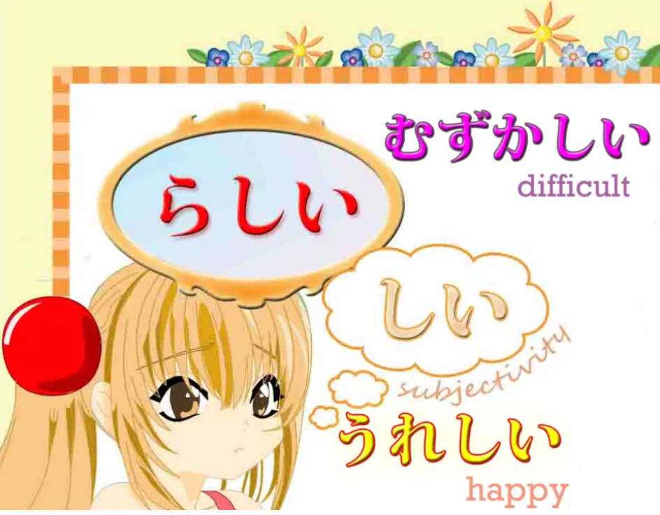
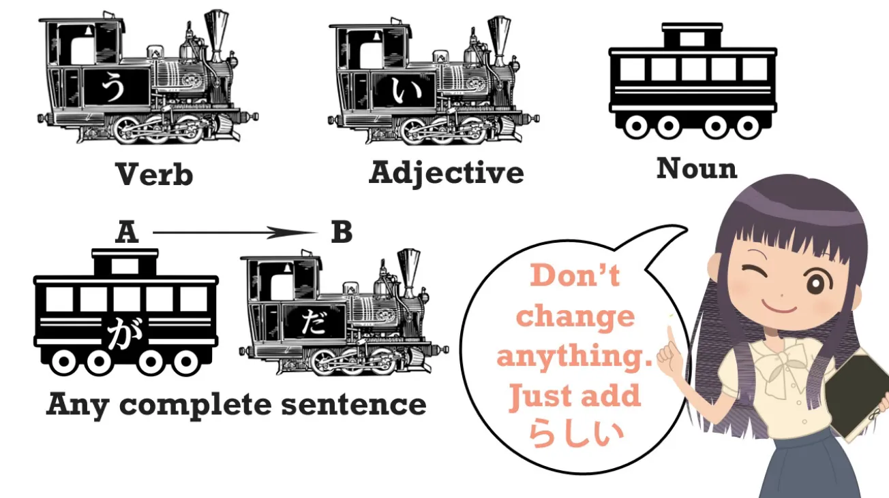
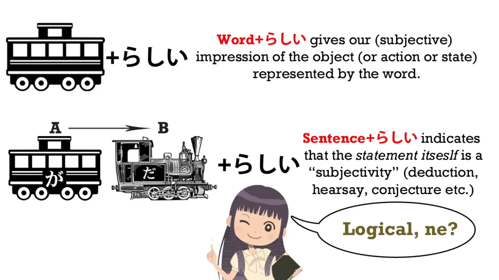
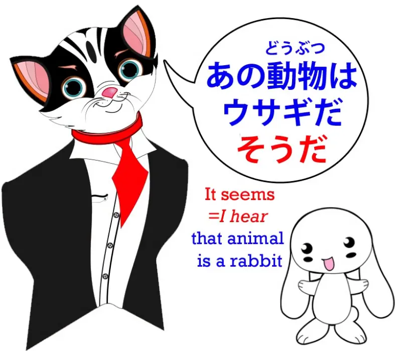
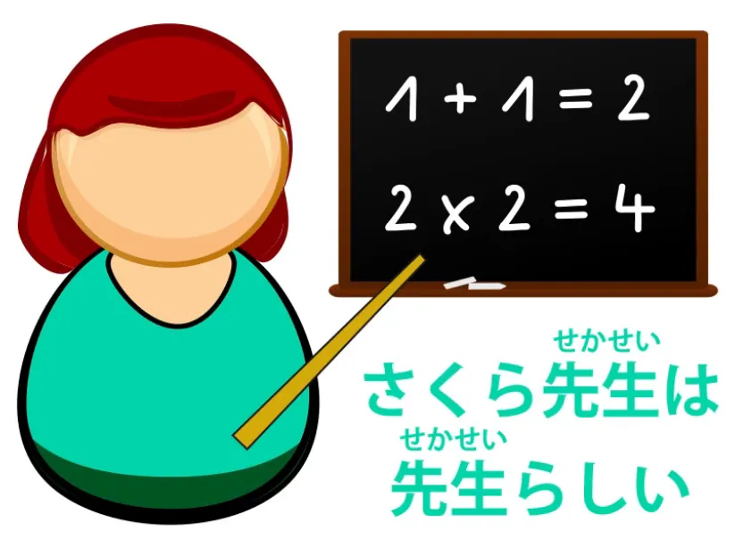

# **25.らしい

vsそうだ

/そうです

+っぽい

(ppoi)**

[**Pelajaran 25:らしい

Rashii menjadi rasional!. Rashii vs sou desu.らしい

vsそうです

.っぽい

ppoi**](https://www.youtube.com/watch?v=y3KlZ6IwtQ0&amp;list;=PLg9uYxuZf8x_A-vcqqyOFZu06WlhnypWj&amp;index;=31&amp;ab;_channel=OrganicJapanesewithCureDolly)

こんにちは。

Minggu lalu[[24]](./24-hearsay-guesses- そう - そうだ - そうです.md)

kita membahas kata benda kata sifat bantu <code>そう</code> dan bagaimana kita menggunakannya untuk mengekspresikan seperti apa sesuatu itu, kesan kita terhadap sesuatu, dan kabar angin. Hari ini kita akan membahas cara-cara lain untuk mengekspresikan rentang ide yang serupa, bagaimana cara kerjanya, kesamaannya, dan perbedaannya.

##らしい

Jadi, kita akan melihat **<code>らしい</code>, yang merupakan kata sifat bantu.** Dan **ini adalah kata sifat yang berakhiran - しい**, yang dapat kita sebut sebagai **subkelas kata sifat**.

Semua kata sifat sejati, seperti yang Anda ketahui, berakhiran - い. Kata-kata yang disebut kata sifat namun tidak berakhiran - い sebenarnya adalah kata benda yang berfungsi sebagai kata sifat. *(seperti きれい / 綺麗)* Namun, sekelompok kata sifat yang berakhiran い berakhiran - しい. *(Saya kira beberapa di antaranya <code>real</code> kata sifat)* Seperti yang Anda lihat, **akhirannya masih -い tetapi juga memiliki -し, jadi menjadi -しい.** Dan karakteristik kelompok kata sifat ini adalah bahwa **secara keseluruhan mereka mengekspresikan subjektivitas.** Artinya, **bukan kualitas yang dapat diukur secara tepat, melainkan hal-hal yang sampai batas tertentu bergantung pada kesan manusia atau makhluk hidup lainnya terhadapnya.** Jadi, misalnya, <code>かな/悲しい</code> adalah <code>sad</code>; <code>うれ/嬉しい</code> adalah <code>happy</code>. <code>むずか/難しい</code> berarti <code>difficult</code> dan meskipun ini tampak sedikit lebih objektif daripada <code>嬉しい</code> dan <code>悲しい</code>, **hal ini tetap bersifat subjektif dalam beberapa hal karena kesulitan bersifat relatif terhadap individu tertentu.**

**Apakah Anda menganggap sesuatu sulit atau mudah sangat bergantung pada** **siapa Anda dan apa kemampuan Anda.** Jadi, seperti yang akan kita lihat, hal ini memberi kita petunjuk tentang jenis kata apa ini dan bagaimana perbedaannya dengan <code>そう</code>. Penggunaannya sangat sederhana. **Seperti <code>そう</code> dapat ditambahkan baik ke kata tunggal maupun** **ke klausa logis lengkap atau kalimat.**

Dan penempatannya sangat sederhana, karena kita tidak perlu melakukan apa pun kecuali **hanya menempatkan <code>らしい</code> di belakang kata atau di belakang klausa logis yang lengkap.** **Kita tidak mengubah apa pun, kita tidak melakukan apa pun, jadi ini benar-benar tidak bisa lebih mudah lagi.**

Sekarang, **seperti halnya <code>そう</code>, jika kita menempatkannya setelah satu kata** **kita sedang membicarakan kesan kita terhadap objek tertentu tersebut.** **Jika kita menempatkannya setelah klausa yang lengkap**, kita sedang mengatakan <code>**it seems to be that way**</code>.

## Perbedaan antara らしい &amp; そうだ / です

Namun, ada perbedaannya. Jika kita menempatkannya <code>そうだ</code> setelah klausa yang lengkap, seperti yang Anda ketahui, kita melengkapi klausa tersebut, jika perlu dengan <code>だ</code>, dan penggunaan tersebut berarti bahwa **kita telah mendengar bahwa kalimat tersebut memang demikian.**

### らしい vs そうだ - setelah klausa yang lengkap

Jadi, jika kita mengatakan, <code>あの動物はウサギだそうだ</code>, kita berarti <code>I&#x27;ve heard that that animal is a rabbit</code>. Sekarang, jika kita mengatakan, <code>あの動物はウサギだ**らしい**</code>, kita berarti <code>**It seems** that animal is a rabbit</code>.

Sekarang, **hal itu bisa berarti hal yang sama dengan** <code>ウサギだ**そうだ**</code>. Itu bisa berarti <code>I&#x27;ve heard that it&#x27;s a rabbit</code>, dan terkadang buku teks menjadi cukup rumit dan membingungkan mengenai apakah <code>らしい</code> sebenarnya berarti <code>I&#x27;ve heard</code> atau apakah itu berarti <code>it seems</code>, tetapi hal ini sangat sederhana jika Anda memahami dengan tepat apa yang dilakukannya. **Yang dilakukannya sebenarnya adalah mengatakan <code>it appears</code> atau <code>it seems</code>, dan ini memiliki ambiguitas dan ketidakambiguitas yang persis sama seperti yang ada dalam bahasa Inggris.** 

Jadi, mari kita ambil contoh hewan misterius ini. Misalkan saya sedang melihatnya bersama sekelompok orang dan setelah itu Anda mendatangi saya dan berkata, <code>What is that animal?</code> dan saya menjawab, <code>ウサギだ**らしい**</code>. Sekarang, saya telah memberikan **kalimat lengkap dengan <code>らしい</code> di bagian akhir**, dan makna alami di sini adalah <code>**I heard from those people that** it was a rabbit.</code>

---

Sekarang, Anda lihat ini sama saja dengan jika dalam bahasa Inggris saya berkata, <code>**It appears that** it&#x27;s a rabbit.</code> Sekarang, Anda akan menganggap saya, baik dalam bahasa Inggris maupun Jepang, mengatakan, <code>**From what I heard (from those people)**, it&#x27;s a rabbit</code>. Sekarang, ambil skenario yang berbeda. Kelinci itu sudah pergi dan saya sedang memeriksa jejak kakinya dan Anda mendatangi saya dan berkata, <code>What was that animal?</code> dan saya berkata, <code>ウサギだった**らしい**</code>. Sekali lagi, <code>**It appears that** it was a rabbit</code>, atau <code>**It seems that** it was a rabbit.</code>

Dalam kasus ini, kamu mungkin akan menyimpulkan dari apa yang aku lakukan bahwa dengan mengatakan <code>**It appears** it was a rabbit</code>, saya mengatakan, <code>**From the evidence I&#x27;m looking at here, the appearances are that** it&#x27;s a rabbit.</code> Jadi, Anda lihat, tidak ada yang secara khusus berkaitan dengan tata bahasa atau rumit mengenai hal ini. Ini sama saja seperti dalam bahasa Inggris jika Anda mengatakan <code>It appears that it&#x27;s a rabbit</code> atau <code>It seems that it&#x27;s a rabbit</code>, **tergantung konteks apakah itu berarti informasi yang Anda dengar** **atau kesimpulan yang Anda tarik dari pengamatan Anda.**

---

**Jika Anda ingin benar-benar jelas bahwa Anda sedang membicarakan kabar angin,** **bahwa Anda sedang membicarakan sesuatu yang Anda dengar dari orang lain**, maka Anda mengatakan, <code>ウサギだった**そうだ**</code>.

Itu sudah jelas. Itu hanya bisa berarti <code>**I heard it from somebody**</code>.

### らしい vs そうだ - sebuah kata tunggal

Sekarang, ketika kita menerapkan <code>らしい</code> pada sebuah kata tunggal, perbedaan paling jelas antara <code>らしい</code> dan <code>そうだ</code> adalah bahwa **kita tidak bisa menerapkan <code>そうだ</code> pada kata benda biasa.** **Kita hanya bisa menggunakannya pada kata benda yang berfungsi sebagai kata sifat**, dan ada alasan bagus untuk itu.

Kita akan membahasnya sebentar lagi. **<code>らしい</code> Anda dapat menerapkan pada jenis kata benda apa pun,** **baik itu kata benda yang berfungsi sebagai kata sifat maupun kata benda biasa.** Namun, kata ini benar-benar menunjukkan keunggulannya ketika diterapkan pada kata benda biasa.

---

Seperti yang Anda harapkan dari fakta bahwa **ini adalah kata sifat -しい** – artinya, kita mengharapkan kata sifat ini mengekspresikan tingkat subjektivitas yang lebih tinggi – **kata sifat ini memiliki kemampuan untuk menyamakan satu hal dengan hal lain.** Jadi kita bisa mengatakan <code>あの動物はウサギ**らしい**</code> – <code>That animal **is** rabbit-**like** / that animal&#x27;s **like** a rabbit.</code>

---

Sekarang, perbedaannya dengan <code>そう</code>, selain fakta bahwa Anda hanya dapat menggunakannya <code>そう</code> pada kata benda yang berfungsi sebagai kata sifat – dan inilah mengapa Anda hanya dapat menggunakannya <code>そう</code> pada kata benda yang berfungsi sebagai kata sifat – adalah bahwa ketika kita mengatakan <code>あの動物はウサギ**らしい**</code> **kita tidak selalu menduga bahwa itu sebenarnya seekor kelinci.** **Kita mungkin sepenuhnya sadar bahwa itu bukan seekor kelinci** dan kita hanya mengatakan bahwa itu **seperti** seekor kelinci, itu adalah hewan yang **seperti** kelinci. Dan tentu saja, **kita juga bisa mengubahnya menjadi kata sifat semacam itu:** <code>ウサギ**らしい**動物</code> – <code>a rabbit-**like** animal</code>. Dan sekali lagi, hal ini sama seperti dalam bahasa Inggris. Jika kita mengatakan, <code>That animal **looks like** a rabbit</code>, kita bisa bermaksud <code>**I&#x27;m guessing that it is** a rabbit</code> atau bisa juga berarti <code>It&#x27;s probably not a rabbit, but it certainly looks like one.</code> Sekarang, hal ini meluas ke area subjektivitas yang lebih luas.

### &#x27;らしい&#x27; untuk area yang lebih subjektif

Misalnya, **kita bisa mengatakan bahwa sesuatu memiliki sifat-sifat sesuatu.** Misalnya, <code>男**らしい**男</code> adalah <code>manly man</code>, seorang pria **yang memiliki sifat-sifat** seorang pria. Jika kita membicarakan seseorang yang bukan seorang guru dan kita mengatakan <code>先生**らしい**</code> – <code>That person&#x27;**s like** a teacher.</code> **Kita mungkin atau mungkin tidak menduga bahwa dia sebenarnya adalah seorang guru.**

---

Tetapi jika kita tahu bahwa dia adalah seorang guru dan kita mengatakan, <code>さくら先生は先生**らしい**</code>, yang kita maksud adalah dia **berperilaku seperti** seorang guru.

**Dia adalah seorang guru dan dia memiliki sifat serta sikap yang tepat untuk menjadi seorang guru.**

---

Sebaliknya, kita bisa mengatakan, <code>さくら先生は、先生**らしくない**</code> dan dalam hal itu, kita bermaksud mengatakan, <code>Well, we know she&#x27;s a teacher, but she **doesn&#x27;t behave like** one, she **doesn&#x27;t act like** a teacher.</code>

Jadi, Anda lihat, **dengan <code>らしい</code> kita memasuki area yang jauh lebih subjektif.** **Kita tidak sekadar menebak apakah sesuatu itu memang lezat atau menarik,** **yang bisa kita pastikan melalui pengalaman.** **Kita sedang membicarakan kesan, keyakinan, dan subjektivitas kita seputar fenomena tersebut.** Sekarang, kita juga bisa mengatakan hal-hal seperti, misalnya, jika Sakura mengatakan sesuatu yang tidak menyenangkan dan biasanya dia adalah gadis yang sangat manis, kita mungkin akan berkata, <code>それはさくら**らしくない**</code> – <code>That **wasn&#x27;t / *isn&#x27;t* like** you, Sakura.</code> **Jadi, kita sedang membicarakan kualitas, kualitas yang dipersepsikan secara subjektif dari suatu hal.** Jadi, **di beberapa area hal ini tumpang tindih dengan <code>そうだ</code>,** **tetapi di area lain hal ini bergerak ke area yang lebih halus dan subjektif.**

## っぽい

Sekarang, kita juga akan melihat sekilas っぽい, yang merupakan っ diikuti oleh - ぽい, jadi ada jeda kecil di antara itu dan apa yang kita katakan. Jadi jika kita ingin mengatakan <code>child**ish**</code>, kita mungkin akan mengatakan <code>子ども**っぽい**</code>. **Fungsinya sangat mirip dengan <code>らしい</code>. Ini juga merupakan kata sifat bantu.** **Ini jauh lebih santai daripada <code>らしい</code>** dan kita biasanya mendengarnya dalam bentuk persis seperti itu – <code>子ども**っぽい**</code>, <code>ウサギ**っぽい**</code>.

---

**Anda tidak bisa menggunakan &quot;っぽい&quot; di akhir kalimat yang sudah lengkap. Anda hanya bisa menempelkannya pada sebuah kata.** Dan selain sifatnya yang informal, perbedaan kecenderungan dari <code>らしい</code> adalah bahwa **<code>らしい</code> cenderung menyiratkan bahwa kualitas tersebut adalah apa yang seharusnya dimiliki sesuatu.** **- っぽい sering kali cenderung menyiratkan kebalikannya.** *(pada dasarnya, kata ini cenderung menyiratkan kualitas yang tidak diinginkan)*

---

Tidak ada aturan baku di sini, tetapi **cenderung ada nuansa positif dalam <code>らしい</code> dan kecenderungan negatif pada っぽい**, **meskipun Anda pasti akan mendengarnya digunakan sebaliknya pada beberapa kesempatan.** Jadi <code>子ども**らしい**</code> **lebih cenderung menyiratkan bahwa anak tersebut berperilaku sesuai dengan anak-anak**, sedangkan <code>子ども**っぽい**</code> cenderung berarti <code>child**ish**</code>. 

Sebenarnya, dalam bahasa Inggris kita bisa mengatakan <code>子ども**らしい**</code> berarti <code>child-**like**</code> dan <code>子ども**っぽい**</code> berarti <code>child**ish**</code>, meskipun tidak seketat itu dalam bahasa Inggris. **Istilah ini bisa digunakan secara terbalik tanpa melanggar aturan apa pun.** Ketika saya pertama kali muncul dalam cangkang khusus ini, tubuh yang saya kenakan sekarang – tentu saja saya adalah hantu dalam cangkang *(referensi yang bagus, Dolly :D)* – saya berbicara dalam bahasa Inggris, memperkenalkannya, tetapi saya menyisipkan sedikit komentar dalam bahasa Jepang karena saya benar-benar tidak tahu bagaimana mengatakannya dalam bahasa Inggris. Saya berkata, &quot;Apa pendapatmu tentang saya ketika saya terlihat seperti ini? <code>人間っぽいね?</code> <code>人間**っぽい**ね</code> – <code>It&#x27;s very human-**looking**, isn&#x27;t it?</code> Dan meskipun itu tidak benar-benar merendahkan, makna dari apa yang saya katakan adalah <code>Good heavens, in this shell I **look really more** human **than I actually am**, don&#x27;t I?</code> Yang menurutku itulah sebabnya beberapa orang memanggilku <code>creepy</code>, karena saya mungkin terlihat sedikit terlalu manusiawi untuk seseorang yang bukan manusia.

::: info
Agak sulit menentukan bagian terjemahan mana yang harus saya sorot agar sesuai dengan yang diberikan Dolly di 日本語, tapi semoga ini membantu; saya mencoba menebaknya sebaik mungkin (p^-^)p
**Bagaimanapun, mulai dari sini, saya tidak akan menggunakan garis bawah ini hingga sekitar Lesson 78.**

**Pelajaran-pelajaran selanjutnya akan memilikinya lagi; pelajaran-pelajaran di antara ini tidak memilikinya karena saya hanya menggunakan huruf tebal saat itu dan tidak menambahkan garis bawah hingga kemudian, sehingga tidak ada garis di sana untuk saat ini.****

**Selain itu, pelajaran dari sekarang hingga 64 termasuk yang pertama kali saya edit, dan saya belum meninjau catatan di sana, jadi ingatlah hal itu dan ambil dengan hati-hati seperti biasa, jaga-jaga karena kemampuan bahasa Jepang saya masih sangat terbatas dan saya belum mendapatkan masukan dari orang-orang yang lebih profesional atau berpengalaman.**
**Alasan lainnya adalah bahwa saya (dan masih agak) tidak sepenuhnya yakin apakah saya harus atau tidak menggunakan garis bawah tersebut (Yomichan tidak mau memindai bagian-bagian dengan gaya berbeda dengan benar, sedangkan 10ten bisa…)

Butuh banyak waktu dan usaha untuk menggarisbawahi bagian-bagian penting, jadi mungkin saya akan kembali ke sana nanti untuk setidaknya membuatnya konsisten.
Jika bisa, tolong beri tahu saya melalui Discord atau Email apakah Anda lebih suka bagian penting yang digarisbawahi atau teks biasa tanpa garis bawah, karena terkadang jumlah <code>important stuff</code> mungkin sedikit lebih sulit dibaca ketika semuanya digarisbawahi. Dengan huruf tebal bahkan lebih buruk lagi, itulah sebabnya saya berhenti menggunakannya dan mengubahnya.
:::
