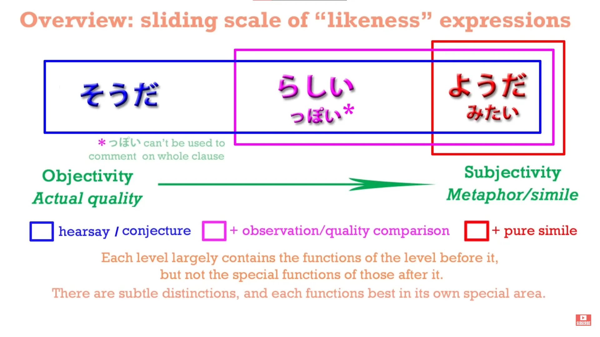
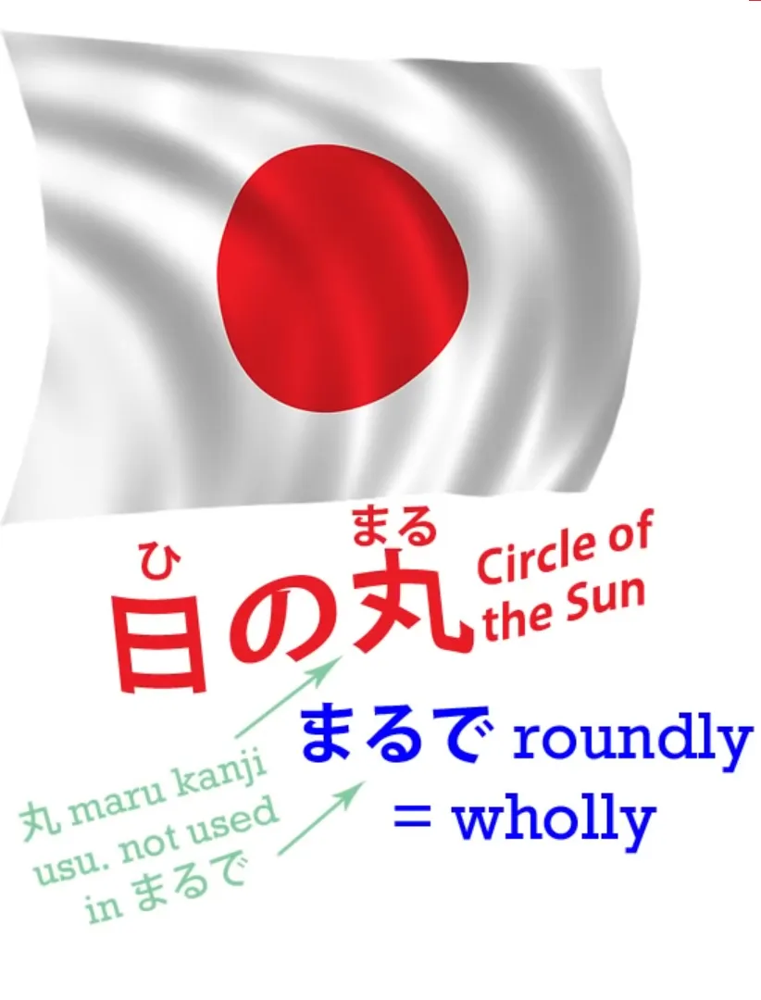
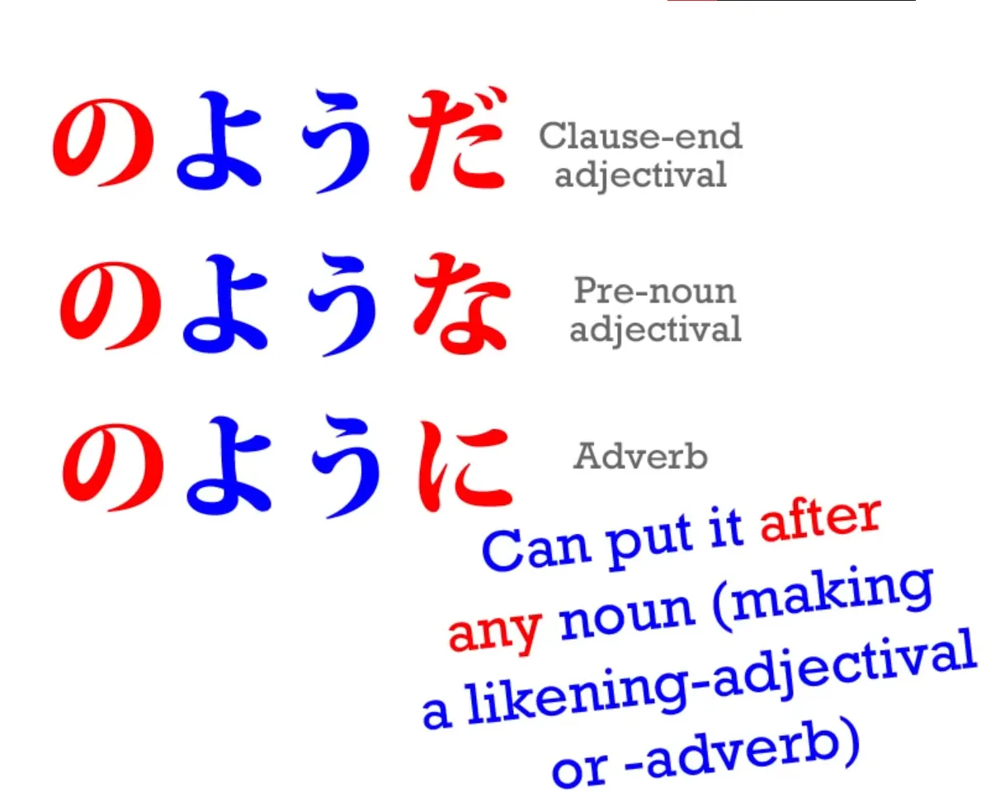
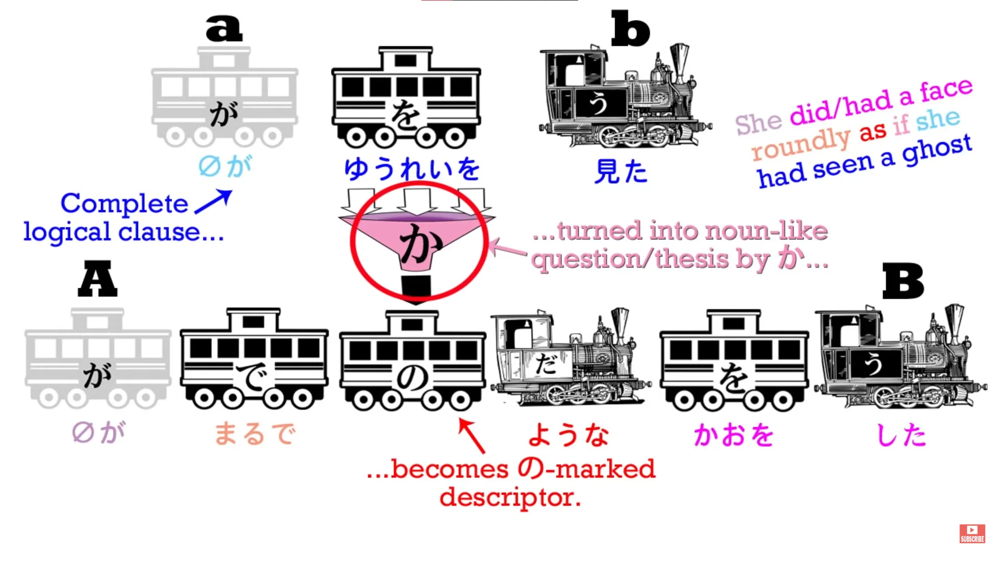

# **26. Perumpamaan: ようだ・のように・のような ・みたい**

[**Pelajaran 26: Logika yang sangat jelas dalam tata bahasa perumpamaan bahasa Jepang: のように・のような ・みたい**](https://www.youtube.com/watch?v=Ft_zw0mdeyI&amp;list;=PLg9uYxuZf8x_A-vcqqyOFZu06WlhnypWj&amp;index;=28&amp;pp;=iAQB)

こんにちは。

Hari ini kita akan membahas <code>ようだ</code> dan sedikit menyinggung sepupunya <code>みたい</code>. Kita akan menemukan bahwa <code>ようだ</code> merupakan ujung lain dari skala geser dengan ungkapan dugaan dan kemiripan yang telah kita bahas dalam dua pelajaran terakhir.

Di satu ujung kita memiliki <code>そうだ</code>, di ujung lainnya ada <code>ようだ</code>, dan di tengah ada <code>らしい</code>. Semua ungkapan ini dapat ditempatkan di akhir kalimat logis yang lengkap untuk menyatakan bahwa kalimat tersebut adalah apa yang telah kita dengar atau apa yang kita duga berdasarkan informasi yang kita miliki atau dari apa yang dapat kita lihat. Namun, ketika kita menempelkannya pada kata-kata individual, maka kita memiliki skala makna yang bergradasi ini.

Dengan <code>そうだ</code>, seperti yang kita ketahui, kita menggunakan ini untuk menduga kualitas sesuatu. Kita dapat mengatakan <code>おいしそうだ</code> - <code>It looks delicious /I haven&#x27;t tried it, but I think if I did, I would find it delicious.</code> Dengan <code>らしい</code> kita memiliki tingkat subjektivitas yang jauh lebih tinggi. <code>らしい</code> tumpang tindih dengan <code>そうだ</code> dalam banyak hal, tetapi ia juga dapat melakukan hal-hal yang <code>そうだ</code> tidak bisa dilakukan.

Hal ini dapat membandingkan sesuatu dengan hal lain, dengan hal-hal yang kita tahu bukanlah hal tersebut. Kita dapat mengatakan bahwa seekor hewan adalah <code>ウサギらしい</code> - <code>rabbit-like</code> - meskipun kita tahu itu bukan kelinci. Kita dapat mengatakan bahwa seseorang <code>子どもらしい</code> - <code>child-like</code> - apakah dia sebenarnya seorang anak atau tidak. Kita tidak selalu menduga bahwa hewan itu adalah kelinci atau orang itu adalah seorang anak. Kita hanya membuat perbandingan itu.

## ようだ ・ように・ような

Sekarang, <code>ようだ</code> bisa melangkah lebih jauh. Kita bisa membuat metafora atau perbandingan yang sebenarnya. Jadi dengan <code>ようだ</code> kita bisa mengatakan hal-hal seperti <code>a sumo wrestler is like a mountain</code> atau <code>a person runs like the wind</code>. Nah, ini adalah, jika Anda suka, gaya sastra atau perbandingan puitis atau metafora.

Kita tidak mengatakan bahwa pegulat itu mirip gunung kecuali dalam arti bahwa dia besar dan kokoh. Kita tidak mengatakan bahwa seseorang mirip angin kecuali bahwa dia cepat. Dan salah satu cara kita tahu kapan <code>ように</code> berperilaku seperti ini adalah bahwa kita bisa menggunakan kata <code>まるで</code> bersama dengannya. Jadi kita bisa mengatakan <code>まるで風のように走った</code> - <code>ran just like the wind</code>.

Secara harfiah, <code>まるで</code> berarti <code>roundly</code>.

<code>まる/丸</code> berarti <code>circle</code> atau <code>round</code>, jadi ketika kami mengatakan <code>まるで</code> yang kita maksud <code>roundly/wholly/completely</code>. Dan ini adalah hiperbola, yang umum ditemukan di banyak bahasa, termasuk tentu saja bahasa Inggris. Kita mungkin mengatakan, dalam bahasa Inggris, <code>That wrestler is exactly like a mountain.</code>

Kita bahkan mungkin mengatakan <code>I literally froze to death.</code> Nah, itu kebalikan dari apa yang sebenarnya kita maksud: kita tidak bermaksud bahwa kita <code>literally</code> mati kedinginan, yang kami maksud adalah kami mati kedinginan secara kiasan. Secara harfiah, kami tampaknya masih hidup. Kami tidak bermaksud bahwa pegulat itu <code>exactly</code> seperti gunung.

Tidak ada salju di atasnya! Namun alasan kami mengatakan hal-hal seperti <code>exactly</code> dan <code>literally</code> adalah untuk memberikan penekanan pada perbandingan puitis. Dan dalam bahasa Jepang, kolokasi yang umum di sini adalah <code>まるで</code>.

Dan ini juga menunjukkan perbedaan antara <code>ようだ/ような/ように</code> dan ungkapan perbandingan lainnya. Anda tidak bisa menggunakan <code>まるで</code> dengan <code>そうだ</code> atau <code>そうです</code>. Anda tidak boleh menggunakan <code>まるで</code> bersama <code>らしい</code>. Kata itu tidak cocok dengan ungkapan-ungkapan tersebut.

Kita menggunakan <code>まるで</code> ketika kita sedang melayang dalam imajinasi puitis. Ini adalah ungkapan hiperbolis yang menandakan akan datangnya perbandingan atau metafora. Ketika kita mengatakan bahwa seseorang <code>子どもらしい</code> atau seekor hewan <code>ウサギらしい</code>, kita sedikit memperluas realitas; kita membandingkannya dengan sesuatu yang bisa saja terjadi tetapi tidak terjadi.

Sekarang, jika kita melihat penggunaan ungkapan-ungkapan ini, kita dapat melihat bahwa seperti biasa dalam bahasa Jepang, semuanya sangat logis.

Buku teks terkadang memberikan daftar hubungan dan cara penggunaannya. Namun sebenarnya semuanya masuk akal. Kita tidak memerlukan daftar untuk mengetahui bahwa <code>ようだ</code> juga dapat digunakan sebagai kata keterangan <code>ように</code> atau bahwa kata tersebut dapat ditempatkan di depan sesuatu sebagai kata sifat <code>ような</code> - karena hubungan-hubungan ini hanyalah hubungan yang sama yang dapat Anda buat dengan kata benda yang berfungsi sebagai kata sifat apa pun.

Satu-satunya hal yang perlu kita ketahui adalah bahwa, sama seperti <code>らしい</code> dan tidak seperti <code>そうだ</code>, kita dapat menggunakannya dengan jenis kata benda apa pun, bukan hanya kata benda yang berfungsi sebagai kata sifat. Dan itu juga masuk akal karena baik <code>らしい</code> dan <code>ようだ</code> kita dapat membandingkan sesuatu dengan hal lain, sedangkan dengan <code>そうだ</code> kita hanya dapat menebak kualitas suatu benda, sesuatu yang dapat diungkapkan oleh kata sifat atau kata benda yang berfungsi sebagai kata sifat. Dan ketika kita mengaitkannya dengan kata kerja, seperti yang telah kita lihat, maknanya sedikit berbeda.

Namun, <code>ようだ</code> memiliki hubungan khusus yang tidak dimiliki yang lain.

Seperti yang kamu ketahui, kita bisa dengan mudah menempatkannya pada kalimat utuh, seperti halnya dua kata lainnya, dengan makna <code>(that sentence) is what appears to be the case</code>. Namun, kita juga dapat menempatkannya pada kalimat lengkap dengan makna yang berbeda. Kita dapat melakukannya untuk mengubah seluruh kalimat menjadi perumpamaan kita.

Jadi, misalnya, kita dapat mengatakan <code>まるでゆうれいを見たかのような顔をした</code> - <code>She had a face (or made a face) exactly as if she had seen a ghost.</code>

Sekarang, seperti yang kita lihat, <code>she had seen a ghost</code> adalah klausa logis yang utuh. Dalam bahasa Jepang, kita memiliki partikel nol untuk <code>she</code>, tetapi ini adalah klausa logis yang lengkap: <code>she saw a ghost</code> - <code>ゆうれいを見た</code> - <code>zeroがゆうれいを見た</code>. Sekarang, kemudian kita letakkan <code>か</code> di bagian akhir kalimat tersebut. Apa itu <code>か</code>?

## Partikel &quot;か&quot;

Kita belum banyak membahas partikel &quot;か&quot; karena dalam bahasa Jepang formal (です) / semi-formal (ます), partikel ini digunakan untuk menandai pertanyaan. Anda bisa menggunakannya untuk menandai pertanyaan dalam bahasa Jepang informal, yang biasanya kita gunakan di sini, tetapi kebanyakan kita tidak melakukannya karena secara paradoks, menempatkan <code>か</code> di akhir pertanyaan informal - hal itu cenderung terkesan sedikit kasar atau singkat.

Namun, penanda pertanyaan <code>か</code> memiliki fungsi penting lainnya. Yaitu, tanda tanya dapat mengubah pernyataan menjadi semacam pertanyaan, dan itulah yang terjadi di sini. Kita memulainya dengan <code>まるで</code> untuk menandakan bahwa kita akan menggunakan perumpamaan.

Kemudian kita membuat pernyataan lengkap kita - <code>ゆうれいを見た</code> - <code>zeroがゆうれいを見た</code> - <code>she saw a ghost</code>. Dan kemudian kita menambahkan <code>か</code> dan itu mengubahnya menjadi sebuah pertanyaan. Hal itu memberi kita <code>if</code> - <code>as if she had seen a ghost</code>.

Dan hal itu <code>か</code> memberi kita pertanyaan <code>if</code>. Sebenarnya, dia tidak melihat hantu, jadi ini bukan pernyataan; ini adalah kemungkinan, potensi, sebuah &quot;jika&quot;. Yang sebenarnya dia lihat mungkin adalah biaya yang dikenakan PayPal kepadanya untuk transfer uang internasional.

Kami tidak menyarankan bahwa dia benar-benar melihat hantu. Kami menyarankan bahwa wajah yang dia tunjukkan - <code>顔をした</code> - mirip dengan wajah yang akan dia bayangkan jika - <code>か</code> - dia melihat hantu.

Sekarang, hal lain yang perlu kita pahami tentang ini <code>か</code> adalah bahwa hal ini pada dasarnya menominalkan klausa logis yang ditandainya.

Jadi, yang dilakukannya adalah mengubah klausa logis lengkap ini menjadi sebuah pertanyaan, sebuah hipotesis, sebuah &quot;jika&quot;, yang kemudian berfungsi secara struktural sebagai kata benda. Jadi, hal ini dapat ditandai dengan &quot;の&quot;, yang hanya dapat terjadi pada kata benda. Dan kata benda baru ini, objek yang telah kita ciptakan dari sebuah klausa logis utuh, kini dapat dihubungkan dengan kata benda lain melalui partikel &quot;の&quot;.

<code>よう</code> adalah <code>form</code> atau <code>likeness</code> - <code>やまのよう</code> adalah bentuk gunung, <code>風のよう</code> adalah bentuk atau rupa angin, dan dalam hal ini, <code>ゆうれいを見たかのよう</code> adalah gambaran dari objek ini yang telah kita ciptakan dari hipotesis telah melihat hantu. Sekali lagi, ini bukanlah sesuatu yang dapat kita lakukan dengan kata benda lainnya. Kita bahkan tidak dapat melakukannya dengan <code>みたい</code>, yang dalam banyak hal bekerja hampir persis sama dengan <code>のよう</code>.

## みたい

<code>みたい</code> adalah sepupu yang lebih informal dari <code>よう</code> dan secara umum memiliki arti yang sama serta secara umum dapat digunakan dengan cara yang sama.

Ini adalah kata benda yang berfungsi sebagai kata sifat, sama seperti itu <code>よう</code>, dapat digunakan dengan <code>に</code> untuk menjadikannya kata keterangan atau dengan <code>な</code> untuk menjadikannya kata sifat sebelum kata benda, sama seperti kata benda yang berfungsi sebagai kata sifat lainnya. Hal utama yang perlu diingat tentang kata ini hanyalah bahwa ia lebih informal, jadi Anda tidak menggunakannya dalam esai.

Di sisi lain, Anda mungkin lebih memilih menggunakannya saat berbicara dengan teman daripada <code>ようだ</code> dalam banyak kasus, hanya karena terdengar sedikit lebih santai dan lebih ramah. Namun, Anda tidak bisa menggunakannya dengan kalimat lengkap.

Anda bisa menggunakannya dengan kalimat lengkap untuk menyimpulkan bahwa pernyataan tersebut benar, tetapi Anda tidak bisa menggunakannya <code>か</code> menggunakan kalimat lengkap sebagai perbandingan. Anda harus menggunakan <code>かのようだ/かのように</code> untuk itu. Hal lain yang perlu diperhatikan adalah bahwa terkadang, mungkin karena sangat santai, <code>だ</code> atau <code>です</code> dihilangkan dari <code>みたい</code>.

Anda mungkin mengatakan <code>まるでヒツジみたい</code> - <code>just like a sheep</code>.

Ini bukan tata bahasa yang benar - seharusnya Anda mengatakan <code>みたいだ</code> - tetapi sangat umum untuk menghilangkannya. Tidak umum untuk menghilangkannya dari <code>ようだ</code>.

::: info
Sebagai tambahan, saya ingin menegaskan bahwa kata benda yang berfungsi sebagai kata sifat &quot;みたい&quot; TIDAK sama dengan &quot;見たい&quot; (sebuah kata sifat yang berarti <code>see-inducing</code>). Ini adalah dua hal yang berbeda <code>みたいs</code>. Anda tidak bisa menulis kata benda yang berfungsi sebagai kata sifat ini sebagai &quot;見たい&quot;, karena jika tidak, itu akan menjadi kata sifat <code>see-inducing</code>. Apa yang dikatakan Dolly- 先生 di kolom komentar:  

:::
