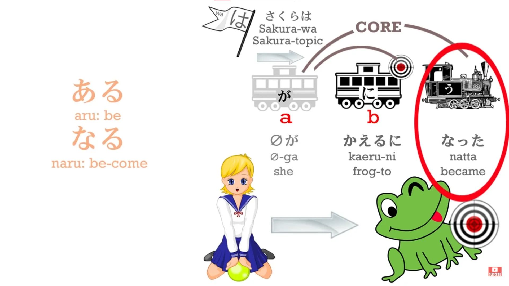
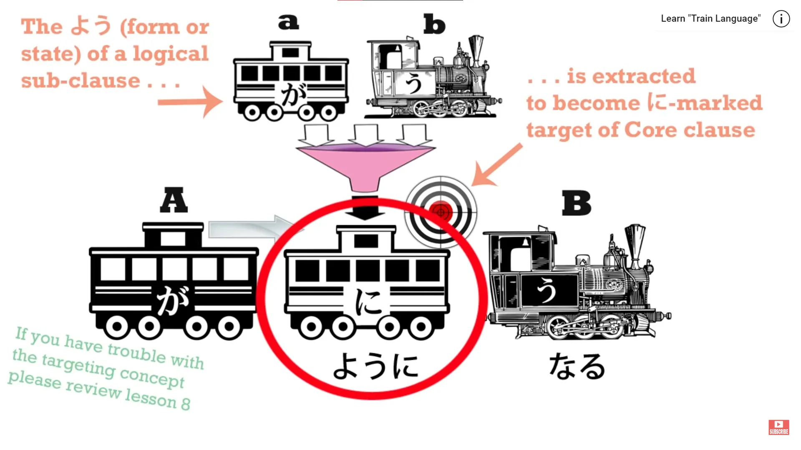
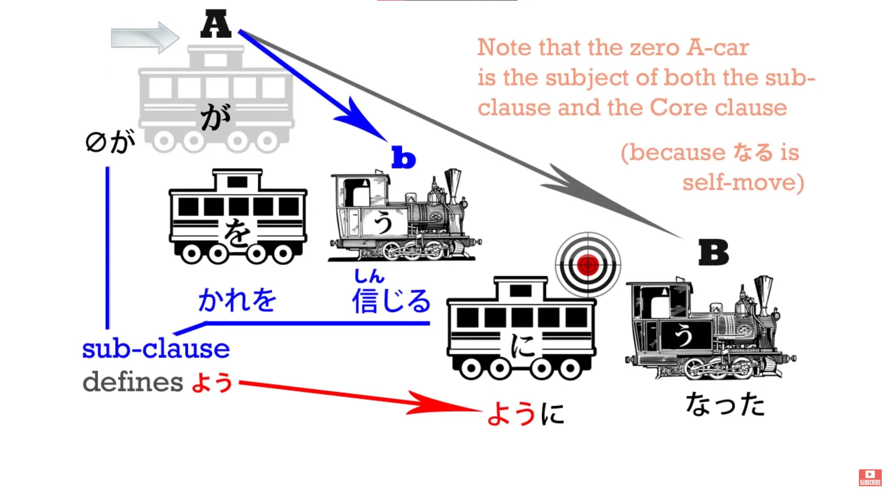
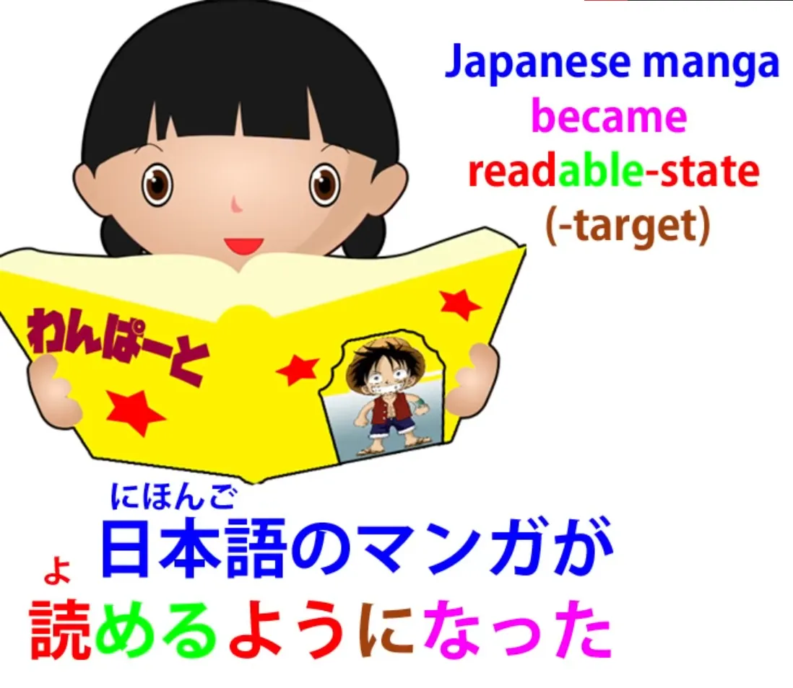
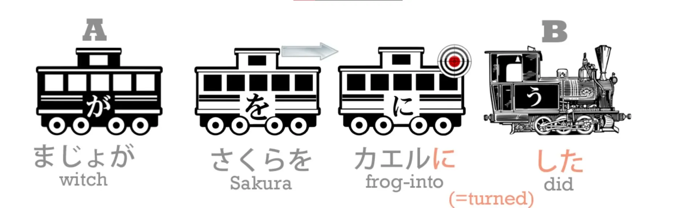
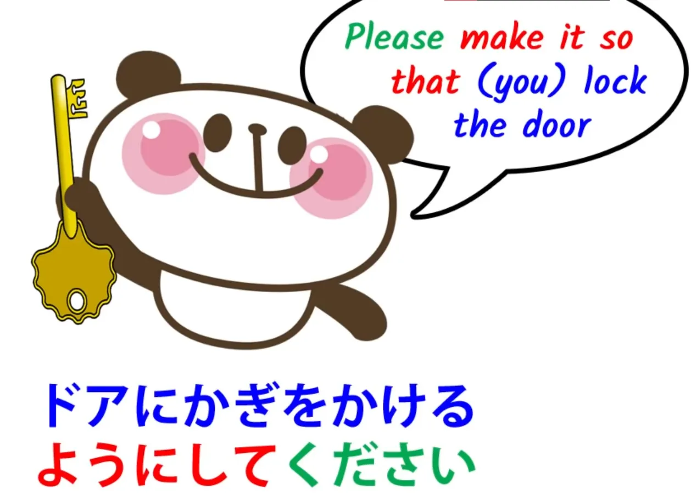
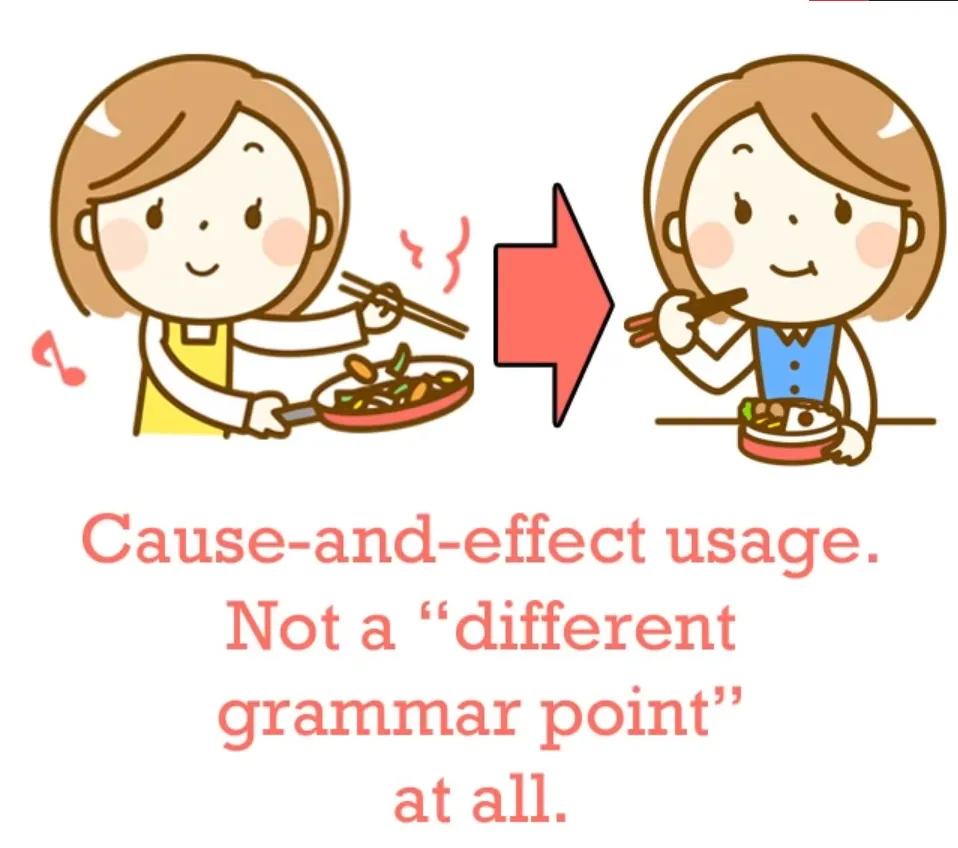
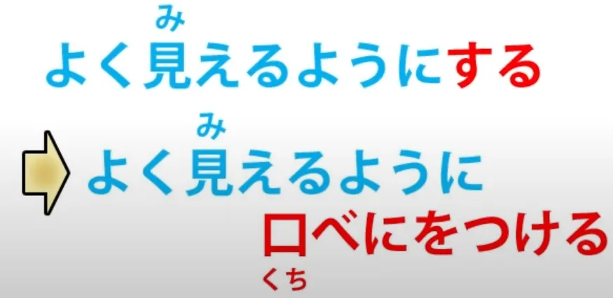

# **28. ように - satu kunci untuk semua kegunaan utama**

[**Pelajaran 28: You ni—satu kunci untuk semua kegunaan utama! Mudah sekali kalau kamu tahu**](https://www.youtube.com/watch?v=IE7WgIOOGbM&amp;list;=PLg9uYxuZf8x_A-vcqqyOFZu06WlhnypWj&amp;index;=30&amp;pp;=iAQB)

こんにちは。

*Hari ini* kita akan membahas <code>ようになる</code>, <code>ようにする</code>, <code>ことにする</code>, <code>ことになる</code>*(nope)*. Sekarang, semua elemen dari ungkapan-ungkapan ini sudah kita pelajari, jadi yang perlu kita lakukan sekarang adalah melihat bagaimana mereka saling berkaitan dalam kasus-kasus ini, apa artinya, dan mengapa artinya seperti itu.

Jadi, mari kita ulas singkat <code>になる</code> dan <code>にする</code>. Seperti yang kita ketahui, dua kata kerja dasar dalam bahasa Jepang adalah <code>ある</code> dan <code>する</code>. <code>ある</code> adalah induk dari semua kata kerja bergerak sendiri dan <code>する</code> adalah induk dari semua kata kerja yang menggerakkan objek.

<code>なる</code> sangat erat kaitannya dengan <code>ある</code> — <code>ある</code> berarti <code>be</code>; <code>なる</code> berarti <code>become</code> — sehingga kita dapat mengatakan bahwa <code>ある</code> dan <code>なる</code> adalah versi statis dan dinamis dari kata kerja yang sama. Artinya, kata kerja yang sama dalam keadaan diam dan bergerak dalam waktu.

Sekarang, kita tahu bahwa ketika kita menggunakan kata benda yang diikuti oleh <code>になる</code>, kita bermaksud mengatakan bahwa sesuatu berubah menjadi kata benda tersebut.

<code>に</code> menandai sasaran transformasi dan <code>なる</code> adalah transformasi itu sendiri, proses menjadi.

## ようになる

Jadi, ketika kita mengatakan <code>ようになる</code>... Nah, kita telah membahas <code>よう</code> minggu lalu, bukan, dan kita melihat bahwa ketika kita membandingkan atau menyamakan sesuatu <code>よう</code> berarti <code>form</code> atau <code>likeness</code>. Arti dasarnya adalah bentuk atau keadaan.

Ketika kita mengatakan <code>りきしは山のようだ</code> — <code>sumo wrestler is like a mountain</code> — kita tidak mengatakan bahwa pegulat sumo <code>is</code> sebuah gunung, kita mengambil bentuk atau keadaan dari gunung tersebut dan menerapkannya pada pegulat sumo. Kita tidak mengatakan bahwa pegulat sumo itu adalah gunung, melainkan bahwa pegulat itu adalah <code>よう</code>, bentuk atau keadaan keberadaan gunung tersebut.

Jadi dalam bahasa Inggris kita mengatakan pegulat itu adalah <code>like</code> gunung; dalam bahasa Jepang kita mengatakan pegulat itu adalah bentuk atau keadaan keberadaan gunung — kita mungkin mengatakan, <code>likeness</code> dari gunung. Sekarang, ketika kita menggunakan <code>よう</code> dalam ungkapan yang kita bahas hari ini, kita tidak menambahkannya ke kata benda seperti <code>山</code>, kita menempelkannya pada klausa logis yang lengkap.

Buku teks kadang-kadang mengatakan kita menempelkannya pada kata kerja, tetapi yang sebenarnya kita lakukan adalah menempelkannya pada klausa logis yang memiliki kata kerja sebagai inti.

Dan <code>よう</code>, seperti yang kita ketahui, adalah kata benda; klausa logis tersebut menjadi kata sifat, deskriptor, untuk kata benda tersebut, sehingga kita tahu bahwa setiap kata kerja bersama dengan klausa logis yang dipimpinnya dapat menjadi kata sifat sehingga kita TIDAK <code>のよう</code>, kita TIDAK mengatakan kesamaan dengan sesuatu yang lain di sini. Jadi ketika kita memiliki klausa logis ditambah <code>ようになる</code>, kita mengatakan bahwa sesuatu menjadi atau memasuki keadaan atau bentuk dari klausa logis tersebut.

Jadi, misalnya, jika kita mengatakan <code>彼を信じるようになった</code>, kita mengatakan <code>I came to believe him.</code>

<code>彼を信じる</code> (atau <code>zeroが彼を信じる</code>) — <code>I believe him</code> — adalah klausa logis, dan kita mengatakan bahwa saya pindah ke keadaan tersebut, saya menjadi keadaan dari klausa logis tersebut: <code>I came to believe him.</code> Ini sering digunakan dengan kata kerja bantu potensial.

Misalnya, kita mungkin mengatakan, <code>日本語のマンガが読めるようになった</code> — <code>Japanese manga became readable (to me)</code>.

Seperti yang Anda lihat, dalam kedua kasus tersebut ada sesuatu yang mengubah keadaannya. Saya mengubah keadaan saya dari tidak mempercayainya menjadi mempercayainya; manga tersebut mengubah keadaannya dari tidak dapat dibaca menjadi dapat dibaca. Dalam semua kasus, kita sedang membicarakan perubahan keadaan, yaitu perubahan keadaan yang ada pada seseorang atau sesuatu dari satu kondisi ke kondisi lain.

Dan jika Anda bertanya-tanya mengapa dalam bahasa Jepang kita lebih sering mengatakan bahwa manga berubah keadaan dari tidak dapat dibaca menjadi dapat dibaca daripada mengatakan, seperti yang biasanya kita lakukan dalam bahasa Inggris, yaitu orang tersebut mengubah keadaan dari tidak bisa membaca manga menjadi bisa membaca manga, silakan tonton video pelajaran tentang kata kerja bantu potensial di mana saya menjelaskan bagaimana hal ini bekerja.[[10]](./10-helper-verbs-the-potential-helper-verb.md)

## ようにする

Sekarang, ketika kita mengatakan <code>ようにする</code> kita tahu bahwa <code>にする</code> konstruksi ini adalah versi &quot;other-move&quot; dari <code>になる</code> konstruksi. Jika kita mengatakan <code>まじょがさくらをカエルにした</code>, kita berarti <code>the witch turned Sakura into a frog</code>.

Jadi <code>ようにする</code> berarti membuat sesuatu memasuki suatu keadaan. Keadaan itu tidak dimasuki dengan sendirinya; ada seseorang yang membuatnya memasuki keadaan tersebut. Jadi, jika kita mengatakan <code>よく見えるにする</code> — <code>よく見える</code> berarti <code>look good</code>, maka <code>よく見えるようにする</code> berarti membuat seseorang atau sesuatu terlihat bagus.

Sekarang, <code>ようにする</code> memiliki arti yang lebih luas, yaitu ketika kita mengatakan sesuatu yang pada dasarnya setara dengan <code>please make sure that you do something</code>. Jadi, kita bisa mengatakan <code>ドアにかぎをかけるようにしてください</code> dan itu berarti <code>please make it so that you lock the door</code>.

Dan saya rasa Anda bisa melihat perbedaannya di sini antara sekadar mengatakan <code>ドアにかぎをかけてください</code>, yang hanya <code>please lock the door</code>. Dalam satu kasus, Anda seolah-olah mengasumsikan bahwa orang tersebut akan menguncinya sebagai hal yang biasa; dalam kasus kedua, Anda menekankan hal itu secara khusus: <code>Please make it so that you lock the door (this is important, so please make it be that way)</code>.

<code>It</code> dalam hal ini sama saja seperti dalam bahasa Inggris — <code>situation</code>, <code>circumstance</code> — &quot;Tolong ubah situasi dari tidak mengunci pintu menjadi mengunci pintu.&quot; Jadi, ini menekankan instruksi atau saran ini secara khusus.

Sekarang, terkait dengan ini adalah ketika Anda mungkin mengatakan sesuatu tentang diri Anda sendiri, biasanya terkait dengan sesuatu yang Anda lakukan secara rutin, seperti mengatakan <code>毎日歩くようにする</code>. Dan itu secara harfiah berarti, <code>\[I\] (try to) make it so that \[I\] walk every day</code>.

Tetapi ketika Anda mengatakannya dengan cara ini, daripada hanya mengatakan <code>毎日歩く</code>, yang hanya berarti <code>I walk every day</code>, implikasinya adalah bahwa Anda berusaha melakukannya. Anda mungkin tidak selalu berhasil. Dan, Anda lihat, seperti pada penggunaan lainnya, ada keraguan apakah Anda akan melakukannya.

Anda tidak mengatakan <code>Please make it so that you lock the door</code> kecuali ada keraguan tertentu di benak Anda mengenai apakah hal ini akan terjadi dan Anda berusaha agar hal itu terjadi.

## ことにする

Ketika Anda mengatakannya tentang diri Anda sendiri — <code>毎日歩くようにする</code> — ada faktor lain yang berperan di sini, yaitu ketika yang dimaksud adalah diri sendiri, Anda juga bisa menggunakan <code>ことにする</code>, dan itu mengekspresikan keputusan yang tegas yang akan kita bahas minggu depan di bagian kedua dari pelajaran ini. Jadi jika Anda memilih <code>ようにする</code> daripada <code>ことにする</code> , Anda secara inheren menyisakan sedikit ruang untuk keraguan.

## <code>Cause-and-effect</code> penggunaan &quot;ように&quot;

Sekarang, <code>ように</code> juga dapat digunakan dengan klausa di belakangnya dan klausa di depannya, untuk mengatakan <code>do one thing in order that another thing may happen</code>.

Buku teks memperlakukan ini seolah-olah itu adalah bagian tata bahasa yang berbeda, poin tata bahasa yang berbeda, tetapi sebenarnya tidak, ini sama dengan <code>ようにする</code>, dan satu-satunya alasan mengapa hal ini tampak sedikit berbeda adalah karena kita menyusunnya sedikit berbeda dalam bahasa Inggris. Namun, kita tidak boleh memikirkan bahasa Inggris; kita harus memikirkan bahasa Jepang. Jadi, mari kita lihat bagaimana hal ini bekerja.

Mari kita ambil kalimat yang sudah kita bahas sebelumnya: <code>よく見えるようにする</code> — <code>make something (or someone) look better</code>. Sekarang, mari kita ubah menjadi <code>よく見えるように口紅をつける</code> — &quot;agar dia terlihat lebih baik (atau saya terlihat lebih baik, atau seseorang terlihat lebih baik), oleskan lipstik&quot;.

Sekarang, seperti yang Anda lihat, dalam bahasa Inggris cara mengekspresikan kedua ide tersebut berbeda, dan itulah mengapa buku teks dan penjelasan konvensional seolah-olah membahas dua poin tata bahasa yang terpisah dan tidak terkait. Namun, jika Anda melihat apa yang sebenarnya terjadi, Anda akan menyadari bahwa keduanya sebenarnya sama.

Dalam satu kasus, kita mengatakan <code>make someone or something look better</code> tanpa menentukan caranya. Kita hanya menggunakan kata kerja netral dan serba guna <code>する</code>, yang merupakan kata kerja dasar untuk gerakan orang lain. Ketika kita mengatakan <code>よく見えるように口紅をつける</code>, <code>口紅をつける</code> hanya menggantikan <code>する</code>.

Alih-alih mengatakan secara tidak spesifik hanya <code>make someone look better</code>, ini mengatakan <code>do a specific thing in order to make someone look better</code>. Sekarang, <code>する</code> juga merupakan suatu tindakan; hanya saja itu adalah tindakan yang tidak spesifik. Itu hanya <code>do/act/make something happen</code>.

<code>口紅をつける</code> menentukan apa yang <code>する</code> dalam kasus tertentu. Jadi, Anda lihat, kita memiliki konstruksi yang persis sama di sini, bukan dua hal terpisah <code>grammar points</code>, seperti yang mereka suka sebut.

## &quot;ように&quot; di akhir kalimat

Dan satu catatan terakhir adalah bahwa Anda kadang-kadang akan mendengar <code>ように</code> di akhir kalimat, biasanya kalimat yang diakhiri dengan ます. Ini terutama digunakan untuk doa dan permohonan. Jadi, Anda mungkin mengatakannya <code>日本に行けますように</code>.

Dan Anda mungkin mengatakannya di sebuah kuil atau saat Anda membuat permohonan pada bintang jatuh, atau mungkin hanya saat Anda mengutarakan harapan agar seorang teman bisa pergi ke Jepang. Mengapa kita menggunakan ini? Nah, jelas ini adalah semacam singkatan dari <code>ようにする</code>.

Jika Anda berbicara kepada dewa atau peri, mungkin ini merupakan singkatan dari <code>ようにしてください</code>. Jadi, minggu depan kita akan membahas <code>ことになる</code> dan <code>ことにする</code>.
