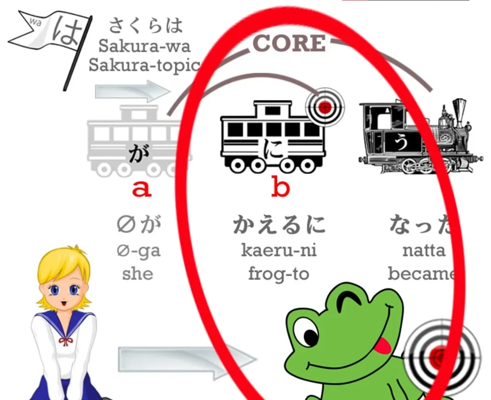
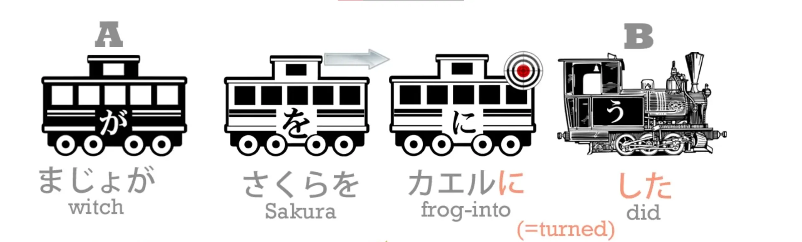
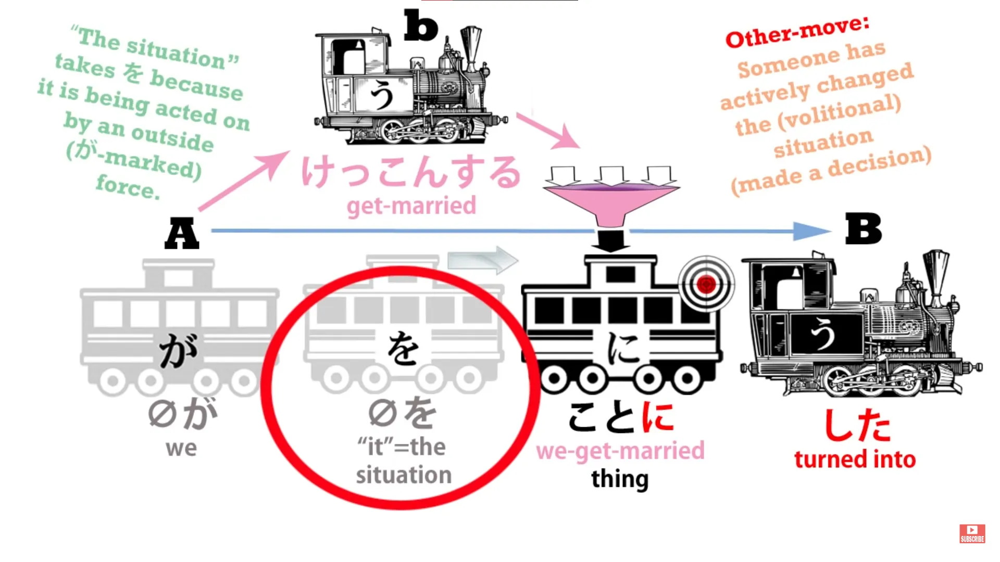
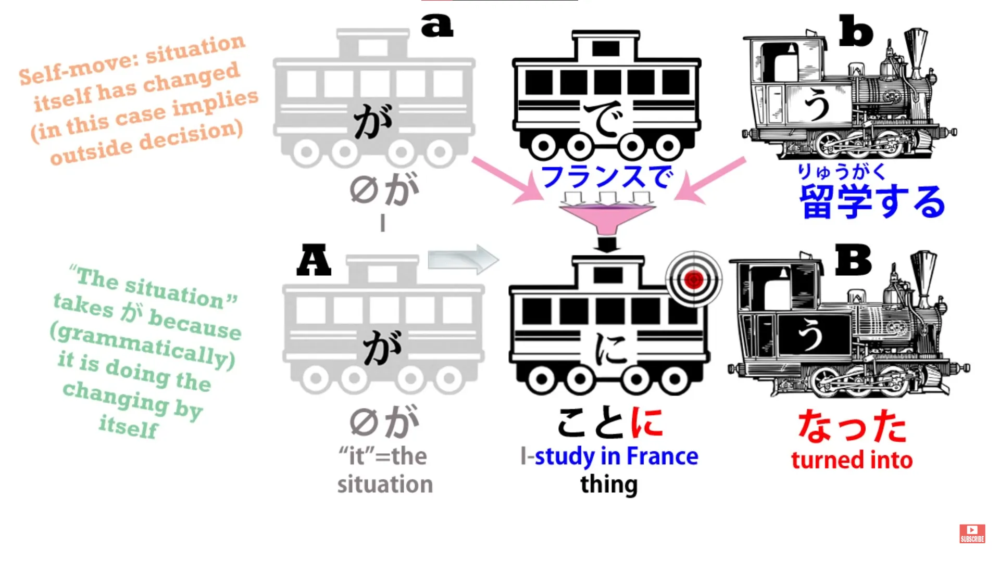
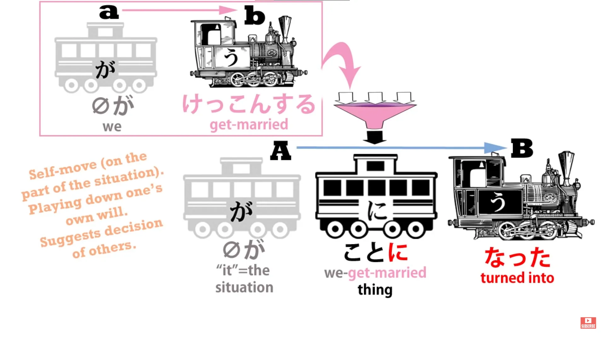
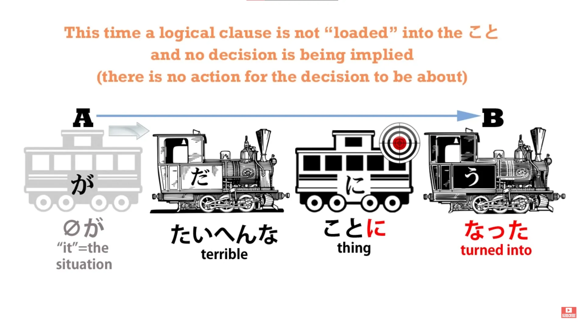
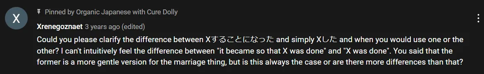
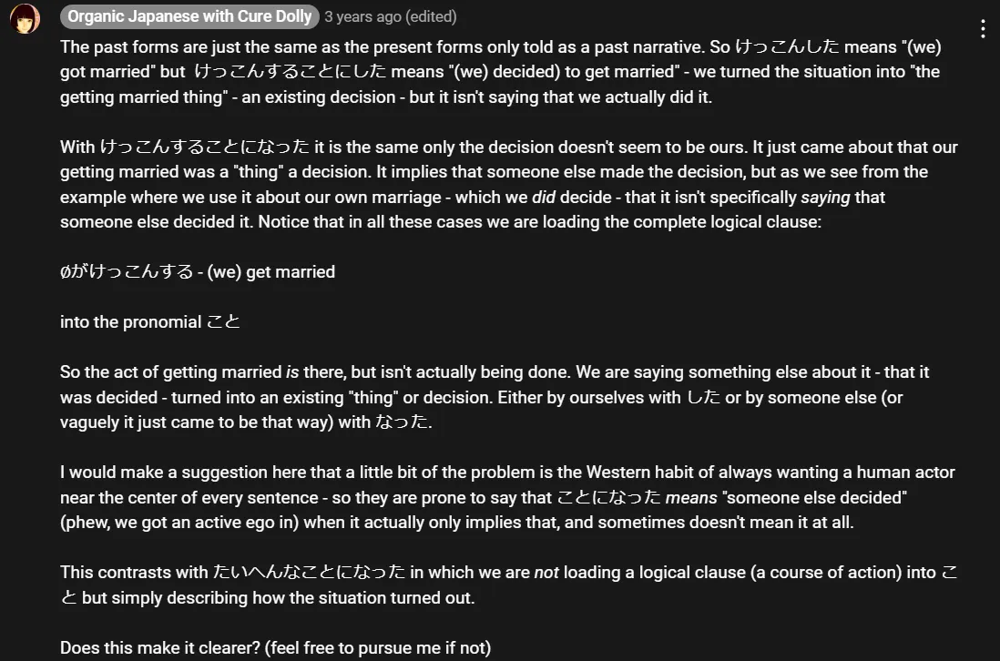
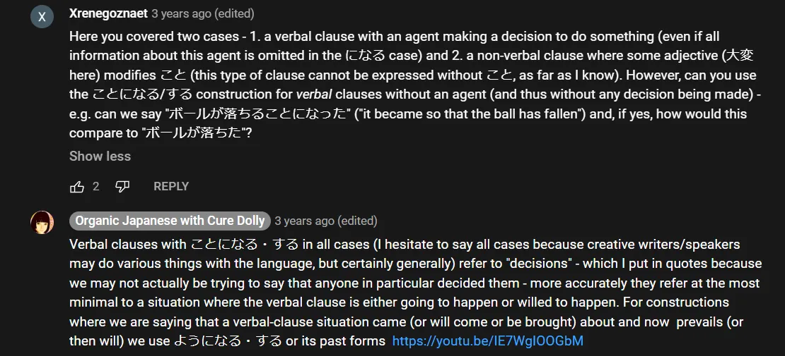

# **29. ことにする &amp; ことになる**

[**Pelajaran 29: Koto ni Suru, Koto ni Naru. Logika sederhana di baliknya.**](https://www.youtube.com/watch?v=sH3iGBkA93w&amp;list;=PLg9uYxuZf8x_A-vcqqyOFZu06WlhnypWj&amp;index;=31&amp;pp;=iAQB)

こんにちは。

Hari ini kita akan membahas <code>ことにする</code> dan <code>ことになる</code>. Minggu lalu kita membahas <code>ようにする</code> dan <code>ようになる</code> dan kita telah merangkum secara singkat fakta bahwa ketika kita mengatakan <code>(something)になる</code> , itu berarti hal yang kita bicarakan berubah menjadi apa pun yang ditandai dengan に.

Jadi, jika kita mengatakan <code>さくらはカエルになった</code>, kita berarti mengatakan bahwa Sakura berubah menjadi katak.

Jika kita mengatakan <code>にする</code>, kita berarti mengatakan bahwa seseorang dengan sengaja mengubah hal yang sedang kita bicarakan menjadi kata benda yang ditandai dengan に. Jadi, jika kita mengatakan <code>まじょがさくらをカエルにした</code>, kita berarti mengatakan <code>the witch turned Sakura into a frog.</code>

Lalu, bagaimana dengan <code>ことにする</code> dan <code>ことになる</code>? Kita tahu bahwa <code>こと</code> berarti <code>thing</code>, bukan benda konkret seperti buku atau pensil *(= もの)* tetapi sesuatu yang abstrak, suatu situasi, atau keadaan. *(= こと)* Jadi, jika kita mengatakan <code>けっこんすることにした</code>, kita secara harfiah mengatakan: Itu menjadi hal menikah.

Jelas kita harus menggunakan subjek tak terlihat di sini, karena sesuatu harus menjadi sesuatu. Jadi, apa <code>it</code>?

Nah, <code>it</code> adalah apa yang mungkin dimaksud dalam bahasa Inggris: <code>the situation / the circumstance</code>. <code>The circumstance turned into one in which we&#x27;re getting married/in which getting married is the thing.</code> Kita harus menggunakan <code>こと</code> di sini karena, seperti yang Anda ketahui, kita tidak bisa menempelkan Partikel logis &quot;に&quot;, atau Partikel logis lainnya, ke apa pun kecuali kata benda.

Jadi, kita menggunakan <code>けっこんする</code> sebagai pengubah untuk <code>こと</code> agar kita mendapatkan kata benda yang menggambarkan situasi atau keadaan menikah. Jadi, apa artinya? <code>We turned the situation into the thing of getting married</code> berarti <code>We decided to get married</code> / <code>We brought about a situation in which getting married was the thing</code>.

Dan buku teks akan memberitahu Anda bahwa <code>ことにする</code> berarti <code>decide (something)</code>, dan sebenarnya tidak sesederhana itu, seperti yang akan kita lihat sebentar lagi. Namun, jika kita mengatakan <code>フランスで留学することになった</code>, kita sebenarnya <code>It became the thing of studying in France</code>, yang sebenarnya berarti <code>It came about that I am going to study in France</code>.

Situasinya berubah dari keadaan di mana saya tidak akan belajar di Prancis menjadi keadaan di mana saya akan belajar di Prancis.

Sekarang, karena <code>ことにする</code> merupakan tindakan yang disengaja yang dilakukan oleh siapa pun yang mengambil keputusan, <code>ことになる</code> dalam banyak kasus dianggap menyiratkan keputusan yang disengaja. Jadi, kita bisa menerjemahkan ini sebagian besar waktu sebagai <code>They&#x27;re sending me to France to study</code> / <code>It&#x27;s been decided that I&#x27;m going to France to study.</code>

Namun, hal yang perlu diperhatikan di sini adalah tidak ada penyebutan nyata mengenai keputusan oleh siapa pun, dan dalam kasus ini tidak masalah jika kita mengasumsikan bahwa itulah artinya, karena kemungkinan besar memang demikian. Beberapa orang akan mengatakan <code>けっこんすることになった</code>, yang kira-kira berarti &quot;Sudah diputuskan bahwa kita akan menikah&quot; atau, secara lebih harfiah, &quot;Telah terjadi bahwa kita akan menikah&quot;.

Dan alasan mengatakannya demikian adalah bahwa, meskipun di zaman sekarang ini, orang-orang yang memutuskan bahwa mereka akan menikah hampir selalu adalah orang-orang yang benar-benar akan menikah, hal itu terdengar sedikit kurang tegas, sedikit kurang egois, bukan berarti <code>we&#x27;ve decided...</code> tetapi hanya untuk mengatakan <code>It&#x27;s been decided...</code> atau <code>It&#x27;s come about...</code> Dan saya harus mengatakan bahwa itu terdengar sedikit lebih menyenangkan bagi saya juga, tetapi saya hanyalah seorang android, jadi apa yang saya tahu?

Namun, kita juga bisa mengatakan <code>たいへんなことになった</code>, dan artinya adalah <code>It became — the situation became — a terrible thing</code>. Dan ini tidak mengandung implikasi bahwa ada orang yang memutuskan bahwa itu seharusnya menjadi hal yang buruk.

Ini tidak menyiratkan sebuah keputusan, dan tidak ada alasan mengapa harus demikian, karena tidak ada penyebutan keputusan di mana pun dalam <code>ことにする</code> atau <code>ことになる</code>.

Dalam banyak kasus, sebuah keputusan tersirat, tetapi dalam kasus seperti ini — dan ada banyak kali ketika kamu akan melihat <code>ことになる</code> digunakan dengan cara ini — yang disampaikan hanyalah bahwa situasi tersebut terjadi, bukan bahwa ada orang yang memutuskan bahwa situasi tersebut harus terjadi. Inilah mengapa penting untuk mempelajari struktur dalam bahasa Jepang, karena jika kita hanya disuguhi sedikit bahasa Jepang dan sedikit bahasa Inggris — <code>ことになる</code> artinya <code>it is decided</code> — ya, kadang-kadang benar dan kadang-kadang tidak.

Hal penting yang perlu diketahui adalah apa yang sebenarnya terjadi dalam kalimat tersebut. Dengan begitu, kita dapat membuat penilaian yang masuk akal sendiri mengenai apa yang dimaksud ketika melihatnya dalam anime, buku, atau percakapan.

::: info
Saya akan menyertakan penjelasan tambahan dari Dolly- 先生, sebagai tanggapan atas komentar mengenai ini ことになる / する, yang kemudian dia pin, karena menurut saya hal ini bisa sedikit rumit.

  
Lanjut ke - tautan ini untuk Pelajaran 28,  

*Semoga ini sedikit membantu jika penjelasan pelajaran tadi agak membingungkan, Anda bisa membaca komentar lain [**di bawah video**](https://www.youtube.com/watch?v=sH3iGBkA93w&amp;list;=PLg9uYxuZf8x_A-vcqqyOFZu06WlhnypWj&amp;index;=31&amp;pp;=iAQB) jika Anda mau, mungkin komentar lain juga bisa membantu.*
:::
