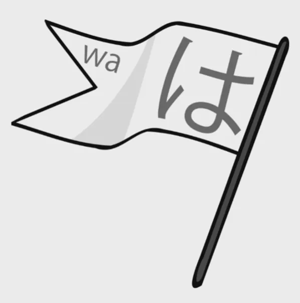
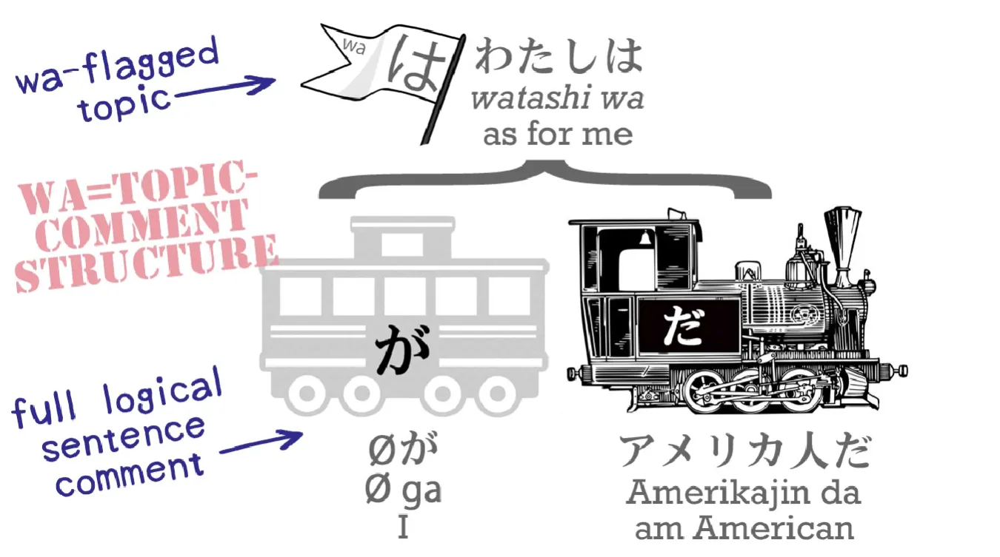
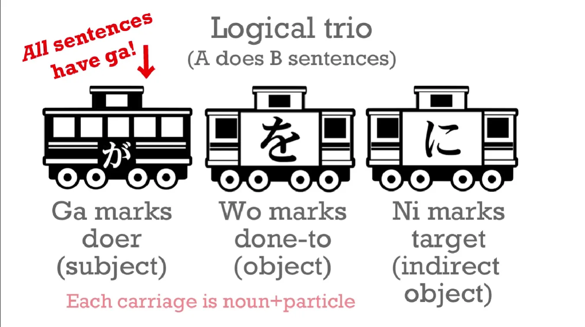
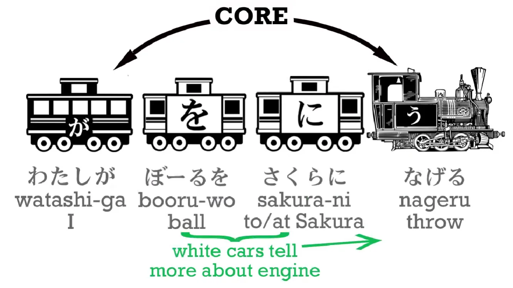
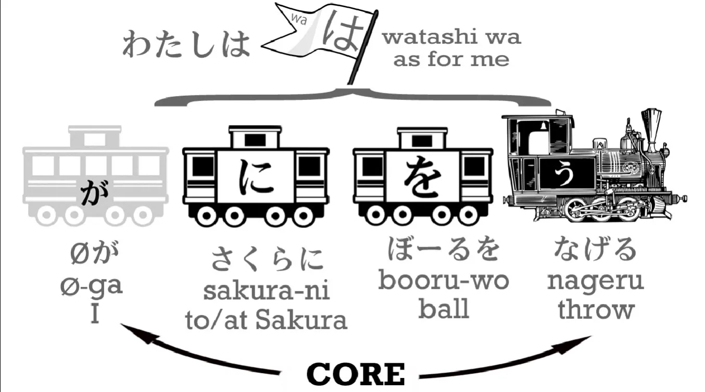

# **3. Partikel &quot;は&quot;**

[**Pelajaran 3: Rahasia partikel &quot;WA&quot; yang tak pernah diajarkan di sekolah. Bagaimana &quot;WA&quot; dapat menentukan keberhasilan atau kegagalan kemampuan bahasa Jepang Anda**](https://www.youtube.com/watch?v=U9_T4eObNXg&amp;list;=PLg9uYxuZf8x_A-vcqqyOFZu06WlhnypWj&amp;index;=3&amp;ab;_channel=OrganicJapanesewithCureDolly)

こんにちは。

Selamat datang di Pelajaran 3. Beberapa dari Anda yang sudah pernah belajar bahasa Jepang mungkin bertanya-tanya bagaimana saya bisa menyelesaikan dua pelajaran penuh tanpa menggunakan atau bahkan menyebut partikel &quot;は&quot; *(selalu dibaca sebagai &quot;wa&quot;)*. Saya sangat menyadari bahwa kebanyakan kursus langsung memperkenalkan &quot;は&quot; sejak awal. <code>わたしはアメリカ人だ</code> <code>ペンはあおい.</code> Dan ini benar-benar ide yang sangat buruk karena membuat kalian sama sekali tidak jelas tentang apa yang sebenarnya dilakukan partikel-partikel tersebut dan tentang struktur logis kalimat.

Namun, kita sekarang siap untuk mempelajari partikel &quot;は&quot; dan mengetahui apa yang dilakukannya, serta—sama pentingnya—apa yang tidak dilakukannya. **Partikel &quot;は&quot; tidak pernah bisa menjadi bagian dari kalimat inti. Ia tidak pernah bisa menjadi salah satu dari gerbong hitam**, **mobil utama A** (hal yang kita bicarakan) **atau engine B** (hal yang kita bicarakan tentangnya).

**Partikel ini juga tidak bisa menjadi mobil putih, karena mobil putih seperti mobil &quot;を&quot;, merupakan bagian dari struktur logis kalimat.**

**Dan kata benda yang ditandai dengan は tidak pernah menjadi bagian dari struktur logis kalimat. は adalah partikel non-logis.**

Jadi, jika &quot;は&quot; bukan mobil hitam atau mobil putih, jenis gerbong apa itu? Sebenarnya, itu bukan gerbong sama sekali. Sebuah kata benda yang ditandai dengan &quot;は&quot; terlihat seperti ini…

Benar, itu adalah bendera. Mengapa kita menggambarkannya sebagai bendera? Karena itulah fungsi は. **Ia menandai sesuatu sebagai topik kalimat. Ia tidak mengatakan apa pun tentangnya. Itulah fungsi kalimat logis. Wa hanya menandai topik.**

Sekarang, beberapa buku teks akan memberitahu Anda bahwa kalimat seperti <code>わたしはアメリカ人だ</code> secara harfiah berarti <code>As for me, I am an American</code>, dan itu benar sekali. Jika mereka tetap berpegang pada logika itu dan menerapkannya secara konsisten, kita tidak akan mengalami masalah ini.

Jadi, <code>わたし/私は</code> berarti <code>as for me</code>. <code>アメリカ人だ</code> berarti <code>=American</code> atau <code>am American</code>. Jadi seperti yang Anda lihat, pada kalimat seperti ini ada yang kurang, baik dalam bahasa Jepang maupun bahasa Inggris. Kita tidak bisa mengatakan <code>as for me, am American</code>. Kita juga tidak bisa memiliki kalimat tanpa subjek (A car), tanpa pelaku yang ditandai dengan &quot;が&quot;. Jadi, jika kita memasukkan subjek (A car), kalimatnya menjadi masuk akal baik dalam bahasa Inggris maupun Jepang.

<code>私は(**zeroが)**アメリカ人だ</code> – <code>As for me, (**I)** am an American.</code>Sekarang, beberapa dari kalian mungkin berkata, &quot;Bukankah ini terlalu rumit? Tidak bisakah kita berpura-pura bahwa **わたしは

** adalah subjek utama kalimat ini?&quot; Dan jawabannya adalah <code>**No**</code>. Karena meskipun hal itu berfungsi dalam kasus ini dan beberapa kasus lain, hal itu tidak berlaku di setiap kasus, dan itulah mengapa kita benar-benar tidak boleh melakukannya.

Mari kita ambil contoh. Ada lelucon lama di kalangan pelajar bahasa Jepang dan hal itu hanya mungkin terjadi karena buruknya pengajaran bahasa Jepang. Leluconnya adalah: Sekelompok orang sedang makan di sebuah restoran dan mereka sedang mendiskusikan apa yang akan mereka makan, lalu seseorang berkata, <code>わたしはうなぎだ</code>. Unagi/うなぎ berarti belut, jadi leluconnya adalah orang ini secara harfiah telah mengatakan, <code>I am an eel</code>.

Lagi pula, jika <code>わたしはアメリカ人だ</code> berarti <code>I am an American</code>, maka <code>わたしはうなぎだ</code> pasti berarti <code>I am an eel</code>. Itu logika yang benar-benar sempurna – **kecuali bahwa <code>わたしはアメリカ人だ</code> tidak berarti <code>I am an American</code>. Artinya <code>As for me, I am an American</code>.**

Seperti yang kita ketahui, nilai default dari kata ganti tak terlihat, subjek tak terlihat, adalah <code>私/わたし</code>, tetapi itu bukan satu-satunya nilainya. Nilainya bergantung pada konteks.

---

Dalam <code>わたしはアメリカ人だ</code> (<code>As for me, I am an American</code>) nilai dari subjek tak terlihat memang <code>私/わたし</code>. Namun dalam <code>わたしはうなぎだ</code>, yang <code>わたしは(**zeroが)**うなぎだ</code>, nol bukanlah <code>私</code>. Nol adalah <code>it</code>. <code>It</code> adalah hal yang sedang kita bicarakan, subjek percakapan: apa yang akan kita makan untuk makan malam.

Dan hal ini akan memengaruhi berbagai jenis kalimat seiring kemajuan kita dalam bahasa Jepang. Jadi, yang akan kita lakukan sekarang adalah mengambil salah satu mobil lagi, melihatnya, dan kemudian melihat bagaimana semuanya bekerja sama dengan &quot;は&quot;.

Mobil yang akan kita perkenalkan hari ini adalah mobil putih, dan ini adalah mobil &quot;に&quot; (ni). Mobil ini membentuk semacam trio bersama &quot;が&quot; (ga) dan &quot;を&quot; (wo). Dalam <code>A does B</code> kalimat, が memberi tahu kita siapa yang melakukan tindakan, を memberi tahu kita apa yang menjadi objek tindakan, dan **に memberi tahu kita sasaran akhir dari tindakan tersebut**. Sekarang, kita tidak selalu memiliki を; kita tidak selalu memiliki に.

Namun, mari kita ambil kalimat を ini: <code>わたしがボールをなげる</code>

ボール

&quot;is ball&quot; dan &quot;なげる

&quot; berarti &quot;melempar&quot;. Jadi ini adalah, <code>I throw a ball</code>. Kalimat intinya adalah <code>I throw</code> – <code>わたしがなげる</code>, dan mobil putih memberi tahu kita apa yang saya lempar: itu adalah bola.

Sekarang, jika kita mengatakan, <code>わたしがボールをさくらになげる</code>, ini berarti <code>I throw a ball at Sakura</code> (atau <code>to Sakura</code>). **Sakura adalah tujuan, sasaran, dari lemparan saya.**

Dan **sangat penting untuk dicatat di sini bahwa Partikel logis – が, を, dan に – lah yang memberi tahu kita apa yang sedang terjadi. Urutan kata-kata tidak terlalu penting seperti halnya dalam bahasa Inggris. Yang penting adalah Partikel logisnya.**

Jadi jika saya mengatakan, <code>わたしにさくらがボールをなげる</code>, saya berarti mengatakan, <code>Sakura throws the ball at me</code>.

Jika saya mengatakan, <code>ボールがわたしにさくらをなげる</code>, saya bermaksud mengatakan, <code>The ball throws Sakura at me</code>. Itu tidak masuk akal, tapi mungkin kita ingin mengatakannya dalam novel fantasi atau semacamnya.

**Kita bisa mengatakan apa saja dalam bahasa Jepang selama logika partikel logisnya benar.** Tapi sekarang mari kita masukkan &quot;は&quot; ke dalam kalimat ini: <code>わたし**は**さくらにボールをなげる.</code> Ini adalah <code>わたし**は**(zeroが)さくらにボールをなげる</code>. Seperti yang kita tahu, artinya adalah <code>As for me, I throw the ball at Sakura</code>.

Sekarang mari kita tambahkan partikel &quot;は&quot; ke bola: <code>ボールは私がさくらに**(zeroを)**なげる</code>. Yang kita katakan sekarang adalah <code>As for the ball, I throw it at Sakura</code>.

Hal penting yang perlu diperhatikan di sini adalah bahwa ketika kita mengganti partikel logis dari satu kata benda ke kata benda lain, kita mengubah apa yang sebenarnya terjadi dalam kalimat, **tetapi ketika kita mengganti partikel non-logis &quot;は&quot; dari satu kata benda ke kata benda lain – saya bisa menggantinya dari &quot;saya&quot; menjadi &quot;bola&quot; – hal itu tidak mengubah logika kalimat. Hal itu memengaruhi penekanan: Sekarang saya sedang membicarakan bola, <code>as for the ball...</code>**

---

Yang terjadi pada bola adalah saya melemparkannya ke arah Sakura, tetapi siapa yang melakukan apa, dan dengan apa mereka melakukannya serta kepada siapa mereka melakukannya, **tidak ada yang berubah ketika Anda mengganti partikel &quot;は&quot;** dan itulah perbedaan antara Partikel logis dan Partikel non-logis.