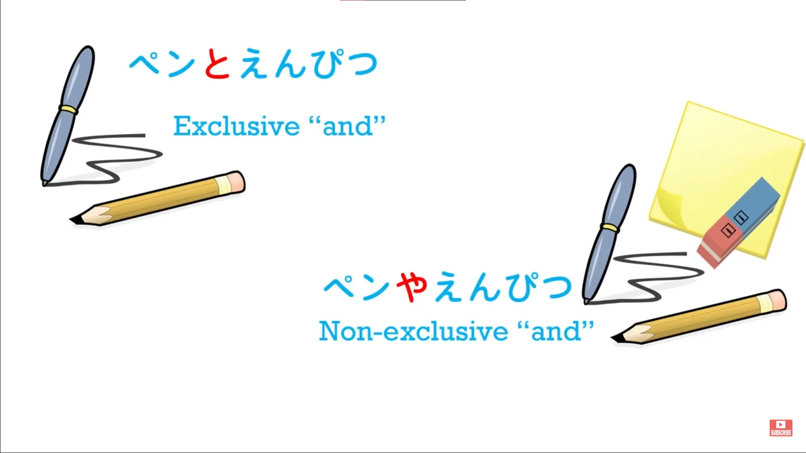
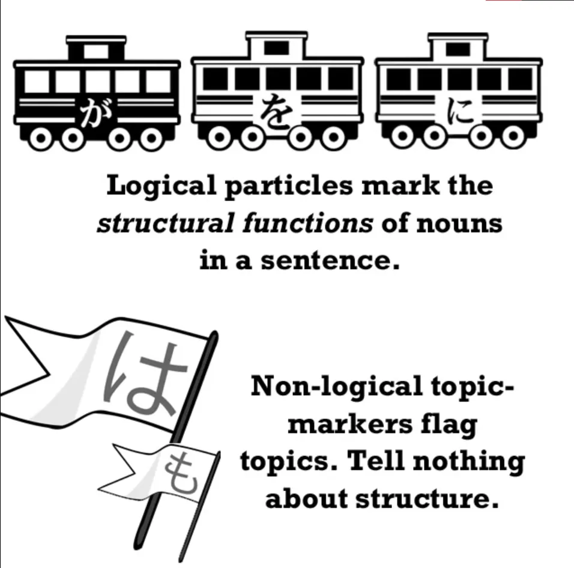
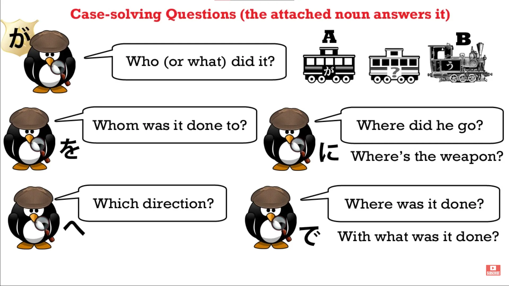

# **30. Kalimat Kondisional dalam Bahasa Jepang: と**

[**Pelajaran 30: Kalimat kondisional dalam Bahasa Jepang: と TO. Apa yang tidak dijelaskan dalam buku pelajaran.**](https://www.youtube.com/watch?v=IkolA524WC0&amp;list;=PLg9uYxuZf8x_A-vcqqyOFZu06WlhnypWj&amp;index;=32&amp;pp;=iAQB)

こんにちは。

Hari ini kita akan mulai membahas kalimat bersyarat dalam bahasa Jepang. Kalimat bersyarat adalah ketika Anda mengatakan sesuatu seperti <code>If...</code> atau <code>When...</code> Dan dalam bahasa Jepang terdapat sejumlah kalimat kondisional yang berbeda, dan hal ini dapat menimbulkan kebingungan bagi para pembelajar. Manakah yang harus kita gunakan, kapan, dan mengapa?

Seperti biasa, kita cenderung mendapatkan daftar hal-hal ini dari buku teks dengan instruksi yang rumit, dan seperti biasa, akan sangat membantu jika kita dapat memahami logika di baliknya. Jadi, dalam pelajaran ini kita akan mulai dengan kalimat bersyarat と. Nah, kita sudah pernah membahas と ini.

Ini adalah <code>exclusive and</code> partikel. Saya tidak sedang membicarakan logika Boolean di sini. Saya sedang membicarakan fakta bahwa bahasa Jepang memiliki dua kata untuk <code>and</code> yang digunakan untuk menghubungkan dua kata benda.

Salah satunya adalah や, dan や sama dengan <code>and</code>. Artinya satu hal <code>and</code> yang lain <code>and</code> mungkin juga hal-hal lain. Jika kita mengatakan <code>hat and coat</code>, kita mungkin saja memakai sepatu, rok, celana, dan barang-barang lain juga, tetapi kita hanya mengatakan <code>hat and coat</code>.

Dalam bahasa Jepang, jika kita mengatakan <code>ペンや本</code> – <code>pen and book</code> – kita bermaksud mengatakan, sama seperti dalam bahasa Inggris <code>and</code>, <code>a pen and a book and maybe some other things and maybe not</code>. Tetapi jika kita mengatakan <code>ペンと本</code>, itu bersifat eksklusif.

Kita mengatakan <code>pen and book and nothing else</code>. Nah, ini penting untuk dipahami karena ini persis sama dengan と yang kita gunakan sebagai kalimat bersyarat. Buku-buku pelajaran cenderung memperkenalkan と ini seolah-olah itu sesuatu yang berbeda dari <code>and</code> と, tetapi sebenarnya tidak – keduanya sama.

Ada と lain, yaitu partikel kutipan yang telah kita bahas secara mendalam dalam lebih dari satu pelajaran. Itu terpisah dari <code>and</code> と. Namun, partikel と dalam kalimat bersyarat bukanlah hal yang terpisah: itu adalah と yang sama. Dan ketika kita memahami hal itu, akan jauh lebih mudah untuk melihat apa yang terjadi dengan kalimat bersyarat ini.

Sekarang, satu hal lagi yang perlu kita ketahui adalah bahwa と ini adalah partikel, tetapi bukan partikel logis. Dan itu juga bukan partikel non-logis.

Apa yang saya maksud dengan ini? Nah, partikel logis adalah partikel yang menandai kasus suatu kata benda. Sekarang, Anda tidak perlu tahu apa artinya itu – tidak penting untuk memahami pengetahuan teoretis tersebut.

Artinya, dalam bahasa yang sederhana, partikel tersebut memberi tahu kita apa yang dilakukan kata benda dalam kalimat tersebut dalam kaitannya dengan kata benda lain dan dalam kaitannya dengan kata kerja. Partikel &quot;が&quot; memberi tahu kita bahwa kata benda tersebut sedang menjadi atau melakukan sesuatu; partikel &quot;を&quot; memberi tahu kita bahwa kata benda tersebut sedang mengalami sesuatu; partikel &quot;に&quot; memberi tahu kita bahwa kata benda tersebut adalah sasaran.

Jadi, fungsi partikel logis adalah memberi tahu kita siapa yang melakukan apa kepada siapa, di mana, dan kapan. Partikel non-logis は dan も menandai topik, yang bukan merupakan konstruksi logis. Mereka memberi tahu kita kata benda mana yang sedang dibicarakan, tetapi tidak memberi tahu kita peran apa yang dimainkannya dalam kalimat.

Sekarang, poin tentang Partikel logis adalah bahwa mereka harus melekat pada kata benda. Mereka tidak bisa melakukan apa pun selain melekat pada kata benda. Dan ini jelas, karena itulah fungsinya – untuk memberi tahu kita peran apa yang dimainkan kata benda dalam kalimat.

と bukanlah partikel logis dan oleh karena itu, meskipun dapat melekat pada kata benda, partikel ini juga dapat melekat pada klausa logis dan itulah yang memungkinkannya menjadi kalimat bersyarat. Baiklah. Sekarang kita sudah cukup memahami untuk melanjutkan.

Jika saya mengatakan, <code>冬になると寒くなる</code> – <code>When it becomes winter (or, if it becomes winter) it gets cold.</code> Jadi mengapa ini terkait dengan <code>exclusive and</code> fungsi &quot;と&quot;? Hal ini terkait dengannya karena yang kita katakan adalah bahwa hanya ada satu kemungkinan, hanya satu hasil yang dapat terjadi dari apa yang kita bicarakan.

Jika musim dingin datang, cuaca akan menjadi dingin – tidak ada kemungkinan lain. Jika hujan turun, tanah akan basah – tidak ada kemungkinan lain. Ini juga bisa digunakan secara hiperbolis. Kita sudah pernah membahas hiperbola sebelumnya, bukan?

Ini adalah saat Anda mengatakan sesuatu yang melebihi kenyataan. Dan bahasa manusia sering melakukannya. Jadi, seseorang mungkin berkata <code>それを食べると病気になる</code> – <code>If you eat that, you will get sick.</code>

Nah, ini tidak seperti musim dingin yang datang dan cuaca menjadi dingin atau hujan yang turun dan tanah menjadi basah. Mungkin saja kamu memakannya dan tidak sakit, tapi ini adalah hiperbola. Yang ingin kamu sampaikan kepada seseorang adalah <code>If you eat that, you will get sick</code>.

<code>If you keep playing those games, you&#x27;ll fail the exam.</code> Sekali lagi, mungkin saja orang tersebut tetap bermain game dan tetap lulus ujian, tetapi hiperbola ini <code>Do A and B will happen</code>. <code>Keep playing those games and you&#x27;ll fail the exam.</code>

<code>Eat that and you&#x27;ll get sick.</code> Kita mengemukakan sesuatu sebagai hasil yang tak terelakkan, hasil yang eksklusif, hasil yang tidak memiliki alternatif lain.

Nah, kita juga bisa menggunakan ungkapan ini と untuk menunjukkan bahwa sesuatu itu perlu. Kita bisa mengatakan <code>行かないとダメ</code> – <code>If I don&#x27;t go, it will be bad.</code>::: info &quot;
だめ

&quot; ditulis dalam katakana, biasanya hal ini dilakukan untuk gaya penulisan, agar kata-kata lebih mudah dikenali dalam teks/menghindari kebingungan, atau untuk penekanan, mungkin untuk memberikan kekuatan emosional yang lebih besar atau semacamnya.
:::

<code>勉強しないと行けない</code> – secara harfiah, <code>If I don&#x27;t study, it can&#x27;t go</code> tetapi artinya adalah <code>If I don&#x27;t study, it won&#x27;t be good</code> (<code>...it won&#x27;t do</code>, seperti yang mungkin kita katakan dalam bahasa Inggris). Dan yang sebenarnya dimaksud adalah <code>I must study / I&#x27;ve got to study</code>.

Dan sangat sering Anda akan mendengar ini berdiri sendiri. Misalnya, <code>逃げないと!</code> Dan itu hanya berarti, secara harfiah <code>We don&#x27;t run and...</code> Artinya, <code>If we don&#x27;t run...</code> Dan implikasinya di sini adalah bahwa jika kita tidak berlari, sesuatu yang buruk akan terjadi.

Jadi, jika dalam sebuah anime seseorang berkata, <code>逃げないと!</code> mereka sebenarnya hanya mengatakan <code>Run! / We must run.</code> Dan dalam konteks ini, &quot;と&quot;, karena sifatnya yang mutlak dan eksklusif, lebih kuat dan sedikit lebih kasual daripada penggunaan serupa seperti &quot;ば&quot; atau &quot;れば&quot;.

Dan kita akan membahas konstruksi &quot;ば&quot; atau &quot;れば&quot; pada kesempatan berikutnya.
