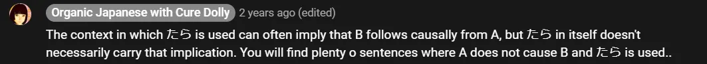

# **32. Kondisional &quot;たら&quot; dan &quot;なら&quot;**

[**Pelajaran 32: Kondisional dijelaskan dengan jelas! Tara, nara - begini cara kerjanya**](https://www.youtube.com/watch?v=fzNo53_b8W0&amp;list;=PLg9uYxuZf8x_A-vcqqyOFZu06WlhnypWj&amp;index;=34&amp;pp;=iAQB)

こんにちは。

Hari ini kita akan menyelesaikan seri mini kita tentang kalimat bersyarat dengan kalimat bersyarat &quot;たら&quot; dan &quot;なら&quot;.

## Kondisional &quot;たら&quot;

Kondisional &quot;たら&quot; sangat mudah dibentuk karena yang perlu kita lakukan hanyalah mengubah kata kerja atau kata sifat ke bentuk lampau &quot;た&quot; / &quot;だ&quot;, dan kita sudah tahu cara melakukannya. Setelah itu, kita tinggal menambahkan &quot;ら&quot; dan kalimat kondisional pun siap digunakan.

Bukan kebetulan bahwa -たら dan -だら dibentuk berdasarkan bentuk lampau, karena ini adalah satu-satunya kalimat kondisional yang dapat digunakan untuk peristiwa masa lalu. Sekarang, tentu saja, ketika kita menggunakannya untuk peristiwa masa lalu, itu sebenarnya bukan kalimat kondisional, karena kita tidak lagi mengatakan <code>if...</code>, melainkan <code>when...</code>Kita tahu bahwa syaratnya terpenuhi karena hal itu sudah terjadi. Namun, yang dilakukannya adalah menunjukkan bahwa peristiwa yang terjadi di masa lalu itu tidak terduga atau mengejutkan, dan ini karena alih-alih menggunakan salah satu cara yang lebih umum untuk menunjukkan bahwa satu peristiwa mengikuti yang lain, seperti bentuk -て

atau -から

, kita menggunakan kalimat kondisional tipe &quot;if&quot;.

Jadi, kita menekankan fakta bahwa apa yang terjadi sebenarnya mungkin saja tidak terjadi, dan memang mungkin lebih sesuai dengan ekspektasi jika hal itu tidak terjadi. Jadi, jika kita mengatakan <code>家に帰ったらさくらがいた,</code> kita mengatakan <code>When I returned to the house, Sakura was there,</code> dan jelas kita sangat terkejut menemukan bahwa Sakura ada di sana.

Dia bahkan tidak punya kunci; dia pasti masuk melalui jendela. Sakura kadang-kadang melakukan hal seperti itu, lho. Tentu saja, kita juga bisa menggunakannya sebagai kalimat kondisional sejati tentang peristiwa di masa depan, dan ketika kita melakukannya, penekanan cenderung jatuh pada apa yang akan terjadi jika syarat terpenuhi, bukan pada &quot;ば&quot; atau &quot;れば&quot;, yang lebih menekankan pada pertanyaan apakah syarat akan terpenuhi atau bahkan fakta bahwa syarat itu tidak terpenuhi.

Dan hal ini mungkin wajar, karena sama seperti bentuk lampau - たら dapat berarti kurang lebih <code>when</code> sesuatu terjadi sebanyak <code>if</code> terjadi, hal itu tentu saja dapat digunakan untuk hal-hal yang kita tidak tahu apakah akan terpenuhi atau tidak. Sebagian besar kalimat bersyarat dapat saling dipertukarkan dalam banyak kasus, tetapi jika kita berbicara tentang suatu syarat yang kita harapkan sepenuhnya akan terpenuhi, kita sebenarnya mengatakan lebih <code>when</code> daripada <code>if</code>, kemungkinan besar kita akan menggunakan - たら.

Catatan lain mengenai - たら dan - ば /- れば adalah bahwa kita terkadang menggunakan bentuk - ったら dan - ってば dengan tanda seru kecil (っ) di depannya **untuk menunjukkan rasa jengkel**. Jadi, kita mungkin mengatakan <code>さくらったら</code> atau <code>さくらってば</code>.

Dan arti harfiahnya adalah konstruksi *(yang merupakan singkatan dari)* <code>さくらと言ったら</code> atau <code>さくらと言えば</code>, dengan kata lain <code>When you speak of Sakura...</code> Dan ini sedikit mirip dengan mengatakan, <code>Oh, you</code> atau <code>When you speak of Sakura, it&#x27;s always something like this, isn&#x27;t it?</code>Ini bukan pujian, melainkan kritik, tapi tidak terlalu keras, terutama dalam kasus -ったら

. Bisa jadi cukup lucu, bercanda, atau semacam kekesalan yang ramah. Menurut pengalaman saya, -ってば

lebih cenderung mengekspresikan kekesalan yang nyata, dan bisa ditambahkan di akhir kata-kata lain selain hanya nama seseorang.

Misalnya, kita mungkin mengatakan <code>もう言ったってば</code>, yaitu <code>I&#x27;ve already said that, haven&#x27;t I?</code>

::: info
Ini mungkin catatan yang berguna tentang &quot;たら&quot;, jadi saya akan menuliskannya di sini.

:::

## Kondisional &quot;なら&quot;

Sekarang, - なら adalah bentuk kondisional yang paling mudah dibentuk, karena yang perlu kita lakukan hanyalah menempatkan - なら setelah apa yang kita katakan, dan itu akan menjadikannya kalimat kondisional. Kita dapat menempatkannya setelah kata benda dan juga setelah klausa logis yang lengkap.

Hal ini sangat nyaman dilakukan setelah kata benda dan kita tidak perlu menggunakan kata hubung, mungkin karena - な dari - なら berakar pada kata hubung itu sendiri. Ada cara-cara untuk menggabungkan kalimat kondisional lainnya ke kata benda, tetapi saya belum menyebutkannya, karena menurut saya hal itu hanya akan menjadi komplikasi yang tidak perlu pada tahap ini.

Secara umum, dengan semua hal lain dianggap sama, kita paling mungkin menggunakan -なら dengan kata benda. Sekarang, karakteristik dari -なら adalah bahwa lebih dari yang lain, ia dapat digunakan untuk kondisi masa kini dan masa depan yang benar-benar tidak diragukan sama sekali.

Jadi, misalnya, jika Sakura khawatir bahwa sesuatu mungkin tidak bisa dilakukannya, kita mungkin akan mengatakan <code>さくらなら, できる</code> dan itu berarti <code>If it&#x27;s Sakura, it will be possible</code>. Nah, tentu saja, kita tahu itu Sakura, kita sedang berbicara dengan Sakura, jadi yang sebenarnya kita katakan adalah <code>Since it&#x27;s Sakura, it will be possible</code> dan kita menggunakannya untuk meyakinkan Sakura bahwa kita percaya padanya.

Kamu mungkin bertanya arah ke stasiun; kamu mungkin berkata, <code>駅はどこですか</code> dan seseorang mungkin menjawab, <code>駅なら, あそこです</code> dan itu berarti <code>If it&#x27;s the station you&#x27;re asking for, it&#x27;s over there.</code> Sekarang, tentu saja, tidak ada keraguan nyata bahwa itu adalah stasiun yang Anda tanyakan, jadi lebih seperti <code>Since it&#x27;s the station you&#x27;re asking for, it&#x27;s over there.</code>Dalam kedua kasus ini tidak ada keraguan. Dalam kasus Sakura, kita mengekspresikan keyakinan pada dirinya sebagai pribadi — jika itu orang lain, mungkin tidak mungkin, tetapi jika itu Sakura, karena itu Sakura, maka itu akan mungkin. Dan dengan stasiun, kita sebenarnya hanya memastikan bahwa itu adalah stasiun yang sedang kita bicarakan.

Dan, seperti yang saya katakan, kalimat bersyarat seringkali dapat dipertukarkan, tetapi mengetahui karakteristik khusus masing-masing membantu kita memahami persis apa yang terjadi dan mana yang mungkin kita pilih sendiri.

::: info
Tidak ada gambar yang menonjol dalam video — sama seperti kurangnya gambar dalam pelajaran ini.
:::
