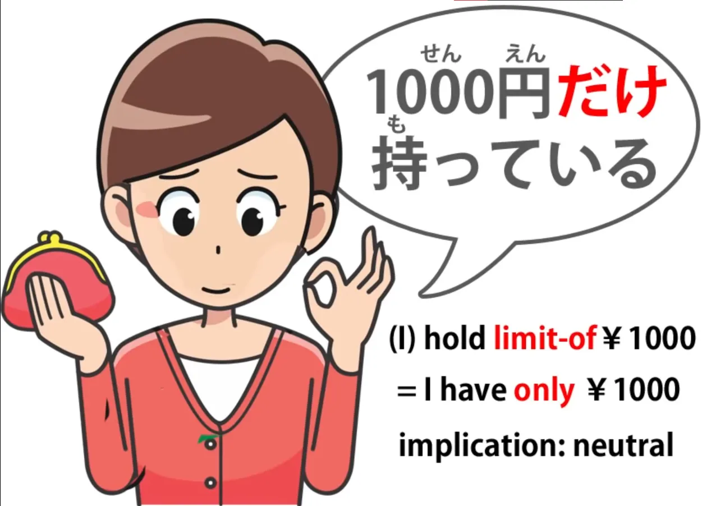
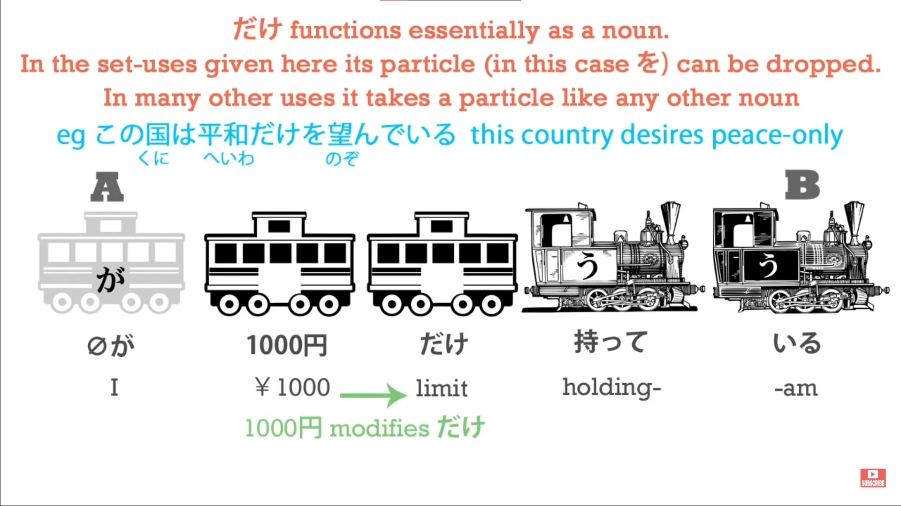
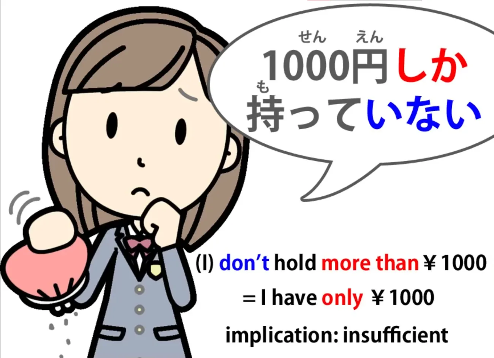
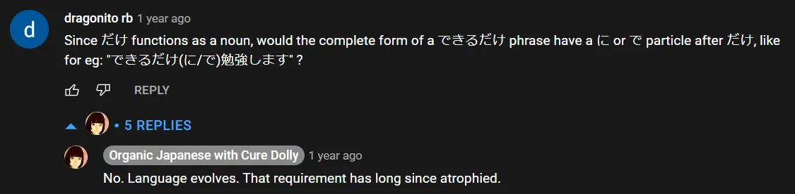

# **33. Kata-kata pembatas: だけ, しか, ばかり, のみ**

[**Pelajaran 33: Dake, shika, bakari, nomi: memahami arti kata-kata pembatas dalam bahasa Jepang.**](https://www.youtube.com/watch?v=OoJLexUR_o0&amp;list;=PLg9uYxuZf8x_A-vcqqyOFZu06WlhnypWj&amp;index;=35&amp;pp;=iAQB)

こんにちは。

Hari ini kita akan membahas istilah pembatasan: <code>だけ</code>, <code>しか</code>, <code>ばかり</code> (kita sudah membahasnya <code>ばかり</code> dalam video tersendiri, tetapi kita akan melihat bagaimana hal itu cocok di sini) dan <code>のみ</code>. <code>のみ</code> sangat mudah dan Anda tidak perlu menggunakannya, tetapi penting untuk memahaminya saat Anda menemukannya.

Banyak orang menganggap istilah-istilah ini membingungkan, tetapi itu hanya karena mereka diajarkan dengan cara yang membingungkan. Begitu Anda melihat bagaimana sebenarnya cara kerjanya, istilah-istilah ini sama sekali tidak sulit.

## だけ

Jadi, mari kita mulai dengan kata yang paling dasar, <code>だけ</code>. <code>だけ</code> berarti <code>limit</code>. Kita kadang-kadang diberitahu bahwa itu berarti <code>only</code>, dan dalam bentuk ekspresi paling dasarnya <code>only</code> adalah apa yang akan kita katakan dalam bahasa Inggris.

Namun, penting untuk disadari dalam beberapa penggunaannya yang lain bahwa arti sebenarnya adalah <code>limit</code>. Jadi, jika saya mengatakan <code>千円だけ持っている</code>, yang saya maksud adalah &quot;Saya memiliki batas seribu yen / Seribu yen adalah batas dari apa yang saya miliki&quot;.

<code>だけ</code> adalah kata benda, dan ketika kita menempatkan <code>千円</code> di belakangnya, kita menggunakan <code>千円</code> sebagai kata sifat untuk kata benda <code>だけ</code>.

Jadi, kita mengatakan bahwa saya memiliki batas seribu yen, seribu yen adalah semua yang saya miliki. Jadi, itu cukup sederhana. Kita akan kembali ke <code>だけ</code> sejenak.

Sekarang mari kita lihat <code>しか</code>.

## しか

Sekarang, <code>しか</code> memang membingungkan orang dan itu karena mereka diberi kesan bahwa artinya kurang lebih sama dengan <code>だけ</code>. Dan yang sebenarnya dimaksud adalah kebalikan dari <code>だけ</code>.

<code>しか</code> berarti <code>more than</code>.

Dan jika kita memahami hal itu, kita tidak akan pernah bingung mengenai <code>しか</code> karena hal ini sangat sederhana. Intinya adalah bahwa kata ini hanya digunakan dalam kalimat negatif. Jadi, kita selalu memiliki <code>ない</code> atau <code>ありません</code> ketika kita menggunakan <code>しか</code>, sehingga akhirnya berarti <code>not more than</code>.

Dan inilah yang membuatnya sangat mirip dengan <code>だけ</code>. Namun, jika kita tidak menyadari bahwa kata tersebut sebenarnya berarti <code>more than</code>, kita akan sangat bingung tentang bagaimana hal itu cocok secara struktural dalam kalimat.

Jadi, jika kita mengatakan <code>千円だけ持っている</code>, kita berarti mengatakan seribu yen adalah batas dari apa yang saya miliki. Jika kita mengatakan <code>千円しか持っていない</code>, kita berarti mengatakan bahwa saya tidak memiliki lebih dari seribu yen. Dan seperti yang bisa Anda lihat, ini adalah kalimat negatif dan penekanan ada pada kata negatifnya.

Ini sangat mirip dengan apa yang mungkin kita katakan dalam bahasa Inggris: kita mungkin mengatakan <code>I only have a thousand yen</code> / *(<code>千円だけ持っている</code>)* atau kita mungkin mengatakan <code>I don&#x27;t have any more than a thousand yen</code> / *(<code>千円しか持っていない</code>)*. Dan Anda bisa melihat perbedaan antara keduanya, dan perbedaannya persis sama dalam bahasa Jepang.

<code>だけ</code> tidak menyiratkan bahwa seribu yen itu banyak atau sedikit; itu tidak menyiratkan apa pun tentang hal itu, itu hanya mengatakan bahwa itulah yang saya miliki dan itu saja yang saya miliki. <code>I don&#x27;t have any more than a thousand yen/*千円しか持っていない*</code> menekankan fakta bahwa ini mungkin terlalu sedikit, atau bahwa jika Anda menginginkan lebih, Anda tidak akan mendapatkannya, atau apa pun.

Ini memiliki penekanan negatif karena kita menempatkan semua penekanan pada apa yang tidak saya miliki, bukan apa yang saya miliki. Dan itu, dalam konteks ini, adalah perbedaan antara <code>だけ</code> dan <code>しか... ない</code>.

Dan <code>しか... ない</code> juga dapat digunakan dalam situasi seperti <code>にげるしかない</code>. <code>にげる/*逃げる*</code> adalah <code>run away</code> atau <code>escape</code>; jika kita mengatakan <code>にげるしかない</code> kita mengatakan <code>There&#x27;s nothing for it but to run / There&#x27;s no other course of action but to run.</code>

Jadi, sama seperti <code>千円しかない</code> berarti (saya) tidak memiliki apa-apa selain seribu yen, <code>にげるしかない</code> berarti tidak ada yang bisa kita lakukan selain — atau lebih dari — berlari. Jadi sekarang mari kita kembali ke beberapa penggunaan lain dari <code>だけ</code>.

## Penggunaan lain dari &quot;だけ&quot;

Salah satu yang paling umum adalah <code>できるだけ</code>, yang berarti <code>as much as possible</code> atau <code>if at all possible</code>. Nah, lihatlah, pada titik ini, jika kita memikirkan <code>だけ</code> sebagai <code>only</code> kita bisa mulai bingung.

Apakah ini jenis <code>だけ</code>? Tidak, ini persis sama. <code>できるだけ</code> berarti <code>to the limit of possibility</code>.

<code>できるだけ勉強します</code> — <code>I will study if I can</code> atau <code>I will study as much as I can</code> / <code>to the limit of the possibility I will study.</code>

::: info
Jika ada yang mungkin bertanya-tanya…
:::

Penggunaan lain yang pasti akan sering Anda temui adalah <code>だけあって</code>. Sekarang ini <code>あって</code> adalah <code>ある</code> — untuk <code>be</code>. Dan kita sering diberitahu bahwa itu berarti sesuatu seperti <code>not for nothing</code>.

Jadi <code>留学しただけあって英語はうまい</code>.

Dan ini secara harfiah berarti <code>Because of the limit of the fact that she studied abroad...</code> (dan <code>because</code> di sini adalah bentuk &quot;て&quot;, yang sering mengimplikasikan penyebab dari efek yang mengikuti) <code>... her English is excellent.</code> Sekarang terjemahan yang diberikan kepada kita adalah <code>Not for nothing did she study abroad, her English is excellent.</code>

Tapi yang sebenarnya dikatakan di sini adalah <code>Precisely because and only because she studied abroad, her English is excellent.</code> Sekarang, Anda mungkin berpikir saya terlalu mempermasalahkan hal-hal kecil di sini dan terlalu kaku soal makna yang tepat.

Tapi mari kita ambil contoh lain. <code>安いだけあってすぐに壊れちゃった</code> Sekarang, ini berarti <code>Because of the limit of its being cheap, it quickly broke.</code>

Sekarang, tidak masuk akal untuk mengatakan di sini, bukan, <code>Not for nothing was it cheap, it broke quickly.</code> Yang sebenarnya kita katakan adalah <code>Precisely because it was cheap, it broke quickly.</code>

Itu <code>だけ</code> menggunakan fungsi pembatas untuk membatasi sesuatu menjadi sesuatu yang tepat. Jika kita ingin membahas <code>only</code> aspeknya, cara kerjanya adalah bahwa yang kita katakan adalah <code>Only by studying abroad would you get that good at English</code> <code>Only something really cheap would break that quickly.</code>

Jadi begitulah cara pembatasan, <code>only</code>, fungsi <code>だけ</code> sebenarnya bekerja di sini. Kita menggunakannya untuk memberikan ketepatan pada pernyataan: <code>Precisely and only because of this the result followed</code>; <code>だけあって</code> — <code>It exists because of and limited to this fact.</code>

Sekarang mari kita masukkan <code>ばかり</code>.

## ばかり

<code>ばかり</code>, seperti yang kita ketahui, juga mengekspresikan jenis batasan yang sama. Artinya <code>just such-and-such a thing</code>. Jadi, mari kita bandingkan dengan dua yang lain.

Jika kita mengatakan <code>あのお店はパンだけ売る</code>, kita berarti <code>That shop only sells bread</code>. Jika kita mengatakan <code>あのお店はパンしか売らない</code>, kita berarti <code>That shop doesn&#x27;t sell anything but bread</code>.

Jika kita mengatakan <code>あのお店はパンばかり売る</code>, kita kembali mengatakan <code>That shop only sells bread</code> tetapi seperti yang kita ketahui dari <code>ばかり</code> pelajaran, yang mungkin kita maksudkan dengan itu adalah <code>That shop sells an awful lot of bread</code>. Mungkin saja tidak benar bahwa tempat itu hanya menjual roti, karena <code>ばかり</code> dapat digunakan secara hiperbolis.

Kita bisa mengatakan <code>東京は外人ばかりだ</code> — <code>In Tokyo there&#x27;s nothing but foreigners</code> yang tidak berarti, sama seperti dalam bahasa Inggris, bahwa benar-benar tidak ada orang Jepang di Tokyo. Artinya, ada sangat banyak orang asing di Tokyo. Jadi, kita bisa menempatkan ketiga hal ini pada skala yang bergradasi.

<code>パンしか売らない</code> menyiratkan bahwa hanya menjual roti itu sangat sedikit, tidak cukup. Mungkin kita menginginkan sesuatu selain roti tetapi tidak bisa mendapatkannya. <code>パンだけ売る</code> tidak memiliki implikasi apa pun. Itu netral.

Bisa berarti toko tersebut spesialis dalam roti dan karenanya roti di sana sangat bagus. Bisa juga berarti, memang, kita tidak bisa mendapatkan apa pun jika kita menginginkan sesuatu selain roti. Tidak ada implikasi khusus. Ini hanya secara netral mengatakan bahwa toko tersebut hanya menjual roti.

<code>パンばかり売る</code> menunjukkan bahwa ada banyak sekali roti di sana. Fakta bahwa toko ini hanya menjual roti pada dasarnya menekankan bahwa roti tersedia melimpah hingga kita mungkin secara hiperbolis mengatakan bahwa tidak ada yang lain selain roti di sana, meskipun <code>ばかり</code> pada kenyataannya mungkin saja ada.

## のみ

Dan sebelum kita mengakhiri, saya hanya akan membahas <code>のみ</code>. <code>のみ</code> sangat mudah karena artinya hanyalah <code>だけ</code> dalam arti yang paling sederhana.

Jadi kita mengatakan <code>パンだけ売る / パンのみ売る</code>. Keduanya memiliki arti yang sama. Artinya <code>only sells bread</code> tanpa implikasi khusus.

<code>のみ</code> digunakan dalam konteks formal, biasanya digunakan dalam tulisan, dan kecuali Anda mencoba menggunakan bahasa Jepang yang sangat formal, Anda tidak benar-benar perlu menggunakannya. Alasan mengapa penting untuk mengetahuinya adalah, misalnya, jika Anda akan masuk ke suatu tempat dan papan tanda memberitahu Anda bahwa hanya anggota yang diperbolehkan masuk, hal itu dapat menghindarkan Anda dari rasa malu jika Anda tahu bahwa <code>のみ</code> memiliki arti yang sama dengan <code>だけ</code>.

Dan papan tanda semacam itulah tepatnya tempat di mana mereka akan menggunakan <code>のみ</code>, karena kata tersebut cenderung digunakan dalam konteks formal dan resmi seperti ini.
