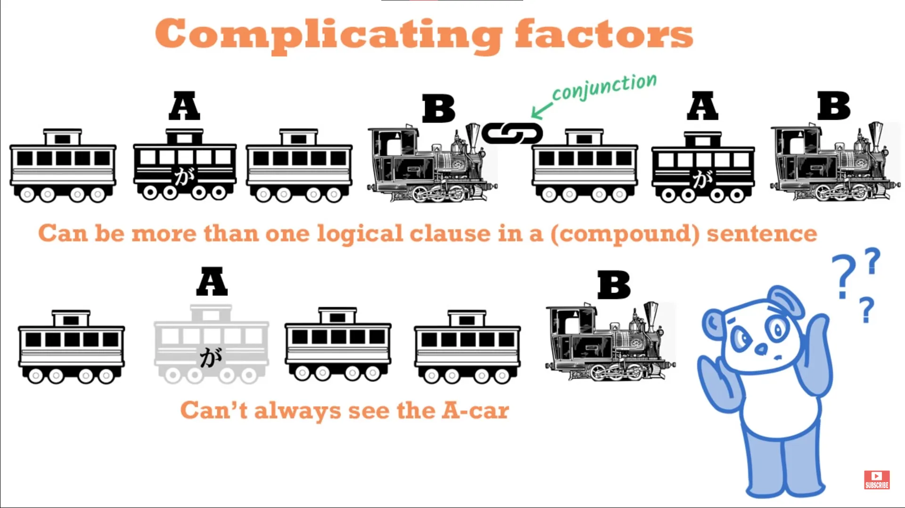
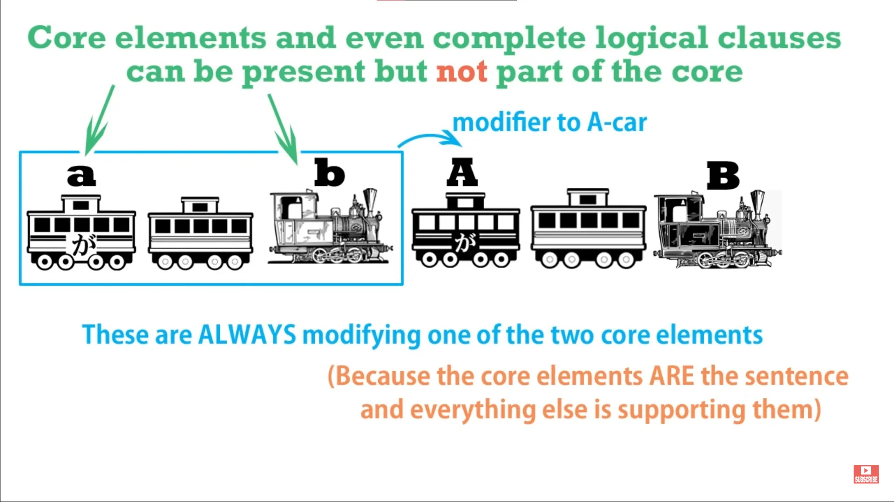
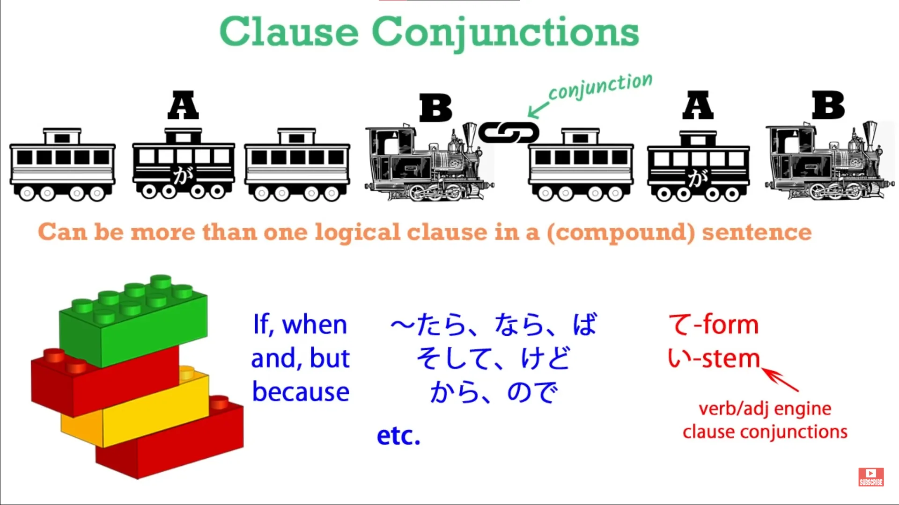
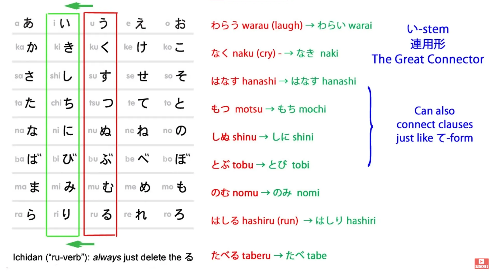
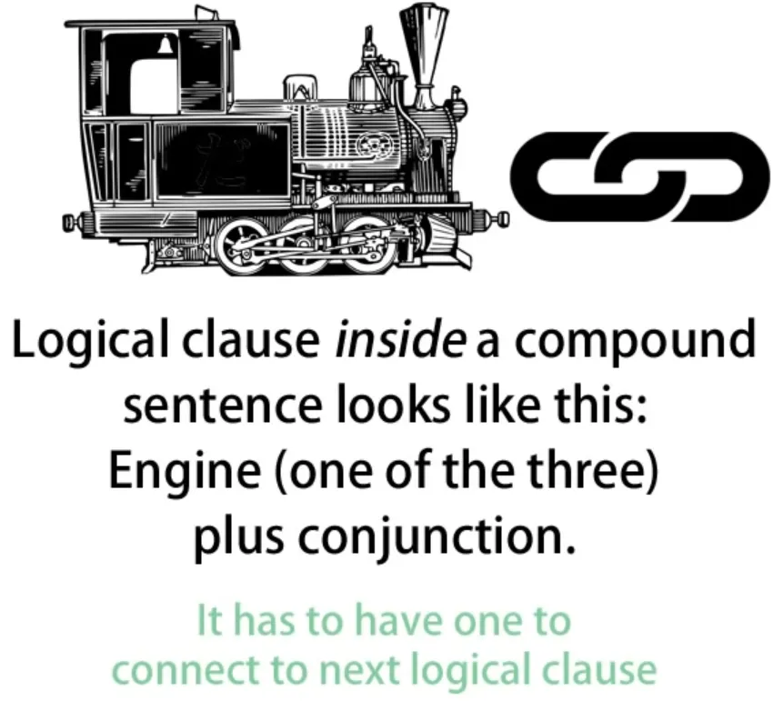
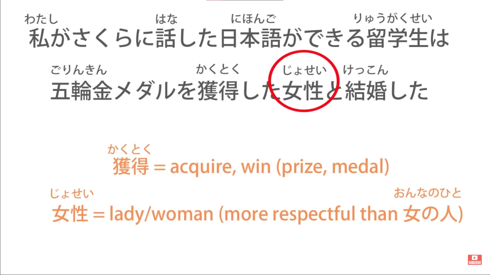
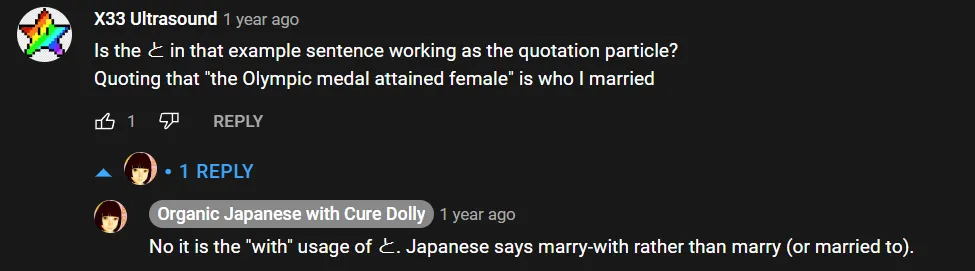

# **34. Memahami kalimat apa pun**

[**Pelajaran 34: Memahami kalimat apa pun. Teknik analisis yang ampuh.**](https://www.youtube.com/watch?v=uot49Z85wNs&amp;list;=PLg9uYxuZf8x_A-vcqqyOFZu06WlhnypWj&amp;index;=36&amp;pp;=iAQB)

こんにちは。

Hari ini kita akan membahas hal yang paling mendasar dalam bahasa Jepang. Dan, jika kita memahami hal ini, kita dapat memahami kalimat bahasa Jepang apa pun. Jika tidak, kita tidak bisa. Sesederhana itu. Dan saya memperkenalkan hal ini di pelajaran pertama kita, karena jika kita tidak memiliki ini, kita tidak akan kemana-mana.

Yang akan kita lakukan hari ini adalah mulai membahas bagaimana kita dapat menerapkan hal ini pada kalimat bahasa Jepang apa pun yang kita temukan di dunia nyata. Sekarang, inti dasar bahasa Jepang, seperti yang Anda ketahui, adalah kalimat inti bahasa Jepang. Itulah yang saya sebut sebagai &quot;A-car&quot; dan &quot;B-engine&quot;. Kedua elemen tersebut harus ada dalam setiap kalimat.

Kita selalu bisa melihat &quot;engine B&quot;. Kita tidak selalu bisa melihat &quot;mobil A&quot;, tapi ia selalu ada. Dalam bahasa Inggris, keduanya disebut subjek dan predikat, sedangkan dalam bahasa Jepang disebut &quot;主語&quot; / &quot;しゅご&quot; dan &quot;述語&quot; / &quot;じゅつご&quot;, tetapi kita akan terus menyebutnya &quot;A-car&quot; dan &quot;B-engine&quot; karena dengan cara ini kita dapat memvisualisasikan dengan tepat apa yang terjadi dalam sebuah kalimat menggunakan analogi Kereta kalimat.

Sekarang, pelajaran ini dimulai dengan pertanyaan yang diajukan oleh pendukung Gold Kokeshi saya, Pantelis Chrysafis-sama (dan saya harap saya mengucapkan nama Anda dengan benar). Itu adalah pertanyaan yang sangat sederhana, tetapi sangat bagus, sangat mendasar. Pertanyaannya hanya, <code>How do we know where a logical clause ends?</code>

Dan itu sebenarnya sama dengan pertanyaan <code>How do we identify a logical clause?</code> Kita perlu tahu di mana kalimat itu berakhir dan di mana kalimat itu dimulai. Faktor-faktor yang mempersulit hal ini adalah bahwa bisa ada lebih dari satu klausa logis dalam kalimat majemuk (tetapi seperti yang akan saya tunjukkan, itu sebenarnya tidak sesulit kelihatannya) dan juga fakta bahwa kita tidak selalu bisa melihat A-car.

Faktor lain yang memperumit adalah fakta bahwa kita akan melihat unsur-unsur klausa logis dan bahkan klausa logis lengkap yang bukan bagian dari inti kalimat. Dan jika mereka bukan bagian dari inti kalimat, yang mereka lakukan adalah memodifikasi atau memberi tahu kita lebih banyak tentang A-car atau B-engine.

Itulah satu-satunya hal yang bisa mereka lakukan, karena kalimat adalah intinya dan segala sesuatu lainnya dalam kalimat terkait dengan dan memberi tahu kita lebih banyak tentang inti tersebut. Sekarang, kalimat yang memiliki lebih dari satu klausa logis harus dihubungkan oleh suatu jenis konjungsi. Dan ini sangat penting, karena hal ini memberi kita kunci untuk melihat apakah ada lebih dari satu inti dan jika ada, di mana letaknya serta bagaimana cara kerjanya.

Dalam seri terbaru kami tentang kalimat bersyarat, kami sebenarnya sedang membahas konjungsi. Ada berbagai jenis konjungsi: dan, tetapi, ketika, jika, dll.

Dan dua jenis konjungsi lain yang perlu kita perhatikan adalah bentuk &quot;て&quot;, yang dapat menggabungkan dua klausa menjadi kalimat majemuk, seperti yang kita bahas dalam pelajaran pertama kita tentang kalimat majemuk[[11]](./11-compound-sentences- くれる - あげる -and-more-uses-of-the- て -form.md), serta akar kata kerja い. Anda telah melihat bagaimana akar kata い merupakan akar konjungtif utama di antara empat akar kata kerja.

Bentuk ini dapat menghubungkan kata benda dengan kata kerja; menghubungkan kata kerja lain dengan kata kerja; menghubungkan berbagai kata bantu dengan kata kerja; dan juga menghubungkan satu klausa logis dengan klausa lainnya. Ini sedikit lebih sastra, mungkin sedikit lebih rumit, daripada bentuk &quot;て&quot;, tetapi ini adalah hal lain yang perlu Anda perhatikan saat menyelidiki apakah ada lebih dari satu klausa logis dalam sebuah kalimat. Kita akan membahas ini lebih lanjut di pelajaran berikutnya.

Sekarang, mari kita bahas komplikasi yang mungkin timbul dan bagaimana kita dapat mengatasinya, bagaimana kita dapat menggunakan kemampuan detektif kita untuk melihat apa yang sebenarnya terjadi. Saya akan mengambil kalimat kondisional sederhana yang telah kita gunakan sebelumnya. <code>かさを持って来ればよかった</code> yang berarti &quot;Seharusnya saya membawa payung / Saya berharap saya membawa payung&quot;.

Secara harfiah artinya adalah <code>If I had taken an umbrella, it would have been good.</code> Sekarang, kita dapat dengan mudah melihat klausa logis pertama, bukan? Yaitu <code>かさを持って来れば</code>, yang secara sederhana <code>かさを持ってくる</code> — <code>bring an umbrella</code> — diubah menjadi bentuk kondisionalnya — <code>if I bring an umbrella</code> — dan itu akan diubah menjadi bentuk lampau oleh engine terakhir dalam kalimat, yang merupakan cara kerja bahasa Jepang.

Jadi, kita memiliki klausa pertama, yaitu <code>かさを持って来れば</code>. Kita tahu bahwa itu adalah klausa lengkap dan kita tahu itu akan diikuti oleh klausa kedua karena ada konjungsi di sana dalam bentuk kalimat bersyarat. Namun, yang mengikutinya hanyalah <code>よかった</code> yang merupakan bentuk lampau dari <code>いい</code> dan artinya <code>good</code>.

Apakah ini kalimat inti? Ya, benar. Kalimat pertama adalah <code>かさを持ってくれば</code> ; kalimat kedua adalah <code>(zeroが)よかった</code>. Kita tahu ini karena <code>よかった</code> adalah sebuah engine.

Itu adalah kata sifat, yaitu kata yang mendeskripsikan, dan harus mendeskripsikan sesuatu. Di mana pun ada kata sifat, kata sifat tersebut harus mendeskripsikan sesuatu. Di mana pun Anda menemukan engine B, harus ada mobil A yang sesuai dengannya.

Jadi, apa mobil A di sini? Apa yang <code>よかった</code> yang digambarkan? Apa yang ingin disampaikan <code>would have been good</code>? Ini adalah poin yang sangat penting.

Jika kita menerjemahkannya ke dalam bahasa Inggris yang sangat harfiah, yang kita katakan adalah &quot;Jika saya membawa payung, itu akan bagus.&quot; Dan inilah tepatnya yang dimaksud dalam bahasa Jepang. <code>It</code> akan bagus. Mobil A adalah <code>it</code>.

Jadi, apa <code>it</code>? Inilah poin pentingnya: <code>It</code>, atau mobil nol, tidak harus dapat didefinisikan dengan jelas, baik dalam bahasa Inggris maupun dalam bahasa Jepang. Yang <code>it</code> yang dimaksud di sini adalah <code>the circumstance / things in general (would have been good)</code>.

Dan kita melakukan hal ini dalam bahasa Jepang sepanjang waktu. Dan kita melakukannya dalam bahasa Inggris sepanjang waktu. Jadi, misalnya, jika kita mengatakan dalam bahasa Inggris <code>It&#x27;s sunny, isn&#x27;t it!</code> Dalam bahasa Jepang kita mungkin mengatakan <code>(zeroが)晴れだね!</code>

Artinya sama. Dalam bahasa Inggris kita harus mengatakan <code>It is sunny</code> — kita bisa mengatakan <code>Sunny, isn&#x27;t it?</code> tapi itu hanya karena kita menghilangkan <code>it</code>. Dan kita masih memilikinya di bagian akhir, karena kita tidak pernah mengatakan <code>Sunny, isn&#x27;t!</code>

Kita mengatakan <code>Sunny, isn&#x27;t it!</code> yang pasti merupakan singkatan dari <code>It is sunny, isn&#x27;t it!</code> Dalam bahasa Jepang kita mengatakan <code>晴れ...</code> (yang berarti <code>sunny</code> atau <code>clear</code> dalam arti langit cerah): <code>晴れだね!</code> Sekarang, <code>だ</code> adalah kopula.

Itu pasti menghubungkan <code>晴れ晴れ</code> dengan sesuatu yang lain, yaitu partikel nol kita. Dengan apa ia menghubungkannya? Nah, dalam kasus ini kita tidak tahu.

Bisa jadi hari itu — <code>The day is sunny</code>. Bisa jadi cuaca — <code>The weather is sunny</code>. Bisa jadi langit — <code>The sky is clear</code> — karena <code>晴れ</code> juga bisa berarti <code>clear</code> dalam arti langit tersebut.

Tidak masalah. Tidak masalah dalam bahasa Jepang dan tidak masalah dalam bahasa Inggris apa yang kita maksud dengan <code>it</code> ketika kita mengatakan <code>If I&#x27;d brought an umbrella, it would have been good</code> atau <code>It is sunny</code>.

Tapi kita tidak bisa tanpa itu. Kita tidak bisa tanpa itu dalam bahasa Jepang dan kita tidak bisa tanpa itu dalam bahasa Inggris. Karena baik dalam bahasa Jepang maupun bahasa Inggris, kita harus memiliki mobil A dan engine B.

Subjek dan predikat. A 主語 / しゅご dan a 述語 / じゅつご. Dalam bahasa Inggris, kita selalu harus bisa melihat keduanya.

Dalam bahasa Jepang, kita tidak perlu melihat yang pertama. Kita memang perlu melihat yang kedua. Namun, yang pertama selalu ada di sana, dan jika kita tidak memahami hal itu, kita akan mengalami kesulitan besar dalam mengidentifikasi kalimat inti, terutama saat kalimat menjadi lebih kompleks.

Jadi, langsung ke pertanyaannya, bagaimana cara menemukan akhir dari klausa logis? Nah, klausa logis utama, klausa utama kalimat, selalu yang terakhir, dan kita bisa menemukan akhirnya dengan sangat mudah karena akhir dari klausa logis adalah akhir dari kalimat.

Dalam bahasa Jepang, sebuah kalimat harus diakhiri dengan engine, yaitu kata sifat, kata hubung (<code>だ</code> atau <code>です</code>) atau kata kerja. Jadi, kata terakhir dalam kalimat akan menjadi akhir dari klausa utama kalimat, klausa akhir utama kalimat, selalu.

Itu akan menjadi hal terakhir dalam kalimat, kecuali, mungkin, satu atau dua partikel penutup kalimat seperti <code>よ</code> atau <code>ね</code> atau <code>よね</code>. Kita menyebutnya partikel penutup kalimat, tetapi dalam arti tertentu mungkin lebih tepat menyebutnya partikel yang muncul setelah akhir kalimat.

Klausul akhir adalah akhir dari kalimat logis, sedangkan partikel penutup hanyalah tambahan kecil yang kita letakkan tepat setelah akhir kalimat. Jadi, sangat mudah untuk menemukan akhir dari klausul logis terakhir dalam kalimat atau akhir dari seluruh klausul logis jika hanya ada satu klausul logis dalam kalimat.

Pertanyaan yang lebih sulit — tapi sebenarnya tidak terlalu sulit, namun pertanyaan yang bisa menimbulkan masalah adalah bagaimana kita menemukan atau bagaimana kita menghilangkan kemungkinan adanya kalimat majemuk?

Bagaimana kita tahu tidak ada klausa logis lain dalam kalimat tersebut atau, jika ada, bagaimana kita menemukannya? Dan jawabannya sekali lagi sangat sederhana dan jelas.

Sebuah klausa logis akan selalu diakhiri dengan engine: kata kerja, kata benda yang diikuti oleh kata penghubung (<code>だ</code> — tidak akan diikuti oleh <code>な</code>, karena jika kopula <code>だ</code> telah menjadi <code>な</code> maka itu haruslah sebuah pengubah, tidak bisa menjadi klausa logis itu sendiri) — sebuah kata benda dengan kopula <code>だ</code>, atau kata sifat. Dan jika itu adalah klausa sebelum klausa terakhir dalam kalimat majemuk, klausa tersebut akan diakhiri dengan penghubung.

Harus begitu, karena harus terhubung ke klausa logis berikutnya. Jadi, sekarang yang akan kita lakukan adalah melihat jenis kalimat majemuk yang bisa membingungkan orang dan kita akan melihat bagaimana cara menangani kalimat tersebut.

Jadi kalimatnya adalah &quot;私がさくらに話した日本語ができる留学生は *(zero が)* 五輪金メダルを獲得した女性と結婚した&quot; Sekarang, seperti yang Anda lihat, itu terlihat cukup rumit. Bagaimana kita menganalisisnya?

Jay Rubin—先生—yang saya hargai, menyarankan bahwa jika kita benar-benar buntu, kita harus menganalisis kalimat Jepang secara terbalik. Dan ada benarnya juga, karena kalimat Jepang memang dalam beberapa hal dan sampai batas tertentu berjalan dalam urutan terbalik dari kalimat bahasa Inggris.

Namun, kita hanya bisa melakukannya dengan kalimat tertulis. Kita tidak bisa melakukannya dengan kalimat lisan karena orang-orang biasanya tidak akan berbicara secara terbalik untuk kita. Namun, satu hal yang menurut saya berguna jika Anda merasa sangat buntu dengan sebuah kalimat adalah memastikan Anda sudah memiliki kata kerja utama atau kata hubung utama atau kata sifat utama, apa pun yang menjadi inti kalimat tersebut, dalam pikiran Anda.

Jadi, jika kita melihatnya terlebih dahulu, kita akan tahu ke mana arahnya. Dan unsur utama kalimat ini sangat jelas, bukan? Yaitu <code>結婚した</code>.

Kata kerja utamanya hanyalah <code>した</code> — <code>did</code> — tetapi itu membentuk kata kerja &quot;する&quot; dengan <code>結婚</code>; jadi, <code>結婚した</code>. Yang disampaikan kalimat ini adalah bahwa seseorang telah menikah.

Baiklah. Tapi sekarang mari kita lakukan apa yang menurut saya sebaiknya kita lakukan selama kita bisa, dan kebanyakan waktu kita memang bisa — Mulai dari awal. Baiklah.

Jadi, bagian pertama kalimat, klausa pertama: <code>私がさくらに話した</code> Nah, itu bisa jadi kalimat logis yang lengkap dengan sendirinya, bukan? <code>I spoke to Sakura.</code>

Atau bisa juga <code>I told Sakura</code> dalam hal ini kalimat tersebut tidak bisa lengkap dengan sendirinya, bukan? Karena saya harus mengatakan sesuatu kepadanya. Nah, mana yang benar dalam kasus ini?

Nah, kita tahu bahwa itu bukan klausa logis yang lengkap, <code>I spoke to Sakura.</code> Mengapa tidak? Karena tidak diakhiri dengan konjungsi apa pun, bukan?

Klausa itu langsung diikuti oleh kata benda, <code>日本語</code>. Tidak ada kata penghubung, tidak ada bentuk &quot;て&quot;, dan itu bukan akar kata &quot;い&quot; dari <code>話す</code>. Jadi kita tahu bahwa ini sebenarnya adalah kata sifat untuk sesuatu yang lain.

Jadi, apa yang kita dapatkan selanjutnya? <code>日本語ができる</code> — nah, itu berarti <code>Japanese is possible</code>. <code>日本語ができる</code> bisa menjadi kalimat lengkap tersendiri, bukan?

<code>To me, Japanese is possible.</code> Kata <code>to me</code> akan tersirat, tapi tidak apa-apa, kita sering melakukannya. Namun, kita tahu itu bukan kalimat lengkap karena tidak diakhiri dengan konjungsi apa pun.

Jadi ini juga tidak bisa menjadi klausa logis lengkap dalam kalimat majemuk. Ini pasti merupakan kata keterangan untuk sesuatu. Dan yang kita harapkan sebagai objek kata keterangan tersebut adalah seorang individu: seseorang yang bisa berbahasa Jepang.

Dan itulah tepatnya yang kita dapatkan selanjutnya: <code>留学生</code>. <code>留学生</code> adalah siswa pertukaran, biasanya dari negara asing. Jadi, <code>日本語ができる</code> memperluas <code>留学生</code> — <code>an exchange student to whom Japanese is possible / a Japanese-speaking exchange student.</code>

Dan <code>私がさくらに話した</code> mengmodifikasi semua itu. <code>The Japanese-speaking exchange student who I told Sakura about</code> Dan kemudian diikuti oleh &quot;は&quot;.

Sekarang, <code>留学生は</code> menunjukkan bahwa sangat mungkin, bukan, bahwa ini akan menjadi subjek kalimat dan bahwa subjek kalimat tersebut akan menjadi pelaku, subjek kalimatnya. Tapi mari kita lanjutkan kalimatnya dan lihat apakah memang begitu.

Sekarang kita memiliki <code>五輪金メダル</code> dan itu berarti medali emas Olimpiade. <code>五輪</code> berarti <code>five circles</code>.

<code>五輪金</code> — yang merupakan emas — <code>メダル</code> — medali emas Olimpiade — <code>を獲得した</code>. Nah, itu bukan, itu tidak bisa menjadi kalimat logis karena itu bukan kalimat logis, bukan?

Itu bukan kalimat logis tanpa pelaku, dan tidak ada pelaku yang tersirat di sini. Tapi kita memiliki pelakunya tepat setelahnya, bukan?

Jadi kita tahu bahwa di sini kita memiliki kata sifat untuk kata benda lain, bukan kalimat logis itu sendiri: <code>五輪金メダルを獲得した女性</code>. Jadi sekarang kita memiliki kata benda lain yang dimodifikasi: <code>A woman who won an Olympic gold medal</code>.

Dan sekarang kita sampai pada kata kerja utama kalimat: <code>-と結婚した</code>.
::: info
tentang と*

:::

Jadi kita benar. *(tentang asumsi は)* Kita memiliki A-car, yaitu siswa pertukaran *(dalam kalimat ini secara lebih spesifik adalah kata nol が setelah <code>留学生は</code> yang mengimplikasikan siswa pertukaran tersebut, yaitu subjek tak terlihat, sehingga subjek juga merupakan topik di sini)* yang bisa berbahasa Jepang yang saya ceritakan kepada Sakura telah menikah *(B-car - predikat)* dengan seorang wanita yang memenangkan medali emas Olimpiade.

Dan seperti yang Anda lihat, ada berbagai tindakan yang terjadi dalam kalimat ini; ada berbagai hal yang, dalam keadaan berbeda, bisa membentuk klausa logis tersendiri, tetapi tidak satupun dari mereka yang benar-benar bisa. Kita sekarang tahu bahwa ini bukanlah kalimat majemuk.

Ini adalah satu kalimat yang cukup kompleks dengan satu A-car *(zero が = 留学生)* dan satu B-engine *(結婚した).* Tempat di mana klausa logis berakhir adalah di akhir kalimat atau sebelum konjungsi.

Dan jika Anda bisa melakukannya, Anda dapat menganalisis hampir semua kalimat Jepang, seberapa rumit pun tampaknya, dan memahami apa yang terjadi dalam kalimat tersebut.

::: tip
jika masih membingungkan, saya sarankan Anda membaca komentar di bawah **[video](https://www.youtube.com/watch?v=uot49Z85wNs&amp;list;=PLg9uYxuZf8x_A-vcqqyOFZu06WlhnypWj&amp;index;=38&amp;ab;_channel=OrganicJapanesewithCureDolly).** Dengan banyak masukan, otak pada akhirnya akan memahaminya, tetapi hal ini membutuhkan usaha dan waktu. Dolly hanya bersiap untuk menyelam ke dalamnya. Pada tahap ini, Anda mungkin ingin mulai secara perlahan dengan masukan jika belum melakukannya, bersamaan dengan tata bahasa Dolly. Setelah selesai dengan transkrip, gunakanlah sebagai referensi saat menemui hal yang membingungkan atau ingin mengulang, tetapi masukan yang dapat dipahami/<code>immersion</code> adalah kuncinya **([seperti yang dianjurkan Dolly sendiri](https://learnjapaneseonline.info/2015/07/01/japanese-immersion-why-massive-input-is-necessary/))**. Dengan cara ini, Anda akan siap untuk langsung menerapkan materi di Pelajaran 45-48.
Namun, itu terserah Anda; akan lebih baik jika Anda menyiapkan alat-alat dan sebagainya sekarang setidaknya &amp; mulai setelah sekitar pelajaran 45.
Seperti yang disebutkan di halaman pertama, saya telah menulis dokumen panjang - [**LINK DI SINI**](https://docs.google.com/document/d/1kxYa53a2UjnpMZyHdU-YNuctkq6wHT3cJ00Z5poj2hY/edit#) - yang berisi situs-situs favorit saya yang memiliki ratusan sumber daya, tips, panduan, alat, dan segala hal yang sangat berguna dan beragam untuk pencelupan bahasa Jepang yang mendalam, yang mungkin akan sedikit membantu Anda.
:::
