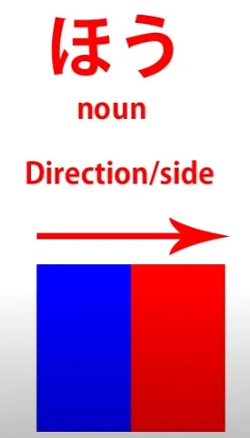
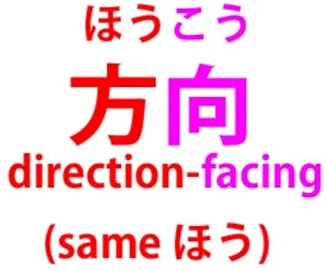
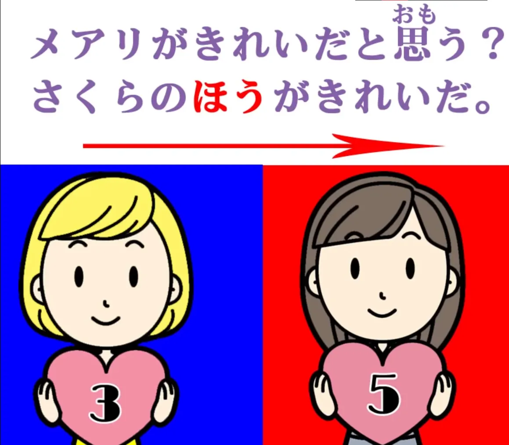
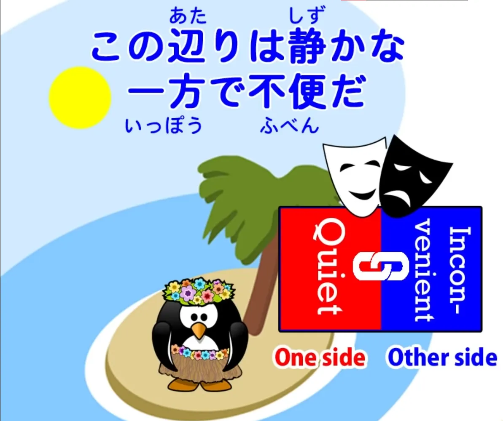
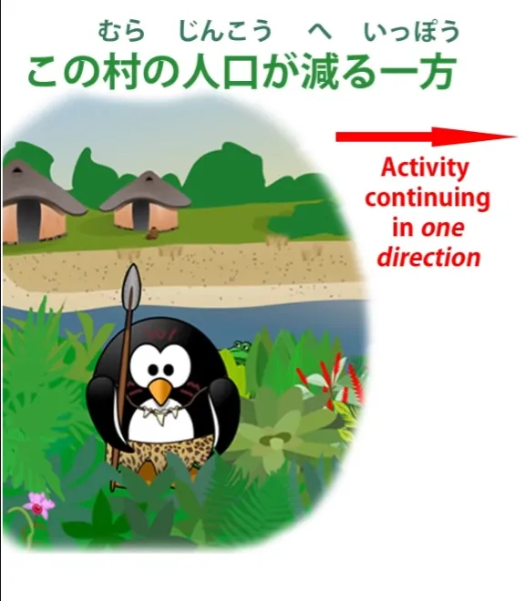

# **35. より, のほう, 一方**

[**Pelajaran 35: Yori, no hou, ippou—betapa masuk akalnya!**](https://www.youtube.com/watch?v=ma1yZwt1XAc&amp;list;=PLg9uYxuZf8x_A-vcqqyOFZu06WlhnypWj&amp;index;=37&amp;pp;=iAQB)

こんにちは。

Hari ini kita akan membahas <code>より</code> dan <code>ほう</code>. Sekarang, <code>より</code> dan <code>ほう</code> sering kali muncul bersamaan dalam kalimat seperti: <code>メアリよりさくらのほうがきれいだ.</code> Dan itu adalah cara yang agak bertele-tele untuk mengatakan <code>Sakura is prettier than Mary</code>.

Saya pikir ini adalah cara yang kurang tepat untuk memperkenalkan kedua istilah tersebut karena hal ini dapat dengan mudah menimbulkan kebingungan. Sulit untuk memahami fungsi masing-masing istilah dan bagaimana kaitannya dengan bagian kalimat lainnya. Akan jauh lebih mudah jika kita melihat kedua istilah ini secara terpisah dan independen—keduanya penting dalam konteksnya masing-masing—lalu menggabungkannya.

Jadi, mari kita mulai dengan melihat <code>より</code>.

##より

より

adalah partikel. Ini bukan salah satu partikel logis kita, jadi tidak harus melekat pada kata benda. Partikel ini bisa diletakkan setelah apa saja: kalimat logis yang lengkap, kata benda, kata sifat, kata kerja — apa pun yang kita inginkan.

Arti fisik dasarnya adalah <code>from</code>. Saat kita mengirim surat, kita mungkin berkata <code>さくらより</code> — <code>from Sakura</code>. Dan kata-kata abstrak semuanya berakar pada metafora fisik, meskipun terkadang kita melupakan metafora fisik tersebut, dan dengan kata-kata seperti ini, akan berguna untuk memulainya dengan memahami makna literal aslinya dan kemudian melihat bagaimana metafora tersebut bekerja.

Jadi <code>yori</code> berarti <code>from</code>, dan kita sudah memiliki kata lain yang berarti <code>from</code>, bukan? Dan itu adalah <code>から</code>.

Sekarang, ada perbedaan di antara keduanya, yang sangat jelas terlihat saat kita mulai menggunakannya secara metaforis. <code>から</code> menandai <code>A</code> dalam <code>A from B</code> sehingga memperlakukan <code>A</code> sebagai titik awal atau titik asal.

Jadi, jika saya mengatakan <code>日本から来ました</code>, saya berarti <code>I came (or come) from Japan / Japan is my point of origin.</code> Dan ini dalam arti tertentu berada di tengah-tengah antara makna harfiah dan fisik serta makna kiasan, karena bisa berarti secara harfiah saya baru saja datang dengan pesawat dari Jepang atau bisa menyiratkan bahwa saya orang Jepang atau bahwa saya dibesarkan di Jepang atau semacamnya.

Ketika kita beralih ke makna kiasannya yang murni, biasanya artinya <code>because</code>. Dengan kata lain, <code>A</code> adalah titik asal dari <code>B</code>. <code>寒いからコートを着る</code> — <code>Because (it&#x27;s) cold, I wear a coat</code> / <code>From the fact that (it&#x27;s) cold, I&#x27;m wearing a coat.</code>

Sekarang, <code>より</code> berarti <code>from</code> dalam arti yang sangat berbeda. Metafora arah tidak berfokus pada asal mula A dari B, melainkan pada jarak atau perbedaan A dari B. Jadi, jika kita mengatakan <code>さくらはメアリよりきれいだ</code> kita mengatakan bahwa <code>from Mary</code> Sakura cantik.

Yang kita maksudkan di sini adalah bahwa dibandingkan dengan Mary, Sakura cantik. Sekarang, hal ini memang memiliki kesamaan dengan <code>から</code> karena kita masih menggunakan Mary sebagai titik dasar, titik perbandingan.

Dan karena hal ini, karena memiliki makna komparatif, kita **tidak** mengatakan Sakura cantik tetapi Mary tidak. Kita mengatakan bahwa, dengan mengambil Mary sebagai titik perbandingan, Sakura cantik — oleh karena itu, lebih cantik, lebih menawan.

Dibandingkan dengan Mary, <code>from</code> Mary, Sakura cantik. Dan kamu perhatikan di sini bahwa kita mengatakan persis seperti yang dikatakan kalimat pertama itu, <code>メアリよりさくらのほうがきれいだ,</code> dan kita tidak memerlukan <code>ほう</code>.

Hal ini berfungsi dengan baik untuk mengatakan hal yang persis sama tanpa itu <code>ほう</code>. Dan kita menggunakan <code>より</code> dalam konteks lain.

Misalnya, kita mungkin mengatakan <code>今年の冬はいつもより寒い,</code> yang secara harfiah berarti <code>Comparing from always, this year&#x27;s winter is cold</code> atau <code>This year&#x27;s winter is colder than always.</code>

Dan yang sebenarnya dimaksud adalah <code>This year&#x27;s winter is colder than usual, colder than most other years.</code> Sehingga <code>always</code> adalah semacam hiperbola, dalam arti tertentu.

Demikian pula, kita bisa mengatakan <code>さくらは人より賢い(かしこい)</code> — <code>Sakura is clever compared to people.</code> Dan artinya, sekali lagi, adalah &quot;Sakura lebih pintar dibandingkan kebanyakan orang / Sakura lebih pintar dibandingkan orang pada umumnya<code> — in other words, is cleverer </code>daripada&quot; orang rata-rata.

Baiklah, sekarang mari kita lihat <code>ほう</code>.

## ほう

<code>ほう</code> cukup berbeda. Ini bukan partikel, melainkan kata benda. Itulah mengapa kita memiliki <code>のほう</code>. Dan arti harfiahnya adalah <code>direction</code> atau <code>side</code>.

Dan ketika kita mengatakan <code>side</code>, yang dimaksud adalah <code>side</code> dalam arti <code>direction</code>, bukan dalam arti <code>edge</code>.

Jadi, misalnya, jika kita berbicara tentang dua sisi sebuah lapangan dengan <code>ほう</code>, kami tidak bermaksud dua tepi lapangan tersebut, melainkan kami membaginya kira-kira menjadi dua bagian dan kami berbicara tentang <code>the left side</code> dan <code>the right side</code> lapangan. Sekarang, seperti yang kita lihat dari analogi ini, satu sisi selalu menyiratkan sisi lainnya.

Dan itulah hal yang penting tentang <code>ほう</code> dalam penggunaan metaforisnya. Dalam penggunaan harfiahnya, ketika saya bersepeda di Jepang, saya mungkin berkata kepada orang asing, sambil menunjuk ke arah yang saya tuju, <code>それは本町の方向ですか?</code>

Dan itu berarti <code>Is that the direction of Honmachi?</code>

Saya tidak meminta petunjuk arah jalan, yang tidak bisa saya pahami dalam bahasa Inggris, atau Jepang, atau bahasa lainnya. Saya meminta arah secara harfiah: <code>Is Honmachi that way, or am I going in the opposite direction?</code> – yang sering saya lakukan, karena saya <code>方向音痴 / ほうこうおんち</code>, yang berarti (saya) tidak punya indera arah.

Jadi, ketika kita menggunakannya secara kiasan, kita mengacu pada satu hal atau keadaan atau apa pun yang berlawanan dengan yang lain. Kita bisa menempatkannya setelah kata benda dengan kata &quot;の&quot;, seperti yang kita lakukan dengan &quot;Sakura&quot;: <code>さくらのほう</code>, atau kita bisa menempatkannya setelah kata kerja atau kata sifat, dalam hal ini kata kerja atau kata sifat tersebut menggambarkan <code>ほう</code>, memberitahu kita seperti apa <code>ほう</code> itu, yang <code>side</code> itu.

Jadi, jika kamu berkata kepadaku <code>メアリがきれいだと思う?</code> — <code>Do you think Mary is pretty?</code> — dan saya menjawab <code>さくらのほうがきれいだ</code>, saya mengatakan <code>The side of Sakura is pretty</code> — dengan kata lain, menurut saya Sakura lebih cantik.

Sekali lagi, ini adalah konstruksi perbandingan, jadi saya tidak mengatakan bahwa Sakura cantik dan Mary tidak, tetapi saya mengatakan bahwa sisi Sakura lebih cantik daripada sisi lainnya, yaitu Mary. Dan, sekali lagi, perhatikan bahwa kita tidak perlu <code>より</code> di sini.

<code>さくらのほうがきれいだ</code> bekerja dengan sempurna sendiri untuk berarti hal yang sama persis. Dan sering kali kamu akan melihat baik <code>より</code> atau <code>のほう</code> sendiri.

Kita kadang-kadang menggunakan keduanya bersama-sama dan ketika kita melakukannya, kita sedang berbicara dengan cukup formal atau kita benar-benar berusaha menekankan perbedaan dan perbandingan di antara keduanya.

## 一方 (いっぽう)

Kasus lain di mana kita melihat <code>ほう</code> adalah dalam ungkapan <code>一方</code>, yang berarti <code>one side</code>. Dan kita sering melihat ini digunakan dalam narasi, terkadang tepat di awal kalimat — bukan hanya kalimat, tetapi paragraf, dan bahkan seluruh bagian cerita.

Dan yang dilakukannya saat kita melakukan ini adalah pada dasarnya menyampaikan apa yang kita maksud dalam bahasa Inggris saat kita mengatakan <code>meanwhile</code>. Namun, kita tidak boleh mengatakan bahwa <code>一方</code> berarti <code>meanwhile</code>, karena sebenarnya tidak.

<code>Meanwhile</code> adalah ungkapan waktu. Ungkapan ini menyatakan <code>at the same time</code>. <code>一方</code>, meskipun menjalankan fungsi yang sama, melakukannya dengan cara yang sangat berbeda.

Apa yang kita maksud ketika kita mengatakan <code>一方</code> sebelum membahas hal lain, sebenarnya merujuk kembali ke apa yang kita bicarakan sebelumnya, apa pun itu. Dan kita mengatakan <code>All that was the one side; and now we&#x27;re going to look at the other side.</code>

Ini seperti <code>でも</code>, yang merangkum apa pun yang terjadi sebelumnya dengan <code>で</code> yang merupakan bentuk &quot;て&quot; dari <code>です</code> – <code>all that was, all that existed</code> — <code>も</code> memberi kita konjungsi kontras: <code>でも</code> — <code>but</code>. Dan kita sudah membahas hal itu dalam video pelajaran yang berbeda, bukan?
::: info
Video tersebut bukan bagian dari seri transkrip tata bahasa ini, tetapi video tersebut adalah* **[video ini](https://www.youtube.com/watch?v=00nKUtmnzvI&amp;ab;_channel=OrganicJapanesewithCureDolly).*
:::
<code>一方</code> seharusnya, secara ketat, adalah <code>一方で</code>; namun, karena ini adalah ungkapan umum, seperti halnya ungkapan umum lainnya, kita diperbolehkan menghilangkan kata hubung tersebut.

Jadi, jika kita mengatakan bahwa Raja Koopa (yaitu Bowser) sedang menyelesaikan persiapannya untuk upacara pernikahan dengan Putri Peach, dan kemudian kita mengatakan <code>一方</code> Mario sedang melompati balok-balok dalam perjalanannya untuk menyelamatkan sang putri. Jadi di satu sisi, itulah yang terjadi dengan Bowser di Kastil Bowser; di sisi lain, inilah yang terjadi dengan Mario di Kerajaan Jamur.

Kita juga bisa menggunakan <code>一方</code> sebagai kata penghubung. Dan pada dasarnya ini berfungsi sama seperti <code>一方</code> yang berarti <code>meanwhile</code>.

Ini mengambil satu sisi, lalu sisi lainnya, jadi ini adalah konjungsi kontrasif. Jadi kita mungkin mengatakan <code>この辺りは静かな一方で不便だ</code> — &quot;Di sini tenang, tapi tidak nyaman / di satu sisi, di sini tenang, tapi tidak nyaman.&quot;

Secara harfiah itu <code>この辺りは静かな</code> (yang tentu saja <code>静かだ</code> dalam bentuk penghubungnya) .. <code>this area is quiet</code> — dan semua itu adalah deskripsi untuk <code>一方</code>: <code>静かな一方</code>. <code>One side is that it&#x27;s quiet.</code>

Jadi, kita mendeskripsikan satu sisi, <code>一方で</code> dan kemudian <code>で</code>, itulah kopula — <code>One side is that it&#x27;s quiet, and the other side is...</code> (tapi kita sebenarnya tidak mengatakan &quot;tapi sisi lainnya adalah<code>, that&#x27;s already implied) — </code>Satu sisi adalah bahwa di sana tenang, tidak nyaman.&quot; Dan itu <code>一方で</code> berfungsi sebagai konjungsi.

Dan kita bisa, sekali lagi, menghilangkan kopula di sini.

---

Satu kegunaan lain dari <code>一方</code> yang harus kita sebutkan adalah bahwa kata tersebut juga dapat digunakan setelah klausa verbal lengkap untuk menunjukkan bahwa sesuatu yang sedang terjadi terus berlanjut ke satu arah.

Misalnya, kita mungkin mengatakan <code>この村の人口が減る一方だ</code> — &quot;Populasi desa ini terus menurun dan menurun / ... terus menurun.&quot; <code>この村の人口が減る</code> berarti <code>This village&#x27;s population is declining</code> dan <code>一方</code> memberitahu kita bahwa hal itu terus berlanjut ke arah itu: tidak pernah bertambah, tidak pernah stagnan, hanya terus menurun dan menurun.
