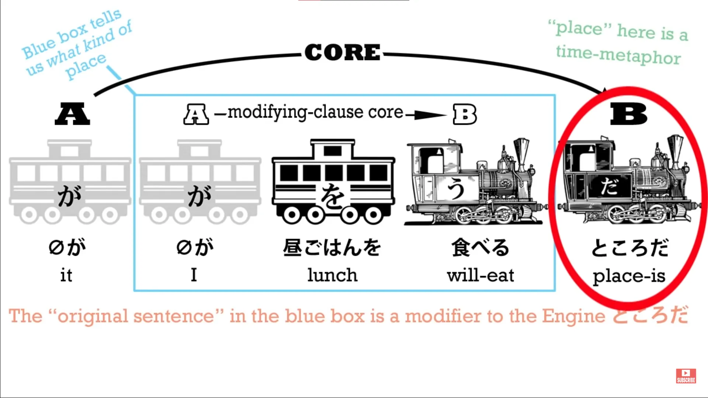

# **36. 所 - konsep <code>place</code>**

[**Pelajaran 36: Tokoro - Konsep Tempat dalam Bahasa Jepang - Grammar Magic**](https://www.youtube.com/watch?v=z2cgY9o-cO0&amp;list;=PLg9uYxuZf8x_A-vcqqyOFZu06WlhnypWj&amp;index;=38&amp;pp;=iAQB)

こんにちは。

Hari ini kita akan membahas konsep <code>place</code> dalam bahasa Jepang sehari-hari, karena ini adalah hal yang sering membingungkan orang, dan saya bahkan pernah melihat penerjemah amatir yang cukup baik pun salah mengartikannya. Kata untuk <code>place</code> dalam bahasa Jepang adalah, tentu saja, <code>所/ところ</code>, dan kita mempelajarinya sejak dini.

Kata ini berarti tempat secara harfiah dan dengan cepat memiliki penggunaan yang sedikit metaforis. Misalnya, kita bisa mengatakan <code>私のところ</code>, yang berarti &quot;apartemen atau rumah saya / tempat saya tinggal&quot;. <code>Come and hang out at my place.</code>

Dalam bahasa Inggris, itu tidak berarti <code>hang out</code> seperti dalam <code>hang out of the window</code>. Artinya... ah, lupakan saja, bahasa Inggris terlalu rumit. Namun, dalam bahasa Jepang, makna kiasan dari <code>place</code> jauh lebih luas daripada dalam bahasa Inggris.

Misalnya, jika saya mengatakan <code>さくらのどこが好きなの?</code>

Saya bertanya, secara harfiah <code>Sakura&#x27;s where do you like?</code> atau <code>What place of Sakura do you like?</code>::: info
Mengutip Dolly-先生

di kolom komentar: &#x27;どこ

berarti apa yang selalu dimaksudkan: <code>what-place?</code>
Saya hanya mendemonstrasikan penggunaan <code>place</code> metafora di bidang yang lebih abstrak. Jika Anda melihat kembali kalimat tersebut, Anda akan melihat bahwa jika どこ hanya berarti <code>place</code> itu tidak akan masuk akal...&#x27;
:::

Sekarang, jika saya menanyakan ini, saya tidak mengharapkan jawaban seperti <code>I like her left ear.</code> Jawaban yang tepat mungkin seperti <code>やさしいだ</code> — &quot;Dia lembut / Yang saya sukai darinya adalah dia lembut / Hal yang saya sukai darinya adalah dia lembut.&quot;

Dan kita mungkin mengatakan <code>This is, in my opinion, Sakura&#x27;s いいところ&#x27;</code> — &quot;Sisi baik Sakura atau salah satu sisi baik Sakura&quot;. Jadi <code>place</code> di sini tidak berarti sesuatu yang mirip dengan lokasi fisik.

Ini berarti suatu aspek dari sesuatu, bahkan sesuatu yang sangat abstrak seperti kepribadian seseorang. Jika saya mendengarkan ceramah yang rumit, seseorang mungkin berkata kepada saya <code>分かりましたか?</code> — <code>Did you understand it?</code> — dan saya mungkin menjawab <code>分かるところがあったが分からないところもありました</code> — <code>There were places I understood and places I didn&#x27;t understand.</code>

Dan di sini, seperti yang Anda lihat, ini lebih mirip dengan penggunaan yang mungkin kita temui dalam bahasa Inggris: <code>I mostly understood it, but there were places that I didn&#x27;t understand.</code> Hal ini bisa menimbulkan kesalahpahaman halus karena yang kemungkinan besar ingin saya katakan dalam bahasa Jepang bukanlah bahwa ada saat-saat selama kuliah ketika saya tidak mengerti, tetapi ada aspek atau hal-hal halus yang belum sepenuhnya saya pahami.

Jadi, terutama jika Anda sudah lebih mahir, ada baiknya menyadari kedalaman metaforis dari konsep <code>place</code>. Sekarang, <code>place</code> juga sering digunakan untuk mengacu pada tempat bukan dalam ruang, melainkan dalam waktu.

Dan jika kita memahami analogi ini, kita dapat memahami penggunaan tertentu yang sering dijelaskan tanpa menjelaskan landasan strukturalnya, yang pada akhirnya hanya memberi Anda daftar hal-hal untuk dihafal dan seperti biasa mengatakan &quot;yah, ini cocok dengan ini dan kebetulan berarti itu dan kita tidak tahu persis mengapa.&quot; Jadi, misalnya, kita bisa menggunakan <code>ところ</code> — <code>place</code> — dengan <code>A does B</code> kalimat dalam ketiga tenses, yaitu masa lalu, masa kini, dan masa depan.

Jadi, misalnya, jika kita mengatakan, menggunakan bentuk kamus biasa dari kata <code>食べる</code> — <code>eat</code> (yang, seperti yang kita ketahui dari pelajaran tentang tenses, tidak secara default berada di masa kini; melainkan di masa depan). Jika kita mengatakan <code>昼ご飯を食べるところだ</code>, yang kita katakan adalah <code>I&#x27;m just about to eat lunch.</code>

Bagaimana struktur kalimat ini? Nah, kalimat ini diakhiri dengan <code>だ</code>, jadi kita tahu bahwa yang kita miliki adalah sebuah <code>A is B</code> kalimat, meskipun kalimat asli yang disisipkan di dalamnya adalah <code>A does B</code> kalimat.

Jadi, yang kita katakan adalah <code>(something) is place</code>. Kata &quot;zero-car&quot; di sini <code>it</code>, seperti dalam bahasa Inggris, dan artinya adalah waktu sekarang, persis seperti dalam bahasa Inggris ketika kita mengatakan <code>It&#x27;s time to leave</code> — <code>the present time is time to leave</code>.

The <code>it</code> adalah <code>the present time</code> dalam bahasa Jepang dan Inggris dalam konstruksi ini. Jadi, yang kita katakan adalah <code>It (the present time) is I-will-eat-lunch time</code>, sehingga artinya adalah <code>I&#x27;m just about to eat lunch</code>.

Jadi, bagaimana penambahan <code>ところだ</code> ke dalam kalimat ini mengubah maknanya dari apa yang akan dimaksudkan jika kita hanya mengatakan <code>昼ご飯を食べる</code> adalah bahwa kalimat ini memberi tahu kita bahwa kita saat ini berada di tempat di mana saya akan makan siang, oleh karena itu saya akan segera makan siang. BUKAN <code>I&#x27;m going to eat lunch possibly in half-an-hour.</code>

Saya baru saja akan makan siang saat ini. Ini adalah tempat di mana saya baru saja akan makan siang. <code>昼ご飯を食べるところだ.</code>

Sekarang, jika kita menggunakannya dengan bentuk present actual, yaitu present continuous, yang kita gunakan saat kita benar-benar mengatakan bahwa kita sedang melakukan sesuatu tepat pada saat ini, jadi kita mengatakan <code>昼ご飯を食べているところだ</code>, yang kita maksudkan adalah <code>I&#x27;m eating lunch right now.</code> Dan sama seperti pada contoh sebelumnya, apa yang <code>ところだ</code> melakukannya adalah membuatnya terasa langsung.

Itulah perbedaan dalam bahasa Inggris antara mengatakan <code>I&#x27;m eating lunch</code> dan <code>I&#x27;m eating lunch right now.</code> Sekarang, di masa lalu, jika kita mengatakan <code>昼ご飯を食べたところだ</code>, yang kita maksud adalah <code>I just ate lunch.</code>

Yang <code>ところだ</code> menambahkan kesegeraan pada bentuk lampau tersebut: &quot;Waktu di mana kita berada sekarang adalah saat di mana saya makan siang / saya baru saja makan siang.&quot; Sekarang, dalam kasus ini kita bisa mengatakan <code>昼ご飯を食べたばかり</code> - <code>I just ate lunch.</code>

Kedua kalimat tersebut memiliki arti yang hampir sama. Dan saya pernah melihat buku teks yang memberikan seperangkat aturan ini : &quot;Anda dapat menggunakan &#x27;ばかり&#x27; dengan kata benda.

Anda dapat mengatakan <code>このお店はパンばかり売る</code> — <code>This shop sells nothing but bread</code> — atau kita bisa mengatakan <code>昼ご飯を食べたばかりだ</code> — <code>I just ate lunch.</code> Tetapi Anda harus ingat bahwa aturan mengatakan bahwa <code>ところ</code> tidak boleh digunakan dengan kata benda.&quot;

Nah, ini memang benar, tetapi cara mengatakannya terasa aneh dan abstrak. Seolah-olah ini hanyalah aturan acak yang dibuat-buat oleh seseorang, mungkin pada zaman Heian karena mereka tidak punya hal lain yang lebih baik untuk dilakukan.

Sebenarnya, jika kita memahami logikanya, kita bahkan tidak perlu diberitahu hal ini, karena sudah jelas. Saya bisa mengatakan <code>I just ate lunch</code> atau saya bisa mengatakan <code>I&#x27;m at the place where I&#x27;ve eaten lunch</code>.

Kita bisa mengatakan <code>This shop just sells bread</code>, tetapi <code>this shop bread place sells</code> sama sekali tidak masuk akal, bukan? *(あのお店はところ売る = salah)* Dan inilah mengapa menurut saya sangat penting untuk mempelajari struktur.

Orang-orang terkadang bertanya kepada saya, &quot;Apakah saya harus memikirkan semua struktur yang Anda ajarkan ini dalam setiap kalimat yang saya ucapkan atau baca?&quot; Dan tentu saja jawabannya adalah <code>No</code>.

Yang seharusnya kamu lakukan adalah membiasakan diri dengan bahasa Jepang dengan membaca, mendengarkan, dan sebaiknya berbicara juga. *(=Pentingnya imersi dijelaskan di sini (๑˃̵ᴗ˂̵))* Jika Anda tidak melakukannya, Anda tidak akan pernah terbiasa dengan tata bahasanya, berapa pun banyak buku teks yang Anda pelajari.

Tetapi jika Anda memahami strukturnya, Anda tidak akan bingung dengan hal-hal seperti apakah Anda bisa menggunakan <code>ところ</code> dengan kata benda atau tidak, dan mengapa Anda tidak bisa menggunakan <code>ところ</code> dengan kata benda ketika Anda bisa menggunakan <code>ばかり</code> dengan kata benda, dan Anda harus memikirkan semua itu. Anda tidak perlu melakukan itu karena Anda memahami bagaimana sebenarnya cara kerjanya.

Inilah yang seharusnya diajarkan oleh buku teks, tetapi mereka tidak melakukannya. Sekarang, setelah mempelajari strukturnya, penting juga untuk menyadari saat-saat ketika bagian-bagian dari struktur tersebut bisa dihilangkan.

Seperti halnya banyak ekspresi kalimat reguler, kopula <code>だ</code> dapat dihilangkan, dan lebih dari itu, bahkan akhiran <code>ところ</code> dapat dihilangkan. <code>ろ</code> dapat dihilangkan dan kita bisa mengatakan <code>とこ</code>.

Hal ini terjadi di semua bahasa, bahwa ada bagian-bagian di mana, dalam percakapan sehari-hari, kita bisa mengabaikan beberapa bagian. Dan selama kita tahu apa strukturnya, tidaklah sulit untuk memahami penghilangan tersebut.

Jadi, kita mungkin mengatakan <code>名古屋/なごやに着陸したとこ</code> — <code>I just landed at Nagoya.</code> Dan kita sering menggunakan singkatan-singkatan ini seperti <code>とこ</code> — menghilangkan <code>ろ</code> dan <code>だ</code> dari <code>ところだ</code> — saat kita berusaha mengekspresikan rasa kedekatan.

Namun orang melakukannya dalam berbagai kesempatan, sama seperti mereka melakukan hal yang setara dalam bahasa Inggris. Jadi, kita melihat bahwa <code>ところ</code> dapat bersifat harfiah, <code>place in space</code>.

Hal itu dapat mengekspresikan konsep yang sangat abstrak seperti <code>aspect of someone&#x27;s personality</code>, dan sering kali dapat berarti <code>place in time</code>. Dan kata ini dapat digunakan dalam berbagai cara sebagai titik waktu; misalnya, jika seseorang mengatakan <code>いいところに来たね?</code>

Itu kemungkinan besar berarti <code>You came at a good time, didn&#x27;t you?</code> BUKAN <code>You came to a good place, didn&#x27;t you?</code> meskipun sebenarnya bisa berarti keduanya. 

Ingatlah bahwa dalam bahasa Jepang, konteks adalah yang terpenting..
