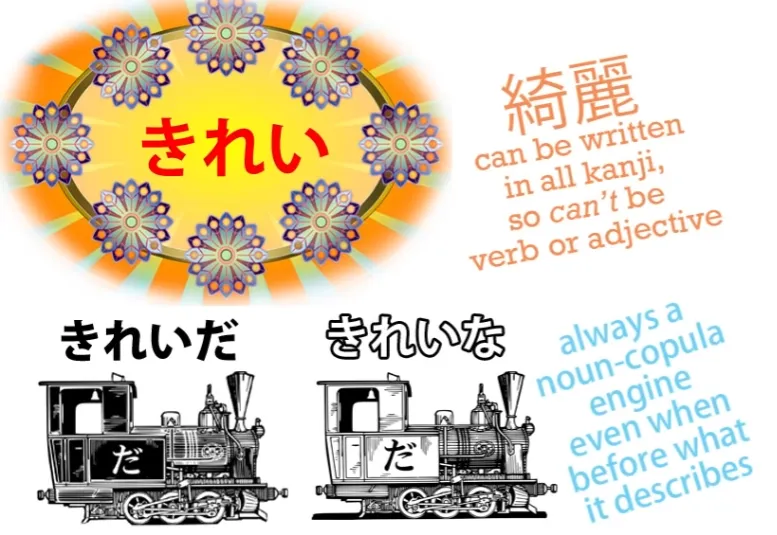
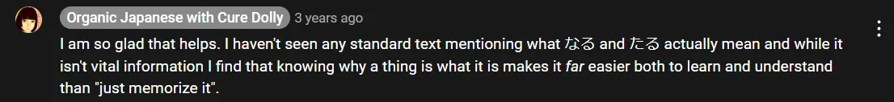

# **37. Rahasia struktur baru + kata sifat な vs の, なる &amp; たる**

[**Pelajaran 37: Kuasai Teks Bahasa Jepang! Rahasia struktur baru + <code>na vs no, naru &amp; taru adjectives</code>**](https://www.youtube.com/watch?v=GB8fWjQuz9A&amp;list;=PLg9uYxuZf8x_A-vcqqyOFZu06WlhnypWj&amp;index;=39&amp;pp;=iAQB)

こんにちは。

Hari ini kita akan membahas struktur bahasa Jepang lebih dalam. Namun, mungkin secara tak terduga, hal ini justru akan membuat segalanya menjadi lebih sederhana daripada yang kita bayangkan. Dan hal ini akan membuatnya jauh lebih mudah untuk melihat halaman teks Jepang, dan bahkan ketika terlihat sangat rumit, kita akan memiliki gambaran yang jauh lebih jelas tentang apa saja elemen-elemennya dan bagaimana kemungkinan mereka saling terhubung.

Anda mungkin telah memperhatikan bahwa saya sering memetakan kalimat menggunakan kereta kalimat, dan Anda mungkin juga telah memperhatikan bahwa kita memiliki jumlah jenis gerbong yang relatif sedikit. Kita memiliki tiga engine: engine kata kerja, engine kata sifat, dan engine kata benda plus kopula.

Dan kita memiliki berbagai gerbong, yang semuanya mewakili kata benda dengan berbagai Partikel logis yang melekat padanya, yang memberi tahu kita apa yang dilakukan kata benda tersebut dalam kalimat. Sekarang, jumlah gerbong yang relatif sedikit ini sebenarnya dapat diringkas menjadi hanya tiga jenis kata.

Kita memiliki &quot;い-engine&quot;, yang merupakan kata sifat, kita memiliki &quot;う-engine&quot;, yang merupakan kata kerja, dan sisanya adalah kata benda. Kita memiliki &quot;noun-plus-copula-engine&quot; dan kita memiliki berbagai gerbong-gerbong kata benda dengan partikel-partikel yang berbeda.

Dan kita mungkin memperhatikan bahwa saya belum memperkenalkan kata keterangan, dan itu karena sebagian besar kata keterangan — tidak semua tetapi sebagian besar — sebenarnya adalah varian dari kata sifat atau varian dari kata benda. Ada beberapa jenis kata lain yang asli, tetapi sebagian besar yang Anda lihat dalam bahasa Jepang pada dasarnya akan bermuara pada salah satu dari ketiga jenis ini, terlepas dari apa yang kadang-kadang dikatakan kamus.

Dan jika bukan kata kerja atau kata sifat, maka kemungkinan besar itu adalah kata benda. Apa yang kamus sebut sebagai kata sifat &quot;な&quot; sebenarnya adalah kata benda, apa yang mereka sebut sebagai kata sifat &quot;の&quot; sebenarnya adalah kata benda, dan apa yang mereka sebut sebagai kata kerja &quot;する&quot; sebenarnya adalah kata benda.

Dan sebagian besar hal yang mereka masukkan ke dalam kategori lain — tidak semuanya tetapi sebagian besar — ternyata adalah kata benda. Bahasa Jepang adalah bahasa yang sangat berpusat pada kata benda. Kita mungkin tergoda untuk mengaitkan fakta ini dengan kenyataan bahwa ada banyak kata asing dalam bahasa Jepang dan semuanya adalah kata benda.

Sebagian besar kosakata bahasa Jepang berasal dari bahasa Tionghoa. Ada juga kata-kata dari bahasa Inggris, Jerman, dan bahasa lain, tetapi jumlahnya tidak seberapa dibandingkan dengan kosakata Tionghoa yang lebih tua dalam bahasa Jepang, yang mirip dengan sebagian besar kosakata bahasa Inggris yang berasal dari bahasa Latin, baik secara langsung dari bahasa Latin maupun secara tidak langsung melalui bahasa Prancis.

Perbedaannya adalah, seperti yang telah saya katakan, dalam bahasa Jepang segala sesuatu yang berasal dari bahasa lain selain bahasa Jepang asli masuk sebagai kata benda. Dan saya katakan bahwa kita mungkin tergoda untuk mengaitkan sifat berpusat pada kata benda dalam bahasa Jepang dengan hal itu, tetapi sebenarnya, saya akan mengatakan sebaliknya.

Hal ini karena bahasa Jepang pada dasarnya sangat berpusat pada kata benda sehingga tampak wajar untuk mengimpor apa pun ke dalam bahasa tersebut sebagai kata benda. Setelah masuk sebagai kata benda, jika kita ingin menggunakannya sebagai kata kerja atau kata sifat, ada cara-cara untuk melakukannya.

Dan kita cukup familiar dengan cara-cara tersebut, bukan? Ketika sebuah kata benda masuk dari bahasa Mandarin, jika kita ingin menggunakannya sebagai kata kerja, kita mengubahnya menjadi apa yang disebut kamus sebagai <code>する verb</code>. Dan dalam kasus ini, saya tidak mempermasalahkan kamus-kamus tersebut.

<code>する verb</code> adalah hal yang nyata, tetapi ini merupakan pengecualian karena dalam hampir semua kasus lain di mana sebuah kata benda masuk, ia tetap menjadi kata benda bahkan ketika digunakan untuk tujuan yang berbeda. Jadi, mari kita mulai dengan melihat kata kerjする.

Kata-kata ini sangat sederhana. Jika kita mengambil kata <code>勉強</code> dari bahasa Mandarin, yang muncul sebagai kata benda yang berarti <code>the act of studying</code>, kita dapat mengatakan <code>勉強をする</code>, yang berarti <code>do the act of studying</code>, tetapi kita juga bisa menggabungkan kata-kata tersebut secara langsung dan mengatakan <code>勉強する</code>, yang berarti <code>(to) study</code>.

Pada dasarnya, dengan menggabungkan <code>する</code> pada kata benda tersebut, telah mengubah kombinasi tersebut menjadi kata kerja yang sesungguhnya. Jadi, dalam kasus khusus ini, kita dapat mengatakan bahwa sebuah kata benda yang berasal dari bahasa Mandarin benar-benar telah menjadi kata kerja yang &quot;する&quot;.

Namun, jika kita ingin menggunakan kata benda sebagai kata sifat, katakanlah kata benda <code>綺麗/きれい</code>, yang berarti <code>prettiness</code> atau <code>cleanness</code>, kata benda tersebut tidak pernah berhenti menjadi kata benda.

Kamus dan buku teks memberitahu kita tentang <code>な-adjectives</code>, tetapi kata tersebut sebenarnya tidak masuk akal. Tidak ada yang namanya kata sifat &quot;な&quot;.

Ada kata benda yang berfungsi sebagai kata sifat yang tetap bertindak dalam hampir semua hal seperti kata benda lainnya. Satu-satunya perbedaan antara kata benda yang berfungsi sebagai kata sifat dan kata benda lainnya adalah bahwa kita dapat menggunakan <code>な</code> bersama kata tersebut.

Dan <code>な</code>, seperti yang kita ketahui, hanyalah bentuk penghubung dari <code>だ</code>. Jadi, kita bisa mengatakan <code>女の子は 綺麗/きれい だ</code> — <code>the child is pretty</code> — atau kita bisa mengatakan <code>きれいな女の子</code>, yang berarti <code>pretty child</code>.

<code>きれいだ</code> berarti <code>is pretty</code> dan <code>きれいな</code> juga berarti <code>is pretty</code>, jadi kita mengatakan <code>child is pretty</code> atau <code>is-pretty child</code>. <code>な</code> dan <code>だ</code> adalah kopula yang sama.

Nah, alasan mengapa ini disebut kata benda kata sifat adalah karena kita tidak bisa melakukan hal persis ini dengan kata benda lain. Namun, kita bisa melakukan sesuatu yang sangat mirip, dan kita akan membahasnya sebentar lagi.

Namun, sebelum melanjutkan, saya hanya ingin mencatat bahwa pada dasarnya ada dua jenis kata benda adjektival, yaitu yang seperti <code>綺麗/きれい</code>, yang sebenarnya sama sekali tidak digunakan sebagai kata benda biasa; kata-kata ini hampir sepenuhnya didedikasikan untuk menjadi kata sifat: kita tidak membicarakan <code>きれい</code>. Dan kemudian ada yang tetap berfungsi sebagai kata benda mandiri, seperti <code>元気</code>.

Jadi, kita bisa mengatakan <code>子どもが元気だ</code> — <code>the child is lively</code>; kita bisa mengatakan <code>元気な子ども</code> — <code>lively child</code>. Namun, kita juga bisa mengatakan hal-hal seperti <code>元気を出して</code>, yang secara bebas diterjemahkan berarti <code>cheer up</code>, tetapi jika diterjemahkan secara harfiah berarti <code>get out your 元気</code>.

<code>元気</code> adalah suatu hal di sini: kata tersebut ditandai oleh partikel &quot;を&quot;, dan Anda tidak dapat menempatkan partikel logis pada apa pun kecuali kata benda. Jadi, <code>元気</code>, meskipun pada dasarnya bersifat adjektival dan diklasifikasikan sebagai kata benda adjektival, berfungsi baik sebagai kata sifat maupun kata benda.

Sekarang, jika sebuah kata benda tidak diklasifikasikan sebagai kata benda adjektival, kita tetap bisa menggunakannya secara adjektival. Jadi, kata <code>魔法/まほう</code>, yang berarti <code>magic</code>, dapat digunakan sebagai kata benda sama seperti dalam bahasa Inggris.

Kita dapat membicarakan sihir sebagai suatu benda. Namun, kita juga dapat mengatakan <code>魔法の帽子</code> — <code>magic hat</code>.

Ini bukan kata benda adjektival, tetapi seperti yang Anda lihat, kita bisa mencapai efek yang hampir sama hanya dengan menggunakan <code>の</code> sebagai gantinya <code>な</code>. Ada juga beberapa kata yang dapat berfungsi sebagai kata sifat baik dalam bentukの maupun な.

Contoh yang baik untuk ini adalah <code>不思議/ふしぎ</code>, yang berarti <code>mystery</code> atau <code>wonder</code>. Kata ini cenderung sering digunakan sebagai kata sifat seperti dalam <code>不思議な屋敷/やしき</code> — <code>mysterious mansion</code> – tetapi kata ini juga cukup sering digunakan sebagai kata benda.

Kita bisa membicarakan sekolah <code>七不思議</code> — yang secara harfiah berarti ****tujuh keajaiban**** atau <code>seven mysteries</code> di sekolah, dan yang biasanya dimaksud adalah cerita hantu yang terkait dengan sekolah, seperti <code>トイレのはなこさん</code>, yang mungkin pernah kamu dengar — gadis yang menghantui toilet.

Nah, <code>不思議</code>, jika kita menggunakannya sebagai kata sifat, kata ini bisa menjadi apa yang disebut kamus sebagai <code>な-adjective</code> atau <code>の-adjective</code>, artinya, kita bisa menggunakan <code>な</code> atau <code>の</code> saat menggunakannya sebagai kata sifat.

Apakah ada perbedaan di antara keduanya? Saya akan mengatakan ya, ada perbedaan yang halus.

<code>Alice in Wonderland</code> dalam bahasa Jepang disebut <code>不思議の国のアリス</code>. Sebenarnya, bisa saja disebut <code>不思議な国のアリス</code>, tetapi menurut saya <code>不思議の国のアリス</code> adalah judul yang jauh lebih tepat dan terjemahan yang jauh lebih baik dari judul aslinya, <code>Alice in Wonderland</code>.

<code>不思議な国のアリス</code> berarti <code>Alice of the mysterious country</code>, secara harfiah berarti <code>Alice of the mysterious-is country</code>. <code>不思議の国のアリス</code> menyiratkan lebih <code>Alice of the country of wonders</code>.

Kami lebih cenderung <code>不思議</code> &quot;lebih&quot; sebagai kata benda itu sendiri dan mengaitkannya dengan negara tersebut. Ini adalah perbedaan yang halus, tetapi patut diingat, terutama jika ada pilihan di antara keduanya.

Namun, hal terpenting yang perlu diingat adalah bahwa apakah suatu kata benda merupakan kata benda yang berfungsi sebagai kata sifat atau kata benda biasa yang digunakan sebagai kata sifat dengan <code>の</code>, kata tersebut akan selalu berfungsi sebagai kata benda. Sekarang, kamus juga suka membingungkan kita dengan mengatakan bahwa ada jenis kata sifat lain juga;

## なる &amp; たる <code>adjectives</code> (kata benda)

mereka kurang umum, tetapi ada <code>なる-adjectives</code> dan <code>たる-adjectives</code>, dan apa sebenarnya arti kata-kata ini serta apa ceritanya? Nah, kenyataannya adalah bahwa kata-kata ini sekali lagi hanyalah kata benda.

### なる

Jadi, jika kita ambil sebuah buku yang disukai adik perempuanku... judulnya <code>アリスとペンギん:華麗なる探偵</code>, yang artinya <code>Alice and Penguin: The Magnificent Detectives</code>. Sebenarnya, <code>華麗/かれい</code> adalah kata benda yang berfungsi sebagai kata sifat, jadi kita bisa menggunakannya dengan <code>な</code>, tetapi dalam kasus ini penulis memilih untuk menggunakan <code>なる</code> sebagai gantinya.

Apa <code>なる</code> di sini? Apakah itu <code>なる</code> yang berarti <code>become</code>? Tidak, bukan itu.

Itu adalah singkatan dari <code>のある</code>. Dan seperti yang telah saya jelaskan dalam video lain, <code>の</code> dapat digunakan sebagai pengganti <code>が</code> dalam frasa kata sifat.

Dan saya telah menjelaskan alasannya di [**video**](https://www.youtube.com/watch?v=wxX6poiuyAI&amp;ab;_channel=OrganicJapanesewithCureDolly) lainnya. Jadi <code>華麗なる探偵</code> berarti <code>華麗のある探偵</code> yang berarti <code>華麗がある探偵</code> yang berarti <code>detectives possessing **華麗/かれい**</code>. (secara harfiah: &quot;華麗&quot; -detektif-detektif itu ada)

Apa itu <code>華麗/かれい</code>? Nah, itu <code>splendor</code> atau <code>magnificence</code>.

::: info
ada [**komentar terbaru**](https://www.youtube.com/watch?v=GB8fWjQuz9A&amp;lc;=UgzSIge_mK0a_8dz6s14AaABAg.9e0E5zhgA3t9fc3pGOOLln&amp;ab;_channel=OrganicJapanesewithCureDolly) yang dibuat oleh seseorang bernama Nihil, yang memberikan penjelasan yang sangat berguna &amp; terperinci bahwa なる adalah singkatan dari にある dan bukan のある. Berdasarkan penelusuran saya di kamus-kamus Jepang, saya juga menemukan bahwa istilah ini merujuk pada にある (dari bentuk kuno なり) alih-alih のある. Oleh karena itu, saya sangat merekomendasikan untuk membaca komentar Nihil di bawah [**video**](https://www.youtube.com/watch?v=GB8fWjQuz9A&amp;lc;=UgzSIge_mK0a_8dz6s14AaABAg.9e0E5zhgA3t9fc3pGOOLln&amp;ab;_channel=OrganicJapanesewithCureDolly). Sayangnya, karena Dolly sudah tidak ada lagi, kita mungkin tidak sepenuhnya tahu apa yang dia maksud di sini, tetapi dia juga mengakui di komentar bahwa dia tidak menemukan arti sebenarnya dari &quot;なる&quot; (dalam bentuk lengkapnya). Tentu saja, ini mungkin bukan hal besar dalam skema besar pemahaman bagi sebagian orang, tetapi menurut saya ini baik untuk diketahui dan jawaban Nihil sungguh luar biasa, jadi mereka layak mendapat pengakuan:)

:::

---

Penulis sebenarnya menyertakan terjemahan bahasa Inggris, meskipun buku ini sepenuhnya ditulis dalam bahasa Jepang, untuk judulnya: <code>Alice and Penguin: The Excellent Detectives</code>. Namun, menurut saya ini bukanlah terjemahan yang sangat baik ke dalam bahasa Inggris.

<code>華麗</code> berarti lebih dari <code>excellent</code>, tetapi lebih dari itu, pilihan kata <code>なる</code> daripada <code>な</code> — apa artinya itu? Apakah itu memiliki implikasi, seperti yang ada di <code>不思議の国のアリス</code>?

Saya kira hal itu mungkin saja terjadi di masa lalu, hingga batas tertentu, tetapi dalam teks modern, memilih untuk menggunakan <code>なる</code> memiliki makna yang berbeda. Istilah itu dipilih karena terdengar sedikit lebih kuno, sedikit lebih sastrawi, sedikit lebih—entah bagaimana—misterius.

Oleh karena itu, dalam bahasa Inggris saya akan memilih istilah yang agak berlebihan <code>magnificent</code>, karena <code>華麗</code> sebenarnya adalah kata yang cukup berlebihan untuk digunakan sejak awal dan memilih untuk menggunakan <code>なる</code> bersama dengannya akan membuatnya terdengar semakin berlebihan.

###たる

<code>たる</code>, yang juga kadang-kadang digunakan, adalah singkatan dari <code>とある</code>, sehingga <code>ある</code> sebenarnya dikaitkan dengan hal yang sedang dijelaskan, bukan dengan hal yang menjelaskannya.

Ini berarti bahwa hal yang digambarkan ada dalam cara yang disiratkan oleh kata benda yang digunakan sebagai deskriptor. Dalam praktiknya, perbedaannya tidak terlalu besar, tetapi hal ini patut diingat untuk melihat implikasi yang lebih halus.

---

Namun intinya di sini adalah kita berurusan dengan jumlah elemen yang sangat sedikit. Kita memiliki kata kerja dan kata sifat, dan sebagian besar yang bukan salah satunya hanyalah kata benda.

Bahkan jika berfungsi sebagai kata keterangan, pada dasarnya kata tersebut akan tetap berupa kata benda atau kata sifat. Dan hal penting yang perlu diingat, karena setiap kata yang diimpor dari bahasa Tionghoa adalah kata benda, jika kita melihat kata yang terdiri dari kanji tanpa okurigana, tanpa hiragana yang melekat, kita tahu bahwa kata tersebut hampir pasti merupakan kata benda.

Jadi, memahami struktur bahasa Jepang yang berpusat pada kata benda memudahkan kita untuk memahami apa yang terjadi saat melihat halaman teks Jepang. Namun, hal yang bisa membingungkan adalah kenyataan bahwa kita terkadang melihat kelompok kanji yang berdekatan tanpa kana di antaranya.

Apa yang terjadi pada situasi-situasi ini? Kita tahu bahwa kanji yang berdiri sendiri akan menjadi kata benda, jadi ketika kita melihat banyak di antaranya bersama-sama, apa yang sedang terjadi?

Nah, yang terjadi adalah satu kata benda sedang memodifikasi kata benda lainnya. Kita telah melihat cara-cara di mana kata benda memodifikasi satu sama lain dengan <code>な</code> atau <code>の</code> atau bahkan <code>なる</code> atau <code>たる</code>, tetapi kata benda juga dapat saling memodifikasi tanpa menggunakan apa pun, dan kita sudah terbiasa dengan hal itu ketika dua kata menyatu untuk membentuk kata lain, seperti <code>日本語</code>.

<code>日本</code> adalah <code>Japan</code>, <code>語</code> adalah <code>language</code>, dan jika Anda menggabungkan keduanya, Anda akan mendapatkan <code>日本語</code> — <code>Japanese language</code>. Sekarang, kita melihat bahwa dalam banyak, banyak kasus, beberapa di antaranya sudah kita bahas.

Dan ini bekerja persis sama seperti dalam bahasa Inggris. Misalnya, dalam bahasa Inggris kita memiliki kata-kata seperti <code>bookshelf</code> dan <code>seaweed</code>.

Dalam bahasa Jepang, kita bisa melakukan hal yang persis sama. Jadi, kita memiliki <code>本棚</code> — <code>本</code> adalah <code>book</code>, <code>棚</code> adalah <code>shelf</code>: <code>本棚</code> adalah <code>bookshelf</code>.

<code>海草</code> — <code>海/かい</code> adalah bacaan &quot;音読み&quot; dari <code>海/うみ</code>, <code>sea</code>; <code>草/そう</code> adalah bacaan &quot;音読み&quot; dari <code>草/くさ</code>, <code>grass</code>, dan bersama-sama mereka membentuk <code>海草</code> — <code>seaweed</code>, karena <code>grass</code> dapat berarti segala jenis tumbuhan, itulah sebabnya kita memiliki Pokemon Tipe Rumput.

Dan hal ini juga terjadi pada kombinasi yang tidak ada dalam bahasa Inggris, seperti <code>指輪</code>. <code>指/ゆび</code> adalah <code>finger</code>, <code>輪/わ</code> adalah <code>ring</code>, jadi <code>指輪</code> adalah cincin jari.

Namun, kita juga dapat melihat kombinasi yang lebih besar, untuk hal-hal yang dalam bahasa Inggris lebih merupakan frasa daripada kata. Dan sekali lagi, hal ini dilakukan dengan cara yang persis sama seperti dalam bahasa Inggris, jadi seharusnya tidak perlu dikhawatirkan.

Misalnya, kita memiliki <code>大学教育</code> — <code>大学</code> berarti <code>university</code>; <code>教育</code> berarti <code>education</code> atau <code>training</code>. Jadi <code>大学教育/だいがくきょういく</code> adalah <code>university education</code>.

Dan, seperti yang Anda lihat, sekali lagi cara kerjanya persis sama seperti dalam bahasa Inggris. Dalam bahasa Inggris, kita tidak perlu mengatakan <code>education at a university</code> setiap kali; kita bisa mengatakan <code>university education</code>.

Dan dalam bahasa Jepang kita bisa mengatakan <code>大学教育</code>, dan kita tidak perlu <code>な</code> atau <code>の</code> atau apa pun untuk menghubungkannya. Mereka membentuk frasa yang umum digunakan dengan sendirinya.

Kita tidak bisa melakukan ini setiap kali. Ini seperti kata benda yang berfungsi sebagai kata sifat. Ada ungkapan tertentu di mana hal ini dikenal dan diterima, serta jenis konstruksi tertentu di mana hal ini sering dilakukan.

Sekarang, kita mungkin melihat blok kanji yang lebih panjang yang bisa terlihat sangat menakutkan sampai Anda memahami apa itu, bagaimana cara kerjanya, dan kemungkinan apa itu. Hal ini sering dilakukan dalam kasus lembaga dan hal-hal semacamnya.

Misalnya, <code>日本語能力試験</code>. Nah, blok kanji itu mungkin terlihat cukup menakutkan, jika Anda belum terbiasa dengan konsepnya.

Namun, sebenarnya ini adalah Ujian Kemahiran Bahasa Jepang, yang mungkin pernah Anda dengar dan yang tidak saya dukung sepenuhnya. Dan kita dapat melihat bahwa hal yang persis sama terjadi dalam bahasa Jepang seperti dalam bahasa Inggris:

<code>日本語</code> — <code>Japanese language</code>; <code>能力</code> — <code>proficiency</code> atau <code>ability</code>; <code>試験</code> — <code>examination</code>. Dan persis seperti dalam bahasa Inggris, kita dapat menggunakan satu kata benda untuk memodifikasi kata benda lain, lalu keduanya bersama-sama memodifikasi kata benda ketiga — dan seterusnya.

Jadi, <code>日本</code> memodifikasi <code>語</code> (bahasa apa? bahasa Jepang). <code>日本語</code> memodifikasi <code>能力</code> (kemahiran apa? kemahiran bahasa Jepang).

Lalu semuanya itu memodifikasi <code>試験</code> (jenis ujian apa? Ujian kemahiran bahasa Jepang). Jadi, meskipun Anda melihat kanji bertumpuk seperti ini, tidak perlu panik.

Cukup tarik napas dan lihat apa saja yang menyusunnya.
