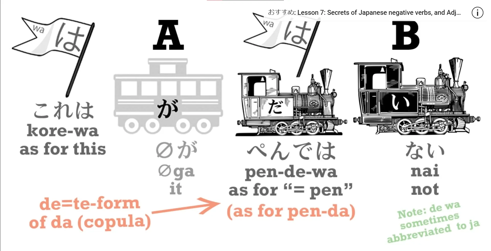
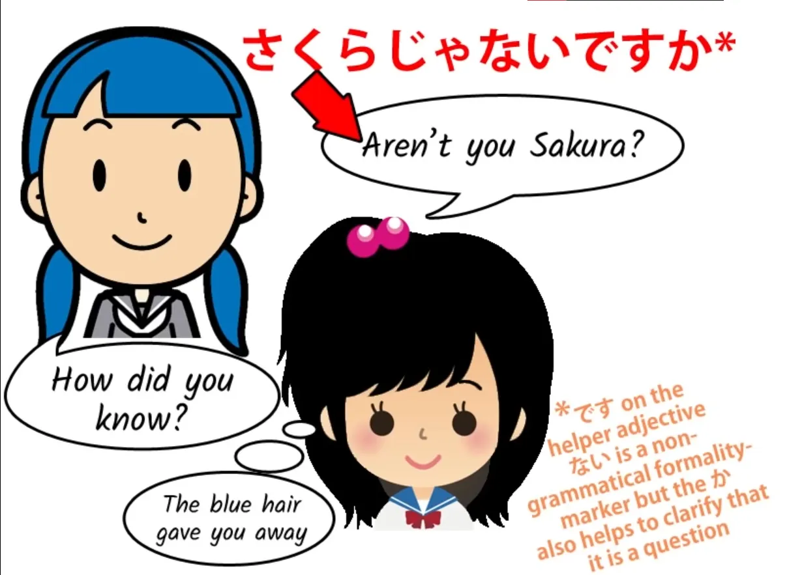
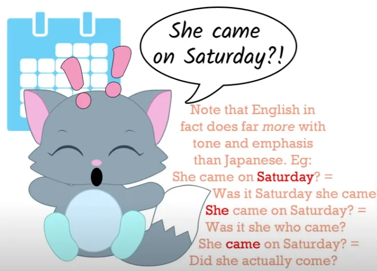
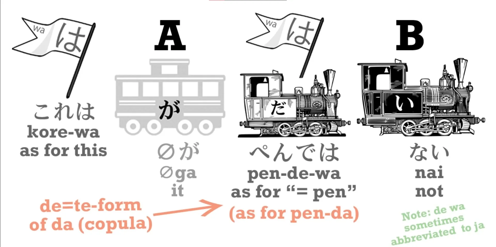
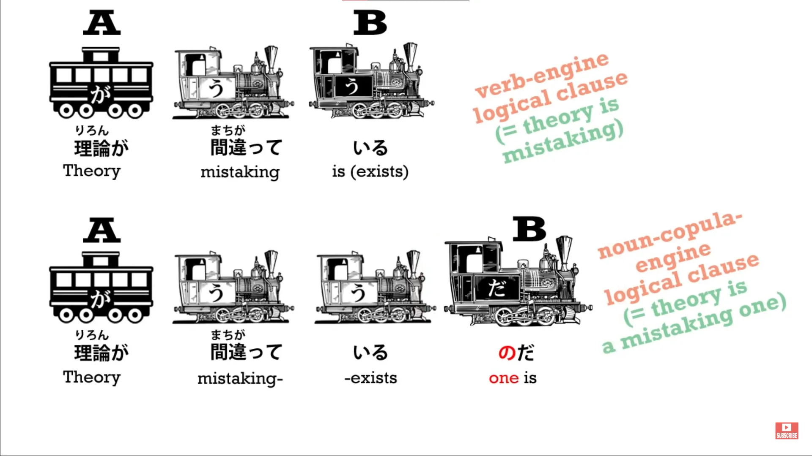
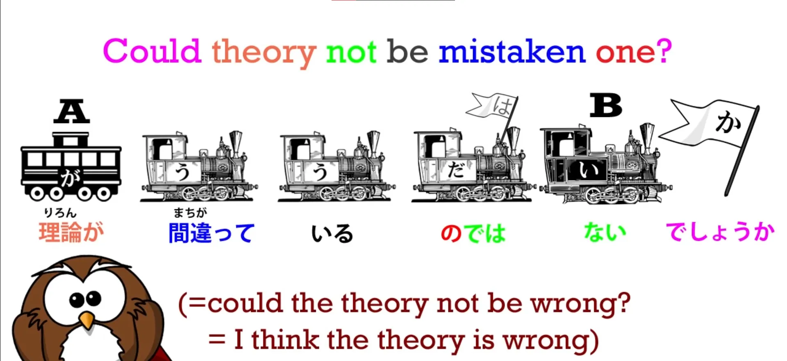
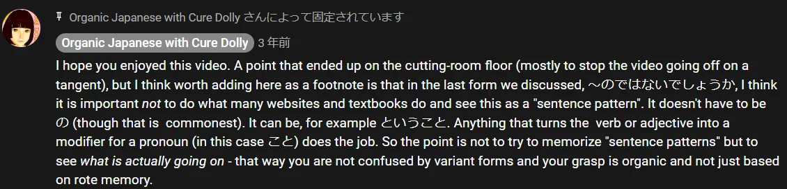

# **38. Ketika <code>it isn&#x27;t</code> berarti <code>it is</code>: misteri &quot;じゃない&quot; tidak diketahui, &quot;ではない&quot; bukanlah hal yang demikian**

[**Pelajaran 38: Ketahuilah kapan <code>it isn&#x27;t</code> berarti <code>it is</code>: misteri じゃない janai, ではない de wa nai**](https://www.youtube.com/watch?v=so7BXOwSyEU&amp;list;=PLg9uYxuZf8x_A-vcqqyOFZu06WlhnypWj&amp;index;=40&amp;pp;=iAQB)

こんにちは。

Hari ini kita akan membahas sesuatu yang membingungkan banyak pembelajar bahasa Jepang, terutama setelah mereka mempelajari sedikit bahasa Jepang dan mulai membaca teks Jepang atau mendengarkan anime, dll. Hal ini berkaitan dengan fakta bahwa orang Jepang sering kali membuat pernyataan yang tampak negatif, padahal sebenarnya bermaksud positif.

Misalnya, seseorang mungkin berkata <code>さくらじゃない</code>, yang tampaknya berarti <code>That isn&#x27;t Sakura.</code> Namun, makna sebenarnya adalah <code>That is Sakura, isn&#x27;t it?</code> atau bahkan sekadar <code>That is Sakura</code>. Sekarang, bagaimana hal ini bekerja, bagaimana kita mengenali hal ini, dan bagaimana kita memahaminya?

Sebagai permulaan, <code>じゃない</code> adalah singkatan dari <code>ではない</code> yang, tentu saja, merupakan bentuk negatif dari kopula, seperti yang kita pelajari pada pelajaran tentang bentuk negatif dalam bahasa Jepang.

Jadi, <code>A,Bだ</code> atau <code>A,Bです</code> berarti <code>A is B</code>. <code>A,Bではない (or ではありません)</code> berarti <code>A is not B</code>. Jadi tidak ada keraguan di sini bahwa kita sebenarnya mendengar apa yang, secara tata bahasa, merupakan pernyataan negatif.

Lalu bagaimana kita menafsirkannya? Nah, untuk memulainya, mari kita ingat kembali fakta bahwa pertanyaan negatif digunakan dalam kebanyakan bahasa, termasuk Bahasa Inggris, untuk memicu respons positif.

Jadi jika kita mengatakan <code>It&#x27;s a nice day, isn&#x27;t it?</code> artinya hari ini cerah dan kita mengharapkan pendengar setuju. Jika kita mengatakan <code>Are you Sakura?</code> ini adalah pertanyaan netral.

Kita tidak menyiratkan bahwa kita berpikir hari ini cerah atau tidak. Kita hanya mengajukan pertanyaan. Namun, jika kita mengatakan <code>Aren&#x27;t you Sakura?</code> maka kita sebenarnya menunjukkan bahwa kita berpikir kamu adalah Sakura.

Dan pertanyaan negatif yang meminta respons positif seperti <code>It&#x27;s a nice day, isn&#x27;t it?</code> tentu saja umum di semua bahasa yang saya ketahui. Dalam bahasa Prancis, kita memiliki <code>n&#x27;est-ce pas</code>, dalam bahasa Jerman kita memiliki <code>nicht wahr</code>, dan tentu saja dalam bahasa Jepang kita memiliki <code>ね</code>, yang pada dasarnya adalah pertanyaan negatif.

Jadi, jika kami mengatakan <code>さくらじゃないですか</code> kami mengatakan hal yang persis sama seperti dalam bahasa Inggris <code>Isn&#x27;t that Sakura?</code> artinya kita menganggapnya demikian.

Masalah pertama yang muncul di sini adalah, meskipun kita mengatakan dalam percakapan formal <code>さくらじゃないですか</code> karena dalam bahasa formal <code>か</code> berfungsi sebagai tanda tanya verbal, mengubah pernyataan apa pun menjadi pertanyaan, kita biasanya tidak menggunakan <code>か</code> sebagai penutup kalimat pembentuk pertanyaan dalam bahasa Jepang sehari-hari yang tidak formal. Jadi, apa yang <code>さくらじゃないですか</code> dalam bahasa Jepang formal menjadi <code>さくらじゃない</code> dalam bahasa Jepang biasa.

<code>さくらじゃない</code> pada dasarnya memiliki tiga makna potensial. *(ditunjukkan oleh intonasi dalam ucapan)* Kita dapat mengatakan <code>さくらじゃない。</code> — yang berarti <code>That isn&#x27;t Sakura</code>.

Kita bisa mengatakan <code>さくらじゃない？</code> dan itu berarti <code>That&#x27;s Sakura, isn&#x27;t it?</code> Tapi kita juga bisa mengatakan, mungkin saat bertemu Sakura setelah cukup lama, <code>さくらじゃない！</code>, dan itu tentu saja tidak berarti itu bukan Sakura dan itu juga bukan sebuah pertanyaan.

Kita sebenarnya telah mengenalinya dan apa yang kita katakan adalah sesuatu yang mungkin paling tepat diterjemahkan ke dalam bahasa Inggris sebagai <code>If it isn&#x27;t Sakura!</code> artinya itu adalah Sakura. Sekarang, tidak ada yang secara khusus mistis dan khas Jepang tentang hal ini.

Kita melakukan hal yang sama dalam bahasa Inggris. Misalnya, jika kita mengatakan <code>She came on Saturday</code>, itu hanya menyampaikan sepotong informasi.

Jika kita mengatakan <code>She came on Saturday?</code> kami bertanya apakah dia datang pada hari Sabtu atau tidak. Dan jika kami mengatakan <code>She came on Saturday?!</code> kami baru saja menerima informasi bahwa dia datang pada hari Sabtu dan kami mengungkapkan keterkejutan kami akan hal itu.

Kita tahu cara menafsirkan ini dalam bahasa Inggris dan mudah untuk belajar menafsirkan <code>じゃない</code> dalam bahasa Jepang begitu kita memahami rentang makna yang dimilikinya. <code>じゃない</code> juga digunakan dengan makna lain.

Secara khusus, kata ini digunakan sebagai akhiran pertanyaan negatif yang sangat mirip dengan <code>ね</code>. Misalnya, kita mungkin mengatakan <code>暑いじゃない</code> yang artinya hampir sama dengan <code>暑いね</code>.

Ini mirip dengan kalimat tanya penutup, yang mengharapkan pendengar setuju dengan kita. Dan perlu dicatat di sini bahwa tidak ada ambiguitas sama sekali dalam hal ini, karena <code>暑いじゃない</code> bukanlah bentuk negatif dari <code>暑い</code> – itu adalah <code>暑くない</code>.

---

Dan kalimat ini juga bisa diletakkan setelah kata kerja. Misalnya, <code>もう言ったじゃない</code>, yang berarti <code>I already said that, didn&#x27;t I?</code>

Kita juga perlu mencatat bahwa <code>じゃない</code> sering disingkat menjadi hanya <code>じゃん</code> dalam percakapan yang sangat santai, dan sering digunakan seperti itu saat menegaskan sesuatu atau meminta konfirmasi. Sekarang, jelas bahwa ungkapan-ungkapan ini sangat santai dan bahkan begitu santai sehingga ketika kita menggunakannya dengan kata kerja atau kata sifat, sebenarnya ungkapan tersebut tidak sesuai tata bahasa.

Dan alasan untuk hal ini, seperti yang telah saya singgung sebelumnya, adalah bahwa, misalnya, <code>暑いじゃない</code> bukanlah bentuk negatif dari <code>暑い</code> karena itu <code>暑くない</code>. Mengapa kita tidak bisa menggunakan <code>じゃない</code> bersama kata kerja atau kata sifat?

Nah, itu karena, seperti yang kita pelajari di pelajaran pertama, <code>じゃない</code> sebenarnya <code>ではない</code>, yang merupakan bentuk negatif dari kata hubung. Jadi, jika kita mengatakan <code>これはペンだ</code> kita berarti <code>This is a pen</code>; jika kita mengatakan <code>これはペンではない</code>, kita sebenarnya mengatakan <code>This is not a pen</code>, dan Anda tidak bisa menggunakan <code>ではない</code> dengan apa pun kecuali dua kata benda.

Saya sebenarnya tidak berpikir bahwa pernyataan-pernyataan bahasa sehari-hari ini pada dasarnya tidak sesuai tata bahasa. Hanya saja, karena bersifat bahasa sehari-hari, mungkin ada beberapa langkah yang terlewatkan dalam prosesnya.

Sebenarnya ada cara yang jauh lebih formal untuk menggunakan <code>ではない</code> sebagai pernyataan positif, tetapi tentu saja cara-cara ini memperbaiki tata bahasanya. Jadi, misalnya, jika kita mengatakan <code>その理論が間違っているのではないでしょうか</code>, kita sebenarnya mengatakan <code>Might that theory not be in error?</code>

Dan kita lihat bahwa kita pada dasarnya memiliki konstruksi yang sama seperti yang telah kita bahas sebelumnya: <code>その理論が間違っている... ではない</code>, tetapi <code>の</code> menjadikannya pernyataan yang gramatikal. Mengapa?

Karena <code>その理論が間違っている</code> secara harfiah berarti <code>that theory exists in a state of mistaking</code>. Itu adalah klausa verbal yang lengkap.

Namun, ketika kita menambahkan <code>の</code>, itu <code>の</code>, seperti yang telah kita lihat di [**pelajaran lain**](https://www.youtube.com/watch?v=Bq3GO63D9bw&amp;ab;_channel=OrganicJapanesewithCureDolly), berperan sebagai kata ganti seperti <code>thing</code> atau <code>one</code> yang dimodifikasi oleh <code>間違っている</code>.

Jadi sekarang kita memiliki <code>that theory exists in a state of error one</code>. Jadi, kita memiliki dua kata benda dan sekarang kita memerlukan kata penghubung untuk menggabungkannya.

Jadi <code>その理論が間違っているのではない</code> berarti <code>that theory existing-in-error-one is not</code>. Kata <code>でしょうか</code> tidak menambah apa pun secara tata bahasa pada kalimat tersebut.

Seperti yang kita ketahui, kata sifat seperti <code>ない</code> berdiri sendiri. Mereka tidak memerlukan <code>だ</code>, meskipun mereka mendapatkan <code>です</code> sebagai sekadar hiasan, hiasan non-gramatikal, dalam bahasa formal, jadi yang <code>でしょうか</code> yang dilakukan di sini hanyalah sebuah penanda yang diletakkan di akhir pernyataan tata bahasa yang lengkap: <code>その理論が間違っているのではない</code>.

<code>でしょうか</code> yang secara eksplisit mengubahnya menjadi sebuah pertanyaan dan menjadi sebuah saran daripada sebuah pernyataan. Jadi, kita mengatakan <code>Might that theory not be a mistaken one</code>?

Sekarang, ini bisa berarti apa yang tampak dari kalimatnya. Ini bisa berarti bahwa kita ragu dan sebenarnya bertanya apakah mungkin bukan itu yang terjadi.

Namun, seringkali ini digunakan bukan hanya sebagai pernyataan, tetapi sebagai pernyataan yang cukup kuat. Kita mungkin menggunakan ini untuk merangkum argumen kita ketika kita telah membantah teori yang dimaksud secara definitif.

Seorang penulis atau pembicara Amerika mungkin merangkum argumen semacam itu dengan &quot;Sekarang jelas bagi siapa pun yang kecerdasannya lebih tinggi dari Roomba bahwa teori ini sama tak berdasarnya dengan cangkir jarum tanpa tutup di Gurun Sahara.&quot;

Namun, pernyataan pasti semacam itu dalam bahasa Jepang tidak dianggap sopan maupun sangat meyakinkan. Kedengarannya seolah-olah Anda mencoba menutupi argumen yang lemah dengan pernyataan yang kuat.

Jadi, penutur bahasa Jepang yang setara mungkin akan merangkum argumen yang sama—yang sepenuhnya meyakinkan—dengan <code>ですからその理論は間違っているのではないでしょうか</code>. Dan itu berarti persis hal yang sama, dengan mempertimbangkan perbedaan budaya…

::: info
jika masih ada yang kurang jelas, membaca komentar di video mungkin bisa membantu.

:::
