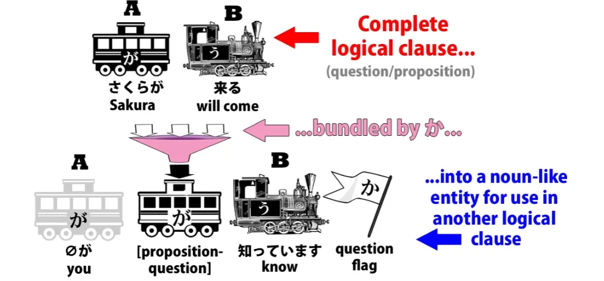
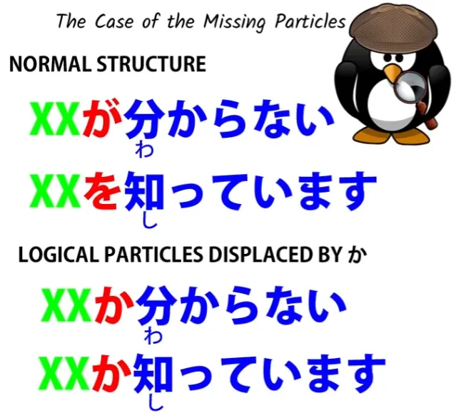
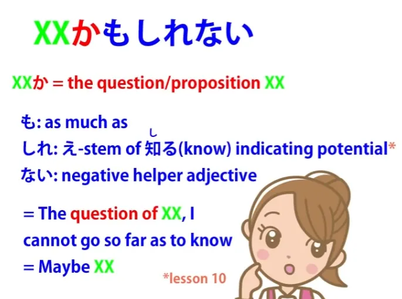
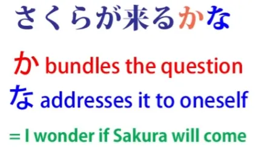
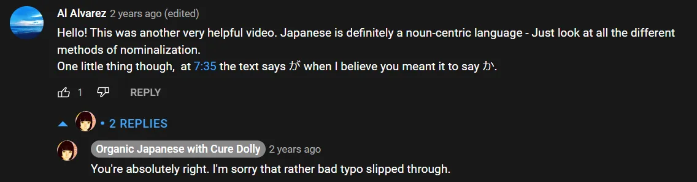
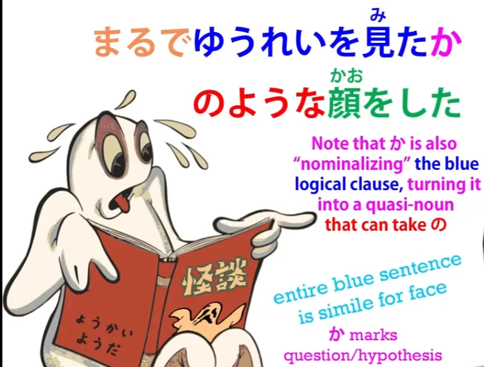
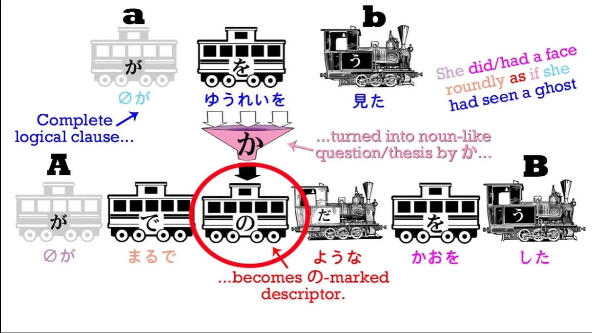
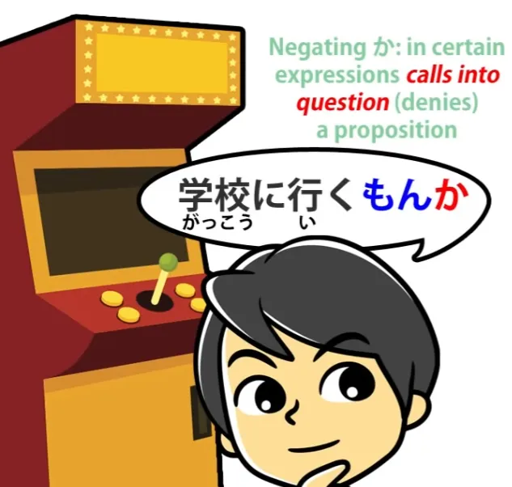
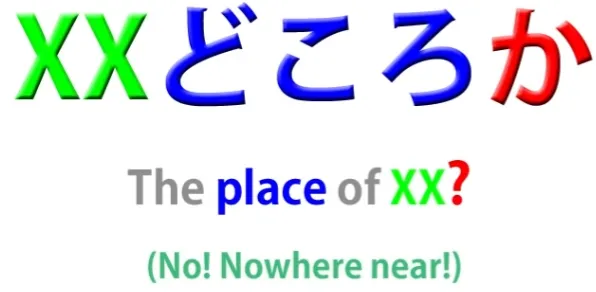
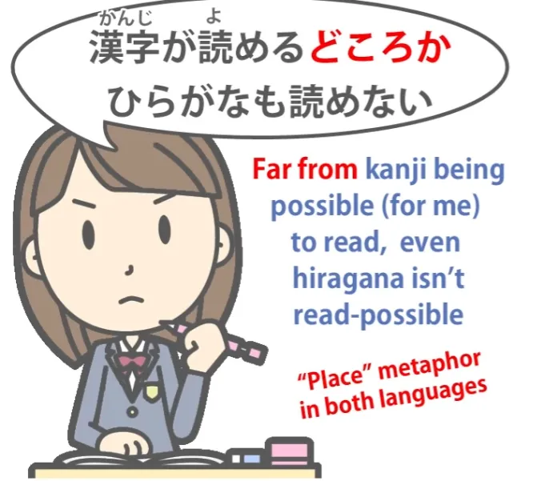

# **39. Partikel &quot;か&quot;: <code>Buried questions</code>, かな, もんか, かどうか...**

[**Pelajaran 39: Kehidupan Rahasia Partikel &#x27;Ka&#x27; dalam &#x27;か&#x27;! <code>Buried questions</code>, Kana, Monka, Ka dou ka &amp; banyak lagi**](https://www.youtube.com/watch?v=TOv3voBcEv8&amp;list;=PLg9uYxuZf8x_A-vcqqyOFZu06WlhnypWj&amp;index;=41&amp;pp;=iAQB)

こんにちは。

Hari ini kita akan membahas pertanyaan yang sebenarnya bukan pertanyaan. Hal ini sering muncul dalam bahasa Jepang, jadi penting untuk memahami apa itu dan bagaimana cara kerjanya. Jadi, yang akan kita bahas adalah partikel -か

.

Sekarang, kita mungkin sudah mengenal partikel -か

sebagai semacam tanda tanya verbal yang ditempatkan di akhir kalimatです

/ます

untuk mengubahnya menjadi pertanyaan. Namun, seperti yang kita jelaskan minggu lalu, kita tidak menggunakan -か

di akhir kalimat untuk menandai kalimat tersebut sebagai pertanyaan dalam bahasa Jepang biasa (non-formal).

Mengapa tidak? Karena menempatkan -か

di akhir kalimat non-formal terdengar agak kasar dan blak-blakan. Hal ini tidak salah secara tata bahasa, dan kadang-kadang digunakan oleh penutur laki-laki yang ingin terdengar blak-blakan atau kasar.

Namun secara umum, kita tidak menggunakannya. Kita menandai pertanyaan melalui intonasi dalam percakapan sehari-hari. Namun, kita memang selalu menggunakan penanda -か

, hanya saja tidak di akhir kalimat.

Untuk apa kita menggunakannya? Nah, kita menggunakannya untuk menandai pertanyaan, tetapi tidak persis seperti yang biasanya kita bayangkan ketika mengatakan <code>question</code>.

Jadi, mari kita mulai langsung dengan sebuah contoh. Misalkan kita mengatakan, <code>さくらが来るかわからない.</code> Yang kita katakan adalah <code>I don&#x27;t know if Sakura will come.</code>

Dan yang sebenarnya terjadi di sini adalah kita mengubah kalimat logis, proposisi, <code>さくらが来る</code>, yang berarti <code>Sakura will come</code>, menjadi sebuah pertanyaan, dan kemudian kita mengatakan <code>わからない.</code> Jadi pada dasarnya kita mengatakan <code>Sakura come (question), not clear / The question of whether Sakura will come is not clear to me.</code>

Dalam bahasa Inggris, <code>I don&#x27;t know if Sakura&#x27;s coming.</code> Sekarang, kita bisa menggunakan ini sebagai bagian dari pertanyaan yang sebenarnya.

Kita mungkin akan mengatakan <code>さくらが来るか知っていますか.</code> Sekarang, jika kita menanyakannya dalam bentuk &quot;です&quot; / &quot;ます&quot;, seperti yang baru saja saya lakukan, kita menggunakan &quot;か&quot; di akhir untuk menandai pertanyaan sebenarnya.

Jadi, kita mengatakan <code>The question of whether Sakura will come, do you know?</code> Dan kita harus perhatikan di sini bahwa yang terjadi adalah, pertama-tama, - か mengubah proposisi, pertanyaan, menjadi sesuatu yang mirip kata benda yang kemudian dapat kita gunakan sebagai dasar kalimat baru.

Jadi, itulah hal pertama yang perlu kita perhatikan, dan hal kedua yang perlu kita perhatikan adalah bahwa - か menggantikan Partikel logis sebagian besar waktu. Jadi, biasanya ketika kita mengatakan <code>わからない</code>, kita mengatakan <code>(何-何)がわからない</code>; jika kita mengatakan <code>知ってる</code>, kita mengatakan <code>(何-何)を知ってる</code>; tetapi dalam kasus ini partikel - か menggantikan Partikel logis yang biasa.

Jadi kita mengatakan <code>さくらが来るかわからない</code> bukan <code>さくらが来るかがわからない.</code> Jadi <code>さくらが来るか</code> adalah entitas mirip kata benda yang, karena berakhiran -か, tidak perlu menggunakan Partikel logis biasa.

## かどうか

Sekarang, Partikel logis ini juga digunakan dalam ungkapan umum <code>かどうか</code>. Dan meskipun kita dapat mempelajarinya sebagai ungkapan yang disatukan yang berarti <code>whether or not</code>, &quot;jadi&quot; <code>さくらが来るかどうかわからない</code> berarti <code>I don&#x27;t know whether Sakura&#x27;s coming or not,</code> (dalam bahasa Inggris begitulah cara kita mengatakannya, berbeda dengan <code>さくらが来るかわからない</code> — dalam bahasa Inggris kita akan mengatakan <code>I don&#x27;t know if Sakura&#x27;s coming</code>; <code>さくらが来るかどうかわからない</code> – kita akan mengatakan dalam bahasa Inggris <code>I don&#x27;t know whether Sakura&#x27;s coming or not.</code>)

yang sebenarnya kita katakan di sini adalah <code>Sakura coming (question) how (question) わからない.</code> Jadi yang kita katakan adalah sesuatu seperti <code>I don&#x27;t know if Sakura&#x27;s coming or how it will be.</code> Dan dari sini kita bisa melihat bagaimana kita mendapatkan penggunaan -か untuk menunjukkan <code>or</code> di antara kata benda.

Jadi kita bisa mengatakan <code>お茶かコーヒーどちらがいい?</code> — <code>Tea or coffee, which would you like?</code> Sekarang, bagaimana cara kerjanya?

Nah, pada dasarnya ini adalah singkatan dari <code>お茶かコーヒーかどちらがいい?</code> Jadi, kita menempatkan dua proposisi berdampingan, <code>whether coffee or whether tea,</code> lalu bertanya <code>どちらがいい?</code>Dan sekali lagi, meskipun ini tampak seperti penggunaan yang berbeda, -か

melakukan hal yang sama — ia menggabungkan sesuatu menjadi sebuah proposisi. Namun ingatlah bahwa ketika kita menggunakan <code>or</code> dalam bahasa Inggris, itu selalu harus berupa pertanyaan.

Itu tidak pernah pasti. Jika kita mengatakan <code>A or B</code> kita mengatakan mungkin A dan mungkin B.

Jika kita mengatakan <code>A and B</code>, kita tahu apa yang kita bicarakan. Kita tahu bahwa baik A maupun B ada atau melakukan apa pun yang kita katakan.

Tetapi jika kita mengatakan <code>A or B</code>, kita tidak tahu apakah itu A atau B. Kita tahu itu salah satunya.

Jadi, sekali lagi partikel &quot;か&quot; ini, partikel yang menandakan keraguan, terus berfungsi untuk menandai kemungkinan, pertanyaan, sesuatu yang mungkin terjadi atau mungkin tidak, mungkin ada atau mungkin tidak.

## かも知れない

Sekarang, kita melihat hal ini bekerja, misalnya, dalam <code>かも知れない</code>.

Sekarang, ini diajarkan seolah-olah itu adalah kata atau ungkapan yang berarti <code>maybe</code>. Dan memang begitu, tetapi mengajarkannya sebagai satu kesatuan seperti itu, seperti yang telah saya jelaskan dalam video lain, dapat menyesatkan.

Inti dari kesalahpahaman yang ingin saya bahas di sini adalah bahwa hal itu membingungkan kita tentang apa yang sebenarnya dilakukan oleh - か. - か itu melekat pada proposisi yang sedang kita bicarakan.

Jadi, jika kita mengatakan <code>さくらが来るかも知れない</code> — <code>Perhaps Sakura will come</code> — yang kita maksud adalah <code>さくらが来るか</code>, itulah pertanyaan atau proposisi yang sedang kita bicarakan, dan kemudian <code>も知れない.</code> も memberikan arti dari <code>even</code> atau <code>as much as</code>, seperti yang telah saya jelaskan bahwa hal itu sering terjadi, dan <code>知れない</code> adalah <code>知る</code> — <code>know</code> / <code>知れる</code> — <code>ability to know or be known</code> dan kata sifat penunjang <code>-ない</code>.

Jadi, keseluruhan kalimat tersebut sebenarnya berarti <code>さくらが来るか</code> — <code>the question of whether Sakura comes</code> – <code>も知れない</code> — <code>I can&#x27;t go so far as to know / Maybe Sakura will come, maybe she won&#x27;t.</code>

## かな

Demikian pula dengan <code>かな</code>, yang kadang-kadang disajikan sebagai partikel yang berarti <code>I wonder</code>, Anda bisa melihat bagaimana ini sebenarnya bekerja.

::: info
dalam video, ada kesalahan ketik di mana garis merah menuliskan &quot;が&quot; alih-alih &quot;か&quot;. Saya telah memperbaikinya.

:::

<code>か</code> mengambil proposisi, jadi jika kita mengatakan <code>さくらが来るかな</code>, kita berarti mengatakan <code>さくらが来るか</code> — <code>the question of whether Sakura will come</code> — <code>な</code>. Sekarang, <code>な</code>, seperti yang telah kita bahas di [**video lain**](https://www.youtube.com/watch?v=IWEok4Ivfyc&amp;ab;_channel=OrganicJapanesewithCureDolly), adalah penanda yang menunjukkan bahwa kita sedang berbicara kepada diri sendiri.

Jadi, kamu mengatakan <code>Will Sakura come?</code> mengarahkan itu kepada diri sendiri. Cara kita mengatakannya dalam bahasa Inggris adalah &quot;Saya bertanya-tanya apakah Sakura akan datang / Saya sedang memikirkan pertanyaan apakah Sakura akan datang.&quot;

Dan meskipun tidak apa-apa untuk mempelajari hal-hal seperti <code>かな</code> dan <code>かも知れない</code> seolah-olah itu adalah apa yang dikatakan buku teks, yaitu sekumpulan aturan tata bahasa yang harus dihafal, namun memahami apa yang sebenarnya mereka lakukan akan membantu tidak hanya dalam hal itu tetapi juga dalam struktur secara keseluruhan. Mereka mengemas sesuatu menjadi sebuah pertanyaan, sehingga sebuah proposisi menjadi pertanyaan yang merupakan entitas mirip kata benda yang kemudian dapat kita tambahkan sesuatu seperti &quot;apakah kamu tahu / aku tidak tahu / aku tidak yakin<code> or </code>Saya bertanya-tanya (saya mengarahkan pertanyaan ini kepada diri saya sendiri).&quot;

Sekarang, dari sifat pembentuk proposisi dan sifat bertanya dari - か, kita mendapatkan ungkapan seperti yang telah kita bahas dalam video sebelumnya, <code>まるでゆうれいを見たかのような顔.</code>

Nah, itu berarti <code>a face as if one had seen a ghost.</code> Jadi, apa yang dilakukan - か di sini?

Fungsinya sama seperti sebelumnya. Ia menandai <code>ゆうれいを見た</code> sebagai pertanyaan, sebuah proposisi, sesuatu yang tidak pasti, bahkan dalam kasus khusus ini, sesuatu yang belum terjadi: kita tidak mengatakan bahwa orang tersebut TELAH melihat hantu, kita hanya mengatakan bahwa dia memiliki ekspresi WAHAKAN seolah-olah dia telah melihat hantu.

Jadi, kita menandai proposisi bahwa dia telah melihat hantu sebagai pertanyaan, lalu melanjutkan untuk mengomentari proposisi tersebut. Dalam kasus ini, kita sebenarnya melekatkan Partikel logis &quot;の&quot; pada entitas mirip kata benda yang telah ditandai dengan &quot;か&quot;, yang kita buat dari proposisi bahwa dia sedang melihat hantu.

Jadi, dengan partikel &quot;の&quot;, berbeda dengan partikel &quot;が&quot; dan &quot;を&quot;, kita dapat melekatkannya pada entitas yang ditandai dengan &quot;か&quot;. Sekarang, ada penggunaan lain dari &quot;か&quot;, yang sedikit berbeda tetapi tetap erat kaitannya dengan sifat pembentuk pertanyaannya.

## もんか / ものか

Dan itu terdapat dalam ekspresi tertentu di mana -particle meniadakan apa yang sedang kita bicarakan.

Contohnya yang mungkin pernah Anda temui jika Anda menonton anime atau membaca manga adalah <code>もんか</code>. Dan itu adalah singkatan dari <code>ものか</code>, dan dapat digunakan dalam percakapan yang lebih formal, dalam hal ini kita mengatakan <code>ものですか</code>.

Jadi, jika saya mengatakan <code>そちらへ行くものですか,</code> Saya mengatakan <code>I won&#x27;t go there / I&#x27;m not going there.</code> Jika saya mengatakan <code>さくらが来るものですか,</code> Saya mengatakan &quot;Sakura tidak akan datang / Dia tidak akan datang / Tidak ada kemungkinan dia datang.&quot;

Apa <code>ものですか</code> artinya? Artinya secara harfiah <code>Is that a thing?</code>

Jadi, ini adalah pertanyaan, tetapi ini adalah jenis pertanyaan yang bersifat negatif yang juga kita temui dalam bahasa Inggris ketika kita mengatakan hal-hal seperti <code>Do you think I&#x27;m going to do that?</code> atau <code>Would I do that?</code> atau <code>How likely is that?</code>

Dalam semua kasus tersebut, dengan mengubah sesuatu menjadi pertanyaan, kita menyangkal kemungkinannya. Sekarang, ketika kita mengatakan <code>ものか</code> itu sama saja, dan sering kali disederhanakan menjadi <code>もんか</code>.

Jadi, seseorang mungkin berkata <code>それを食べるもんか</code> — <code>I&#x27;m not eating that.</code> Dan Anda perhatikan di sini bahwa kita sebenarnya menggunakan penanda &quot;か&quot; setelah kalimat biasa yang tidak formal, dan itu karena <code>もんか</code> atau <code>ものか</code> sebenarnya merupakan cara bicara yang agak kasar.

Anda menyangkal sesuatu dengan sangat tegas dan seringkali untuk menentang seseorang.

##どころか

Tempat lain di mana kita sering melihat -か

sebagai penanda pertanyaan yang berfungsi sebagai penyangkal adalah dalam <code>どころか</code>. Sekarang, <code>どころ</code> adalah bentuk dari <code>ところ</code>, yang telah kita bahas dalam pelajaran baru-baru ini, bukan?[[36]](./36- 所 -the-concept-of-place.md)

<code>ところ</code> dapat berarti tidak hanya <code>place</code> dalam arti harfiah, tetapi juga waktu atau keadaan atau kondisi. Ketika diucapkan sebagai <code>どころ</code> biasanya bersifat negatif, jadi ketika kita mengatakan <code>どころか</code>, kita sedang menafikan apa yang ada di depannya dan biasanya menambahkan penafian yang lebih kuat di belakangnya.

Jadi, jika kita mengatakan, misalnya, <code>漢字が読めるどころかひらがなも読めない</code> — <code>Not only can&#x27;t I read kanji, I can&#x27;t even read hiragana.</code>

Apa <code>どころか</code> yang terjadi di sini? Ya, tentu saja ini bersifat negatif, seperti yang telah kita lihat sebelumnya, tetapi ini juga menggunakan konsep tempat / <code>ところ</code>, artinya, ruang konseptual daripada tempat secara harfiah.

Kita mengatakan <code>Not only can&#x27;t I go as far as reading kanji, I can&#x27;t even get to the point of reading hiragana.</code> Itulah metafora yang digunakan di sini: bukan hanya situasinya belum mencapai tempat sejauh ini, bahkan belum mencapai tempat yang lebih dekat dari itu.

Jadi kita lihat bahwa meskipun - か memiliki beragam makna, semuanya terkait erat dengan kemampuannya untuk membentuk pertanyaan dan mengubah pertanyaan menjadi proposisi, tetapi bukan proposisi yang ada dalam kenyataan, melainkan selalu kondisi hipotetis…
