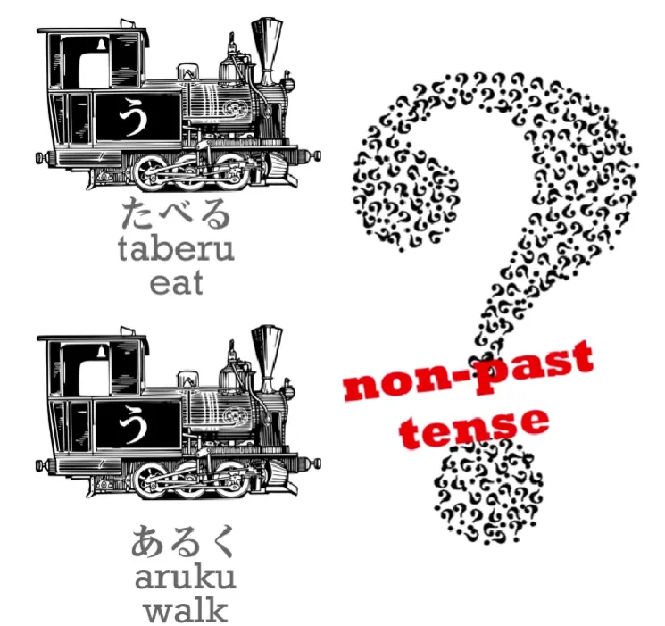
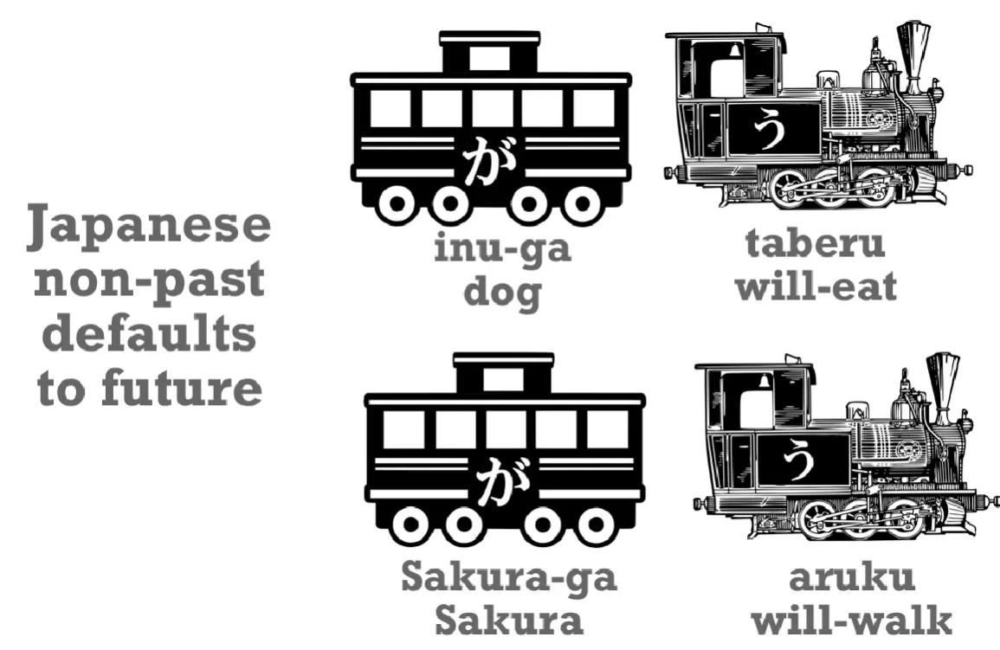
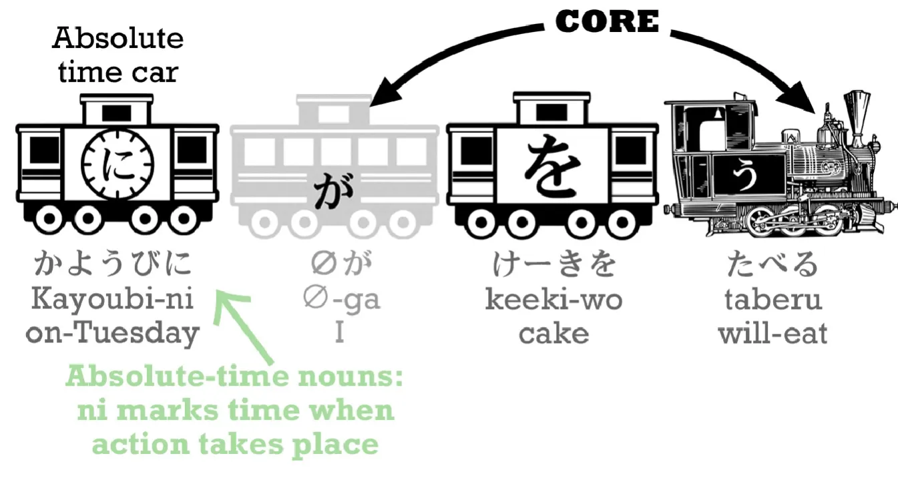
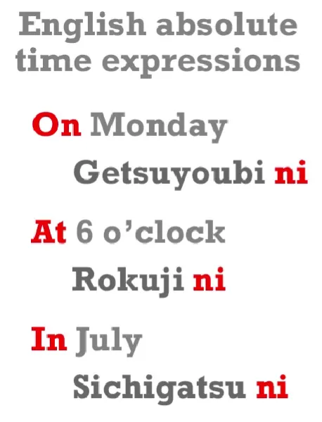

# **4. Bentuk Kata Kerja dalam Bahasa Jepang**

[**Pelajaran 4: Bentuk kata kerja masa lalu, sekarang, dan masa depan dalam bahasa Jepang. Bagaimana sebenarnya bentuk kata kerja dalam bahasa Jepang bekerja**](https://www.youtube.com/watch?v=lU5rmrAORDY&amp;list;=PLg9uYxuZf8x_A-vcqqyOFZu06WlhnypWj&amp;index;=4&amp;ab;_channel=OrganicJapanesewithCureDolly)

こんにちは。

Hari ini kita akan membahas tenses. Sampai saat ini, kita hanya menggunakan satu tenses, yaitu yang diwakili oleh bentuk dasar kata kerja dalam kamus: 食べる / たべる - makan; 歩く / あるく - berjalan, dan seterusnya. Untuk menggunakan bahasa Jepang yang terdengar alami, kita membutuhkan tiga tenses. Anda mungkin berpikir bahwa ketiga bentuk tersebut adalah masa lalu, masa kini, dan masa depan, tetapi sebenarnya tidak demikian.

## Bentuk non-masa lalu

Bentuk yang telah kita gunakan hingga saat ini bukanlah bentuk masa kini. Bentuk ini disebut bentuk non-masa lalu, dan banyak orang menganggapnya membingungkan. Mengapa bahasa Jepang tidak bisa memiliki bentuk sekarang sederhana seperti bahasa Inggris, alih-alih sesuatu yang samar dan misterius seperti bentuk non-masa lalu?

Sebenarnya, hal ini sama sekali tidak membingungkan, dan yang membuatnya membingungkan, untuk sekali ini, bukanlah fakta bahwa bahasa Jepang diajarkan dengan cara yang aneh, melainkan fakta bahwa bahasa Inggris diajarkan dengan cara yang aneh. Kenyataannya, bentuk non-masa lalu dalam bahasa Jepang sangat mirip dengan bentuk non-masa lalu dalam bahasa Inggris.

Apa itu bentuk non-lampau dalam bahasa Inggris? Nah, itu adalah bentuk dasar kata-kata dalam kamus bahasa Inggris: eat, walk, dll. Mengapa saya menyebutnya bentuk non-lampau? Baiklah, mari kita ambil contoh. Misalkan Anda menerima pesan di ponsel Anda 携帯 / けいたい yang berbunyi, <code>I walked to the cafe and now I eat cake and drink coffee</code>. Apa yang akan Anda ketahui tentang orang yang mengirim pesan itu? Nah, Anda akan tahu bahwa dia bukan penutur asli bahasa Inggris, bukan? Karena tidak ada penutur asli bahasa Inggris yang mengatakan <code>I eat cake and I drink coffee</code> ketika yang dimaksud adalah <code>I am eating cake and drinking coffee right now</code>.

Kapan kita mengatakan <code>I eat cake</code>? Nah, kita mungkin mengatakannya ketika maksudnya adalah bahwa kita kadang-kadang makan kue: &quot;Saya makan kue. Saya bukan salah satu dari orang-orang yang tidak makan kue. Saya memang makan kue. Setiap kali ada kue di sekitar, saya memakannya. Tapi itu tidak berarti saya sedang makan kue tepat pada saat ini.&quot;

Kapan lagi kita menggunakan bentuk kata kerja biasa non-lampau dalam bahasa Inggris? Nah, terkadang kita menggunakannya untuk peristiwa di masa depan: <code>Next week I fly to Tokyo.</code> <code>Next month I have an exam.</code> Dan kadang-kadang kita menggunakannya untuk sesuatu yang sedang terjadi saat ini, tapi tidak selalu. Misalnya, dalam deskripsi sastra: &quot;Matahari terbenam di atas laut dan sebuah robot kecil yang bahagia berlari melintasi pantai.&quot; Tapi itu bukan cara kita menggunakannya kebanyakan dalam percakapan sehari-hari, bukan?

Jadi, bentuk lampau sederhana dalam bahasa Jepang sangat mirip dalam fungsinya dengan bentuk lampau sederhana dalam bahasa Inggris. Jika Anda memahami salah satunya, Anda bisa memahami yang lain. **Sebagian besar waktu, bentuk lampau sederhana dalam bahasa Jepang merujuk pada peristiwa di masa depan.** <code>いぬがたべる</code> - <code>The dog will-eat</code>; <code>さくらがあるく</code> - <code>Sakura will-walk.</code>

Cara kita menggunakannya hingga saat ini - <code>Sakura walks</code> - memang mungkin, tetapi itu bukan cara yang paling alami. Kita menggunakannya seperti itu karena itu adalah satu-satunya bentuk kata kerja yang kita ketahui.

## Tindakan berkelanjutan dan bentuk &quot;ている&quot;

Jika kita ingin mengatakan sesuatu yang lebih alami, seperti <code>Sakura is walking</code>, apa yang harus kita lakukan? Nah, apa yang kita lakukan dalam bahasa Inggris? Dalam bahasa Inggris kita mengatakan, bukan begitu, <code>Sakura IS walking</code>. Kita menggunakan kata <code>to be</code>. Anda bisa <code>BE walking</code>. <code>Sakura IS walking</code>; <code>We ARE walking.</code>

Untungnya, dalam bahasa Jepang kita tidak memiliki semua bentuk kata yang berbeda ini <code>to be</code>. Kita menggunakan kata yang sama setiap kali, dan kata tersebut adalah <code>いる</code>. <code>いる</code> berarti <code>be</code> **baik untuk hewan maupun manusia**, dan untuk membentuk bentuk sekarang berkelanjutan ini, kami selalu menggunakan <code>いる</code>.

Jadi, <code>Sakura is walking</code> – <code>さくらがあるいている</code>. <code>Dog is eating</code> – <code>いぬがたべている</code>

Sekarang, perhatikan bahwa dalam kalimat seperti <code>いぬがたべている,</code> kita memiliki sesuatu yang belum kita lihat, yaitu mesin putih. **Mesin putih adalah elemen yang bisa jadi merupakan engine, tetapi dalam kasus ini BUKAN engine dari kalimat ini. Elemen ini berfungsi sebagai modifikasi, atau memberi tahu kita lebih banyak tentang, salah satu elemen inti kalimat.**

Jadi, inti dari kalimat ini adalah <code>いぬがいる</code> - <code>the dog is</code>. Namun, anjing itu tidak hanya ada – anjing itu sedang melakukan sesuatu. Dan engine putih itu memberi tahu kita apa yang sedang dilakukannya. Engine itu <code>eating</code>. Dan kita akan melihat struktur &quot;engine putih&quot; ini berulang kali saat kita mempelajari bahasa Jepang lebih dalam.

Dan sama seperti dalam bahasa Inggris, kita tidak mengatakan <code>the dog is eat</code>, kita menggunakan bentuk khusus dari kata kerja yang menyertai kata kerja &quot;berada&quot;. Jadi dalam bahasa Inggris kita mengatakan <code>is walking</code>, <code>is eating</code>. Dalam bahasa Jepang kita mengatakan <code>食べている/たべている</code>, <code>歩いている/あるいている</code>.

---

Sekarang, bagaimana kita membentuk <code>て-form</code>, yang merupakan bentuk yang kita gunakan untuk membuat bentuk sekarang berkelanjutan? Dengan kata seperti <code>食べる/たべる</code>, hal ini memang sangat mudah. Yang perlu kita lakukan hanyalah menghilangkan <code>る</code> dan menggantinya <code>て</code> di tempatnya. たべる menjadi たべて.

Berita buruknya adalah bahwa dengan kata kerja lain, kita memang memiliki cara yang sedikit berbeda untuk menambahkan <code>て</code>. Selain bentuk dasar る, ada empat cara lainnya. Buku teks mungkin menyebutkan lima, tetapi sebenarnya dua di antaranya sangat mirip sehingga kita bisa menganggapnya sebagai empat. Dan saya telah membuat video tentang apa saja cara-cara tersebut.[[5]](./5-verb-groups-and-the- て -form.md) Dan penjelasannya jauh lebih sederhana daripada kebanyakan penjelasan lainnya. 

Jadi, sangat penting untuk menonton video tersebut agar Anda dapat mempelajari cara membentuk bentuk present continuous. Kabar baiknya: bentuk ini sangat teratur. Begitu Anda mengetahui akhiran kata kerja, Anda juga tahu cara menambahkan <code>て</code> pada kata kerja tersebut. Satu-satunya yang agak rumit adalah kata kerja yang berakhiran る, tetapi video ini akan menjelaskannya.

## Bentuk lampau

Jadi, bagaimana cara mengubahnya menjadi bentuk lampau? Untungnya, hal ini sangat mudah. **Yang perlu kita lakukan hanyalah menambahkan <code>た</code> – itu saja.** Jadi, <code>いぬがたべる</code> – <code>dog will-eat</code> / <code>いぬがたべた</code> – <code>dog ate</code>.

Sekarang, ada berbagai cara untuk menambahkan <code>た</code> pada jenis kata kerja yang berbeda, kata kerja dengan akhiran yang berbeda, tetapi kabar baiknya adalah caranya persis sama dengan cara Anda menambahkan <code>て</code>. Jadi, begitu Anda mempelajari cara-cara <code>て</code> menempelkan, Anda juga telah mempelajari cara-cara <code>た</code> menempel. Jadi, jika Anda menonton video bentuk て -form **[[5]](./5-verb-groups-and-the- て -form.md)**, Anda akan dapat menggunakan bentuk continuous baik untuk masa kini maupun masa lalu.

Sekarang, ada satu hal lagi tentang ungkapan waktu yang berguna untuk dipelajari sekarang. Jika kita ingin menjelaskannya, ketika kita mengatakan <code>私はケーキを食べる</code>, kita sedang membicarakan peristiwa di masa depan, kita bisa mengatakan <code>明日/あした</code> (yang berarti <code>tomorrow</code>) <code>あしたケーキを食べる</code>. Itu saja yang perlu kita lakukan.

## Ekspresi waktu

Kita cukup mengatakan <code>tomorrow</code> sebelum mengucapkan sisa kalimat, sama seperti yang kita lakukan dalam bahasa Inggris. <code>Tomorrow I&#x27;m going to eat cake</code> – <code>あした *(zeroが)* ケーキを食べる</code>.  
::: info
Terkadang saya menambahkan &quot;が&quot; meskipun Dolly tidak mengucapkannya dalam transkrip, TETAPI dia menunjukkannya dalam video. Saya jelas hanya menambahkannya jika dia menunjukkannya; saya tidak melakukannya atas inisiatif sendiri…
:::

Sekarang, <code>tomorrow</code> inilah yang kita sebut <code>**relative** time expression</code> karena itu relatif terhadap hari ini. Hari ini adalah besok dari kemarin.

Dan dengan semua ungkapan waktu relatif seperti itu: kemarin, minggu lalu, tahun depan, dan seterusnya, waktu yang relatif terhadap waktu sekarang, kita hanya melakukan apa yang kita lakukan saat itu. **Kita letakkan ungkapan waktu di awal kalimat dan itu menempatkan seluruh kalimat tersebut ke dalam waktu tersebut.**

---

Namun, ketika kita memiliki <code>absolute time expression</code>, sebuah ungkapan yang tidak relatif terhadap masa kini, seperti Selasa atau pukul enam, maka **kita harus menggunakan <code>に</code>**.

Selasa adalah <code>火曜日/かようび</code> dan kita mungkin mengatakan <code>かようびに *(zeroが)* ケーキをたべる</code> – <code>On Tuesday (I) will eat cake.</code>

Hal penting di sini adalah bahwa hal ini mungkin tampak sedikit rumit untuk dipahami, <code>Is the time absolute or relative?</code> Dan hal baik yang perlu diketahui di sini adalah bahwa hal ini sama sekali tidak rumit, karena cara kerjanya persis sama dengan bahasa Inggris.

Dalam bahasa Inggris, kita mengatakan, <code>Tomorrow I eat cake</code>, <code>Next week, I have an exam</code>, dan seterusnya, **tetapi ketika kita menggunakan ungkapan waktu absolut** kita mengatakan, <code>**On Monday** I will eat cake</code>, <code>**At six o&#x27;clock** I have an exam</code>; jika kita berbicara tentang bulan, kita mengatakan, <code>**In July** I&#x27;m going to Tokyo</code>.

Sekarang, bahasa Jepang bekerja dengan cara yang persis sama kecuali bahwa kita tidak perlu mengingat kapan kita menggunakan <code>on</code>, kapan kita menggunakan <code>at</code> dan kapan kita menggunakan <code>in</code>. **Dalam bahasa Jepang, kita menggunakan <code>に</code> setiap saat.**

Tetapi dalam bahasa Inggris, ketika kita membutuhkan salah satu kata kecil tersebut, <code>on</code>, <code>in</code> atau <code>at</code>, maka kita membutuhkan <code>に</code> dalam bahasa Jepang. Dan ketika kita tidak membutuhkannya, maka kita tidak perlu <code>に</code> dalam bahasa Jepang. **Bahasa Inggris dan bahasa Jepang identik dalam hal itu.**

Jadi, daripada duduk memikirkan <code>Is this relative, or is this absolute?</code>, **cukup pikirkan apakah Anda membutuhkan <code>on</code>, <code>in</code> atau <code>at</code> dalam bahasa Inggris, dan jika ya, Anda membutuhkan <code>に</code> dalam bahasa Jepang.** Dan jika tidak, Anda tidak memerlukan <code>に</code> dalam bahasa Jepang. Sesederhana itu.