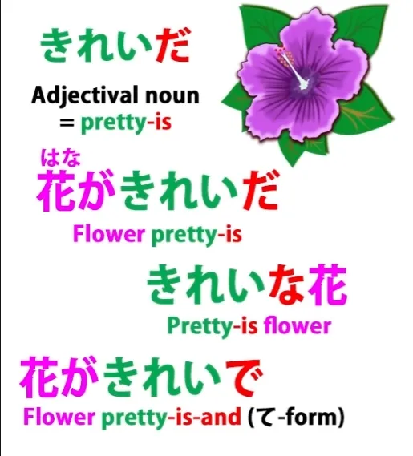
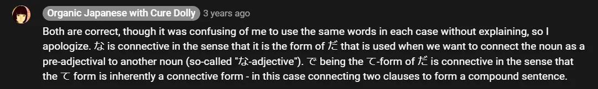
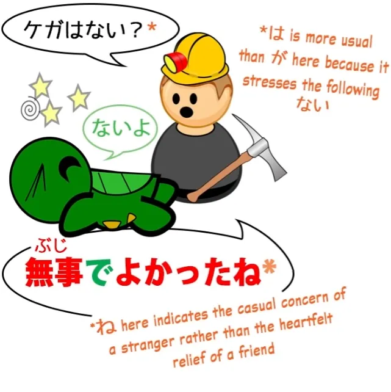
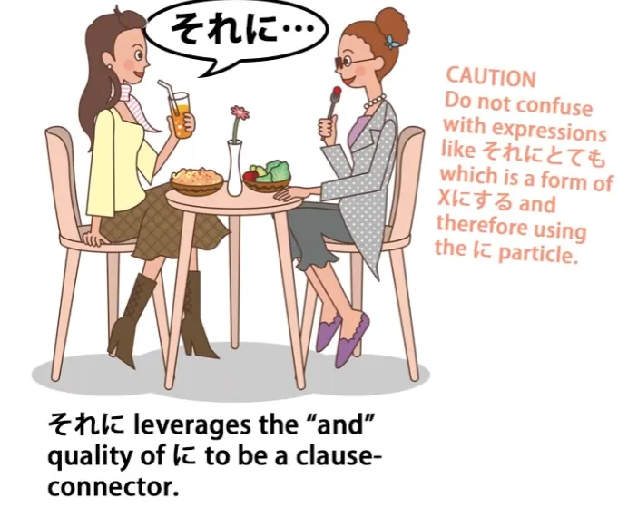

# **40. 3 Kesalahan Umum dalam Bahasa Jepang dan Cara Menghindarinya**

[**3 KESALAHAN UMUM dalam Bahasa Jepang dan Cara Menghindarinya 【 Pelajaran Struktur Bahasa Jepang 40 】**](https://www.youtube.com/watch?v=Qf7IGkrnnjY&amp;list;=PLg9uYxuZf8x_A-vcqqyOFZu06WlhnypWj&amp;index;=42&amp;pp;=iAQB)

こんにちは。

Hari ini kita akan membahas beberapa jebakan dalam struktur bahasa Jepang. Ini adalah elemen-elemen yang sangat kecil, yaitu elemen kana tunggal dalam bahasa tersebut, namun sangat vital. Jika Anda tidak mengetahuinya, hal ini bisa sangat membingungkan karena satu elemen dapat dengan mudah disalahartikan sebagai elemen lain yang terlihat identik.

Dan buku teks, dalam banyak kasus, sama sekali tidak memberitahu Anda tentang hal ini. Mereka membiarkan Anda benar-benar kebingungan.

## で (bentuk penghubung/ て -bentuk kopula)

Yang pertama akan kita bahas adalah <code>で</code>. Sekarang, <code>で</code>, seperti yang Anda ketahui, adalah partikel logis.

Partikel ini memiliki fungsi yang sangat jelas yang telah kita perkenalkan di Pelajaran 8b. Seperti semua partikel logis, partikel ini menandai sebuah kata benda, dan memberitahu kita bahwa kata benda tersebut adalah tempat di mana suatu tindakan terjadi atau sarana di mana suatu tindakan dilakukan.

Namun, ada <code>で</code>, yang bukan partikel, yang juga sangat sering digunakan dalam bahasa Jepang, dan buku teks tidak berusaha membedakan kedua elemen ini yang sepenuhnya berbeda namun tampak identik. Pertama kali kebanyakan dari kita akan menemui yang kedua dari <code>で</code>adalah dalam penggunaan kata benda sifat, yang secara membingungkan dan menyesatkan disebut <code>な-adjectives</code> oleh buku-buku pelajaran.

Jadi, jika kita mengatakan <code>さくらがきれいで優しい</code>, yang kita maksudkan adalah bahwa Sakura cantik dan baik hati. <code>綺麗/きれいだ</code> adalah kata benda kata sifat.

Jika kita ingin mengatakan <code>The flower is pretty</code>, kita mengatakan <code>花がきれいだ</code>. Dan jika kita ingin mengatakan <code>the pretty flower</code>, kita harus menempatkan <code>きれいだ</code> di sisi lain bunga, jadi kita mengatakan <code>きれいな花</code>.

Dan itu <code>な</code>, seperti yang kita ketahui, adalah bentuk konjungsi dari <code>だ</code>. Namun, jika kita ingin mengatakan <code>Sakura is pretty and kind</code>, kita tidak bisa menggunakan <code>だ</code> dan kita tidak bisa menggunakan <code>な</code>, tetapi kita harus menggunakan kopula.

Yang kita gunakan sekarang adalah bentuk penghubung dari kopula, yaitu bentuk &quot;て&quot;-nya. Dan bentuk &quot;て&quot; dari <code>だ</code> adalah <code>で</code>.

::: info
untuk menghindari kebingungan karena Dolly menggunakan frasa ‘bentuk penghubung dari kopula’ baik untuk bentuk ‘な’ maupun ‘で’ selanjutnya.

:::

Jadi, jika Anda mengatakan <code>Sakura is beautiful and kind</code>, ini adalah kata sifat sejati, sebuah <code>い-adjective</code>, dan kita menggunakan bentuk て untuk menghubungkannya: kita mengatakan <code>さくらが美しくて優しい.</code> Jika itu adalah kata benda yang berfungsi sebagai kata sifat, kita tetap harus menggunakan kopula, jadi kita mengatakan <code>さくらがきれいで...</code>

Itulah bentuk &quot;て&quot; dari kopula. Sekarang, saya sudah menjelaskannya dalam pelajaran kita tentang kata sifat, tetapi kita juga menemukan ini <code>で</code>, bentuk て <code>だ</code>, dalam banyak kasus lain dalam bahasa Jepang.

Jadi, mari kita ambil beberapa contoh dan lihat apakah Anda bisa membedakan mana dari kedua <code>で</code>yang digunakan. Hal yang sangat umum untuk dikatakan kepada seseorang saat Anda akan meninggalkannya, mungkin untuk sementara waktu, adalah <code>お元気で</code>.

Nah, <code>元気</code>, seperti yang Anda ketahui, berarti <code>well</code> atau <code>healthy</code> atau <code>lively</code> dan <code>お</code> hanyalah sebuah kata penghormatan atau pemanis. Apa <code>で</code> di sini?

Apakah itu Partikel logis ataukah bentuk &quot;て&quot; dari kopula? Ini adalah bentuk &quot;て&quot; dari kopula, bukan partikel.

Partikel itu tidak masuk akal di sini, bukan? Apa yang dilakukan bentuk て dari kopula?

Nah, kita tahu, bukan, bahwa bentuk て sering digunakan untuk membuat kalimat imperatif, untuk memerintahkan atau meminta seseorang melakukan sesuatu. Jadi, jika kita mengatakan <code>待って</code> — <code>wait</code> — ini semacam singkatan dari <code>待ってください</code> dan kita meminta seseorang untuk menunggu (<code>待って!</code> — <code>Wait!</code>).

Nah, hal ini persis sama dengan <code>で</code>, yang merupakan bentuk &quot;て&quot; dari kata hubung. Jadi, <code>元気だ</code> berarti <code>is 元気</code>, seseorang genki, seseorang sehat atau bersemangat.

<code>元気で</code> menyarankan mereka untuk \*menjadi\* genki atau bersemangat. <code>お元気で</code> — <code>be healthy / be lively / keep up the good spirits</code>.

### 無事 / ぶじで

Benar. Nah, ini satu lagi: <code>無事でよかった</code> adalah ungkapan lain yang sangat umum dan artinya <code>I&#x27;m glad that you&#x27;re all right / it&#x27;s good that you weren&#x27;t harmed / it&#x27;s good that you&#x27;re safe</code> — <code>無事でよかった</code>.

Apa yang kita miliki di sini?

Sekali lagi, kita memiliki bentuk て dari kata hubung. <code>無事</code>, yang secara harfiah berarti <code>no incident</code> dan oleh karena itu artinya <code>nothing happened / nothing bad happened / you weren&#x27;t harmed / you&#x27;re safe.</code>

Jadi, <code>無事だ</code> berarti <code>you&#x27;re safe / you weren&#x27;t harmed / nothing happened</code>. <code>無事で</code> mengubah <code>だ</code>, kopula itu, menjadi bentuk penghubung.

Kita menggunakan bentuk &quot;て&quot; untuk menghubungkan hal-hal, bukan? Jadi, sama seperti kita mungkin mengatakan, <code>遅くなってすみません</code> — <code>That I came late, I&#x27;m sorry</code> — kita juga mengatakan <code>無事でよかった</code> — <code>That you weren&#x27;t hurt, that was good.</code>

Dan bentuk penghubung &quot;て&quot; ini juga digunakan dalam kalimat majemuk yang lebih panjang. Jadi, misalnya, kita mungkin mengatakan <code>さくらはいい子で毎日学校に行く</code> — <code>Sakura is a good child and she goes to school every day.</code>

Kita memiliki dua klausa lengkap dan, sama seperti bentuk て dari kata kerja apa pun, kita dapat menggunakannya untuk menghubungkan klausa yang diakhiri kata kerja tersebut ke klausa kedua, sehingga kita dapat melakukan hal yang persis sama dengan kopula. Jadi, <code>さくらがいい子だ</code> — <code>Sakura&#x27;s a good girl</code> — adalah kalimat lengkap itu sendiri.

Jika kita ingin menghubungkannya dengan klausa kedua untuk menjadikannya bagian pertama dari kalimat majemuk, kita mengubahnya <code>だ</code> menjadi bentuk &quot;て&quot;, <code>で</code>. Jadi, <code>Sakura is a good girl and she goes to school every day.</code>

Dan seperti biasa dengan penghubung bentuk て, hal ini cenderung menyiratkan hubungan positif di antara keduanya. Hal ini memiliki implikasi <code>Because Sakura&#x27;s a good girl, she goes to school every day,</code> tetapi tidak mengatakannya sekuat jika kita menggunakan <code>から</code>.

---

Sekarang, kebingungan lain, yang tidak disembunyikan sebagai rahasia yang sangat dalam dan gelap oleh buku teks, tetapi mereka tidak selalu menekankannya dengan cukup jelas, dan hal ini sangat penting karena menyangkut inti dari bahasa Jepang, yaitu partikel &quot;が&quot;.

## Konektor klausa &quot;が&quot;

Partikel &quot;が&quot;, seperti yang kita ketahui, adalah partikel yang tidak pernah bisa dilewatkan dalam kalimat atau klausa bahasa Jepang, baik terlihat maupun tidak. <code>が</code> menandai subjek (A) dari setiap kalimat, pelaku (do-er) dalam klausa A-melakukan-B, dan subjek (be-er) dalam klausa A-adalah-B.

Namun, ada juga partikel lain <code>が</code>. Tidak mudah untuk membingungkan keduanya, asalkan Anda benar-benar menyadarinya.

Partikel lainnya <code>が</code> juga merupakan penghubung klausa. Dan biasanya itu adalah penghubung klausa kontrasif.

Jadi, jika kita mengatakan, <code>お店に行ったがパンがなかった,</code> kita mengatakan <code>I went to the shops, but there wasn&#x27;t any bread.</code>

::: info
が kedua adalah versi partikel dari &quot;が&quot; untuk klausa logisnya, menandai &quot;パン&quot;.
:::

Jadi, ini adalah konjungsi kontrasif. Kami pergi ke toko berharap ada roti, tetapi tidak ada sama sekali.

Tidak mungkin membingungkan ini dengan yang lain <code>が</code>, <code>が</code> yang menandai subjek kalimat, A-car, karena partikel <code>が</code>, partikel <code>が</code>, hanya dapat menandai kata benda.

Dan konektor klausa <code>が</code> hanya dapat menandai kalimat lengkap. Partikel <code>が</code> tidak bisa menandai kalimat lengkap, karena kalimat lengkap tidak bisa diakhiri dengan kata benda.

Kalimat harus diakhiri dengan kata kerja, kata sifat, atau kata penghubung, seperti yang kita pelajari di pelajaran pertama. Jadi, tidak mungkin untuk membingungkan keduanya selama Anda menyadarinya dengan jelas.

Satu hal lagi yang perlu kita perhatikan adalah bahwa <code>が</code> tidak harus bersifat kontras. Sebagian besar waktu memang demikian, tetapi partikel ini dapat digunakan sebagai konjungsi biasa yang tidak kontras.

Hal ini perlu diketahui, karena jika Anda melihatnya menghubungkan dua klausa dan sepertinya tidak ada kontras di sana, Anda tidak perlu memaksakan diri untuk mencari kontras — kadang-kadang konjungsi ini digunakan secara non-kontrasif. Dan hal lain yang perlu Anda ketahui adalah bahwa terkadang Anda akan menemukan konjungsi kontrasif ini <code>が</code> di akhir kalimat.

Dan saya pernah membahas sebelumnya tentang kalimat yang diakhiri dengan konjungsi. Secara ketat, kalimat tersebut tidak lengkap, karena yang dilakukannya adalah menyiratkan klausa berikutnya.

<code>が</code> di akhir kalimat sering kali merupakan bentuk kesopanan, karena <code>が</code> sebenarnya lebih sopan daripada <code>けど</code> atau <code>でも</code>, cara lain untuk mengatakannya <code>but</code>. Jadi, jika kita mengatakan sesuatu seperti <code>*(私は)* コーヒーがほしいが</code> — <code>coffee is want-making (to me)</code> dan kemudian kita menambahkan <code>が</code>.

Dan yang <code>が</code> berarti <code>but...</code> dan menyiratkan klausa kedua tetapi tidak mengatakannya secara eksplisit, jadi <code>コーヒーがほしいが</code> berarti sesuatu seperti &quot;Saya ingin kopi, tapi... jika merepotkan, tolong jangan repot-repot membelikan saya kopi&quot; atau sesuatu yang serupa.

## に yang berfungsi sebagai <code>と</code>

Yang terakhir yang akan kita bahas kurang umum, tetapi jika Anda membaca teks Jepang dalam jumlah berapa pun, Anda akan segera menemukannya, dan itu adalah <code>に</code>. Sekarang, kita tahu <code>に</code>.

Ini lagi-lagi partikel logis. Ini adalah partikel penunjuk sasaran, dan saya sudah membuat video khusus tentang ini karena ini adalah partikel yang penting dan kompleks.

Tapi ada juga partikel lain <code>に</code>. Dan partikel lain ini <code>に</code>, yang merupakan penggunaan yang agak kuno — berasal dari bahasa Jepang kuno — artinya sama dengan <code>と</code>.

Partikel ini dapat digunakan untuk menggabungkan dua kata benda atau daftar kata benda.

Jadi, dalam dongeng Beauty and the Beast, ketika sang ayah bertanya kepada salah satu saudara perempuan yang kurang baik apa yang ingin dia bawa pulang untuknya, dia berkata <code>靴に指輪に帽子</code>. Dia mengatakan bahwa dia ingin sepatu, cincin, dan topi.

Jadi, ini <code>に</code> dapat digunakan untuk menghubungkan dua benda atau daftar benda, dan ini sama sekali berbeda dari partikel <code>に</code>. Ini sedikit bersifat sastra, jadi Anda lebih sering menemukannya dalam bahasa Jepang tertulis.

Namun, jika Anda tidak tahu bahwa partikel ini ada, Anda bisa menghabiskan waktu lama untuk memikirkan apa <code>に</code> artinya dalam konteks-konteks ini. Partikel ini juga lebih sering digunakan dalam ungkapan <code>それに</code>, yang berarti <code>furthermore</code> atau <code>in addition to that</code>.

::: info
Ada kesalahan ketik pada catatan berwarna oranye di gambar tersebut. それにとても seharusnya それにしても.

:::

Dan, seperti yang bisa Anda lihat, ini terdiri dari <code>それ</code>, yang berarti <code>that</code>, ditambah <code>に</code> — bukan partikel <code>に</code> tetapi <code>に</code> yang berarti <code>and</code>.
