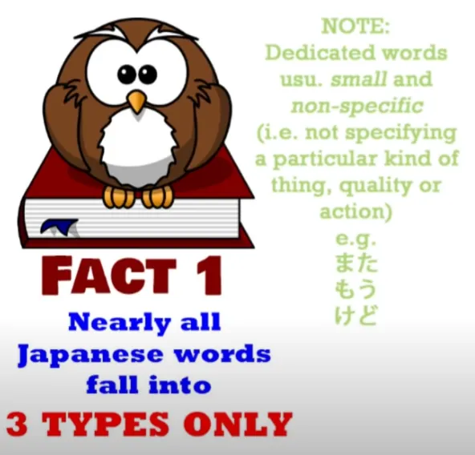
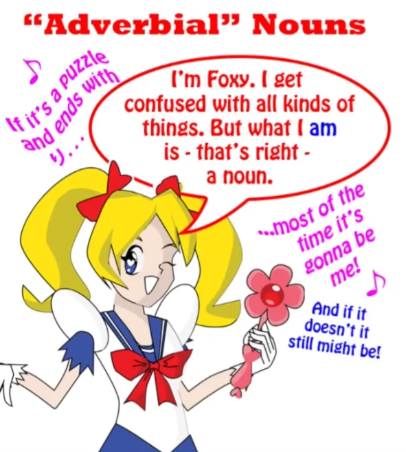
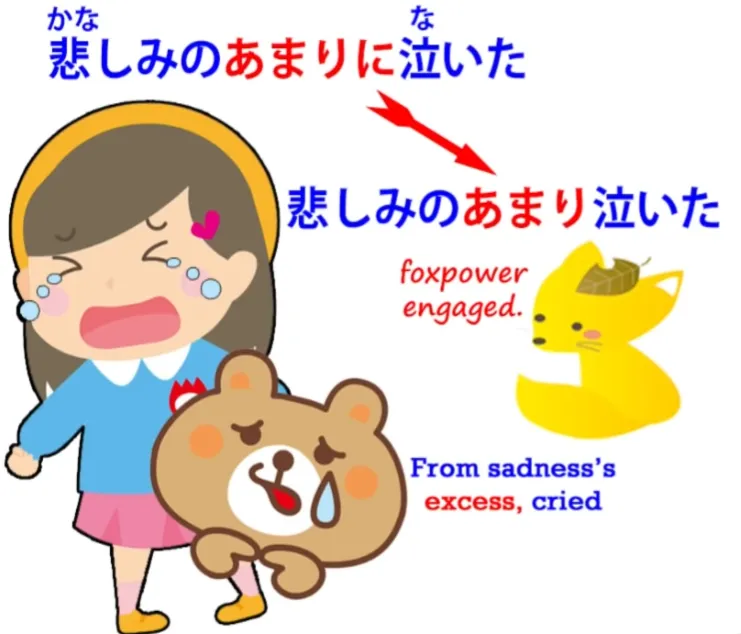
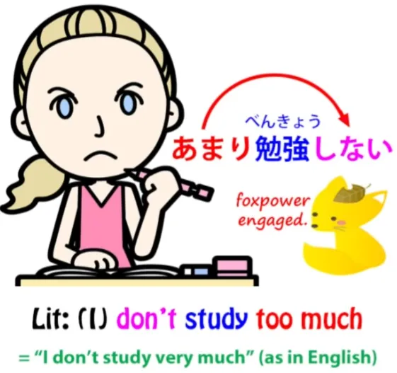
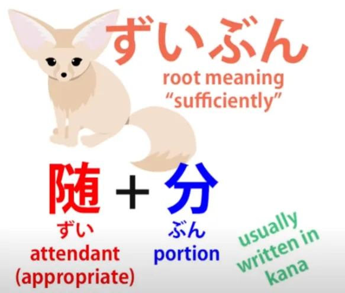
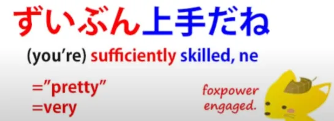

# **41. 5 fakta penting tentang struktur dasar bahasa Jepang**

[**5 fakta penting yang tak pernah mereka ceritakan tentang struktur dasar bahasa Jepang. Pelajaran 41**](https://www.youtube.com/watch?v=8AXyP5GeJFg&amp;list;=PLg9uYxuZf8x_A-vcqqyOFZu06WlhnypWj&amp;index;=43&amp;pp;=iAQB)

こんにちは。

Hari ini kita akan membahas sesuatu yang sangat penting yang memengaruhi seluruh struktur bahasa Jepang. Dan, sungguh mengejutkan, buku teks tidak pernah menjelaskannya dengan benar. Yang akan kita bahas adalah kata-kata dalam bahasa Jepang. Bukan kosakata, melainkan sifat kata-kata itu sendiri dan bagaimana kata-kata tersebut bekerja secara struktural di dalam bahasa. Ini tidak sulit. Sebenarnya, ini sangat sederhana. Namun, jika Anda tidak mengetahuinya, hal ini akan sangat membingungkan karena Anda melihat sebuah kalimat tetapi tidak tahu apa yang sebenarnya dilakukan kata-kata tersebut di dalam kalimat tersebut. Dan inilah posisi di mana buku teks meninggalkan Anda.

Faktanya, bahasa Jepang jauh lebih sederhana daripada bahasa Inggris dan jauh lebih sederhana daripada kebanyakan bahasa dalam hal jenis kata yang dimilikinya. Namun, buku teks dan kamus bahasa Inggris mencoba menyesuaikan kata-kata Jepang dengan berbagai jenis kata dalam bahasa Inggris, dan hal ini sama sekali tidak berhasil serta menimbulkan kebingungan yang tak berujung. Jadi, saya akan memaparkan lima fakta yang akan menjelaskan seluruh situasi ini.

## Fakta 1

Fakta 1: Hampir semua kata dalam bahasa Jepang masuk ke dalam salah satu dari tiga kategori. Hanya tiga. Dan ketiga kategori tersebut adalah: Kata Benda, Kata Kerja, dan Kata Sifat. Sekarang, seperti yang kita ketahui, ada juga partikel — mereka bukan kata, tetapi merupakan elemen dasar yang menyatukan bahasa. Dan ada beberapa — sangat sedikit — kata khusus yang tidak termasuk dalam ketiga kategori tersebut.

Misalnya, ada kata-kata penghubung yang menggabungkan dua klausa logis untuk membentuk kalimat majemuk. Kebanyakan kata penghubung tidak menggunakan kata-kata — melainkan menggunakan bentuk &quot;て&quot;, akar kata &quot;い&quot;, atau kelompok partikel seperti <code>でも</code> dan <code>のに</code>. Namun, ada beberapa konjungsi khusus seperti <code>けど</code> dan yang lain <code>が</code>, <code>が</code> yang bukan partikel melainkan konjungsi, yang telah kita bahas dalam video baru-baru ini. Nah, selain itu, semua yang Anda lihat akan berupa kata benda, kata kerja, atau kata sifat.

## Fakta 2

Fakta 2: Kata kerja dan kata sifat sangat mudah dikenali dan dibedakan.

Setiap kata kerja berakhir dengan kana &quot;う&quot; — dan harus berupa kana, tidak boleh menjadi bagian dari kanji. Dan setiap kata sifat harus berakhir dengan kana &quot;い&quot;. Lagi-lagi, harus berupa kana, tidak boleh menjadi bagian dari kanji. Sekarang, seperti yang kita ketahui, ada transformasi tertentu yang sepenuhnya teratur yang dapat dilakukan oleh kana baris -う ini dan い ini.

Mereka dapat berubah menjadi bentuk て atau bentuk た, dan kana baris -う akhir dari sebuah kata kerja dapat berubah menjadi kana yang setara di baris yang sama untuk melekatkan kata bantu seperti kata sifat bantu negatif <code>ない</code> atau kata kerja bantu kausatif <code>せる/させる</code>.

Sekarang, setelah Anda mengetahui permutasi dasar kata kerja dan kata sifat, yang sebaiknya Anda pelajari sejak awal, Anda tahu bahwa jika sebuah kata tidak memiliki salah satu dari akhiran kata kerja atau kata sifat yang mungkin tersebut, maka kata itu adalah kata benda. Anda tahu bahwa jika sebuah kata ditulis hanya dalam kanji atau dapat ditulis hanya dalam kanji, dalam 99 dari 100 kasus itu adalah kata benda. Jadi, bahasa Jepang, seperti yang saya katakan sebelumnya, adalah bahasa yang sangat berpusat pada kata benda.

## Fakta 3

Fakta 3: Ada banyak sekali kata benda super. Yang saya maksud adalah ada kategori khusus kata benda tertentu, masing-masing memiliki satu kekuatan super dan hanya satu. Artinya, kata benda dalam setiap kelompok kata benda khusus atau super ini berbeda dari kata benda biasa hanya dalam satu hal. Sekarang, dua dari kelompok tersebut sudah kita ketahui, jadi sebagai Fakta 4 saya hanya akan membahasnya secara singkat.

## Fakta 4

### Kata benda adjektival

Kelompok pertama adalah kata benda adjektival, yang dinamai dengan sangat keliru oleh buku teks <code>な adjectives</code>. Mereka bukanlah kata sifat. Mereka adalah kata benda yang dalam keadaan tertentu dapat digunakan sebagai kata sifat.

Kekuatan super dari kata benda adjektival, satu hal yang dapat mereka lakukan yang membedakan mereka dari kata benda lainnya, adalah bahwa mereka dapat menggunakan bentuk lunak atau bentuk penghubung dari kata penghubung <code>だ</code>. Jadi, kita bisa mengatakan <code>屋敷が不思議だ</code> — <code>mansion mysterious is</code>. Saat kita melakukan ini, kita hanya melakukan apa yang bisa kita lakukan dengan kata benda mana pun. Kita bisa mengatakan <code>さくらが日本人だ</code> — <code>Sakura Japanese person is</code>.

Namun, kita juga dapat menggunakan bentuk lunak dari <code>だ</code>, yaitu <code>な</code>, dan kita bisa mengatakan <code>不思議な屋敷</code> - <code>mysterious-is mansion</code>.

Anda tidak bisa melakukan itu dengan kata benda biasa. Dan itulah satu-satunya perbedaan antara kata benda biasa dan kata benda yang berfungsi sebagai kata sifat.

###  Kata benda &quot;する&quot;

Kelompok kedua adalah kata benda &quot;する&quot;, yang kamus-kamus menyebutnya dengan agak membingungkan sebagai <code>する verbs</code>. **Sebenarnya, kata-kata itu adalah kata benda.**

**Dan kekuatan istimewanya adalah mereka diperbolehkan menghilangkan penanda objek langsung, <code>を</code>.** Jadi, **jika kita ambil kata benda <code>勉強</code>, yang berarti <code>study</code>, kita dapat mengatakan <code>勉強をする</code>**, yang berarti <code>do study</code> tetapi kita juga bisa mengatakan <code>勉強する</code>, yang berarti <code>*to* study</code> (**kata kerja**).

::: info
Pada dasarnya, ini hanyalah perbedaan yang sangat halus.* *
Struktur &quot;を&quot; adalah Objek Langsung (kata benda) + kata kerja (勉強を + する) &amp; struktur &quot;勉強する&quot; adalah kata kerja &quot;する&quot;.
:::

**Kita dapat menggunakan bentuk tak langsung (を) untuk menandai objek langsung dari kata kerja apa pun, tetapi kita hanya dapat menghilangkan bentuk tak langsung (を) tersebut jika objeknya berupa kata benda tak langsung (する).** Itulah keistimewaan mereka. Jadi, ketika kita melakukannya, **kita menggabungkan <code>勉強</code> dengan <code>する</code>** **dan menciptakan apa yang benar-benar dapat kita sebut sebagai <code>する verb</code>.**

**Namun, poin penting yang perlu diingat adalah bahwa ketika <code>する</code> tidak terikat padanya, itu bukanlah kata kerja &quot;する&quot;. Itu bukan jenis kata kerja apa pun. Itu adalah kata benda.**

::: info
Perhatikan bahwa <code>WHEN する is NOT attached to it</code> misalnya &quot;勉強をする&quot;, di mana &quot;勉強&quot; adalah kata benda. Namun, pada &quot;勉強する&quot;, &quot;する&quot; seharusnya menjadi Kepala frasa &quot;勉強する&quot;, jadi itu haruslah kata kerja.
:::

Jadi kita bisa mengatakan <code>勉強が好きだ</code>. Artinya <code>study *(noun)* is pleasing to me</code>. Kita tidak mengatakan <code>勉強するのが好きだ</code>, karena jika kita mengatakan itu, kita akan mengambil sebuah kata benda, mengubahnya menjadi kata kerja dengan <code>する</code>, lalu mengubahnya kembali menjadi kata benda dengan <code>の</code> *(nominalisator untuk kata kerja &quot;勉強する&quot;)*. Kita tidak perlu melakukan itu karena kata tersebut sudah merupakan kata benda sejak awal.

## Fakta 5

### Kata benda adverbial

Sekarang, kelompok ketiga, yang belum kita bahas, adalah kata benda adverbial. Ada banyak sekali kata benda ini dan sebagian besar di antaranya berakhiran dengan kana <code>り</code>, tetapi tentu saja tidak semuanya.

Jadi, kita akan melihat dua yang berakhiran kana dan satu yang tidak, serta kita akan melihat &quot;kekuatan super&quot; mereka. Kekuatan istimewanya sangat mirip dengan kekuatan istimewa kata benda yang dapat digunakan sebagai kata keterangan (する), yaitu bahwa mereka dapat menghilangkan partikel yang relevan dalam keadaan tertentu. Seperti yang kita ketahui, **setiap kata benda yang sesuai untuk digunakan dapat diubah menjadi kata keterangan dengan menambahkan partikel *に*.**

Jadi, <code>静か</code>, yaitu *(Adjectival)* **kata benda** <code>quiet</code>, **dapat digunakan sebagai kata keterangan dengan kata &quot;に&quot;.** Kita dapat mengatakan <code>**静かに**する</code> — <code>do **quietly** / act **quietly**</code>. Kita dapat mengatakan <code>**静かに**歩く</code> — <code>walk **quietly**</code>.

---

*(Namun)* **Pada kata benda yang berfungsi sebagai kata keterangan, kita dapat menghilangkan *に* tersebut.**

::: info
Saya pikir Dolly di sini TIDAK bermaksud bahwa kita bisa menghilangkan に dengan 静か karena itu BUKAN kata keterangan (noun adverbial) seperti ゆっくり, melainkan kata benda sifat. Setidaknya saya tidak menemukan apa pun tentang 静かする dsb.
Dolly juga tampaknya menyiratkan di beberapa titik[[8]](./8-the- に -dan- へ -particles.md) bahwa kata keterangan seperti ゆっくり dapat diklasifikasikan sebagai jenis kata benda, meskipun sumber seperti Jisho/Yomichan mencantumkannya sebagai Kata Keterangan dan nama mereka 副詞 (ふくし) tentu saja berbeda, yang berarti Kata Keterangan, jadi ini hanyalah subkelas khusus.
:::

*Saya pikir istilah <code>Adverbial Noun</code> mungkin merujuk pada apa yang dimaksud 副詞 untuk Dolly, di mana biasanya mereka disebut kata keterangan, tetapi mungkin mereka merupakan kelas kata benda yang sangat khusus dalam bahasa Jepang, jadi mengapa Dolly menyebutnya demikian. Mengenai mengapa kita bisa menghilangkan に, karena ゆっくり sudah menjadi 副詞 secara default.*
Jadi, kita akan mengambil yang berakhiran <code>り</code>: <code>ゆっくり</code> — yang berarti ****lambat**** atau ****santai**** dan kita bisa mengatakan <code>**ゆっくりに**する</code> — <code>act **in a leisurely manner**</code>, <code>**ゆっくりに**歩く</code> — <code>walk **slowly**</code>. Tapi kita juga bisa mengatakan <code>ゆっくりする</code>, <code>ゆっくり歩く</code>. **Kita bisa menghilangkan &quot;に&quot; itu**.

Jadi, **itulah satu-satunya kekuatan super dari kata benda keterangan.** Dan penting untuk memahami hal ini karena ketika Anda mulai mencoba menjelaskannya tanpa menyadari fakta mendasar ini, Anda bisa menghadapi berbagai macam kesulitan.

Mari kita ambil contoh lain: <code>余り/あまり</code>.

####あまり

Sekarang, kata benda ini biasanya dijelaskan dengan cara yang sangat membingungkan. **<code>あまり</code> adalah kata benda**, dan artinya adalah <code>excess</code>.

Anda dapat menggunakannya dalam arti yang sepenuhnya harfiah. Anda dapat mengatakan <code>ご飯のあまり</code> — yang berarti <code>the excess rice / the leftover cooked rice</code>.

Seringkali kata ini digunakan dalam konteks yang lebih abstrak. Jadi, kita bisa mengatakan <code>悲しみのあまり泣いた</code>.

Sekarang, ini berarti <code>from an excess of sadness, I cried.</code>

Dan, seperti yang Anda lihat, kita bisa menghilangkan partikelnya. **Kita biasanya memang menghilangkan partikelnya dengan <code>あまり</code>.** **Jadi, sekarang partikel ini digunakan sebagai kata keterangan dan tetap berarti <code>excess</code>.**

Sekarang, buku teks umumnya memperkenalkannya dalam konteks yang berbeda, yang membuatnya sangat membingungkan ketika kita melihatnya dalam konteks lain dan terutama ketika kita tidak memahami bahwa itu sebenarnya adalah kata benda. Mereka menunjukkannya digunakan sebagai kata keterangan dalam ungkapan seperti <code>あまり勉強しない</code>.

Apa arti harfiahnya? Arti harfiahnya <code>I don&#x27;t study too much / I don&#x27;t do an excess of study.</code> Tapi tentu saja, seperti yang kita tahu, arti praktisnya adalah bahwa <code>I don&#x27;t study very much</code>.

**Dan inilah yang kita sebut litotes.** Kita telah membahas hiperbola dalam bahasa dan bagaimana hal itu merupakan fenomena yang sangat umum.

Litotes adalah kebalikan dari hiperbola. Hiperbola adalah mengatakan lebih dari yang sebenarnya kita maksud; litotes adalah mengatakan kurang dari yang sebenarnya kita maksud.

Kata <code>litotes</code> tidak sepopuler <code>hyperbole</code>. Mungkin karena bahasa Barat saat ini jauh lebih cenderung menggunakan hiperbola daripada litotes.

Namun, kita masih menemukan litotes dalam ungkapan-ungkapan baku. Jadi, jika kita akan piknik dan melihat awan gelap di langit lalu berkata <code>It doesn&#x27;t look too good!</code> apa yang secara harfiah kita katakan adalah <code>It doesn&#x27;t look excessively good</code> tetapi yang sebenarnya kita maksudkan adalah <code>It doesn&#x27;t look very good!</code>

Dan hal yang sama berlaku untuk <code>あまり</code>. Jika kita berkata <code>あまり勉強しない</code>, kita mengatakan <code>I don&#x27;t study too much / I don&#x27;t study excessively</code> tetapi yang sebenarnya kami maksud adalah <code>I don&#x27;t study very much at all.</code>

#### 随分

Jadi, mari kita ambil satu lagi yang tidak berakhir dengan <code>り</code>, yaitu <code>随分/ずいぶん</code>. Yang sebenarnya dimaksud adalah <code>sufficiently</code>.

Dan Anda mungkin berkata, <code>Well, **sufficiently** isn&#x27;t a noun</code>. Dan itu benar — dalam bahasa Inggris itu bukan kata benda.

Dalam bahasa Jepang itu adalah kata benda, dan jika kita melihat kanji <code>随分</code>, artinya sebenarnya adalah sesuatu seperti <code>appropriate portion</code> atau <code>appropriate amount</code> — dengan kata lain, <code>sufficient</code> atau <code>sufficiently</code>. Dan ini adalah litotes lain yang umum ditemukan baik dalam bahasa Inggris maupun Jepang serta banyak bahasa lainnya.

Ketika Anda berkata kepada seseorang <code>ずいぶん上手だね</code>, yang sebenarnya Anda katakan adalah <code>you&#x27;re skilful enough / you&#x27;re sufficiently skilful</code>. Yang sebenarnya Anda maksudkan adalah bahwa orang tersebut sangat terampil.

Dan hal ini sama saja dalam bahasa Inggris. Anda mungkin akan mengatakan <code>You&#x27;re pretty good</code>.

Dan <code>ずいぶん</code>, seperti <code>pretty</code> atau <code>fairly</code> dalam bahasa Inggris dapat mencakup rentang makna yang luas dari arti aslinya <code>sufficiently</code> atau <code>fairly</code> hingga makna litotes yang lebih umum yaitu <code>very / considerably</code>. Jadi, hal yang perlu diingat adalah bahwa jumlah jenis kata dalam bahasa Jepang sangat terbatas.

Hampir semua kata adalah kata kerja, kata benda, atau kata sifat. **Dan kata-kata yang bukan kata kerja atau kata sifat, apa pun yang dikatakan kamus tentang mereka,** **pada dasarnya hampir selalu merupakan kata benda.** *(Hal ini tampaknya mendukung teori &quot;副詞&quot; saya di atas)*

Ketika Anda memahami hal itu, Anda akan memiliki pemahaman yang jauh lebih jelas tentang apa yang terjadi dalam sebuah kalimat.

::: info
Lihat ini:

:::
