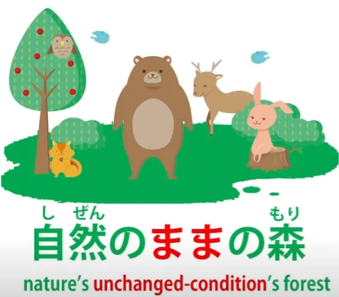
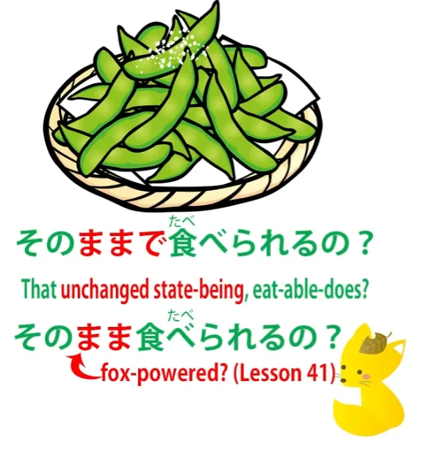
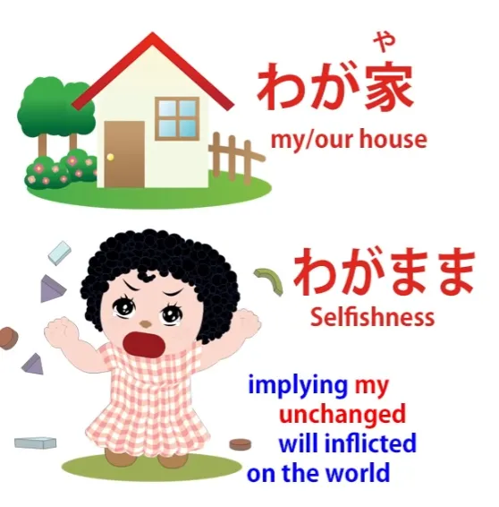

# **42. Kesalahan pemahaman kata dasar | まま**

[**Mengapa buku teks <code>grammar points</code> begitu menyesatkan. Kebingungan kata dasar | まま mama | Pelajaran 42**](https://www.youtube.com/watch?v=rCdhDCmhMZc&amp;list;=PLg9uYxuZf8x_A-vcqqyOFZu06WlhnypWj&amp;index;=44&amp;pp;=iAQB)

こんにちは。

Hari ini kita akan membahas beberapa cara di mana penjelasan konvensional standar tentang bahasa Jepang membawa Anda ke padang gurun dan kemudian terbang pergi dengan helikopter, sambil tertawa. Dalam pelajaran-pelajaran sebelumnya dalam seri ini, kita telah membahas bagaimana hal itu terjadi sehubungan dengan struktur dasar bahasa tersebut. Namun, hal ini juga terjadi pada tahap selanjutnya dengan penjelasan tentang segala macam hal yang mereka sebut <code>grammar points</code>. Dan salah satu penyebab utamanya adalah fakta bahwa mereka gagal mengenali apa sebenarnya kata-kata itu dan apa yang sebenarnya dilakukannya.

Jadi, kita akan mengambil, sebagai contoh, <code>まま</code>, kata <code>ママ</code>. Sekarang, ini bisa berarti seorang ibu atau pemilik bar atau kafe, tetapi kita membicarakannya dalam arti lain, arti yang lebih abstrak, yang, jika kita melihat penjelasan tradisional, tampaknya ada berbagai pendapat mengenai bagian kata apa itu.

::: info
untuk menghindari kebingungan, ママ dalam katakana berarti <code>mom</code> atau <code>mistress of a bar</code>. Sedangkan &quot;まま&quot; adalah yang akan dibahas oleh Dolly. Kata ini juga memiliki bentuk Kanji &quot;儘&quot; atau &quot;侭&quot;, tetapi bentuk tersebut tidak banyak digunakan.
Jadi &quot;まま&quot; ≠ &quot;ママ&quot;, keduanya berbeda. &quot;まま&quot; menandakan keadaan yang tidak berubah, sedangkan &quot;ママ&quot; berarti <code>mom/bar mistress</code>...
:::

Saya bahkan pernah melihatnya dijelaskan sebagai partikel, padahal jelas bukan. Dan mereka mengatakan bahwa itu berarti <code>as it is / as we wish it to be / as we would like it to be</code>, bahwa itu berarti suatu keadaan atau kondisi. Sekarang, semua hal itu adalah hal-hal yang mungkin kita katakan dalam bahasa Inggris sehubungan dengan penggunaan tertentu dari kata tersebut. Namun tidak satupun dari mereka yang mengungkapkan apa arti sebenarnya dari kata tersebut.

Bagaimanapun, jika itu berarti <code>as it is</code> atau <code>as we wish it to be</code>, kata macam apa itu? Jadi, hal pertama yang harus kita tanyakan pada diri sendiri adalah <code>What kind of a word is it?</code> Dan, seperti yang saya jelaskan dalam pelajaran terakhir kita, hampir semua kata dalam bahasa Jepang termasuk dalam salah satu dari tiga kategori: kata benda, kata kerja, dan kata sifat. Nah, <code>まま</code> bukanlah kata kerja: kata tersebut tidak berakhiran -う atau kana baris う.

Ini bukan kata sifat: tidak berakhiran -い Jadi kemungkinan besar ini adalah kata benda, dan memang itulah kata tersebut. Ini adalah kata benda.

Jadi, kata benda seperti apa ini? Apa artinya? Apa itu <code>まま</code>? <code>まま</code> adalah suatu benda; itu adalah kata benda. Benda seperti apa itu? Nah, itu adalah benda yang sangat sederhana, benda yang sangat jelas, dan begitu kita tahu apa itu, kita dapat memahaminya dalam segala situasi.

A <code>まま</code> adalah suatu kondisi yang tidak berubah. Di mana pun Anda melihat <code>まま</code>, Anda dapat membaca <code>unchanged condition</code>. Ada satu keadaan di mana kata ini memiliki makna yang sedikit lebih luas dan selain itu — yang sangat sederhana dan akan segera kita bahas — kita memiliki definisi, pemahaman tentang <code>まま</code>: <code>unchanged condition</code>.

Jadi, mari kita lihat beberapa cara penggunaannya. Kita bisa mengatakan <code>自然のままの森</code> — itu <code>a forest in its natural *(unchanged)* state</code>.

<code>自然</code> adalah alam<code> and </code>まま<code> is </code>keadaan yang tidak berubah<code> or </code>keadaan yang tidak berubah&quot;. Jadi, <code>自然のまま</code> adalah <code>unchanged condition of nature</code>. <code>自然のままの森</code> adalah <code>the forest in the unchanged condition of nature</code>.

Nah, saat kamu berada di Jepang, mungkin ada orang yang menawark枝豆/えだまめ, yaitu kacang yang tumbuh di dahan pohon, itulah sebabnya disebut 枝豆 (yang artinya <code>branch bean</code>). Dan Anda mungkin melihatnya, kacang-kacang itu tidak dimasak atau semacamnya, Anda mungkin berkata <code>そのままで食べられるの?</code> — <code>Can you eat them just as they are / can you eat them in their unchanged condition?</code>

Nah, itu <code>で</code> sebenarnya adalah kopula, jadi kita mengatakan <code>being their unchanged condition, can we eat them?</code> Sekarang, ada satu hal yang bisa kita lakukan <code>まま</code> yang tidak bisa kita lakukan dengan semua kata benda, yaitu kita bisa menghilangkan <code>で</code>. Jadi kita bisa mengatakan <code>そのまま食べられる?</code>

Sekarang, kita bisa mengatakan bahwa ini karena <code>まま</code> adalah semacam kata benda keterangan yang telah kita bahas minggu lalu, di mana Anda diperbolehkan menghilangkan partikel tersebut dalam kasus-kasus tertentu, tetapi saya rasa kita bahkan tidak perlu melangkah sejauh itu. <code>An unchanged condition</code> secara definisi adalah suatu kondisi yang bisa berubah tetapi belum berubah.

Jadi, menurut saya dalam kasus seperti ini jika kita mengatakan <code>そのまま食べられる</code>, kita berarti mengatakan <code>そのまま食べられる</code> tanpa <code>で</code>, menurut saya, memperlakukan <code>そのまま</code> sebagai ungkapan waktu relatif. Kita mengatakan <code>while they&#x27;re in their unchanged condition</code>, jadi pada dasarnya kita sedang membicarakan suatu periode waktu, periode waktu di mana mereka berada dalam kondisi yang belum berubah. Jadi begitulah sebenarnya cara saya cenderung memandangnya.

<code>During the period when they&#x27;re in their unchanged condition, can we eat them?</code> Bagaimanapun juga, tidak ada keraguan mengenai arti kata tersebut. Artinya <code>unchanged condition</code>.

Kita bisa mengatakan <code>パジャマのまま朝ごはんを食べる</code>. Itu berarti <code>Eat breakfast while we&#x27;re still in our pyjamas</code>. Dengan kata lain, <code>in the unchanged condition of being still in our pyjamas, eat breakfast</code>.

Dan seperti yang dapat kita lihat, sekali lagi implikasinya di sini adalah bahwa kondisi tersebut bisa berubah tetapi belum berubah. <code>いつまでも若いままでいたい</code> — <code>I&#x27;d like to stay young forever.</code> <code>I&#x27;d like to stay in the unchanged condition of being young forever.</code>

Dan perhatikan di sini bahwa kita mengatakan <code>若いまま</code>, jadi Anda lihat <code>若い</code>, kata sifat tersebut, melakukan apa yang selalu dilakukan kata sifat, yaitu menjelaskan kata benda. Dan kata benda yang dijelaskannya adalah <code>まま</code>: <code>the unchanged condition of being young</code>.

---

Sekarang, ada penggunaan <code>まま</code> yang mungkin akan sering Anda temui, yaitu <code>思いのまま</code> atau <code>心のまま</code>. Dan artinya adalah <code>in the unchanged condition that&#x27;s in our thoughts</code> atau <code>...in our hearts</code>.

Jadi, apa sebenarnya artinya ini? Nah, ini selalu diterapkan pada sesuatu yang berada di luar diri kita, jadi kita sedang membicarakan sesuatu di luar diri kita yang berada dalam kondisi yang tidak berubah, kondisi yang persis sama, seperti apa yang ada di dalam diri kita. Jadi, ini pada dasarnya berarti membuat dunia luar menyesuaikan diri dengan pikiran kita, keinginan kita, dan kehendak kita.

Dan dalam keadaan tertentu, hal ini bisa diartikan sebagai sikap egois, tetapi tidak harus demikian. Saya rasa pertama kali saya mendengarnya adalah dalam sebuah anime di mana para karakternya berada di bawah air.

Mereka bisa bernapas, tetapi mereka menyadari bahwa mereka tidak bisa bergerak sesuka hati, sama seperti yang terjadi di dalam air. Dan mereka berkata <code>思いのままに動けない</code> — <code>we are unable to move in the unchanged condition of our thoughts</code> atau <code>...the unchanged condition of our will or desire</code>.

Sekarang, kita harus memahami di sini bahwa <code>思い</code> kadang-kadang memang menyiratkan keinginan. Misalnya, ketika kita mengatakan <code>片思い</code>, yang secara harfiah berarti <code>one-sided thought</code> atau <code>one-side thought</code>, yang sebenarnya dimaksud adalah <code>unrequited love</code>.

Artinya memiliki keinginan terhadap seseorang, tetapi itu hanya satu sisi dari keinginan tersebut. Orang lain tidak membalas keinginan itu. Jadi itu <code>片思い</code> — <code>one-sided thought</code> atau <code>one-sided desire</code>.

Jadi <code>思いのまま</code> adalah <code>in the unchanged condition of one&#x27;s thought or desire</code>. Dan sebenarnya dari penggunaan <code>まま</code> kita mendapatkan <code>わがまま</code>, yang pasti sudah pernah kamu dengar, yang artinya <code>selfish</code> atau <code>selfishness</code>.

Mengapa artinya begitu? Nah, <code>我が/わが</code> berarti <code>I</code> atau <code>we</code> dan dapat diletakkan di samping kata benda untuk menunjukkan kepemilikan atas kata benda tersebut. Jadi kita bisa mengatakan <code>わが家</code>, yang berarti <code>my house</code> atau <code>our house</code>.

<code>わがまま</code> berarti <code>my unchanged condition</code>, tetapi ini jelas dipengaruhi oleh ungkapan seperti <code>思いのまま</code> atau <code>心のまま</code>. Jadi ini <code>わがまま</code> berarti <code>my unchanged condition</code> menyiratkan <code>my will</code>, <code>wanting the world to go in accordance with my will,</code> ingin agar dunia menjadi <code>思いのまま</code>, <code>心のまま</code>.

Jadi, seperti yang kita lihat, secara keseluruhan <code>まま</code>, kita tidak perlu memiliki semua definisi yang berbeda-beda tentangnya. Kita dapat melihat bahwa setiap kali kita menggunakannya, artinya sama. Artinya <code>unchanged condition</code>...
