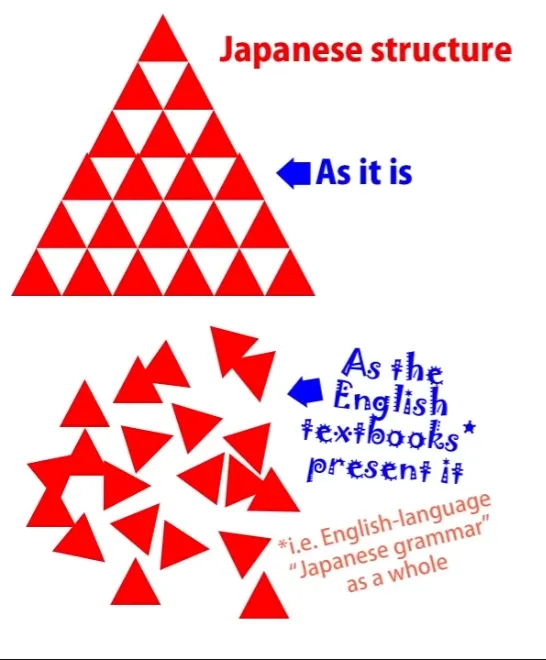
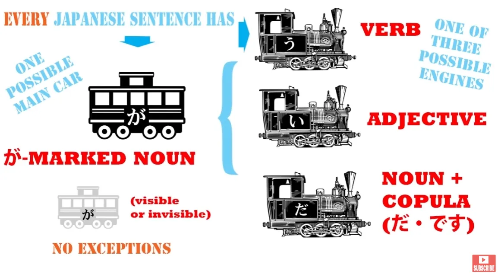
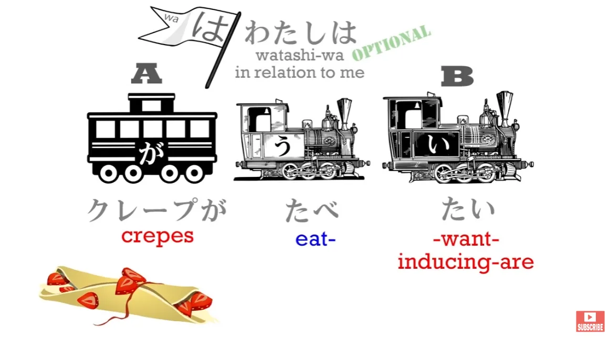
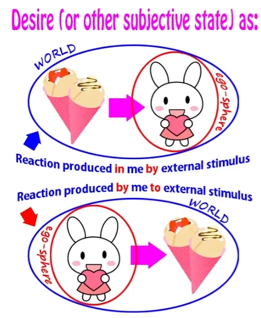
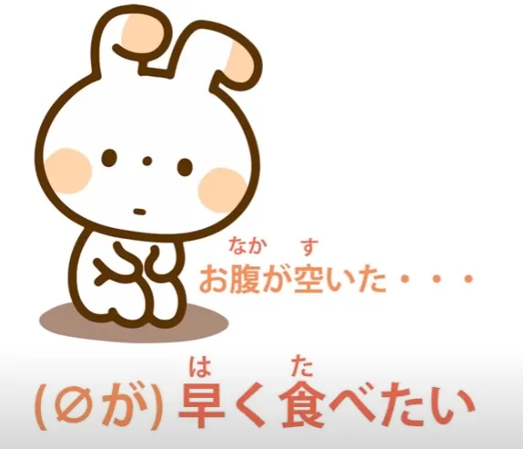
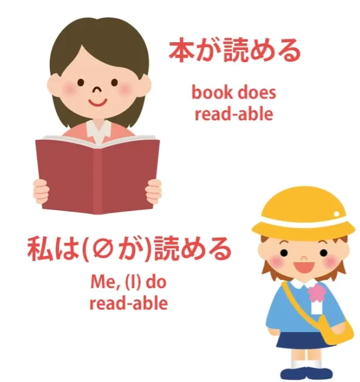

# **43. PERUBAHAN PARADIGMA: Atasi kebingungan**

[**Belajar Bahasa Jepang: PERUBAHAN PARADIGMA: Atasi kebingungan. Pelajaran 43**](https://www.youtube.com/watch?v=X_HlngOAvX8&amp;list;=PLg9uYxuZf8x_A-vcqqyOFZu06WlhnypWj&amp;index;=45&amp;pp;=iAQB)

こんにちは。

Hari ini kita akan membahas apa yang saya sebut dengan agak berlebihan sebagai <code>The Final Problem</code>. Yang saya maksud dengan itu adalah bahwa kita akan membuka area baru dalam bahasa Jepang dan kita akan melakukannya dengan metode yang sama seperti yang kita mulai, yaitu dengan melihat bahasa Jepang sebagai bahasa Jepang dan bukan sebagai bahasa Inggris yang ditulis dalam kode rahasia. Alasan saya menyebutnya <code>the final problem</code> adalah karena inilah satu-satunya masalah yang ditemukan oleh beberapa murid saya yang paling cerdas dan analitis terhadap model struktur bahasa Jepang saya.

Pada umumnya, jika seseorang memahami model-model saya, model-model itu menjadi jelas dengan sendirinya. Dan itulah dasar dari pekerjaan saya. Saya tidak meminta siapa pun untuk mempercayai saya. Coba lihat apakah model-model itu berfungsi. Jika tidak berfungsi, buang saja. Jika berfungsi, gunakanlah. Tidak ada unsur keyakinan di mana pun. Kini, saya menganggap masalah ini sebagai penghormatan terhadap karya saya. Sebagian karena, tentu saja, hanya ada satu masalah, yang dari keseluruhan model bahasa Jepang yang sangat radikal ini cukup menarik. Namun alasan kedua adalah ini: orang-orang memiliki masalah ini karena saya telah memanjakan mereka.

Saya mengatakannya dengan nada sedikit bercanda, tetapi kenyataannya adalah orang-orang keluar dari dunia bahasa Inggris <code>Japanese grammar explanations</code> di Genki dan berbagai situs tata bahasa Jepang (yang disebut-sebut) dan mereka meninggalkan dunia yang penuh dengan kumpulan hal-hal aneh yang kebetulan memiliki arti tertentu tanpa alasan khusus dan dengan berbagai pengecualian serta aturan acak, menuju dunia logika yang jernih di mana segala sesuatu masuk akal, di mana segala sesuatu ada karena alasan yang baik.

Jadi, ketika mereka menemui sesuatu yang tampak seperti pengecualian atau aturan acak, mereka ingin menghilangkannya. Mereka tidak akan mentolerir satu pun hal semacam itu lagi, dan saya tidak bisa menyalahkan mereka. Namun, ini bukanlah aturan acak. Ini adalah sesuatu yang sangat dapat dimengerti jika kita dapat melakukan pergeseran paradigma yang sama seperti yang kita lakukan pada awalnya dan melihatnya sebagaimana adanya dalam bahasa Jepang, bukan memandangnya melalui kacamata bahasa Inggris. Jadi, apa ini? Mari kita ambil sebuah contoh.

Jika kita mengatakan <code>クレープが好きだ</code>, kita telah belajar bahwa ini tidak berarti <code>I like crepes</code>. Jika Anda berpikir itu berarti <code>I like crepes</code>, maka Anda benar-benar telah menyerah untuk memahami struktur bahasa Jepang. Karena, seperti yang kita ketahui, setiap kalimat bahasa Jepang memiliki dua elemen inti. Kalimat tersebut dapat memiliki salah satu dari tiga &quot;engine&quot;, yang bisa berupa kata kerja, kata sifat, atau kata benda ditambah kopula. Dan bagian kedua dari kalimat inti selalu sama: yaitu kata benda yang ditandai dengan が. Kita tidak selalu bisa melihatnya, tetapi ia selalu ada di sana.

Dan kedua elemen tersebut, yaitu &quot;engine&quot; dan subjek yang ditandai dengan &quot;が&quot; (atau &quot;main carriage&quot;), merupakan inti dari setiap kalimat. Keduanya adalah satu-satunya hal yang kita butuhkan dalam sebuah kalimat. Kita harus memiliki kedua elemen tersebut, dan segala sesuatu lainnya dalam klausa logis hanya memberikan informasi tambahan mengenai &quot;engine&quot; atau &quot;gerbong&quot; yang ditandai dengan &quot;が&quot;. Tidak bisa melakukan hal lain.

Inti dari kalimat adalah kalimat itu sendiri dan segala hal lainnya hanyalah pelengkap dari salah satu dari dua unsur inti tersebut. Jadi, dengan <code>*(私は)* クレープが食べたい</code>, gerbong yang ditandai dengan &quot;が&quot; bukanlah <code>I</code>, jadi tidak bisa menjadi <code>I want to eat crepes</code>.

Karena <code>I</code> tidak melakukan sesuatu di sini, crepes adalah bagian utama yang ditandai dengan が. Dan kepala kalimat, engine-nya, bukanlah kata kerja, melainkan kata sifat. Itu adalah kata sifat pembantu <code>-たい</code>. Kata sifat ini melekat pada kata kerja, tetapi engine sebenarnya dari kalimat tersebut bukanlah kata kerja, melainkan kata sifat <code>-たい</code>. Itu tidak bisa berarti <code>want</code>, karena <code>want</code> adalah kata kerja.

Jadi, yang sebenarnya dimaksudkan di sini adalah bahwa kualitas crepes sedemikian rupa sehingga menimbulkan keinginan dalam diriku. Ini cara yang bertele-tele untuk mengatakannya, tetapi menghindari segala jenis kesalahpahaman dalam bahasa Inggris terhadap kalimat tersebut. Itulah arti sebenarnya. Ini mendeskripsikan crepes secara adjektival, dan yang dikatakannya tentang crepes adalah bahwa crepes memiliki kualitas yang membuat saya ingin memakannya. Dan yang telah kita pelajari sejak awal adalah bahwa bahasa Inggris adalah bahasa yang sangat ego-sentris.

Jika ada suatu tindakan, suatu subjektivitas, bahasa Inggris selalu ingin menempatkan penggerak sebagai pusatnya. Bahasa Jepang tidak memiliki keharusan yang begitu kuat.

Sekarang, jika kita melihatnya dari sudut pandang subjektivitas — karena banyak hal ini berkaitan dengan perasaan subjektif, seperti halnya banyak bahasa — kita dapat melihat subjektivitas dalam dua cara. Kita bisa melihatnya dengan hal yang memicu subjektivitas sebagai fokus, titik tumpu, dari subjektivitas tersebut, sehingga <code>crepes which induce desire in me</code> menjadi titik tumpu kalimat ini. *(Bahasa Jepang)* <code>Crepes are inducing eat desire in me.</code> Atau kita dapat melihat subjektivitas sebagai suatu aktivitas — keinginan — dan kemudian kita menempatkan <code>me</code> di tengah. Kita menempatkan ego di tengah dan kita mengatakan <code>I desire to eat crepes</code>. *(Inggris)*

Sekarang, keduanya cukup alami. Subjektivitas pada dasarnya adalah sesuatu yang kita alami secara pasif dan yang ditimbulkan dalam diri kita oleh sesuatu di luar diri kita. Itu adalah cara yang sepenuhnya valid untuk memandang hal-hal, dan mungkin lebih valid daripada cara egosentris dalam bahasa Inggris. Tentu saja tidak kurang valid. Kebetulan bahasa Jepang lebih menyukai cara memandang ini; bahasa Inggris lebih menyukai yang lain. Dan hal ini meluas ke berbagai bidang.

Jadi, misalnya, orang Jepang dengan senang hati mengatakan <code>水が犬に飲まれた</code> yang berarti <code>The water drink-received from the dog</code>. Penggerak utama dalam kalimat ini adalah air, bukan anjing. Airlah yang menerima tindakan minum dari anjing. Bahasa Inggris begitu bias terhadap hal ini sehingga hampir mustahil menerjemahkannya ke dalam bahasa Inggris tanpa mengubahnya menjadi kalimat pasif. Dalam bahasa Jepang, kalimat ini tidak pasif.

Dan bias ini begitu mendalam sehingga seluruh <code>-れる/-</code>られる<code></code> kata kerja bantu, yang merupakan kata kerja untuk menerima suatu tindakan, disebut <code>the passive</code> dengan tata bahasa pseudo-Jepang yang diajarkan dalam bahasa Inggris. Ini bukan kalimat pasif — hanya saja satu-satunya cara untuk menerjemahkannya ke dalam bahasa Inggris adalah dengan mengubahnya menjadi kalimat pasif. Sekarang, mari kembali ke crepes kita.

Jika kita mengatakan <code>クレープが食べたい</code>, pusat tindakan adalah crepes. Crepes-lah yang membangkitkan keinginan dalam diri saya. Jika kita mengatakan <code>お腹が空いた、 *(zeroが)* 早く食べたい</code>, kita berarti <code>I&#x27;m hungry; I want to eat soon.</code> Sekarang, <code>早く食べたい</code> tidak memiliki penggerak yang terlihat, tetapi penggerak dari ini — kata nol — adalah <code>me</code>, jadi itu <code>(zeroが) 早く食べたい</code> — <code>I want to eat soon.</code>

Sekarang, inilah masalah terakhir. Inilah hal yang ditentang oleh beberapa murid saya yang paling cerdas. Mereka tidak menyukai fakta bahwa <code>-たい</code> kata sifat pembantu mengubah polaritasnya, bahwa kata sifat tersebut dapat menggambarkan sesuatu yang memicu keinginan untuk makan dan juga orang yang merasakan keinginan untuk makan jika pemicunya tidak secara eksplisit ada. *(Jika membingungkan, lihat Pelajaran 9c tentang &#x27;たい&#x27;)* Mereka sebenarnya telah menyarankan — dan beberapa orang telah menyarankan ini kepada saya secara terpisah — solusi alternatif dengan mengatakan <code>Well, can&#x27;t we say that the が-marked actor is in fact food? Just food in general perhaps: &#x27;Food is making me want to eat it.&#x27;</code>

Dan saya mengerti mengapa mereka mencoba melakukan ini. Mereka berusaha menghilangkan apa yang tampak seperti satu-satunya anomali dalam sistem yang secara logis sempurna. Namun sebenarnya ini bukan anomali, dan kita akan membahasnya sebentar lagi. Solusi alternatif ini tidak berhasil, pertama-tama karena jika Anda memahami bahasa Jepang dengan baik, Anda tahu bahwa ini bukanlah yang sebenarnya terjadi.

Seseorang tidak mengatakan bahwa mereka ingin makan apa pun atau makanan secara umum; mereka *hanya mengatakan bahwa mereka ingin makan.* Itu adalah sesuatu yang menurut saya akan Anda pahami secara intuitif, tetapi saya juga memahami bahwa intuisi bukanlah argumen. Bahkan Genki mungkin bisa menggunakan kartu intuisi untuk mendukung beberapa interpretasi mereka yang agak aneh tentang bahasa Jepang.

Namun, kita tidak perlu bergantung pada itu. Kita bisa memberikan bukti. Mari kita ambil kalimat <code> *(zeroが)* 東京に行きたい.</code> Ini berarti <code>I want to go to Tokyo.</code>

Sekarang, tidak ada kata lain <code>zeroが</code> dalam kalimat ini selain <code>I</code>. Tidak mungkin Tokyo, karena itu sudah menjadi tujuan yang ditandai dengan &quot;に&quot;. Tidak mungkin <code>go</code> karena itu adalah kata kerja dan kita tidak pernah bisa menandai apa pun selain kata benda dengan が atau Partikel logis lainnya.

Jadi kita tahu dengan pasti bahwa sebenarnya mungkin bagi <code>-たい</code> membalik polaritasnya, untuk tidak hanya menunjuk pada objek yang memicu keinginan untuk melakukan, tetapi juga pada orang atau hewan yang mengalami keinginan tersebut. Dan hal ini meluas ke area lain dalam bahasa Jepang.

---

Misalnya, bentuk potensial. Ketika kita mengatakan <code>本が読める</code>, kita sebenarnya mengatakan <code>The book does readable.</code>

Kita tidak bisa menerjemahkan ini secara langsung ke dalam bahasa Inggris karena ini adalah kata kerja dan <code>readable</code> bukan kata kerja dalam bahasa Inggris, tetapi dalam bahasa Jepang kita mengatakan <code>The book does readable.</code> Sekarang ini adalah subjektivitas dalam arti tertentu karena tidak berbicara tentang fakta bahwa secara umum mungkin untuk membaca buku tersebut. Itu akan menjadi <code>可能性/かのうせい</code>.

Ini berbicara tentang fakta bahwa buku tersebut dapat dibaca oleh seseorang atau orang-orang tertentu. Namun sekali lagi, subjek yang ditandai denganが adalah buku tersebut. Jadi, mengatakan <code>I can read the book</code> atau <code>We can read the book</code> adalah pernyataan yang salah.

Itu bukan maksud kalimat tersebut, dan jika kita menganggap demikian, kita akan berakhir dengan gagasan yang sangat merusak bahwa が terkadang dapat menandai objek kalimat. Hal itu tidak pernah bisa terjadi.  hanya dapat menandai subjek, yaitu A-car kalimat.

Dan ini sangat penting bagi bahasa Jepang karena inilah yang menjadi bagian dari setiap kalimat yang pernah Anda lihat, sepanjang hidup Anda: sebuah A-\[mobil] yang ditandai dengan &quot;が&quot; dan sebuah B-engine. Ganggu hal itu dan Anda telah mengganggu segalanya. Jadi, penggerak dari <code>本が読める</code> adalah buku: <code>The book does readable.</code>

Tetapi jika kita mengatakan <code>私が読める</code> atau <code>さくらが読める</code>, yang kita maksud adalah <code>I can read</code>/ <code>Sakura can read.</code> Bukan bisa membaca buku tertentu, bukan bisa membaca koran, bukan bisa membaca manga, tetapi bisa membaca, melek huruf. Jadi, sekali lagi, potensi dapat membalik polarisasinya.

Jika ada benda tertentu yang dapat dibaca, maka itulah yang <code>does readable</code>, tetapi jika tidak ada, jika itu hanya merujuk pada kemampuan membaca secara umum, maka itu membalik polaritas dan menunjuk pada orang atau orang-orang yang mampu membaca. Sekarang mengapa demikian?

Kita telah membahas fakta bahwa sifat non-egosentris bahasa Jepang pada dasarnya berakar pada cara pandang dunia yang lebih animistik. Saya tidak sedang membicarakan apa yang diyakini orang Jepang sebagai individu saat ini. Saya berbicara tentang bagaimana bahasa tersebut memandang dunia.

Bahasa Inggris membutuhkan ego di pusat; bahasa Jepang tidak. Bahasa Jepang jauh lebih nyaman memiliki penggerak non-ego sebagai pusat bahkan dalam kalimat yang berbasis subjektif. Namun, hal itu tidak berhenti di situ.

Dan begitu Anda menyadari hal itu, kita telah mengatasi masalah terakhir. Bukan hanya karena bahasa Jepang tidak keberatan memiliki penggerak non-ego sebagai pusat dan bahkan dalam banyak kasus lebih menyukainya, tetapi juga karena bahasa tersebut memandang kedua entitas tersebut—pembuat subjektivitas dan penerima, atau pengalam, subjektivitas—sebagai entitas yang pada dasarnya tidak terpisah.

Tindakan menginginkan, takut, atau menginginkan secara subjektif, dan sebagainya, adalah sesuatu yang terjadi di antara keduanya, antara pemicu dan pengalam. Dan kita dapat melihatnya dari perspektif mana pun, dan itu tidak benar-benar penting.

Kecenderungan, jika boleh dikatakan, kondisi defaultnya, adalah mengaitkannya dengan pemicu, tetapi tidak ada kesulitan sama sekali untuk memindahkannya ke pihak yang mengalaminya. Karena keduanya tidak dianggap sepenuhnya terpisah. Keduanya adalah dua bagian dari tindakan yang sama.

Dan jika kita memahami hal ini, kita melihatnya jauh lebih melalui kacamata Jepang. Kita tidak perlu mengalihkannya melalui perantara bahasa Inggris yang aneh.

Dan hal ini memengaruhi segala macam hal, bukan hanya bidang tata bahasa yang telah kita bicarakan, tetapi segala macam hal. Misalnya, mari kita ambil kata <code>不思議</code>. <code>不思議</code> berarti <code>mystery</code>. Ini adalah kata benda, artinya <code>mystery</code>.

Dan kata ini dapat digunakan sebagai kata benda yang berfungsi sebagai kata sifat, dalam hal ini artinya kira-kira <code>mysterious</code>. Jadi, jika kita mengatakan <code>不思議な屋敷</code>, kita berarti <code>mysterious mansion</code>.

Namun, kita juga dapat menambahkan <code>そう</code> ke <code>不思議</code>, yang, seperti yang telah kita bahas sebelumnya, berarti <code>seems</code> atau <code>like</code>. Jadi <code>不思議そう</code> tampaknya berarti <code>seems mysterious</code> atau <code>mysterious-like</code>.

Sekarang, hal ini sendiri tidak bermakna, karena <code>mysterious</code> adalah subjektivitas. Jika kita mengatakan sesuatu itu misterius, ini bukanlah kualitas objektif seperti berwarna merah atau tingginya tiga kaki. Ini adalah subjektivitas. Itu misterius karena kita menganggapnya misterius.

Jika kita tidak menganggapnya misterius, maka itu tidak misterius. Jadi, mengatakan bahwa sesuatu itu &quot;seperti misterius&quot; atau &quot;terlihat misterius&quot; tidak bermakna, karena mengatakan bahwa sesuatu itu misterius pada dasarnya hanya berarti itu.

Namun, bukan itu yang <code>不思議そう</code> maksudnya. <code>不思議そう</code> digunakan dalam kalimat seperti <code>「これはなーに？」とさくらは不思議そうに言った</code> — <code>**What**s this?&#x27; asked Sakura in a mystified manner.</code>

<code>不思議そう</code>, Anda lihat, sekali lagi membalik polaritas. Kata itu tidak berlaku untuk hal yang menimbulkan rasa misteri, melainkan berlaku untuk orang yang merasakan rasa misteri tersebut. Jadi <code>不思議そう</code> berarti sesuatu seperti <code>mystified</code>, kadang-kadang mungkin <code>puzzled</code>, tetapi bagaimanapun juga artinya <code>perceiving quality of **不思議** in something else</code>.

Jadi, kamu melihat seluruh pembalikan polaritas ini, yang didasarkan pada pandangan dunia yang lebih terpadu—bukan sekadar <code>animist</code>, untuk menggunakan istilah itu, tetapi terpadu. Lebih dalam arti bahwa bagian dalam dan luar tidak sepenuhnya terpisah, melainkan dua sisi dari persepsi yang sama.

Dan jika kita dapat memahami hal itu, masalah terakhir terpecahkan dan seluruh bidang bahasa Jepang terbuka serta terbebas dari keharusan menerjemahkannya melalui bahasa Inggris.

::: info
Seperti biasa, jika pelajaran ini terasa membingungkan atau rumit, saya sarankan untuk melihat komentar di* [**video ini**](https://www.youtube.com/watch?v=X_HlngOAvX8&amp;list;=PLg9uYxuZf8x_A-vcqqyOFZu06WlhnypWj&amp;index;=47&amp;ab;_channel=OrganicJapanesewithCureDolly) *di mana Dolly membahas beberapa hal secara lebih mendalam.
:::
