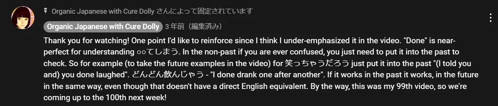

# **44. Cara menggunakan bahasa Jepang yang alami: ちゃう, ちゃった**

[**Cara menggunakan bahasa Jepang yang alami: chau, chatta, bagaimana cara kerjanya yang sebenarnya ちゃう、ちゃった | Pelajaran 44**](https://www.youtube.com/watch?v=VyZWoJCSQ5Q&amp;list;=PLg9uYxuZf8x_A-vcqqyOFZu06WlhnypWj&amp;index;=46&amp;pp;=iAQB)

こんにちは。

Hari ini kita akan membahas sesuatu yang sering Anda temui dalam anime, manga, percakapan sehari-hari, novel ringan, dan di mana pun Anda menjumpai bahasa Jepang yang sesungguhnya, yang disebut bahasa sehari-hari — artinya, bahasa non-formal. Sekarang, kita harus menggunakan sedikit trik untuk memahami dari sudut pandang bahasa Inggris bagaimana hal ini bekerja. Dan tentu saja, penjelasan standar tidak akan memberikan trik seperti ini karena mereka bahkan tidak menjelaskan dasar-dasar prinsip struktur bahasa Jepang. Jadi kita mendapatkan efek dari tiga orang buta dan gajah.

Saya yakin Anda pernah mendengar ceritanya. Yang pertama meraba salah satu kaki gajah dan berkata gajah itu seperti pohon, yang kedua meraba belalainya dan berkata itu seperti ular, yang ketiga meraba ekornya dan berkata itu seperti tali. Dan tentu saja, tidak ada yang benar-benar salah. Gajah memang memiliki semua sifat tersebut, tetapi jika Anda menyajikannya sebagai fakta terpisah tanpa menjelaskan bahwa ada seekor gajah yang mendasari semuanya, yang memberikan makna pada hal tersebut, Anda membuat segalanya jauh lebih sulit daripada yang seharusnya.

Dan tata bahasa Jepang standar dalam bahasa Inggris melakukan hal ini sejak awal dengan struktur bahasanya, yang sangat merugikan, dan kemudian melakukannya lagi, dan lagi, dan lagi dengan apa yang disebutnya <code>grammar points</code>. Dan fakta bahwa ia menyebutnya <code>grammar points</code> adalah bagian dari masalahnya, karena sebagian besar hal ini sebenarnya bukanlah poin, melainkan struktur logis, dan jika kita memahami strukturnya, kita tidak perlu menghafalnya sebagai <code>points</code>.

Jadi, yang akan kita bahas hari ini adalah ungkapan-ungkapan <code>-ちゃった</code> atau <code>-じゃった</code>, yang ditambahkan di akhir kata kerja. Sekarang, jika kita melihat penjelasan konvensional, kita akan membaca bahwa hal itu menunjukkan suatu tindakan yang telah selesai atau tuntas, atau suatu tindakan yang kita sesali atau lakukan secara tidak sengaja, atau sesuatu yang baru saja terjadi secara tak terduga. Biasanya mereka tidak menambahkan bahwa hal ini juga bisa menunjukkan sesuatu yang terjadi dan sangat baik, atau bahwa hal ini sebenarnya bisa digunakan dalam bentuk masa depan sebagai <code>-ちゃう</code> atau <code>-じゃう</code>, yang tampaknya bertentangan dengan semua yang baru saja kita pelajari, bukan?

Jadi, alih-alih melihat ekor, kaki, dan badannya, mari kita mulai dengan melihat gajah itu sendiri. Pertama-tama, <code>-ちゃう</code> atau <code>-ちゃった</code> sebenarnya adalah singkatan dari bentuk lampau kata <code>しまう</code>, yang berarti menyelesaikan atau mengakhiri.

Jadi, jika Anda pernah mendengarkan dongeng Jepang, Anda akan menemukan bahwa dongeng-dongeng tersebut sering diakhiri dengan kalimat <code>おしまい</code>. Dan <code>しまい</code> adalah akar kata &quot;い&quot;, yang menjadikannya kata benda <code>しまう</code>, sehingga artinya <code>the finish / the ending / the end</code>.

Sekarang, jika Anda mengubahnya ke bentuk lampau, menjadi <code>しまった</code>, dan <code>しまった</code> dapat digunakan sendiri sebagai ungkapan, dan biasanya artinya <code>Something&#x27;s gone very wrong / This is not at all satisfactory</code> : <code>しまった!</code> Mungkin cara terbaik untuk mengatakannya dalam bahasa Inggris adalah dengan mengatakan sesuatu seperti <code>That&#x27;s done it</code> atau <code>That&#x27;s the end!</code> atau semacam itu.

Sekarang, kita bisa menggunakan ini <code>しまった</code> sebagai kata kerja bantu yang kita tambahkan ke bentuk &quot;て&quot; dari kata kerja lain. Dan caranya adalah, kita ubah kata kerja lain tersebut ke bentuk &quot;て&quot;, lalu kita tambahkan <code>しまった</code>. Dan <code>-てしまった</code> disingkat menjadi <code>-ちゃった</code>.

Sekarang, jika bentuk &quot;て&quot; adalah <code>で</code> (seperti yang kita ketahui pada beberapa kata dan jika Anda tidak memahaminya, saya telah menjelaskannya dalam video sebelumnya[[5]](./5-verb-groups-and-the- て -form.md)[[40]](./40-3-pitfalls-in-japanese-and-how-to-avoid-them.md)), jika bentuk て <code>で</code> maka alih-alih menjadi <code>-ちゃった</code>, ia menjadi <code>-じゃった</code>, sama seperti <code>では</code> menjadi <code>じゃ</code>. Sekarang, ini memiliki rentang makna yang jauh lebih luas daripada sekadar <code>しまった</code> sendiri.

Ungkapan ini dapat digunakan untuk hal-hal yang kita lakukan secara tidak sengaja atau yang kita harap tidak pernah kita lakukan. Misalnya, kita sering mengatakan <code>忘れちゃった</code>, yang berarti <code>忘れる</code> — <code>forget</code> — ditambah <code>-ちゃった</code>. Ada lagu terkenal <code>ネコ踏んじゃった</code>, yang sangat seru, dan saya akan menyertakan [**tautan**](https://www.youtube.com/watch?v=GpqGiKJt3cQ&amp;ab;_channel=ichigoclub15) di bagian informasi di bawah ini.

Dan artinya adalah <code>I trod on the cat</code>: <code>踏む</code> — untuk <code>tread (on something)</code>. Jadi kita bisa lihat bahwa kata ini punya arti negatif di sini, tapi bisa juga berarti sesuatu yang sangat baik.

Kita mungkin akan berkata <code>スーパーヒーローになっちゃった</code> — <code>I became a superhero.</code> Jadi, apa kesamaan dari hal-hal ini? Hal-hal yang tidak disengaja, hal-hal yang kita sesali, hal-hal yang sangat kita sukai.

Cara saya mengatakannya, cara saya menerjemahkannya ke dalam bahasa Inggris, karena ini adalah ungkapan bahasa Inggris yang menurut saya mencakup hampir semua kasus <code>-ちゃった</code>, adalah kata <code>done</code>. <code>忘れちゃった</code> — <code>I done forgot</code>; <code>猫踏んじゃった</code> — <code>I done trod on the cat</code>; <code>スーパーヒーローになっちゃった</code> — <code>I done became a superhero.</code>

Dalam semua kasus ini, idenya sangat mirip. Kita mengatakan bahwa itu telah terjadi, sudah selesai, sudah tuntas, itu adalah fakta, dan implikasinya secara umum adalah bahwa kita tidak mengharapkan hal itu menjadi fakta atau itu bukanlah apa yang biasanya diharapkan kebanyakan orang sebagai fakta, tetapi kenyataannya memang begitu. <code>done happened</code>. Dan jika kita memahami hal itu, sangat mudah untuk memahami berbagai macam keadaan di mana <code>-ちゃった</code> digunakan.

Satu-satunya perbedaan nyata antara ini dan <code>done</code> dalam bahasa Inggris adalah bahwa kita tidak hanya menggunakannya untuk hal-hal di masa lalu. Kita juga menggunakannya untuk hal-hal di masa depan. Jadi, kita bisa mengatakan, <code>夏休みが終わってしまう</code> dan itu berarti <code>the summer vacation will done end</code>. Sekarang, tentu saja Anda tidak bisa mengatakan itu dalam bahasa Inggris, tetapi pada dasarnya itulah yang Anda maksud.

Itu hanya akan terjadi dan berlalu. Itulah yang akan terjadi dan semuanya akan selesai, dan tidak ada yang bisa kita lakukan mengenai hal itu. Jika Anda hendak menceritakan sesuatu yang memalukan kepada seseorang, Anda mungkin akan berkata <code>君のは笑っちゃうだろう</code> — <code>You&#x27;ll probably laugh</code> atau <code>You&#x27;ll probably done laugh / You&#x27;ll probably just up and laugh.</code>

Sekali lagi, ini adalah gagasan yang sama, tetapi dalam bahasa Jepang kita juga bisa memproyeksikan gagasan itu ke masa depan. Kita bisa mengatakan <code>今日はどんどん飲んじゃう</code>, dan itu <code>Today, I&#x27;m going to drink like crazy</code>.

<code>どんどん</code> adalah <code>one after another in rapid succession</code>; <code>飲んじゃう</code> adalah <code>done drink</code>. Sekali lagi, kita tidak bisa menggunakannya untuk masa depan dalam bahasa Inggris, tetapi kita bisa menggunakannya untuk masa depan dalam bahasa Jepang.

Jadi, jika kita memahami cara kerjanya, kita tidak perlu penjelasan rumit tentang semua kasusnya yang berbeda-beda. Semua ini bekerja dengan cara yang sama setiap saat jika kita hanya memikirkan bagaimana cara kerjanya, bukan hasil akhirnya jika diterjemahkan ke dalam bahasa Inggris.

