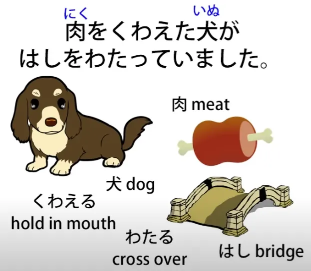
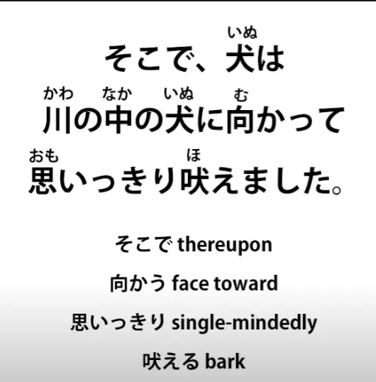
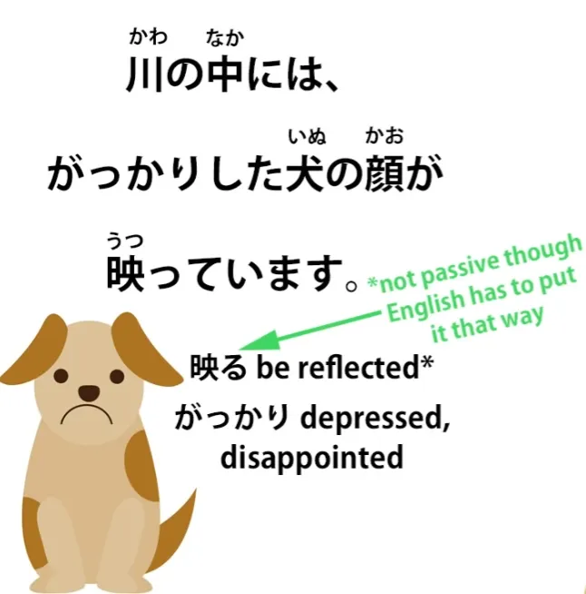

# **45. Panduan Awal untuk Teknik Immersi Mandiri**

[**Immersi Bahasa Jepang. Panduan Awal untuk Teknik Immersi Mandiri | Pelajaran 45**](https://www.youtube.com/watch?v=g5uyGx5OnuE&amp;list;=PLg9uYxuZf8x_A-vcqqyOFZu06WlhnypWj&amp;index;=47&amp;pp;=iAQB)

こんにちは。

Hari ini, kita akan terjun dari bahasa Jepang teoretis yang abstrak — tata bahasa, struktur, dan kosakata — ke dalam pencelupan langsung dalam materi bahasa Jepang asli untuk orang Jepang. Seperti yang Anda ketahui, saya merekomendasikan untuk melakukan ini sedini mungkin, tetapi hal ini cukup sulit, karena begitu Anda berada di materi bahasa Jepang yang sebenarnya, Anda akan menemui kosakata yang belum pernah Anda ketahui sebelumnya, bahkan dalam materi yang sangat sederhana, karena anak-anak Jepang memiliki kosakata yang sangat luas dibandingkan bahkan dengan orang asing yang telah lulus ujian bahasa Jepang tingkat tinggi. Inilah mengapa saya tidak merekomendasikan kumpulan kosakata inti dan hal-hal semacam itu. Cara untuk memperluas kosakata inti di luar dasar yang kecil adalah dengan mempelajarinya seiring Anda menjelajahi materi bahasa Jepang yang sebenarnya. Dengan cara itu, Anda akan mendapatkan jenis kosakata yang benar-benar akan Anda temui dan gunakan.

Jadi, yang akan saya lakukan adalah mengambil sebuah cerita Jepang sederhana yang sama sekali tidak dimodifikasi untuk orang asing. Cerita ini apa adanya. Cerita ini juga dilengkapi audio, dan saya akan menyertakan tautannya di kolom Komentar di bawah. Jadi, setelah kita membahas cerita tersebut dan Anda sudah memahaminya dengan jelas, Anda bisa memutar audionya di ponsel atau pemutar MP3 Anda dan mendengarkannya berulang kali. Hal ini akan memperkuat kosakata baru; memperkuat ritme dan bentuk lisan bahasa Jepang serta strukturnya, karena kita perlu memindahkan struktur dan kosakata dari area abstrak—di mana Anda mengetahuinya tetapi harus memikirkannya dengan sangat hati-hati untuk melakukan apa pun—ke area di mana hal itu mulai menjadi instingtif.

Jadi, silakan gunakan [**audio tersebut**](https://www.youtube.com/watch?v=jjmWN2rI8e4&amp;ab;_channel=hukumusume) setelah kita selesai membahas ceritanya. Audio tersebut sangat singkat, dan saya akan membuat halaman yang akan saya [**tautkan**](http://learnjapaneseonline.info/taking-the-plunge-japanese-self-immersion-links-to-all-structure-points/) di bawah ini, di mana saya memberikan tautan ke berbagai video di mana saya membahas poin-poin tata bahasa yang kita temui. Anda akan melihat bahwa bahkan dalam cerita pendek dan sederhana seperti ini, kita menggunakan banyak struktur yang kita temui dalam berbagai pelajaran saya. Baiklah, mari kita mulai.

Ini adalah dongeng pendek dan sederhana tentang seekor anjing yang serakah. Dan kalimat pertamanya adalah: <code>肉をくわえた犬がはしをわたっていました.</code>

Jadi, Anda lihat ini menggunakan gaya bahasa Jepang &quot;です&quot; / ます, jadi jika Anda sedikit ragu tentang hal itu, silakan merujuk ke video saya &quot;です&quot; / ます. <code>肉をくわえた犬が.</code> Sekarang, <code>肉</code> berarti <code>meat</code> dan <code>くわえる</code> berarti <code>hold in one&#x27;s mouth</code>. Ini adalah salah satu kata yang bisa Anda pelajari dalam kumpulan kata inti yang sangat besar dan tetap tidak mengetahuinya. Dan yang terjadi di sini adalah teknik yang sangat umum dalam membalikkan klausa logis sederhana untuk mengubahnya menjadi klausa deskriptif.

Jadi, <code>犬が肉をくわえた</code> adalah <code>a dog held meat in its mouth</code>, tetapi <code>肉をくわえた犬</code> adalah <code>a dog that was holding meat in its mouth</code>. Jadi, anjing itu adalah subjek kalimat kita, ditandai dengが <code>肉をくわえた犬がはしをわたっていました.</code> <code>橋/はし</code> adalah <code>bridge</code> dan <code>わたる</code> adalah <code>cross</code>. Jadi, anjing itu sedang dalam proses (<code>-ている</code>) menyeberangi jembatan. <code>肉をくわえた犬がはしをわたっていました.</code> Jadi, itulah gambaran awalnya. Kita tahu apa yang sedang terjadi.

<code>ふと下を見ると、川の中にも肉をくわえた犬がいます.</code>

Sekarang, hal pertama yang perlu diperhatikan di sini adalah kalimat kedua ini menggunakan bentuk non-lampau, bukan? Jadi, inilah perbedaan antara konvensi narasi dalam bahasa Jepang dan bahasa Inggris. Dalam narasi bahasa Inggris, jika narasinya menggunakan bentuk lampau, maka narasi tersebut tetap menggunakan bentuk lampau dan setiap kalimatnya menggunakan bentuk lampau. Dalam narasi bahasa Jepang, hal ini tidak berlaku.

Kita bisa menetapkan narasi dalam bentuk lampau, tetapi terkadang ketika kita ingin memberikan kesan yang lebih mendesak pada sesuatu, kita beralih ke bentuk sekarang. Hal ini tidak diperbolehkan dalam narasi bahasa Inggris, tetapi sangat diperbolehkan dalam narasi bahasa Jepang, jadi kita perlu menyadari hal itu dan tidak membiarkannya membingungkan kita. Jadi, apa yang terjadi di sini?

<code>ふと</code> berarti <code>suddenly</code> — Saya tidak akan menjelaskan kosakata paling sederhana di sini karena saya berasumsi bahwa Anda sudah memiliki kosakata yang sangat dasar untuk mulai terjun ke dalam narasi bahasa Jepang. Jadi, <code>ふと</code> berarti <code>suddenly</code>. <code>ふと下を見ると</code> — <code>(the dog) suddenly looked down</code>.

Subjek tak terlihat di sini adalah <code>it</code>, si anjing. Jadi, si anjing tiba-tiba menunduk, dan itu <code>と</code> adalah konjungsi kondisional, <code>if</code> atau <code>when</code>, dan saya akan menyertakan tautan ke sana[[30]](./30-japanese-conditionals- と.md). Jadi artinya <code>When the dog suddenly looked down...</code> atau <code>The dog suddenly looked down, and...</code> <code>When the dog suddenly looked down... 川の中にも</code>.

<code>川の中に</code> adalah <code>in the river</code> dan <code>も</code> di sini memberi tahu kita <code>also</code>: <code>also in the river</code>. <code>川の中にも肉をくわえた犬がいます.</code> Jadi, <code>also in the river there&#x27;s a dog carrying meat in its mouth</code>. Bukan hanya di jembatan tetapi juga di sungai, ada seekor anjing yang membawa daging di mulutnya.

<code>犬はそれを見て思いました.</code> Sekarang, anjing tersebut disebut dengan &quot;は&quot; bukan &quot;が&quot;, dan itu karena anjing tersebut sudah diperkenalkan, jadi bukan lagi <code>a dog</code>, melainkan <code>the dog</code>. Dan saya akan [**link**](https://www.youtube.com/watch?v=9l_ZlQQU4ZE&amp;ab;_channel=OrganicJapanesewithCureDolly) ke video di mana saya menjelaskan hal ini.

<code>犬はそれを見て</code>; <code>それ</code> adalah <code>that</code> dan jadi ini adalah bagian pertama dari kalimat majemuk: <code>The dog saw that and..</code> — bentuk &quot;て&quot; memberi kita <code>and</code> di sana.

Dan saya akan menyertakan tautan ke kalimat majemuk[[4]](./4-japanese-verb-tenses.md). Saya tidak akan lagi memberitahu Anda tautan apa yang saya sertakan, tetapi jika Anda melihat halaman khusus yang telah saya buat — yang akan saya [**tautkan**](http://learnjapaneseonline.info/taking-the-plunge-japanese-self-immersion-links-to-all-structure-points/) di bawah — saya akan memberikan semua tautan ke bagian-bagian berbeda dari cerita ini. Anda mungkin tidak perlu mengikuti semuanya, tetapi jika ada bagian yang membingungkan Anda, Anda bisa membuka video di mana saya telah menjelaskan poin-poin spesifik tersebut. Baiklah.

Jadi, <code>犬はそれを見て</code> — itu adalah klausa logis tersendiri: <code>The dog saw that and... 思いました.</code> <code>The dog saw that and thought (or felt).</code> <code>あいつの肉のほうが大きそうだ.</code>

<code>あいつ</code> adalah <code>that fellow/ that type/ that character</code>. <code>あいつの肉のほうが</code>, artinya <code>the side of that character&#x27;s meat...</code> (daging karakter itu, bukan daging saya) <code>...大きそうだ.</code> Jadi itulah penghubung <code>そう</code> dengan kata sifat <code>大き</code> — <code>looks</code> — artinya terlihat atau tampak lebih besar. <code>The side of that character&#x27;s meat appears bigger than mine.</code>

Bagaimana kita tahu bahwa ini adalah bentuk komparatif? Karena adanya <code>ほう</code>, yang memberi tahu kita bahwa kita sedang membicarakan sisi daging karakter tersebut dibandingkan dengan sisi lain, yang dalam hal ini adalah <code>my meat</code>.

---

<code>犬は悔しくてたまりません.</code> <code>悔しい</code> adalah kata sifat dan artinya sesuatu itu <code>irritating</code> atau <code>annoying</code>. Namun seperti semua kata sifat yang menggambarkan emosi subjektif, ketika diterapkan langsung pada individu, kata sifat tersebut bisa merujuk bukan pada seberapa menjengkelkannya objek tersebut, melainkan pada seberapa terganggunya individu tersebut. Jadi itulah yang terjadi di sini.

<code>犬は悔しい</code> berarti <code>the dog was annoyed</code>. Kata ini bisa berarti <code>the dog was annoying</code>, tetapi dalam kasus ini artinya <code>the dog was annoyed</code>. Dan kemudian, <code>たまりません</code>. <code>たまる</code> adalah <code>bear</code> atau <code>endure</code>, jadi <code>たまりません</code> berarti <code>not bear</code>. Sekarang, ketika Anda menambahkan <code>-てたまりません</code> ke sesuatu, kita mengatakan bahwa itu <code>to an unbearable degree</code>. Anjing itu merasa kesal hingga tak tertahankan saat melihat anjing lain yang menurutnya membawa potongan daging yang lebih besar daripada miliknya.

---

Dan berikut ini kutipan dari anjing tersebut: <code>そうだ、あいつを脅かしてあの肉を取ってやろう.</code>

<code>そうだ</code> — <code>Okay then/that&#x27;s the case</code>; <code>あいつを脅かして</code> — <code>脅かす</code> adalah untuk ****mengintimidasi**** atau <code>scare (someone)</code>, jadi: <code>I&#x27;m going to scare that fellow and... あの肉を取ってやろう.</code>

<code>あの肉</code>, tentu saja, adalah <code>that meat</code>; <code>取る</code> adalah <code>take</code>. <code>取ってやろう</code> berkaitan dengan <code>-てあげる</code>, untuk <code>do an action up to someone / to give someone the benefit of your action</code>.

<code>-てやろう</code> seperti <code>-てあげる</code> dalam arti bahwa itu berarti melakukannya untuk orang lain, tetapi alih-alih bersifat hormat, justru sebaliknya. Artinya merendahkan orang lain, melakukan sesuatu kepada seseorang yang Anda anggap lebih rendah. Jadi, misalnya, akan tepat untuk menggunakan <code>-てやろう</code> untuk memberi makan anjing, karena anjing memang benar-benar dianggap inferior.

Dalam kasus seperti ini, ini hanyalah cara bicara yang agak kasar. Dan, tentu saja, apa yang akan dilakukannya bukanlah bantuan bagi anjing itu: dia akan mencuri sesuatu dari anjing malang di sungai ini. Jadi, ini agak mirip ketika seseorang mungkin berkata dalam bahasa Inggris, <code>I&#x27;m going to punch your head for you,</code> yang mengatakannya seolah-olah Anda sedang membantu seseorang, padahal sebenarnya Anda melakukan sesuatu yang bukan bantuan. <code>I&#x27;ll take that meat for him.</code>

<code>そこで、犬は川の中の犬に向かって思いっきり吠えました.</code>

<code>犬は川の中の犬に向かって.</code> <code>向かう</code> adalah <code>face toward</code>, sehingga anjing itu menghadap ke arah / mengarahkan tindakannya ke arah anjing di sungai. <code>思いっきり吠えました.</code> <code>吠える</code> adalah <code>bark</code> dan <code>思いっきり</code> adalah... <code>思い</code> adalah <code>thought</code> atau <code>feeling</code>, dan ketika kita menambahkan ini <code>-っきり</code>, yang sebenarnya adalah <code>切り</code> dari <code>cut</code>, itu berarti melakukan sesuatu sepenuhnya, melakukannya sampai batasnya, bisa kita katakan.

Jadi, <code>思いっきり</code> berarti <code>putting one&#x27;s whole thought into it, one&#x27;s whole heart into it</code>. Jadi, anjing itu menghadap ke arah anjing di dalam air *(sungai)* dan mengerahkan seluruh tenaganya untuk menggonggong kepadanya guna menakut-nakutinya.

ワンワンワンワン. Seperti yang kita semua tahu, <code>ワンワン</code> adalah <code>woof woof</code> dalam bahasa Jepang.

<code>そのとたん...</code> <code>そのとたん</code> berarti <code>at that moment</code>. <code>とたん</code> adalah <code>just as something happens or just after it happens</code>. Jadi, <code>そのとたん</code> — <code>at that juncture / at that point / at that moment</code>.

<code>くわえていた肉はポチャンと川の中に落ちてしまいました</code> Jadi, pada saat itu, daging yang ada di mulut — <code>くわえていた肉は</code> — <code>ポチャン</code>, yang merupakan efek suara percikan, <code>ポチャンと</code> — dan - と, tentu saja, menandai efek suara — <code>川の中に</code> — <code>into the river</code> — <code>落ちて</code> — <code>落ちる</code>, untuk <code>fall</code> — <code>しまいました</code>. Dan itu <code>しまいました</code> berarti <code>it done fell into the river</code>, dan saya akan menyertakan tautan ke video tersebut <code>しまいました / ちゃった</code>, yang berarti <code>it done happened</code>.[[44]](./44-how-to-use-natural-japanese- ちゃう - ちゃった.md)

Ahh! <code>川の中には、がっかりした犬の顔が映っています</code>

Dan sekali lagi kita telah beralih ke bentuk sekarang untuk memberikan kesan yang lebih langsung pada hal ini. <code>Inside the river... がっかりした</code> — <code>がっかり</code> adalah <code>upset / depressed / disappointed / dejected</code>, <code>映る</code> adalah <code>reflect</code>, <code>顔</code> adalah <code>face</code>. Jadi, di dalam sungai, terpantul wajah seekor anjing yang kecewa dan sedih.

<code>さっきの川の中の犬は水に映った自分の顔だったのです</code> <code>のです</code> — <code>The fact is that it was...</code> Faktanya, itu adalah apa?

Faktanya, itu adalah... さっきの川の中の犬は&quot; — <code>さっき</code> dalam hal ini berarti <code>just before</code> atau <code>previous</code>. Jadi <code>さっきの川の中の犬</code> adalah <code>the dog in the river from just before</code>; <code>水に映った自分の顔だった</code> — <code>自分</code> adalah <code>oneself</code>, jadi artinya <code>one&#x27;s own face reflected in the water</code>: <code>水に映った自分の顔だったのです.</code>Faktanya adalah bahwa itu adalah... faktanya adalah bahwa anjing yang tadi di sungai itu adalah bayangan wajah sendiri yang terpantul di air. Dan sekarang ada dua pesan moral yang mengikuti cerita ini. Dan keduanya disatukan dalam satu kalimat majemuk yang panjang, yang terlihat agak rumit, jadi mari kita bagi menjadi dua bagian.

<code>同じ物を持っていても人が持っている物のほうが良く見え、</code> Sekarang, pertama-tama, bahwa <code>見え</code> adalah <code>連用形/れんようけい</code>, akar kata &quot;い&quot; dari I-stem <code>見える</code>, ke <code>be visible or look like</code>. Ini tidak terlihat seperti akar kata &quot;い&quot; karena ini adalah kata kerja ichidan dan, seperti yang kita ketahui, semua akar kata kerja ichidan terlihat sama. Namun, akar kata &quot;い&quot; dari sebuah kata kerja dapat digunakan, terutama dalam konteks sastra, seperti bentuk &quot;て&quot;, untuk menghubungkan dua klausa logis dalam kalimat majemuk. Jadi, itu <code>見え</code> menyelesaikan klausa logis dan kemudian mengarah ke klausa logis kedua yang merupakan pesan moral lainnya dari cerita tersebut.

Jadi, mari kita lihat pesan moral pertama terlebih dahulu. <code>同じ物を持っていても</code> — sekarang, <code>-ても</code> akhir, seperti yang kita ketahui, berarti <code>even though</code>, jadi kita mengatakan <code>同じ物</code> — <code>the same thing</code> — <code>を持っていても</code> — <code>is in a state of carrying</code> (atau memegang atau memiliki). Jadi, meskipun mereka memiliki hal yang sama (<code>同じ物</code>) <code>人が持っている物</code> — <code>the thing that people have</code> — dan <code>人</code> di sini berarti <code>other people</code>.

Kamu sering melihat ini dalam bahasa Jepang: <code>人</code> secara umum bisa berarti <code>other people</code>; artinya <code>people in general</code>, tetapi <code>people other than oneself</code>. <code>人が持っている物</code> — <code>what other people have... のほうが良く見える</code> — <code>のほう</code>, sekali lagi, adalah bahwa perbandingan, <code>the side (of what other people have)</code>; <code>良く</code> tentu saja <code>いい</code>, jadi <code>良く見える</code> adalah <code>appear good</code>. Jadi, sisi dari hal-hal yang dimiliki orang lain tampak baik; dengan kata lain, jika dibandingkan dengan hal-hal milik sendiri, hal-hal milik mereka tampak baik. Jadi, pelajaran pertama adalah: Meskipun itu hal yang sama, sesuatu yang dimiliki orang lain bisa tampak lebih baik.

Dan itulah pelajaran pertama. Dalam bahasa Inggris, kita mungkin akan membalikkan urutannya dan mengatakan, <code>Other people&#x27;s things appear better than ours, but in fact they&#x27;re the same.</code>

---

<code>また</code> — <code>また</code> berarti <code>again</code> atau dalam kasus seperti ini artinya <code>also</code>. Jadi, pelajaran moral kedua adalah: <code>欲張るとけっきょく損をするというお話です.</code> <code>欲張る</code> adalah <code>be selfish / to be full of glittery, to be full of desires and wants</code> — <code>欲張る</code>.

<code>欲張ると</code> adalah lagi konjungsi jika-atau-ketika <code>と</code>; dalam hal ini, <code>if one **欲張る**s</code>, jika seseorang dipenuhi oleh keinginan egois — <code>けっきょく</code>, yang berarti <code>in the end</code>, <code>けっきょく損をする</code> — <code>損</code> berarti <code>loss</code>, <code>損をする</code> secara harfiah <code>do a loss</code>, tetapi sebenarnya berarti <code>have a loss</code> atau <code>suffer a loss</code>. Jadi artinya, jika kamu dipenuhi oleh keinginan egois, pada akhirnya, kamu akan mengalami kerugian.

<code>というお話です</code> — <code>という</code>, jadi ini mengutip pepatah <code>If you&#x27;re full of selfish desires you&#x27;ll have a loss</code> — <code>というお話です</code> — <code>お話</code> adalah sebuah cerita, sebuah <code>物語</code> — <code>お話</code>. Jadi, <code>this is a story that says &#x27;if you&#x27;re full of selfish desires you&#x27;ll have a loss&#x27;.</code>Jadi begitulah. Ini adalah cerita yang sangat pendek, seperti yang Anda lihat, ada banyak hal di dalamnya. Bahkan dalam cerita yang pendek dan sangat sederhana seperti ini, kita menemukan berbagai hal yang telah kita pelajari dalam rangkaian seri Struktur. Dan jika kita menggunakan apa yang telah kita pelajari, kita dapat memahami segala sesuatu dalam cerita tersebut.

Jadi sekarang, pelajari itu dengan cermat, santai saja, sambil menonton video ini. Pastikan kamu memahami segala hal di dalamnya, lalu simpan di ponselmu atau pemutar MP3-mu atau apa pun yang kamu gunakan, dan dengarkan, dengarkan, dengarkan. Masukkan kosakata baru ke dalam pikiran Anda, tetapi yang lebih penting lagi, pahami struktur dan nuansanya sehingga hal ini tidak lagi menjadi pekerjaan abstrak, seperti yang baru saja kita lakukan di sini dengan menjelaskan segalanya, dan mulai menjadi pemahaman intuitif terhadap bahasa...
