# **46. Urutan Kata ITU PENTING: 2 Aturan Sederhana untuk Memahami Kalimat yang Sulit**

[**Urutan Kata dalam Bahasa Jepang ITU PENTING (lebih dari yang Anda kira): 2 Aturan Sederhana untuk Memahami Kalimat yang Sulit | Pelajaran 46**](https://www.youtube.com/watch?v=T5PD1lORiwk&amp;list;=PLg9uYxuZf8x_A-vcqqyOFZu06WlhnypWj&amp;index;=48&amp;pp;=iAQB)

こんにちは。

Hari ini kita akan membahas urutan kata dalam bahasa Jepang, karena ini adalah hal yang sangat mendasar. Seiring kalimat menjadi semakin kompleks, urutan kata menjadi semakin penting untuk memahami dengan tepat apa yang terjadi dalam kalimat tertentu. Dan, seperti biasa, tata bahasa Jepang dalam bahasa Inggris tidak memberikan banyak bantuan dalam hal ini. Jika Anda mencari <code>Japanese word order</code> di Internet, Anda akan menemukan bahwa secara umum ada dua pendapat berbeda yang beredar.

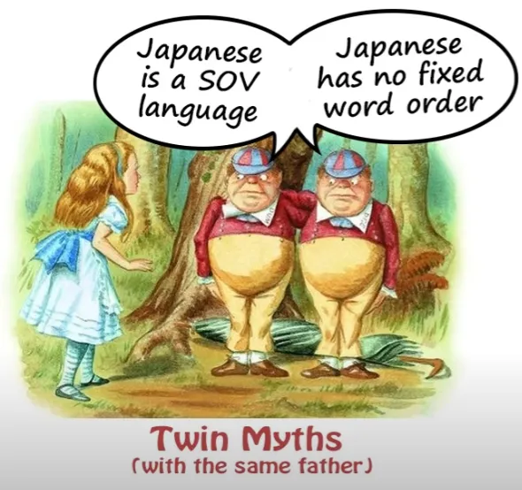

Yang pertama adalah bahwa bahasa Jepang adalah bahasa SOV, yaitu bahasa Subjek-Objek-Verba. Dan yang kedua adalah bahwa urutan kata dalam bahasa Jepang sebenarnya tidak penting dan tidak terlalu berpengaruh, karena Anda bisa menempatkan kata-kata dalam urutan apa pun dan tetap memiliki arti yang sama. Dan kedua pendapat ini sama sekali salah. Dan yang menarik, meskipun keduanya bertolak belakang satu sama lain, keduanya berasal dari kesalahan yang sama.

Keduanya berasal dari memberikan jawaban yang berbeda untuk pertanyaan yang sama, yang sebenarnya adalah pertanyaan yang salah sejak awal. Dengan kata lain, asal-usulnya adalah teman lama kita: memperlakukan bahasa Jepang seolah-olah bukan bahasa Jepang, melainkan bahasa Eropa, dan mengajukan pertanyaan serta memberikan jawaban yang relevan dengan bahasa-bahasa Eropa, bukan dengan bahasa Jepang. Jadi, mari kita telusuri ini dan lihat bagaimana hal ini bekerja, serta memahami bagaimana urutan kata sebenarnya bekerja dalam bahasa Jepang.

Pertama-tama, mari kita lihat pertanyaan tentang bahasa Jepang sebagai bahasa Subjek-Objek-Kata Kerja. Sekarang, ini akan membandingkannya dengan bahasa Inggris, yang merupakan bahasa Subjek-Kata Kerja-Objek. Jadi, untuk memberi contoh, jika kita mengatakan <code>Mary hit Susan</code>, ini adalah kalimat Subjek-Kata Kerja-Objek standar dalam bahasa Inggris.

Mary adalah Subjek — dia yang memukul. Susan adalah Objek — dia yang dipukul. Jika kita mengubah urutannya dan mengatakan <code>Susan hit Mary</code>, kita sekarang mengatakan hal yang berbeda, bukan?

Sekarang, cara kita mengatakan hal itu dalam bahasa Jepang <code>Mary hit Susan</code> adalah <code>メアリーがスーザンをなぐった</code>. Dan ini tentu saja Subjek-Objek-Kata Kerja.

Mary adalah Subjek, Susan adalah Objek, dan Kata Kerjanya ada di akhir. Jadi, bukankah Wikipedia benar? Bukankah bahasa Jepang sebenarnya adalah bahasa Subjek-Objek-Kata Kerja?

Tidak, bukan. Karena meskipun <code>メアリーがスーザンをなぐった</code> adalah cara paling umum untuk mengatakannya, itu bukan satu-satunya cara untuk mengatakannya. Kita juga bisa dengan mudah mengatakan <code>スーザンをメアリーがなぐった</code> *dan kita tetap mengatakan <code>Mary hit Susan</code>*, meskipun kita telah mengubah urutannya.

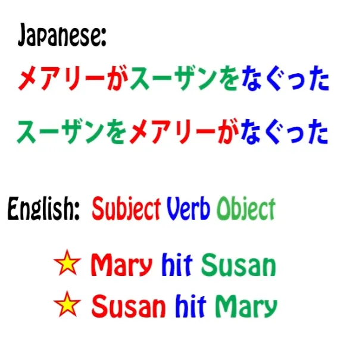

Karena dalam bahasa Jepang, pertanyaan tentang siapa yang melakukan apa kepada siapa dan sebagian besar pertanyaan logis lainnya seperti di mana hal itu dilakukan, dengan apa hal itu dilakukan, dan semua hal semacam itu ditangani oleh Partikel logis. Jadi, hal yang penting dalam kalimat ini bukanlah urutan Mary dan Susan, melainkan mana yang ditandai dengan &quot;が&quot; dan mana yang ditandai dengan &quot;を&quot;.

Jadi, pembicaraan tentang bahasa Subjek-Objek-Kata Kerja ini tidak masuk akal. Sebenarnya tidak masalah urutan mana yang Anda gunakan. Dan tentu saja inilah dasar dari orang-orang yang mengatakan bahwa urutan kata dalam bahasa Jepang tidak penting. Jadi, bukankah mereka benar?

Tidak, mereka salah. **Karena urutan kata dalam bahasa Jepang memang penting.** **Hanya saja, pentingnya tidak sama dengan cara dan tempat di mana urutan kata dalam bahasa Eropa penting.**

Jika kita mulai memandang bahasa Jepang sebagai bahasa Jepang dan tidak mencoba menafsirkannya sebagai bahasa Eropa, maka kita bisa membuat kemajuan dalam memahami bahasa Jepang.

## Aturan urutan kata dalam bahasa Jepang

Jadi, apa itu urutan kata dalam bahasa Jepang dan mengapa hal itu begitu penting? Urutan kata dalam bahasa Jepang mengikuti dua aturan sederhana. Keduanya sangat sederhana. Hanya saja, keduanya tidak berfungsi dengan cara yang sama seperti bahasa-bahasa Eropa.

Jadi, jika kita bisa melepaskan konsep-konsep Eropa dan mulai melihat bahasa Jepang sebagai bahasa Jepang, tidak ada yang sulit dalam hal ini. Sangat sederhana dan mudah dipahami. Jadi, apa saja dua aturan urutan kata dalam bahasa Jepang?

Yang pertama mungkin sudah Anda ketahui. Sangat sederhana, dan saya yakin Anda menggunakannya setiap saat jika Anda benar-benar menggunakan bahasa Jepang, bahkan pada tingkat yang sangat dasar.

### Aturan 1

Aturan pertama urutan kata dalam bahasa Jepang adalah: Kata Kerja selalu berada di akhir kalimat.

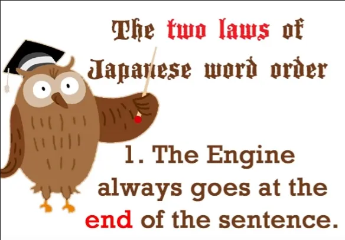

Sekarang, jika saya berbicara dengan cara bahasa Inggris yang berpusat pada kata kerja ini, saya akan mengatakan <code>The Verb always goes at the end of the sentence</code>, dan itu benar adanya. Kata Kerja memang selalu berada di akhir kalimat. Namun, tidak semua kalimat adalah kalimat kata kerja, <code>A does B</code> kalimat.

Kita juga memiliki <code>A is B</code> kalimat. Dan apa pun jenis kalimat yang kita miliki, Engine selalu berada di akhir kalimat.

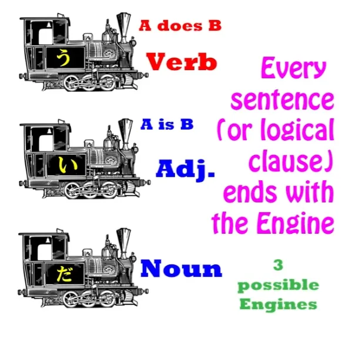

Ada tiga jenis Engine yang mungkin. Ada Engine Kata Kerja, yang merupakan <code>A does B</code> kalimat. Dan kemudian pada <code>A is B</code> kalimat, kita memiliki Engine Adjektiva, sebuah engine yang terbentuk dari kata sifat yang selalu berakhiran -い (inilah yang disebut buku teks sebagai <code>い-adjective</code> dan sebenarnya merupakan satu-satunya kata sifat yang ada dalam bahasa Jepang) atau dengan Kata Benda ditambah Kopula, yaitu <code>だ</code> atau <code>です</code>.

Jadi, setiap kalimat akan diakhiri dengan salah satu dari ketiga hal tersebut. Dan apa pun Engine yang kita gunakan, baik Kata Kerja, Kata Benda dengan Kopula, atau Kata Sifat, itu harus diletakkan di bagian akhir.

Kita mungkin memiliki beberapa partikel penutup kalimat setelahnya (dan saya telah membuat [**video**](https://www.youtube.com/watch?v=IWEok4Ivfyc&amp;ab;_channel=OrganicJapanesewithCureDolly) tentang partikel penutup kalimat), tetapi bagian akhir kalimat yang sebenarnya haruslah Engine-nya. Jadi itu aturan pertama, dan sangat mudah, dan saya kira Anda sudah terbiasa dengannya.

### Aturan 2

Aturan kedua adalah ini, dan inilah yang bisa menimbulkan kebingungan jika Anda tidak memahaminya: Apa pun yang memodifikasi sesuatu harus diletakkan di depannya.

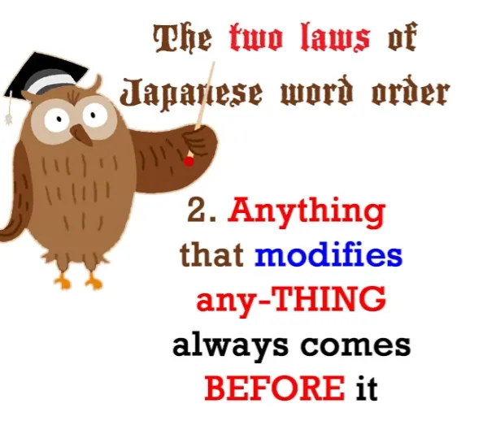

Sekarang, apa yang saya maksud dengan <code>anything</code> dan <code>any-THING</code> dan apa yang saya maksud dengan <code>modify</code>? Mari kita uraikan.

Dengan <code>any-THING</code> saya maksudkan secara harfiah sebuah benda, sebuah kata benda. Saat ini kita sedang membicarakan kata benda. Dan dengan <code>anything</code>, yang saya maksud adalah apa saja.

Bisa berupa klausa logis, bisa bagian dari klausa logis, bisa kata benda lain — intinya apa saja yang memodifikasi kata benda. Jadi, apa yang saya maksud dengan <code>modify</code>?

Nah, yang saya maksud adalah secara harfiah mengubah sesuatu atau, bisa kita katakan, mendeskripsikannya. Jadi, jika kita memiliki sebuah gaun dan kemudian kita menempatkan sebuah pengubah di depannya dan mengatakan itu adalah <code>blue dress</code>, maka kita telah memodifikasinya — kita telah membuatnya menjadi biru.

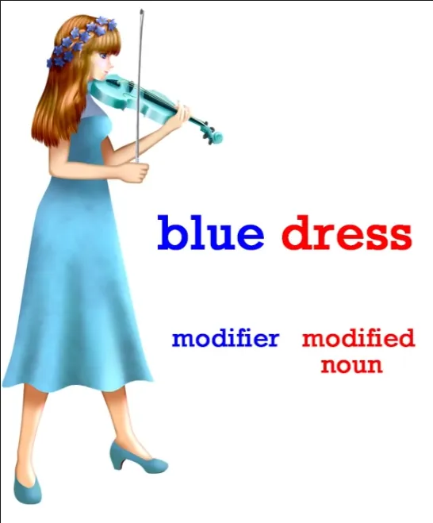

Jika kita mengatakan itu adalah <code>big dress</code> maka kita telah memodifikasinya dan menjadikannya besar. Jika kita mengatakan itu adalah <code>hot dress</code> maka kita telah memodifikasinya dan menjadikannya panas.

Dan tentu saja, kata sifat bisa menjadi lebih kompleks dari itu dan kita akan membicarakannya sebentar lagi. Namun, kata sifat adalah sesuatu yang memberi tahu kita lebih banyak tentang sebuah kata benda. Kata sifat mengubah kata benda tersebut dari sekadar kata benda sederhana menjadi versi yang lebih spesifik dari kata benda tersebut.

Jadi, apa yang saya maksud dengan mengatakan itu <code>Anything that modifies any-thing must come before it</code>? Nah, jika kita berbahasa Inggris, kita seharusnya sudah terbiasa dengan gagasan ini, karena *dalam bahasa Inggris* kata sifat sederhana selalu muncul sebelum kata benda yang dimodifikasinya. Jadi, seperti yang baru saja kita lihat, jika kita mengatakan <code>a blue dress</code>, <code>blue</code> datang sebelum kata benda yang dimodifikasi <code>dress</code>, kata benda yang baru saja kita ubah menjadi biru.

Kita mengatakan <code>a warm day</code>. <code>Warm</code> datang sebelum kata benda <code>day</code>. Dan hal ini bisa menjadi lebih rumit.

Kita mungkin mengatakan <code>a pale blue dress</code>, <code>a nice warm day</code>, dan kata sifatnya tetap berada di depan kata benda yang dimodifikasinya. Dan hal ini bisa menjadi lebih rumit lagi.

Kita mungkin mengatakan <code>an interesting-looking pale blue dress</code>, dan semuanya tetap berada di depan kata benda <code>dress</code>, bukan?

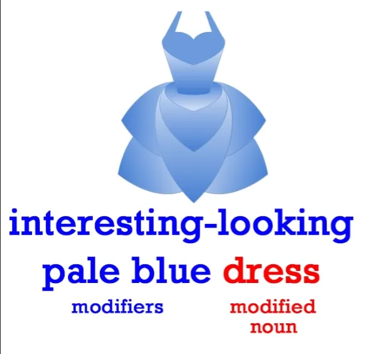

Namun, ketika kata-kata yang memodifikasi menjadi lebih rumit *dalam bahasa Inggris*, kita mulai menempatkannya di sisi lain kata benda. Jadi, jika kita ingin mengatakan <code>the dress I bought at the market on Saturday</code>, maka <code>dress</code> datang terlebih dahulu dan kata sifatnya berada di belakangnya.

Dan terkadang kita menempatkan kata sifat di kedua sisi kata benda. Jadi kita mungkin mengatakan, <code>the pale blue dress I bought at the market yesterday</code>. Jadi, kita memiliki <code>dress</code> terjepit di tengah dan klausa yang memodifikasi kata itu berada di kedua sisinya.

Itu bukan cara kerja bahasa Jepang. Bahasa Jepang selalu menempatkan kata keterangan di depan kata yang dimodifikasinya. Jadi, hal ini sangat dapat diprediksi dan kita selalu tahu apa yang sedang terjadi.

Cara memandang urutan kata dalam bahasa Jepang adalah dengan melihatnya sebagai adegan panggung. Melihat setiap kalimat atau setiap klausa logis sebagai adegan kecil di atas panggung. Dan cara kerja bahasa Jepang adalah bahwa pertama-tama ia &quot;mendandani&quot; boneka-boneka kecil yang masuk ke dalam adegan.

Jadi sebelum setiap boneka muncul, apa pun yang dikenakannya, apa pun yang memodifikasinya, apa pun yang memberi tahu kita lebih banyak tentangnya, pakaiannya, latar belakangnya. Kemudian kita menempatkannya di panggung. Kita menandainya dengan peran apa yang dimainkannya dalam kalimat, lalu kita menempatkan kata benda berikutnya jika ada kata benda lain, dan akhirnya kita menekan tombol aksi, yaitu kata kerja.

Dan kita selalu menekan tombol aksi terakhir.

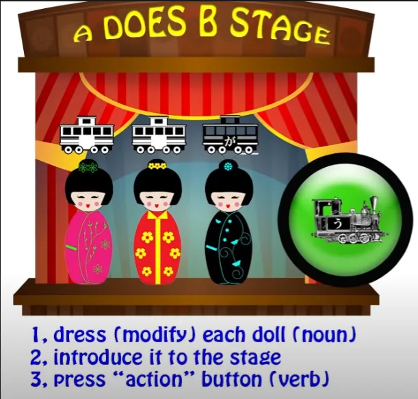

Jadi inilah urutan kalimat dalam bahasa Jepang. Pertama-tama, informasi tentang para penggerak. Kemudian para penggerak itu sendiri. Dan jika ada lebih dari satu penggerak, kita letakkan informasinya terlebih dahulu lalu penggeraknya, dan untuk yang berikutnya kita letakkan informasinya terlebih dahulu lalu penggeraknya. Dan akhirnya, jika itu adegan aksi, jika itu <code>A does B</code> adegan, maka kita tekan tombol aksi dan kita menonton para aktor menjalani adegan mereka.

Dan dari urutan kata, kita selalu bisa mengetahui apa yang sedang terjadi. Jika kita memiliki klausa yang diakhiri dengan salah satu dari Empat Unsur Dasar, yaitu Kata Kerja, Kata Sifat, atau Kata Benda ditambah Kata Hubung, kita tahu bahwa itu adalah klausa logis.

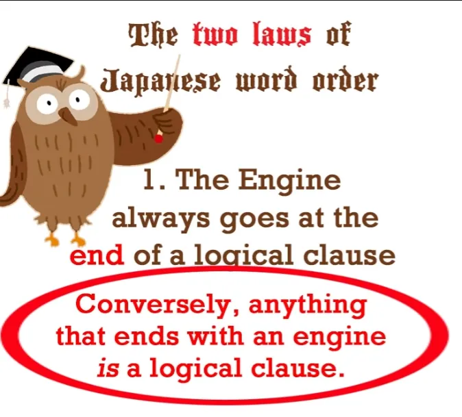

Tetapi jika urutannya dibalik dengan cara apa pun, jika diakhiri dengan kata benda dan bukan dengan &quot;Engine&quot;, maka kita tahu bahwa kata benda di awal klausa tersebut adalah kata benda yang dimodifikasi dan klausa tersebut *tidak* berfungsi sebagai klausa logis.

Mari kita ambil contoh yang telah kita bahas. Jika kita mengatakan <code>いちばで *(zeroが)* 青いドレスを買った</code>, kita mengatakan <code>I bought a blue dress at the market.</code>

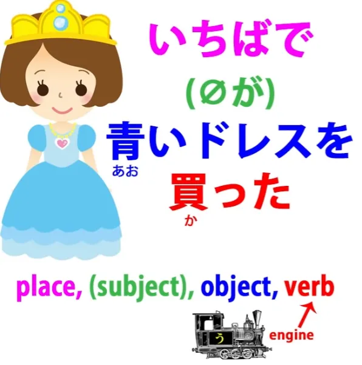

Dan kita tahu bahwa itu adalah klausa logis karena Aturan Pertama. Jadi ini adalah klausa logis yang diakhiri dengan sebuah Engine. Ini adalah <code>A does B</code> klausa: <code>I bought a blue dress at the market.</code>

Sekarang, kita dapat memindahkan hampir semua elemen dari klausa logis ke bagian depan klausa, yaitu ke posisi terdekat dengan Engine, paling kanan dalam teks horizontal, paling bawah dalam teks vertikal. Kita dapat memindahkannya ke awal klausa dan jika kita melakukannya, jika kita memindahkan elemen non-Engine apa pun ke awal klausa, maka klausa tersebut tidak lagi berfungsi sebagai klausa logis, tetapi berfungsi sebagai pengubah untuk elemen yang telah kita pindahkan ke awal.

Jadi, jika kita mengatakan, <code>いちばで *(zeroが)* 買ったドレス</code>, kita mengatakan <code>the dress I bought at the market</code>.

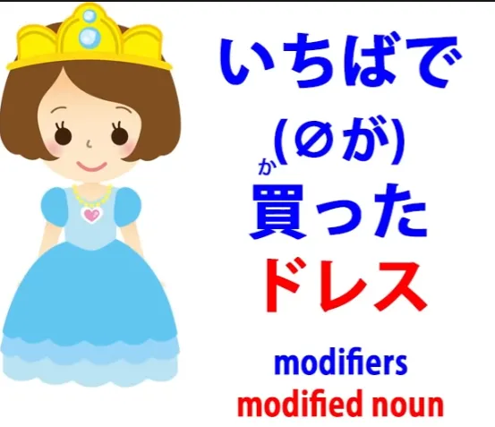

Ini bukan lagi klausa logis. Ini adalah kata benda yang dimodifikasi, dan kata benda tersebut adalah gaun. Sekarang, kita juga bisa dengan mudah memindahkan pasar ke awal klausa.

Kita bisa mengatakan, <code> *(zeroが)* ドレスを買ったいちば</code>, dan sekarang kita mengatakan <code>the market at which I bought the dress</code>.

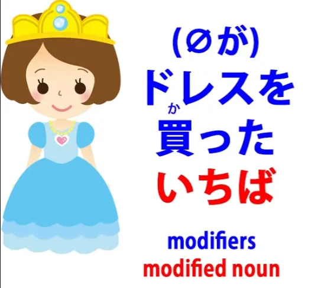

Dan sekali lagi, kita tahu ini bukan klausa logis karena tidak memiliki &quot;Engine&quot; di bagian awal. Di bagian awal terdapat kata benda, sehingga kata benda tersebut harus dimodifikasi oleh apa yang ada di depannya.

Dan karena ini bukan klausa logis, untuk membuatnya menjadi klausa logis, kita harus menambahkan sesuatu di belakangnya. Dan bagian itu juga bisa mengandung modifikasi.

Karena bahasa Jepang menangani modifikasi ini dengan cara yang berbeda dari bahasa lain. Jadi, hampir setiap kalimat kompleks dalam bahasa Jepang sangat bergantung pada premodifier ini.

Dan mengetahui apa yang memodifikasi, apa yang dimodifikasi, mengetahui apakah sesuatu adalah kata benda yang dimodifikasi atau apakah kita sedang melihat klausa logis — semua ini bergantung pada urutan kata. Jadi, klausa lengkap di sini mungkin adalah: <code> *(zeroが)* いちばで買ったドレスをメガネをかけている少女にあげた.</code>

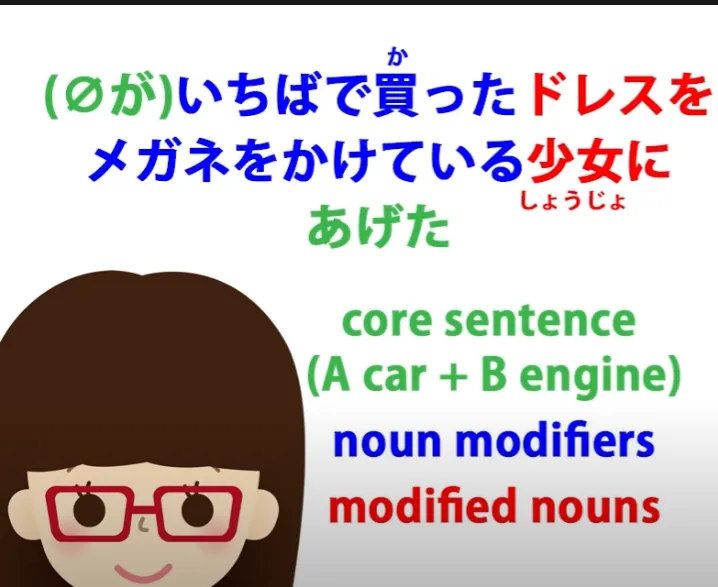

Jadi, kita mengatakan, <code>I gave the dress that I bought at the market to a girl wearing glasses.</code> Dan sekali lagi, kita memiliki apa yang bisa menjadi klausa logis — <code>少女はメガネをかけている</code>, <code>The girl is wearing glasses</code> — tetapi kita telah memindahkan kata benda <code>少女</code> — <code>girl</code> — ke depan, jadi sekarang ini bukan klausa logis, melainkan kata benda dengan pengubah, gadis *(少女)* yang dimodifikasi oleh frasa <code>メガネをかけている</code> — <code>girl wearing glasses</code>.

<code>I gave the dress I bought at the market to a girl wearing glasses.</code> Dan ini sangat umum. Anda akan sering melihat konstruksi semacam ini.

Cara bahasa Jepang melakukan sebagian besar pekerjaan dalam menyampaikan sesuatu adalah dengan menggunakan klausa-klausa pengubah ini, yang selalu muncul sebelum apa pun yang mereka modifikasi. Pertama-tama kita mendandani boneka, lalu kita menempatkan boneka di atas panggung, kemudian kita menekan tombol aksi. 

Jadi, urutan kata sangat penting untuk memahami bahasa Jepang…
