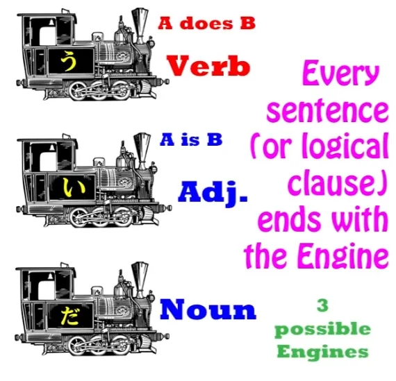
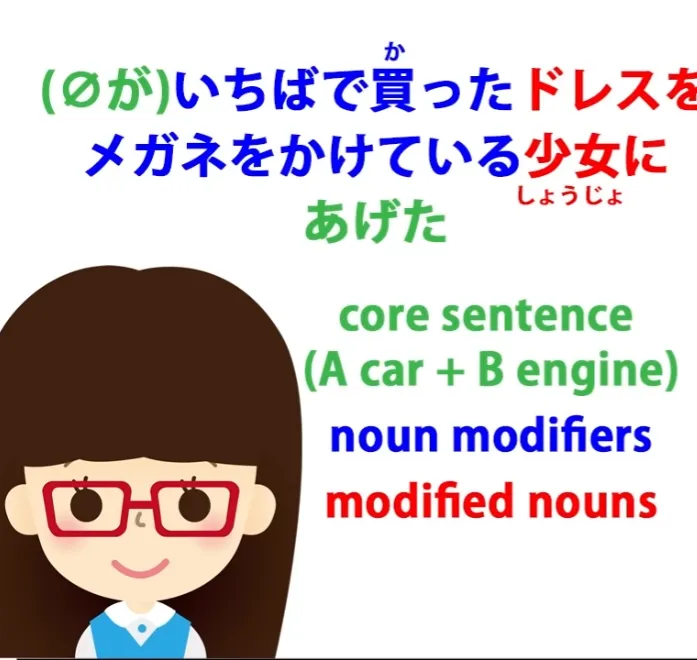
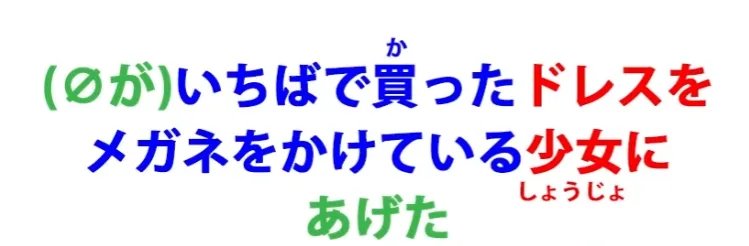
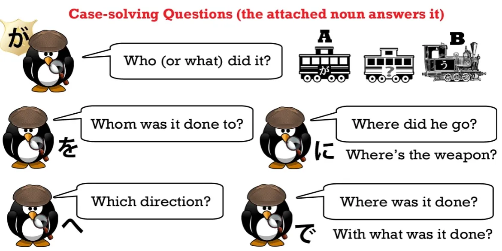

# **47. Cara Memahami Bahasa Jepang: Senjata Rahasia Anda untuk Memecah Kalimat**

[**Cara Memahami Bahasa Jepang: Senjata Rahasia Anda untuk Memecah Kalimat | Pelajaran 47**](https://www.youtube.com/watch?v=z9S2J8tlnUE&amp;list;=PLg9uYxuZf8x_A-vcqqyOFZu06WlhnypWj&amp;index;=49&amp;pp;=iAQB)

こんにちは。

Hari ini kita akan membahas senjata rahasia yang akan memungkinkan Anda memahami kalimat Jepang apa pun, terlepas dari seberapa rumit tampaknya. Banyak kalimat Jepang sebenarnya terlihat jauh lebih rumit daripada yang sebenarnya karena apa yang saya sebut struktur modular atau modifikasi bahasa tersebut. Namun, begitu kita memahami cara kerjanya, struktur ini berhenti menjadi musuh kita dan menjadi teman kita, karena memungkinkan kita memecah kalimat Jepang yang rumit menjadi sesuatu yang sangat sederhana.

Saya sudah memberitahu Anda sejak awal kursus ini bahwa setiap kalimat Jepang terdiri dari dua elemen, yaitu A-car (subjek) dan B-engine.

A-car selalu ditandai dengan が. Kita tidak selalu bisa melihatnya, tetapi terlepas dari apakah kita bisa melihatnya atau tidak, secara logis ia selalu ada dan selalu ditandai dengan が. B-engine bisa berupa salah satu dari tiga hal saja.

Ia bisa berupa kata kerja, kata sifat, atau kata benda ditambah kopula <code>だ</code> atau <code>です</code>. Hanya ada dua jenis kalimat: <code>A is B</code> dan <code>A does B</code> kalimat.

Dalam sebuah <code>A does B</code> kalimat, A adalah hal yang melakukan B, yang merupakan engine, yang harus berupa kata kerja. Dalam <code>A is B</code> , A adalah hal yang merupakan B, yang harus berupa kata sifat atau kata benda ditambah kata penghubung. Sekarang, kita telah melihat kalimat yang jauh lebih rumit sejak saat itu dan kita telah melihat bagaimana setiap kalimat memiliki A dan B yang sama sebagai inti dasarnya.

Namun, hal penting yang akan kita bahas hari ini adalah fakta bahwa A dan B bukan hanya inti kalimat: mereka adalah *kalimat itu sendiri*. Segala hal lain hanyalah memberi tahu kita lebih banyak tentang A atau lebih banyak tentang B. Sekarang, satu-satunya hal lain yang kadang-kadang dapat memperumit ini adalah fakta bahwa ketika kita mengatakan <code>a sentence</code> yang sebenarnya kita maksud adalah klausa logis.

Sekarang, kita kadang-kadang menggunakan kedua istilah tersebut secara bergantian dan seringkali kita bisa menggunakannya secara bergantian, tetapi perbedaannya adalah ini: klausa logis secara definisi adalah kalimat lengkap, artinya, kita bisa menambahkan <code>○ / まる</code> titik di akhir kalimat tersebut dan kemudian itu menjadi sebuah kalimat. Kalimat tersebut dapat berdiri sendiri; kalimat tersebut gramatikal; tidak memerlukan hal lain. Itu adalah sebuah kalimat. Namun, alasan kita menyebutnya <code>a logical clause</code> adalah karena *sebuah kalimat dapat mengandung lebih dari satu klausa logis.*

Artinya, kalimat tersebut dapat mengandung dua elemen di dalamnya yang masing-masing dapat menjadi kalimat lengkap. Contoh yang sangat sederhana dari hal ini adalah jika kita mengatakan <code> *(zeroが)* お店に行って *(zeroが)* パンを買った</code>, yang dalam bahasa Inggris adalah <code>I went to the shops and bought bread.</code>

Sekarang, baik dalam bahasa Inggris maupun Jepang, ini adalah dua klausa logis yang digabungkan menjadi satu kalimat majemuk. Dan saya telah membahas kalimat majemuk dalam video lain. Jadi, yang kita miliki di sini adalah klausa logis <code> *(zeroが)* お店に行った</code> — <code>I went to the shops</code> — dan <code> *(zeroが)* パンを買った</code> — <code>I bought bread</code>.

Dalam bahasa Inggris, ini adalah <code>I went to the shops and I bought bread</code>. Nah, dalam bahasa Jepang kita tidak perlu <code>I</code> yang terlihat, tetapi harus ada secara logis dan secara logis membawa partikel が. Kita kadang-kadang mengatakan bahwa bahasa Inggris mengharuskan subjek hadir secara terlihat di setiap klausa, tetapi ini sebenarnya tidak benar, meskipun hampir benar.

Dan ini adalah contoh bahwa hal itu tidak selalu benar. Bahasa Inggris sebenarnya menggunakan subjek tak terlihat sama seperti bahasa Jepang. Hanya saja, hal itu tidak dilakukan sesering itu. Jadi, dengan kalimat ini dalam bahasa Inggris, kita biasanya tidak mengatakan <code>I went to the shops and I bought some bread</code>.

Kita biasanya mengatakan <code>I went to the shops and bought some bread</code>. Jadi, Anda dapat melihat di sini bahwa bahasa Inggris sebenarnya menggunakan subjek tak terlihat. Kita tidak perlu mengatakan <code>I</code> dua kali.

Kita diperbolehkan untuk mengalihkannya dari konteks ke klausa kedua kalimat, sama seperti bahasa Jepang yang jauh lebih bebas mengizinkan kita melakukannya. Namun, dalam semua kasus, subjeknya ada di sana. Roti tidak membeli dirinya sendiri. Saya yang membelinya, baik saya terlihat sebagai subjek di sana atau tidak.

Jadi, salah satu keterampilan yang kita butuhkan untuk memahami kalimat kompleks adalah kemampuan untuk melihat di mana klausa logis berakhir, untuk melihat kapan sesuatu sebenarnya merupakan klausa logis yang lengkap dengan A-car dan B-engine-nya sendiri. Dan saya telah membuat video lengkap yang menjelaskan cara melakukannya, jadi Anda mungkin ingin menonton video itu setelah menonton yang ini.[[34]](./34-understand-any-sentence.md)

Hari ini kita akan fokus pada klausa logis dan cara-cara di mana klausa tersebut tampaknya bisa menjadi rumit. Minggu lalu kita membahas konsep modifikator dan kita membahasnya dalam bentuk yang mungkin paling sederhana dan mudah dipahami, yaitu modifikator kata benda. Dan untuk memahami modifikator, Anda harus memahami urutan kata dalam bahasa Jepang karena urutan kata dalam bahasa Jepang sangat penting. Seiring kalimat menjadi lebih kompleks, Anda harus memahami urutan kata untuk memahami apa yang sedang dilakukan kalimat tersebut.

Jadi, orang-orang yang mengatakan bahwa bahasa Jepang tidak memiliki urutan kata yang tetap atau bahwa bahasa Jepang adalah bahasa SOV sebenarnya menyesatkan Anda, karena kedua pernyataan tersebut tidak benar, seperti yang kita bahas minggu lalu.[[46]](./46-word-order-matters-2-simple-rules-to-crack-tough-sentences.md)

Jadi, hukum pertama urutan kata dalam bahasa Jepang adalah bahwa inti kalimat, yang bisa berupa kata kerja, kata sifat, atau kata benda ditambah kata penghubung, selalu harus berada di akhir kalimat.

Dan aturan kedua, yang paling penting untuk tujuan kita saat ini, adalah bahwa apa pun yang memodifikasi sesuatu harus berada di depannya. Nah, minggu lalu, bentuk yang saya gunakan adalah <code>Anything that modifies any \*THING\* has to come before it</code>, artinya, apa pun yang memodifikasi kata benda harus berada di depan kata benda tersebut.

Namun, kita bisa memperluasnya, dan itulah yang akan kita lakukan minggu ini. Dan kita bisa dengan sederhana mengatakan <code>Anything that *modifies* ANYTHING always comes BEFORE it</code>. Tidak harus berupa kata benda.

Apa lagi yang bisa menjadi modifikator? Nah, bisa jadi kata kerja utama dalam kalimat tersebut.

Jadi, mari kita kembali ke kalimat yang agak rumit yang kita analisis minggu lalu. <code> *(zeroが)* いちばで買ったドレスをメガネをかけている少女にあげた.</code> — <code>I gave the dress I bought at the market to a girl wearing glasses.</code>

Sekarang, saya memberi warna pada kalimat ini untuk menunjukkan proses modifikasi kata benda. Dalam kalimat ini, kita memiliki mobil A, yang tidak terlihat (itu adalah &quot;I****, zeroが

), dan kita memiliki engine, yang <code>あげた</code>. Dan itulah inti kalimat: <code>I gave</code>Sekarang, di dalam kalimat ini kita memiliki dua kata benda dan keduanya dimodifikasi oleh informasi tambahan. Dan dalam kedua kasus tersebut, informasi tersebut diberikan dengan mengambil klausa logis, mengambil satu elemen darinya, dan menempatkannya di awal kalimat, di bagian &quot;engine&quot; kalimat.

Jadi kita bisa mengatakan <code>いちばで *(zeroが)* ドレスを買った</code> dan kemudian kita memiliki engine di bagian akhir dan kita mengatakan <code>I bought a dress at the market</code>, tetapi kita juga bisa mengambil elemen apa pun dari kalimat itu dan menempatkannya di bagian akhir dan itu menjadi kata benda yang dimodifikasi. Jadi kita bisa mengatakan, seperti yang kita katakan di sini, <code>いちばで *(zeroが)* 買ったドレス</code>, yang berarti <code>the dress I bought at the market</code>.

Kita juga bisa melakukan hal yang sama dengan pasar: <code> *(zeroが)* ドレスを買ったいちば</code> — <code>the market at which I bought the dress</code>. Dan tidak satupun dari ini adalah klausa logis, karena tidak bisa berdiri sendiri sebagai kalimat, bukan? Sekarang ini adalah kata benda yang harus memainkan peran tertentu dalam kalimat yang lebih besar.

Jadi, elemen biru di sini adalah pengubah, sedangkan elemen merah adalah kata benda yang ditandai dengan Partikel logis. *(gambar terakhir)* Dan inilah fakta mendasar yang perlu Anda pahami sejenak. **Dalam sebuah <code>A does B</code> kalimat, kata benda yang ditandai oleh partikel logis utama selain が,** **yaitu oleh を, に, で, dan へ, semuanya merupakan modifikator untuk kata kerja.**

Partikel logis が memberi tahu kita apa subjek kalimatnya, apa itu A-car. Partikel logis の merupakan pengecualian di sini karena fungsinya adalah menghubungkan dua kata benda. Namun, partikel logis utama pada kalimat kata kerja, を, に, で, dan へ, hanya melakukan satu hal dan satu hal saja.

**Partikel-partikel tersebut memodifikasi kata kerja; mereka memberi tahu kita lebih banyak tentang kata kerja tersebut.**

Jadi, dalam kalimat ini, kalimat itu sendiri adalah <code>(zeroが)あげた</code> dan semua yang lain memberi tahu kita lebih banyak tentang <code>あげた</code>.

::: info
- Saya akan memberikan contoh kalimat langsung dalam bahasa Jepang di sini, tetapi jangan terlalu dipaksakan.
(が
nol)あげた
:::

<code>I gave.</code> Apa yang saya berikan? Objek langsung yang ditandai dengan *(を) memberi tahu kita hal ini: <code>I gave a dress</code>. *(zero が)ドレスをあげた*

Modifikator memberi tahu kita lebih banyak tentang gaun tersebut: <code>the dress I bought at the market</code>. *いちばで(zero が)買ったドレス (jika tidak jelas tentang zero が di sini, lihat L.46 Aturan 2 bagian)*

Kepada siapa saya memberikannya? **Objek tidak langsung** yang ditandai dengan に memberi tahu kita hal ini: <code>I gave it to a girl</code>. *(が nol)少女にあげた*

Gadis seperti apa? Nah, kata sifatnya memberi tahu kita lebih banyak tentang gadis itu: <code>the girl wearing glasses</code>. *メガネをかけている少女。。。*

Jadi, kalimatnya sendiri adalah <code>(zeroが)あげた</code> dan semua bagian lainnya memberi tahu kita lebih banyak tentang <code>あげた</code>. Dan seberapa pun panjang dan rumitnya, struktur itu selalu tetap sama.

Kita harus mengidentifikasi engine kalimat dan itu sangat mudah karena engine kalimat selalu berada di akhir kalimat. Mungkin ada beberapa partikel penutup kalimat setelahnya (dan saya sudah membuat video tentang itu), tetapi akhir logis dari kalimat adalah kata kerja, kata sifat, atau kata benda ditambah kopula yang berada di posisi terakhir dalam kalimat.

Jadi, kita selalu tahu di mana menemukan engine: ia berada di akhir kalimat. Dan subjeknya adalah siapa pun yang melakukan kata kerja tersebut atau menjadi kata sifat atau kata benda ditambah kata hubung tersebut. Hal berguna lainnya yang perlu diingat adalah biasanya cukup mudah menemukan bahkan penggerak tak terlihat karena tidak akan ada apa pun di belakangnya.

Dalam kalimat ini, seperti yang kita lihat, ada banyak modifikasi yang terjadi tetapi semuanya memodifikasi kata kerja.

Kita tidak bisa memiliki apa pun yang memodifikasi A-car, penggerak yang ditandai dengan &quot;が&quot;, karena penggerak yang ditandai dengan &quot;が&quot; tidak terlihat dan kita hanya bisa memodifikasi sesuatu yang benar-benar terlihat dalam sebuah kalimat.

::: info
Saya mungkin belum sepenuhnya memahami maksud Dolly di sini mengenai &quot;zero-が&quot; yang tidak memiliki apa pun di belakangnya, karena dia memang memberikan contoh (di L.46) di mana penggerak &quot;が&quot; tak terlihat memiliki sesuatu di depannya—bahkan dalam klausa logis, seperti &quot;place-いちばで&quot; (zero-が)青いドレスを買った di L46.
Saya pikir yang dimaksudnya hanyalah bahwa hal ini tidak akan berfungsi tanpa 私が yang disebutkan karena gaun tersebut dimodifikasi oleh seluruh pre-modifier <code>私がいちばで買った</code> yang merupakan pre-modifier untuk &quot;dress&quot;, bukan klausa lengkapnya sendiri yang membentuk kalimat tersendiri seperti yang seharusnya jika itu adalah - 私がいちばでドレスを買った。 Di mana kata kerja berada di akhir sebagai kepala klausa.
:::

Di sini, sebaliknya, itu hanyalah pre-modifier, dan kata kerja kepala klausa adalah &quot;あげた&quot; di akhir.
*Jadi, jika kita ingin memodifikasi kedua elemen kalimat tersebut, kita perlu membuat elemen pertama terlihat.

Mari kita coba melakukannya. <code>あのさくらをなぐったみにくい外国人は *(zeroが)* 私がいちばでかったドレスをメガネをかけている少女にあげた.</code> — <code>That ugly foreigner who hit Sakura gave the dress I bought at the market to a girl wearing glasses.</code>

Sekarang kita memulai kalimat dengan topik non-logis yang ditandai dengan &quot;は&quot;. Namun, fungsi topik tersebut adalah mendefinisikan subjek tak terlihat, yaitu &quot;A-car&quot; yang ditandai dengan &quot;が&quot; dalam kalimat ini, yang merupakan &quot;が&quot; tak terlihat.

Sekarang, kita bisa mengatakan, <code>みにくい外国人がさくらをなぐった</code> — <code>An ugly foreigner hit Sakura</code> — tetapi yang kita lakukan di sini sekali lagi adalah kita mengeluarkan salah satu elemen, dalam hal ini <code>外国人</code>, dan menempatkannya di akhir klausa, **sehingga ini bukan klausa logis fungsional***,* **melainkan kata benda yang dimodifikasi:** <code>the ugly 外国人 who hit Sakura</code>. Jadi, ini memberi tahu kita lebih banyak tentang &quot;外国人&quot; tersebut: <code>As for that ugly 外国人 who hit Sakura, he did...</code>

Apa yang dia lakukan? <code>He did..</code> — itulah <code>zeroが</code> — <code>he did...</code> dan kemudian kita mengatakan apa yang dia lakukan.

::: info
Saya akan menempatkan komentar ini di sini.
*
:::

Dan perhatikan bahwa segala sesuatu, segala sesuatu dalam kalimat ini selain inti terdiri dari apa yang mungkin kita sebut <code>serial modification</code>. Bahkan kata <code>外国人</code>, yang begitu sering muncul bersamaan sehingga kita cenderung menganggapnya sebagai kata tersendiri, dan memang itu adalah kata tersendiri, sebenarnya merupakan contoh dari *modifikasi berurutan*, di mana satu hal memodifikasi hal yang datang setelahnya.

Jadi, <code>コク/国</code> adalah pembacaan <code>くに/国</code> — <code>country</code>. <code>外国</code> — di mana <code>外国</code>, <code>外</code> memodifikasi <code>国</code>. Negara seperti apa itu? Sebuah <code>outside</code> negara, sebuah <code>foreign</code> negara. Dan kemudian, <code>ジン/人</code>, yang merupakan pembacaan <code>ひと/人</code> — <code>person</code> — dimodifikasi oleh keduanya.

Orang seperti apa dia? <code>outside-country</code> orang, seorang orang <code>from a foreign country</code> — <code>外国人</code>.

---

Jadi, segala sesuatu dalam kalimat ini memodifikasi apa pun yang ada setelahnya, hingga kita sampai pada mobil-A, dan kemudian kita memiliki unsur dasar pertama dari kalimat tersebut, dan kemudian segala sesuatu setelah itu memodifikasi engine. Dan hanya itu yang bisa terjadi.

Beginilah struktur setiap kalimat dalam bahasa Jepang. Kita memiliki A-mobil, kita memiliki B-engine. Jika ada sesuatu yang memodifikasi A-mobil, itu berada tepat di depannya.

Jika ada sesuatu yang memodifikasi B-engine, itu berada tepat di depannya. Setiap kata benda yang ditandai dengan Partikel logis utama, para &quot;detektif&quot; dari video Partikel logis kami [[8b]](./8b-particles-explained.md):

を, に, で dan - へ, sebenarnya **memperluas makna kata kerja.** Mereka memberi tahu kita lebih banyak tentang kata kerja, dan saya katakan dalam video itu bahwa partikel logis ini — selain が, yang memberi kita subjek dari kalimat apa pun, dan の, yang menghubungkan dua kata benda — keempat partikel logis mendasar ini hanya berfungsi dalam kalimat-kalimat kata kerja, <code>A does B</code> kalimat.

Atau, dalam istilah detektif, partikel-partikel ini hanya berfungsi pada kasus. Dan itu karena fungsinya adalah memberi tahu kita lebih banyak tentang kata kerja, untuk memodifikasi kata kerja.

Jadi, setiap kalimat memiliki struktur yang sama: mobil A, engine B, hal-hal yang memodifikasi mobil A, dan hal-hal yang memodifikasi engine B.

Dan tidak ada hal lain yang bisa ada dalam sebuah kalimat kecuali hal-hal seperti partikel penutup kalimat. **Namun mungkin ada lebih dari satu klausa logis yang beroperasi dalam sebuah kalimat** dan, seperti yang saya katakan, mengidentifikasi klausa logis tidaklah rumit…
