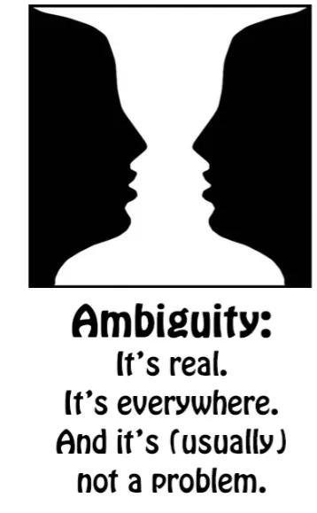

# **48. Mengatasi ambiguitas dalam Bahasa Jepang**

[**Mengatasi ambiguitas dalam Bahasa Jepang: 3 Aturan yang Membuat Segalanya Jelas! Pelajaran 48**](https://www.youtube.com/watch?v=gcbbSW-KuTQ&amp;list;=PLg9uYxuZf8x_A-vcqqyOFZu06WlhnypWj&amp;index;=50&amp;pp;=iAQB)

こんにちは。

Hari ini kita akan membahas ambiguitas dalam bahasa Jepang, karena hal ini membuat bahasa tersebut jauh lebih sulit dipahami bagi banyak pelajar non-Jepang. Bahasa Jepang memang dikenal sebagai bahasa yang ambigu. Dan terlepas dari apakah hal ini benar atau tidak, persepsi tentang ambiguitas membuat kalimat menjadi lebih sulit dipahami. Jadi, saya ingin membahas ambiguitas nyata dan yang dirasakan dalam bahasa Jepang serta cara mengatasinya.

Orang Jepang tidak mengalami kesulitan dalam saling memahami, dan tidak ada alasan bagi Anda untuk mengalami kesulitan juga. Banyak kesulitan yang dirasakan berasal dari fakta bahwa bahasa ini diajarkan dengan cara yang tidak menjelaskan struktur sebenarnya dari bahasa tersebut. Jadi, mari kita lihat beberapa aspek berbeda dari ambiguitas bahasa Jepang yang sebenarnya dan yang dirasakan.

Mungkin hal pertama yang membuat bahasa Jepang terasa ambigu dan sulit bagi orang asing adalah subjek tak terlihat.

Hal ini begitu membingungkan bagi banyak orang sehingga ada guru-guru bahasa Jepang yang cerdas dan dihormati di internet yang bahkan sampai mengklaim bahwa bahasa Jepang tidak memiliki subjek gramatikal. Tentu saja bahasa Jepang memiliki subjek gramatikal dan subjek tersebut ada di setiap kalimat. Masalahnya adalah Anda tidak selalu bisa melihatnya. Nah, saya telah menjelaskan sebelumnya bahwa sebenarnya kata ganti tak terlihat (atau subjek tak terlihat) dalam bahasa Jepang tidak lebih membingungkan daripada bahasa Inggris <code>it</code>.

Kata <code>it</code> bisa berarti galaksi Andromeda, bisa berarti sebuah pohon, bisa berarti tempurung lutut saya (saya memang punya tempurung lutut), bisa berarti ekor simpanse, dengan asumsi simpanse memang punya ekor, dan bahkan jika tidak, itu bisa berarti ekor simpanse imajiner. Intinya adalah karena <code>it</code> bisa berarti hampir segala sesuatu, sebenarnya kata itu tidak berarti apa-apa kecuali dalam konteks. Dan itulah tepatnya cara kerja subjek tak terlihat. Dan yang satu tidak lebih ambigu daripada yang lain.

Namun, beberapa orang akan berkata, <code>But the fact that you can&#x27;t see it means that we don&#x27;t even know whether it&#x27;s there or not.</code> Dan jawabannya adalah ya, kita bisa mengetahuinya. Selama kita memahami struktur bahasa, kita tahu itu ada di sana karena harus ada di sana. Itu secara logis ada di sana.

Jadi, tidak ada kesulitan sama sekali dalam mengidentifikasi subjek tak terlihat asalkan kita memahami struktur bahasa tersebut. Dan salah satu kesulitannya tentu saja adalah bahwa buku teks tata bahasa Jepang konvensional dan situs web tidak mengajarkan struktur sebenarnya dari bahasa tersebut, sehingga mereka membuat kita ragu tentang hal ini maupun banyak topik lain.

Namun, itulah tujuan kursus saya, jadi jika Anda mengikuti kursus saya atau telah mengikuti kursus saya, Anda seharusnya sudah cukup jelas mengenai struktur bahasa tersebut. Jadi, apakah subjek tak terlihat pernah dapat menimbulkan ambiguitas?

Ya, bisa. Sama seperti <code>it</code> dalam bahasa Inggris.

Misalnya, jika saya berkata, <code>My right antenna was so broken that it fell off</code> (kamu belum pernah melihat antenaku, kan? Nah, itu rahasia, jadi kita lewatkan saja) <code>My right antenna was so broken that it fell off</code>, kamu tahu dari konteksnya bahwa <code>it</code> merujuk pada antena kanan saya. Namun, misalkan saya berkata, <code>I was trying to fix the door handle, but my right antenna was so broken that it fell off.</code> Maka kamu mungkin tidak tahu apakah yang saya maksud adalah antena kanan saya yang lepas atau pegangan pintunya yang lepas.

Dan ambiguitas semacam ini bisa terjadi dalam bahasa apa pun, dan sebenarnya tidak lebih sering terjadi dalam bahasa Jepang daripada bahasa lain. Apa yang harus kita lakukan jika hal itu terjadi?

## Aturan Konteks

Pada dasarnya, terserah pada pembicara untuk menjelaskan dirinya sendiri atau pendengar untuk meminta klarifikasi jika pembicara belum jelas. Jika Anda menonton anime, membaca buku, bermain game, atau secara umum berurusan dengan tulisan atau ucapan profesional, orang-orang akan menjelaskan hal-hal tersebut kecuali mereka memang ingin bermain-main dengan ambiguitas.

Jadi, ini sama saja dengan bahasa Inggris atau bahasa lain mana pun. Tidak ada yang istimewa dari bahasa Jepang dalam konteks ini. Jika kita kembali ke contoh yang kita gunakan di pelajaran pertama tentang penanda topik &quot;は&quot; yang tidak logis, <code>私はうなぎです</code>. <code>私は *(zeroが)* アメリカ人です</code> berarti <code>I am an American.</code> / *Adapun saya, (saya) orang Amerika* <code>私は *(zeroが)* うなぎです</code> biasanya tidak berarti <code>I am an eel.</code> *Adapun saya, (makanan?) belut-adalah*

Jika diucapkan di restoran dan topik pembicaraan adalah apa yang akan kita makan, maka akan dipahami bahwa subjek tak terlihat dalam kalimat tersebut bukanlah <code>私</code> melainkan hal yang sedang kita bicarakan: apa yang akan kita makan.

---

Apakah itu bisa berarti <code>I am an eel</code>? Ya, bisa saja.

Misalnya, jika saya menghampiri orang asing di jalan dan menunjuk hidung saya (yang merupakan cara di Jepang untuk menunjukkan diri sendiri) dan berkata, <code>私はうなぎです</code>, mereka akan tahu bahwa saya mengatakan bahwa saya adalah seekor belut dan mereka mungkin akan menganggap saya sedikit aneh, karena saya tidak terlihat seperti belut. Saya terlihat sedikit seperti manusia, tapi saya harap tidak terlalu mirip belut. Sekarang, jika di restoran kita sama sekali tidak sedang membicarakan makanan, mungkin tentang cuaca, dan tiba-tiba saya berkata <code>私はうなぎだ</code>, orang-orang mungkin tetap mengerti bahwa saya bermaksud mengatakan bahwa saya telah memutuskan ingin makan belut.

Jadi, bagaimana ini bekerja? Nah, dalam bahasa Jepang — dan hal ini sama saja dalam bahasa Inggris atau bahasa lain — kita memiliki tiga aturan yang diterapkan untuk menafsirkan kalimat yang bisa ambigu dengan cara apa pun. Dan ketiganya adalah: **konteks, probabilitas, dan aturan absurditas.**

Konteks adalah yang paling jelas dan sudah kita bahas sebelumnya. Jika saya berkata <code>My left antenna was so broken that it fell off</code>, Anda tahu dari konteks bahwa <code>it</code> berarti antena kiri saya.

## Aturan Probabilitas

Probabilitas adalah fakta bahwa ketika dua kemungkinan sama-sama mungkin dan konteks belum memberi tahu kita mana yang benar, kita akan memilih yang paling mungkin. Dan ini bukan sekadar kebetulan. Ini adalah hal yang diketahui semua orang tentang bahasa. Jadi pendengar melakukannya, penutur mengharapkan pendengar melakukannya, dan bahasa dirancang untuk bekerja sesuai aturan tersebut — baik dalam bahasa Jepang maupun bahasa Inggris.

Jadi tidak ada yang misterius tentang hal ini. Jadi, misalnya, jika saya mengatakan <code>I saw a man on a hill with a telescope</code>, kemungkinan besar Anda akan menafsirkannya sebagai arti bahwa saya menggunakan teleskop untuk melihat pria di bukit. Itulah probabilitas; saya sebenarnya tidak mengatakan apa pun yang menunjukkan penafsiran itu, tetapi itulah penafsiran default yang paling mungkin.

Namun, jika Anda berkata kepada saya, <code>Do you think we&#x27;re being watched?</code> dan saya menjawab, &quot;Saya rasa begitu. Saya melihat seorang pria di atas bukit dengan teleskop&quot;, maka Anda mungkin akan menafsirkan bahwa saya melihat, dengan mata telanjang, seorang pria di atas bukit yang membawa teleskop dan karena itu mungkin sedang mengamati kita. Nah, ada juga penafsiran lain.

Saya bisa saja bermaksud mengatakan bahwa saya melihat seorang pria di atas bukit yang di atasnya terdapat salah satu teleskop umum berbayar ini, jadi <code>a hill with a telescope</code> itulah tempat saya melihat pria itu. Dan bahkan bisa saja berarti bahwa saya menggunakan teleskop sebagai gergaji untuk memotong seorang pria di atas bukit. Nah, yang terakhir, seperti <code>I am an eel</code>, agak absurd dan oleh karena itu sangat jarang ada orang yang menafsirkannya demikian. *Konteks juga membantu di sini*

## Aturan Absurditas

Dan aturan absurditas menyatakan bahwa beban pembuktian terletak pada hal yang absurd. Dan ini mirip dengan prinsip hukum bahwa beban pembuktian ada pada pihak penuntut. Dengan kata lain, kita menganggap terdakwa tidak bersalah kecuali kita dapat membuktikan bahwa mereka bersalah.

Demikian pula, kita menganggap sebuah pernyataan tidak absurd kecuali ada bukti jelas bahwa absurditas itu disengaja. Jadi, misalnya, <code>I ate dinner with Sakura last night</code> umumnya tidak dianggap sebagai kalimat yang ambigu. <code>I ate dinner with chopsticks last night</code> juga tidak dianggap sebagai kalimat yang ambigu. Namun, Anda dapat melihat bahwa keduanya memiliki struktur yang identik tetapi berfungsi secara berbeda.

Sekarang, jika saya ingin mengatakan <code>I ate dinner with Sakura last night</code> berarti saya menggunakan Sakura sebagai alat makan atau jika saya ingin mengatakan <code>I ate dinner with chopsticks last night</code> yang berarti sepasang sumpit animasi yang ramah adalah teman makan saya, maka saya wajib menjelaskannya. Saya tidak dapat menyampaikan kepada Anda gagasan bahwa saya menggunakan Sakura sebagai alat makan dengan mengatakan <code>I ate dinner with Sakura last night</code>.

Anda akan selalu memilih interpretasi yang lebih mungkin dan kurang absurd.

---

Bahasa memiliki hak, dan harus memiliki hak, untuk mengekspresikan hal-hal yang tidak mungkin dan absurd. Jika tidak, bahasa akan memiliki area-area tertentu yang tidak dapat diekspresikan. Namun, semakin jauh Anda menyimpang dari norma, semakin besar kewajiban penutur untuk menjelaskan apa yang dia katakan.

Jadi, jika saya benar-benar ingin mengatakan bahwa saya menggunakan Sakura sebagai alat makan, saya harus mengatakan <code>I had dinner last night and I used Sakura as a pair of chopsticks.</code> Segala sesuatu yang memiliki ambiguitas sekecil apa pun akan mengesampingkan kemungkinan yang absurd. Sekarang, ini bukan logika, bukan tata bahasa, tetapi inilah cara bahasa manusia bekerja — bahasa Inggris, bahasa Jepang, atau bahasa lainnya.

Untuk mengambil contoh spesifik dalam bahasa Jepang, sesuatu yang terkadang membingungkan orang adalah fakta bahwa kata kerja bantu potensial ICHIDAN <code>-られる</code> dan kata kerja bantu reseptif Ichidan <code>-られる</code> memiliki bentuk yang identik.

::: info
Untuk Potensial, lihat Pelajaran 10, bentuk potensial Godan adalah akar kata &quot;え&quot; + akhiran &quot;-る&quot;. Untuk Receptif, lihat L13.
*
:::

::: info
Ada juga kesalahan pada gambar video yang menyebutkan bahwa keduanya melekat pada akar kata あ (kata kerja Godan), tetapi Potensial melekat pada akar kata え, sedangkan Receptif melekat pada akar kata あ.
:::

Dan orang sering berpikir, <code>Well, this is really worrying. The two are the same. How am I ever going to know which is which?</code> Dan sebagian masalah di sini berasal dari pendekatan buku teks dalam belajar bahasa Jepang, yang berkaitan dengan mempelajari hal-hal secara abstrak dan berurusan dengan kalimat-kalimat yang terputus, terisolasi, dan di luar konteks.

Meskipun kita perlu mempelajari struktur, **cara kita belajar bahasa Jepang adalah melalui pencelupan dalam bahasa Jepang, menggunakan bahasa Jepang yang nyata dan dalam konteks.** Jadi, mari kita lihat <code>-られる</code> masalah ini.

Misalnya, <code>食べられる</code>: <code>食べられた</code>, jika itu bentuk potensial, bisa berarti <code>I was able to eat</code> atau <code>I was able to eat (something) / I was able to eat (this particular thing)</code>. Di sisi lain, jika dalam bentuk pasif, artinya <code>I received the action of eating</code>.

Dalam bahasa Inggris, kita akan mengatakan <code>I was eaten</code> atau <code>I got eaten</code>, yang lebih mendekati bahasa Jepang. Hal ini cenderung diterjemahkan sebagai kalimat pasif — <code>I was eaten</code> — dalam bahasa Inggris. Yang sebenarnya dimaksud adalah secara harfiah <code>I got eaten / I received the act of being eaten</code>. Dan jika kita menganggapnya sebagai kalimat pasif, kita akan sangat bingung dengan struktur kalimat-kalimat tersebut.

Tapi itu bukan topik utama video ini dan Anda bisa menonton video saya[[13]](./13-passive-conjugation-receptive-helper-verb.md) tentang kalimat pasif dalam bahasa Jepang untuk memperjelas semua ini. Ambiguitasnya di sini adalah jika saya mengatakan <code>食べられた</code> saya bisa berarti <code>I was able to eat</code> atau bisa juga berarti <code>I got eaten</code>. Sekarang, dalam kasus ini aturan absurditas berlaku: saya bisa saja mengatakan bahwa saya dimakan, tetapi mengingat saya berdiri di sini memberitahu Anda hal itu, hal itu tidak terlalu mungkin.

Jadi saya harus mengatakan sesuatu yang lebih dari itu agar Anda menyadari kemungkinan bahwa saya bisa saja mengatakan bahwa saya telah dimakan. Jadi ini adalah kasus sederhana di mana aturan absurditas dan aturan kemungkinan akan menentukan apa yang dimaksud dan berdasarkan probabilitas kasus khusus yang sedang kita bicarakan. Bisa saja ada kasus di mana terdapat ambiguitas yang nyata.

Misalnya dalam kasus seekor tikus peliharaan. Jika kita mengatakan <code>ネズミが食べられた</code>, kita bisa bermaksud bahwa tikus itu mampu memakan sesuatu yang kita berikan padanya atau mampu memakan secara umum, atau sayangnya bisa berarti bahwa tikus itu dimakan, mungkin oleh seekor kucing.

Bagaimana kita menyelesaikan ambiguitas ini? Nah, kita tidak bisa melakukannya secara struktural. Sama seperti dalam kasus teleskop dalam bahasa Inggris, ada beberapa kasus di mana ambiguitas struktural linguistik hanya dapat diselesaikan dengan pertimbangan eksternal, yaitu probabilitas kasus tertentu. Sekarang, orang cenderung bertindak seolah-olah ada sesuatu yang istimewa dan aneh tentang hal ini terjadi dalam bahasa Jepang yang akan membuat kita terdiam dan tidak mampu memahami, tetapi hal itu tidak lebih berlaku dalam bahasa Jepang daripada dalam bahasa Inggris.

Bahasa Jepang bukanlah bahasa ajaib yang diatur oleh aturan-aturan aneh dan tak terpecahkan. Itu hanyalah sebuah bahasa, dan bahasa ini jauh lebih logis daripada bahasa Inggris, tetapi seperti semua bahasa, terdapat banyak ambiguitas potensial, yang semuanya diselesaikan oleh penutur, pendengar, dan situasi. Sesekali terdapat ambiguitas sejati di mana seseorang dapat salah paham, tetapi tidak lebih sering daripada dalam bahasa Inggris.

Sebagian besar waktu, orang-orang mengkomunikasikan apa yang ingin mereka sampaikan tanpa kesulitan, dengan menggunakan struktur bahasa dan kemungkinan-kemungkinan eksternal — serta pengetahuan tentang cara kerja bahasa tersebut. Dan sebagai contohnya, pada pelajaran terakhir kita telah membahas kalimat <code> *(zeroが)* いちばで買ったドレスをメガネをかけている少女にあげた</code> — <code>I gave the dress I bought at the market to a girl wearing glasses.</code>

Kemudian kita menguraikan kalimat yang lebih kompleks: <code>あのさくらをなぐったみにくい外国人は *(zeroが)* 私がいちばで買ったドレスをメガネをかけている少女にあげた</code> Dan ini berarti: <code>That ugly foreigner who hit Sakura gave the dress I bought at the market to a girl wearing glasses.</code>

Sekarang, seseorang bertanya kepada saya, &quot;Bagaimana kita tahu bahwa bagian pertama kalimat ini, setelah &#x27;the ugly foreigner&#x27;, tidak berfungsi seperti kalimat aslinya? Bagaimana kita tahu bahwa **私が

** itu bukan subjek kalimat? Karena bagaimanapun, pernyataan &#x27;は

&#x27; adalah pernyataan non-logis.

Itu tidak harus mendefinisikan subjek kalimat. Mungkin hanya berdiri sendiri. Jadi, bagaimana kita tahu bahwa bagian kedua kalimat ini tidak masih berarti &#x27;Saya memberikan gaun yang saya beli di pasar kepada seorang gadis yang memakai kacamata&#x27;?&quot;

Dan jawabannya adalah pemahaman tentang bagaimana bahasa Jepang bekerja. Meskipun kalimat &quot;は

&quot; tidak bersifat logis, kalimat tersebut sebenarnya gramatikal. Kalimat tersebut merupakan bagian dari tata bahasa Jepang. Ketika kita membuat kalimat &quot;は

&quot;, kalimat tersebut harus berhubungan langsung dengan bagian lain dari apa yang kita katakan.

Bahkan dalam bahasa Inggris, misalnya, jika kita mengatakan, <code>Speaking of the Andromeda galaxy, Sakura&#x27;s got a pimple on her nose</code>, Anda pasti akan terkejut, bukan? Apa hubungannya jerawat Sakura dengan galaksi Andromeda? Namun dalam bahasa Jepang hal ini lebih terasa lagi, karena kalimat &quot;は&quot; bukan sekadar mengatakan <code>speaking of</code>. Sebenarnya itu adalah **hubungan gramatikal***.*

Jadi, jika saya mengatakan, &quot;Ngomong-ngomong soal orang asing jelek yang menabrak Sakura, saya memberikan gaun yang saya beli di pasar kepada seorang gadis berkacamata&quot;, itu tidak masuk akal. Mengapa kita mengatakan <code>speaking of the ugly foreigner who hit Sakura</code>? Sekarang, hal itu mungkin, sama seperti <code>私はうなぎだ</code> berarti <code>I am an eel</code> dalam keadaan tertentu, itu hanya mungkin, mengingat keadaan sekitar, mengingat sesuatu yang diketahui pendengar yang menghubungkan kedua hal tersebut, sehingga sebenarnya bisa saja berfungsi seperti itu.

Misalnya, jika karena kehadiran orang asing jelek itulah kita akhirnya memberikan gaun itu kepada gadis berkacamata. Namun, sekali lagi, beban pembuktian ada pada kemungkinan yang tidak mungkin. Kecuali kita memiliki alasan yang kuat untuk berpikir bahwa ada hubungan antara orang asing jelek yang menabrak Sakura dan fakta bahwa saya memberikan gaun itu kepada gadis berkacamata, itu bukanlah interpretasi yang akan kita berikan.

Jadi, seperti kalimat teleskop dalam bahasa Inggris, kita menafsirkan kalimat tidak hanya berdasarkan strukturnya yang ketat, tetapi juga berdasarkan keadaan dan kemungkinan situasi. Karena bahasa Jepang adalah bahasa yang sangat logis, saya pikir kadang-kadang orang mengharapkan bahwa segalanya harus ditentukan oleh logika struktural bahasa tersebut.

Tapi itu tidak berlaku dalam bahasa Jepang. Hal itu tidak berlaku dalam bahasa Inggris. Hal itu tidak berlaku dalam bahasa apa pun.

Jadi, untuk menafsirkan kalimat yang mungkin ambigu, kita bisa melakukannya 99% dari waktu. Kita melakukannya dalam bahasa Inggris; kita bisa melakukannya dalam bahasa Jepang. Orang Jepang melakukannya dalam bahasa Jepang; kita bisa melakukannya dalam bahasa Jepang.

Ini bukan bahasa ajaib dengan hubungan yang aneh dan tak terduga. Ini adalah bahasa yang sama seperti bahasa Inggris dalam hal ini, yaitu bekerja berdasarkan struktur tetapi juga bekerja berdasarkan kriteria akal sehat sehari-hari dalam bahasa, yang mempertimbangkan konteks, probabilitas, dan selalu mengesampingkan hal yang tidak masuk akal kecuali jika sangat jelas bahwa hal yang tidak masuk akal itu memang dimaksudkan…

::: info
Anda seharusnya sudah menguasai dasar-dasar tata bahasa utama saat ini. Jika Anda belum memulai dengan input, saya SANGAT merekomendasikan untuk memulainya sekarang. Lihat tautan pengantar di [**dokumen saya**](https://docs.google.com/document/d/1kxYa53a2UjnpMZyHdU-YNuctkq6wHT3cJ00Z5poj2hY/edit#) atau baca semua [**MoeWay**](https://learnjapanese.moe/). [**Mempelajari &amp; menggunakan bahasa Jepang**](https://learnjapaneseonline.info/2015/07/01/japanese-immersion-why-massive-input-is-necessary/) sangat penting untuk penguasaan bahasa, jadi jangan ragu untuk terjun langsung!
:::
