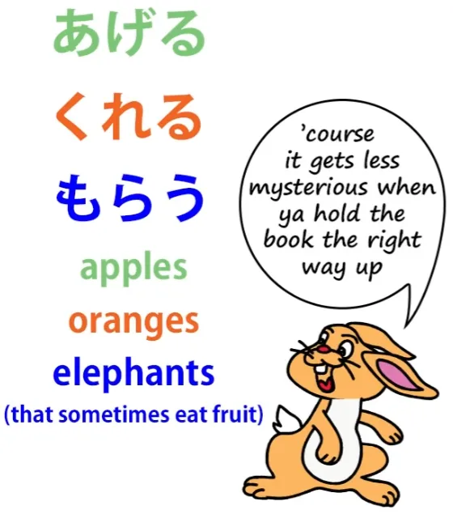
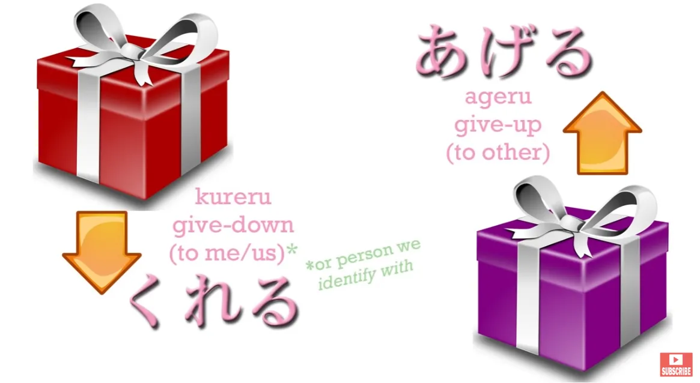
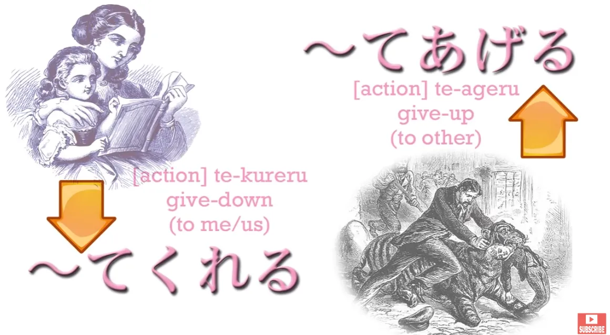
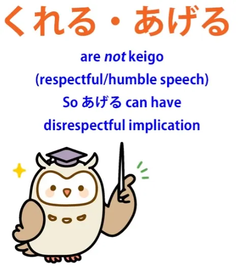
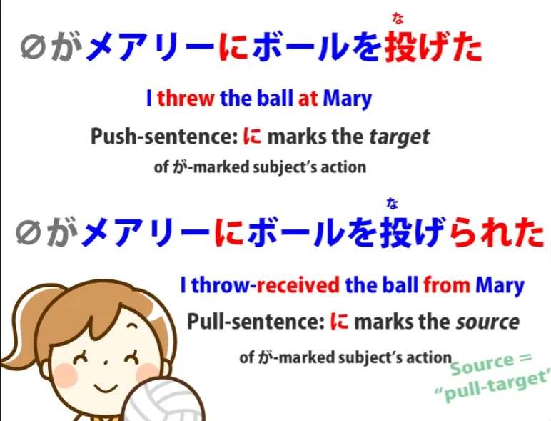
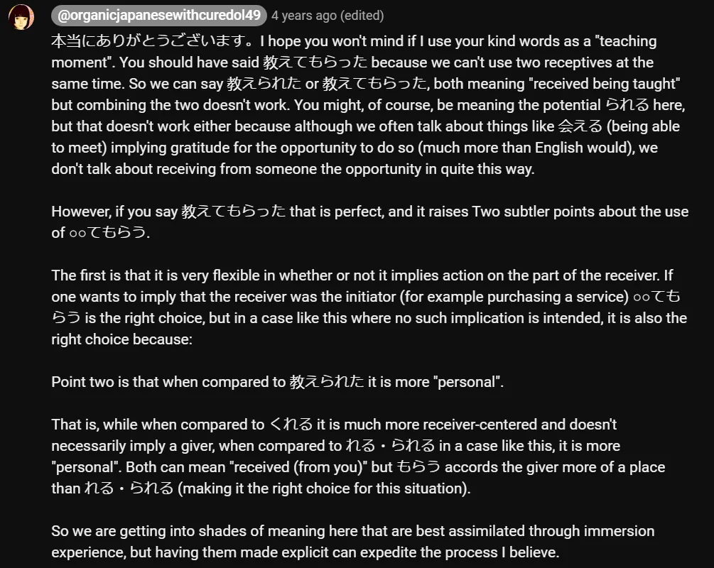

# **49. Mengurai Sudut Pandang Jepang! - もらう・てもらう**

[**Sudut Pandang Jepang Terjelaskan! - もらう・てもらう morau, te-morau | Pelajaran 49**](https://www.youtube.com/watch?v=CESFJaFp8FI&amp;list;=PLg9uYxuZf8x_A-vcqqyOFZu06WlhnypWj&amp;index;=51&amp;pp;=iAQB)

こんにちは。

Hari ini kita akan membahas sesuatu yang sering muncul dalam berbagai bentuk dalam bahasa Jepang dan menimbulkan banyak kebingungan karena cara pengajarannya yang agak aneh dalam buku-buku tata bahasa Jepang konvensional えいほんご / berbahasa Inggris. Dan ini adalah kata <code>もらう</code>, yang digunakan dalam berbagai konteks berbeda dan bisa sangat membingungkan serta sulit bagi pelajar untuk memahami apa yang sebenarnya terjadi dalam kalimat-kalimat ini.

Nah, salah satu alasan mengapa hal ini begitu membingungkan adalah karena <code>もらう</code> biasanya digabungkan dengan <code>くれる</code> dan <code>あげる</code> seolah-olah ketiganya saling terkait dan berfungsi dengan cara yang sama. Dan sampai batas tertentu hal ini benar. Namun, menangani ketiganya dengan cara ini sebenarnya lebih membingungkan daripada membantu.

Beberapa waktu lalu saya membahas <code>くれる</code> dan <code>あげる</code>[[11]](./11-compound-sentences- くれる - あげる -and-more-uses-of-the- て -form.md) dan pada saat itu saya secara khusus tidak menyertakan <code>もらう</code> karena saya percaya bahwa mengajarkannya secara bersamaan dengan cara yang umum dilakukan akan menimbulkan banyak kebingungan yang tidak perlu. Saya hanya akan membahas secara singkat <code>くれる</code> dan <code>あげる</code> sekarang, dan kita akan membahas cara-cara di mana keduanya serupa <code>もらう</code>, serta hal-hal yang jauh lebih penting yang membuat keduanya tidak serupa <code>もらう</code>, serta apa yang sebenarnya harus kita bandingkan <code>もらう</code> , yang akan membuatnya jauh lebih mudah untuk memahami berbagai macam ungkapan dan kalimat dalam bahasa Jepang.

Jadi, seperti yang kita ketahui, <code>あげる</code> dan <code>くれる</code> berarti masing-masing <code>give up</code> kepada orang lain atau orang lain <code>giving down</code> kepada diri sendiri atau kepada kelompok sendiri atau seseorang yang diidentifikasikan dengan diri sendiri.

Istilah ini dapat merujuk pada pemberian benda nyata, hadiah, atau sesuatu, atau dapat merujuk pada pemberian tindakan, melakukan tindakan demi kepentingan orang lain atau orang lain melakukan tindakan demi kepentingan diri sendiri.

Dan sebelum kita melanjutkan dari sana, saya hanya ingin menekankan satu hal kecil yang kadang-kadang disalahpahami, yaitu bahwa meskipun &quot;memberikan ke atas&quot; dan &quot;memberikan ke bawah&quot; pada awalnya bersifat hormat—menganggap orang lain lebih tinggi daripada diri sendiri, seolah-olah—asal usul ini begitu tua sehingga hampir terlupakan. Jadi, dalam arti tertentu, meskipun asal-usulnya bersifat hormat, kita dapat memandangnya secara lebih netral, mirip dengan &quot;mengunggah&quot; dan &quot;mengunduh&quot;, di mana &quot;mengunduh&quot; berarti ke arah diri sendiri, sedangkan &quot;mengunggah&quot; berarti ke arah orang lain.

Dan alasannya adalah bahwa <code>あげる</code> sebenarnya bukanlah ungkapan hormat dan **umumnya dianggap tidak sopan jika Anda menggunakannya kepada atasan saat membicarakan suatu tindakan**, karena <code>してあげる</code> berarti <code>doing for the benefit of (someone else)</code>, pada dasarnya berarti membantu seseorang.

**Jadi, jika Anda berbicara kepada atasan dengan cara yang menyiratkan bahwa Anda sedang membantu mereka,** **hal ini akan menimbulkan ketidaknyamanan**, jadi kita sebaiknya tidak menganggap <code>あげる</code> dan <code>くれる</code> sebagai ungkapan hormat atau rendah hati. **Keduanya bukan ungkapan hormat (けいご) atau rendah hati (敬語).**

**<code>くれる</code> dapat menyiratkan rasa syukur tetapi tidak menyiratkan kerendahan hati.** **Dan <code>あげる</code> tidak menyiratkan penghormatan kepada orang yang dituju.** Baiklah. Sekarang mari kita lanjutkan ke <code>もらう</code>.
::: info
Kanji-nya adalah <code>貰う</code>. Beberapa teks menggunakannya.
:::

## もらう・てもらう

Kesamaannya dengan yang lain hanyalah bahwa kata ini memang mewakili <code>downloading</code>. Dan meskipun <code>くれる</code> adalah, seolah-olah, sebuah <code>push</code> unduhan — orang lain yang mengambil inisiatif untuk mengunduhkannya kepada Anda, <code>もらう</code> lebih mirip <code>pull</code> unduhan.

Dan di situlah kesamaannya berakhir, karena <code>もらう</code> bekerja dalam banyak hal sangat berbeda dari <code>くれる</code> dan <code>あげる</code> dan jauh lebih mirip dengan hal lain, yang akan kita bahas sebentar lagi. Ketika Anda menggunakan <code>もらう&#x27; with a noun — </code>&quot;menerima sesuatu&quot; — **hal itu tidak selalu mengimplikasikan pemberi tertentu sama sekali.**

Jika kita mengatakan <code> *(zeroが)* 一万円をもらった</code>, kita berarti <code>I got ten thousand yen</code>. Implikasinya adalah hal itu berasal dari suatu tempat, mungkin diberikan oleh seseorang, atau setidaknya datang dengan sangat mudah. **Namun, kita tidak mengatakan apa pun tentang siapa yang memberikannya kepada kita atau dari mana asalnya atau bagaimana semua itu terjadi,** **tidak seperti <code>くれる</code> dan <code>あげる</code>, yang terikat pada pemberi dan penerima tertentu.**

---

Sekarang, ketika kita menggunakannya dengan *kata kerja*, <code>もらう</code> kontrasnya sangat kuat dengan <code>くれる</code> karena <code>くれる</code> menyiratkan bahwa pemberi yang mengambil inisiatif, sedangkan <code>もらう</code>, karena penekanan ada pada penerima, menyiratkan bahwa *penerima* yang mengambil inisiatif. Kadang-kadang diterjemahkan sebagai <code>I got (someone) to do (something)</code>, dan itu bukanlah terjemahan yang buruk dalam beberapa kasus.

Ini juga dapat merujuk pada mendapatkan layanan, yang tentu saja Anda yang mengambil inisiatif, Anda membayarnya, hal-hal semacam itu. Dan saya akan membahasnya sebentar lagi. Perhatikan bahwa jika pemberi tidak disebutkan, maka tidak ada pemberi yang secara otomatis tersirat.

Ketika pemberi disebutkan, pemberi tersebut ditandai dengan kata bantu &quot;に&quot;. Sekarang, ini persis sama dengan kata bantu penerima <code>-れる/-られる</code> karena <code>もらう</code>, seperti <code>-れる/-られる</code> (bentuk reseptif, yang disebut bentuk pasif, yang sebenarnya sama sekali bukan pasif), keduanya sebenarnya berkaitan dengan menerima, bukan? Jadi, keduanya adalah apa yang bisa kita sebut kalimat tarik, bukan kalimat dorong.

Dalam kalimat dorong, kata ganti objek (に) menandai objek tidak langsung, penerima akhir dari tindakan tersebut. Jadi, jika kita mengatakan <code>メアリーにボールを投げた</code>, kita berarti mengatakan <code>I threw the ball at Mary</code>. Bola adalah objek **langsung** (yang saya lempar). Mary adalah objek **tidak langsung** (penerima akhir dari tindakan tersebut).

Dalam kalimat tarik (pull-sentence), di mana penerima ditandai dengan kata ganti tak langsung (が), maka penggerak yang ditandai dengan kata ganti langsung (に) adalah pemberi akhir, sumber akhir dari tindakan tersebut. Jadi, sebenarnya jauh lebih berguna untuk membandingkan <code>もらう</code> dengan <code>-れる/-られる</code>, kata kerja bantu penerima, karena fungsinya hampir persis sama.

Kata kerja ini mengambil sebuah kata kerja, lalu menambahkan kata kerja bantu lain padanya yang memberi tahu kita bahwa tindakan tersebut sedang diterima dan penggerak kalimat sedang melakukan tindakan menerima tindakan dari orang lain. Dan kesamaan ini, kemiripan ini, antara <code>もらう</code> dan <code>-れる/-</code>られる<code></code> tidak ditunjukkan oleh tata bahasa Jepang konvensional, meskipun itu sejauh ini merupakan cara terbaik untuk memahaminya, karena tentu saja mereka memperumit seluruh masalah dengan menyebut kata bantu reseptif <code>-れる/-られる</code> bantu <code>passive</code>.

Ini bukan pasif, **ini reseptif, sama seperti *<code>もらう</code>****.*

::: info
Ngomong-ngomong, kamu tidak bisa menggunakan kedua bentuk reseptif ini sekaligus. Dolly menjelaskannya di* [**komentar**](https://www.youtube.com/watch?v=CESFJaFp8FI&amp;lc;=UgwTi3XYA1fzqe30n-14AaABAg.8x4VnfQdsss8x57oxMYR66&amp;ab;_channel=OrganicJapanesewithCureDolly).

:::

Dan keduanya bekerja dengan cara yang sangat mirip. Perbedaan di antara keduanya adalah bahwa <code>-れる/-</code>られる<code></code> menyiratkan bahwa tindakan itu kebetulan terjadi pada kita. Kita mungkin menginginkannya atau mungkin tidak, tetapi itu bukanlah perbuatan kita sebenarnya.

<code>もらう</code> menunjukkan bahwa kita yang melakukan tindakan tersebut, bahwa kita secara aktif membawa tindakan tersebut kepada diri kita sendiri dari orang lain; kita membuat mereka melakukannya untuk kita. Jadi, mari kita bahas tentang menerima layanan.

Ungkapan yang sangat, sangat umum adalah <code>(zeroが)お医者さんに見てもらう</code> yang diterjemahkan dalam kamus dan buku tata bahasa Inggris sebagai <code>see a doctor</code>. Dan ini adalah terjemahan yang sangat, sangat, sangat, tidak bertanggung jawab.

Saya tidak tahu persis mengapa mereka melakukan ini. Saya pikir itu karena mereka merasa bahwa kemiripan dengan ungkapan bahasa Inggris yang umum membuatnya lebih mudah. Itu tidak membuatnya lebih mudah, justru membuatnya jauh lebih sulit, karena hal itu membingungkan seluruh persepsi Anda tentang apa yang sedang terjadi di sini.

<code>お医者さんに見てもらう</code> tidak berarti <code>I will see a doctor</code>; itu berarti <code>I will have a doctor see me / I will get examined by a doctor</code>. Sekarang, kita bisa melihat ini jauh lebih jelas jika kita berbicara tentang tata rambut atau potong rambut.

<code>さんぱつ/散髪</code> berarti <code>hairdressing</code> atau <code>haircut</code>. Dan jika kita mengatakan <code>散髪をしてもらう</code>, kita berarti <code>have someone cut my hair</code>.

<code>お医者さんに見てもらう</code> — <code>have a doctor look at me / examine me</code>. Jadi, Anda bisa melihat bahwa keduanya bekerja dengan cara yang persis sama.

Dan kita juga bisa melihat bahwa sementara dengan <code>お医者さん</code> kita menentukan pemberi, dengan <code>散髪をしてもらう</code> — <code>get one&#x27;s hair cut</code> — kita tidak menentukan penggerak tertentu. Seseorang mungkin berkata <code>散髪をしてもらったほうがいい</code> — <code>you should get your hair cut</code> — tetapi itu tidak menyebutkan siapa yang melakukannya. Itu tidak menyebutkan apakah mereka ingin Anda pergi ke penata rambut atau meminta kakak perempuan Anda untuk melakukannya, itu tidak masalah.

Hanya <code>get someone to cut your hair</code>. Dan ini mengarah ke poin penting lainnya, yaitu bahwa penggerak dari <code>もらう</code>, orang <code>もらう</code>yang melakukan, tidak haruslah si pembicara.

Dan dengan membandingkannya dengan <code>くれる</code> banyak orang menjadi sangat bingung dengan hal ini dan mereka menjadi sangat kebingungan ketika melihat seseorang merujuk pada orang lain selain diri mereka sendiri <code>もらう</code>. Namun, tidak ada aturan yang melarang hal ini sama sekali.

Anda tidak boleh menggunakan <code>くれる</code> untuk seseorang yang bukan diri Anda sendiri atau anggota kelompok dalam Anda, atau, misalnya dalam sebuah novel, bisa jadi seorang karakter karena penulis diperbolehkan berada di dalam pikiran karakter tersebut. Jadi <code>くれる</code> terikat pada seseorang atau kelompok dalam, tetapi <code>もらう</code> tidak.

Kita bisa dengan bebas membicarakan orang lain <code>もらう</code>-ing, menerima sesuatu. Sekarang, area penting lainnya yang sangat membingungkan orang, tetapi kita siap mengatasinya sekarang, adalah <code>させてもらう</code>, yaitu kombinasi kata kerja bantu kausatif dengan <code>もらう</code>, dan kita sekarang sudah cukup memahami logikanya <code>もらう</code> untuk mengatasinya, tetapi kita perlu belajar sedikit lebih banyak tentang logika kata kerja bantu kausatif <code>-せる/-させる</code>...
