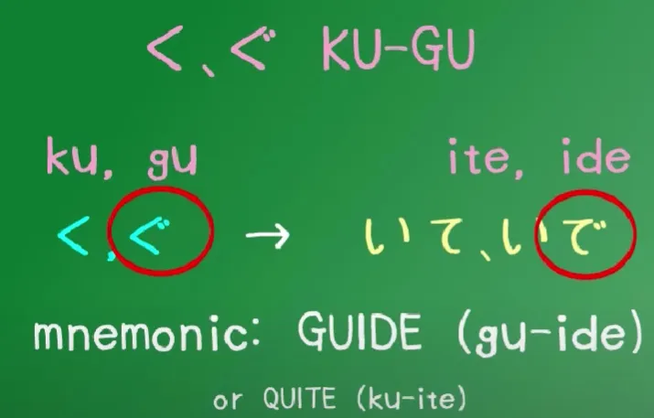
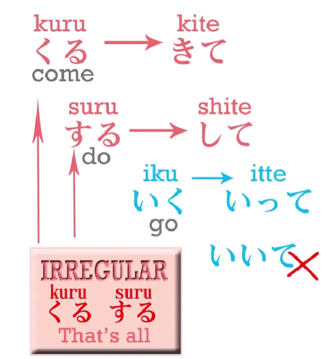

# **5. Kelompok Kata Kerja dan Bentuk-te**

[**Pelajaran 5: Kelompok kata kerja dalam bahasa Jepang dan Bentuk-te. Kelompok kata kerja 1, 2, dan 3 dijelaskan dengan mudah. Bahasa Jepang Organik**](https://www.youtube.com/watch?v=GzEVLMDC8nw&list=PLg9uYxuZf8x_A-vcqqyOFZu06WlhnypWj&index=5)

こんにちは。

Hari ini kita akan membahas tentang kelompok kata kerja dalam bahasa Jepang. Kata kerja dalam bahasa Jepang terbagi menjadi tiga kelompok utama. Sebenarnya, pembagian kelompok ini tidak terlalu penting untuk dihafalkan *kecuali* saat kita ingin mengubah bentuk kata kerjanya. Namun, karena ke depannya kita akan sangat sering melakukan perubahan bentuk kata kerja, maka sangat krusial bagi kita untuk memahami ketiga kelompok ini sejak awal.

## Kata Kerja Ichidan

Kelompok pertama dari kata kerja dalam bahasa Jepang disebut sebagai kata kerja *ichidan* atau kata kerja satu tingkat (`one-level verbs`). Beberapa sumber atau buku teks menyebutnya sebagai `る-verbs` (kata kerja -ru). Jujur saja, itu adalah penamaan yang sangat konyol. Jika ingin menggunakan istilah semacam itu, mungkin lebih tepat jika kita menyebutnya sebagai `いる/える verbs`. 

Kata kerja Ichidan ini adalah jenis kata kerja yang polanya paling sederhana dan paling dasar.

Setiap kali kita ingin mengubah bentuk kata kerjanya (ke bentuk apa pun), polanya akan selalu sama. **Yang perlu kita lakukan hanyalah mencopot akhiran -る di belakangnya, lalu menempelkan elemen baru apa pun yang ingin kita tambahkan.** 

Kata kerja Ichidan itu sangat spesifik: ia HANYA BISA memiliki akhiran dengan bunyi -いる (iru) atau -える (eru). Artinya, huruf terakhir sebelum る pasti merupakan salah satu *kana* (huruf) dari baris い (i) atau baris え (e).

## Kata kerja Godan

Kelompok kedua ini adalah kelompok kata kerja yang anggotanya paling masif. **Semua jenis huruf akhiran yang mungkin dimiliki oleh sebuah kata kerja dalam bahasa Jepang, bisa kamu temukan di dalam kelompok ini.**

Aturan dasar: semua kata kerja bentuk kamus pasti berakhiran dengan huruf berbunyi "う" (u). Tidak semua huruf berbunyi "う" bisa menjadi akhiran kata kerja, tetapi sebagian besar dari mereka bisa, dan semuanya itu membentuk keluarga kata kerja Godan. 

Kata kerja jenis ini disebut kata kerja *godan* atau kata kerja lima tingkat (`five-level verbs`). Alasannya akan segera kita bahas di bawah. Seperti yang saya katakan, **mereka bisa berakhiran dengan bunyi "う" apa pun, dan terkadang hal itu termasuk bunyi -いる atau -える.** Berbeda secara eksklusif dengan kelompok Ichidan tadi, kelompok Godan **juga memiliki anggota yang berakhiran -おる (oru), -ある (aru), atau -うる (uru).**

Nah, satu-satunya momen di mana kita mungkin merasa kebingungan atau mengalami ambiguitas adalah ketika kita menjumpai sebuah kata kerja yang berakhiran -いる atau -える. Memang, mayoritas dari mereka adalah kelompok Ichidan. Tetapi, ada sebagian kecil dari mereka yang ternyata adalah kelompok Godan yang secara kebetulan berakhiran -いる atau -える. 

Membedakan keduanya tidak sesulit yang kamu bayangkan. Saya sudah membuat satu [**video khusus**](https://www.youtube.com/watch?v=VDmaSJ4s6Qo) yang membahas cara membedakannya, meskipun materinya mungkin sedikit lebih *advanced* untuk tahap kita sekarang.

## Kata Kerja Tidak Beraturan (*Irregular*)

Kelompok ketiga dan yang terakhir adalah kata kerja tidak beraturan. Kabar baiknya: di bahasa Jepang, anggotanya cuma ada DUA!

Kamu ingat betapa tebalnya halaman yang berisi daftar panjang kata kerja *irregular* di buku teks bahasa Spanyol, Prancis, atau bahasa Inggris? Bahasa Jepang sungguh berbaik hati karena hanya memiliki dua buah kata kerja tak beraturan. (Memang ada beberapa kata kerja lain yang sifatnya sedikit *irregular* dalam kasus-kasus sangat kecil, tapi jumlahnya pun sangat minim).

**Dua kata kerja *irregular* utama tersebut adalah: くる (datang) dan する (melakukan).**

## Pembentukan Bentuk -て (*Te-form*)

Nah, sekarang setelah kita mengenal ketiga kelompok tersebut, kita akan membedah bagaimana cara mengubahnya menjadi bentuk `-て` (te) dan `-た` (ta). Seperti yang sudah saya jelaskan di pelajaran sebelumnya[[4]](./4-japanese-verb-tenses.md), kita sangat membutuhkan kedua bentuk ini untuk bisa merakit kalimat masa kini berkelanjutan (*present continuous*) dan kalimat masa lalu (*past tense*). Terlebih lagi, bentuk `-て` ini juga akan memiliki segudang kegunaan vital lainnya seiring progres kita belajar.

Sesuai dengan janji saya minggu lalu: kelompok kata kerja Ichidan selalu paling gampang. **Kamu tidak perlu pusing memikirkan apa pun. Cukup buang akhiran -る nya, lalu tempelkan akhiran yang kamu butuhkan (dalam hal ini, huruf て atau た).**

Lalu bagaimana dengan kelompok Godan? Sesuai dengan namanya (五段 / ごだん, alias lima tingkat), mereka terbagi lagi menjadi lima sub-kelompok berdasarkan pola akhirannya. Saya sudah pernah membuat video terpisah mengenai hal ini beberapa waktu lalu. Jadi untuk bagian ini, saya akan menyisipkan klip dari video lawas tersebut karena penjelasannya sudah sangat gamblang.

*(Klip video diputar)*

Kelompok Godan memiliki lima jenis variasi akhiran yang mungkin terjadi—itulah alasan mengapa mereka dijuluki kata kerja lima tingkat (*five-level verbs*).

Sekilas, kelima variasi ini mungkin terlihat mengintimidasi. Padahal sebenarnya tidak sama sekali. Kita bisa langsung menyederhanakan dua tingkat di antaranya dan menggabungkannya menjadi satu, karena polanya sangat identik sehingga kamu cuma perlu menghafalnya satu kali. Mari kita bedah kelompok-kelompok utama ini.

### Kelompok Godan Pertama (UTSURU)

Kelompok pertama ini saya beri nama: kata kerja **UTSURU (うつる)**. Kenapa? Karena anggotanya adalah kata kerja yang berakhiran dengan huruf **-う (u), -つ (tsu), dan -る (ru)**. 

Fakta menarik: Kosakata "うつる" itu sendiri di dalam bahasa Jepang berarti 'berpindah dari satu hal ke hal lain'. Ini adalah momen yang tepat untuk menghafalnya, karena makna kata tersebut mewakili persis apa yang sedang kita lakukan sekarang—memindahkan bentuk kata kerja dari satu wujud ke wujud lainnya!

Semua kata kerja yang berakhiran -う, -つ, dan -る memiliki nasib yang sama saat berubah menjadi bentuk `-て`. **Caranya: kita penggal huruf -う, -つ, atau -る tersebut, lalu menggantikannya dengan sebuah huruf `っ` (tsu) kecil yang diikuti dengan `て` (atau `た` jika untuk bentuk lampau).**

Contohnya:
- わら**う** (tertawa) menjadi わら**って** (Waratte).
- も**つ** (memegang) menjadi も**って** (Motte).
- と**る** (mengambil) menjadi と**って** (Totte).

Sekarang, coba kamu perhatikan baik-baik. Kata うつる secara harfiah memiliki huruf つ di tengah-tengahnya, bukan?

Dan bentuk `て` dari kelompok kata kerja UTSURU ini juga dibentuk dengan menyematkan huruf `っ` (tsu) kecil. **Ini adalah satu-satunya kelompok yang memiliki komponen berbunyi 'tsu' di dalamnya, sekaligus merupakan satu-satunya kelompok yang menghasilkan 'tsu' kecil pada akhiran bentuk て-nya.**

Jadi, ini harusnya sangat mudah untuk dihafal.

::: tip
Untuk mengetik huruf `っ` (tsu) kecil di *keyboard*, kamu cukup mengetik dua huruf konsonan ganda, seperti `tta` (untuk った) atau `tte` (untuk って). Atau, kamu juga bisa memakai cara manual dengan mengetik `x` diikuti `tsu` (xtsu).
Trik awalan huruf `x` ini juga berlaku kalau kamu ingin membuat huruf vokal kecil `あ, い, う, え, お` menjadi ぁ (`xa`), ぃ (`xi`), dst.
Penting: Untuk mengetik づ gunakan `du`, dan untuk ぢ gunakan `di`. (Ini berbeda dengan kana netral ず `zu` dan じ `ji`). Oh ya, untuk mengetik huruf tunggal ん, cukup tekan `nn`.
:::

### Kelompok Godan Kedua (NEW BOOM)

Kelompok yang kedua ini saya sebut sebagai kelompok **NEW BOOM**. Di bahasa Jepang, kalau ada tren baru yang lagi *booming* atau populer banget, mereka menyerap kata bahasa Inggris itu menjadi ブーム (BUUMU). Sebuah New Buumu!

Kenapa saya kasih nama New Boom? Karena saya tidak menemukan ada kosakata asli bahasa Jepang yang tersusun dari gabungan huruf **ぬ (nu), ぶ (bu), dan む (mu)**. Dan hal utama yang ingin saya tekankan mengenai anggota kelompok ini adalah: **mereka semua berakhiran dengan apa yang saya sebut sebagai "bunyi tumpul" (*blunt sounds*) — yaitu ぬ, ぶ, dan む.**

Ini bukanlah bunyi "tajam" seperti す, つ, く. Ini juga bukan bunyi "netral" seperti る atau う. Ini adalah bunyi yang tumpul (Nu, Bu, Mu). Identifikasi ini penting, karena suara perubahan akhirnya nanti juga akan menjadi "tumpul". **Untuk kelompok ini, akhiran bentuk `-て`-nya akan berubah menjadi `-んで` (nde), sedangkan bentuk `-た`-nya menjadi `-んだ` (nda).**

Contohnya:
- し**ぬ** (kata kerja berakhiran -ぬ) menjadi し**んで** (shinde) / し**んだ** (shinda).
- の**む** (minum) menjadi の**んで** (nonde) / の**んだ** (nonda).
- あそ**ぶ** (bermain) menjadi あそ**んで** (asonde) / あそ**んだ** (asonda).

Itulah dia si kelompok New Boom, kumpulan kata kerja dengan akhiran bersuara datar/tumpul. Karena jumlah kombinasi huruf kana untuk akhiran kata kerja itu sangat terbatas, maka aturan kelompok New Boom ini secara otomatis mencakup SEMUA sisa bunyi tumpul yang ada... **kecuali ぐ (Gu).** 

Huruf 'gu' punya nasib sendiri, dan kita akan membahasnya sekarang.

### Kelompok Godan Ketiga & Keempat (KU & GU)

Tadi di awal saya sempat berjanji bahwa ada dua kelompok yang bisa kita gabungkan menjadi satu. Inilah mereka: kelompok berakhiran **"く" (ku)** dan **"ぐ" (gu)**. 

**Untuk mengubah kata kerja berakhiran "く", kita cukup memotong "く"-nya dan menambahkan "いて" (ite). Jika untuk bentuk lampau, tambahkan "いた" (ita).**

Contoh: 
- ある**く** (berjalan) menjadi ある**いて** (aruite) / ある**いた** (aruita).

Lalu bagaimana dengan "ぐ"? Seperti yang kamu tahu, "ぐ" hanyalah huruf "く" yang diberi tambahan *ten-ten* (tanda kutip `〃` di atas huruf). Karena asalnya sama, maka **proses perubahannya pun sama persis. Bedanya, hasil akhirnya (*ite / ita*) juga harus ikut dipasangkan *ten-ten* (menjadi *ide / ida*).**

Contoh:
- ある**く** menjadi ある**いて** (aruite).
- およ**ぐ** (berenang) menjadi およ**いで** (oyoide).

Kamu bisa melihat kan kalau keduanya secara logika nyaris identik? Aturannya simpel: Jika kata kerja aslinya membawa *ten-ten*, maka hasil akhirnya di bentuk `-て` juga harus mewarisi *ten-ten* tersebut. あるく -> あるいて; およぐ -> およいで.

### Kelompok Godan Kelima (SU)

Tinggal satu kelompok terakhir yang belum kita bahas, yaitu kelompok berakhiran **す (su)**. 

**Untuk kata kerja berakhiran -す, hilangkan -す nya, dan tambahkan -して (shite).**
Kalau kamu rajin menyimak di pelajaran sebelumnya, kamu pasti menyadari satu hal. Logika perubahan ini sebenarnya sama persis dengan aturan dasar kita: kita cuma menggeser huruf 'su' tersebut menjadi padanan hurufnya di baris `い` (i), yaitu 'shi' (し).

Contoh:
- はな**す** (berbicara) menjadi はな**して** (hanashite).
- Kata bantu **ます** (masu) — yang berfungsi membuat sebuah kata kerja menjadi formal/sopan — dalam bentuk lampaunya otomatis berubah menjadi **ました** (mashita).

::: info
Setiap kali Dolly menggunakan istilah `formal` untuk merujuk pada pemakaian "です" atau "ます", istilah itu sebenarnya lebih pas diganti dengan kata `POLITE` (Sopan/Halus). Ada perbedaan fungsi antara kedua istilah linguistik tersebut dalam bahasa Jepang. Entah kenapa Dolly tidak menyinggung pembedaan ini, padahal ini cukup krusial. Jika kamu mengecek kamus, kata-kata ini selalu ditandai dengan label "polite". **Keduanya adalah elemen dari bahasa sopan (丁寧語 / Teineigo). Jadi, akan jauh lebih akurat jika kita mulai menyebutnya sebagai "bentuk sopan".**
:::

*(Klip video lawas selesai)*

Nah, sampai di sini kita sudah berhasil membedah seluruh keluarga kata kerja Godan! Oh ya, bukankah saya terlihat jauh lebih muda di klip video lawas itu?

### Pengecualian (Irregular)

Sebagai penutup, kita akan melihat kasus-kasus pengecualiannya. Tenang saja, **kasus pengecualian ini jumlahnya cuma TIGA: dua berasal dari daftar kata kerja tidak beraturan (*irregular*) yang kita bahas di awal tadi, dan satu lagi adalah sebuah kata kerja kecil.**

Perubahannya juga sangat simpel dan langsung dihafal saja:
1. **くる** (datang) menjadi **きて** (kite).
2. **する** (melakukan) menjadi **して** (shite).
3. **いく** (pergi) — karena kata ini berakhiran -く, menurut rumus Ku & Gu tadi kamu mungkin berekspektasi perubahannya menjadi *いいて* (iite). Tapi ternyata tidak, ia sedikit membelot dari aturan dan berubah menjadi **いって** (itte).

Dan selesai! Itulah satu-satunya pengecualian yang harus kamu ingat. Jadi, jika kamu memutar ulang dan mencerna pelajaran ini beberapa kali, saya berani jamin kamu akan dengan mudah merakit bentuk `-て` dan `-た` dalam situasi apa pun!
