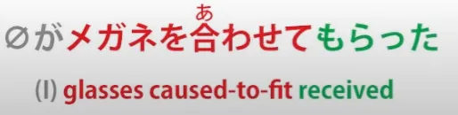
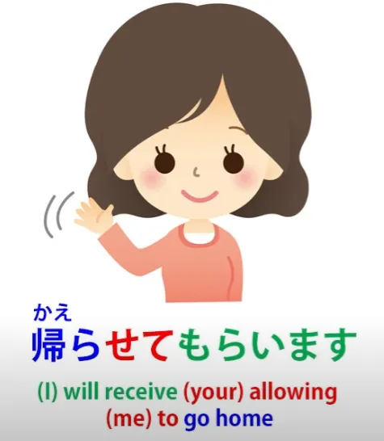

# **50. 2 Aspek Bahasa Jepang yang Sulit Dipahami Orang Asing: させてもらう Rahasia Terakhir Potensi**

[**2 Aspek Bahasa Jepang yang Sulit Dipahami Orang Asing: させてもらう Rahasia Terakhir dari Potensi | Pelajaran 50**](https://www.youtube.com/watch?v=r2j1o9wj2oA&amp;list;=PLg9uYxuZf8x_A-vcqqyOFZu06WlhnypWj&amp;index;=52&amp;pp;=iAQB)

こんにちは。

Hari ini kita akan membahas berbagai macam ungkapan dalam bahasa Jepang yang sering menimbulkan kesulitan dan kebingungan bagi pelajar asing. Minggu lalu kita membahas penggunaan <code>もらう</code> bentuk &quot;て&quot;, yaitu <code>〇〇てもらう</code>, yang juga sering menimbulkan kebingungan dan terasa sangat tidak intuitif bagi penutur asing bahasa Jepang, meskipun begitu setelah kita memahami bagaimana strukturnya sebenarnya, hal itu sebenarnya sangat intuitif. Jadi, berdasarkan hal tersebut, kita kemudian menemukan banyak ungkapan yang menggabungkan bentuk て + <code>もらう</code> dengan kata kerja bantu kausatif <code>-せる/-させる</code>, sehingga kita mendapatkan <code>させてもらう</code>.

Dan ini benar-benar terlalu rumit bagi banyak pelajar asing karena tampak sangat berbelit-belit. Namun, begitu kita memahami bagaimana <code>もらう</code> bekerja dengan bentuk &quot;て&quot;, semuanya sebenarnya cukup logis, kecuali fakta bahwa kita juga harus memahami fakta penting tentang kata bantu kausatif <code>-せる/-させる</code>. Nah, saya sudah membuat satu pelajaran lengkap tentang hal ini[[19]](./19-causative-causative-receptive.md) dan kita sudah membahas sebagian besar aspeknya yang menyulitkan pelajar asing. Namun, ada satu bagian yang tidak saya bahas karena saat itu tidak terlalu relevan, jadi kita akan membahasnya sekarang.

Seperti yang saya katakan saat itu, kata kerja bantu kausatif, untuk sekali ini, dinamai dengan sangat tepat dalam tata bahasa Jepang berbahasa Inggris karena memang itulah fungsinya — yaitu bentuk kausatif. Jadi, ketika kita menggabungkannya dengan kata kerja lain, yang kita maksudkan adalah <code>cause someone to do that verb</code>. Nah, satu hal yang membingungkan penutur bahasa Inggris adalah bahwa kata kerja ini bisa berarti <code>allow someone to do it</code> atau <code>make or compel someone to do it</code>, dan kata kerja kausatif itu sendiri tidak membedakan keduanya.

Hal itu membingungkan penutur bahasa Inggris karena bahasa Inggris memang membedakannya. Kita mengatakan <code>make someone do something</code> atau <code>let someone do something</code>; kita tidak mengatakan <code>cause someone to do something</code>. Hal yang harus kita pahami sekarang adalah bahwa kata kerja kausatif dalam bahasa Jepang dapat berarti <code>make</code>, bisa berarti <code>allow</code>, tetapi tidak harus berarti salah satunya.

Artinya persis seperti yang tertulis di kemasannya. Artinya <code>*cause — by any means*</code>, tidak menentukan cara apa yang kita gunakan untuk membuat seseorang melakukan sesuatu. Dan hal ini membingungkan penutur bahasa Inggris karena mereka tidak memiliki cara untuk mengatakannya.

Anda tidak benar-benar bisa mengatakan <code>cause someone to do something</code>, setidaknya tidak dalam bahasa Inggris modern. Dan sebenarnya bahasa Inggris terkadang merasakan kehilangan ini dan harus mengatasinya dengan &quot;bermain curang&quot; menggunakan apa yang dimilikinya. Jadi, contohnya adalah ketika kita mengatakan <code>Would you let me know tomorrow?</code> atau <code>I&#x27;ll let you know tomorrow</code>.

Kita sebenarnya tidak bermaksud <code>let you know</code> atau <code>let me know</code>. Yang kita maksud adalah <code>cause me to know</code>. Kita tidak bermaksud <code>allow me to know</code>; kami tidak bermaksud <code>force me to know</code>. Yang kami maksud adalah <code>cause me to know</code>.

Tetapi karena kami tidak memiliki ungkapan ini <code>cause someone to do something</code> dalam bahasa Inggris modern, kami sebenarnya harus &quot;berbohong&quot; dan mengatakan <code>let me know</code>, yang sebenarnya bukan maksud kita. Dalam bahasa Jepang, tentu saja, kita menggunakan bentuk causative untuk ini.

Jadi, <code>知る</code> adalah <code>know</code> dan <code>知らせる</code> adalah <code>cause someone to know</code>.

Jadi, pada dasarnya ini melakukan apa yang <code>let me know</code> lakukan, tanpa harus memaksa tata bahasa untuk melakukannya seperti yang dilakukan bahasa Inggris. Dan bentuk kausatif ini dapat digunakan dalam banyak cara lain yang tidak berarti <code>make</code> atau <code>allow</code>. Jadi <code>聞く</code>, misalnya, adalah <code>hear</code>; jadi <code>聞かせる</code> berarti <code>cause to hear</code>.

Dan kita mungkin mengatakan <code>後で聞かせよう</code>, yang berarti &quot;Aku akan memberitahumu besok *(nanti)* / besok aku akan membuatmu mendengarnya / besok aku akan memberimu semua informasi&quot;.

Dan kita bisa menggabungkannya dengan kata-kata lain, sehingga kita bisa mendapatkan sesuatu seperti <code>読み聞かせる</code>, yang berarti <code>read and cause to hear</code>/*membaca-menyebabkan-mendengar*.

Dan inilah yang kita katakan jika kita membacakan cerita kepada seseorang, membacakan surat kepada seseorang, atau hal-hal semacam itu: <code>読み聞かせる</code> Dan begitu kita memahami cara kerja kata bantu kausatif ini, kita bisa melihat bagaimana kata tersebut dibentuk menjadi て agar memiliki <code>もらう</code> ditambahkan padanya. Misalnya, kita mungkin mengatakan <code>聞かせてもらえますか</code>, yang berarti <code>Can you tell me?</code>

<code>聞かせて</code> — <code>cause me to hear</code>; <code>もらえる</code>, yang merupakan bentuk potensial dari <code>もらう</code>, dengan kata lain <code>possible to receive</code>.

<code>Is it possible to receive you causing me to hear?</code> yang dalam bahasa Inggris, mungkin akan kita katakan <code>Can you tell me?</code> Jadi, ini <code>聞かせてもらえますか</code> mungkin tampak sangat membingungkan bagi penutur asing karena bukan seperti itu cara kita mengatakannya dalam bahasa Inggris, tetapi, seperti yang Anda lihat, secara struktural hal ini sangat jelas. Kalimat ini dibangun dari unsur-unsur yang sudah kita ketahui dan pahami, dan sangat masuk akal.

Kita bisa mengambil kalimat <code>学生でも下宿させてもらえませんか</code>. Dan ini cenderung diterjemahkan sebagai <code>Do you take in students?</code> Tetapi secara harfiah yang dimaksud adalah <code>Even if one is a student ...</code> — <code>学生でも</code> — <code>...is it not possible to receive being caused to lodge here?</code>

Itulah strukturnya, jadi ketika Anda melihat ini <code>学生でも下宿させてもらえませんか</code> dan Anda diberitahu bahwa artinya <code>Do you take in students?</code>, Anda bisa melihatnya dari segala sudut dan bertanya-tanya bagaimana kata-kata itu bisa berarti demikian. Dan tentu saja, kata-kata itu sebenarnya tidak benar-benar berarti demikian.

Itu hanya cara kita mengatakannya dalam bahasa Inggris. Dalam bahasa Jepang, kita mengatakan <code>Even if one is a student, is it not possible to receive being caused to lodge here?</code> Dan tidak harus selalu diri sendiri yang dipaksa melakukan sesuatu dalam kalimat-kalimat ini.

Misalnya, jika kita mengatakan <code> *(zeroが)* メガネを合わせてもらった</code>, ini diterjemahkan menjadi <code>I was fitted for glasses</code>, tetapi arti harfiahnya adalah <code>to receive the glasses being caused to fit</code>.

Jadi, kacamata itulah yang dipaksa. Mereka lah yang <code>させる</code>, tetapi saya lah yang menerima bahwa kacamata tersebut dipaksa agar pas. Jadi, tidak harus saya secara pribadi yang menerima tindakan dipaksa tersebut.

Saya bisa saja menerima sesuatu yang lain yang sedang dipengaruhi juga. Jadi, kita harus melihat kalimatnya dan memahami artinya, serta tentu saja menerapkan aturan yang kita bahas dalam pelajaran tentang mengatasi ambiguitas *[[48]](./48-dealing-with-ambiguity-in-japanese.md)* — kita melihat apa yang paling mungkin, dengan mengetahui bahwa jika sesuatu yang tidak mungkin sedang dikatakan, penutur harus menjelaskannya, sama seperti yang mereka lakukan dalam bahasa Inggris.

Sekarang, terkadang tentu saja itu sebenarnya bisa berarti <code>allow</code>, jadi misalnya jika kita mengatakan <code>帰らせてもらいます</code>, yang sebenarnya kita katakan secara harfiah adalah <code>I will receive your allowing me to go home</code>. Itulah arti harfiahnya.

Ini mirip dengan mengatakan dalam bahasa Inggris <code>With your permission, I&#x27;ll leave now</code>, yang bisa saja berarti <code>I&#x27;ll leave now, with or without your permission</code>, tetapi hal itu memberikan lapisan kesopanan tipis pada masalah tersebut. Dan apakah itu benar-benar sopan atau hanya memberi tahu seseorang bahwa Anda akan pergi dengan lapisan kesopanan tipis, ini adalah sesuatu yang jelas akan Anda pahami dari konteks dan intonasi suara, dsb., sama seperti yang Anda lakukan dalam bahasa Inggris.

Ada perbedaan yang cukup besar antara mengatakan &quot;Dengan izin Anda, saya akan pulang sekarang**** \[dengan lembut\] dan mengatakan &quot;Dengan izin Anda, saya akan pulang sekarang**** \[dengan kasar\] — dan hal itu sama saja dalam bahasa Jepang maupun bahasa Inggris. Jadi, seperti yang Anda lihat, ada banyak cara di mana elemen-elemen ini dapat digabungkan, tetapi jika kita memahami masing-masing elemen dan memahami bagaimana mereka saling bertautan, kita memiliki alat yang diperlukan untuk menyerap dari pengalaman langsung bagaimana hal-hal ini digunakan.

Ingat, *struktur tidak mengajarkan kita cara memahami bahasa Jepang.* **Struktur memberi kita alat dasar yang kita butuhkan untuk mempelajarinya dari satu-satunya tempat di mana Anda benar-benar dapat** **memahami cara kerja suatu bahasa** — yaitu **imersi langsung**.

---

Dan saya ingin menambahkan sebelum kita lanjut... Saya belum mengajarkan &quot;敬語&quot; / &quot;けいご&quot; pada tahap ini. &quot;敬語&quot; adalah bahasa Jepang yang sangat sopan, yang hampir seperti sub-bahasa tersendiri. Itu tidak terlalu sulit, tetapi akan membutuhkan beberapa pelajaran untuk mempelajarinya.

Namun, saya ingin menyebutkan di sini bahwa ada kata &quot;敬語&quot; untuk <code>もらう</code>. Dan itu adalah <code>頂く/いただく</code>. Karena sangat sopan, biasanya digunakan dalam bentuk &quot;ます&quot;, jadi biasanya <code>いただきます</code>. Dan tidak diragukan lagi Anda pasti sudah familiar dengan ungkapan ini sebagai sesuatu yang diucapkan orang sebelum makan: <code>いただきます!</code>

Namun arti harfiahnya adalah sesuatu seperti <code>I humbly receive</code>. Jelas artinya <code>I receive</code>, karena <code>いただく</code> berarti <code>もらう</code>, tetapi ini adalah bentuk dari &quot;敬語&quot; yang disebut <code>謙譲語/けんじょうご</code>atau <code>humble language</code>, jadi Anda mengatakan <code>I humbly receive</code>. Dan saya menyebutkan hal ini pada tahap ini karena Anda mungkin akan melihat beberapa bentuk <code>させてもらう</code>digunakan bersama <code>いただく</code>: <code>させていただきます</code> dll.

Dan potongan 敬語 ini bisa digunakan sedikit lebih sering daripada 敬語 biasa karena menambahkan kesopanan pada konsep <code>もらう</code>.

Jadi, terkadang jika ada risiko terdengar sedikit menuntut atau serakah dengan menyebutkan apa yang akan Anda terima atau apa yang ingin Anda terima, Anda bisa menggunakan <code>いただく</code> untuk meredam kesan tersebut dan menunjukkan bahwa Anda sebenarnya bersikap rendah hati dan sopan. Jadi, jika Anda melihat <code>いただく / いただきます</code> digunakan di salah satu tempat ini, artinya persis sama dengan <code>もらう</code>. Itu hanya memberikan sentuhan yang lebih sopan. Jadi, Anda tidak perlu bingung saat melihatnya.
