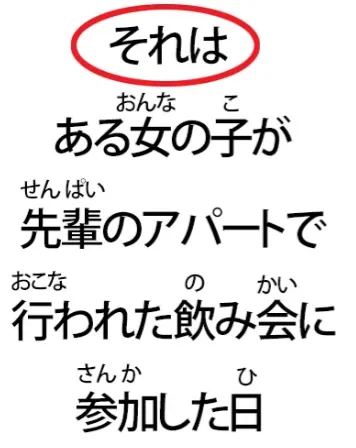
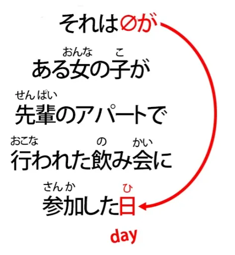
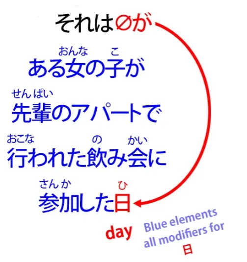
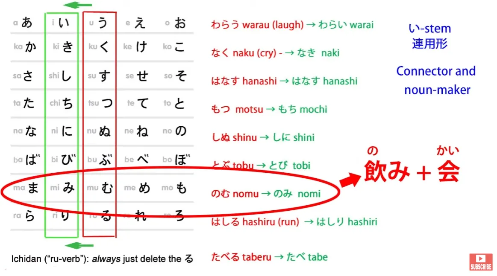
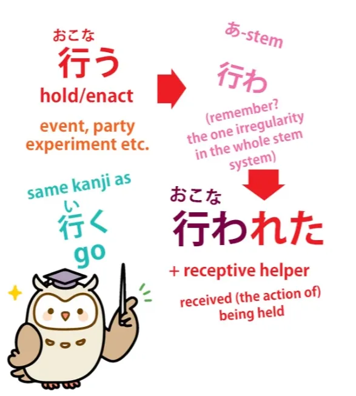
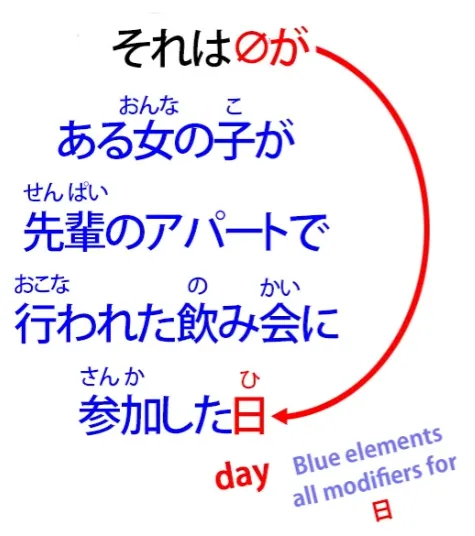

# **51. Cara Membaca Cerita Hantu Jepang (怪談/かいだん)**

[**Praktik Bahasa Jepang: Cara Membaca Kaidan (cerita hantu) Jepang | Pelajaran 51**](https://www.youtube.com/watch?v=uO1rHcwjADA&amp;list;=PLg9uYxuZf8x_A-vcqqyOFZu06WlhnypWj&amp;index;=53&amp;pp;=iAQB)

こんにちは。

Hari ini kita akan mengasah kemampuan dengan mempelajari bahasa Jepang yang sesungguhnya. Dan dengan senang hati saya mengumumkan bahwa kami bermitra dengan saluran YouTube lain bernama \*Akasic Tails\*. Mereka spesialis dalam narasi, dan saya sangat menyukai karya mereka, jadi saya sangat senang kita bisa bekerja sama dengan saluran Jepang ini untuk menghadirkan materi bahasa Jepang asli yang bisa kita uraikan dan terapkan prinsip-prinsip yang telah kita pelajari sejauh ini ke situasi nyata.

Jadi, yang akan kita dengarkan hari ini adalah <code>怪談</code> — sebuah cerita seram — dan kita akan membutuhkan beberapa sesi untuk menyelesaikannya karena saya ingin menganalisis setiap kalimat dan melihat berbagai masalah yang muncul saat kita menemui mereka, agar kalian dapat melakukan hal semacam ini sendiri saat benar-benar mendengarkan materi bahasa Jepang yang asli.

Baiklah. Jadi, mari kita mulai dengan mendengarkan bagian cerita yang akan kita dengarkan hari ini, lalu kita akan mengulasnya sedikit demi sedikit.

Baiklah. Jadi, kata pertama di sini adalah <code>それは</code>, dan ini mirip dengan ungkapan dalam bahasa Inggris <code>It was</code>. Dan kita sering memulai sebuah cerita, terutama cerita hantu, dengan ungkapan semacam ini, bukan?

<code>It was a dark and stormy night...</code>Jadi, Anda mungkin bertanya, &quot;Mengapa ini **それは

**, yang berarti &#x27;itu adalah&#x27; atau &#x27;itu dulu&#x27; daripada &#x27;itu adalah&#x27;?&quot;

Nah, alasannya sangat sederhana. Tidak ada kata yang terlihat untuk <code>it</code> dalam bahasa Jepang. Fungsi dari apa yang <code>it</code> dalam bahasa Inggris selalu dijalankan oleh subjek tak terlihat dalam bahasa Jepang.

Dan sangat penting untuk memahami hal ini karena ini adalah salah satu kunci mendasar untuk memahami bahasa Jepang. Kami memang memiliki kata ganti dalam bahasa Jepang untuk <code>me</code> dan <code>you</code> dan <code>they</code> dan <code>she</code> dan <code>he</code>, dan subjek tak terlihat digunakan di tempat-tempat di mana kata-kata ini biasanya digunakan dalam bahasa Inggris, tetapi tidak ada kata sama sekali dalam bahasa Jepang untuk kata ganti netral sederhana <code>it</code>.

Jadi, dalam kasus seperti ini di mana kita sebenarnya ingin menjadikan topik apa yang akan menjadi <code>it</code> dalam bahasa Inggris, kita menggunakan kata ganti yang sedikit lebih pasti <code>that</code>. Jadi kita mengatakan <code>that was</code>. Di sini kita mengatakan <code>it was</code>.

Sekarang, pada tahap ini kita belum tahu bahwa itu adalah <code>it was</code>, dan sebenarnya kita tidak pernah mengetahuinya secara langsung. Nah, jika Anda ingin memahami kalimat ini, kita bisa menganalisisnya bagian demi bagian dan jika kita mendengarkannya tanpa melihat teksnya, kita harus melakukan itu. Dan itu tidak terlalu sulit untuk dilakukan.

Tapi saya akan menggunakan jalan pintas di sini karena ketika teks ada di depan Anda, Anda bisa melakukannya. Saya tidak berpikir kita harus menganalisisnya secara mundur seperti yang disarankan Rubin-先生, meskipun saya adalah penggemar berat Rubin-先生 dalam beberapa hal. Namun, yang bisa kita lakukan adalah melihat sekilas bagian akhir karena bagian itu akan memberi tahu kita ke mana arah kalimat yang terlihat cukup rumit ini sebenarnya.

Jadi, bagian akhir kalimat — dan kita tahu bahwa engine kalimat selalu berada di bagian akhir dan mungkin diikuti oleh beberapa partikel penutup kalimat, tetapi engine kalimat tetap berada di bagian akhir terlepas dari itu. Dan yang ada di bagian akhir kalimat ini adalah <code>日</code> — <code>day</code>.

Sekarang, ketika kita melihat kata benda mengakhiri kalimat seperti ini, kita tahu bahwa ini akan menjadi  
<code>A is B</code> kalimat dan bahwa kopula <code>だ</code> atau <code>です</code>, yang seharusnya ada di sana untuk menjadikannya kalimat, telah dihilangkan.

Nah, hal ini relatif sering terjadi dalam percakapan santai. Dan ini adalah percakapan santai — <code>casual speech</code> adalah istilah yang agak umum, tetapi inilah jenis bahasa yang mungkin akan kita gunakan saat menginap di rumah teman atau saat kita saling bercerita <code>怪談</code>, di mana kita saling menceritakan kisah-kisah seram. Jadi, kita menggunakan tingkat bahasa di mana kadang-kadang kata penghubung dihilangkan.

Dan kita akan melihat beberapa hal lain yang dihilangkan dalam cerita ini. Jadi, inilah struktur kalimatnya.

<code>それは</code> menetapkan topik, dan itu juga akan menjadi subjek, jadi itu <code>それはzeroが</code>. Dan kemudian <code>日</code>, itu saja. <code>It was... day.</code>

Dan kita bahkan tidak tahu bahwa <code>was</code>, karena kita membutuhkan kata hubung di bagian akhir untuk memberi tahu kita bentuk kalimatnya. Jadi, jika kata hubungnya <code>だ</code>, kalimat itu akan berakhir <code>だった</code>; jika <code>です</code>, kalimatnya akan berakhir <code>でした</code>.

Pada kenyataannya, kita tidak memiliki penanda waktu. Namun, karena kita tahu ini adalah pengantar untuk sebuah cerita, kita dapat menyimpulkan dari fakta tersebut bahwa ini adalah <code>It was</code>pernyataan jenis , pernyataan pengantar latar.

Lalu bagaimana dengan sisa kalimat ini?

<code>ある女の子が先輩のアパートで行われた飲み会に参加した</code>

Sekarang, seperti yang Anda lihat, di antara <code>それは</code> dan <code>日</code> terdapat kalimat logis yang lengkap. Dan kita dapat melihat bahwa setiap klausa dalam kalimat logis ini, seperti yang telah kita lihat dalam video tentang urutan kata[[46]](./46-word-order-matters-2-simple-rules-to-crack-tough-sentences.md) dan struktur kalimat, berfungsi dengan secara berurutan memodifikasi setiap elemen.

Jadi, <code>ある女の子が先輩のアパートで行われた飲み会に参加した</code>

\*\*\* Ini adalah demam modifikasi! \*\*\*

Jadi kalimat ini, sekali lagi, dapat kita uraikan menjadi A-car-nya, yang jelas <code>女の子が</code>, dan engine-nya, yaitu <code>した</code> — <code>did</code>. Dan kemudian <code>参加した</code> — <code>&#x27;参加 did**** — </code>&quot;ikut serta&quot;.

Dan kemudian seluruh bagian kalimat ini adalah elemen-elemen yang secara berurutan memodifikasi yang memodifikasi <code>参加した</code>: <code>先輩のアパートで行われた飲み会</code>. Jadi, <code>飲み会</code> adalah <code>a drinking party / a drinking meeting</code>.

<code>飲み</code> adalah akar kata &quot;い&quot;, bentuk kata benda dari I-stem <code>飲む</code> - minum - yang digabungkan dengan <code>会</code> - pertemuan atau pesta - sehingga menghasilkan <code>drinking party</code>.

Dan kemudian semua yang ada di depannya berfungsi sebagai kata sifat <code>drinking party</code>. <code>先輩のアパートで行われた飲み会</code> — <code>a drinking party held in senpai&#x27;s apartment</code>.

Jadi kita memiliki <code>ある女の子が</code> — <code>a certain girl</code> — <code>先輩のアパートで行われた飲み会に</code> – dan ini memberi tahu kita tempat di mana dia pergi untuk ikut serta. Itu adalah pesta minum yang diadakan di apartemen senpai.

Jadi kita memiliki klausa logis tersebut:

<code>a certain girl — took part in — a drinking party — held at — senpai&#x27;s apartment</code>

dan semua itu merupakan pengubah untuk <code>day</code>.

Jadi, <code>それは...</code> — <code>It was a day when a certain girl attended a drinking party held in senpai&#x27;s apartment.</code> Jadi, Anda lihat ini tidak dibangun seperti yang biasanya kita harapkan dalam bahasa Inggris, tetapi itu tidak masalah karena kita sekarang sudah memiliki pengalaman tentang bagaimana bahasa Jepang dibangun. Dan saya pikir Anda akan setuju bahwa semua ini masuk akal.

Jadi, itulah latar belakangnya. Ini memberi tahu kita hari ketika hal ini terjadi dan mengisi detail tentang hari itu yang akan relevan saat kita masuk ke dalam cerita.

Nah, ini memakan waktu lebih lama dari yang saya perkirakan untuk satu kalimat, tapi saya pikir layak untuk menjelaskannya secara detail, bukan? Jadi, sayangnya kita harus mengakhiri bagian ini dengan sedikit lebih singkat daripada yang saya perkirakan semula, tetapi beberapa kalimat berikutnya saya rasa akan berisi lebih sedikit pertanyaan, sehingga kita seharusnya bisa melanjutkan teks ini dengan sedikit lebih cepat pada kesempatan berikutnya.
