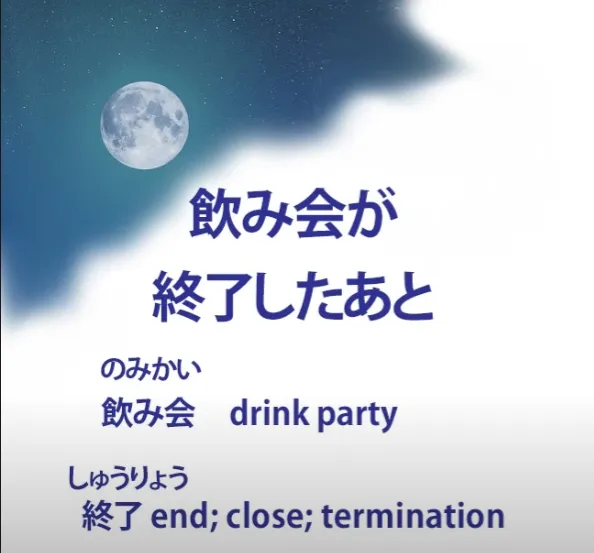
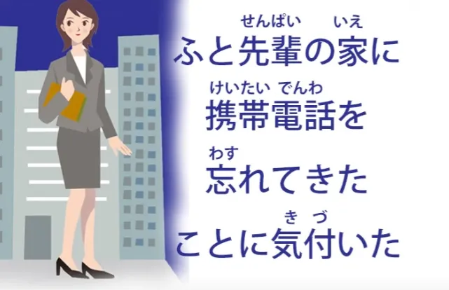
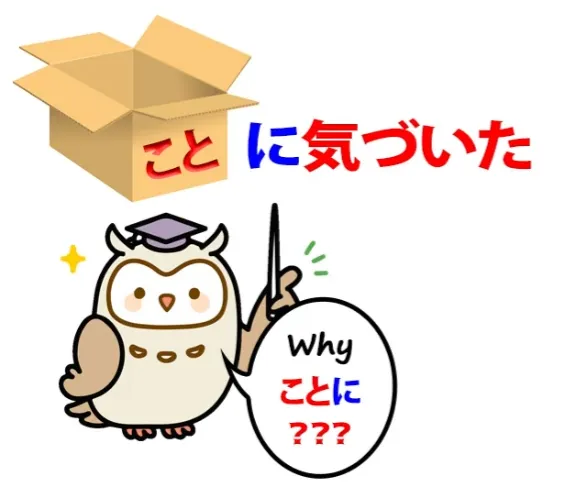
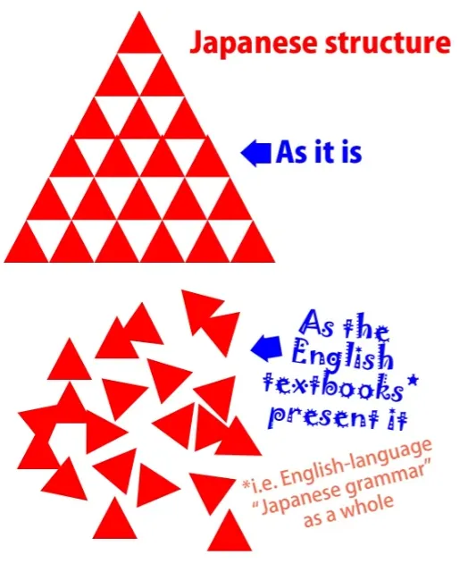
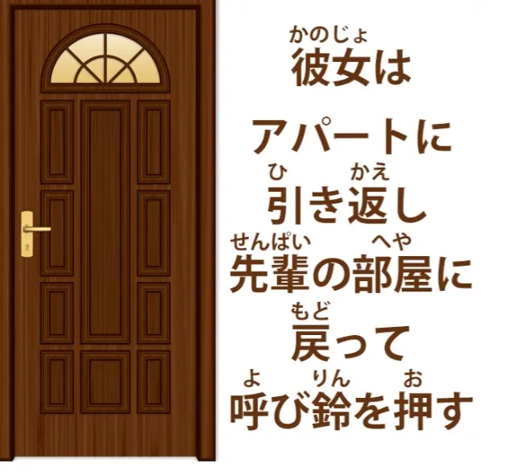
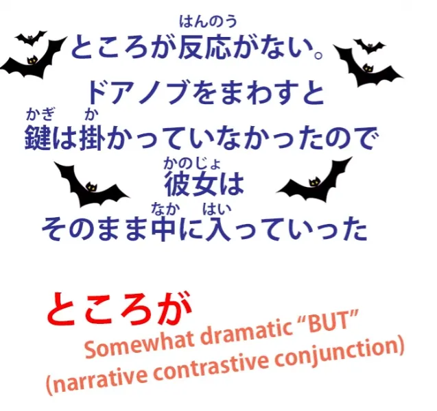
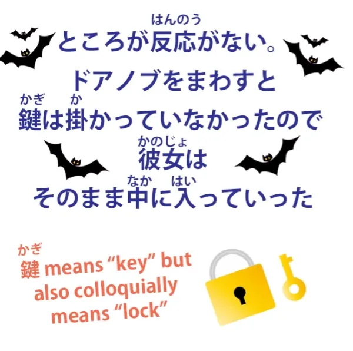
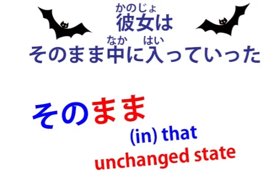

# **52. Analisis Kalimat Bahasa Jepang Secara Mendalam dalam Konteks Asli**

[**Analisis Kalimat Bahasa Jepang Secara Mendalam dalam Konteks Asli | Pelajaran 52**](https://www.youtube.com/watch?v=I38yhYh4Lfg&amp;list;=PLg9uYxuZf8x_A-vcqqyOFZu06WlhnypWj&amp;index;=54&amp;pp;=iAQB)

こんにちは。

Hari ini kita akan terjun langsung dengan mempelajari bahasa Jepang dalam kehidupan nyata berkat saluran mitra Jepang kami, Akasic Tails. Dan kita akan melihat beberapa struktur bahasa Jepang yang sebenarnya yang akan kita temui dalam kehidupan sehari-hari serta belajar cara menganalisisnya, dan begitu kita memahaminya dengan jelas, kita akan bisa langsung memahaminya saat mendengarnya.

Minggu lalu kita membahas sebuah <code>怪談</code> – sebuah cerita seram – dan ada begitu banyak materi penting untuk dianalisis di kalimat pertama sehingga kita tidak sempat melampaui kalimat pertama. Jadi, minggu ini saya pikir kita bisa melangkah sedikit lebih jauh dan sedikit lebih cepat ke dalam cerita. Jadi, saya akan memutar bagian yang ingin saya analisis hari ini, lalu kita mulai menganalisisnya. Tentu saja, kita akan mulai dari kalimat kedua karena kalimat pertama sudah kita analisis dengan cukup mendalam.

Jadi, bagian selanjutnya adalah <code>飲み会が終了した後</code> dan ini adalah pernyataan waktu. Ini menetapkan waktu dari aksi yang akan kita gambarkan.

Sekarang, secara teknis, kita seharusnya mengatakan <code>後に</code> daripada sekadar <code>後</code>, tetapi sekali lagi kita bisa mengabaikannya karena kita berbicara secara relatif informal. Jadi setelah menetapkan waktunya, kita kemudian mengatakan apa yang terjadi: <code>彼女はアパートを出てしばらく歩いていた</code>.

Jadi, dia meninggalkan apartemen dan berjalan sebentar.

Lalu kita memiliki <code>ふと先輩の家に携帯電話を忘れてきたことに気づいた</code>.

<code>ふと</code> — tiba-tiba — <code>先輩の家に</code> — di rumah senpai — <code>携帯電話</code> — telepon genggam — <code>を忘れてきたことに気づいた</code> — 忘れてきた adalah 忘れる, lupakan, digabungkan dengan <code>来る</code>.

<code>忘れてくる</code> secara harfiah <code>forgetting-coming</code> — atau artinya sebenarnya <code>leaving behind</code>: <code>忘れてきた</code>, datang sambil lupa membawa telepon genggamnya di apartemen senpai. <code>ことに気づいた</code> — dia menyadari bahwa itulah yang telah dilakukannya. <code>こと</code> menjadi kata benda, atau menggabungkan segala sesuatu di depannya ke dalam kata benda itu.

Jadi, melupakan teleponnya di apartemen senpai adalah <code>こと</code> yang baru disadarinya.

Jadi mengapa itu <code>ことに気づく</code> dan bukan <code>ことを気づく</code>?

Kamus dan buku teks bahasa Jepang berbahasa Inggris akan memberitahumu bahwa <code>気づく</code> adalah kata kerja yang artinya sama dengan bahasa Inggris <code>realize</code>. Dan dalam praktiknya artinya hampir sama, tetapi secara struktural berbeda. Kata ini terdiri dari gabungan dua kata yang sudah kita kenal dengan baik.

Salah satunya adalah <code>気</code> yang berarti <code>spirit</code> atau <code>mind</code> atau <code>feelings</code> dan yang lainnya adalah <code>付く</code> yang berarti <code>stick</code> atau <code>adhere</code>. Jadi, secara harfiah artinya adalah <code>spirit stick</code> dan yang kita lakukan adalah menempelkan jiwa kita pada sesuatu, yaitu, perhatian kita, pikiran kita, perasaan kita menjadi melekat pada suatu hal tertentu.

Dan dalam bahasa Inggris kita mengungkapkannya secara berbeda dengan mengatakan bahwa kita <code>realize</code> — menjadikan nyata — sebuah fakta. Dalam bahasa Jepang, jiwa kita melekat pada sebuah fakta.

Dalam bahasa Jepang, ungkapan yang sangat umum adalah <code>気を付けてください</code>, yang diterjemahkan sebagai <code>take care</code>, tetapi arti harfiahnya adalah <code>stick your spirit</code>. Menempelkannya pada apa? Nah, menempelkannya pada lingkunganmu, menempelkannya pada apa yang sedang kamu lakukan.

Dengan kata lain, perhatikan. Sekarang, terjemahan <code>take care</code> sebenarnya lebih baik secara budaya daripada <code>pay attention</code>, karena <code>pay attention</code> terdengar seperti perintah, bukan?

Dan itu bukan suasana yang dimaksud dengan <code>気を付けて</code>.
::: info
Dolly- 先生 mengatakan <code>気をつくて</code>, tapi saya pikir dia bermaksud mengatakan &quot;気を付けて&quot; sebagai gantinya, karena yang pertama sepertinya tidak masuk akal, dan saya gagal menemukan apa pun tentangnya, terutama yang mengacu pada <code>take care</code> atau sejenisnya... teori saya adalah dia salah bicara, tapi tidak ada yang menyadarinya.
:::
Dalam praktiknya, secara budaya artinya lebih mirip <code>take care</code>, jadi terjemahannya tidak salah tetapi strukturnya tidak sama.

Jadi sekarang kita mengerti mengapa kita mengatakan <code>ことに気づく</code> daripada <code>ことを気づく</code>. Jika kita menempelkan poster ke dinding, dinding, benda yang ditempelkan, bukanlah objek langsung, bukan? Objek langsungnya adalah poster; dinding adalah sasaran akhir dari tindakan tersebut.

Dan sasaran akhir, dalam bahasa Jepang, selalu ditandai dengan &quot;に&quot;. Seperti yang kita ketahui, objek tidak langsung, yaitu sasaran akhir, ditandai dengan &quot;に&quot;.

Sekarang, bahkan jika kita menghilangkan penggerak manusia dari kalimat ini dan hanya mengatakan <code>The poster sticks to the wall</code>, kita tetap mengatakan <code>to the wall</code>, bukan? Kita tidak mengatakan <code>The poster sticks the wall</code>, yang merupakan ungkapan yang akan kita gunakan jika dinding adalah objek langsung.

Kita mengatakan <code>The poster sticks to the wall</code>. Dinding adalah sasaran dari menempelnya poster. Jadi dengan alasan yang sama, jika kita menempelkan semangat kita pada sesuatu atau jika semangat kita menempel pada sesuatu, sesuatu yang ditempelinya itulah sasarannya, bukan objek langsung dari penempelan tersebut.

Sekarang, ini penting untuk diketahui, karena ini adalah contoh kecil lainnya mengenai cara <code>えいほんご</code> — yang disebut tata bahasa Jepang dalam bahasa Inggris, hal-hal yang Anda temukan di buku teks dan situs web di mana-mana –

ini adalah cara lain di mana hal itu hanya mengacaukan pemahaman kita tentang logika dan struktur bahasa yang sangat, sangat logis.

Karena yang akan mereka katakan adalah <code>気づく</code> adalah kata kerja yang berarti **menyadari**, tetapi menggunakan Partikel logis &quot;に&quot;.

Sekarang, mengesampingkan fakta bahwa tidak ada kata kerja yang dapat menggunakan &quot;に&quot; atau Partikel logis lainnya (hanya kata benda yang dapat menggunakan Partikel logis), kita tahu apa yang mereka maksud. Mereka bermaksud bahwa kata ini, yang berarti <code>realize</code>, yang dalam bahasa Inggris memperlakukan hal yang disadari sebagai objek langsung, sebenarnya memperlakukan hal yang disadari sebagai target dan karenanya menandainya dengに, dan &quot;ini adalah salah satu keanehan aneh dalam bahasa Jepang yang harus Anda pelajari dalam setiap kasus individu karena sangat acak dan tidak rasional&quot;. Sebenarnya sama sekali tidak acak dan tidak rasional.

Meskipun <code>気づく</code> secara umum setara dengan <code>realize</code> dalam bahasa Inggris, strukturnya tidak sama. Kita tidak sedang &quot;merealisasikan&quot; atau &quot;menjadikan sesuatu nyata&quot;, melainkan menempelkan roh kita pada sesuatu, dan sesuatu itu adalah target, sehingga ditandai dengan に, sama seperti target selalu ditandai dengan に.
::: info
jelas bahwa sesuatu yang ditandai dengan &quot;に&quot; adalah kata benda, seperti &quot;こと&quot;. Bukan kata kerja &quot;気づく&quot; yang <code>takes に</code>, seperti yang dikatakan beberapa buku teks. Hanya untuk berjaga-jaga jika hal ini disebutkan lagi, karena bisa sedikit membingungkan.
:::
Bahasa Jepang tidak menganut irasionalitas acak.

Anda harus beralih ke bahasa-bahasa Eropa jika menginginkan hal itu.

Dan jika saya boleh menyisipkan catatan kaki kecil di sini. Pembicaraan tentang kata kerja yang menggunakan partikel ini sangat, sangat menyesatkan.

Bukan sekadar perdebatan kecil untuk mengatakan bahwa Partikel logis hanya bisa dimiliki oleh kata benda, bukan kata kerja. Saya katakan saya tahu apa yang mereka maksud saat membicarakan kata kerja yang menggunakan partikel, tapi apa yang mereka bicarakan itu salah besar setiap kali. Hal itu didasarkan pada kesalahpahaman bahwa Partikel logis dapat menjalankan fungsi yang berbeda terkait dengan kata kerja yang berbeda.

Dan partikel-partikel tersebut tidak pernah bisa melakukannya. Satu-satunya alasan untuk berpikir demikian adalah, seperti dalam kasus ini, kesalahpahaman tentang apa yang sebenarnya dilakukan oleh kata kerja tersebut, biasanya karena mereka menganggap bahwa kata kerja tersebut berfungsi persis seperti padanan terdekatnya dalam bahasa Inggris, yang seringkali tidak demikian.

Dan seperti yang telah kita lihat dalam kasus kata kerja bantu potensial dan kata sifat subjektivitas, kesalahpahaman ini mencakup area yang sangat luas dalam bahasa Jepang dan berkontribusi besar terhadap ketidakmampuan banyak siswa untuk memahami bahasa Jepang. Karena hal itu tampak begitu tidak logis dan acak, padahal sebenarnya sepenuhnya logis. Itulah mengapa kita menyebutnya <code>logical particles</code>.

Mereka tidak pernah mengubah fungsinya terlepas dari kata sifat atau kata kerja apa yang terlibat dalam kalimat. Mereka selalu, selalu melakukan hal yang sama. Dan jika Anda sedikit pun bingung dengan apa yang saya katakan di sini, silakan lihat pelajaran kesembilan dalam kursus ini. Dan saya akan menampilkan kartu untuk itu sekarang.

<code>彼女はアパートで引き返し先輩の部屋に戻って呼び鈴を押す</code>

Jadi dia kembali ke apartemen senpai. <code>引き返し</code>, itu berarti <code>return</code>, dan seperti yang telah kita lihat sebelumnya, akar kata kerja &quot;い&quot; — kata kerjanya adalah <code>引き返す</code>, yaitu <code>return</code> — dan khususnya dalam narasi, kita dapat menggunakan bentuk dasar kata kerja (い) dengan cara yang hampir sama seperti kita menggunakan bentuk kata kerja (て) untuk menjadikannya klausa pertama dari kalimat majemuk.

Jadi, dia kembali ke apartemen senpai — <code>先輩の部屋に戻って呼び鈴を押す</code>. Dia kembali ke kamar senpai dan menekan bel.

<code>呼び鈴</code>: <code>呼ぶ</code> adalah <code>call</code>, <code>鈴/りん</code> adalah bacaan on dari <code>鈴/すず</code>, <code>a small bell</code>, jadi <code>呼び鈴</code> adalah <code>call-bell / a bell for calling</code>.

<code>押す</code>: dia menekan bel. Dan seperti yang telah kita lihat sebelumnya, dalam narasi bahasa Jepang diperbolehkan menggunakan kalimat bentuk sekarang di dalam narasi bentuk lampau untuk menambah kesan langsung. Dan maksudnya di sini adalah bahwa kita telah sampai pada suatu titik, titik yang hampir seperti mendarat di tangga tempat kita beristirahat sejenak dan menjadikan ini sebagai masa kini kita.

Dia menekan bel.

<code>ところが反応がない</code>

<code>ところが</code> adalah ungkapan yang sering kita temukan dalam narasi, sekali lagi. <code>が</code>: Ini <code>が</code> jelas bukan partikel が. Ini adalah <code>が</code>, yang merupakan konjungsi kontrasif dan pada dasarnya berarti <code>but</code>.

Mengapa kita menambahkan <code>ところ</code> ke dalamnya? Nah, seperti yang telah kita bahas dalam pelajaran sebelumnya, <code>ところ</code>, yang berarti <code>place</code>, juga bisa berarti suatu titik waktu. Hampir seperti titik istirahat dalam waktu.

Ini memberi kita <code>now</code>, seolah-olah. Jadi ketika kita mengatakan <code>ところが</code>, kita sebenarnya mengatakan <code>at that point / at that time, but</code>.

Jadi, kita menggunakan ini sebagai konjungsi naratif untuk menandai fakta bahwa sesuatu sedang terjadi yang bertentangan dengan harapan atau keinginan kita.

Jadi, <code>ところが反応がない</code>. Jadi meskipun dia menekan bel, tidak ada jawaban, secara tak terduga atau bertentangan dengan harapan dan keinginan kita.

Dan ketika dia memutar kenop pintu... <code>回す</code> Seperti yang kita ketahui, <code>回る</code> adalah <code>go around</code>, <code>回す</code> adalah versi gerakan lain dari <code>回る</code>, jadi artinya <code>cause to go around</code>.

Ketika dia membuat kenop pintu berputar, ketika dia memutar kenop pintu, <code>鍵は掛かっていなかった</code> Kunci itu berada dalam keadaan tidak terkunci, tidak terpasang atau digantung atau terikat. Ungkapan yang tampak sedikit membingungkan karena berasal dari fakta bahwa orang Jepang sering menggabungkan konsep kunci dan konsep gembok menjadi satu. Secara tegas, hal ini bisa disebut tidak tepat.

Sebenarnya yang kita maksud adalah <code>錠前が掛かった</code> — gemboknya yang terpasang atau terkunci, tetapi dalam bahasa Jepang umum untuk mengatakan bahwa kuncinya yang terpasang atau terkunci (<code>鍵が掛かった</code>) dan bahkan terdengar sedikit tidak wajar jika mengatakannya dengan benar.

---

Dan karena pintunya tidak terkunci, <code>彼女はそのまま中に入っていた</code> — dia pun masuk.

<code>そのまま</code> kami membahasnya dalam video lain[[42]](./42-basic-word-confusion- まま.md) dan, seperti yang kita ketahui, <code>まま</code> adalah kondisi yang tidak berubah. <code>そのまま</code> berarti <code>in that unchanged condition / just as it is</code>. Dan kita bisa melihat di sini bagaimana konsep itu diperluas sedikit dengan cara yang sering kita temui.

Jadi, misalnya, jika kita berbicara tentang edamame, dan kita mengatakan <code>そのまま食べる</code>, yang kita maksud adalah &quot;makanlah apa adanya, makanlah tanpa mengubah kondisinya, makanlah tanpa melakukan apa pun lagi untuk mempersiapkan makanannya<code> and this is what </code>そのまま&quot; berarti di sini.

Karena pintunya tidak terkunci, dia masuk begitu saja, dalam kondisinya saat itu. Dia tidak menekan bel lagi, dia tidak menunggu diundang, tetapi <code>そのまま</code> — dalam keadaan yang tak berubah pada saat itu — dia masuk…
