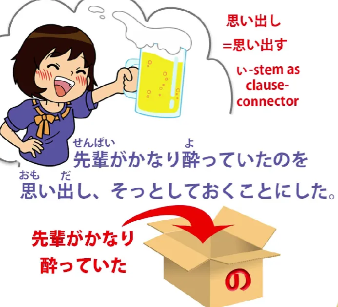
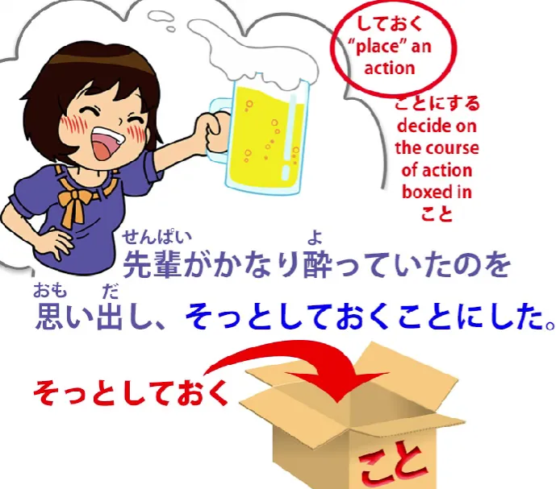

# **53. Nikmati Film Horor Jepang dalam Bahasa Jepang**

[**Nikmati Film Horor Jepang dalam Bahasa Jepang | Pelajaran 53**](https://www.youtube.com/watch?v=8DHRS4B5SQA&amp;list;=PLg9uYxuZf8x_A-vcqqyOFZu06WlhnypWj&amp;index;=55&amp;pp;=iAQB)

こんにちは。

Hari ini kita akan menjumpai banyak poin struktural dalam bahasa Jepang yang telah kita bahas dalam rangkaian pelajaran ini, diterapkan dalam situasi nyata. Dan kita akan melakukannya dengan melanjutkan <code>怪談</code>cerita bahasa Jepang yang telah kita baca selama beberapa pelajaran terakhir, atas izin dari saluran mitra Jepang kita, Akasic Tails.

Dan kita akan membahas begitu banyak poin kali ini sehingga saya akan menampilkan kartu untuk beberapa poin utama, tetapi saya juga telah membuat [**halaman**] pendukung(http://learnjapaneseonline.info/2019/08/10/groping-in-the-darkness-links-to-structure-points-covered/) di Kawajapa di mana Anda dapat mengunjungi dan mencari poin-poin ini serta mempelajarinya lebih lanjut jika Anda membutuhkannya. Dan menurut saya, akan sangat baik jika Anda menindaklanjuti hal-hal yang belum sepenuhnya jelas bagi Anda setelah kita membahas cerita ini.

Sekarang, untuk mengingatkan Anda di mana kita berhenti pada akhir pelajaran minggu lalu, tokoh utama wanita kita telah pergi ke pesta minum-minum di apartemen senpai-nya. Setelah dia meninggalkan pesta dan berjalan pulang di malam hari, dia menyadari bahwa dia telah meninggalkan <code>携帯電話</code>, telepon genggamnya, di apartemen senpai. Jadi dia kembali, menekan bel, tetapi tidak ada jawaban, memutar pegangan pintu dan mendapati bahwa pintu itu tidak terkunci.

Jadi dia langsung masuk.

Jadi, mari kita lihat apa yang terjadi selanjutnya.

<code>部屋の中は電気がついておらず</code>

Sekarang, selama kita memahami bahwa <code>電気をつける</code> berarti <code>turn on the lights</code> (secara harfiah artinya <code>turn on the electricity</code>, tetapi sebenarnya merujuk pada lampu), satu-satunya masalah dengan klausa ini adalah <code>おらず</code>. Apa artinya itu?

Nah, <code>おる</code> berarti sama dengan <code>いる</code>, yaitu <code>be</code>.

Secara umum kita diajarkan bahwa itu berarti <code>be</code> makhluk hidup, seperti hewan dan manusia. Hal itu tidak sesederhana itu dan saya telah menjelaskannya di pelajaran lain, yang akan saya [**tautan**](https://www.youtube.com/watch?v=PsTsliRe2Cg&amp;ab;_channel=OrganicJapanesewithCureDolly).
<code>おる</code> adalah bentuk yang agak lebih tua dari <code>いる</code>, tetapi kita menjumpainya dalam berbagai situasi.

Misalnya, kata ini digunakan dalam keigo sebagai bentuk rendah hati, <code>謙譲語/けんじょうご</code> bentuk, dari <code>いる</code> yang kita gunakan untuk merendahkan tindakan dan kepemilikan kita sendiri, tetapi juga digunakan dalam dialek, misalnya dalam Kansai-ben, dan digunakan dalam konteks sastra untuk memberikan nuansa narasi sastra. Dan itulah cara penggunaannya di sini.

Jadi, <code>おる</code> berarti <code>いる</code>, tetapi apa <code>おらず</code> artinya? Nah, Anda juga harus memahami bahwa <code>-ず</code> juga merupakan bagian dari bahasa Jepang kuno yang memberikan nuansa sastra pada sebuah narasi dan itu hanyalah kata bantu negatif seperti <code>-ない</code>.

Lalu mengapa <code>おらず</code>? Nah, itu karena meskipun <code>いる</code>, seperti yang kita ketahui, adalah kata kerja ichidan, <code>おる</code>, kebetulan, adalah kata kerja godan. Jadi, seperti halnya semua kata kerja godan, kata bantu negatif ditambahkan ke akar kata &quot;あ -I-stem&quot;.

Itulah yang terjadi di sini. <code>おらず</code> berarti sama dengan <code>いない</code>.

Jadi, <code>電気がついておらず</code> berarti <code>the electricity existed in a state of not having been switched on</code> atau, dalam bahasa Inggris sederhana, lampu-lampu sudah mati.

<code>真っ暗で</code>: <code>真っ暗</code> adalah <code>pitch-dark</code>, secara harfiah <code>true dark / complete dark</code>. <code>暗</code>, tentu saja, kita kenal sebagai <code>暗い</code>, kata sifat <code>dark</code>, dan kita tahu bahwa ketika kita melihat kata sifat tanpa akhiran -い, jika kata tersebut terbentuk, maka itu akan menjadi kata benda.

Kita juga tahu bahwa jika kita melihat kata yang seluruhnya terdiri dari kanji, kata tersebut hampir pasti merupakan kata benda. Jadi <code>真っ暗</code> adalah <code>pitch darkness</code>.

<code>真っ暗で</code> — <code>で</code> ini adalah bentuk -て <code>だ</code> atau <code>です</code>. Jadi, <code>部屋の中は電気がついておらず真っ暗で</code> — <code>As for the inside of the room, the lights were off, it was pitch dark</code>.

---

<code>どうやら先輩はもう寝てしまったらしい</code>

<code>どうやら</code>: dalam hal ini berarti <code>it seems, it appears to be the case</code> dan ini sebenarnya bekerja bersamaan dengan <code>-らしい</code> di bagian akhir, yang juga berarti <code>seems like, appears to be</code>.

Dan kita telah membahas hal ini dalam pelajaran sebelumnya[[25]](./25- らしい -vs- そうだ - そうです - っぽい -ppoi.md) juga. 

Jadi di antara &quot;sandwich&quot; ini yang memberi kita <code>it appears to be the case</code> arti, tertulis <code>先輩はもう寝てしまった</code> — <code>senpai has already done gone to sleep / done gone to bed</code>. Seperti yang kita ketahui, itu <code>しまう, しまった</code> memberikan <code>done</code> arti. Dan itu benar-benar cara terbaik untuk mengatakannya dalam bahasa Inggris.

Kedengarannya agak kasar dalam bahasa Inggris, tetapi tidak ada kata lain dalam bahasa Inggris yang menurut saya memberikan rasa <code>しまう, しまった, ちゃった</code> dengan sangat baik <code>done</code>. Sepertinya dia sudah tidur.

<code>無用心だな</code>: <code>無用心</code> secara harfiah berarti <code>not using one&#x27;s heart</code>, tetapi <code>heart</code> di sini berarti pikiran atau jiwa. <code>用心</code> adalah <code>care</code> atau <code>cautiousness</code>; <code>無用心</code> adalah <code>lack of care</code> atau <code>lack of cautiousness</code>.

::: info
Penulisan alternatifnya adalah 不用心. Keduanya seharusnya memiliki arti yang sama.
:::

Namun, kata ini <code>無用心</code> cenderung berarti kurangnya kewaspadaan terkait dengan aktivitas kriminal atau aktivitas berbahaya lainnya. Jadi, kita bisa mengatakan bahwa berjalan sendirian di tempat yang berbahaya <code>無用心</code> atau meninggalkan barang berharga di dalam mobil <code>無用心</code>. Dan di sini, membiarkan pintunya tidak terkunci di malam hari sehingga siapa pun bisa masuk begitu saja adalah <code>無用心</code>.

<code>無用心だな</code>: <code>な</code>, seperti yang kita ketahui, adalah partikel penunjuk arah yang digunakan untuk mengarahkan komentar kepada diri sendiri, jadi dia berpikir dalam hati <code>無用心だ</code> — itu adalah perilaku yang ceroboh dan berbahaya.

<code>無用心だな、と思った彼女は</code>: jadi, dia, yang memikirkan hal ini, <code>電気をつけて先輩を起こそうかと思ったが</code>.

Baiklah, jadi ini terlihat sedikit rumit dan kita belum menyelesaikan kalimatnya, tapi mari kita bahas sedikit demi sedikit. Pertama-tama dia berpikir <code>無用心</code> — <code>unsafe, dangerous behavior</code>; <code>she thought</code> — <code>と思った彼女</code> — dia yang berpikir demikian, kemudian memikirkan hal lain; <code>電気をつけて</code> — <code>点ける/つける</code>, tentu saja, adalah versi tindakan lain dari <code>点く/つく</code>, jadi dia berpikir untuk menyalakan lampu; <code>先輩を起こそう</code> — sekarang, seperti yang kita tahu, akhiran <code>そう</code> akhiran itu adalah akhiran volisional; <code>起こそうか</code> — dia berpikir untuk mengambil tindakan membangunkan senpai.

<code>起こす</code> —untuk <code>wake someone up</code>; <code>起きる</code>, kamu membangunkan dirimu sendiri; <code>起こす</code> — - す akhiran, seperti yang kita ketahui, berarti kata kerja yang mengacu pada tindakan orang lain, jadi <code>起こす</code> berarti membangunkan orang lain. <code>起こそうか</code> — jadi, dia sedang memikirkan tindakan ini.

Partikel <code>か</code>, seperti yang kita ketahui dari pelajaran lain[[39]](./39-the- か -particle-buried-questions- かな - もんか - かどうか.md), menandai sebuah pertanyaan, dengan kata lain, sebuah proposisi. Jadi proposisi tersebut adalah melakukan tindakan membangunkan senpai.

Inilah yang dia pikirkan, tapi... (<code>が</code> — <code>but</code>) <code>先輩がかなり酔っていたのをおもいだし、</code>. Jadi, <code>かなり</code> adalah salah satu dari kata benda keterangan yang dapat memodifikasi kata kerja atau kata sifat tanpa akhiran -にatau -と yang biasanya diperlukan agar kata benda dapat memodifikasi kata kerja atau kata sifat, sehingga <code>かなり酔っていた</code> — <code>酔う</code> adalah <code>be sick or to be drunk</code>, dalam hal ini <code>drunk</code>.

<code>かなり</code> berarti <code>sufficiently</code> atau <code>pretty much</code> atau <code>very</code>. Jadi dia cukup mabuk, dia berada dalam keadaan cukup mabuk: <code>かなり酔っていたの</code> — <code>の</code> tentu saja mengemas pernyataan itu ke dalam kotak kata benda — <code>のを思い出し</code> — <code>思い出し</code> adalah <code>remember</code>, jadi dia ingat fakta — <code>の</code> — bahwa senpai sudah cukup mabuk.

<code>思い出す</code> adalah <code>remember</code>; <code>思い出し</code>, sekali lagi, seperti yang kita bahas minggu lalu[[7.5]](./7-5-conjugation.md), adalah akar kata &quot;い&quot; dari <code>思い出す</code> — <code>remember</code> — dan akar kata い di sini *(し)* digunakan seperti bentuk て untuk menjadikan klausa ini bagian dari kalimat majemuk.

Jadi sekarang kita memiliki kalimat majemuk tiga bagian. Pertama-tama, kita menggunakan <code>が</code> — <code>but</code> — sebagai penghubung untuk bagian pertama, dan untuk bagian kedua kita menggunakan - し seperti bentuk て sebagai penghubung untuk bagian ketiga, dan bagian ketiga adalah <code>そっとしておくことにした</code>.

<code>そっと</code> adalah salah satu kata benda keterangan ini, yang berarti <code>softly, gently or quietly</code>. <code>そっとする</code> berarti <code>do softly, gently or quietly</code>. Ini seperti <code>静かにする</code>, yang berarti <code>do quietly</code>.

<code>そっとする</code> juga berarti <code>do quietly</code>, tetapi <code>静か</code> berarti lebih <code>keep quiet</code>. Anda mungkin mengatakan ini kepada kelas: <code>静かに!</code> — <code>Keep quiet!</code>

<code>そっとする</code> lebih dari <code>do (something) in a quiet manner</code>. Sekarang, <code>静か</code> dapat digunakan dengan cara itu juga, tetapi <code>そっとする</code> berarti melakukan sesuatu dengan diam-diam; bahkan bisa berarti secara rahasia.

<code>静か</code> tidak bisa berarti secara rahasia; <code>そっと</code> bisa berarti secara diam-diam. Di sini, kata tersebut tidak berarti secara diam-diam, tetapi berarti melakukan sesuatu dengan tenang agar orang lain tidak menyadari bahwa Anda melakukannya, yang merupakan jenis implikasi yang <code>そっと</code> seringkali cenderung dimilikinya.

<code>そっとしておく</code> — <code>しておく</code>, seperti yang kita ketahui, adalah <code>put in place an action</code>. <code>置く/おく</code> berarti <code>place (something)</code>.

Menambahkan <code>おけ</code> て -bentuk kata kerja berarti melaksanakan tindakan tersebut. Dan, seperti yang kita ketahui, buku teks sering mengatakan bahwa itu berarti <code>doing it in advance</code> atau <code>doing it in preparation</code>, tetapi sebenarnya artinya <code>putting the action in place</code>.

Jadi, pada dasarnya dia mengatakan di sini, <code>do what she has to do, put her action in place, quietly</code>. <code>そっとしておくことにした</code>: sekarang, <code>ことにする</code>, seperti yang juga telah kita bahas dalam pelajaran sebelumnya, berarti <code>decide to do</code>. Jadi bagian terakhir ini berarti dia memutuskan untuk melaksanakan aksinya secara diam-diam, secara harfiah.

Jadi kita punya kalimat lengkap ini di sini:

<code>無用心だな、と思った彼女は電気をつけて先輩を起こそうかと思ったが、 *(zeroが)* 先輩がかなり酔っていたのを思い出し、 *(zeroが)* そっとしておくことにした</code>

Jadi, &quot;**Itu** berbahaya, bukan, membiarkan pintu terbuka,&quot; pikirnya; dia mempertimbangkan untuk menyalakan lampu dan membangunkan senpai, tetapi dia ingat bahwa senpai sudah cukup mabuk, jadi dia memutuskan untuk melakukan apa yang harus dilakukannya dengan diam-diam.&quot;

<code>真っ暗の中で自分の携帯電話を探し出すと</code> –

&quot;Dalam kegelapan pekat — 真っ暗の中で — 自分の携帯電話 — teleponnya sendiri — 探し出す&quot;. <code>探し出す</code>: <code>探す</code> seperti yang kita tahu, <code>search</code>; <code>探し出す</code> secara harfiah <code>search out</code>, jadi dia mencarinya, dia menemukannya — <code>と</code>.

****「忘れ物をしたので取りに戻りましたー」とひと声かけて部屋を後にした&quot;

Jadi dia berkata sesuatu dengan suara keras di sini, tapi mungkin dengan sangat pelan agar tidak membangunkan senpai. Dia berkata: <code>忘れ物</code> — <code>forgotten thing</code> — <code>をしたので</code> — &quot;Aku melakukan sesuatu yang terlupakan / Aku melupakan sesuatu / Aku meninggalkan sesuatu<code> — </code>忘れ物をしたので&quot; — karena itu — <code>取りに戻りました</code> — <code>I came back to take it / in order to take it, I returned</code> — <code>とひと声かけて</code> — <code>声 (を) かける</code> artinya mengatakan sesuatu kepada seseorang, untuk mengajak mereka berbicara, di sini <code>ひと声</code> — dia hanya mengucapkan kata itu, dia hanya mengucapkan suara itu, secara harfiah, dia hanya mengatakannya — <code>部屋を後にした</code> — jadi dia hanya mengatakannya, mungkin dengan pelan agar senpai bahkan tidak mendengarnya, tapi dia merasa harus mengatakan sesuatu — <code>部屋を後にした</code> — <code>後にする</code> secara harfiah berarti <code>turn it into behind</code>, dengan kata lain, melupakannya, dengan kata lain, pergi — dia meninggalkan ruangan — <code>部屋を後にした</code> — dia menjadikan ruangan itu sebagai hal yang tertinggal di belakangnya dengan meninggalkannya.

Dan begitulah malam itu. Yah, dia berhasil melewatinya dengan baik, bukan?

Agak menakutkan, tapi kami tidak mendengar apa yang terjadi keesokan harinya. Itulah yang akan kita bicarakan minggu depan..
