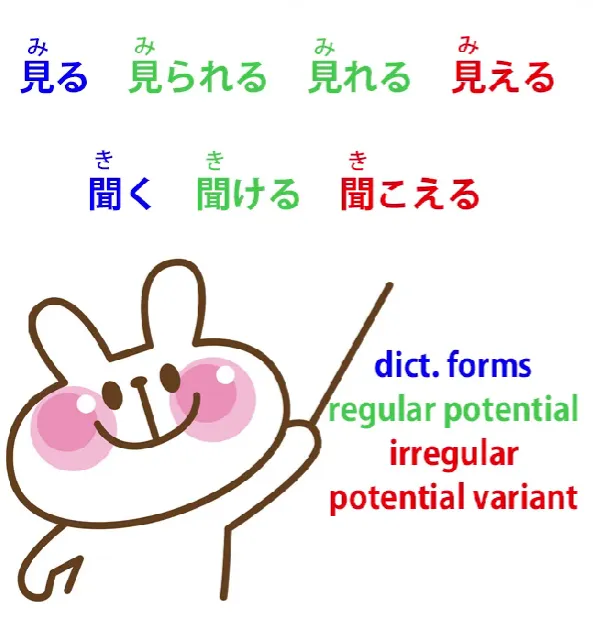
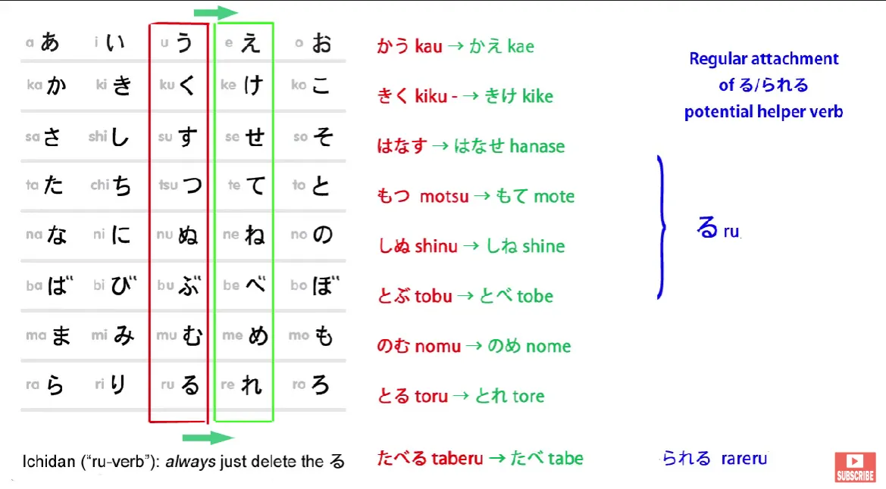
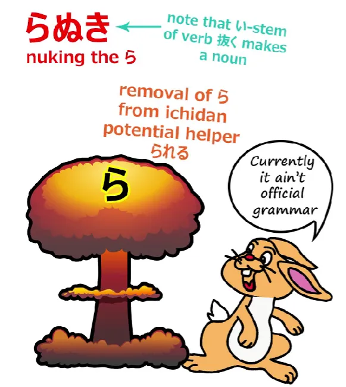
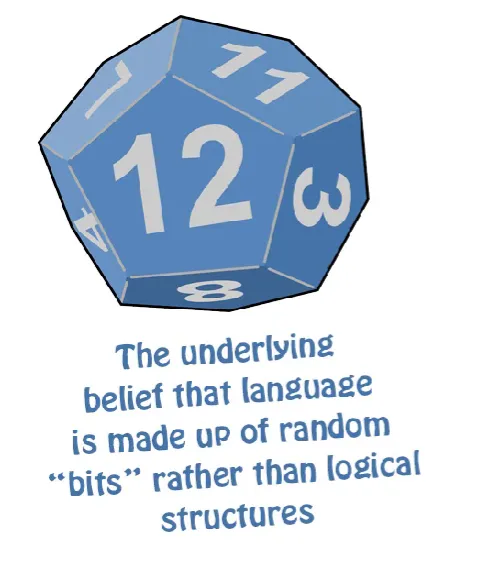
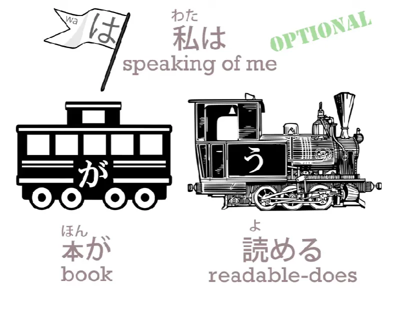
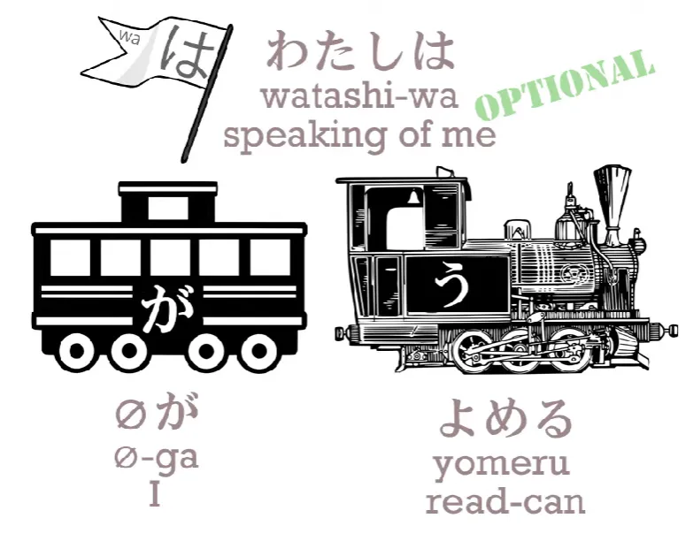

# **54. Ketidakteraturan &amp; cara kerjanya | 見る, 見られる, 見れる, 見える, 聞く, 聞ける, 聞こえる**

[**Ketidakteraturan dalam Bahasa Jepang dan cara kerjanya | 見る、見られる、見れる、見える、聞く、聞ける、聞こえる | Pelajaran 54**](https://www.youtube.com/watch?v=WuMCOHisAvY&amp;list;=PLg9uYxuZf8x_A-vcqqyOFZu06WlhnypWj&amp;index;=56&amp;pp;=iAQB)

こんにちは。

Hari ini kita akan membahas beberapa pengecualian dalam bahasa Jepang, cara kerjanya, dan mengapa hal itu ada. Dengan melakukan itu, saya rasa kita akan mendapatkan wawasan tentang bagaimana bahasa Jepang terbentuk dan bagaimana kita dapat memahaminya.

Jadi, yang akan kita bahas hari ini adalah 見る, 見られる, 見れる, 見える, 聞く, 聞ける, 聞こえる. Nah, sepertinya ini banyak hal yang membingungkan, bukan? Namun sebenarnya yang ada di sana hanyalah bentuk dasar kamus dari <code>見る</code> dan <code>聞く</code> — <code>see</code> dan <code>hear</code> — serta bentuk potensial masing-masing dan satu bentuk potensial alternatif atau pengecualian.

Sekarang, sepertinya ada dua dalam kasus <code>見る</code>, tetapi sebenarnya hanya satu, dan kita akan membahasnya sebentar lagi.

Saya selalu mengatakan bahwa bahasa Jepang adalah bahasa yang sangat, sangat teratur dan logis, dan pendapat umum adalah bahwa bahasa ini hanya memiliki dua kata kerja tidak beraturan, <code>来る</code> dan <code>する</code>. Nah, seperti yang sudah saya sebutkan sebelumnya, sebenarnya bahasa Jepang memiliki beberapa ketidakteraturan kecil lainnya, dan yang saya maksud dengan ketidakteraturan kecil adalah kata kerja yang sebenarnya bukan kata kerja tidak beraturan, tetapi menjadi tidak beraturan di satu area tertentu, hanya di satu tempat saja. Dan jumlahnya tidak banyak, tetapi ada beberapa dan ini adalah dua di antaranya.

Dan kita ingin melihat apa saja kata kerja tersebut dan, yang lebih penting, mengapa mereka seperti itu serta apa artinya, bagaimana kita dapat memahaminya.

Jadi, untuk memulainya, kita memahami bagaimana bentuk potensial reguler, <code>able to do</code> bentuk, dari kata kerja bekerja, bukan? Kita membentuknya hanya dengan mengubah kata kerja menjadi akar kata &quot;え&quot; dan menambahkan kata bantu potensial yang sangat sederhana <code>る</code>, yang hanya terdiri dari satu karakter: る. Itulah bentuk godan.

Dan bentuk ichidan: pada ichidan, kita melakukan apa yang selalu kita lakukan, yaitu cukup menghilangkan akhiran -る dan menambahkan apa pun yang akan kita tambahkan. Dalam hal ini, kata bantu potensial ichidan adalah <code>られる</code>.

Jadi, seperti yang dapat kita lihat, <code>見られる</code> adalah bentuk potensial reguler dari <code>見る</code>, yang merupakan kata kerja ichidan, dan <code>聞ける</code> adalah bentuk potensial reguler dari <code>聞く</code>, yang tentu saja merupakan kata kerja godan.

Lalu mengapa saya mengatakan bahwa hanya ada satu varian <code>見る</code> dan bukan dua? Nah, itu karena variannya adalah <code>見える</code>, dan kita akan kembali ke hal itu sebentar lagi.

<code>見れる</code> sebenarnya adalah bentuk ichidan yang dipengaruhi oleh fenomena yang kita sebut <code>ら抜き</code>. <code>ら抜き</code> secara harfiah berarti <code>taking out the ら</code>.

Dan ini adalah sesuatu yang cukup umum terjadi dalam bahasa Jepang. Anda akan sering menemukannya begitu Anda mulai menggunakan bahasa Jepang, jadi mungkin saat ini juga. Hal ini hanya berupa penghilangan <code>ら</code>, menghilangkan <code>ら</code>, dalam bentuk potensial ichidan dari kata kerja.

Hal ini dianggap sebagai tata bahasa yang salah, tidak hanya oleh buku teks bahasa Jepang untuk penutur bahasa Inggris, tetapi juga oleh buku teks tata bahasa Jepang asli. Meskipun dianggap salah, penggunaannya sangat, sangat luas, jauh lebih luas daripada kebanyakan kesalahan tata bahasa populer yang kadang-kadang Anda dengar. Dan saya menduga ini mungkin akan menjadi evolusi bahasa.

Kini, orang Barat sering cenderung berkata, &quot;Nah, jika banyak orang menggunakan suatu penggunaan yang salah, bagaimana bisa dikatakan salah? Tentu saja itu adalah penggunaan yang benar yang baru, karena **benar** hanyalah apa yang digunakan orang.&quot;

Dan saya pikir ini adalah kesalahan, dan kesalahan yang cukup berbahaya serta tidak bertanggung jawab, karena meskipun benar bahwa bahasa berevolusi, evolusi bahasa pada dasarnya sama dengan evolusi spesies yang dihipotesiskan. Artinya, spesies berevolusi dari mutasi. Mutasi terjadi relatif sering dan kebanyakan dari mereka punah.

Hanya sedikit di antaranya, dan biasanya dalam kasus di mana mereka memiliki keunggulan khusus, yang bertahan dan menjadi bagian dari evolusi spesies. Dan hal yang sama berlaku untuk bahasa. Sebagian besar penggunaan yang salah yang diadopsi oleh sejumlah besar orang punah. Hanya sangat sedikit di antaranya yang pernah menjadi bagian dari evolusi sejati bahasa.

Jadi, jika Anda melakukan apa yang saat ini dilakukan di Barat, yaitu memasukkan penggunaan bahasa yang salah ke dalam kamus, yang Anda lakukan sebenarnya adalah menghalangi fungsi koreksi diri bahasa. Bahasa, dalam satu generasi atau lebih, mungkin dalam beberapa dekade, akan menolak sebagian besar penggunaan yang bertentangan dengan logika dasarnya. Hanya sedikit di antaranya yang pada akhirnya akan membuat perubahan kecil dalam logika dasarnya.

Dan itulah mengapa merupakan kesalahan untuk memasukkan penyalahgunaan bahasa ke dalam kamus pada tahap awal, karena kita tidak memiliki cara untuk mengetahui pada tahap awal tersebut apakah hal-hal tersebut benar-benar akan menjadi evolusi bahasa yang sejati atau apakah mereka akan punah dalam satu generasi. Yang kita ketahui adalah bahwa dalam kebanyakan kasus, dalam sebagian besar kasus, penggunaan tersebut akan punah dalam satu generasi, dan dengan memasukkannya ke dalam kamus, kita mengganggu proses koreksi diri bahasa tersebut.

Dan ini, menurut saya, penting, karena cara berpikir inilah yang membuat pengajaran bahasa Jepang di Barat begitu buruk. Ini adalah cara berpikir yang menganggap bahwa bahasa adalah hal yang sepenuhnya irasional yang kebetulan berevolusi dengan cara apa pun yang diinginkannya.

Padahal tidak demikian. Bahasa diatur oleh logika. Dan bahasa Jepang diatur oleh logika lebih dari kebanyakan bahasa.

Tetapi jika Anda menolak gagasan itu, jika Anda berpikir bahwa bahasa hanyalah sesuatu yang irasional, kebetulan, dan acak, dan apa pun yang digunakan oleh siapa pun sama benarnya dengan yang lain, maka Anda akan mengajarkan bahasa seolah-olah itu hanyalah kumpulan acak hal-hal yang harus dipelajari karena kebetulan ada di sana dan tidak memiliki logika yang mendasarinya.

Dan itulah sebenarnya kesalahan berpikir yang mendasari pengajaran bahasa Jepang modern di Barat. Jadi, itu sekadar penyimpangan.

Mari kembali ke <code>見られる</code>. <code>見られる</code> adalah apa yang akan mereka gunakan, karena itulah penggunaan yang benar saat ini.

Jadi kita memiliki <code>見る</code>, kita memiliki <code>見られる</code>, dan <code>見える</code>. Kita memiliki <code>聞く</code>, kita memiliki <code>聞ける</code> dan kita memiliki <code>聞こえる</code>.

## Bentuk potensial teratur dan tidak teratur

Jadi, apa perbedaan antara kedua bentuk potensial ini, yaitu bentuk potensial teratur dan tidak teratur?

Nah, dalam setiap kasus di sini, bentuk potensial tidak teratur adalah apa yang akan saya sebut sebagai bentuk pergeseran diri yang dipaksakan. Sekarang, seperti yang kita ketahui dari pelajaran kita tentang bentuk potensial[[10]](./10-helper-verbs-the-potential-helper-verb.md), bentuk potensial biasanya bersifat self-move — dan jika Anda tidak tahu apa <code>self-move</code> itu, Anda sebaiknya melihat pelajaran tentang kata kerja self-move dan other-move juga[[15]](./15-transitive-intransitive-verbs.md). Kadang-kadang mereka disebut, meskipun tidak sepenuhnya akurat, sebagai kata kerja transitif dan intransitif.

Jadi, misalnya, jika kita ingin mengatakan <code>I can read the book</code>, dalam bahasa Jepang kita sebenarnya mengatakan <code>the book does readable to me</code>. Jadi kita mengatakan <code>*(私は)*本が読める</code>. Ini adalah penggerak diri.

Buku adalah penggerak dan ia bertindak pada dirinya sendiri. Ia membuat dirinya dapat dibaca, ia <code>doing readable</code> secara harfiah.

::: info
Furigana dari &quot;私&quot; seharusnya &quot;わたし&quot;.
:::
Tidak ada terjemahan Inggris yang tepat untuk ini, karena kita tidak mengatakan buku ITU dapat dibaca; itu bukan frasa kata sifat. Kita mengatakan bahwa buku itu MELAKUKAN tindakan membaca.

Jadi kita hanya perlu terbiasa dengan fakta bahwa bahasa Jepang jauh lebih suka daripada bahasa Inggris untuk memperlakukan keadaan sebagai tindakan verbal.

Jadi jika kita ingin mengatakan <code>I can read the book / *As for me, the book does readable*</code>, kita mengatakan <code>*(私は)*本が読める</code>, tetapi jika kita hanya ingin mengatakan <code>I can read / *I do readable*</code>, kita mungkin mengatakan <code>読める</code> atau <code>(私は)私が読める</code>, dan sekali lagi kita memiliki kata kerja gerak diri.

Dalam satu kasus kita mengatakan <code>I do readable (I am able to read)</code>, di kasus lain kita mengatakan <code>the book does readable (the book does being able to be read)</code> dan begitulah cara kerjanya.

Namun, juga dimungkinkan untuk menggunakan bentuk potensial dalam konteks gerakan orang lain. Biasanya hal ini terjadi dalam klausa pengubah. Klausa ini kadang-kadang disebut oleh buku teks Barat <code>subordinate clauses</code>, yang memang benar, tetapi menurut saya lebih baik dan lebih jelas untuk menyebutnya <code>modifying clauses</code>, dan saya telah melakukan banyak penelitian tentang klausa modifikasi, jadi saya merekomendasikan video ini jika Anda ingin tahu persis apa yang saya maksud.

Jadi, khususnya dalam klausa modifikasi, kita dapat menggunakan bentuk potensial sebagai kata kerja pergerakan lain. Misalnya, kita mungkin mengatakan <code>さくらを見られる日を楽しみにしている</code> Ini berarti <code>I&#x27;m looking forward to the day when I can see Sakura.</code>

Dan seperti yang Anda lihat, di sini kita mengatakan <code>さくらを見られる</code>, menggunakan <code>見られる</code>, bentuk potensial, <code>being able to see Sakura</code>, sebagai kata kerja perpindahan dengan objek, yaitu Sakura.

Sekarang, kita bisa melakukannya dengan <code>見られる</code>, kita bisa melakukannya dengan <code>聞ける</code>, tetapi kita tidak bisa melakukannya dengan <code>見える</code> atau <code>聞こえる</code>. Kata kerja tersebut hanya dapat digunakan sebagai kata kerja gerak diri.

Dan secara keseluruhan, karena kata kerja potensial kebanyakan bersifat bergerak sendiri dalam bahasa Jepang, baik ketika kita berbicara tentang hal lain maupun tentang diri kita sendiri, kita menggunakannya dalam bentuk bergerak sendiri; kedua bentuk itulah yang paling umum digunakan. Sebenarnya kita bisa menggunakan bentuk-bentuk lain, yaitu bentuk reguler, <code>見られる</code> dan <code>聞ける</code>, sebagai kata kerja gerak diri juga, tetapi keduanya juga dapat digunakan sebagai kata kerja gerak orang lain.

---

Dengan <code>見える</code> dan <code>見られる</code>, terdapat perbedaan nuansa, yaitu bahwa <code>見える</code> biasanya berarti mampu, secara fisik mampu, untuk melihat sesuatu, dan <code>見られる</code> lebih mengimplikasikan memiliki kesempatan untuk melihat sesuatu.

Jadi, jika kita mengatakan <code>芝居/しばいが見られる</code>, kita berarti mengatakan bahwa saya memiliki kesempatan untuk menonton pertunjukan tersebut. Jika kita mengatakan <code>芝居が見える</code>, mungkin yang kita maksud adalah wanita di depan saya telah melepas topi besarnya sehingga saya bisa menonton pertunjukan itu.

Namun, hal ini saja, menurut saya, bukanlah alasan yang cukup bagi kedua varian kata ini untuk bertahan hingga bahasa Jepang modern. Alasan pentingnya, yang didasarkan pada hakikat melihat dan mendengar serta ungkapan yang kita gunakan sehubungan dengan melihat dan mendengar, adalah sebagai berikut: keduanya digunakan dalam konteks di mana dalam bahasa Inggris kita akan mengatakan bahwa sesuatu <code>looks like</code> sesuatu atau sesuatu <code>sounds like</code> sesuatu. Anda tidak bisa menggunakan versi standar <code>聞ける</code> dan <code>見られる</code>&quot; untuk ini. Anda harus menggunakan varian-varian ini.

Jadi, jika Anda mengatakan <code>さくらはカエルに見える</code>, Anda berarti mengatakan <code>Sakura looks like a frog</code>.

Jadi, ketika kita mengatakan <code>looks like</code>, kita menggunakan partikel penunjuk に dengan kata benda, atau dengan kata sifat kita menggunakan bentuk kata sifat yang berakhiran く. Jadi kita mengatakan <code>カエルに見える</code> — <code>looks like a frog</code> — atau kita bisa mengatakan tentang seseorang <code>若く見える</code> — <code>she looks young</code>.

---

Dan kita juga bisa menggunakannya tidak hanya untuk bagaimana sesuatu terdengar di telinga kita atau bagaimana sesuatu terlihat di mata kita, tetapi bagaimana penampilannya.

Jadi kita bisa mengatakan <code>奇妙/きみょうに聞こえる</code> — <code>it sounds strange / sounds peculiar</code>. Jadi, kita di sini tidak selalu berbicara tentang suara yang sebenarnya. Mungkin bukan suara yang terdengar aneh. Mungkin sesuatu yang dikatakan seseorang yang terdengar aneh.

---

Jadi, kita menggunakan baik bentuk kata keterangan dari kata sifat maupun partikel penanda pembentuk kata sifat に untuk menggambarkan bagaimana sesuatu tampak bagi kita, bagaimana sesuatu terdengar bagi kita, baik secara harfiah maupun kiasan.

Dan inilah alasan sebenarnya mengapa bentuk-bentuk alternatif dari potensi ini tetap bertahan. Bentuk-bentuk ini memiliki makna spesifik yang tidak dapat dimiliki oleh bentuk lain, yaitu bentuk reguler.

Dan bukan kebetulan bahwa justru versi yang dipaksakan dan harus bergerak sendiri inilah yang memiliki makna tersebut, karena cara sesuatu terlihat atau terdengar selalu harus bergerak sendiri. Kita tidak sedang membicarakan apa pun yang kita lakukan terhadap penampilan atau apa pun yang kita lakukan terhadap bunyi, tetapi tentang bagaimana penampilan dan bunyi itu sendiri.

Jadi, versi yang sangat self-move ini *(見える / 聞こえる)*, yang tidak dapat digunakan dalam konteks other-move, adalah yang digunakan dalam kasus melihat dan mendengar untuk menggambarkan bagaimana sesuatu terdengar bagi kita dan bagaimana sesuatu terlihat bagi kita.

::: info
di kolom komentar, Dolly- 先生 menyebutkan beberapa poin penting yang tidak masuk ke dalam video, yang disampaikan di Patreon-nya. Sayangnya, Patreon-nya tidak lagi tersedia, mungkin karena ia telah meninggal dunia, kecuali beberapa komentar yang ia tinggalkan di tempat lain. Saya kira kita mungkin tidak akan pernah tahu.
:::
