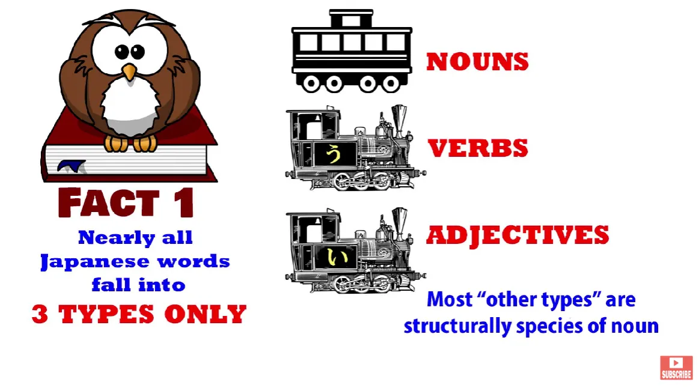
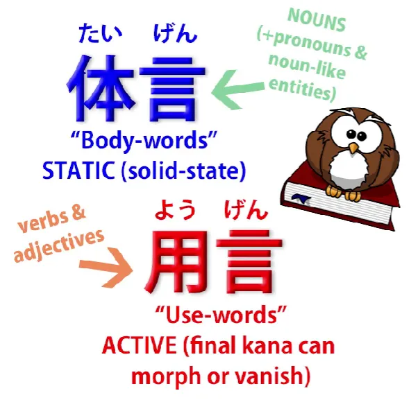
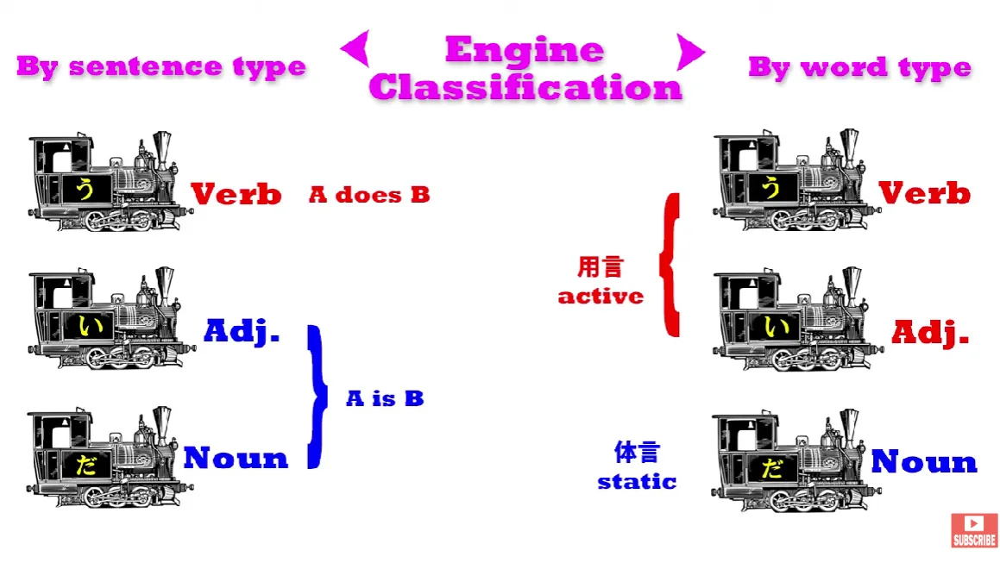

# **55. Rahasia partikel &quot;で&quot;. Mengapa kita mengatakan &quot;みんなで行く&quot;? dan &quot;世界で一番&quot;?**

[**Rahasia partikel &quot;で&quot;. Mengapa kita mengatakan &quot;みんなで行く&quot;? dan &quot;世界で一番&quot;? | Pelajaran 55**](https://www.youtube.com/watch?v=OiKgudW9xB8&amp;list;=PLg9uYxuZf8x_A-vcqqyOFZu06WlhnypWj&amp;index;=57&amp;pp;=iAQB)

こんにちは。

Hari ini kita akan menggali lebih dalam beberapa aspek struktur bahasa Jepang. Saya akan membahas beberapa aspek partikel &quot;で&quot; yang belum kita bahas sejauh ini, dan untuk melakukannya, kita perlu mempelajari beberapa konsep struktural baru yang belum kita pertimbangkan hingga saat ini. Kita belum membahasnya sebagian karena Anda bisa belajar bahasa Jepang tingkat dasar cukup jauh tanpa mengetahuinya, tetapi seiring kita memasuki area yang lebih kompleks, ada baiknya kita memiliki alat-alat ini dalam kotak peralatan kita.

Jadi, mari kita mulai.

Seperti yang telah saya katakan sebelumnya, hampir semua kata dalam bahasa Jepang terbagi menjadi tiga jenis, yaitu kata benda, kata kerja, dan kata sifat.

Ada beberapa kata yang berada di luar ketiga kategori ini, tetapi jumlahnya tidak banyak. Sebagian besar hal yang bukan kata kerja dan kata sifat ternyata adalah kata benda.

## 体言 &amp; 用言

Namun, ada cara lain untuk membagi kata-kata dalam bahasa Jepang yang digunakan dalam tata bahasa Jepang, yaitu menjadi <code>体言</code> dan <code>用言</code>, yang secara harfiah berarti <code>body words</code> dan <code>use words</code>, tetapi istilah yang akan saya gunakan adalah <code>static words</code> atau <code>static elements</code> dan <code>active words</code> atau <code>active elements</code>.

Sekarang, kata-kata statis atau kata-kata inti pada dasarnya bermuara pada kata benda, jadi dalam arti tertentu hal ini menekankan struktur bahasa Jepang yang berpusat pada kata benda, karena kita membaginya menjadi kata benda dan sisanya, yaitu dua jenis lainnya. Dan sangat mudah untuk melihat bagaimana hal ini bekerja. Yang <code>active words</code> yang kami maksud adalah kata-kata yang dapat berubah bentuk, yang dapat memodifikasi.

Dan hal itu berlaku baik untuk kata sifat maupun kata kerja. Dan sebenarnya keduanya berubah bentuk dengan cara yang sangat mirip. Dalam kedua kasus tersebut, bagian yang berubah bentuk selalu merupakan kana terakhir dari kata tersebut.

Dan kita tahu bahwa baik kata kerja maupun kata sifat harus selalu diakhiri dengan kana. Mereka tidak bisa seluruhnya kanji, jika tidak, mereka akan menjadi kata benda. Semua kata kerja diakhiri dengan kana baris う; semua kata sifat diakhiri dengan kana い. Dan itulah bagiannya, dan satu-satunya bagian, yang berubah.

Pada kata kerja godan, kana baris う berubah menjadi setaraannya di salah satu baris lain. Jadi, -す dapat menjadi -さ, -し, -せ, atau -そ. Sedangkan kata kerja ichidan hanya menghilangkan -る.

Kata kerja juga dapat berubah menjadi bentukて, dan sekali lagi ini pada dasarnya merupakan masalah mengubah atau menghilangkan kana akhir dan menambahkan -て atau で. Dan tentu saja hal yang sama berlaku untuk bentukた.

Kata sifat dapat mengubah -い menjadi -く, -か, atau -け, sehingga kita dapat memiliki <code>美味しく</code>, <code>美味しかった</code> atau <code>美味しければ</code>. Atau kita bisa menghilangkan -い sama sekali dan menambahkan sesuatu yang lain, seperti misalnya dalam <code>美味しそう</code>.

---

Sebaliknya, kata benda sama sekali tidak dapat dimodifikasi. Anda tidak dapat melakukan apa pun terhadap kana terakhir dari sebuah kata benda atau bagian lain dari kata benda tersebut dalam hal modifikasi tata bahasa.

Namun, Anda dapat menambahkan Partikel logis ke kata benda dan Anda juga dapat menambahkan kopula <code>だ</code> atau <code>です</code> pada kata benda. Jadi, kita memiliki dua kelompok kata: <code>用言</code>, kata-kata aktif yang dapat dimodifikasi dengan mengubah kana terakhir dan menambahkan sesuatu, tetapi Anda tidak dapat menambahkan Partikel logis atau kopula ke kata-kata ini,

---

dan kata benda serta kata ganti dan entitas lain yang mirip kata benda, <code>体言</code> atau kata-kata statis, yang tidak dapat Anda modifikasi tetapi Anda dapat menambahkan Partikel logis atau kopula.

Dan penting untuk dipahami bahwa ketika kita menambahkan Partikel logis atau kopula ke sebuah kata benda, kita menganggap kedua hal tersebut yang digabungkan sebagai satu kesatuan.

---

Jadi misalnya ketika kita menambahkan kopula lunak <code>な</code> ke kata benda yang berfungsi sebagai kata sifat seperti <code>綺麗/きれい</code> kita mendapatkan <code>綺麗な</code>, dan <code>綺麗な</code> dianggap sebagai satu kesatuan tersendiri.

Dan sebenarnya kesatuan tersebut *dapat* disebut sebagai <code>な-adjective</code>, karena <code>綺麗</code> ditambah <code>な</code> atau <code>だ</code> menjadi satuan kata sifat. Jadi, meskipun saya sangat menentang istilah <code>な-adjective</code> seperti yang digunakan oleh buku teks Barat, yang artinya mereka akan mengatakan bahwa <code>綺麗</code> adalah <code>な-adjective</code>, dan sebenarnya bukan
— itu adalah kata benda, bukan kata sifat apa pun — kita bisa mengatakan bahwa <code>綺麗な</code> atau <code>綺麗だ</code> adalah kata sifat &quot;な&quot;.

Saya tidak akan merekomendasikannya, hanya karena istilah ini begitu disalahgunakan dalam apa yang disebut tata bahasa Jepang Barat sehingga lebih baik dibiarkan saja. Istilah ini memiliki nama dalam bahasa Jepang, tetapi karena akan memakan waktu cukup lama untuk menjelaskannya, saya tidak akan membahasnya di sini. Namun, ini sama sekali tidak mirip dengan <code>な-adjective</code>.

---

Sekarang, hal lain yang perlu dipahami adalah bahwa ketika kita menempelkan kopula ke sebuah kata benda, kombinasi tersebut sebenarnya merupakan <code>用言</code> atau unit aktif.

Dan itu jelas, karena begitu Anda menempelkan kopula padanya, kita sebenarnya dapat memodifikasinya. Kopula memiliki bentuk &quot;て&quot;, yaitu <code>で</code>, sehingga <code>綺麗な</code> dapat menjadi <code>綺麗で</code> untuk menggabungkannya dengan sesuatu yang lain.

Kita juga dapat memodifikasi <code>綺麗だ</code> menjadi, katakanlah, <code>綺麗だった</code>. Jadi, begitu kita menempelkan kopula ke sebuah kata benda, kita memiliki <code>用言</code>, sebuah unit aktif, dan seperti yang pasti sudah Anda pahami sekarang, ini berarti bahwa ketiga engine, tiga cara yang mungkin untuk mengakhiri kalimat, semuanya <code>用言</code>, atau unit aktif.

Inilah tiga engine yang mungkin ada dalam sebuah kalimat dan mereka juga merupakan tiga kemungkinan <code>用言</code>. Kita cenderung menyebutnya <code>用言</code> ketika mereka memodifikasi sesuatu yang lain, ketika mereka berada di dalam kalimat.

Jadi, dengan informasi ini, kita sekarang dapat melihat lebih dalam partikelで

.

## Melihat lebih dalam partikelで

Ketika saya memperkenalkannya dalam video tentang partikel logis[[8b]](./8b-particles-explained.md)

, saya mengatakan bahwa partikel ini, seperti partikel logis lainnya selainが

(yang, tentu saja, ada di setiap kalimat) danの

(yang merupakan Partikel logis, tetapi tidak memberitahu kita apa yang dilakukan kata benda tersebut dalam kaitannya dengan aksi kalimat; melainkan memberitahu kita tentang kata benda tersebut dalam kaitannya dengan kata benda lain), tetapi partikel-partikel lainnya, termasukで

, saya katakan, hanya aktif dalam kalimat A-melakukan-B, yaitu kalimat verba.

Nah, itu agak terlalu disederhanakan. Ada cara lain di mana partikel-partikel tersebut dapat berfungsi. Tidak menjadi masalah besar jika kita belum mengetahuinya di awal, tetapi seiring kemajuan kita, kita perlu memahami hal ini.

Dan untuk memahaminya, kita perlu mengingat apa yang baru saja kita pelajari. Kita perlu mengetahui tentang <code>体言</code> dan <code>用言</code>, elemen statis dan aktif.

Karena **kenyataannya bukanlah** bahwa &quot;で&quot; benar-benar terbatas pada kalimat verba, kalimat &quot;A-does-B&quot;, meskipun sebagian besar waktu memang demikian. Yang menjadi batasan sebenarnya adalah klausa yang memodifikasi <code>用言</code>. Dan <code>用言</code>, seperti yang kita ketahui, bisa berupa kata kerja, tetapi juga bisa berupa kata sifat atau bahkan kata benda yang berfungsi sebagai kata sifat ditambah kopula.

Dan ada beberapa kasus di mana hal ini terjadi. Jadi, apa sebenarnya yang dilakukan oleh で?

Nah, seperti yang kita ketahui, ada tiga partikel logis posisional, yaitu partikel penargetan &quot;に&quot; (yang memberitahu kita ke mana sesuatu pergi atau di mana letaknya, di mana ia tinggal setelah sampai di sana), ada &quot;へ&quot;, yang merupakan Partikel penunjuk arah, dan ada &quot;で&quot;. Dan apa yang sebenarnya dilakukan oleh &quot;で&quot; adalah memberitahu kita batas atau batas di mana sesuatu terjadi.

Biasanya itu adalah batas fisik, area fisik, meskipun tidak selalu harus demikian. Jadi, &quot;に&quot; menunjukkan ke mana suatu benda (orang, hewan, benda) menuju atau di mana lokasinya; &quot;へ&quot; menunjukkan arah ke mana ia pergi; &quot;で&quot; menunjukkan batas di mana suatu tindakan atau keadaan terjadi. Biasanya itu adalah suatu tindakan, jadi begitulah cara kita memperkenalkannya, tetapi bisa juga berupa keadaan.

Dengan kata lain, **bisa juga berfungsi sebagai kata sifat.**

Jadi, misalnya, mari kita ambil frasa <code>世界で一番美味しいラーメン</code>. Sekarang, orang akan bertanya, <code>Why で? Why are we using で in this case?</code> Dan jawabannya adalah bahwa <code>世界で</code> — dan ingat bahwa kita selalu memperlakukan Partikel logis ditambah kata benda yang menyertainya sebagai satu kesatuan — <code>世界で</code> menentukan batas di mana sesuatu terjadi, tetapi dalam kasus ini, partikel tersebut menentukan batas di mana suatu keadaan berlaku.

Jadi, yang kita bicarakan <code>the most delicious ramen in the world</code>. <code>The world/**世界**</code> adalah batas yang kita terapkan. Dan dalam hal ini, tentu saja, dengan <code>the world</code> kita berusaha memberikan batas seluas mungkin.

Namun, kita mungkin mengatakan, <code>この町で一番美味しいラーメン</code> dan kemudian kita mengatakan <code>the most delicious ramen in this town</code>. Jadi, kita telah menggambar batas di sekelilingnya. Kita tidak mengatakan bahwa ini adalah ramen paling lezat yang mungkin ada, tetapi kita mengatakan bahwa dalam batas-batas tertentu, dalam batas-batas kota ini, ini adalah ramen paling lezat.

Jadi **itulah yang dilakukan oleh kata sifat penentu (で)**. Sama seperti pada sebuah tindakan yang memberitahu kita di mana tindakan itu terjadi, lokasinya, batas di mana tindakan itu terjadi, dengan jenis kata sifat lainnya <code>用言</code>, yaitu kata sifat, ia memberi tahu kita batas di mana kualitas kata sifat tersebut berlaku.

---

Sekarang, kita juga bisa mengatakan <code>世界の一番美味しいラーメン</code>. Itu kurang umum digunakan, tetapi bisa saja dikatakan. Dan artinya adalah <code>the most delicious ramen of the world</code>, tetapi poin yang perlu dipahami di sini adalah bahwa &quot;で&quot; menggambarkan batas-batas dari <code>用言</code>, unsur aktif, kata kerja atau dalam hal ini kata sifat; **の melakukan hal yang berbeda.**

Kita tahu apa yang dilakukan oleh の: ia menghubungkan satu kata benda dengan kata benda lainnya. Jadi ia tidak memodifikasi kualitas <code>美味しい</code>, seperti yang dilakukan oleh で. Ia memodifikasi <code>ラーメン</code>.

---

Dan karena hal ini **kita juga bisa mengatakan** <code>このラーメンは世界で一番美味しい</code> — kita mengatakan <code>This ramen is the most delicious in the world.</code>

Tetapi kita **tidak bisa** mengatakan <code>このラーメンは世界の一番美味しい</code>

Mengapa kita tidak bisa? Karena, seperti yang kita ketahui dari pelajaran tentang urutan kata[[46]](./46-word-order-matters-2-simple-rules-to-crack-tough-sentences.md)

, dalam bahasa Jepang kata-kata hanya memodifikasi kata-kata yang berada di belakangnya. Kata-kata tersebut tidak dapat memodifikasi kata-kata yang berada di depannya.

Dan karenaの

tidak dapat memodifikasi <code>美味しい</code>, maka kata tersebut hanya dapat memodifikasi <code>ラーメン</code>, yang merupakan kata benda lain, dan karena <code>ラーメン</code> berada di sisi yang salah, kita sebenarnya tidak bisa menggunakan itu. Jadi kita harus mengatakan <code>このラーメンは世界で一番美味しい</code>, karena で menetapkan batas di mana <code>美味しい</code> berlaku.

---

Sekarang, karena kita tahu bahwa kata benda ditambah kata hubung juga berfungsi sebagai <code>用言</code>, sebuah unsur aktif, kita juga bisa mengatakan <code>世界で一番有名なアンドロイド</code>. Dan dalam hal ini, <code>世界で</code> sedang memodifikasi <code>有名な</code>. Ia tidak dapat memodifikasi <code>有名</code> sendiri, karena <code>有名</code> adalah kata benda, tetapi dapat memodifikasi <code>有名な</code>.

Jadi, hal ini memberi tahu kita batasan di mana ketenaran ini berlaku. <code>She&#x27;s the most famous android in the world</code>. Dia mungkin bukan android paling terkenal di Tata Surya, tetapi dia adalah android paling terkenal di dunia.

Hal yang sama terjadi ketika kita mengatakan sesuatu seperti <code>みんなで踊る</code> — <code>we all dance</code>. Mengapa kita mengatakan <code>みんなで</code>? Nah, jika kita mengatakan <code>二人で踊る</code>, kita berarti <code>two of us dance</code>. Jika kita mengatakan <code>一人で踊る</code>, kita berarti <code>dance alone</code>.

Kalimat kuantitatif ditambah kata &quot;で&quot; menggambarkan batasan orang-orang yang melakukannya. Jadi, seperti yang saya katakan sebelumnya, batas, area, atau demarkasi yang digambarkan oleh &quot;で&quot; bagi kita biasanya bersifat fisik, yaitu sebuah tempat.

Jika kita mengatakan <code>部屋で踊る</code>, kita berarti <code>I dance in the room.</code> **Tapi** jika kita mengatakan <code>一人で踊る</code>, kita sedang mengatakan <code>I dance alone.</code> Dalam kedua kasus tersebut, kita menggambar batas untuk menyatakan apa saja batas-batasnya. Batas fisik adalah ruangan, sedangkan batas numerik atau kuantitatif adalah <code>一人</code>, <code>二人</code>, <code>みんな</code> dll.
