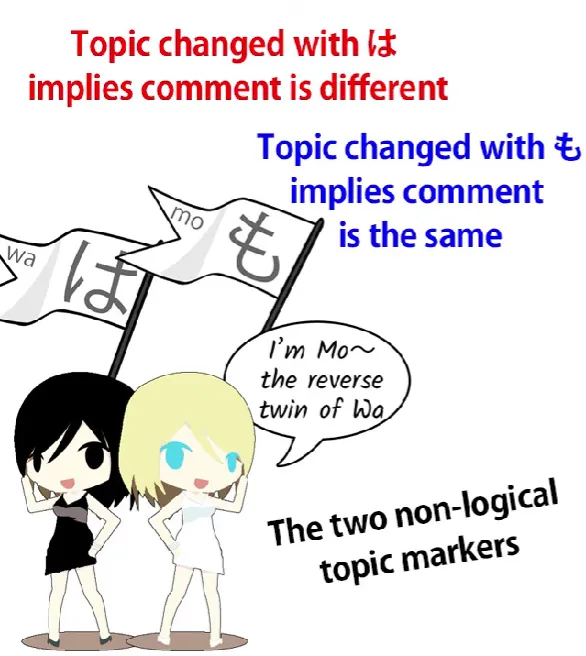
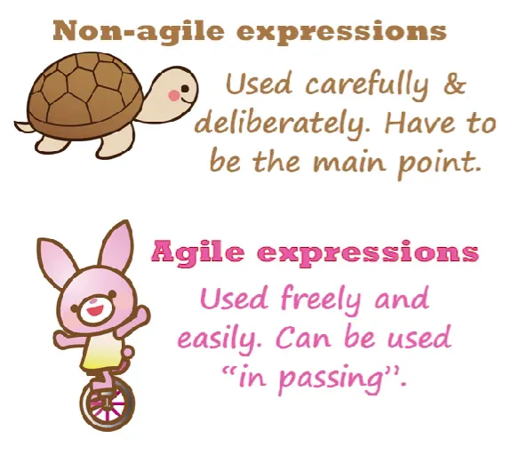

# **56. <code>Agility</code>: Rahasia lebih dalam partikel は dan の**

[**<code>Agility</code>: Faktor Bahasa Penting yang Tak Pernah Dibicarakan. Rahasia lebih dalam partikel は dan の| Pelajaran 56**](https://www.youtube.com/watch?v=FdMeXqweBJ0&amp;list;=PLg9uYxuZf8x_A-vcqqyOFZu06WlhnypWj&amp;index;=58&amp;pp;=iAQB)

こんにちは。

Hari ini kita akan membahas topik yang jarang dibahas, yaitu kelincahan dalam bahasa. Dan saya tidak sedang membicarakan kemampuan saya atau kemampuan Anda dalam bahasa. Saya sedang membicarakan kelincahan bahasa itu sendiri, kemampuan bahasa untuk mengekspresikan hal-hal tertentu dengan cara yang efisien dan gesit, yang sulit dilakukan oleh bahasa lain.

Dan ini penting karena ketika bahasa memiliki kelincahan yang lebih besar dalam bentuk-bentuk ekspresi tertentu, mereka menggunakannya dengan cara yang tampak cukup asing dan aneh bagi orang-orang yang bahasanya tidak dapat menangani bentuk-bentuk ekspresi tersebut dengan cara yang sama lincahnya. Dan hal ini sering membuat pelajar cukup bingung mengenai apa yang terjadi dalam banyak kalimat.

Jadi, saya akan memulai dengan salah satu penyebab paling mendasar dan struktural dari masalah ini, yaitu partikel penanda topik &quot;は&quot;.

## Partikel &quot;は&quot;

Setelah orang memahami bahwa &quot;は&quot; adalah penanda topik dan selalu berfungsi sebagai penanda topik, mereka sering mulai bertanya, &quot;Nah, mengapa kita menggunakan penanda topik? Mengapa kita mengatakan &#x27;seperti halnya apel ini&#x27; di tempat-tempat yang tampaknya benar-benar bukan sesuatu yang akan kita lakukan dalam bahasa Inggris atau banyak bahasa lain?&quot;

Nah, alasan untuk hal ini tentu saja berkaitan dengan fakta bahwa bahasa Jepang adalah apa yang oleh ahli bahasa disebut <code>a topic-prominent language</code>. Struktur topik-komentar sangat mendasar bagi bahasa Jepang, tidak seperti dalam bahasa Inggris, dan saya akan membahasnya lebih panjang lebar dalam video mendatang. Namun saat ini yang ingin saya bahas adalah bagaimana hal ini memengaruhi masalah kelincahan, bagaimana hal ini menjadikan pembentukan topik sebagai operasi yang sangat ringan, sangat lincah, dan sangat gesit, yang tidak terjadi dalam bahasa lain, seperti bahasa Inggris.

Jadi, saya akan memperkenalkan kembali sebuah kalimat yang saya gunakan dalam pelajaran tingkat lanjut pertama saya mengenai penggunaan partikel &quot;は&quot;, yaitu: <code>アフリカはライオンはいるがトラはいない</code> Sekarang, seperti yang Anda lihat, ada tiga &quot;は&quot; dalam kalimat yang sangat pendek ini, dan semuanya memang penanda topik, karena &quot;は&quot; **selalu** merupakan penanda topik. Saya sudah menjelaskan apa yang terjadi, tetapi kita akan melihat hal ini dari sudut pandang kelincahan.

Yang terjadi, tentu saja, adalah bahwa &quot;は&quot; yang pertama adalah penanda topik keseluruhan. Artinya <code>アフリカは...</code> — <code>Speaking of Africa...</code> dan segala sesuatu yang mengikuti akan menjadi komentar mengenai topik Afrika.

Apa yang mengikuti topik yang ditandai dengan &quot;は&quot; harus berupa klausa logis. Tidak masalah seberapa kecilnya, tetapi harus berupa klausa logis. Dan harus mengandung kedua unsur yang diperlukan dari sebuah klausa logis, sama seperti klausa logis lainnya.

Yang kita miliki di sini sebenarnya adalah kalimat logis yang terdiri dari dua klausa logis, dan masing-masing mengandung apa yang bisa kita sebut subtopik. Artinya, setiap klausa logis itu sendiri juga didahului oleh pernyataan topik.

Jadi, jika kita menuliskannya secara lengkap, akan menjadi <code>アフリカはライオンは**zeroが**いるがトラは**zeroが**いない</code> Jadi, kedua klausa logis tersebut adalah <code>zeroがいる</code> dan <code>zeroがいない</code>, tetapi keduanya menyatakan subtopiknya masing-masing.

Jadi, mengapa mereka melakukannya? Nah, kita sudah tahu ini. Itu karena &quot;は&quot; digunakan untuk membedakan hal-hal.

Jadi, yang kita katakan di sini adalah &quot;Berbicara tentang Afrika, berbicara tentang singa, mereka ada, tetapi berbicara tentang harimau, mereka tidak ada.&quot; Sekarang, saya pikir kita bisa melihat bagaimana ini bekerja dalam bahasa Inggris dan bagaimana ia menggunakan penanda topik untuk membedakan dua keadaan yang berbeda.

Tapi ini bukanlah sesuatu yang akan kita katakan dalam bahasa Inggris. Mengapa tidak? Karena <code>speaking of</code> dalam bahasa Inggris sama sekali tidak fleksibel. Ini menciptakan cara yang cukup dramatis, berat, dan rumit untuk memperkenalkan suatu topik.

Kita tidak bisa terus-menerus mengatakan <code>speaking of</code> dalam sebuah kalimat, karena <code>speaking of</code> dan berbagai cara lain yang kita gunakan untuk memperkenalkan topik dalam bahasa Inggris juga tidak fleksibel. Penanda topik dalam bahasa Jepang (は) sangat, sangat fleksibel. Kita bisa dengan bebas memasukkannya di mana saja untuk membuat pembedaan seperti ini, karena &quot;は&quot; membedakan hal-hal.

Ketika kita mengganti topik menggunakan &quot;は&quot;, kita secara implisit mengatakan bahwa komentar pada topik baru berbeda dari komentar pada topik lama. Jika kita ingin mengatakan bahwa komentarnya sama, maka kita harus menggunakan penanda topik lainnya, も.

Dan kalimat ini sebenarnya memperkuat hal tersebut dengan memberikan は pada kedua klausa logis yang digabungkan. Jadi, kita mengatakan <code>speaking of lions...</code> topik ini memiliki komentar yang berbeda dari topik lain yang mungkin berada di dekatnya. Namun <code>speaking of lions, they exist</code>, dan kemudian <code>speaking of tigers...</code> topik ini juga memiliki komentar yang akan berbeda dari komentar pada topik terdekat mana pun: <code>they don&#x27;t exist</code>.

Sekarang, seperti yang Anda lihat, ini adalah proses yang sangat rumit jika kita memikirkannya dalam bahasa Inggris. Namun, jika kita memahaminya dalam bahasa Jepang, jika kita tahu bagaimana partikel &quot;は&quot; digunakan dengan ringan, mudah, dan lincah dalam situasi semacam ini, hal itu tidak lagi menjadi masalah.

## Partikel &quot;の&quot;

Sekarang, area lain di mana kita sering bingung karena kelincahan unsur bahasa Jepang dibandingkan dengan cara kita menirunya dalam bahasa Inggris adalah partikel &quot;の&quot;, yang disebut &quot;の&quot; nominalisasi, yang bertindak sebagai kata ganti dan mengikat semua yang ada di depannya, semua yang memodifikasinya, ke dalam kotak kata benda, menjadi entitas tunggal yang mirip kata benda.

Dan salah satu pendukung saya mengajukan pertanyaan ini kepada saya, dan ini adalah kalimat pendek yang seharusnya cukup sederhana, tetapi pendukung saya merasa hal ini cukup sulit, dan saya rasa banyak orang yang merasa hal semacam ini cukup sulit. Bukan karena sulit, bukan karena strukturnya memang sulit dianalisis, tetapi karena hal ini sangat berbeda dengan apa yang akan kita lakukan dalam bahasa Inggris atau banyak bahasa lain, dalam keadaan yang sama.

Jadi, ini berasal dari lagu Disney, <code>The Bells of Notre Dame</code>, dan baris pertamanya adalah <code>朝のパリに響くのは鐘だよ</code>.

Jadi, seperti yang Anda lihat, ini adalah kalimat yang cukup pendek dan tampak sederhana. Tapi apakah Anda bisa melihat di mana letak A dan B dari kalimat ini? Pengguna saya menyarankan bahwa ini berarti <code>A bell resounds in morning Paris</code> dan itu lebih mirip dengan apa yang akan kita katakan dalam bahasa Inggris.

Namun, kita dapat melihat bahwa ini sebenarnya adalah kalimat A-is-B dan kita juga dapat melihat bahwa kalimat ini memiliki topik yang ditandai dengan &quot;は&quot; serta topik yang ditandai dengan &quot;は&quot; terletak cukup dekat dengan akhir kalimat. Jadi, struktur logis A-is-B harus berada setelah topik yang ditandai dengan &quot;は&quot;.

Lalu, apa topik yang ditandai dengan &quot;は&quot;? **Topik yang ditandai dengan &quot;は&quot; adalah <code>朝のパリに響くの</code>.** Jadi, &quot;の&quot; mencakup sisanya, <code>in morning-Paris-resoundsの</code>, dengan kata lain <code>that which resounds in morning Paris</code>.

Dan tentu saja kita harus memiliki subjek yang ditandai dengan が yang telah didefinisikan untuk kita oleh の tersebut. Jadi, <code>that which resounds in morning Paris, it is (or they are) bells, よ.</code>

Lalu mengapa hal ini disusun seperti ini? Anda mungkin berkata, karena memang bisa begitu. Dalam bahasa Inggris, hal ini sulit. Dalam bahasa Inggris, <code>that which resounds in morning Paris, that&#x27;s bells</code> sama sekali tidak terdengar alami.

Dan alasannya adalah karena menyusun topik seperti <code>that which resounds in morning Paris</code> tidaklah mudah dalam bahasa Inggris. Tidak fleksibel; rumit; besar; lamban. Namun dalam bahasa Jepang, kita melakukannya setiap saat.

Kita mengatakan hal-hal seperti <code>That which she saw when she went into the room was...</code> Sekarang, dalam bahasa Inggris kita lebih cenderung mengatakan <code>When she went into the room she saw...</code> atau <code>In Paris in the morning bells resound throughout the city.</code>

Jika kita ingin menggunakan <code>that which...</code> jenis struktur ini, kita harus sudah mempersiapkannya terlebih dahulu. Jika, misalnya, kita telah menghabiskan waktu untuk membangun fakta bahwa dia gugup tentang apa yang akan dia lihat saat membuka pintu dan melihat ke dalam ruangan, maka kita bisa mengatakan <code>What she saw when she looked in the room was...</code>

Tapi kita perlu mempersiapkannya terlebih dahulu. Kita perlu melakukan persiapan tertentu untuk menggunakan bentuk tersebut, karena struktur ini tidak fleksibel. Ini bukan hal yang ringan yang bisa kita selipkan begitu saja di mana saja.

Di sisi lain, bahasa Jepang dapat menggunakan ini sebagai teknik naratif, membangun antisipasi terhadap apa yang dia lihat dan menyelesaikannya dengan sangat cepat dalam satu kalimat pendek tanpa membuat keributan, karena ini adalah formula verbal yang ringan dan fleksibel.

Dan karena itu, Anda akan menemukannya di mana-mana dalam bahasa Jepang, jadi Anda perlu terbiasa dengannya. Namun, poin penting dari pelajaran ini sebenarnya adalah konsep kelincahan itu sendiri,

karena kita akan menemui dalam bahasa Jepang seiring berjalannya waktu berbagai kasus di mana bahasa Jepang menggunakan strategi ekspresi yang mungkin tampak sangat tidak alami dan aneh saat Anda mencoba menerjemahkannya ke dalam bahasa Inggris, karena padanan bahasa Inggrisnya tidak lincah sedangkan padanan bahasa Jepangnya sangat lincah dan ringan.

Dan salah satu hal tentang menjadi lincah dan ringan bukanlah sekadar mudah diucapkan, melainkan mudah disisipkan di tengah-tengah kalimat lain. Dengan kata lain, hal itu tidak harus menjadi poin utama dari pernyataan tersebut.

Dalam bahasa Inggris, Anda tidak bisa mengatakan hal-hal seperti <code>speaking of...</code> atau <code>as for...</code> kecuali jika itu akan menjadi poin utama dari pernyataan tersebut. Namun dalam bahasa Jepang Anda bisa melakukannya karena lebih ringan, lebih agile…
